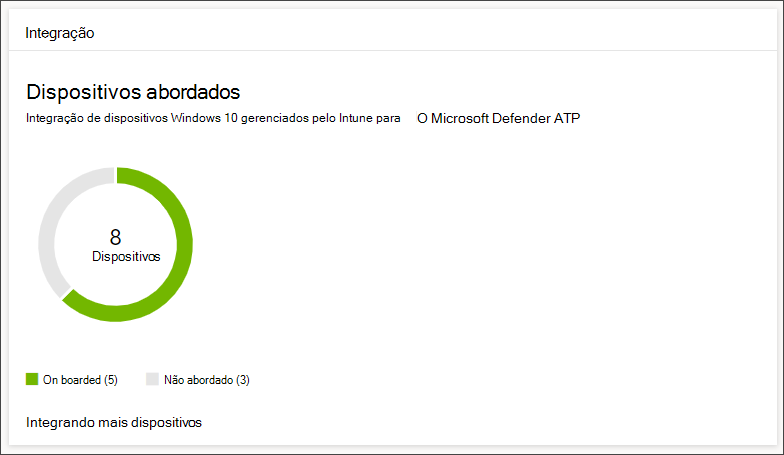
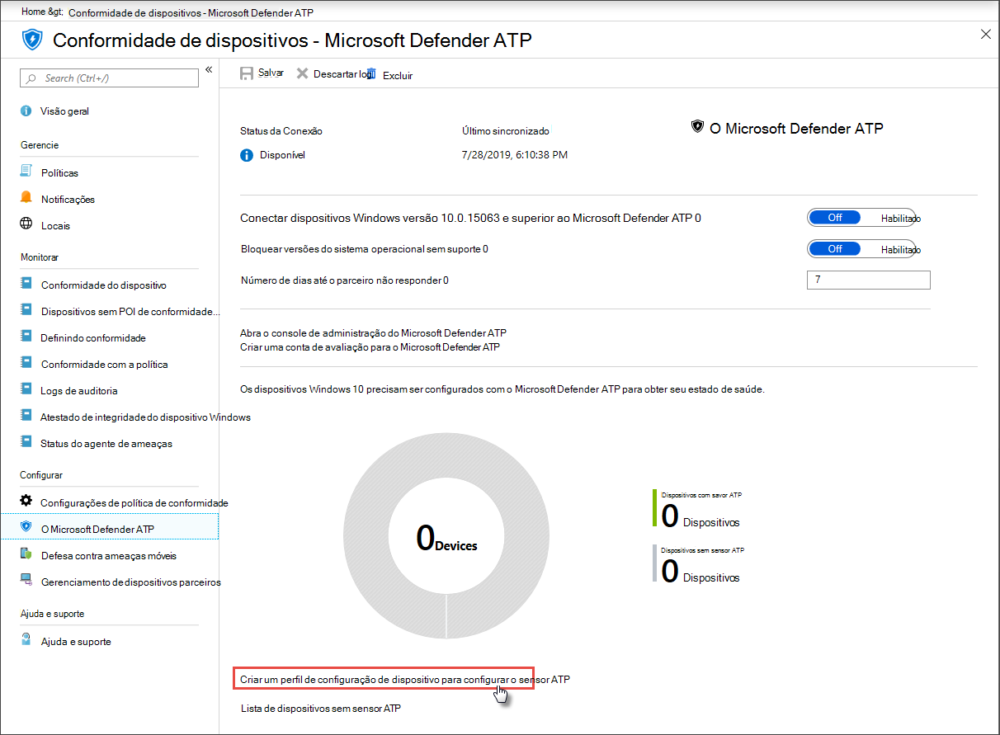

# Obter dispositivos conectados ao Microsoft Defender para Ponto de ExtremidadeGet devices onboarded to Microsoft Defender for Endpoint

[!INCLUDE [Microsoft 365 Defender rebranding](../../includes/microsoft-defender.md)]

**Aplica-se a:****Applies to:**
- [Microsoft Defender para Ponto de ExtremidadeMicrosoft Defender for Endpoint](https://go.microsoft.com/fwlink/p/?linkid=2154037)
- [Microsoft 365 DefenderMicrosoft 365 Defender](https://go.microsoft.com/fwlink/?linkid=2118804)

>Deseja experimentar o Microsoft Defender para Ponto de Extremidade?Want to experience Microsoft Defender for Endpoint? [Inscreva-se para uma avaliação gratuita.Sign up for a free trial.](https://www.microsoft.com/microsoft-365/windows/microsoft-defender-atp?ocid=docs-wdatp-onboardconfigure-abovefoldlink)

Cada dispositivo integrado adiciona um sensor de resposta e detecção de ponto de extremidade adicional (EDR) e aumenta a visibilidade sobre a atividade de violação em sua rede.Each onboarded device adds an additional endpoint detection and response (EDR) sensor and increases visibility over breach activity in your network. A integração também garante que um dispositivo possa ser verificado se há componentes vulneráveis, bem como problemas de configuração de segurança e pode receber ações críticas de correção durante ataques.Onboarding also ensures that a device can be checked for vulnerable components as well security configuration issues and can receive critical remediation actions during attacks.

Antes de rastrear e gerenciar a integração de dispositivos:Before you can track and manage onboarding of devices:
- [Registrar seus dispositivos no gerenciamento do IntuneEnroll your devices to Intune management](configure-machines.md#enroll-devices-to-intune-management)
- [Verifique se você tem as permissões necessáriasEnsure you have the necessary permissions](configure-machines.md#obtain-required-permissions)

## Descobrir e rastrear dispositivos desprotegidosDiscover and track unprotected devices

O **cartão onboarding** fornece uma visão geral de alto nível da sua taxa de integração comparando o número de dispositivos Windows 10 que realmente integraram com o Defender para Ponto de Extremidade em relação ao número total de dispositivos Windows 10 gerenciados pelo Intune.The **Onboarding** card provides a high-level overview of your onboarding rate by comparing the number of Windows 10 devices that have actually onboarded to Defender for Endpoint against the total number of Intune-managed Windows 10 devices.

 
*Cartão mostrando dispositivos conectados em comparação com o número total de dispositivos Windows 10 gerenciados pelo Intune**Card showing onboarded devices compared to the total number of Intune-managed Windows 10 device*

>[!NOTE]
>Se você usou o Security Center Configuration Manager, o script de integração ou outros métodos de integração que não usam perfis do Intune, poderá encontrar discrepâncias de dados.If you used Security Center Configuration Manager, the onboarding script, or other onboarding methods that don’t use Intune profiles, you might encounter data discrepancies. Para resolver essas discrepâncias, crie um perfil de configuração do Intune correspondente para a integração do Defender para Ponto de Extremidade e atribua esse perfil aos seus dispositivos.To resolve these discrepancies, create a corresponding Intune configuration profile for Defender for Endpoint onboarding and assign that profile to your devices.

## Integrar mais dispositivos com perfis do IntuneOnboard more devices with Intune profiles

O Defender para Ponto de Extremidade fornece várias opções convenientes para a [integração de dispositivos Windows 10.](onboard-configure.md)Defender for Endpoint provides several convenient options for [onboarding Windows 10 devices](onboard-configure.md). No entanto, para dispositivos gerenciados pelo Intune, você pode aproveitar os perfis do Intune para implantar convenientemente o sensor Defender para Ponto de Extremidade para selecionar dispositivos, integrando efetivamente esses dispositivos ao serviço.For Intune-managed devices, however, you can leverage Intune profiles to conveniently deploy the Defender for Endpoint sensor to select devices, effectively onboarding these devices to the service.

No cartão **De integração,** selecione **Onboard more devices** to create and assign a profile on Intune.From the **Onboarding** card, select **Onboard more devices** to create and assign a profile on Intune. O link leva você para a página de conformidade do dispositivo no Intune, que fornece uma visão geral semelhante do seu estado de integração.The link takes you to the device compliance page on Intune, which provides a similar overview of your onboarding state.

 
   *Página de conformidade de dispositivos do Microsoft Defender ATP no gerenciamento de dispositivos do Intune**Microsoft Defender ATP device compliance page on Intune device management*

>[!TIP]
>Como alternativa, você pode navegar até a página de conformidade de integração do Defender for Endpoint no portal do [Microsoft Azure](https://portal.azure.com/) a partir de Todos os serviços **> Intune > Conformidade** de dispositivo > Microsoft Defender ATP .Alternatively, you can navigate to the Defender for Endpoint onboarding compliance page in the [Microsoft Azure portal](https://portal.azure.com/) from **All services > Intune > Device compliance > Microsoft Defender ATP**.

>[!NOTE]
> Se você quiser exibir os dados de dispositivo mais atualizados, clique em Lista de dispositivos sem sensor **ATP**.If you want to view the most up-to-date device data, click on **List of devices without ATP sensor**.

Na página de conformidade do dispositivo, crie um perfil de configuração especificamente para a implantação do sensor Defender para Ponto de Extremidade e atribua esse perfil aos dispositivos que você deseja integrar.From the device compliance page, create a configuration profile specifically for the deployment of the Defender for Endpoint sensor and assign that profile to the devices you want to onboard. Para fazer isso, você pode:To do this, you can either:

- Selecione **Criar um perfil de configuração de dispositivo para configurar o sensor ATP** para começar com um perfil de configuração de dispositivo predefinido.Select **Create a device configuration profile to configure ATP sensor** to start with a predefined device configuration profile.
- Crie o perfil de configuração do dispositivo do zero.Create the device configuration profile from scratch.

Para obter mais informações, [leia sobre como usar perfis de configuração](https://docs.microsoft.com/intune/advanced-threat-protection#onboard-devices-by-using-a-configuration-profile)de dispositivo do Intune para integração de dispositivos no Defender for Endpoint .For more information, [read about using Intune device configuration profiles to onboard devices to Defender for Endpoint](https://docs.microsoft.com/intune/advanced-threat-protection#onboard-devices-by-using-a-configuration-profile).

>Deseja experimentar o Microsoft Defender ATP?Want to experience Microsoft Defender ATP? [Inscreva-se para uma avaliação gratuita.Sign up for a free trial.](https://www.microsoft.com/microsoft-365/windows/microsoft-defender-atp?ocid=docs-wdatp-onboardconfigure-belowfoldlink)

## Tópicos relacionadosRelated topics
- [Verificar se os dispositivos estão configurados corretamenteEnsure your devices are configured properly](configure-machines.md)
- [Aumentar a conformidade com a linha de base de segurança do Defender para Ponto de ExtremidadeIncrease compliance to the Defender for Endpoint security baseline](configure-machines-security-baseline.md)
- [Otimizar a implantação e as detecções de regras ASROptimize ASR rule deployment and detections](configure-machines-asr.md)
