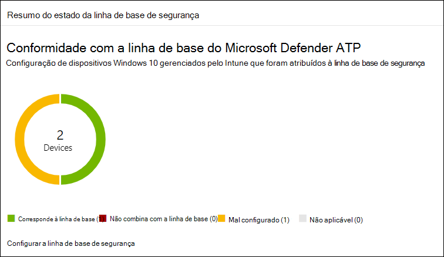
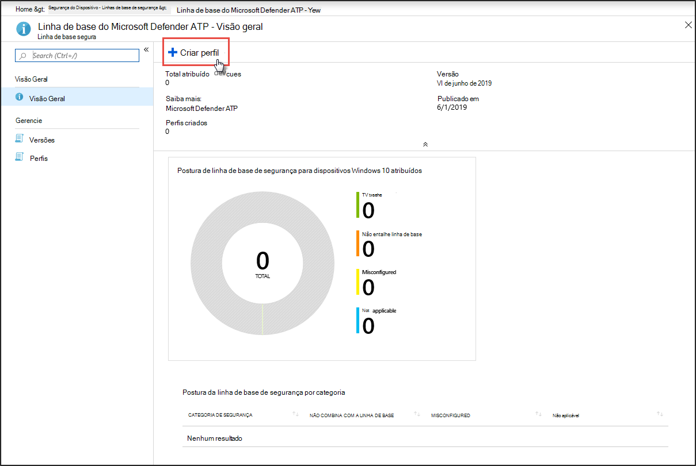
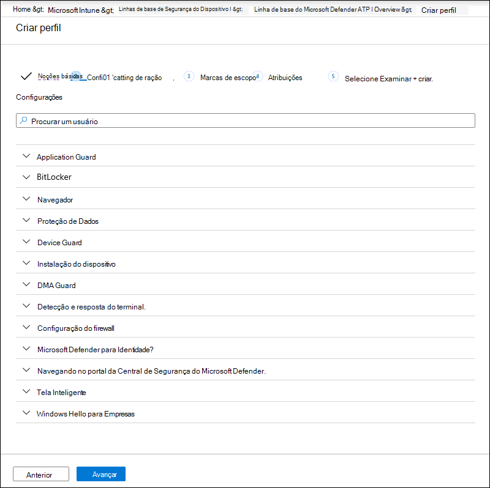
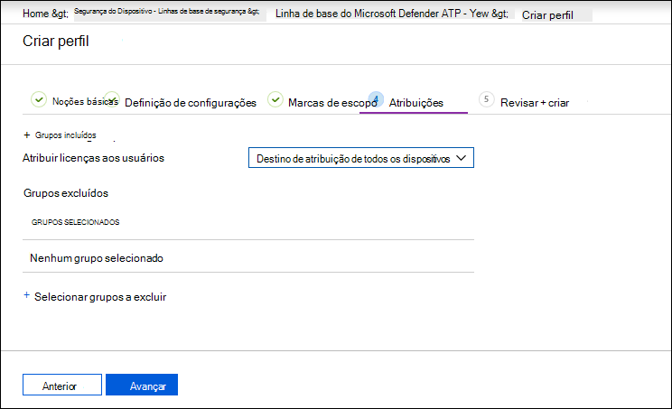
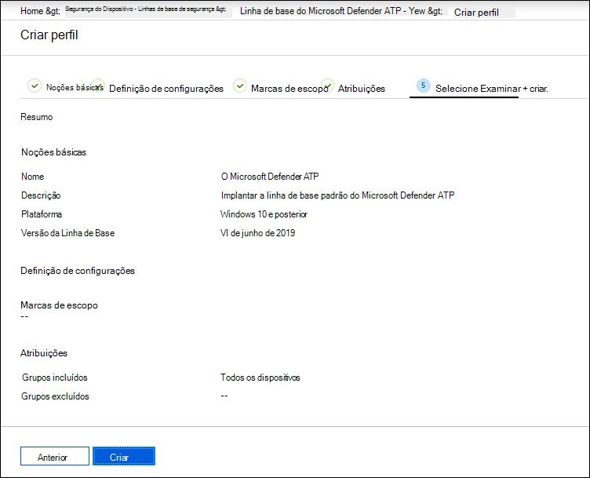

# Aumentar a conformidade com a linha de base de segurança do Microsoft Defender for Endpoint

[!INCLUDE [Microsoft 365 Defender rebranding](../../includes/microsoft-defender.md)]

**Aplica-se a:**
- [Microsoft Defender para Ponto de Extremidade](https://go.microsoft.com/fwlink/p/?linkid=2154037)
- [Microsoft 365 Defender](https://go.microsoft.com/fwlink/?linkid=2118804)

>Deseja experimentar o Defender para Ponto de Extremidade? [Inscreva-se para uma avaliação gratuita.](https://www.microsoft.com/microsoft-365/windows/microsoft-defender-atp?ocid=docs-wdatp-onboardconfigure-abovefoldlink)

As linhas de base de segurança garantem que os recursos de segurança sejam configurados de acordo com as diretrizes de especialistas em segurança e administradores especialistas do sistema Windows. Quando implantada, a linha de base de segurança do Defender for Endpoint define os controles de segurança do Defender para Ponto de Extremidade para fornecer proteção ideal.

Para entender as linhas de base de segurança e como elas são atribuídas no Intune usando perfis de configuração, [leia esta perguntas frequentes](https://docs.microsoft.com/intune/security-baselines#q--a).

Antes de implantar e rastrear a conformidade com as linhas de base de segurança:
- [Registrar seus dispositivos no gerenciamento do Intune](configure-machines.md#enroll-devices-to-intune-management)
- [Verifique se você tem as permissões necessárias](configure-machines.md#obtain-required-permissions)

## Comparar o Microsoft Defender para Ponto de Extremidade e as linhas de base de segurança do Windows Intune
A linha de base de segurança do Windows Intune fornece um conjunto abrangente de configurações recomendadas necessárias para configurar com segurança dispositivos que executam o Windows, incluindo configurações do navegador, configurações do PowerShell, bem como configurações para alguns recursos de segurança, como o Microsoft Defender Antivírus. Por outro lado, a linha de base do Defender for Endpoint fornece configurações que otimizam todos os controles de segurança na pilha do Defender para Ponto de Extremidade, incluindo configurações para detecção e resposta do ponto de extremidade (EDR), bem como configurações também encontradas na linha de base de segurança do Windows Intune. Para obter mais informações sobre cada linha de base, consulte:

- [Configurações de linha de base de segurança do Windows para o Intune](https://docs.microsoft.com/intune/security-baseline-settings-windows)
- [Configurações de linha de base do Microsoft Defender para Ponto de Extremidade para Intune](https://docs.microsoft.com/intune/security-baseline-settings-defender-atp)

O ideal é que os dispositivos que integram o Defender para o Ponto de Extremidade sejam implantados em ambas as linhas de base: a linha de base de segurança do Windows Intune para proteger inicialmente o Windows e, em seguida, a linha de base de segurança do Defender for Endpoint em camadas na parte superior para configurar idealmente os controles de segurança do Defender para Ponto de Extremidade. Para se beneficiar dos dados mais recentes sobre riscos e ameaças e minimizar conflitos à medida que as linhas de base evoluem, sempre aplique as versões mais recentes das linhas de base em todos os produtos assim que eles são lançados.

>[!NOTE]
>A linha de base de segurança do Defender para Ponto de Extremidade foi otimizada para dispositivos físicos e atualmente não é recomendada para uso em pontos de extremidade de máquina virtual (VMs) ou VDI. Determinadas configurações de linha de base podem afetar sessões interativas remotas em ambientes virtualizados.

## Monitorar a conformidade com a linha de base de segurança do Defender para Ponto de Extremidade

O cartão de  linha de **base** de segurança no gerenciamento de configuração de dispositivo fornece uma visão geral da conformidade entre dispositivos Windows 10 que foram atribuídos à linha de base de segurança do Defender para Ponto de Extremidade.

 
*Cartão mostrando conformidade com a linha de base de segurança do Defender para Ponto de Extremidade*

Cada dispositivo recebe um dos seguintes tipos de status:

- **Corresponde à linha** de base — as configurações do dispositivo coincidem com todas as configurações na linha de base
- **Não combina com a linha de** base — pelo menos uma configuração de dispositivo não combina com a linha de base
- **Configurada incorretamente**— pelo menos uma configuração de linha de base não está configurada corretamente no dispositivo e está em conflito, erro ou estado pendente
- **Não aplicável**— Pelo menos uma configuração de linha de base não é aplicável no dispositivo

Para revisar dispositivos específicos, selecione **Configurar a linha de base de segurança** no cartão. Isso o leva ao gerenciamento de dispositivos do Intune. A partir daí, selecione **Status do dispositivo** para os nomes e status dos dispositivos.

>[!NOTE]
>Você pode ter discrepâncias nos dados agregados exibidos na página de gerenciamento de configuração do dispositivo e nas telas de visão geral no Intune.

## Revisar e atribuir a linha de base de segurança do Microsoft Defender para Ponto de Extremidade

O gerenciamento de configuração de dispositivo monitora apenas a conformidade da linha de base de dispositivos Windows 10 que foram especificamente atribuídos à linha de base de segurança do Microsoft Defender para Ponto de Extremidade. Você pode convenientemente revisar a linha de base e atribuí-la a dispositivos no gerenciamento de dispositivos do Intune.

1. Selecione **Configurar a linha de base de** segurança no cartão de linha de **base** de segurança para ir para o gerenciamento de dispositivos do Intune. Uma visão geral semelhante da conformidade da linha de base é exibida.

   >[!TIP]
   > Como alternativa, você pode navegar até a linha de base de segurança do Defender para Ponto de Extremidade no portal do Microsoft Azure a partir de Todos os serviços **> Intune > Linha** de base de segurança de dispositivo > Segurança > linha de base do Microsoft Defender ATP .

2. Crie um novo perfil.

    
   *Visão geral da linha de base de segurança do Microsoft Defender para Ponto de Extremidade no Intune*

3. Durante a criação de perfil, você pode revisar e ajustar configurações específicas na linha de base.

    
   *Opções de linha de base de segurança durante a criação de perfil no Intune*

4. Atribua o perfil ao grupo de dispositivos apropriado.

    
   *Atribuindo o perfil de linha de base de segurança no Intune*

5. Crie o perfil para salvá-lo e implantá-lo no grupo de dispositivos atribuído.

    
   *Criando o perfil de linha de base de segurança no Intune*

>[!TIP]
>As linhas de base de segurança no Intune fornecem uma maneira conveniente de proteger e proteger seus dispositivos de forma abrangente. [Saiba mais sobre linhas de base de segurança no Intune](https://docs.microsoft.com/intune/security-baselines).

>Deseja experimentar o Microsoft Defender para Ponto de Extremidade? [Inscreva-se para uma avaliação gratuita.](https://www.microsoft.com/microsoft-365/windows/microsoft-defender-atp?ocid=docs-wdatp-onboardconfigure-belowfoldlink)

## Tópicos relacionados
- [Verificar se os dispositivos estão configurados corretamente](configure-machines.md)
- [Obter dispositivos conectados ao Microsoft Defender para Ponto de Extremidade](configure-machines-onboarding.md)
- [Otimizar a implantação e as detecções de regras ASR](configure-machines-asr.md)
