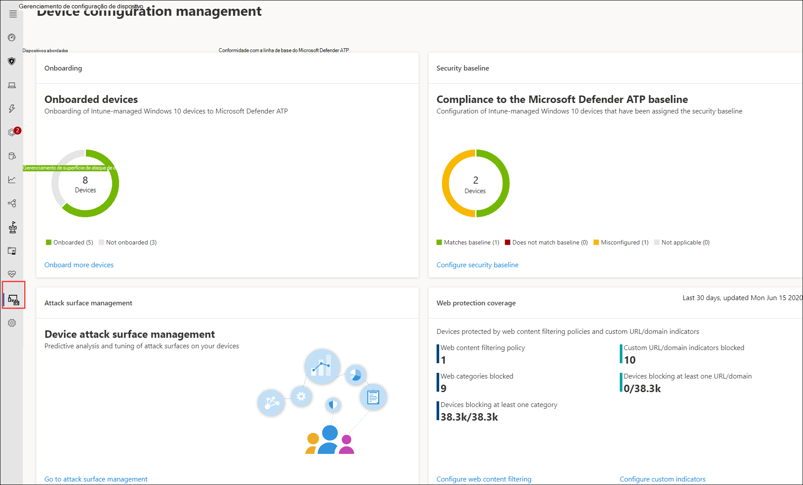
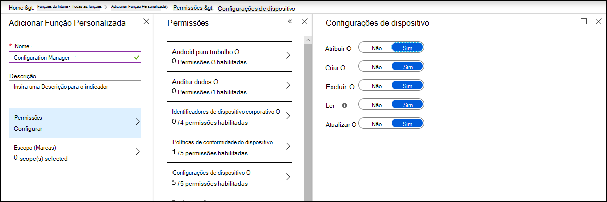

# Verificar se os dispositivos estão configurados corretamente

[!INCLUDE [Microsoft 365 Defender rebranding](../../includes/microsoft-defender.md)]

**Aplica-se a:**
- [Microsoft Defender para Ponto de Extremidade](https://go.microsoft.com/fwlink/p/?linkid=2154037)
- [Microsoft 365 Defender](https://go.microsoft.com/fwlink/?linkid=2118804)

>Deseja experimentar o Defender para Ponto de Extremidade? [Inscreva-se para uma avaliação gratuita.](https://www.microsoft.com/microsoft-365/windows/microsoft-defender-atp?ocid=docs-wdatp-onboardconfigure-abovefoldlink)

Com dispositivos configurados corretamente, você pode aumentar a resiliência geral contra ameaças e aprimorar sua capacidade de detectar e responder a ataques. O gerenciamento de configuração de segurança ajuda a garantir que seus dispositivos:

- Integração ao Microsoft Defender para Ponto de Extremidade
- Atender ou exceder a configuração de linha de base de segurança do Defender for Endpoint
- Ter mitigações de superfície de ataque estratégicas no local

Clique **em Gerenciamento de configuração** no menu de navegação para abrir a página Gerenciamento de configuração do dispositivo.

 
*Página de gerenciamento de configuração de dispositivo*

Você pode rastrear o status de configuração em um nível organizacional e tomar medidas rapidamente em resposta à cobertura de integração ruim, problemas de conformidade e mitigações de superfície de ataque mal otimizadas por meio de links diretos e profundos para páginas de gerenciamento de dispositivos no centro de segurança Microsoft Intune e Microsoft 365.

Ao fazer isso, você se beneficia de:
- Visibilidade abrangente dos eventos em seus dispositivos
- Inteligência de ameaças robusta e tecnologias avançadas de aprendizado de dispositivo para processar eventos brutos e identificar a atividade de violação e os indicadores de ameaça
- Uma pilha completa de recursos de segurança configurados para interromper eficientemente a instalação de implantes mal-intencionados, o seqüestro de arquivos e processos do sistema, a exfiltração de dados e outras atividades de ameaças
- Mitigações otimizadas da superfície de ataque, maximizando as defesas estratégicas contra a atividade de ameaças, minimizando o impacto na produtividade

## Registrar dispositivos no gerenciamento do Intune

O gerenciamento de configuração de dispositivo funciona de perto com o gerenciamento de dispositivos do Intune para estabelecer o inventário dos dispositivos em sua organização e a configuração de segurança da linha de base. Você poderá rastrear e gerenciar problemas de configuração em dispositivos Windows 10 intune.

Antes de garantir que seus dispositivos estão configurados corretamente, inscreva-os no gerenciamento do Intune. O registro do Intune é robusto e tem várias opções de registro para Windows 10 dispositivos. Para obter mais informações sobre as opções de registro do Intune, leia sobre como configurar o registro [para Windows dispositivos](/intune/windows-enroll).

>[!NOTE]
>Para registrar Windows dispositivos no Intune, os administradores já devem ter sido atribuídos licenças. [Leia sobre a atribuição de licenças para registro de dispositivo.](/intune/licenses-assign)

>[!TIP] 
>Para otimizar o gerenciamento de dispositivos por meio do Intune, [conecte o Intune ao Defender para Ponto de Extremidade.](/intune/advanced-threat-protection#enable-windows-defender-atp-in-intune)

## Obter permissões necessárias
Por padrão, somente os usuários que foram atribuídos à função Administrador Global ou Administrador de Serviço do Intune no Azure AD podem gerenciar e atribuir os perfis de configuração de dispositivo necessários para a integração de dispositivos e a implantação da linha de base de segurança.

Se você tiver sido atribuído a outras funções, certifique-se de ter as permissões necessárias:

- Permissões completas para configurações de dispositivo
- Permissões completas para linhas de base de segurança
- Ler permissões para políticas de conformidade de dispositivos
- Permissões de leitura para a organização

 
*Permissões de configuração de dispositivo no Intune*

>[!TIP] 
>Para saber mais sobre a atribuição de permissões no Intune, [leia sobre a criação de funções personalizadas.](/intune/create-custom-role#to-create-a-custom-role)

## Nesta seção
Tópico | Descrição
:---|:---
[Obter dispositivos conectados ao Defender para Ponto de Extremidade](configure-machines-onboarding.md)| Acompanhe o status de integração de dispositivos gerenciados pelo Intune e aborde mais dispositivos por meio do Intune. 
[Aumentar a conformidade com a linha de base de segurança do Defender para Ponto de Extremidade](configure-machines-security-baseline.md) | Acompanhe a conformidade e o descumprimento da linha de base. Implante a linha de base de segurança em mais dispositivos gerenciados pelo Intune.
[Otimizar a implantação e as detecções de regras ASR](configure-machines-asr.md) | Revise a implantação de regras e ajuste as detecções usando ferramentas de análise de impacto Microsoft 365 centro de segurança.

>Deseja experimentar o Defender para Ponto de Extremidade? [Inscreva-se para uma avaliação gratuita.](https://www.microsoft.com/microsoft-365/windows/microsoft-defender-atp?ocid=docs-wdatp-onboardconfigure-belowfoldlink)
