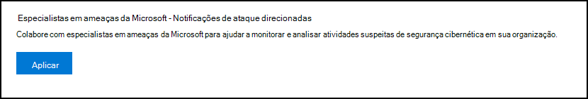
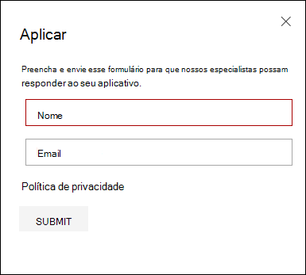
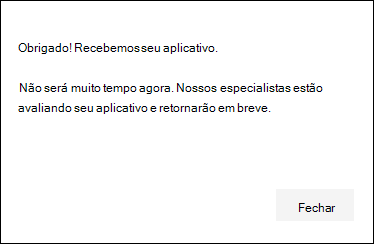
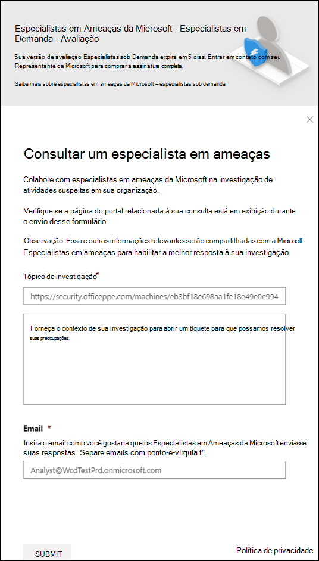
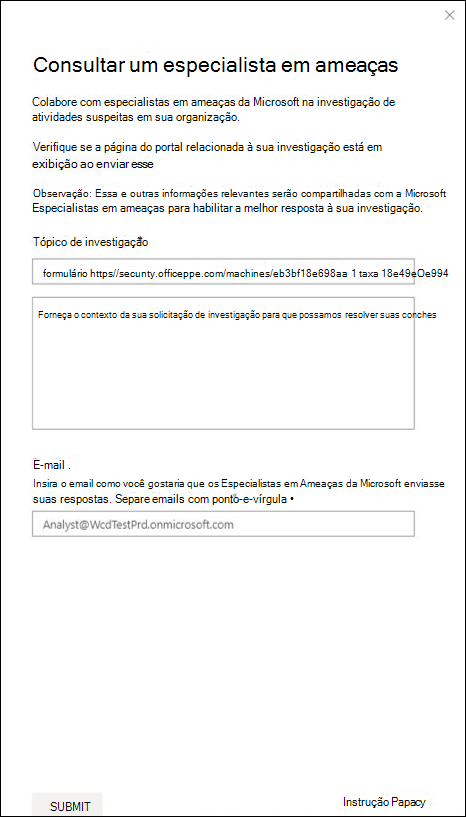

# Configurar e gerenciar recursos de Especialistas em Ameaças da MicrosoftConfigure and manage Microsoft Threat Experts capabilities

[!INCLUDE [Microsoft 365 Defender rebranding](../../includes/microsoft-defender.md)]

**Aplica-se a:****Applies to:**
- [Microsoft Defender para Ponto de ExtremidadeMicrosoft Defender for Endpoint](https://go.microsoft.com/fwlink/p/?linkid=2154037)
- [Microsoft 365 DefenderMicrosoft 365 Defender](https://go.microsoft.com/fwlink/?linkid=2118804)

>Deseja experimentar o Defender para Ponto de Extremidade?Want to experience Defender for Endpoint? [Inscreva-se para uma avaliação gratuita.Sign up for a free trial.](https://www.microsoft.com/microsoft-365/windows/microsoft-defender-atp?ocid=docs-wdatp-assignaccess-abovefoldlink)

## Antes de começarBefore you begin 
> [!NOTE]
> Discutir os requisitos de qualificação com seu provedor de serviços técnicos da Microsoft e a equipe de conta antes de aplicar aos Especialistas em Ameaças da Microsoft - Serviço gerenciado de busca de ameaças de Notificação de Ataque Direcionado.Discuss the eligibility requirements with your Microsoft Technical Service provider and account team before you apply to Microsoft Threat Experts - Targeted Attack Notification managed threat hunting service.

Verifique se você tem o Defender para Ponto de Extremidade implantado em seu ambiente com dispositivos inscritos e não apenas em uma configuração de laboratório.Ensure that you have Defender for Endpoint deployed in your environment with devices enrolled, and not just on a laboratory set-up.

Se você for um cliente do Defender para Ponto de Extremidade, precisará aplicar-se aos Especialistas em Ameaças da Microsoft - Notificações de Ataque Direcionados para obter informações e análises especiais para ajudar a identificar as ameaças mais **críticas,** para que você possa responder a elas rapidamente.If you're a Defender for Endpoint customer, you need to apply for **Microsoft Threat Experts - Targeted Attack Notifications** to get special insights and analysis to help identify the most critical threats, so you can respond to them quickly. Entre em contato com sua equipe de conta ou representante da Microsoft para se inscrever no **Microsoft Threat Experts -** Especialistas sob Demanda para consultar nossos especialistas em ameaças sobre detecções e adversários relevantes.Contact your account team or Microsoft representative to subscribe to **Microsoft Threat Experts - Experts on Demand** to consult with our threat experts on relevant detections and adversaries.

## Aplicar para Especialistas em Ameaças da Microsoft - Serviço de Notificações de Ataques DirecionadosApply for Microsoft Threat Experts - Targeted Attack Notifications service 
Se você já for um cliente do Defender para Ponto de Extremidade, poderá aplicar por meio do Centro de Segurança do Microsoft Defender.If you're already a Defender for Endpoint customer, you can apply through the Microsoft Defender Security Center. 

1. No painel de navegação, vá para Configurações > recursos > recursos avançados > Microsoft Threat Experts - Notificações de **Ataque Direcionadas.**From the navigation pane, go to **Settings > General > Advanced features > Microsoft Threat Experts - Targeted Attack Notifications**.

2. Clique em **Aplicar**.Click **Apply**.

    

3. Insira seu nome e endereço de email para que a Microsoft possa voltar para você em seu aplicativo.Enter your name and email address so that Microsoft can get back to you on your application.

    

4. Leia a [instrução de](https://privacy.microsoft.com/en-us/privacystatement)privacidade e clique **em Enviar** quando terminar.Read the [privacy statement](https://privacy.microsoft.com/en-us/privacystatement), then click **Submit** when you're done. Você receberá um email de boas-vindas depois que seu aplicativo for aprovado.You will receive a welcome email once your application is approved.

    

Quando aceito, você receberá um email de  boas-vindas e verá a alteração do botão Aplicar para uma alternância que está "on".When accepted, you will receive a welcome email and you will see the **Apply** button change to a toggle that is “on”. Caso você queira sair do serviço Notificações de Ataque Direcionado, deslize a alternância "off" e clique em Salvar **preferências** na parte inferior da página.In case you want to take yourself out of the Targeted Attack Notifications service, slide the toggle “off” and click **Save preferences** at the bottom of the page. 

## Onde você verá as notificações de ataque direcionadas de especialistas em ameaças da MicrosoftWhere you'll see the targeted attack notifications from Microsoft Threat Experts 
Você pode receber uma notificação de ataque direcionada dos Especialistas em Ameaças da Microsoft por meio do seguinte meio:You can receive targeted attack notification from Microsoft Threat Experts through the following medium:  
- A página **Incidentes** do portal do Defender para Ponto de ExtremidadeThe Defender for Endpoint portal's **Incidents** page 
- Painel **Alertas** do portal do Defender para Ponto de ExtremidadeThe Defender for Endpoint portal's **Alerts** dashboard  
- API de alerta OData [e API](https://docs.microsoft.com/windows/security/threat-protection/microsoft-defender-atp/get-alerts) [REST](https://docs.microsoft.com/windows/security/threat-protection/microsoft-defender-atp/pull-alerts-using-rest-api)OData alerting [API](https://docs.microsoft.com/windows/security/threat-protection/microsoft-defender-atp/get-alerts) and [REST API](https://docs.microsoft.com/windows/security/threat-protection/microsoft-defender-atp/pull-alerts-using-rest-api)
- [Tabela DeviceAlertEvents](https://docs.microsoft.com/windows/security/threat-protection/microsoft-defender-atp/advanced-hunting-devicealertevents-table) em Busca Avançada[DeviceAlertEvents](https://docs.microsoft.com/windows/security/threat-protection/microsoft-defender-atp/advanced-hunting-devicealertevents-table) table in Advanced hunting
- Seu email, se você optar por configurá-loYour email, if you choose to configure it 

Para receber notificações de ataque direcionadas por email, crie uma regra de notificação de email.To receive targeted attack notifications through email, create an email notification rule.

### Criar uma regra de notificação de emailCreate an email notification rule 
Você pode criar regras para enviar notificações por email para destinatários de notificação.You can create rules to send email notifications for notification recipients. Consulte  [Configure alert notifications](configure-email-notifications.md) to create, edit, delete, or troubleshoot email notification, for details.See  [Configure alert notifications](configure-email-notifications.md) to create, edit, delete, or troubleshoot email notification, for details.

## Exibir a notificação de ataque direcionadaView the targeted attack notification  
Você começará a receber notificação de ataque direcionado dos Especialistas em Ameaças da Microsoft em seu email depois de configurar seu sistema para receber notificação por email.You'll start receiving targeted attack notification from Microsoft Threat Experts in your email after you have configured your system to receive email notification.  

1. Clique no link no email para ir para o contexto de alerta correspondente no painel marcado com **especialistas em ameaças.**Click the link in the email to go to the corresponding alert context in the dashboard tagged with **Threat experts**. 

2. No painel, selecione o mesmo tópico de alerta que você recebeu no email para exibir os detalhes.From the dashboard, select the same alert topic that you got from the email, to view the details.  

## Inscrever-se em Especialistas em Ameaças da Microsoft - Especialistas sob DemandaSubscribe to Microsoft Threat Experts - Experts on Demand
Isso está disponível como um serviço de assinatura.This is available as a subscription service. Se você já for um cliente do Defender para Ponto de Extremidade, entre em contato com seu representante da Microsoft para se inscrever nos Especialistas em Ameaças da Microsoft - Especialistas sob Demanda.If you're already a Defender for Endpoint customer, you can contact your Microsoft representative to subscribe to Microsoft Threat Experts - Experts on Demand. 

## Consulte um especialista em ameaças da Microsoft sobre atividades suspeitas de segurança cibernética em sua organizaçãoConsult a Microsoft threat expert about suspicious cybersecurity activities in your organization 
Você pode fazer parceria com especialistas em ameaças da Microsoft que podem ser contratados diretamente de dentro do Centro de Segurança do Microsoft Defender para uma resposta o tempo e a precisão.You can partner with Microsoft Threat Experts who can be engaged directly from within the Microsoft Defender Security Center for timely and accurate response. Os especialistas fornecem informações para entender melhor as ameaças complexas, as notificações de ataque direcionadas que você recebe ou se você precisar de mais informações sobre os alertas, um dispositivo potencialmente comprometido ou um contexto de inteligência contra ameaças que você vê no painel do portal.Experts provide insights to better understand complex threats, targeted attack notifications that you get, or if you need more information about the alerts, a potentially compromised device, or a threat intelligence context that you see on your portal dashboard. 

> [!NOTE]
> - As consultas de alerta relacionadas aos dados de inteligência de ameaças personalizadas da sua organização não são suportadas no momento.Alert inquiries related to your organization's customized threat intelligence data are currently not supported. Consulte suas operações de segurança ou equipe de resposta a incidentes para obter detalhes.Consult your security operations or incident response team for details.
> - Você precisa ter a permissão **Gerenciar configurações de** segurança no portal da Central de Segurança para poder enviar uma consulta "Consultar um especialista em ameaças".You need to have the **Manage security settings** permission in the Security Center portal to be able to submit a "Consult a threat expert" inquiry.

1. Navegue até a página do portal com as informações relevantes que você gostaria de investigar, por exemplo, a página **Incidente.**Navigate to the portal page with the relevant information that you'd like to investigate, for example, the **Incident** page. Verifique se a página do alerta ou dispositivo relevante está em exibição antes de enviar uma solicitação de investigação.Ensure that the page for the relevant alert or device is in view before you send an investigation request. 

2. No menu superior direito, clique em **?**From the upper right-hand menu, click the **?** .icon. Em seguida, selecione **Consultar um especialista em ameaças.**Then, select **Consult a threat expert**. 

    

    Uma tela de sobrevoo é aberta.A flyout screen opens. A tela a seguir mostra quando você está em uma assinatura de avaliação.The following screen shows when you are on a trial subscription.

    

    A tela a seguir mostra quando você está em uma assinatura completa do Microsoft Threat Experts - Experts on-Demand.The following screen shows when you are on a full Microsoft Threat Experts - Experts on-Demand subscription.

    

    O **campo Tópico de** Investigação é pré-preenchido com o link para a página relevante para sua solicitação de investigação.The **Inquiry topic** field is pre-populated with the link to the relevant page for your investigation request. Por exemplo, um link para a página de detalhes do incidente, alerta ou dispositivo em que você estava quando fez a solicitação.For example, a link to the incident, alert, or device details page that you were at when you made the request.

3.  No próximo campo, forneça informações suficientes para fornecer aos Especialistas em Ameaças da Microsoft contexto suficiente para iniciar a investigação.In the next field, provide enough information to give the Microsoft Threat Experts enough context to start the investigation.
  
4. Insira o endereço de email que você gostaria de usar para corresponder aos Especialistas em Ameaças da Microsoft.Enter the email address that you'd like to use to correspond with Microsoft Threat Experts.

> [!NOTE]
> Se você quiser acompanhar o status de seus casos de Especialistas sob Demanda por meio do Microsoft Services Hub, entre em contato com seu Gerente de Conta Técnica.If you would like to track the status of your Experts on Demand cases through Microsoft Services Hub, reach out to your Technical Account Manager. 

Assista a este vídeo para uma visão geral rápida do Microsoft Services Hub.Watch this video for a quick overview of the Microsoft Services Hub.

>[!VIDEO https://www.microsoft.com/videoplayer/embed/RE4pk9f] 

   
## Exemplo de tópicos de investigação que você pode consultar com Especialistas em Ameaças da Microsoft - Especialistas sob DemandaSample investigation topics that you can consult with Microsoft Threat Experts - Experts on Demand 

**Informações de alerta****Alert information**
- Vemos um novo tipo de alerta para um binário de vida fora da terra: [AlertID].We see a new type of alert for a living-off-the-land binary: [AlertID]. Você pode nos dizer algo mais sobre esse alerta e como podemos investigar mais?Can you tell us something more about this alert and how we can investigate further?
- Observamos dois ataques semelhantes, que tentam executar scripts mal-intencionados do PowerShell, mas geram alertas diferentes.We’ve observed two similar attacks, which try to execute malicious PowerShell scripts but generate different alerts. Uma é "Linha de comando suspeita do PowerShell" e a outra é "Um arquivo mal-intencionado foi detectado com base na indicação fornecida pelo O365".One is "Suspicious PowerShell command line" and the other is "A malicious file was detected based on indication provided by O365". Qual é a diferença?What is the difference?
- Recebo um alerta ímpar hoje para o número anormal de logons com falha do dispositivo de um usuário de alto perfil.I receive an odd alert today for abnormal number of failed logins from a high profile user’s device. Não consigo encontrar mais evidências em torno dessas tentativas de entrar.I cannot find any further evidence around these sign-in attempts. Como o Defender para Ponto de Extremidade pode ver essas tentativas?How can Defender for Endpoint see these attempts? Que tipo de sign-ins estão sendo monitoradas?What type of sign-ins are being monitored?
- Você pode dar mais contexto ou informações sobre esse alerta: "Comportamento suspeito por um utilitário do sistema foi observado".Can you give more context or insights about this alert: “Suspicious behavior by a system utility was observed”. 

**Possível comprometimento do computador****Possible machine compromise**
- Você pode ajudar a responder por que vemos "Processo desconhecido observado?"Can you help answer why we see “Unknown process observed?” Essa mensagem ou alerta é visto com frequência em muitos dispositivos.This message or alert is seen frequently on many devices. Agradecemos qualquer entrada para esclarecer se essa mensagem ou alerta está relacionado a atividades mal-intencionadas.We appreciate any input to clarify whether this message or alert is related to malicious activity.
- Você pode ajudar a validar um possível comprometimento no sistema a seguir em [data] com comportamentos semelhantes à detecção de malware anterior [nome de malware] no mesmo sistema em [mês]?Can you help validate a possible compromise on the following system on [date] with similar behaviors as the previous [malware name] malware detection on the same system in [month]?

**Detalhes da inteligência contra ameaças****Threat intelligence details**
- Detectamos um email de phishing que entregava um documento mal-intencionado do Word a um usuário.We detected a phishing email that delivered a malicious Word document to a user. O documento mal-intencionado do Word causou uma série de eventos suspeitos, que dispararam vários alertas do Microsoft Defender para malware [nome de malware].The malicious Word document caused a series of suspicious events, which triggered multiple Microsoft Defender alerts for [malware name] malware. Você tem alguma informação sobre esse malware?Do you have any information on this malware? Se sim, você pode me enviar um link?If yes, can you send me a link?
- Recentemente, vi uma postagem [referência de mídia social, por exemplo, Twitter ou blog] sobre uma ameaça que está direcionando meu setor.I recently saw a [social media reference, for example, Twitter or blog] post about a threat that is targeting my industry. Você pode me ajudar a entender que proteção o Defender para o Ponto de Extremidade oferece contra esse ator de ameaças?Can you help me understand what protection Defender for Endpoint provides against this threat actor? 

**Comunicações de alerta de especialistas em ameaças da Microsoft****Microsoft Threat Experts’ alert communications** 
- Sua equipe de resposta a incidentes pode nos ajudar a lidar com a notificação de ataque direcionada que temos?Can your incident response team help us address the targeted attack notification that we got?
- Recebi essa notificação de ataque direcionada dos Especialistas em Ameaças da Microsoft.I received this targeted attack notification from Microsoft Threat Experts. Não temos nossa própria equipe de resposta a incidentes.We don’t have our own incident response team. O que podemos fazer agora e como podemos conter o incidente?What can we do now, and how can we contain the incident?
- Recebi uma notificação de ataque direcionada dos Especialistas em Ameaças da Microsoft.I received a targeted attack notification from Microsoft Threat Experts. Quais dados você pode fornecer para nós que podemos passar para nossa equipe de resposta a incidentes?What data can you provide to us that we can pass on to our incident response team?

  >[!NOTE]
  >Os Especialistas em Ameaças da Microsoft são um serviço gerenciado de busca de segurança cibernética e não um serviço de resposta a incidentes.Microsoft Threat Experts is a managed cybersecurity hunting service and not an incident response service. No entanto, os especialistas podem fazer a transição perfeita da investigação para os serviços de Equipe de Detecção e Resposta do Grupo de Soluções de Segurança Cibernética (CSG), quando necessário.However, the experts can seamlessly transition the investigation to Microsoft Cybersecurity Solutions Group (CSG)'s  Detection and Response Team (DART) services, when necessary. Você também pode optar por se envolver com sua própria equipe de resposta a incidentes para resolver problemas que exigem uma resposta a incidentes.You can also opt to engage with your own incident response team to address issues that requires an incident response. 

## CenárioScenario

### Receber um relatório de progresso sobre sua investigação de busca gerenciadaReceive a progress report about your managed hunting inquiry 
A resposta dos Especialistas em Ameaças da Microsoft varia de acordo com sua investigação.Response from Microsoft Threat Experts varies according to your inquiry. Eles enviarão um relatório de progresso para você sobre **sua** consulta de especialista em ameaças em dois dias para comunicar o status da investigação das seguintes categorias:They will email a progress report to you about your **Consult a threat expert** inquiry within two days, to communicate the investigation status from the following categories: 
- Mais informações são necessárias para continuar com a investigaçãoMore information is needed to continue with the investigation 
- Um arquivo ou vários exemplos de arquivo são necessários para determinar o contexto técnicoA file or several file samples are needed to determine the technical context 
- A investigação requer mais tempoInvestigation requires more time   
- As informações iniciais foram suficientes para concluir a investigaçãoInitial information was enough to conclude the investigation 

É fundamental responder rapidamente para manter a investigação em andamento.It is crucial to respond in quickly to keep the investigation moving. 

## Tópicos relacionadosRelated topic
- [Visão geral dos Especialistas em Ameaças da MicrosoftMicrosoft Threat Experts overview](microsoft-threat-experts.md)
