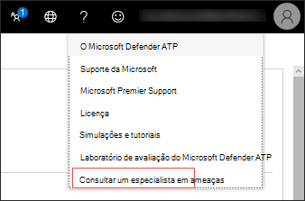

# Configurar e gerenciar recursos de Especialistas em Ameaças da Microsoft

[!INCLUDE [Microsoft 365 Defender rebranding](../../includes/microsoft-defender.md)]

**Aplica-se a:**
- [Microsoft Defender para Ponto de Extremidade](https://go.microsoft.com/fwlink/p/?linkid=2154037)
- [Microsoft 365 Defender](https://go.microsoft.com/fwlink/?linkid=2118804)

>Deseja experimentar o Defender para Ponto de Extremidade? [Inscreva-se para uma avaliação gratuita.](https://www.microsoft.com/microsoft-365/windows/microsoft-defender-atp?ocid=docs-wdatp-assignaccess-abovefoldlink)

## Antes de começar 
> [!NOTE]
> Discutir os requisitos de qualificação com seu provedor de serviços técnicos da Microsoft e a equipe de conta antes de aplicar aos Especialistas em Ameaças da Microsoft - Serviço gerenciado de busca de ameaças de Notificação de Ataque Direcionado.

Verifique se você tem o Defender para Ponto de Extremidade implantado em seu ambiente com dispositivos inscritos e não apenas em uma configuração de laboratório.

Se você for um cliente do Defender para Ponto de Extremidade, precisará aplicar-se aos Especialistas em Ameaças da Microsoft - Notificações de Ataque Direcionados para obter informações e análises especiais para ajudar a identificar as ameaças mais **críticas,** para que você possa responder a elas rapidamente. Entre em contato com sua equipe de conta ou representante da Microsoft para se inscrever no **Microsoft Threat Experts -** Especialistas sob Demanda para consultar nossos especialistas em ameaças sobre detecções e adversários relevantes.

## Aplicar para Especialistas em Ameaças da Microsoft - Serviço de Notificações de Ataques Direcionados 
Se você já for um cliente do Defender para Ponto de Extremidade, poderá aplicar por meio do Centro de Segurança do Microsoft Defender. 

1. No painel de navegação, vá para Configurações > recursos > recursos avançados > Microsoft Threat Experts - Notificações de **Ataque Direcionadas.**

2. Clique em **Aplicar**.

    

3. Insira seu nome e endereço de email para que a Microsoft possa voltar para você em seu aplicativo.

    

4. Leia a [instrução de](https://privacy.microsoft.com/en-us/privacystatement)privacidade e clique **em Enviar** quando terminar. Você receberá um email de boas-vindas depois que seu aplicativo for aprovado.

    

Quando aceito, você receberá um email de  boas-vindas e verá a alteração do botão Aplicar para uma alternância que está "on". Caso você queira sair do serviço Notificações de Ataque Direcionado, deslize a alternância "off" e clique em Salvar **preferências** na parte inferior da página. 

## Onde você verá as notificações de ataque direcionadas de especialistas em ameaças da Microsoft 
Você pode receber uma notificação de ataque direcionada dos Especialistas em Ameaças da Microsoft por meio do seguinte meio:  
- A página **Incidentes** do portal do Defender para Ponto de Extremidade 
- Painel **Alertas** do portal do Defender para Ponto de Extremidade  
- API de alerta OData [e API](https://docs.microsoft.com/windows/security/threat-protection/microsoft-defender-atp/get-alerts) [REST](https://docs.microsoft.com/windows/security/threat-protection/microsoft-defender-atp/pull-alerts-using-rest-api)
- [Tabela DeviceAlertEvents](https://docs.microsoft.com/windows/security/threat-protection/microsoft-defender-atp/advanced-hunting-devicealertevents-table) em Busca Avançada
- Seu email, se você optar por configurá-lo 

Para receber notificações de ataque direcionadas por email, crie uma regra de notificação de email.

### Criar uma regra de notificação de email 
Você pode criar regras para enviar notificações por email para destinatários de notificação. Consulte  [Configure alert notifications](configure-email-notifications.md) to create, edit, delete, or troubleshoot email notification, for details.

## Exibir a notificação de ataque direcionada  
Você começará a receber notificação de ataque direcionado dos Especialistas em Ameaças da Microsoft em seu email depois de configurar seu sistema para receber notificação por email.  

1. Clique no link no email para ir para o contexto de alerta correspondente no painel marcado com **especialistas em ameaças.** 

2. No painel, selecione o mesmo tópico de alerta que você recebeu no email para exibir os detalhes.  

## Inscrever-se em Especialistas em Ameaças da Microsoft - Especialistas sob Demanda
Isso está disponível como um serviço de assinatura. Se você já for um cliente do Defender para Ponto de Extremidade, entre em contato com seu representante da Microsoft para se inscrever nos Especialistas em Ameaças da Microsoft - Especialistas sob Demanda. 

## Consulte um especialista em ameaças da Microsoft sobre atividades suspeitas de segurança cibernética em sua organização 
Você pode fazer parceria com especialistas em ameaças da Microsoft que podem ser contratados diretamente de dentro do Centro de Segurança do Microsoft Defender para uma resposta o tempo e a precisão. Os especialistas fornecem informações para entender melhor as ameaças complexas, as notificações de ataque direcionadas que você recebe ou se você precisar de mais informações sobre os alertas, um dispositivo potencialmente comprometido ou um contexto de inteligência contra ameaças que você vê no painel do portal. 

> [!NOTE]
> - As consultas de alerta relacionadas aos dados de inteligência de ameaças personalizadas da sua organização não são suportadas no momento. Consulte suas operações de segurança ou equipe de resposta a incidentes para obter detalhes.
> - Você precisa ter a permissão **Gerenciar configurações de** segurança no portal da Central de Segurança para poder enviar uma consulta "Consultar um especialista em ameaças".

1. Navegue até a página do portal com as informações relevantes que você gostaria de investigar, por exemplo, a página **Incidente.** Verifique se a página do alerta ou dispositivo relevante está em exibição antes de enviar uma solicitação de investigação. 

2. No menu superior direito, clique em **?** . Em seguida, selecione **Consultar um especialista em ameaças.** 

    

    Uma tela de sobrevoo é aberta. A tela a seguir mostra quando você está em uma assinatura de avaliação.

    

    A tela a seguir mostra quando você está em uma assinatura completa do Microsoft Threat Experts - Experts on-Demand.

    

    O **campo Tópico de** Investigação é pré-preenchido com o link para a página relevante para sua solicitação de investigação. Por exemplo, um link para a página de detalhes do incidente, alerta ou dispositivo em que você estava quando fez a solicitação.

3.  No próximo campo, forneça informações suficientes para fornecer aos Especialistas em Ameaças da Microsoft contexto suficiente para iniciar a investigação.
  
4. Insira o endereço de email que você gostaria de usar para corresponder aos Especialistas em Ameaças da Microsoft.

> [!NOTE]
> Se você quiser acompanhar o status de seus casos de Especialistas sob Demanda por meio do Microsoft Services Hub, entre em contato com seu Gerente de Conta Técnica. 

Assista a este vídeo para uma visão geral rápida do Microsoft Services Hub.

>[!VIDEO https://www.microsoft.com/videoplayer/embed/RE4pk9f] 

   
## Exemplo de tópicos de investigação que você pode consultar com Especialistas em Ameaças da Microsoft - Especialistas sob Demanda 

**Informações de alerta**
- Vemos um novo tipo de alerta para um binário de vida fora da terra: [AlertID]. Você pode nos dizer algo mais sobre esse alerta e como podemos investigar mais?
- Observamos dois ataques semelhantes, que tentam executar scripts mal-intencionados do PowerShell, mas geram alertas diferentes. Uma é "Linha de comando suspeita do PowerShell" e a outra é "Um arquivo mal-intencionado foi detectado com base na indicação fornecida pelo O365". Qual é a diferença?
- Recebo um alerta ímpar hoje para o número anormal de logons com falha do dispositivo de um usuário de alto perfil. Não consigo encontrar mais evidências em torno dessas tentativas de entrar. Como o Defender para Ponto de Extremidade pode ver essas tentativas? Que tipo de sign-ins estão sendo monitoradas?
- Você pode dar mais contexto ou informações sobre esse alerta: "Comportamento suspeito por um utilitário do sistema foi observado". 

**Possível comprometimento do computador**
- Você pode ajudar a responder por que vemos "Processo desconhecido observado?" Essa mensagem ou alerta é visto com frequência em muitos dispositivos. Agradecemos qualquer entrada para esclarecer se essa mensagem ou alerta está relacionado a atividades mal-intencionadas.
- Você pode ajudar a validar um possível comprometimento no sistema a seguir em [data] com comportamentos semelhantes à detecção de malware anterior [nome de malware] no mesmo sistema em [mês]?

**Detalhes da inteligência contra ameaças**
- Detectamos um email de phishing que entregava um documento mal-intencionado do Word a um usuário. O documento mal-intencionado do Word causou uma série de eventos suspeitos, que dispararam vários alertas do Microsoft Defender para malware [nome de malware]. Você tem alguma informação sobre esse malware? Se sim, você pode me enviar um link?
- Recentemente, vi uma postagem [referência de mídia social, por exemplo, Twitter ou blog] sobre uma ameaça que está direcionando meu setor. Você pode me ajudar a entender que proteção o Defender para o Ponto de Extremidade oferece contra esse ator de ameaças? 

**Comunicações de alerta de especialistas em ameaças da Microsoft** 
- Sua equipe de resposta a incidentes pode nos ajudar a lidar com a notificação de ataque direcionada que temos?
- Recebi essa notificação de ataque direcionada dos Especialistas em Ameaças da Microsoft. Não temos nossa própria equipe de resposta a incidentes. O que podemos fazer agora e como podemos conter o incidente?
- Recebi uma notificação de ataque direcionada dos Especialistas em Ameaças da Microsoft. Quais dados você pode fornecer para nós que podemos passar para nossa equipe de resposta a incidentes?

  >[!NOTE]
  >Os Especialistas em Ameaças da Microsoft são um serviço gerenciado de busca de segurança cibernética e não um serviço de resposta a incidentes. No entanto, os especialistas podem fazer a transição perfeita da investigação para os serviços de Equipe de Detecção e Resposta do Grupo de Soluções de Segurança Cibernética (CSG), quando necessário. Você também pode optar por se envolver com sua própria equipe de resposta a incidentes para resolver problemas que exigem uma resposta a incidentes. 

## Cenário

### Receber um relatório de progresso sobre sua investigação de busca gerenciada 
A resposta dos Especialistas em Ameaças da Microsoft varia de acordo com sua investigação. Eles enviarão um relatório de progresso para você sobre **sua** consulta de especialista em ameaças em dois dias para comunicar o status da investigação das seguintes categorias: 
- Mais informações são necessárias para continuar com a investigação 
- Um arquivo ou vários exemplos de arquivo são necessários para determinar o contexto técnico 
- A investigação requer mais tempo   
- As informações iniciais foram suficientes para concluir a investigação 

É fundamental responder rapidamente para manter a investigação em andamento. 

## Tópicos relacionados
- [Visão geral dos Especialistas em Ameaças da Microsoft](microsoft-threat-experts.md)
