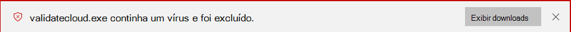
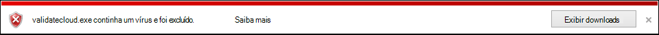
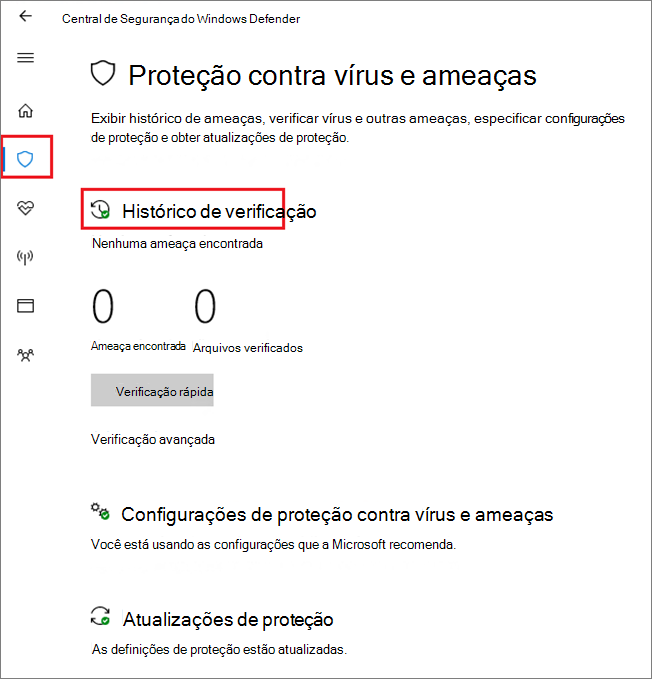

# <a name="configure-and-validate-microsoft-defender-antivirus-network-connections"></a>Configurar e validar as conexões de rede do Microsoft Defender Antivírus

[!INCLUDE [Microsoft 365 Defender rebranding](../../includes/microsoft-defender.md)]


**Aplica-se a:**

- [Microsoft Defender para Ponto de Extremidade](/microsoft-365/security/defender-endpoint/)

Para garantir que a proteção entregue na nuvem do Microsoft Defender Antivírus funcione corretamente, você precisa configurar sua rede para permitir conexões entre seus pontos de extremidade e determinados servidores Microsoft.

Este artigo lista as conexões que devem ser permitidas, como o uso de regras de firewall, e fornece instruções para validar sua conexão. Configurar sua proteção corretamente ajuda a garantir que você receba o melhor valor de seus serviços de proteção entregues na nuvem.

Consulte a postagem do blog Alterações importantes no ponto de extremidade [do Microsoft Active Protection Services](https://techcommunity.microsoft.com/t5/Configuration-Manager-Archive/Important-changes-to-Microsoft-Active-Protection-Service-MAPS/ba-p/274006) para obter alguns detalhes sobre a conectividade de rede.

>[!TIP]
>Você também pode visitar o site de demonstração do Microsoft Defender para Ponto de Extremidade [no demo.wd.microsoft.com](https://demo.wd.microsoft.com?ocid=cx-wddocs-testground) para confirmar que os seguintes recursos estão funcionando:
>
>- Proteção entregue na nuvem
>- Aprendizado rápido (incluindo bloquear à primeira vista)
>- Bloqueio de aplicativo potencialmente indesejado

## <a name="allow-connections-to-the-microsoft-defender-antivirus-cloud-service"></a>Permitir conexões com o serviço de nuvem do Microsoft Defender Antivírus

O serviço de nuvem do Microsoft Defender Antivírus fornece proteção rápida e forte para seus pontos de extremidade. A habilitação do serviço de proteção entregue na nuvem é opcional, no entanto, é altamente recomendável porque fornece proteção importante contra malware em seus pontos de extremidade e em toda a sua rede.

>[!NOTE]
>O serviço de nuvem do Microsoft Defender Antivírus é um mecanismo para fornecer proteção atualizada para sua rede e pontos de extremidade. Embora seja chamado de serviço de nuvem, ele não é simplesmente proteção para arquivos armazenados na nuvem, em vez disso, usa recursos distribuídos e aprendizado de máquina para fornecer proteção aos seus pontos de extremidade em uma taxa muito mais rápida do que as atualizações tradicionais de inteligência de segurança.

Consulte [Habilitar](enable-cloud-protection-microsoft-defender-antivirus.md) a proteção entregue na nuvem para obter detalhes sobre como habilitar o serviço com o Intune, o Microsoft Endpoint Configuration Manager, a Política de Grupo, os cmdlets do PowerShell ou em clientes individuais no aplicativo segurança do Windows. 

Depois de habilitar o serviço, talvez seja necessário configurar sua rede ou firewall para permitir conexões entre ele e seus pontos de extremidade.

Como sua proteção é um serviço de nuvem, os computadores devem ter acesso à Internet e acessar os serviços de aprendizado de máquina do Microsoft Defender para Office 365. Não exclua a URL `*.blob.core.windows.net` de nenhum tipo de inspeção de rede. 

A tabela a seguir lista os serviços e suas URLs associadas. Certifique-se de que não haja regras de filtragem de rede ou firewall negando o acesso a essas URLs, ou talvez seja necessário criar uma regra de autorização especificamente para elas (excluindo a URL `*.blob.core.windows.net` ). Abaixo menção URLs estão usando a porta 443 para comunicação.


| **Serviço**| **Descrição** |**URL** |
| :--: | :-- | :-- |
| Serviço de proteção entregue na nuvem do Microsoft Defender Antivírus, também conhecido como Serviço de Proteção Ativa da Microsoft (MAPS)|Usado pelo Microsoft Defender Antivírus para fornecer proteção entregue na nuvem|`*.wdcp.microsoft.com` <br/> `*.wdcpalt.microsoft.com` <br/> `*.wd.microsoft.com`|
| Serviço de Atualização da Microsoft (MU) <br/> Serviço de Atualização do Windows (WU)|  Inteligência de segurança e atualizações de produtos   |`*.update.microsoft.com` <br/> `*.delivery.mp.microsoft.com`<br/> `*.windowsupdate.com` <br/><br/> Para obter detalhes, [consulte Pontos de extremidade de conexão para Windows Update](/windows/privacy/manage-windows-1709-endpoints#windows-update)|
|Atualizações de inteligência de segurança Local de Download Alternativo (ADL)|   Local alternativo para atualizações de inteligência de Segurança do Microsoft Defender Antivírus se a inteligência de segurança instalada estiver desastrada (7 ou mais dias depois)|    `*.download.microsoft.com`  </br> `*.download.windowsupdate.com`</br> `https://fe3cr.delivery.mp.microsoft.com/ClientWebService/client.asmx`|
| Armazenamento de envio de malware|Local de carregamento de arquivos enviados à Microsoft por meio do formulário de envio ou envio automático de exemplo    | `ussus1eastprod.blob.core.windows.net` <br/>    `ussus2eastprod.blob.core.windows.net` <br/>    `ussus3eastprod.blob.core.windows.net` <br/>    `ussus4eastprod.blob.core.windows.net` <br/>    `wsus1eastprod.blob.core.windows.net` <br/>    `wsus2eastprod.blob.core.windows.net` <br/>    `ussus1westprod.blob.core.windows.net` <br/>    `ussus2westprod.blob.core.windows.net` <br/>    `ussus3westprod.blob.core.windows.net` <br/>    `ussus4westprod.blob.core.windows.net` <br/>    `wsus1westprod.blob.core.windows.net` <br/>    `wsus2westprod.blob.core.windows.net` <br/>    `usseu1northprod.blob.core.windows.net` <br/>    `wseu1northprod.blob.core.windows.net` <br/>    `usseu1westprod.blob.core.windows.net` <br/>    `wseu1westprod.blob.core.windows.net` <br/>    `ussuk1southprod.blob.core.windows.net` <br/>    `wsuk1southprod.blob.core.windows.net` <br/>    `ussuk1westprod.blob.core.windows.net` <br/>    `wsuk1westprod.blob.core.windows.net` |
| Lista de Revogação de Certificados (CRL)|Usado pelo Windows ao criar a conexão SSL com o MAPS para atualizar a CRL   | `http://www.microsoft.com/pkiops/crl/` <br/> `http://www.microsoft.com/pkiops/certs` <br/>   `http://crl.microsoft.com/pki/crl/products` <br/> `http://www.microsoft.com/pki/certs` |
| Loja de Símbolos|Usado pelo Microsoft Defender Antivírus para restaurar determinados arquivos críticos durante fluxos de correção  | `https://msdl.microsoft.com/download/symbols` |
| Cliente de Telemetria Universal| Usado pelo Windows para enviar dados de diagnóstico do cliente; O Microsoft Defender Antivírus usa telemetria para fins de monitoramento de qualidade do produto   | A atualização usa SSL (Porta TCP 443) para baixar manifestos e carregar dados de diagnóstico para a Microsoft que usa os seguintes pontos de extremidade DNS:   `vortex-win.data.microsoft.com` <br/>   `settings-win.data.microsoft.com`|

## <a name="validate-connections-between-your-network-and-the-cloud"></a>Validar conexões entre sua rede e a nuvem

Depois de permitir as URLs listadas acima, você pode testar se você está conectado ao serviço de nuvem do Microsoft Defender Antivírus e está corretamente relatando e recebendo informações para garantir que você esteja totalmente protegido.

**Use a ferramenta cmdline para validar a proteção entregue na nuvem:**

Use o seguinte argumento com o utilitário de linha de comando do Microsoft Defender Antivírus ( ) para verificar se sua rede pode se comunicar com o serviço de nuvem `mpcmdrun.exe` do Microsoft Defender Antivírus:

```console
"%ProgramFiles%\Windows Defender\MpCmdRun.exe" -ValidateMapsConnection
```

> [!NOTE]
> Você precisa abrir uma versão de nível de administrador do prompt de comando. Clique com o botão direito do mouse no item no menu Iniciar, clique em **Executar como administrador** e clique em **Sim** no prompt de permissões. Esse comando funcionará apenas no Windows 10, versão 1703 ou superior.

Para obter mais informações, consulte [Manage Microsoft Defender Antivírus with the mpcmdrun.exe commandline tool](command-line-arguments-microsoft-defender-antivirus.md).

**Tente baixar um arquivo de malware falso da Microsoft:**

Você pode baixar um arquivo de exemplo que o Microsoft Defender Antivírus detectará e bloqueará se estiver conectado corretamente à nuvem.

Baixe o arquivo visitando [https://aka.ms/ioavtest](https://aka.ms/ioavtest) .

>[!NOTE]
>Esse arquivo não é um malware real. É um arquivo falso projetado para testar se você está conectado corretamente à nuvem.

Se você estiver conectado corretamente, verá uma notificação de aviso do Microsoft Defender Antivírus.

Se você estiver usando o Microsoft Edge, também verá uma mensagem de notificação:



Uma mensagem semelhante ocorrerá se você estiver usando o Internet Explorer:



Você também verá uma detecção em **Ameaças em quarentena** na seção Histórico **de** verificação no aplicativo segurança do Windows:

1. Abra o aplicativo segurança do Windows clicando no ícone de escudo na barra de tarefas ou pesquisando o menu inicial do **Defender**.

2. Selecione o **&** proteção contra ameaças (ou o ícone de escudo na barra de menus esquerda) e, em seguida, o rótulo **De histórico de** verificação:

    

3. Na seção **Ameaças em quarentena,** selecione **Ver histórico completo** para ver o malware falso detectado.

   > [!NOTE]
   > As versões do Windows 10 antes da versão 1703 têm uma interface de usuário diferente. Consulte [o Microsoft Defender Antivírus no aplicativo segurança do Windows](microsoft-defender-security-center-antivirus.md).

   O log de eventos do Windows também mostrará Windows Defender ID do evento cliente [1116](troubleshoot-microsoft-defender-antivirus.md).

## <a name="related-articles"></a>Artigos relacionados

- [Microsoft Defender Antivírus no Windows 10](microsoft-defender-antivirus-in-windows-10.md)

- [Habilitar a proteção entregue na nuvem](enable-cloud-protection-microsoft-defender-antivirus.md)

- [Argumentos de linha de comando](command-line-arguments-microsoft-defender-antivirus.md)

- [Alterações importantes no ponto de extremidade do Microsoft Active Protection Services](https://techcommunity.microsoft.com/t5/Configuration-Manager-Archive/Important-changes-to-Microsoft-Active-Protection-Service-MAPS/ba-p/274006)