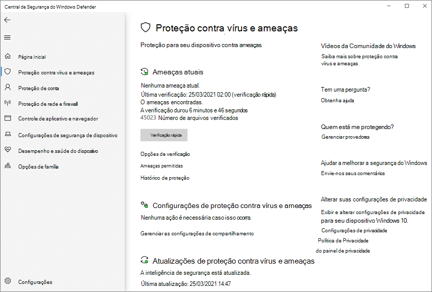

# Configurar as notificações que aparecem nos pontos de extremidadeConfigure the notifications that appear on endpoints

[!INCLUDE [Microsoft 365 Defender rebranding](../../includes/microsoft-defender.md)]

**Aplica-se a:****Applies to:**

- [Microsoft Defender para Ponto de ExtremidadeMicrosoft Defender for Endpoint](/microsoft-365/security/defender-endpoint/)

No Windows 10, as notificações de aplicativos sobre detecção e correção de malware são mais robustas, consistentes e concisas.In Windows 10, application notifications about malware detection and remediation are more robust, consistent, and concise.

As notificações são exibidas nos pontos de extremidade quando as verificações acionadas manualmente e agendadas são concluídas e as ameaças são detectadas.Notifications appear on endpoints when manually triggered and scheduled scans are completed and threats are detected. Essas notificações também aparecem na Central de Notificações **,** e um resumo de verificações e detecções de ameaças aparecem em intervalos de tempo regulares.These notifications also appear in the **Notification Center**, and a summary of scans and threat detections appear at regular time intervals.

Você também pode configurar como as notificações padrão aparecem nos pontos de extremidade, como notificações para reinicialização ou quando uma ameaça foi detectada e remediada.You can also configure how standard notifications appear on endpoints, such as notifications for reboot or when a threat has been detected and remediated.

## Configurar as notificações adicionais que aparecem nos pontos de extremidadeConfigure the additional notifications that appear on endpoints

Você pode configurar a exibição de notificações adicionais, como resumos recentes de detecção de ameaças, no aplicativo segurança do [Windows](microsoft-defender-security-center-antivirus.md) e com a Política de Grupo.You can configure the display of additional notifications, such as recent threat detection summaries, in the [Windows Security app](microsoft-defender-security-center-antivirus.md) and with Group Policy.

> [!NOTE]
> No Windows 10, versão 1607, o recurso era chamado notificações aprimoradas e poderia ser configurado em **Windows Settings** Update &   >  **segurança**  >  **Windows Defender**.In Windows 10, version 1607 the feature was called **Enhanced notifications** and could be configured under **Windows Settings** > **Update & security** > **Windows Defender**. Nas configurações da Política de Grupo em todas as versões do Windows 10, ela é chamada **de Notificações aprimoradas.**In Group Policy settings in all versions of Windows 10, it is called **Enhanced notifications**.

> [!IMPORTANT]
> Desabilitar notificações adicionais não desabilitará notificações críticas, como alertas de detecção e correção de ameaças.Disabling additional notifications will not disable critical notifications, such as threat detection and remediation alerts.

**Use o aplicativo segurança do Windows para desabilitar notificações adicionais:****Use the Windows Security app to disable additional notifications:**

1. Abra o aplicativo segurança do Windows clicando no ícone de escudo na barra de tarefas ou pesquisando o menu inicial do **Defender**.Open the Windows Security app by clicking the shield icon in the task bar or searching the start menu for **Defender**.

2. Clique no **&** de proteção contra ameaças (ou o ícone de escudo na barra de **menus** esquerda) e, em seguida, o rótulo de configurações de proteção contra ameaças & vírus:Click the **Virus & threat protection** tile (or the shield icon on the left menu bar) and then the **Virus & threat protection settings** label:

    

3. Role até a **seção Notificações** e clique em **Alterar configurações de notificação**.Scroll to the **Notifications** section and click **Change notification settings**.

4. Deslize a opção para **Off** ou **On** para desabilitar ou habilitar notificações adicionais.Slide the switch to **Off** or **On** to disable or enable additional notifications.

**Use a Política de Grupo para desabilitar notificações adicionais:****Use Group Policy to disable additional notifications:**

1. No computador de gerenciamento de Política de Grupo, abra o Console de Gerenciamento de Política de [Grupo](/previous-versions/windows/it-pro/windows-server-2008-R2-and-2008/cc731212(v=ws.11)), clique com o botão direito do mouse no Objeto de Política de Grupo que você deseja configurar e clique em **Editar**.On your Group Policy management computer, open the [Group Policy Management Console](/previous-versions/windows/it-pro/windows-server-2008-R2-and-2008/cc731212(v=ws.11)), right-click the Group Policy Object you want to configure and click **Edit**.

2. No Editor **de Gerenciamento de Política de Grupo,** vá para **Configuração do computador.**In the **Group Policy Management Editor** go to **Computer configuration**.

3. Clique **em Modelos Administrativos**.Click **Administrative templates**.

4. Expanda a árvore para **componentes do Windows > o Microsoft Defender Antivírus > Reporting**.Expand the tree to **Windows components > Microsoft Defender Antivirus > Reporting**.

5. Clique duas **vezes em Desativar notificações aprimoradas** e de definir a opção como **Habilitado**.Double-click **Turn off enhanced notifications** and set the option to **Enabled**. Clique em **OK**.Click **OK**. Isso impedirá que notificações adicionais apareçam.This will prevent additional notifications from appearing.

## Configurar notificações padrão em pontos de extremidadeConfigure standard notifications on endpoints

Você pode usar a Política de Grupo para:You can use Group Policy to:

- Exibir texto adicional e personalizado nos pontos de extremidade quando o usuário precisar executar uma açãoDisplay additional, customized text on endpoints when the user needs to perform an action
- Ocultar todas as notificações nos pontos de extremidadeHide all notifications on endpoints
- Ocultar notificações de reinicialização nos pontos de extremidadeHide reboot notifications on endpoints

Ocultar notificações pode ser útil em situações em que você não pode ocultar toda a interface do Microsoft Defender Antivírus.Hiding notifications can be useful in situations where you can't hide the entire Microsoft Defender Antivirus interface. Confira [Impedir que os usuários vejam ou interajam com a interface](prevent-end-user-interaction-microsoft-defender-antivirus.md) do usuário do Microsoft Defender Antivírus para obter mais informações.See [Prevent users from seeing or interacting with the Microsoft Defender Antivirus user interface](prevent-end-user-interaction-microsoft-defender-antivirus.md) for more information. 

> [!NOTE]
> Ocultar notificações só ocorrerá nos pontos de extremidade aos quais a política foi implantada.Hiding notifications will only occur on endpoints to which the policy has been deployed. As notificações relacionadas a ações que devem ser tomadas (como uma reinicialização) ainda serão exibidas no painel de monitoramento e relatórios do [Microsoft Endpoint Manager Endpoint Protection.](/configmgr/protect/deploy-use/monitor-endpoint-protection)Notifications related to actions that must be taken (such as a reboot) will still appear on the [Microsoft Endpoint Manager Endpoint Protection monitoring dashboard and reports](/configmgr/protect/deploy-use/monitor-endpoint-protection). 

Confira [Personalizar o aplicativo de Segurança](/windows/security/threat-protection/windows-defender-security-center/windows-defender-security-center) do Windows para sua organização para obter instruções para adicionar informações de contato personalizadas às notificações que os usuários veem em seus computadores.See [Customize the Windows Security app for your organization](/windows/security/threat-protection/windows-defender-security-center/windows-defender-security-center) for instructions to add custom contact information to the notifications that users see on their machines.

**Use a Política de Grupo para ocultar notificações:****Use Group Policy to hide notifications:**

1. No computador de gerenciamento de Política de Grupo, abra o Console de Gerenciamento de Política de [Grupo](/previous-versions/windows/it-pro/windows-server-2008-R2-and-2008/cc731212(v=ws.11)), clique com o botão direito do mouse no Objeto de Política de Grupo que você deseja configurar e clique em **Editar**.On your Group Policy management computer, open the [Group Policy Management Console](/previous-versions/windows/it-pro/windows-server-2008-R2-and-2008/cc731212(v=ws.11)), right-click the Group Policy Object you want to configure, and click **Edit**.

2. No Editor **de Gerenciamento de Política de Grupo,** acesse **Configuração do** computador e clique em Modelos **administrativos.**In the **Group Policy Management Editor** go to **Computer configuration** and click **Administrative templates**.

3. Expanda a árvore para componentes do Windows > interface do Cliente do **Microsoft Defender Antivírus >.**Expand the tree to **Windows components > Microsoft Defender Antivirus > Client interface**. 

4. Clique duas vezes **em Suprimir todas as notificações** e de definir a opção como **Habilitado**.Double-click **Suppress all notifications** and set the option to **Enabled**. Clique em **OK**.Click **OK**. Isso impedirá que notificações adicionais apareçam.This will prevent additional notifications from appearing.

**Use a Política de Grupo para ocultar notificações de reinicialização:****Use Group Policy to hide reboot notifications:**

1. No computador de gerenciamento de Política de Grupo, abra o Console de Gerenciamento de Política de [Grupo](/previous-versions/windows/it-pro/windows-server-2008-R2-and-2008/cc731212(v=ws.11)), clique com o botão direito do mouse no Objeto de Política de Grupo que você deseja configurar e clique em **Editar**.On your Group Policy management computer, open the [Group Policy Management Console](/previous-versions/windows/it-pro/windows-server-2008-R2-and-2008/cc731212(v=ws.11)), right-click the Group Policy Object you want to configure and click **Edit**.

2. No Editor **de Gerenciamento de Política de Grupo,** vá para **Configuração do computador.**In the **Group Policy Management Editor** go to **Computer configuration**.

3. Clique **em Modelos Administrativos**.Click **Administrative templates**.

4. Expanda a árvore para componentes do Windows > interface do Cliente do **Microsoft Defender Antivírus >.**Expand the tree to **Windows components > Microsoft Defender Antivirus > Client interface**.

5. Clique duas vezes **em Suprime notificações de reinicialização** e de definir a opção **como Habilitado**.Double-click **Suppresses reboot notifications** and set the option to **Enabled**. Clique em **OK**.Click **OK**. Isso impedirá que notificações adicionais apareçam.This will prevent additional notifications from appearing.

## Tópicos relacionadosRelated topics

- [Microsoft Defender Antivírus no Windows 10Microsoft Defender Antivirus in Windows 10](microsoft-defender-antivirus-in-windows-10.md)
- [Configurar a interação do usuário final com o Microsoft Defender AntivírusConfigure end-user interaction with Microsoft Defender Antivirus](configure-end-user-interaction-microsoft-defender-antivirus.md)