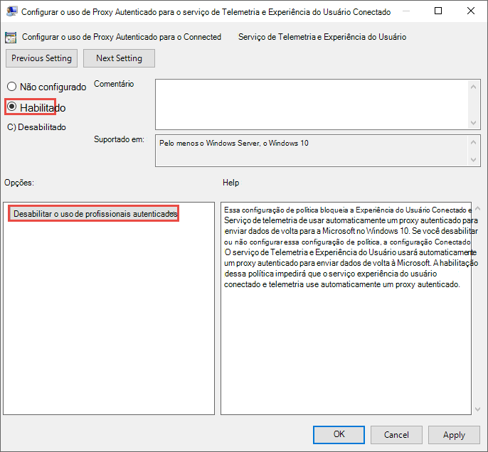
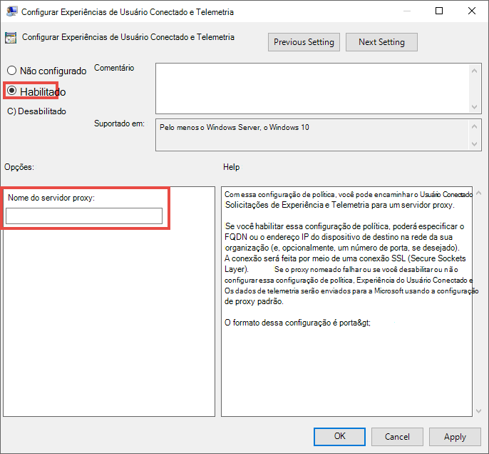

# <a name="configure-device-proxy-and-internet-connectivity-settings"></a><span data-ttu-id="5987f-104">Configurar configurações de proxy de dispositivo e conectividade com a Internet</span><span class="sxs-lookup"><span data-stu-id="5987f-104">Configure device proxy and Internet connectivity settings</span></span>

[!INCLUDE [Microsoft 365 Defender rebranding](../../includes/microsoft-defender.md)]

<span data-ttu-id="5987f-105">**Aplica-se a:**</span><span class="sxs-lookup"><span data-stu-id="5987f-105">**Applies to:**</span></span>
- [<span data-ttu-id="5987f-106">Microsoft Defender para Ponto de Extremidade</span><span class="sxs-lookup"><span data-stu-id="5987f-106">Microsoft Defender for Endpoint</span></span>](https://go.microsoft.com/fwlink/p/?linkid=2154037)
- [<span data-ttu-id="5987f-107">Microsoft 365 Defender</span><span class="sxs-lookup"><span data-stu-id="5987f-107">Microsoft 365 Defender</span></span>](https://go.microsoft.com/fwlink/?linkid=2118804)

> <span data-ttu-id="5987f-108">Deseja experimentar o Defender para Ponto de Extremidade?</span><span class="sxs-lookup"><span data-stu-id="5987f-108">Want to experience Defender for Endpoint?</span></span> [<span data-ttu-id="5987f-109">Inscreva-se para uma avaliação gratuita.</span><span class="sxs-lookup"><span data-stu-id="5987f-109">Sign up for a free trial.</span></span>](https://www.microsoft.com/en-us/WindowsForBusiness/windows-atp?ocid=docs-wdatp-configureendpointsscript-abovefoldlink)

<span data-ttu-id="5987f-110">O sensor Defender for Endpoint requer que o Microsoft Windows HTTP (WinHTTP) reporte dados do sensor e se comunique com o serviço Defender para Ponto de Extremidade.</span><span class="sxs-lookup"><span data-stu-id="5987f-110">The Defender for Endpoint sensor requires Microsoft Windows HTTP (WinHTTP) to report sensor data and communicate with the Defender for Endpoint service.</span></span>

<span data-ttu-id="5987f-111">O sensor Defender para Ponto de Extremidade incorporado é executado no contexto do sistema usando a conta LocalSystem.</span><span class="sxs-lookup"><span data-stu-id="5987f-111">The embedded Defender for Endpoint sensor runs in system context using the LocalSystem account.</span></span> <span data-ttu-id="5987f-112">O sensor usa o Microsoft Windows HTTP Services (WinHTTP) para habilitar a comunicação com o serviço de nuvem do Defender for Endpoint.</span><span class="sxs-lookup"><span data-stu-id="5987f-112">The sensor uses Microsoft Windows HTTP Services (WinHTTP) to enable communication with the Defender for Endpoint cloud service.</span></span>

>[!TIP]
><span data-ttu-id="5987f-113">Para organizações que usam proxies de envio como gateway para a Internet, você pode usar a proteção de rede para investigar por trás de um proxy.</span><span class="sxs-lookup"><span data-stu-id="5987f-113">For organizations that use forward proxies as a gateway to the Internet, you can use network protection to investigate behind a proxy.</span></span> <span data-ttu-id="5987f-114">Para saber mais, veja [Investigar eventos de conexão que ocorrem por meio de proxies de encaminhamento](investigate-behind-proxy.md).</span><span class="sxs-lookup"><span data-stu-id="5987f-114">For more information, see [Investigate connection events that occur behind forward proxies](investigate-behind-proxy.md).</span></span>

<span data-ttu-id="5987f-115">A configuração winhttp é independente das configurações de proxy de navegação da Internet do Windows (WinINet) e só pode descobrir um servidor proxy usando os seguintes métodos de descoberta:</span><span class="sxs-lookup"><span data-stu-id="5987f-115">The WinHTTP configuration setting is independent of the Windows Internet (WinINet) Internet browsing proxy settings and can only discover a proxy server by using the following discovery methods:</span></span>

- <span data-ttu-id="5987f-116">Métodos de descoberta automática:</span><span class="sxs-lookup"><span data-stu-id="5987f-116">Auto-discovery methods:</span></span>
  - <span data-ttu-id="5987f-117">Proxy transparente</span><span class="sxs-lookup"><span data-stu-id="5987f-117">Transparent proxy</span></span>
  - <span data-ttu-id="5987f-118">Protocolo de Descoberta Automática de Proxy da Web (WPAD)</span><span class="sxs-lookup"><span data-stu-id="5987f-118">Web Proxy Auto-discovery Protocol (WPAD)</span></span>

    > [!NOTE]
    > <span data-ttu-id="5987f-119">Se você estiver usando proxy transparente ou WPAD em sua topologia de rede, não precisará de configurações especiais.</span><span class="sxs-lookup"><span data-stu-id="5987f-119">If you're using Transparent proxy or WPAD in your network topology, you don't need special configuration settings.</span></span> <span data-ttu-id="5987f-120">Para obter mais informações sobre exclusões de URL do Defender para Ponto de Extremidade no proxy, consulte Enable access [to Defender for Endpoint service URLs in the proxy server](#enable-access-to-microsoft-defender-for-endpoint-service-urls-in-the-proxy-server).</span><span class="sxs-lookup"><span data-stu-id="5987f-120">For more information on Defender for Endpoint URL exclusions in the proxy, see [Enable access to Defender for Endpoint service URLs in the proxy server](#enable-access-to-microsoft-defender-for-endpoint-service-urls-in-the-proxy-server).</span></span>

- <span data-ttu-id="5987f-121">Configuração manual de proxy estático:</span><span class="sxs-lookup"><span data-stu-id="5987f-121">Manual static proxy configuration:</span></span>
  - <span data-ttu-id="5987f-122">Configuração baseada no registro</span><span class="sxs-lookup"><span data-stu-id="5987f-122">Registry based configuration</span></span>
  - <span data-ttu-id="5987f-123">WinHTTP configurado usando o comando netsh - Adequado apenas para desktops em uma topologia estável (por exemplo: um desktop em uma rede corporativa atrás do mesmo proxy)</span><span class="sxs-lookup"><span data-stu-id="5987f-123">WinHTTP configured using netsh command – Suitable only for desktops in a stable topology (for example: a desktop in a corporate network behind the same proxy)</span></span>

## <a name="configure-the-proxy-server-manually-using-a-registry-based-static-proxy"></a><span data-ttu-id="5987f-124">Configure o servidor proxy manualmente usando um proxy estático baseado no registro</span><span class="sxs-lookup"><span data-stu-id="5987f-124">Configure the proxy server manually using a registry-based static proxy</span></span>

<span data-ttu-id="5987f-125">Configure um proxy estático baseado no Registro para permitir que apenas o sensor Defender for Endpoint reporte dados de diagnóstico e se comunique com o Defender para serviços de Ponto de Extremidade se um computador não tiver permissão para se conectar à Internet.</span><span class="sxs-lookup"><span data-stu-id="5987f-125">Configure a registry-based static proxy to allow only Defender for Endpoint sensor to report diagnostic data and communicate with Defender for Endpoint services if a computer is not be permitted to connect to the Internet.</span></span>

<span data-ttu-id="5987f-126">O proxy estático é configurável por meio da Política de Grupo (GP).</span><span class="sxs-lookup"><span data-stu-id="5987f-126">The static proxy is configurable through Group Policy (GP).</span></span> <span data-ttu-id="5987f-127">A política do grupo pode ser encontrada em:</span><span class="sxs-lookup"><span data-stu-id="5987f-127">The group policy can be found under:</span></span>

- <span data-ttu-id="5987f-128">Modelos Administrativos > componentes do Windows > de coleta de dados e builds de visualização > configurar o uso de Proxy Autenticado para o Serviço de Telemetria e Experiência do Usuário Conectado</span><span class="sxs-lookup"><span data-stu-id="5987f-128">Administrative Templates > Windows Components > Data Collection and Preview Builds > Configure Authenticated Proxy usage for the Connected User Experience and Telemetry Service</span></span>
  - <span data-ttu-id="5987f-129">De defini-lo **como Habilitado e** selecione Desabilitar o uso de Proxy **Autenticado**: </span><span class="sxs-lookup"><span data-stu-id="5987f-129">Set it to **Enabled** and select **Disable Authenticated Proxy usage**: </span></span>
- <span data-ttu-id="5987f-130">**Modelos Administrativos > componentes** do Windows > de dados e builds de visualização > Configurar experiências de usuário conectados e telemetria :</span><span class="sxs-lookup"><span data-stu-id="5987f-130">**Administrative Templates > Windows Components > Data Collection and Preview Builds > Configure connected user experiences and telemetry**:</span></span>
  - <span data-ttu-id="5987f-131">Configure o proxy:</span><span class="sxs-lookup"><span data-stu-id="5987f-131">Configure the proxy:</span></span><br>
    <span data-ttu-id="5987f-132"></span><span class="sxs-lookup"><span data-stu-id="5987f-132"></span></span>

    <span data-ttu-id="5987f-133">A política define dois valores de registro `TelemetryProxyServer` como REG_SZ e `DisableEnterpriseAuthProxy` como REG_DWORD na chave de registro `HKLM\Software\Policies\Microsoft\Windows\DataCollection`.</span><span class="sxs-lookup"><span data-stu-id="5987f-133">The policy sets two registry values `TelemetryProxyServer` as REG_SZ and `DisableEnterpriseAuthProxy` as REG_DWORD under the registry key `HKLM\Software\Policies\Microsoft\Windows\DataCollection`.</span></span>

    <span data-ttu-id="5987f-134">O valor do Registro `TelemetryProxyServer` assume o seguinte formato de cadeia de caracteres:</span><span class="sxs-lookup"><span data-stu-id="5987f-134">The registry value `TelemetryProxyServer` takes the following string format:</span></span>

    ```text
    <server name or ip>:<port>
    ```

    <span data-ttu-id="5987f-135">Por exemplo: 10.0.0.6:8080</span><span class="sxs-lookup"><span data-stu-id="5987f-135">For example: 10.0.0.6:8080</span></span>

    <span data-ttu-id="5987f-136">O valor de registro `DisableEnterpriseAuthProxy` deve ser definido como 1.</span><span class="sxs-lookup"><span data-stu-id="5987f-136">The registry value `DisableEnterpriseAuthProxy` should be set to 1.</span></span>

## <a name="configure-the-proxy-server-manually-using-netsh-command"></a><span data-ttu-id="5987f-137">Configurar o servidor proxy manualmente usando o comando netsh</span><span class="sxs-lookup"><span data-stu-id="5987f-137">Configure the proxy server manually using netsh command</span></span>

<span data-ttu-id="5987f-138">Use netsh para configurar um proxy estático de todo o sistema.</span><span class="sxs-lookup"><span data-stu-id="5987f-138">Use netsh to configure a system-wide static proxy.</span></span>

> [!NOTE]
> - <span data-ttu-id="5987f-139">Isso afetará todos os aplicativos, incluindo serviços do Windows que usam WinHTTP com proxy padrão.</span><span class="sxs-lookup"><span data-stu-id="5987f-139">This will affect all applications including Windows services which use WinHTTP with default proxy.</span></span></br>
> - <span data-ttu-id="5987f-140">Laptops que estão alterando a topologia (por exemplo: do office para o home) não funcionarão com netsh.</span><span class="sxs-lookup"><span data-stu-id="5987f-140">Laptops that are changing topology (for example: from office to home) will malfunction with netsh.</span></span> <span data-ttu-id="5987f-141">Use a configuração de proxy estático com base no registro.</span><span class="sxs-lookup"><span data-stu-id="5987f-141">Use the registry-based static proxy configuration.</span></span>

1. <span data-ttu-id="5987f-142">Abra uma linha de comando com privilégios elevados:</span><span class="sxs-lookup"><span data-stu-id="5987f-142">Open an elevated command-line:</span></span>

    <span data-ttu-id="5987f-143">a.</span><span class="sxs-lookup"><span data-stu-id="5987f-143">a.</span></span> <span data-ttu-id="5987f-144">Vá para **Iniciar** e digite **cmd**.</span><span class="sxs-lookup"><span data-stu-id="5987f-144">Go to **Start** and type **cmd**.</span></span>

    <span data-ttu-id="5987f-145">b.</span><span class="sxs-lookup"><span data-stu-id="5987f-145">b.</span></span> <span data-ttu-id="5987f-146">Clique com o botão direito do mouse em **Prompt de Comando** e selecione **Executar como administrador**.</span><span class="sxs-lookup"><span data-stu-id="5987f-146">Right-click **Command prompt** and select **Run as administrator**.</span></span>

2. <span data-ttu-id="5987f-147">Insira o seguinte comando e pressione **Enter**:</span><span class="sxs-lookup"><span data-stu-id="5987f-147">Enter the following command and press **Enter**:</span></span>

   ```PowerShell
   netsh winhttp set proxy <proxy>:<port>
   ```

   <span data-ttu-id="5987f-148">Por exemplo: netsh winhttp set proxy 10.0.0.6:8080</span><span class="sxs-lookup"><span data-stu-id="5987f-148">For example: netsh winhttp set proxy 10.0.0.6:8080</span></span>

<span data-ttu-id="5987f-149">Para redefinir o proxy winhttp, insira o seguinte comando e pressione **Enter**</span><span class="sxs-lookup"><span data-stu-id="5987f-149">To reset the winhttp proxy, enter the following command and press **Enter**</span></span>

```PowerShell
netsh winhttp reset proxy
```

<span data-ttu-id="5987f-150">Para saber mais, veja [Sintaxe, Contextos e Formatação do Comando Netsh](https://docs.microsoft.com/windows-server/networking/technologies/netsh/netsh-contexts).</span><span class="sxs-lookup"><span data-stu-id="5987f-150">See [Netsh Command Syntax, Contexts, and Formatting](https://docs.microsoft.com/windows-server/networking/technologies/netsh/netsh-contexts) to learn more.</span></span>

## <a name="enable-access-to-microsoft-defender-for-endpoint-service-urls-in-the-proxy-server"></a><span data-ttu-id="5987f-151">Habilitar o acesso a URLs de serviço do Microsoft Defender para Ponto de Extremidade no servidor proxy</span><span class="sxs-lookup"><span data-stu-id="5987f-151">Enable access to Microsoft Defender for Endpoint service URLs in the proxy server</span></span>

<span data-ttu-id="5987f-152">Se um proxy ou firewall está bloqueando por padrão todo o tráfego e permitindo apenas a passagem de domínios específicos, adicione os domínios listados na planilha para download à lista de domínios permitidos.</span><span class="sxs-lookup"><span data-stu-id="5987f-152">If a proxy or firewall is blocking all traffic by default and allowing only specific domains through, add the domains listed in the downloadable sheet to the allowed domains list.</span></span>

<span data-ttu-id="5987f-153">A planilha baixável a seguir lista os serviços e as URLs associadas às quais sua rede deve ser capaz de se conectar.</span><span class="sxs-lookup"><span data-stu-id="5987f-153">The following downloadable spreadsheet lists the services and their associated URLs that your network must be able to connect to.</span></span> <span data-ttu-id="5987f-154">Você deve garantir que não haja regras de filtragem de rede ou firewall que neguem o acesso *a* essas URLs, ou talvez seja necessário criar uma regra de autorização especificamente para elas.</span><span class="sxs-lookup"><span data-stu-id="5987f-154">You should ensure that there are no firewall or network filtering rules that would deny access to these URLs, or you may need to create an *allow* rule specifically for them.</span></span>


|<span data-ttu-id="5987f-155">**Planilha de lista de domínios**</span><span class="sxs-lookup"><span data-stu-id="5987f-155">**Spreadsheet of domains list**</span></span>|<span data-ttu-id="5987f-156">**Descrição**</span><span class="sxs-lookup"><span data-stu-id="5987f-156">**Description**</span></span>|
|:-----|:-----|
|<br/>  | <span data-ttu-id="5987f-158">Planilha de registros DNS específicos para locais de serviço, localizações geográficas e sistema operacional.</span><span class="sxs-lookup"><span data-stu-id="5987f-158">Spreadsheet of specific DNS records for service locations, geographic locations, and OS.</span></span> <br><br>[<span data-ttu-id="5987f-159">Baixe a planilha aqui.</span><span class="sxs-lookup"><span data-stu-id="5987f-159">Download the spreadsheet here.</span></span>](https://download.microsoft.com/download/8/a/5/8a51eee5-cd02-431c-9d78-a58b7f77c070/mde-urls.xlsx) 


<span data-ttu-id="5987f-160">Se um proxy ou firewall tiver verificação HTTPS habilitada (inspeção SSL), exclua os domínios listados na tabela acima da verificação HTTPS.</span><span class="sxs-lookup"><span data-stu-id="5987f-160">If a proxy or firewall has HTTPS scanning (SSL inspection) enabled, exclude the domains listed in the above table from HTTPS scanning.</span></span>

> [!NOTE]
> <span data-ttu-id="5987f-161">settings-win.data.microsoft.com só será necessário se você tiver dispositivos Windows 10 executando a versão 1803 ou anterior.</span><span class="sxs-lookup"><span data-stu-id="5987f-161">settings-win.data.microsoft.com is only needed if you have Windows 10 devices running version 1803 or earlier.</span></span><br>


> [!NOTE]
> <span data-ttu-id="5987f-162">AS URLs que incluem v20 neles só serão necessárias se você tiver dispositivos Windows 10 executando a versão 1803 ou posterior.</span><span class="sxs-lookup"><span data-stu-id="5987f-162">URLs that include v20 in them are only needed if you have Windows 10 devices running version 1803 or later.</span></span> <span data-ttu-id="5987f-163">Por exemplo, é necessário para um dispositivo Windows 10 que executa a versão 1803 ou posterior e está conectado à região de Armazenamento de ```us-v20.events.data.microsoft.com``` Dados dos EUA.</span><span class="sxs-lookup"><span data-stu-id="5987f-163">For example, ```us-v20.events.data.microsoft.com``` is needed for a Windows 10 device running version 1803 or later and onboarded to US Data Storage region.</span></span>


> [!NOTE]
> <span data-ttu-id="5987f-164">Se você estiver usando o Microsoft Defender Antivírus em seu ambiente, consulte [Configure network connections to the Microsoft Defender Antivírus cloud service](https://docs.microsoft.com/windows/security/threat-protection/microsoft-defender-antivirus/configure-network-connections-microsoft-defender-antivirus).</span><span class="sxs-lookup"><span data-stu-id="5987f-164">If you are using Microsoft Defender Antivirus in your environment, see [Configure network connections to the Microsoft Defender Antivirus cloud service](https://docs.microsoft.com/windows/security/threat-protection/microsoft-defender-antivirus/configure-network-connections-microsoft-defender-antivirus).</span></span>

<span data-ttu-id="5987f-165">Se um proxy ou firewall estiver bloqueando o tráfego anônimo, como o sensor Defender for Endpoint está se conectando do contexto do sistema, certifique-se de que o tráfego anônimo seja permitido nas URLs listadas anteriormente.</span><span class="sxs-lookup"><span data-stu-id="5987f-165">If a proxy or firewall is blocking anonymous traffic, as Defender for Endpoint sensor is connecting from system context, make sure anonymous traffic is permitted in the previously listed URLs.</span></span>

### <a name="microsoft-monitoring-agent-mma---proxy-and-firewall-requirements-for-older-versions-of-windows-client-or-windows-server"></a><span data-ttu-id="5987f-166">Microsoft Monitoring Agent (MMA) - requisitos de proxy e firewall para versões mais antigas do cliente Windows ou do Windows Server</span><span class="sxs-lookup"><span data-stu-id="5987f-166">Microsoft Monitoring Agent (MMA) - proxy and firewall requirements for older versions of Windows client or Windows Server</span></span>

<span data-ttu-id="5987f-167">As informações a seguir listam as informações de configuração de proxy e firewall necessárias para se comunicar com o agente de Análise de Log (geralmente chamado de Agente de Monitoramento da Microsoft) para as versões anteriores do Windows, como Windows 7 SP1, Windows 8.1, Windows Server 2008 R2, Windows Server 2012 R2 e Windows Server 2016.</span><span class="sxs-lookup"><span data-stu-id="5987f-167">The information below list the proxy and firewall configuration information required to communicate with Log Analytics agent (often referred to as Microsoft Monitoring Agent) for the previous versions of Windows such as Windows 7 SP1, Windows 8.1, Windows Server 2008 R2, Windows Server 2012 R2, and Windows Server 2016.</span></span>

|<span data-ttu-id="5987f-168">Recurso agent</span><span class="sxs-lookup"><span data-stu-id="5987f-168">Agent Resource</span></span>|<span data-ttu-id="5987f-169">Portas</span><span class="sxs-lookup"><span data-stu-id="5987f-169">Ports</span></span> |<span data-ttu-id="5987f-170">Direção</span><span class="sxs-lookup"><span data-stu-id="5987f-170">Direction</span></span> |<span data-ttu-id="5987f-171">Ignorar inspeção HTTPS</span><span class="sxs-lookup"><span data-stu-id="5987f-171">Bypass HTTPS inspection</span></span>|
|------|---------|--------|--------|   
|<span data-ttu-id="5987f-172">\*.ods.opinsights.azure.com</span><span class="sxs-lookup"><span data-stu-id="5987f-172">\*.ods.opinsights.azure.com</span></span> |<span data-ttu-id="5987f-173">Porta 443</span><span class="sxs-lookup"><span data-stu-id="5987f-173">Port 443</span></span> |<span data-ttu-id="5987f-174">Saída</span><span class="sxs-lookup"><span data-stu-id="5987f-174">Outbound</span></span>|<span data-ttu-id="5987f-175">Sim</span><span class="sxs-lookup"><span data-stu-id="5987f-175">Yes</span></span> |  
|<span data-ttu-id="5987f-176">\*.oms.opinsights.azure.com</span><span class="sxs-lookup"><span data-stu-id="5987f-176">\*.oms.opinsights.azure.com</span></span> |<span data-ttu-id="5987f-177">Porta 443</span><span class="sxs-lookup"><span data-stu-id="5987f-177">Port 443</span></span> |<span data-ttu-id="5987f-178">Saída</span><span class="sxs-lookup"><span data-stu-id="5987f-178">Outbound</span></span>|<span data-ttu-id="5987f-179">Sim</span><span class="sxs-lookup"><span data-stu-id="5987f-179">Yes</span></span> |  
|<span data-ttu-id="5987f-180">\*.blob.core.windows.net</span><span class="sxs-lookup"><span data-stu-id="5987f-180">\*.blob.core.windows.net</span></span> |<span data-ttu-id="5987f-181">Porta 443</span><span class="sxs-lookup"><span data-stu-id="5987f-181">Port 443</span></span> |<span data-ttu-id="5987f-182">Saída</span><span class="sxs-lookup"><span data-stu-id="5987f-182">Outbound</span></span>|<span data-ttu-id="5987f-183">Sim</span><span class="sxs-lookup"><span data-stu-id="5987f-183">Yes</span></span> |
|<span data-ttu-id="5987f-184">\*.azure-automation.net</span><span class="sxs-lookup"><span data-stu-id="5987f-184">\*.azure-automation.net</span></span> |<span data-ttu-id="5987f-185">Porta 443</span><span class="sxs-lookup"><span data-stu-id="5987f-185">Port 443</span></span> |<span data-ttu-id="5987f-186">Saída</span><span class="sxs-lookup"><span data-stu-id="5987f-186">Outbound</span></span>|<span data-ttu-id="5987f-187">Sim</span><span class="sxs-lookup"><span data-stu-id="5987f-187">Yes</span></span> |  


> [!NOTE]
> <span data-ttu-id="5987f-188">Como uma solução baseada em nuvem, o intervalo ip pode mudar.</span><span class="sxs-lookup"><span data-stu-id="5987f-188">As a cloud-based solution, the IP range can change.</span></span> <span data-ttu-id="5987f-189">É recomendável mover para a configuração de resolução de DNS.</span><span class="sxs-lookup"><span data-stu-id="5987f-189">It's recommended you move to DNS resolving setting.</span></span>

## <a name="confirm-microsoft-monitoring-agent-mma-service-url-requirements"></a><span data-ttu-id="5987f-190">Confirmar requisitos de URL de serviço do Agente de Monitoramento da Microsoft (MMA)</span><span class="sxs-lookup"><span data-stu-id="5987f-190">Confirm Microsoft Monitoring Agent (MMA) Service URL Requirements</span></span> 

<span data-ttu-id="5987f-191">Confira as seguintes diretrizes para eliminar o requisito curinga (\*) para seu ambiente específico ao usar o Microsoft Monitoring Agent (MMA) para versões anteriores do Windows.</span><span class="sxs-lookup"><span data-stu-id="5987f-191">Please see the following guidance to eliminate the wildcard (\*) requirement for your specific environment when using the Microsoft Monitoring Agent (MMA) for previous versions of Windows.</span></span>

1.  <span data-ttu-id="5987f-192">Integração de um sistema operacional anterior com o Microsoft Monitoring Agent (MMA) no Defender for Endpoint (para obter mais informações, consulte Onboard previous [versions of Windows on Defender for Endpoint](https://go.microsoft.com/fwlink/p/?linkid=2010326) and Onboard Windows [servers](configure-server-endpoints.md#windows-server-2008-r2-sp1-windows-server-2012-r2-and-windows-server-2016).</span><span class="sxs-lookup"><span data-stu-id="5987f-192">Onboard a previous operating system with the Microsoft Monitoring Agent (MMA) into Defender for Endpoint (for more information, see [Onboard previous versions of Windows on Defender for Endpoint](https://go.microsoft.com/fwlink/p/?linkid=2010326) and [Onboard Windows servers](configure-server-endpoints.md#windows-server-2008-r2-sp1-windows-server-2012-r2-and-windows-server-2016).</span></span>

2.  <span data-ttu-id="5987f-193">Verifique se o computador está relatando com êxito no portal do Centro de Segurança do Microsoft Defender.</span><span class="sxs-lookup"><span data-stu-id="5987f-193">Ensure the machine is successfully reporting into the Microsoft Defender Security Center portal.</span></span>

3.  <span data-ttu-id="5987f-194">Execute a TestCloudConnection.exe de "C:\Program Files\Microsoft Monitoring Agent\Agent" para validar a conectividade e ver as URLs necessárias para seu espaço de trabalho específico.</span><span class="sxs-lookup"><span data-stu-id="5987f-194">Run the TestCloudConnection.exe tool from “C:\Program Files\Microsoft Monitoring Agent\Agent” to validate the connectivity and to see the required URLs for your specific workspace.</span></span>

4.  <span data-ttu-id="5987f-195">Verifique a lista URLs do Microsoft Defender para Pontos de Extremidade para a lista completa de requisitos para sua região (consulte a Planilha urls de [serviço](https://download.microsoft.com/download/8/a/5/8a51eee5-cd02-431c-9d78-a58b7f77c070/mde-urls.xlsx)).</span><span class="sxs-lookup"><span data-stu-id="5987f-195">Check the Microsoft Defender for Endpoint URLs list for the complete list of requirements for your region (please refer to the Service URLs [Spreadsheet](https://download.microsoft.com/download/8/a/5/8a51eee5-cd02-431c-9d78-a58b7f77c070/mde-urls.xlsx)).</span></span>


<span data-ttu-id="5987f-197">Os curingas (\*) usados em \*.ods.opinsights.azure.com, \*.oms.opinsights.azure.com e \*.agentsvc.azure-automation.net url podem ser substituídos por sua ID específica do Workspace.</span><span class="sxs-lookup"><span data-stu-id="5987f-197">The wildcards (\*) used in \*.ods.opinsights.azure.com, \*.oms.opinsights.azure.com, and \*.agentsvc.azure-automation.net URL endpoints can be replaced with your specific Workspace ID.</span></span> <span data-ttu-id="5987f-198">A ID do Espaço de Trabalho é específica para seu ambiente e espaço de trabalho e pode ser encontrada na seção Integração do seu locatário no portal do Centro de Segurança do Microsoft Defender.</span><span class="sxs-lookup"><span data-stu-id="5987f-198">The Workspace ID is specific to your environment and workspace and can be found in the Onboarding section of your tenant within the Microsoft Defender Security Center portal.</span></span>

<span data-ttu-id="5987f-199">O ponto de extremidade da URL \*.blob.core.windows.net pode ser substituído por URLs mostradas na seção "Regra de Firewall: \*.blob.core.windows.net" dos resultados do teste.</span><span class="sxs-lookup"><span data-stu-id="5987f-199">The \*.blob.core.windows.net URL endpoint can be replaced with the URLs shown in the “Firewall Rule: \*.blob.core.windows.net” section of the test results.</span></span> 

> [!NOTE]
> <span data-ttu-id="5987f-200">No caso de integração por meio do Centro de Segurança do Azure (ASC), vários espaços de trabalho talvez usados.</span><span class="sxs-lookup"><span data-stu-id="5987f-200">In the case of onboarding via Azure Security Center (ASC), multiple workspaces maybe used.</span></span> <span data-ttu-id="5987f-201">Você precisará executar o procedimento TestCloudConnection.exe acima em uma máquina interna de cada espaço de trabalho (para determinar se há alterações nas URLs \*.blob.core.windows.net entre os espaços de trabalho).</span><span class="sxs-lookup"><span data-stu-id="5987f-201">You will need to perform the TestCloudConnection.exe procedure above on an onboarded machine from each workspace (to determine if there are any changes to the \*.blob.core.windows.net URLs between the workspaces).</span></span>

## <a name="verify-client-connectivity-to-microsoft-defender-atp-service-urls"></a><span data-ttu-id="5987f-202">Verificar a conectividade do cliente com URLs de serviço do Microsoft Defender ATP</span><span class="sxs-lookup"><span data-stu-id="5987f-202">Verify client connectivity to Microsoft Defender ATP service URLs</span></span>

<span data-ttu-id="5987f-203">Verifique se a configuração do proxy foi concluída com êxito, se o WinHTTP pode descobrir e se comunicar por meio do servidor proxy em seu ambiente e se o servidor proxy permite o tráfego para os URLs do serviço Defender para Ponto de Extremidade.</span><span class="sxs-lookup"><span data-stu-id="5987f-203">Verify the proxy configuration completed successfully, that WinHTTP can discover and communicate through the proxy server in your environment, and that the proxy server allows traffic to the Defender for Endpoint service URLs.</span></span>

1. <span data-ttu-id="5987f-204">Baixe a [ferramenta Analisador de Cliente MDATP](https://aka.ms/mdatpanalyzer) para o computador no qual o sensor defender for Endpoint está sendo executado.</span><span class="sxs-lookup"><span data-stu-id="5987f-204">Download the [MDATP Client Analyzer tool](https://aka.ms/mdatpanalyzer) to the PC where Defender for Endpoint sensor is running on.</span></span>

2. <span data-ttu-id="5987f-205">Extraia o conteúdo de MDATPClientAnalyzer.zip no dispositivo.</span><span class="sxs-lookup"><span data-stu-id="5987f-205">Extract the contents of MDATPClientAnalyzer.zip on the device.</span></span>

3. <span data-ttu-id="5987f-206">Abra uma linha de comando com privilégios elevados:</span><span class="sxs-lookup"><span data-stu-id="5987f-206">Open an elevated command-line:</span></span>

    <span data-ttu-id="5987f-207">a.</span><span class="sxs-lookup"><span data-stu-id="5987f-207">a.</span></span> <span data-ttu-id="5987f-208">Vá para **Iniciar** e digite **cmd**.</span><span class="sxs-lookup"><span data-stu-id="5987f-208">Go to **Start** and type **cmd**.</span></span>

    <span data-ttu-id="5987f-209">b.</span><span class="sxs-lookup"><span data-stu-id="5987f-209">b.</span></span>  <span data-ttu-id="5987f-210">Clique com o botão direito do mouse em **Prompt de Comando** e selecione **Executar como administrador**.</span><span class="sxs-lookup"><span data-stu-id="5987f-210">Right-click **Command prompt** and select **Run as administrator**.</span></span>

4. <span data-ttu-id="5987f-211">Insira o seguinte comando e pressione **Enter**:</span><span class="sxs-lookup"><span data-stu-id="5987f-211">Enter the following command and press **Enter**:</span></span>

    ```PowerShell
    HardDrivePath\MDATPClientAnalyzer.cmd
    ```

    <span data-ttu-id="5987f-212">Substitua *HardDrivePath* pelo caminho para onde a ferramenta MDATPClientAnalyzer foi baixada, por exemplo</span><span class="sxs-lookup"><span data-stu-id="5987f-212">Replace *HardDrivePath* with the path where the MDATPClientAnalyzer tool was downloaded to, for example</span></span>

    ```PowerShell
    C:\Work\tools\MDATPClientAnalyzer\MDATPClientAnalyzer.cmd
    ```

5. <span data-ttu-id="5987f-213">Extraia *oMDATPClientAnalyzerResult.zip* criado pela ferramenta na pasta usada no *HardDrivePath*.</span><span class="sxs-lookup"><span data-stu-id="5987f-213">Extract the *MDATPClientAnalyzerResult.zip* file created by tool in the folder used in the *HardDrivePath*.</span></span>

6. <span data-ttu-id="5987f-214">Abra *MDATPClientAnalyzerResult.txt* e verifique se você executou as etapas de configuração do proxy para permitir a descoberta do servidor e o acesso às URLs de serviço.</span><span class="sxs-lookup"><span data-stu-id="5987f-214">Open *MDATPClientAnalyzerResult.txt* and verify that you have performed the proxy configuration steps to enable server discovery and access to the service URLs.</span></span> <br><br>
   <span data-ttu-id="5987f-215">A ferramenta verifica a conectividade dos URLs do serviço Defender para Ponto de Extremidade com os quais o Defender para ponto de extremidade do cliente está configurado para interagir.</span><span class="sxs-lookup"><span data-stu-id="5987f-215">The tool checks the connectivity of Defender for Endpoint service URLs that Defender for Endpoint client is configured to interact with.</span></span> <span data-ttu-id="5987f-216">Em seguida, ele imprime os resultados no arquivo *MDATPClientAnalyzerResult.txt* para cada URL que pode ser potencialmente usado para se comunicar com os serviços do Defender para Ponto de Extremidade.</span><span class="sxs-lookup"><span data-stu-id="5987f-216">It then prints the results into the *MDATPClientAnalyzerResult.txt* file for each URL that can potentially be used to communicate with the Defender for Endpoint services.</span></span> <span data-ttu-id="5987f-217">Por exemplo:</span><span class="sxs-lookup"><span data-stu-id="5987f-217">For example:</span></span>

   ```text
   Testing URL : https://xxx.microsoft.com/xxx
   1 - Default proxy: Succeeded (200)
   2 - Proxy auto discovery (WPAD): Succeeded (200)
   3 - Proxy disabled: Succeeded (200)
   4 - Named proxy: Doesn't exist
   5 - Command line proxy: Doesn't exist
   ```

<span data-ttu-id="5987f-218">Se pelo menos uma das opções de conectividade retornar um status (200), então o Defender para ponto de extremidade do cliente pode se comunicar corretamente com o URL testado usando este método de conectividade.</span><span class="sxs-lookup"><span data-stu-id="5987f-218">If at least one of the connectivity options returns a (200) status, then the Defender for Endpoint client can communicate with the tested URL properly using this connectivity method.</span></span> <br><br>

<span data-ttu-id="5987f-219">No entanto, se os resultados da verificação de conectividade indicarem uma falha, um erro HTTP será exibido (consulte Códigos de status HTTP).</span><span class="sxs-lookup"><span data-stu-id="5987f-219">However, if the connectivity check results indicate a failure, an HTTP error is displayed (see HTTP Status Codes).</span></span> <span data-ttu-id="5987f-220">Em seguida, você pode usar as URLs na tabela mostrada em Habilitar o acesso a [URLs](#enable-access-to-microsoft-defender-for-endpoint-service-urls-in-the-proxy-server)de serviço do Defender para Ponto de Extremidade no servidor proxy .</span><span class="sxs-lookup"><span data-stu-id="5987f-220">You can then use the URLs in the table shown in [Enable access to Defender for Endpoint service URLs in the proxy server](#enable-access-to-microsoft-defender-for-endpoint-service-urls-in-the-proxy-server).</span></span> <span data-ttu-id="5987f-221">As URLs que você usará dependerão da região selecionada durante o procedimento de integração.</span><span class="sxs-lookup"><span data-stu-id="5987f-221">The URLs you'll use will depend on the region selected during the onboarding procedure.</span></span>

> [!NOTE]
> <span data-ttu-id="5987f-222"> A ferramenta Connectivity Analyzer não é compatível com a regra ASR [Bloqueie as criações de processos originadas de comandos PSExec e WMI](https://docs.microsoft.com/windows/security/threat-protection/windows-defender-exploit-guard/attack-surface-reduction#attack-surface-reduction-rules).</span><span class="sxs-lookup"><span data-stu-id="5987f-222">The Connectivity Analyzer tool is not compatible with ASR rule [Block process creations originating from PSExec and WMI commands](https://docs.microsoft.com/windows/security/threat-protection/windows-defender-exploit-guard/attack-surface-reduction#attack-surface-reduction-rules).</span></span> <span data-ttu-id="5987f-223">Você precisará desativar temporariamente esta regra para executar a ferramenta de conectividade.</span><span class="sxs-lookup"><span data-stu-id="5987f-223">You will need to temporarily disable this rule to run the connectivity tool.</span></span>


> [!NOTE]
> <span data-ttu-id="5987f-224">Quando o TelemetryProxyServer for definido, no Registro ou por meio da Política de Grupo, o Defender para Ponto de Extremidade retornará ao direto se não puder acessar o proxy definido.</span><span class="sxs-lookup"><span data-stu-id="5987f-224">When the TelemetryProxyServer is set, in Registry or via Group Policy, Defender for Endpoint will fall back to direct if it can't access the defined proxy.</span></span>

## <a name="related-topics"></a><span data-ttu-id="5987f-225">Tópicos relacionados</span><span class="sxs-lookup"><span data-stu-id="5987f-225">Related topics</span></span>

- [<span data-ttu-id="5987f-226">Dispositivos integrados do Windows 10</span><span class="sxs-lookup"><span data-stu-id="5987f-226">Onboard Windows 10 devices</span></span>](configure-endpoints.md)
- [<span data-ttu-id="5987f-227">Solucionar problemas de integração do Microsoft Defender para pontos de extremidade</span><span class="sxs-lookup"><span data-stu-id="5987f-227">Troubleshoot Microsoft Defender for Endpoint onboarding issues</span></span>](troubleshoot-onboarding.md)
