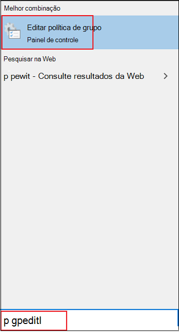

# Habilitar e configurar a proteção do Microsoft Defender Antivírus sempre ativa na Política de GrupoEnable and configure Microsoft Defender Antivirus always-on protection in Group Policy

[!INCLUDE [Microsoft 365 Defender rebranding](../../includes/microsoft-defender.md)]

**Aplica-se a:****Applies to:**

- [Microsoft Defender para Ponto de ExtremidadeMicrosoft Defender for Endpoint](/microsoft-365/security/defender-endpoint/)

A proteção always-on consiste em proteção em tempo real, monitoramento de comportamento e heurística para identificar malware com base em atividades suspeitas e mal-intencionadas conhecidas.Always-on protection consists of real-time protection, behavior monitoring, and heuristics to identify malware based on known suspicious and malicious activities.

Essas atividades incluem eventos, como processos que fazem alterações incomuns em arquivos existentes, modificação ou criação de chaves de registro de inicialização automática e locais de inicialização (também conhecidos como pontos de extensibilidade de início automático ou ASEPs) e outras alterações no sistema de arquivos ou na estrutura de arquivos.These activities include events, such as processes making unusual changes to existing files, modifying or creating automatic startup registry keys and startup locations (also known as auto-start extensibility points, or ASEPs), and other changes to the file system or file structure.

## Habilitar e configurar a proteção always-on na Política de GrupoEnable and configure always-on protection in Group Policy

Você pode usar **o Editor de Política de Grupo Local** para habilitar e configurar as configurações de proteção always-on do Microsoft Defender Antivírus.You can use **Local Group Policy Editor** to enable and configure Microsoft Defender Antivirus always-on protection settings.

Para habilitar e configurar a proteção always-on:To enable and configure always-on protection:

1. Abra **o Editor de Política de Grupo Local.**Open **Local Group Policy Editor**. Para fazer isso:To do this:  

    1. Na caixa de pesquisa da barra de tarefas do Windows 10, digite **gpedit**.In your Windows 10 taskbar search box, type **gpedit**.
    
    1. Em **Melhor combinação,** clique em **Editar política de grupo** para iniciar o Editor de Política de Grupo **Local.**Under **Best match**, click **Edit group policy** to launch **Local Group Policy Editor**.
    
       

2. No painel esquerdo do Editor de Política de  **Grupo Local**, expanda a árvore para Configuração do Computador Modelos  >  **Administrativos**  >  **componentes do Windows** Microsoft Defender  >  **Antivírus**.In the left pane of **Local Group Policy Editor**, expand the tree to **Computer Configuration** > **Administrative Templates** > **Windows Components** > **Microsoft Defender Antivirus**. 

3. Configure as configurações da política de serviço antimalware do Microsoft Defender Antivírus.Configure the Microsoft Defender Antivirus antimalware service policy settings. Para fazer isso:To do this:  

    1. No painel de detalhes do **Microsoft Defender Antivírus** à direita, clique duas vezes na configuração de política conforme especificado na tabela a seguir:In the **Microsoft Defender Antivirus** details pane on right, double-click the policy setting as specified in the following table:

       | SettingSetting | DescriçãoDescription | Configuração padrãoDefault setting |
       |-----------------------------|------------------------|-------------------------------|
       | Permitir que o serviço antimalware seja inicializado com prioridade normalAllow antimalware service to startup with normal priority | Você pode reduzir a prioridade do mecanismo do Microsoft Defender Antivírus, que pode ser útil em implantações leves em que você deseja ter o mais enxuto possível de um processo de inicialização.You can lower the priority of the Microsoft Defender Antivirus engine, which may be useful in lightweight deployments where you want to have as lean a startup process as possible. Isso pode afetar a proteção no ponto de extremidade.This may impact protection on the endpoint. | HabilitadoEnabled
       | Permitir que o serviço antimalware permaneça em execução sempreAllow antimalware service to remain running always | Se as atualizações de proteção foram desabilitadas, você pode definir o Microsoft Defender Antivírus para ainda ser executado.If protection updates have been disabled, you can set Microsoft Defender Antivirus to still run. Isso reduz a proteção no ponto de extremidade.This lowers the protection on the endpoint. | DesabilitadaDisabled |
    
    1. Configure a configuração conforme apropriado e clique em **OK**.Configure the setting as appropriate, and click **OK**.
    
    1. Repita as etapas anteriores para cada configuração na tabela.Repeat the previous steps for each setting in the table.

4. Configure as configurações da política de proteção em tempo real do Microsoft Defender Antivírus.Configure the Microsoft Defender Antivirus real-time protection policy settings. Para fazer isso:To do this:

    1. No painel de detalhes do **Microsoft Defender Antivírus,** clique duas vezes em **Proteção em Tempo Real.**In the **Microsoft Defender Antivirus** details pane, double-click **Real-time Protection**. Ou, na árvore **do Microsoft Defender Antivírus** no painel esquerdo, clique em **Proteção em Tempo Real.**Or, from the **Microsoft Defender Antivirus** tree on left pane, click **Real-time Protection**.
    
    1. No painel **Detalhes da Proteção** em Tempo Real à direita, clique duas vezes na configuração de política, conforme especificado na tabela a seguir:In the **Real-time Protection** details pane on right, double-click the policy setting as specified in the following table:  

       | SettingSetting | DescriçãoDescription | Configuração padrãoDefault setting |
       |-----------------------------|------------------------|-------------------------------|
       | Ativar o monitoramento de comportamentoTurn on behavior monitoring | O mecanismo AV monitorará processos de arquivo, alterações de arquivo e registro e outros eventos em seus pontos de extremidade para atividades mal-intencionadas suspeitas e conhecidas.The AV engine will monitor file processes, file and registry changes, and other events on your endpoints for suspicious and known malicious activity. | HabilitadoEnabled |
       | Examinar todos os arquivos e anexos baixadosScan all downloaded files and attachments | Arquivos baixados e anexos são verificados automaticamente.Downloaded files and attachments are automatically scanned. Isso funciona além do filtro Windows Defender SmartScreen, que verifica arquivos antes e durante o download.This operates in addition to the Windows Defender SmartScreen filter, which scans files before and during downloading. | HabilitadoEnabled |
       | Monitorar atividades de arquivo e programa em seu computadorMonitor file and program activity on your computer | O mecanismo do Microsoft Defender Antivírus observa quaisquer alterações de arquivo (gravações de arquivo, como movimentações, cópias ou modificações) e atividade geral do programa (programas abertos ou em execução e que fazem com que outros programas sejam executados).The Microsoft Defender Antivirus engine makes note of any file changes (file writes, such as moves, copies, or modifications) and general program activity (programs that are opened or running and that cause other programs to run). | HabilitadoEnabled |
       | Ativar notificações de gravação de volume brutoTurn on raw volume write notifications | As informações sobre gravações de volume bruto serão analisadas pelo monitoramento de comportamento.Information about raw volume writes will be analyzed by behavior monitoring. | HabilitadoEnabled |
       | Ativar a verificação de processo sempre que a proteção em tempo real estiver habilitadaTurn on process scanning whenever real-time protection is enabled | Você pode habilitar independentemente o mecanismo do Microsoft Defender Antivírus para examinar os processos em execução em busca de modificações ou comportamentos suspeitos.You can independently enable the Microsoft Defender Antivirus engine to scan running processes for suspicious modifications or behaviors. Isso é útil se você desabilitou temporariamente a proteção em tempo real e deseja verificar automaticamente os processos iniciados enquanto ele estava desabilitado.This is useful if you have temporarily disabled real-time protection and want to automatically scan processes that started while it was disabled. | HabilitadoEnabled |
       | Definir o tamanho máximo de arquivos e anexos baixados a serem verificadosDefine the maximum size of downloaded files and attachments to be scanned | Você pode definir o tamanho em kilobytes.You can define the size in kilobytes. | HabilitadoEnabled |
       | Configurar a substituição de configuração local para ativar o monitoramento de comportamentoConfigure local setting override for turn on behavior monitoring | Configure uma substituição local para a configuração do monitoramento de comportamento.Configure a local override for the configuration of behavior monitoring. Essa configuração só pode ser definida pela Política de Grupo.This setting can only be set by Group Policy. Se você habilitar essa configuração, a configuração de preferência local terá prioridade sobre a Política de Grupo.If you enable this setting, the local preference setting will take priority over Group Policy. Se você desabilitar ou não definir essa configuração, a Política de Grupo terá prioridade sobre a configuração de preferência local.If you disable or do not configure this setting, Group Policy will take priority over the local preference setting.| HabilitadoEnabled |
       | Configurar a substituição de configuração local para verificação de todos os arquivos e anexos baixadosConfigure local setting override for scanning all downloaded files and attachments | Configure uma substituição local para a configuração da verificação de todos os arquivos e anexos baixados.Configure a local override for the configuration of scanning for all downloaded files and attachments. Essa configuração só pode ser definida pela Política de Grupo.This setting can only be set by Group Policy. Se você habilitar essa configuração, a configuração de preferência local terá prioridade sobre a Política de Grupo.If you enable this setting, the local preference setting will take priority over Group Policy. Se você desabilitar ou não definir essa configuração, a Política de Grupo terá prioridade sobre a configuração de preferência local.If you disable or do not configure this setting, Group Policy will take priority over the local preference setting.| HabilitadoEnabled |
       | Configurar a substituição de configuração local para monitoramento de atividade de arquivo e programa no computadorConfigure local setting override for monitoring file and program activity on your computer | Configure uma substituição local para a configuração do monitoramento de atividades de arquivo e programa em seu computador.Configure a local override for the configuration of monitoring for file and program activity on your computer. Essa configuração só pode ser definida pela Política de Grupo.This setting can only be set by Group Policy. Se você habilitar essa configuração, a configuração de preferência local terá prioridade sobre a Política de Grupo.If you enable this setting, the local preference setting will take priority over Group Policy. Se você desabilitar ou não definir essa configuração, a Política de Grupo terá prioridade sobre a configuração de preferência local.If you disable or do not configure this setting, Group Policy will take priority over the local preference setting.| HabilitadoEnabled |
       | Configurar a substituição de configuração local para ativar a proteção em tempo realConfigure local setting override to turn on real-time protection | Configure uma substituição local para a configuração ativar a proteção em tempo real.Configure a local override for the configuration to turn on real-time protection. Essa configuração só pode ser definida pela Política de Grupo.This setting can only be set by Group Policy. Se você habilitar essa configuração, a configuração de preferência local terá prioridade sobre a Política de Grupo.If you enable this setting, the local preference setting will take priority over Group Policy. Se você desabilitar ou não definir essa configuração, a Política de Grupo terá prioridade sobre a configuração de preferência local.If you disable or do not configure this setting, Group Policy will take priority over the local preference setting.| HabilitadoEnabled |
       | Configurar a substituição de configuração local para monitoramento para atividade de arquivo de entrada e saídaConfigure local setting override for monitoring for incoming and outgoing file activity | Configure uma substituição local para a configuração do monitoramento para a atividade de arquivo de entrada e saída.Configure a local override for the configuration of monitoring for incoming and outgoing file activity. Essa configuração só pode ser definida pela Política de Grupo.This setting can only be set by Group Policy. Se você habilitar essa configuração, a configuração de preferência local terá prioridade sobre a Política de Grupo.If you enable this setting, the local preference setting will take priority over Group Policy. Se você desabilitar ou não definir essa configuração, a Política de Grupo terá prioridade sobre a configuração de preferência local.If you disable or do not configure this setting, Group Policy will take priority over the local preference setting. | HabilitadoEnabled |
       | Configurar o monitoramento para a atividade de arquivo e programa de entrada e saídaConfigure monitoring for incoming and outgoing file and program activity | Especifique se o monitoramento deve ocorrer na entrada, saída, ambas ou nenhuma direção.Specify whether monitoring should occur on incoming, outgoing, both, or neither direction. Isso é relevante para instalações do Windows Server em que você definiu servidores específicos ou Funções de Servidor que veem grandes quantidades de alterações de arquivo em apenas uma direção e você deseja melhorar o desempenho da rede.This is relevant for Windows Server installations where you have defined specific servers or Server Roles that see large amounts of file changes in only one direction and you want to improve network performance. Os pontos de extremidade (e servidores) totalmente atualizados em uma rede verão pouco impacto no desempenho independentemente do número ou direção das alterações de arquivo.Fully updated endpoints (and servers) on a network will see little performance impact irrespective of the number or direction of file changes. | Habilitado (ambas as direções)Enabled (both directions) |

    1. Configure a configuração conforme apropriado e clique em **OK**.Configure the setting as appropriate, and click **OK**.
    
    1. Repita as etapas anteriores para cada configuração na tabela.Repeat the previous steps for each setting in the table.

5. Configure a configuração da política de verificação do Microsoft Defender Antivírus.Configure the Microsoft Defender Antivirus scanning policy setting. Para fazer isso:To do this:  

    1. Na árvore **do Microsoft Defender Antivírus** no painel esquerdo, clique em **Verificar**.From the **Microsoft Defender Antivirus** tree on left pane, click **Scan**.
    
       

    1. No painel **Verificar** detalhes à direita, clique duas vezes na configuração de política conforme especificado na tabela a seguir:In the **Scan** details pane on right, double-click the policy setting as specified in the following table:

       | SettingSetting | DescriçãoDescription | Configuração padrãoDefault setting |
       |-----------------------------|------------------------|-------------------------------|    
       | Ativar heurísticaTurn on heuristics | A proteção heurística desabilitará ou bloqueará atividades suspeitas imediatamente antes que o mecanismo do Microsoft Defender Antivírus seja solicitado a detectar a atividade.Heuristic protection will disable or block suspicious activity immediately before the Microsoft Defender Antivirus engine is asked to detect the activity. | HabilitadoEnabled |

    1. Configure a configuração conforme apropriado e clique em **OK**.Configure the setting as appropriate, and click **OK**.
    
6. Feche **o Editor de Política de Grupo Local.**Close **Local Group Policy Editor**.

## Desabilitar a proteção em tempo real na Política de GrupoDisable real-time protection in Group Policy

> [!WARNING]
> Desabilitar a proteção em tempo real reduz drasticamente a proteção em seus pontos de extremidade e não é recomendado.Disabling real-time protection drastically reduces the protection on your endpoints and is not recommended.

O principal recurso de proteção em tempo real é habilitado por padrão, mas você pode desabilitá-lo usando o Editor de Política de **Grupo Local.**The main real-time protection capability is enabled by default, but you can disable it by using **Local Group Policy Editor**.

Para desabilitar a proteção em tempo real na política de grupo:To disable real-time protection in Group policy:

1. Abra **o Editor de Política de Grupo Local.**Open **Local Group Policy Editor**.

   1. Na caixa de pesquisa da barra de tarefas do Windows 10, digite **gpedit**.In your Windows 10 taskbar search box, type **gpedit**.
   
   1. Em **Melhor combinação,** clique em **Editar política de grupo** para iniciar o Editor de Política de Grupo **Local.**Under **Best match**, click **Edit group policy** to launch **Local Group Policy Editor**.

2.  No painel esquerdo do Editor de Política de Grupo **Local,** expanda a árvore para Configuração do Computador Modelos  >  **Administrativos componentes** do  >    >  **Windows Microsoft Defender Antivírus** Proteção em tempo  >  **real**.In the left pane of **Local Group Policy Editor**, expand the tree to **Computer Configuration** > **Administrative Templates** > **Windows Components** > **Microsoft Defender Antivirus** > **Real-time Protection**.

3. No painel **Detalhes da Proteção** em Tempo Real à direita, clique duas vezes em Desativar a proteção em tempo **real**.In the **Real-time Protection** details pane on right, double-click **Turn off real-time protection**.

   

4. Na janela **Desativar proteção em tempo real,** de definir a opção como **Habilitado**.In the **Turn off real-time protection** setting window, set the option to **Enabled**.

   
   
5. Clique em **OK**.Click **OK**.

6. Feche **o Editor de Política de Grupo Local.**Close **Local Group Policy Editor**.

## Artigos relacionadosRelated articles

- [Configurar a proteção comportamental, heurística e em tempo realConfigure behavioral, heuristic, and real-time protection](configure-protection-features-microsoft-defender-antivirus.md)
- [Microsoft Defender Antivírus no Windows 10Microsoft Defender Antivirus in Windows 10](microsoft-defender-antivirus-in-windows-10.md)