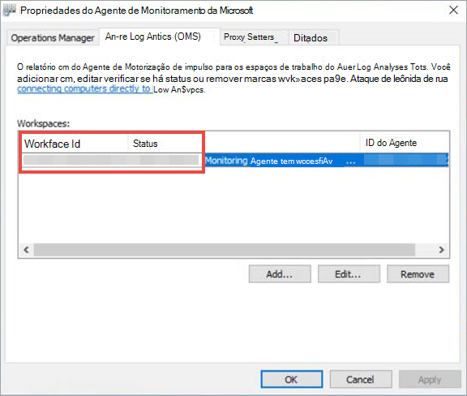

# <a name="onboard-windows-servers-to-the-microsoft-defender-for-endpoint-service"></a>Onboard Windows servers to the Microsoft Defender for Endpoint service

[!INCLUDE [Microsoft 365 Defender rebranding](../../includes/microsoft-defender.md)]


**Aplica-se a:**

- Windows Server 2008 R2 SP1
- Windows Server 2012 R2
- Windows Server 2016
- Windows Server (SAC) versão 1803 e posterior
- Windows Server 2019 e posterior
- Edição principal do Windows Server 2019

> Deseja experimentar o Defender para Ponto de Extremidade? [Inscreva-se para uma avaliação gratuita.](https://www.microsoft.com/microsoft-365/windows/microsoft-defender-atp?ocid=docs-wdatp-configserver-abovefoldlink)


O Defender for Endpoint estende o suporte para incluir também o sistema operacional Windows Server. Esse suporte fornece recursos avançados de detecção e investigação de ataques perfeitamente por meio do console do Centro de Segurança do Microsoft Defender.

Para obter uma orientação prática sobre o que precisa ser feito para licenciamento e infraestrutura, consulte Protegendo servidores [Windows com o Defender para Ponto de Extremidade.](https://techcommunity.microsoft.com/t5/What-s-New/Protecting-Windows-Server-with-Windows-Defender-ATP/m-p/267114#M128)

Para obter orientações sobre como baixar e usar as Linhas de Base de Segurança do Windows para servidores Windows, consulte Linhas de Base de Segurança do [Windows.](https://docs.microsoft.com/windows/device-security/windows-security-baselines)

<br>

## <a name="windows-server-2008-r2-sp1-windows-server-2012-r2-and-windows-server-2016"></a>Windows Server 2008 R2 SP1, Windows Server 2012 R2 e Windows Server 2016

Você pode integrar o Windows Server 2008 R2 SP1, o Windows Server 2012 R2 e o Windows Server 2016 para o Defender para Ponto de Extremidade usando qualquer uma das seguintes opções:

- **Opção 1:** [Integrando instalando e configurando o Microsoft Monitoring Agent (MMA)](#option-1-onboard-by-installing-and-configuring-microsoft-monitoring-agent-mma)
- **Opção 2**: [Integração por meio do Centro de Segurança do Azure](#option-2-onboard-windows-servers-through-azure-security-center)
- **Opção 3**: [Integração com o Microsoft Endpoint Manager versão 2002 e posterior](#option-3-onboard-windows-servers-through-microsoft-endpoint-manager-version-2002-and-later)


Após concluir as etapas de integração usando qualquer uma das opções fornecidas, você precisará configurar e atualizar os clientes de Proteção de Ponto de Extremidade do [System Center.](#configure-and-update-system-center-endpoint-protection-clients)


> [!NOTE]
> A licença de servidor autônomo do Defender for Endpoint é necessária, por nó, para a integração de um servidor Windows por meio do Microsoft Monitoring Agent (Opção 1) ou por meio do Microsoft Endpoint Manager (Opção 3). Como alternativa, uma licença do Azure Defender for Servers é necessária, por nó, para a integração de um servidor Windows por meio do Centro de Segurança do Azure (Opção 2), consulte Recursos com suporte disponíveis no Centro de Segurança [do Azure.](https://docs.microsoft.com/azure/security-center/security-center-services)


### <a name="option-1-onboard-by-installing-and-configuring-microsoft-monitoring-agent-mma"></a>Opção 1: Integrando instalando e configurando o Microsoft Monitoring Agent (MMA)
Você precisará instalar e configurar o MMA para servidores Windows para relatar dados do sensor ao Defender para o Ponto de Extremidade. Para obter mais informações, consulte [Coletar dados de log com o agente do Azure Log Analytics.](https://docs.microsoft.com/azure/azure-monitor/platform/log-analytics-agent)

Se você já estiver usando o System Center Operations Manager (SCOM) ou o Azure Monitor (anteriormente conhecido como Operations Management Suite (OMS),anexe o Microsoft Monitoring Agent (MMA) para relatar ao seu espaço de trabalho do Defender para Ponto de Extremidade por meio do suporte a Multihoming.

Em geral, você precisará seguir as seguintes etapas:
1. Cumpra os requisitos de integração descritos na **seção Antes de** começar.
2. Ativar o monitoramento do servidor do Centro de Segurança do Microsoft Defender.
3. Instale e configure o MMA para o servidor relatar dados do sensor ao Defender para Ponto de Extremidade.
4. Configurar e atualizar clientes de Proteção de Ponto de Extremidade do System Center.


> [!TIP]
> Após a integração do dispositivo, você pode optar por executar um teste de detecção para verificar se ele está corretamente conectado ao serviço. Para obter mais informações, [consulte Execute a detection test on a newly onboarded Defender for Endpoint endpoint endpoint endpoint](run-detection-test.md).


#### <a name="before-you-begin"></a>Antes de começar 
Execute as seguintes etapas para atender aos requisitos de integração:

 - Para Windows Server 2008 R2 SP1 ou Windows Server 2012 R2, certifique-se de instalar o seguinte hotfix:
    - [Atualização para experiência do cliente e telemetria de diagnóstico](https://support.microsoft.com/help/3080149/update-for-customer-experience-and-diagnostic-telemetry)

 - Além disso, para o Windows Server 2008 R2 SP1, verifique se você atende aos seguintes requisitos:
    - Instalar o [acúmulo de atualizações mensal de fevereiro](https://support.microsoft.com/help/4074598/windows-7-update-kb4074598)
    - Instalar o [.NET framework 4.5](https://www.microsoft.com/download/details.aspx?id=30653) (ou posterior) ou [KB3154518](https://support.microsoft.com/help/3154518/support-for-tls-system-default-versions-included-in-the-net-framework)
   
   > [!NOTE]
    > Se você estiver gerenciando seu Windows Server 2008 R2 SP1 com SCCM, o agente cliente SCCM instalará o .Net Framework 4.5.2. Portanto, você não precisa instalar o .NET framework 4.5 (ou posterior).
   
 - Para Windows Server 2008 R2 SP1 e Windows Server 2012 R2: Configurar e atualizar clientes de Proteção de Ponto de Extremidade do [System Center.](#configure-and-update-system-center-endpoint-protection-clients)

    > [!NOTE]
    > Esta etapa só será necessária se sua organização usar o System Center Endpoint Protection (SCEP) e você estiver integrando o Windows Server 2008 R2 SP1 e o Windows Server 2012 R2.


<span id="server-mma"/>

### <a name="install-and-configure-microsoft-monitoring-agent-mma-to-report-sensor-data-to-microsoft-defender-for-endpoint"></a>Instalar e configurar o Microsoft Monitoring Agent (MMA) para relatar dados do sensor ao Microsoft Defender para Ponto de Extremidade

1. Baixe o arquivo de instalação do agente: [agente do Windows 64 bits.](https://go.microsoft.com/fwlink/?LinkId=828603)

2. Usando a ID do Workspace e a chave do Workspace obtidas no procedimento anterior, escolha qualquer um dos seguintes métodos de instalação para instalar o agente no servidor Windows:
    - [Instale manualmente o agente usando a instalação](https://docs.microsoft.com/azure/log-analytics/log-analytics-windows-agents#install-agent-using-setup-wizard). <br>
    Na página **Opções de Instalação do** Agente, escolha Conectar o agente ao **OMS (Análise de Log do Azure).**
    - [Instale o agente usando a linha de comando](https://docs.microsoft.com/azure/log-analytics/log-analytics-windows-agents#install-agent-using-command-line).
    - [Configure o agente usando um script](https://docs.microsoft.com/azure/log-analytics/log-analytics-windows-agents#install-agent-using-dsc-in-azure-automation).

> [!NOTE]
> Se você for um cliente do Governo dos EUA [,](gov.md)em "Nuvem do Azure" precisará escolher "Azure US Government" se estiver usando o assistente de instalação ou se estiver usando uma linha de comando ou um script , de definir o parâmetro "OPINSIGHTS_WORKSPACE_AZURE_CLOUD_TYPE" como 1.


<span id="server-proxy"/>

### <a name="configure-windows-server-proxy-and-internet-connectivity-settings-if-needed"></a>Configurar configurações de conectividade com o servidor Windows e a Internet, se necessário
Se os servidores precisarem usar um proxy para se comunicar com o Defender para Ponto de Extremidade, use um dos seguintes métodos para configurar o MMA para usar o servidor proxy:


- [Configurar o MMA para usar um servidor proxy](https://docs.microsoft.com/azure/azure-monitor/platform/agent-windows#install-agent-using-setup-wizard)

- [Configurar o Windows para usar um servidor proxy para todas as conexões](configure-proxy-internet.md)

Se um proxy ou firewall estiver em uso, verifique se os servidores podem acessar todas as URLs de serviço do Microsoft Defender para Ponto de Extremidade diretamente e sem interceptação SSL. Para obter mais informações, consulte [enable access to Defender for Endpoint service URLs](configure-proxy-internet.md#enable-access-to-microsoft-defender-for-endpoint-service-urls-in-the-proxy-server). O uso da interceptação SSL impedirá que o sistema se comunique com o serviço Defender para Ponto de Extremidade. 

Depois de concluído, você deverá ver servidores Windows internados no portal dentro de uma hora.

### <a name="option-2-onboard-windows-servers-through-azure-security-center"></a>Opção 2: Integração de servidores Windows por meio do Centro de Segurança do Azure
1. No painel de navegação do Centro de Segurança do Microsoft Defender, selecione **Configurações**  >  **Gerenciamento de**  >  **dispositivos Integrando**.

2. Selecione **Windows Server 2008 R2 SP1, 2012 R2 e 2016** como o sistema operacional.

3. Clique **em Servidores Integrados no Centro de Segurança do Azure.**

4. Siga as instruções de integração no [Microsoft Defender para Ponto de Extremidade com o Centro de Segurança do Azure.](https://docs.microsoft.com/azure/security-center/security-center-wdatp)

Após concluir as etapas de integração, você precisará configurar e atualizar os clientes de Proteção de Ponto de Extremidade do [System Center.](#configure-and-update-system-center-endpoint-protection-clients)

> [!NOTE]
> - Para que a integração por meio do Azure Defender for Servers (anteriormente Azure Security Center Standard Edition) funcione conforme o esperado, o servidor deve ter um espaço de trabalho e uma chave apropriados configurados nas configurações do Microsoft Monitoring Agent (MMA).
> - Depois de configurado, o pacote de gerenciamento de nuvem apropriado é implantado no computador e o processo de sensor (MsSenseS.exe) será implantado e iniciado. 
> - Isso também será necessário se o servidor estiver configurado para usar um servidor gateway OMS como proxy.

### <a name="option-3-onboard-windows-servers-through-microsoft-endpoint-manager-version-2002-and-later"></a>Opção 3: Integração de servidores Windows por meio do Microsoft Endpoint Manager versão 2002 e posterior
Você pode integrar o Windows Server 2012 R2 e o Windows Server 2016 usando o Microsoft Endpoint Manager versão 2002 e posterior. Para obter mais informações, consulte [Microsoft Defender for Endpoint in Microsoft Endpoint Manager current branch](https://docs.microsoft.com/mem/configmgr/protect/deploy-use/defender-advanced-threat-protection).

Após concluir as etapas de integração, você precisará configurar e atualizar os clientes de Proteção de Ponto de Extremidade do [System Center.](#configure-and-update-system-center-endpoint-protection-clients)

<br>

## <a name="windows-server-sac-version-1803-windows-server-2019-and-windows-server-2019-core-edition"></a>Windows Server (SAC) versão 1803, Windows Server 2019 e Windows Server 2019 Core edition
Você pode integrar o Windows Server (SAC) versão 1803, o Windows Server 2019 ou a edição Core do Windows Server 2019 usando os seguintes métodos de implantação:

- [Script local](configure-endpoints-script.md) 
- [Política de grupo](configure-endpoints-gp.md)
- [Gerenciador de Configuração do Microsoft Endpoint](configure-endpoints-sccm.md)
- [System Center Configuration Manager 2012 /2012 R2 1511 / 1602](configure-endpoints-sccm.md#onboard-devices-using-system-center-configuration-manager)
- [Scripts de integração VDI para dispositivos não persistentes](configure-endpoints-vdi.md)

> [!NOTE]
> - O pacote de integração do Windows Server 2019 por meio do Microsoft Endpoint Manager atualmente envia um script. Para obter mais informações sobre como implantar scripts no Configuration Manager, consulte [Pacotes e programas no Configuration Manager](https://docs.microsoft.com/configmgr/apps/deploy-use/packages-and-programs).
> - Um script local é adequado para uma prova de conceito, mas não deve ser usado para implantação de produção. Para uma implantação de produção, recomendamos usar a Política de Grupo ou o Microsoft Endpoint Configuration Manager.

O suporte para o Windows Server fornece informações mais profundas sobre atividades do servidor, cobertura para detecção de ataque de kernel e memória e habilita ações de resposta.

1. Configure as configurações de integração do Defender para Ponto de Extremidade no servidor Windows usando as mesmas ferramentas e métodos para dispositivos Windows 10. Para obter mais informações, consulte [Onboard Windows 10 devices](configure-endpoints.md).

2. Se você estiver executando uma solução antimalware de terceiros, precisará aplicar as seguintes configurações de modo passivo do Microsoft Defender AV. Verifique se ele foi configurado corretamente:

    1. De definir a seguinte entrada do Registro:
       - Caminho: `HKLM\SOFTWARE\Policies\Microsoft\Windows Advanced Threat Protection`
       - Nome: ForceDefenderPassiveMode
       - Tipo: REG_DWORD
       - Value: 1

    1. Execute o seguinte comando do PowerShell para verificar se o modo passivo foi configurado:

       ```PowerShell
       Get-WinEvent -FilterHashtable @{ProviderName="Microsoft-Windows-Sense" ;ID=84}
       ```

    1. Confirme se um evento recente que contém o evento de modo passivo foi encontrado:

       

3. Execute o seguinte comando para verificar se o Microsoft Defender AV está instalado:

   ```sc.exe query Windefend```

    Se o resultado for 'O serviço especificado não existe como um serviço instalado', você precisará instalar o Microsoft Defender AV. Para obter mais informações, consulte [Microsoft Defender Antivírus no Windows 10](https://docs.microsoft.com/windows/security/threat-protection/microsoft-defender-antivirus/microsoft-defender-antivirus-in-windows-10).
    
    Para obter informações sobre como usar a Política de Grupo para configurar e gerenciar o Microsoft Defender Antivírus em seus servidores Windows, consulte [Use Group Policy settings to configure and manage Microsoft Defender Antivírus](https://docs.microsoft.com/windows/security/threat-protection/microsoft-defender-antivirus/use-group-policy-microsoft-defender-antivirus).

<br>

## <a name="integration-with-azure-security-center"></a>Integração com o Centro de Segurança do Azure
O Defender for Endpoint pode se integrar ao Centro de Segurança do Azure para fornecer uma solução abrangente de proteção do servidor Windows. Com essa integração, o Centro de Segurança do Azure pode usar o poder do Defender para o Ponto de Extremidade para fornecer detecção aprimorada de ameaças para servidores Windows.

Os seguintes recursos estão incluídos nesta integração:
- Integração automatizada – o sensor Defender para Ponto de Extremidade é habilitado automaticamente em Servidores Windows que estão integrados ao Centro de Segurança do Azure. Para obter mais informações sobre a integração do Centro de Segurança do Azure, consulte [Onboarding to Azure Security Center Standard for enhanced security](https://docs.microsoft.com/azure/security-center/security-center-onboarding).

    > [!NOTE]
    > A integração entre o Azure Defender for Servers e o Microsoft Defender for Endpoint foi expandida para dar suporte ao Windows Server 2019 e à Área de Trabalho [Virtual do Windows (WVD).](https://docs.microsoft.com/azure/security-center/release-notes#microsoft-defender-for-endpoint-integration-with-azure-defender-now-supports-windows-server-2019-and-windows-10-virtual-desktop-wvd-in-preview)

- Os servidores Windows monitorados pelo Centro de Segurança do Azure também estarão disponíveis no Defender para Ponto de Extremidade - o Centro de Segurança do Azure conecta-se perfeitamente ao locatário do Defender para Ponto de Extremidade, fornecendo uma única exibição entre clientes e servidores.  Além disso, os alertas do Defender para Ponto de Extremidade estarão disponíveis no console do Centro de Segurança do Azure.
- Investigação do servidor - Os clientes do Centro de Segurança do Azure podem acessar o Centro de Segurança do Microsoft Defender para executar uma investigação detalhada para descobrir o escopo de uma possível violação.

> [!IMPORTANT]
> - Quando você usa o Centro de Segurança do Azure para monitorar servidores, um locatário do Defender for Endpoint é criado automaticamente (nos EUA para usuários dos EUA, na UE para usuários europeus e do Reino Unido).<br>
Os dados coletados pelo Defender para Ponto de Extremidade são armazenados na localização geográfica do locatário conforme identificado durante o provisionamento.
> - Se você usar o Defender para o Ponto de Extremidade antes de usar o Centro de Segurança do Azure, seus dados serão armazenados no local especificado quando você criou seu locatário, mesmo que você se integre ao Centro de Segurança do Azure posteriormente.
> - Depois de configurado, você não pode alterar o local onde seus dados estão armazenados. Se precisar mover seus dados para outro local, entre em contato com o Suporte da Microsoft para redefinir o locatário. <br>
O monitoramento do ponto de extremidade do servidor que utiliza essa integração foi desabilitado para clientes do Office 365 GCC.

<br>

## <a name="configure-and-update-system-center-endpoint-protection-clients"></a>Configurar e atualizar clientes de Proteção de Ponto de Extremidade do System Center

O Defender para Ponto de Extremidade se integra à Proteção de Ponto de Extremidade do System Center. A integração fornece visibilidade para detecções de malware e para interromper a propagação de um ataque em sua organização, proibindo arquivos potencialmente mal-intencionados ou malwares suspeitos.

As etapas a seguir são necessárias para habilitar essa integração:
- Instale a atualização da plataforma anti-malware de janeiro de [2017](https://support.microsoft.com/help/3209361/january-2017-anti-malware-platform-update-for-endpoint-protection-clie)para clientes de Proteção de Ponto de Extremidade.

- [Configure a associação do Serviço de Proteção de Nuvem](https://docs.microsoft.com/windows/security/threat-protection/microsoft-defender-antivirus/enable-cloud-protection-microsoft-defender-antivirus) do cliente SCEP à **configuração** Avançado.

<br>

## <a name="offboard-windows-servers"></a>Servidores Windows de offboard
Você pode tirar o windows server (SAC), o Windows Server 2019 e a edição Core do Windows Server 2019 no mesmo método disponível para dispositivos cliente Windows 10.

Para outras versões do servidor Windows, você tem duas opções para desligar servidores Windows do serviço:
- Desinstalar o agente MMA
- Remover a configuração do espaço de trabalho do Defender para Ponto de Extremidade

> [!NOTE]
> O offboard faz com que o servidor Windows pare de enviar dados do sensor para o portal, mas os dados do servidor Windows, incluindo a referência a todos os alertas que ele teve, serão mantidos por até 6 meses.

### <a name="uninstall-windows-servers-by-uninstalling-the-mma-agent"></a>Desinstalar servidores Windows desinstalando o agente MMA
Para desinstalar o servidor Windows, você pode desinstalar o agente MMA do servidor Windows ou desconecta-lo do relatório para o seu espaço de trabalho do Defender para Ponto de Extremidade. Depois de desligar o agente, o servidor Windows não enviará mais dados do sensor para o Defender para o Ponto de Extremidade.
Para obter mais informações, consulte [Para desabilitar um agente](https://docs.microsoft.com/azure/log-analytics/log-analytics-windows-agents#to-disable-an-agent).

### <a name="remove-the-defender-for-endpoint-workspace-configuration"></a>Remover a configuração do espaço de trabalho do Defender para Ponto de Extremidade
Para fazer o offboard do servidor Windows, você pode usar um dos seguintes métodos:

- Remover a configuração do espaço de trabalho do Defender for Endpoint do agente MMA
- Execute um comando do PowerShell para remover a configuração

#### <a name="remove-the-defender-for-endpoint-workspace-configuration-from-the-mma-agent"></a>Remover a configuração do espaço de trabalho do Defender for Endpoint do agente MMA

1. Na guia Propriedades do Agente de Monitoramento **da Microsoft,** selecione a guia Análise de **Log do Azure (OMS).**

2. Selecione o espaço de trabalho Defender para Ponto de Extremidade e clique em **Remover**.

    

#### <a name="run-a-powershell-command-to-remove-the-configuration"></a>Execute um comando do PowerShell para remover a configuração

1. Obter sua ID do Workspace:

   1. No painel de navegação, selecione **Configurações**  >  **Integração**.

   1. Selecione **Windows Server 2008 R2 SP1, 2012 R2 e 2016** como o sistema operacional e obter sua ID do Workspace:

      

2. Abra um PowerShell elevado e execute o seguinte comando. Use a ID do Espaço de Trabalho obtida e substituindo `WorkspaceID` :

    ```powershell
    $ErrorActionPreference = "SilentlyContinue"
    # Load agent scripting object
    $AgentCfg = New-Object -ComObject AgentConfigManager.MgmtSvcCfg
    # Remove OMS Workspace
    $AgentCfg.RemoveCloudWorkspace("WorkspaceID")
    # Reload the configuration and apply changes
    $AgentCfg.ReloadConfiguration()

    ```

<br>

## <a name="related-topics"></a>Tópicos relacionados
- [Dispositivos integrados do Windows 10](configure-endpoints.md)
- [Dispositivos Windows não integrados](configure-endpoints-non-windows.md)
- [Definir as configurações de proxy e conectividade com a Internet](configure-proxy-internet.md)
- [Executar um teste de detecção em um dispositivo Defender para Ponto de Extremidade recém-integrado](run-detection-test.md)
- [Solução de problemas de integração do Microsoft Defender para Ponto de Extremidade](troubleshoot-onboarding.md)
