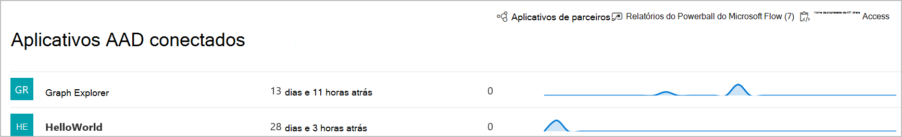

# Aplicativos conectados no Microsoft Defender para Ponto de Extremidade

[!INCLUDE [Microsoft 365 Defender rebranding](../../includes/microsoft-defender.md)]

**Aplica-se a:**
- [Microsoft Defender para Ponto de Extremidade](https://go.microsoft.com/fwlink/p/?linkid=2154037)
- [Microsoft 365 Defender](https://go.microsoft.com/fwlink/?linkid=2118804)

>Deseja experimentar o Defender para Ponto de Extremidade? [Inscreva-se para uma avaliação gratuita.](https://www.microsoft.com/microsoft-365/windows/microsoft-defender-atp?ocid=docs-wdatp-assignaccess-abovefoldlink)

Aplicativos conectados se integram à plataforma Defender para Ponto de Extremidade usando APIs. 

Os aplicativos usam o protocolo OAuth 2.0 padrão para autenticar e fornecer tokens para uso com o Microsoft Defender para APIs de Ponto de Extremidade.  Além disso, os aplicativos do Azure Active Directory (Azure AD) permitem que os administradores de locatários deem um controle explícito sobre quais APIs podem ser acessadas usando o aplicativo correspondente.
 
Você precisará seguir estas etapas [para](https://docs.microsoft.com/microsoft-365/security/defender-endpoint/apis-intro) usar as APIs com o aplicativo conectado.
 
## Acessar a página de aplicativo conectado
No menu de navegação esquerdo, selecione **Parceiros & APIs**  >  **aplicativos AAD conectados.**

 
## Exibir detalhes do aplicativo conectado
A página Aplicativos Conectados fornece informações sobre os aplicativos do Azure AD conectados ao Microsoft Defender para Ponto de Extremidade em sua organização. Você pode revisar o uso dos aplicativos conectados: visto pela última vez, número de solicitações nas últimas 24 horas e solicitar tendências nos últimos 30 dias.

 
## Editar, reconfigurar ou excluir um aplicativo conectado
O **link Abrir configurações do** aplicativo abre a página de gerenciamento de aplicativos do Azure AD correspondente no portal do Azure. No portal do Azure, você pode gerenciar permissões, reconfigurar ou excluir os aplicativos conectados.
