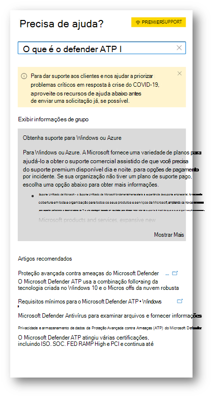
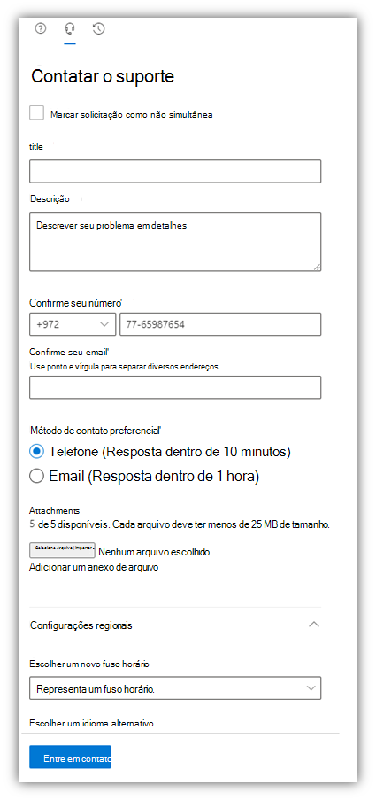

# Entre em contato com suporte do Microsoft Defender para Ponto de Extremidade

[!INCLUDE [Microsoft 365 Defender rebranding](../../includes/microsoft-defender.md)]

**Aplica-se a:**
- [Microsoft Defender para Ponto de Extremidade](https://go.microsoft.com/fwlink/p/?linkid=2154037)
- [Microsoft 365 Defender](https://go.microsoft.com/fwlink/?linkid=2118804)

>Deseja experimentar o Defender para Ponto de Extremidade? [Inscreva-se para uma avaliação gratuita.](https://www.microsoft.com/microsoft-365/windows/microsoft-defender-atp?ocid=docs-wdatp-assignaccess-abovefoldlink)

O Defender for Endpoint atualizou recentemente o processo de suporte para oferecer uma experiência de suporte mais moderna e avançada. 

O novo widget permite que os clientes:
- Encontrar soluções para problemas comuns
- Enviar um caso de suporte à equipe de suporte da Microsoft

## Pré-requisitos
É importante conhecer as funções específicas que têm permissão para abrir casos de suporte.

No mínimo, você deve ter uma função de Administrador de Suporte de Serviço **OU** Administrador do Helpdesk.

Para obter mais informações sobre quais funções têm permissão, consulte [Security Administrator permissions](https://docs.microsoft.com/azure/active-directory/users-groups-roles/directory-assign-admin-roles#security-administrator-permissions). Funções que incluem a ação `microsoft.office365.supportTickets/allEntities/allTasks` podem enviar uma ocorrência.

Para obter informações gerais sobre funções de administrador, consulte [Sobre funções de administrador](https://docs.microsoft.com/microsoft-365/admin/add-users/about-admin-roles?view=o365-worldwide&preserve-view=true).

## Acessar o widget
Acessar o novo widget de suporte pode ser feito de duas maneiras:

1.  Clicando no ponto de interrogação na parte superior direita do portal e clicando em "Suporte da Microsoft":

    

2. Clicando na necessidade **de ajuda?**  botão na parte inferior direita do Centro de Segurança do Microsoft Defender:

    

No widget, você receberá duas opções:

- Encontrar soluções para problemas comuns    
- Abrir uma solicitação de serviço  

## Encontrar soluções para problemas comuns
Essa opção inclui artigos que podem estar relacionados à pergunta que você pode fazer. Basta começar a digitar a pergunta na caixa de pesquisa e os artigos relacionados à sua pesquisa serão publicados.

Caso os artigos sugeridos não sejam suficientes, você pode abrir uma solicitação de serviço.

## Abrir uma solicitação de serviço

Saiba como abrir tíquetes de suporte contatando o suporte do Defender para Ponto de Extremidade. 

> [!Note]
> Se você tiver um contrato de suporte de permier com a Microsoft, verá a marca premier no widget. Caso não seja, entre em contato com o gerente de conta da Microsoft.

### Contatar o suporte
Essa opção está disponível clicando no ícone que se parece com um fone de ouvido. Em seguida, você receberá a seguinte página para enviar seu caso de suporte:

1. Preencha um título e uma descrição para o problema que você está enfrentando, bem como um número de telefone e um endereço de email onde podemos entrar em contato com você. 

2. (Opcional) Inclua até cinco anexos relevantes para o problema para fornecer contexto adicional para o caso de suporte. 

3. Selecione seu fuso horário e um idioma alternativo, se aplicável. A solicitação será enviada para a Equipe de Suporte da Microsoft. A equipe responderá à sua solicitação de serviço em breve.

## Tópicos relacionados
- [Solucionar problemas de serviço](troubleshoot-mdatp.md)
- [Verificar integridade do serviço](service-status.md)
