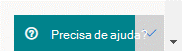

# Entre em contato com suporte do Microsoft Defender para Ponto de ExtremidadeContact Microsoft Defender for Endpoint support

[!INCLUDE [Microsoft 365 Defender rebranding](../../includes/microsoft-defender.md)]

**Aplica-se a:****Applies to:**
- [Microsoft Defender para Ponto de ExtremidadeMicrosoft Defender for Endpoint](https://go.microsoft.com/fwlink/p/?linkid=2154037)
- [Microsoft 365 DefenderMicrosoft 365 Defender](https://go.microsoft.com/fwlink/?linkid=2118804)

>Deseja experimentar o Defender para Ponto de Extremidade?Want to experience Defender for Endpoint? [Inscreva-se para uma avaliação gratuita.Sign up for a free trial.](https://www.microsoft.com/microsoft-365/windows/microsoft-defender-atp?ocid=docs-wdatp-assignaccess-abovefoldlink)

O Defender for Endpoint atualizou recentemente o processo de suporte para oferecer uma experiência de suporte mais moderna e avançada.Defender for Endpoint has recently upgraded the support process to offer a more modern and advanced support experience. 

O novo widget permite que os clientes:The new widget allows customers to:
- Encontrar soluções para problemas comunsFind solutions to common problems
- Enviar um caso de suporte à equipe de suporte da MicrosoftSubmit a support case to the Microsoft support team

## Pré-requisitosPrerequisites
É importante conhecer as funções específicas que têm permissão para abrir casos de suporte.It's important to know the specific roles that have permission to open support cases.

No mínimo, você deve ter uma função de Administrador de Suporte de Serviço **OU** Administrador do Helpdesk.At a minimum, you must have a Service Support Administrator **OR** Helpdesk Administrator role.

Para obter mais informações sobre quais funções têm permissão, consulte [Security Administrator permissions](https://docs.microsoft.com/azure/active-directory/users-groups-roles/directory-assign-admin-roles#security-administrator-permissions).For more information on which roles have permission see, [Security Administrator permissions](https://docs.microsoft.com/azure/active-directory/users-groups-roles/directory-assign-admin-roles#security-administrator-permissions). Funções que incluem a ação `microsoft.office365.supportTickets/allEntities/allTasks` podem enviar uma ocorrência.Roles that include the action `microsoft.office365.supportTickets/allEntities/allTasks` can submit a case.

Para obter informações gerais sobre funções de administrador, consulte [Sobre funções de administrador](https://docs.microsoft.com/microsoft-365/admin/add-users/about-admin-roles?view=o365-worldwide&preserve-view=true).For general information on admin roles, see [About admin roles](https://docs.microsoft.com/microsoft-365/admin/add-users/about-admin-roles?view=o365-worldwide&preserve-view=true).

## Acessar o widgetAccess the widget
Acessar o novo widget de suporte pode ser feito de duas maneiras:Accessing the new support widget can be done in one of two ways:

1.  Clicando no ponto de interrogação na parte superior direita do portal e clicando em "Suporte da Microsoft":Clicking on the question mark on the top right of the portal and then clicking on "Microsoft support":

    

2. Clicando na necessidade **de ajuda?**Clicking on the **Need help?**  botão na parte inferior direita do Centro de Segurança do Microsoft Defender:button in the bottom right of the Microsoft Defender Security Center:

    

No widget, você receberá duas opções:In the widget you will be offered two options:

- Encontrar soluções para problemas comunsFind solutions to common problems    
- Abrir uma solicitação de serviçoOpen a service request  

## Encontrar soluções para problemas comunsFind solutions to common problems
Essa opção inclui artigos que podem estar relacionados à pergunta que você pode fazer.This option includes articles that might be related to the question you may ask. Basta começar a digitar a pergunta na caixa de pesquisa e os artigos relacionados à sua pesquisa serão publicados.Just start typing the question in the search box and articles related to your search will be surfaced.

Caso os artigos sugeridos não sejam suficientes, você pode abrir uma solicitação de serviço.In case the suggested articles are not sufficient, you can open a service request.

## Abrir uma solicitação de serviçoOpen a service request

Saiba como abrir tíquetes de suporte contatando o suporte do Defender para Ponto de Extremidade.Learn how to open support tickets by contacting Defender for Endpoint support. 

> [!Note]
> Se você tiver um contrato de suporte de permier com a Microsoft, verá a marca premier no widget.If you have a permier support contract with Microsoft, you will see the premier tag on the widget. Caso não seja, entre em contato com o gerente de conta da Microsoft.If not, contact your Microsoft account manager.

### Contatar o suporteContact support
Essa opção está disponível clicando no ícone que se parece com um fone de ouvido.This option is available by clicking the icon that looks like a headset. Em seguida, você receberá a seguinte página para enviar seu caso de suporte:You will then get the following page to submit your support case:

1. Preencha um título e uma descrição para o problema que você está enfrentando, bem como um número de telefone e um endereço de email onde podemos entrar em contato com você.Fill in a title and description for the issue you are facing, as well as a phone number and email address where we may reach you. 

2. (Opcional) Inclua até cinco anexos relevantes para o problema para fornecer contexto adicional para o caso de suporte.(Optional) Include up to five attachments that are relevant to the issue in order to provide additional context for the support case. 

3. Selecione seu fuso horário e um idioma alternativo, se aplicável.Select your time zone and an alternative language, if applicable. A solicitação será enviada para a Equipe de Suporte da Microsoft.The request will be sent to Microsoft Support Team. A equipe responderá à sua solicitação de serviço em breve.The team will respond to your service request shortly.

## Tópicos relacionadosRelated topics
- [Solucionar problemas de serviçoTroubleshoot service issues](troubleshoot-mdatp.md)
- [Verificar integridade do serviçoCheck service health](service-status.md)
