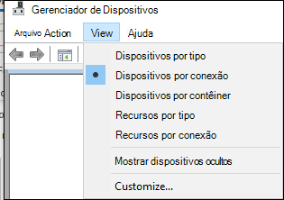
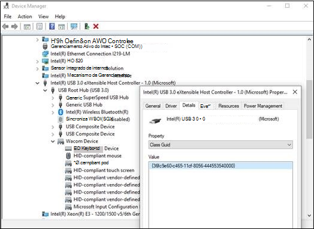
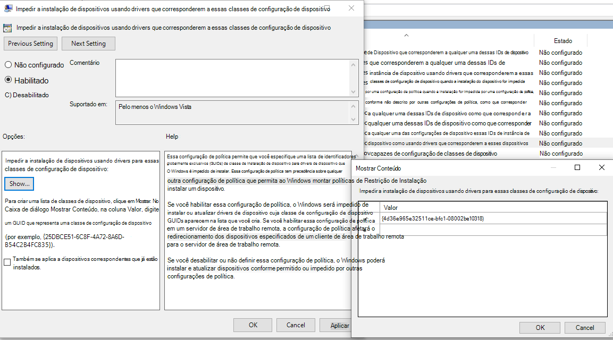
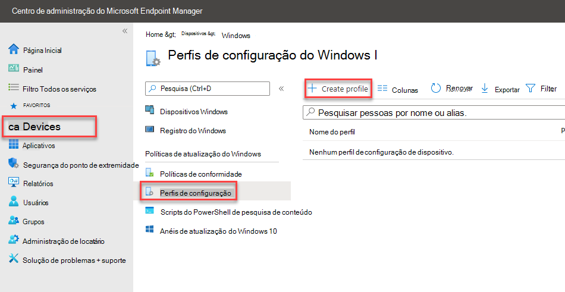
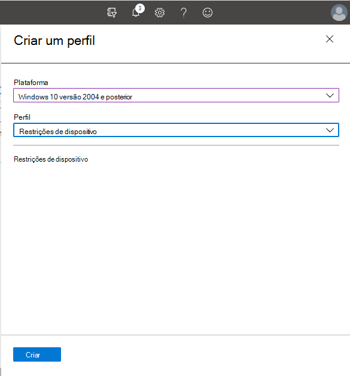
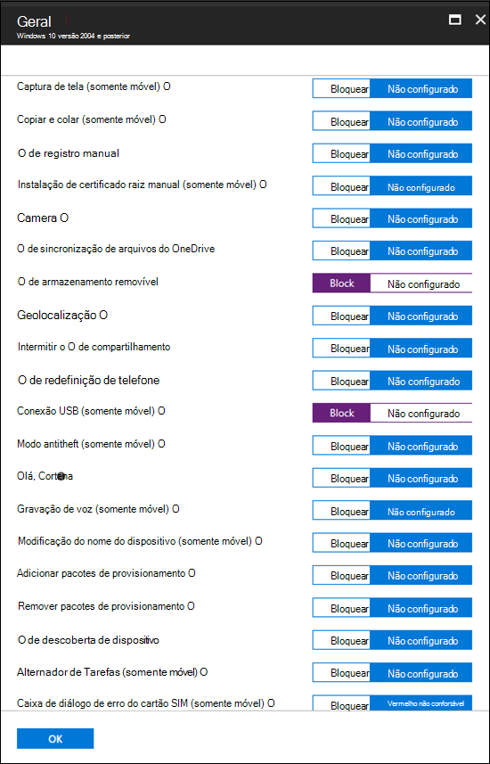
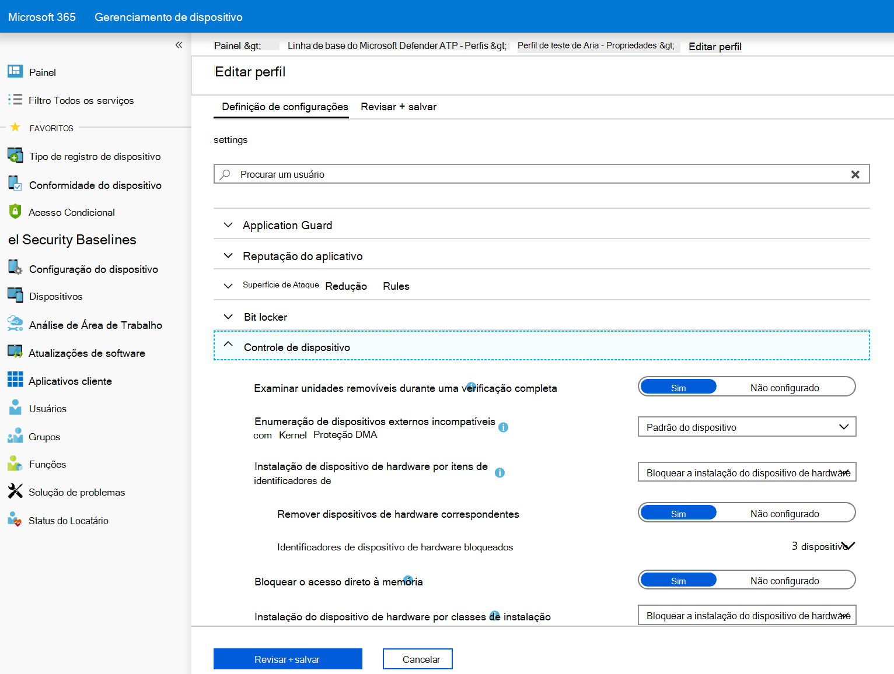
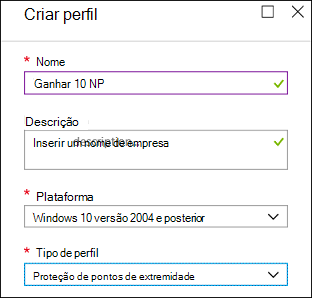
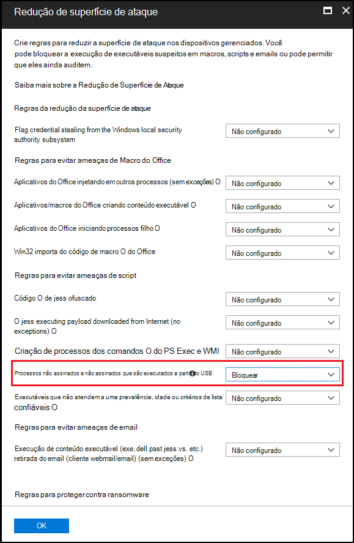

# <a name="how-to-control-usb-devices-and-other-removable-media-using-microsoft-defender-for-endpoint"></a><span data-ttu-id="99f43-103">Como controlar dispositivos USB e outras mídias removíveis usando o Microsoft Defender para Ponto de Extremidade</span><span class="sxs-lookup"><span data-stu-id="99f43-103">How to control USB devices and other removable media using Microsoft Defender for Endpoint</span></span>

<span data-ttu-id="99f43-104">**Aplica-se a:** [Microsoft Defender para Ponto de Extremidade](https://go.microsoft.com/fwlink/p/?linkid=2069559)</span><span class="sxs-lookup"><span data-stu-id="99f43-104">**Applies to:** [Microsoft Defender for Endpoint](https://go.microsoft.com/fwlink/p/?linkid=2069559)</span></span>

<span data-ttu-id="99f43-105">A Microsoft recomenda uma abordagem em camadas para proteger mídia removível, e o Microsoft Defender para Ponto de Extremidade fornece vários recursos de monitoramento e controle para ajudar [a](https://aka.ms/devicecontrolblog)evitar que ameaças em periféricos não autorizados abordem seus dispositivos:</span><span class="sxs-lookup"><span data-stu-id="99f43-105">Microsoft recommends [a layered approach to securing removable media](https://aka.ms/devicecontrolblog), and Microsoft Defender for Endpoint provides multiple monitoring and control features to help prevent threats in unauthorized peripherals from compromising your devices:</span></span>

1. <span data-ttu-id="99f43-106">[Descubra plug and play connected events for peripherals in Microsoft Defender for Endpoint advanced hunting](#discover-plug-and-play-connected-events).</span><span class="sxs-lookup"><span data-stu-id="99f43-106">[Discover plug and play connected events for peripherals in Microsoft Defender for Endpoint advanced hunting](#discover-plug-and-play-connected-events).</span></span> <span data-ttu-id="99f43-107">Identificar ou investigar atividades de uso suspeitas.</span><span class="sxs-lookup"><span data-stu-id="99f43-107">Identify or investigate suspicious usage activity.</span></span>

2. <span data-ttu-id="99f43-108">Configure para permitir ou bloquear apenas determinados dispositivos removíveis e evitar ameaças.</span><span class="sxs-lookup"><span data-stu-id="99f43-108">Configure to allow or block only certain removable devices and prevent threats.</span></span>
    1. <span data-ttu-id="99f43-109">[Permitir ou bloquear dispositivos removíveis](#allow-or-block-removable-devices) com base na configuração granular para negar o acesso de gravação a discos removíveis e aprovar ou negar dispositivos usando IDs de dispositivo USB.</span><span class="sxs-lookup"><span data-stu-id="99f43-109">[Allow or block removable devices](#allow-or-block-removable-devices) based on granular configuration to deny write access to removable disks and approve or deny devices by using USB device IDs.</span></span> <span data-ttu-id="99f43-110">Atribuição de política flexível de configurações de instalação de dispositivo com base em um indivíduo ou grupo de usuários e dispositivos do Azure Active Directory (Azure AD).</span><span class="sxs-lookup"><span data-stu-id="99f43-110">Flexible policy assignment of device installation settings based on an individual or group of Azure Active Directory (Azure AD) users and devices.</span></span>

    2. <span data-ttu-id="99f43-111">[Impedir ameaças de armazenamento removível introduzido](#prevent-threats-from-removable-storage) por dispositivos de armazenamento removíveis habilitando:</span><span class="sxs-lookup"><span data-stu-id="99f43-111">[Prevent threats from removable storage](#prevent-threats-from-removable-storage) introduced by removable storage devices by enabling:</span></span>  
        - <span data-ttu-id="99f43-112">Proteção em tempo real do Microsoft Defender Antivírus (RTP) para verificar o armazenamento removível para malware.</span><span class="sxs-lookup"><span data-stu-id="99f43-112">Microsoft Defender Antivirus real-time protection (RTP) to scan removable storage for malware.</span></span>  
        - <span data-ttu-id="99f43-113">A regra USB de Redução de Superfície de Ataque (ASR) para bloquear processos não assinados e não assinados que são executados a partir de USB.</span><span class="sxs-lookup"><span data-stu-id="99f43-113">The Attack Surface Reduction (ASR) USB rule to block untrusted and unsigned processes that run from USB.</span></span>  
        - <span data-ttu-id="99f43-114">Configurações de proteção de Acesso direto à Memória (DMA) para atenuar ataques DMA, incluindo a Proteção DMA do Kernel para Thunderbolt e bloqueando o DMA até que um usuário entre.</span><span class="sxs-lookup"><span data-stu-id="99f43-114">Direct Memory Access (DMA) protection settings to mitigate DMA attacks, including Kernel DMA Protection for Thunderbolt and blocking DMA until a user signs in.</span></span>  

3. <span data-ttu-id="99f43-115">[Crie alertas personalizados](#create-customized-alerts-and-response-actions) e ações de resposta para monitorar o uso de dispositivos removíveis com base nesses eventos plug and play ou qualquer outro Microsoft Defender para eventos de ponto de extremidade com regras de detecção [personalizadas.](/microsoft-365/security/defender-endpoint/custom-detection-rules)</span><span class="sxs-lookup"><span data-stu-id="99f43-115">[Create customized alerts and response actions](#create-customized-alerts-and-response-actions) to monitor usage of removable devices based on these plug and play events or any other Microsoft Defender for Endpoint events with [custom detection rules](/microsoft-365/security/defender-endpoint/custom-detection-rules).</span></span>

4. <span data-ttu-id="99f43-116">[Responder a ameaças](#respond-to-threats) de periféricos em tempo real com base nas propriedades relatadas por cada periférico.</span><span class="sxs-lookup"><span data-stu-id="99f43-116">[Respond to threats](#respond-to-threats) from peripherals in real-time based on properties reported by each peripheral.</span></span>

>[!Note]
><span data-ttu-id="99f43-117">Essas medidas de redução de ameaças ajudam a impedir que o malware entre em seu ambiente.</span><span class="sxs-lookup"><span data-stu-id="99f43-117">These threat reduction measures help prevent malware from coming into your environment.</span></span> <span data-ttu-id="99f43-118">Para proteger os dados corporativos de sair do seu ambiente, você também pode configurar medidas de prevenção contra perda de dados.</span><span class="sxs-lookup"><span data-stu-id="99f43-118">To protect enterprise data from leaving your environment, you can also configure data loss prevention measures.</span></span> <span data-ttu-id="99f43-119">Por exemplo, em dispositivos Windows 10, você pode configurar o [BitLocker](/windows/security/information-protection/bitlocker/bitlocker-overview.md) e a Proteção de Informações do [Windows](/windows/security/information-protection/create-wip-policy-using-intune-azure.md), que criptografarão os dados da empresa mesmo que eles são armazenados em um dispositivo pessoal ou usem o [CSP Storage/RemovableDiskDenyWriteAccess](/windows/client-management/mdm/policy-csp-storage#storage-removablediskdenywriteaccess) para negar o acesso de gravação a discos removíveis.</span><span class="sxs-lookup"><span data-stu-id="99f43-119">For example, on Windows 10 devices you can configure [BitLocker](/windows/security/information-protection/bitlocker/bitlocker-overview.md) and [Windows Information Protection](/windows/security/information-protection/create-wip-policy-using-intune-azure.md), which will encrypt company data even if it is stored on a personal device, or use the [Storage/RemovableDiskDenyWriteAccess CSP](/windows/client-management/mdm/policy-csp-storage#storage-removablediskdenywriteaccess) to deny write access to removable disks.</span></span> <span data-ttu-id="99f43-120">Além disso, você pode classificar e proteger arquivos em [dispositivos Windows](/windows/security/threat-protection/windows-defender-atp/information-protection-in-windows-overview) (incluindo seus dispositivos USB montados) usando o Microsoft Defender para o Ponto de Extremidade e a Proteção de Informações do Azure.</span><span class="sxs-lookup"><span data-stu-id="99f43-120">Additionally, you can [classify and protect files on Windows devices](/windows/security/threat-protection/windows-defender-atp/information-protection-in-windows-overview) (including their mounted USB devices) by using Microsoft Defender for Endpoint and Azure Information Protection.</span></span>

## <a name="discover-plug-and-play-connected-events"></a><span data-ttu-id="99f43-121">Descobrir plug and play connected events</span><span class="sxs-lookup"><span data-stu-id="99f43-121">Discover plug and play connected events</span></span>

<span data-ttu-id="99f43-122">Você pode exibir plug and play connected events in Microsoft Defender for Endpoint advanced hunting to identify suspicious usage activity or perform internal investigations.</span><span class="sxs-lookup"><span data-stu-id="99f43-122">You can view plug and play connected events in Microsoft Defender for Endpoint advanced hunting to identify suspicious usage activity or perform internal investigations.</span></span>
<span data-ttu-id="99f43-123">Para exemplos de consultas avançadas de busca avançada do Defender para Ponto de Extremidade, consulte o repositório de consultas de busca do [Microsoft Defender for Endpoint GitHub](https://github.com/Microsoft/WindowsDefenderATP-Hunting-Queries).</span><span class="sxs-lookup"><span data-stu-id="99f43-123">For examples of Defender for Endpoint advanced hunting queries, see the [Microsoft Defender for Endpoint hunting queries GitHub repo](https://github.com/Microsoft/WindowsDefenderATP-Hunting-Queries).</span></span>

<span data-ttu-id="99f43-124">Modelos de relatório do Power BI de exemplo estão disponíveis para o Microsoft Defender para Endpoint que você pode usar para consultas de busca avançadas.</span><span class="sxs-lookup"><span data-stu-id="99f43-124">Sample Power BI report templates are available for Microsoft Defender for Endpoint that you can use for Advanced hunting queries.</span></span> <span data-ttu-id="99f43-125">Com esses modelos de exemplo, incluindo um para controle de dispositivo, você pode integrar o poder da busca avançada ao Power BI.</span><span class="sxs-lookup"><span data-stu-id="99f43-125">With these sample templates, including one for device control, you can integrate the power of Advanced hunting into Power BI.</span></span> <span data-ttu-id="99f43-126">Consulte o [repositório do GitHub para modelos do PowerBI](https://github.com/microsoft/MDATP-PowerBI-Templates) para obter mais informações.</span><span class="sxs-lookup"><span data-stu-id="99f43-126">See the [GitHub repository for PowerBI templates](https://github.com/microsoft/MDATP-PowerBI-Templates) for more information.</span></span> <span data-ttu-id="99f43-127">Consulte [Criar relatórios personalizados usando o Power BI](/microsoft-365/security/defender-endpoint/api-power-bi) para saber mais sobre a integração com o Power BI.</span><span class="sxs-lookup"><span data-stu-id="99f43-127">See [Create custom reports using Power BI](/microsoft-365/security/defender-endpoint/api-power-bi) to learn more about Power BI integration.</span></span>

## <a name="allow-or-block-removable-devices"></a><span data-ttu-id="99f43-128">Permitir ou bloquear dispositivos removíveis</span><span class="sxs-lookup"><span data-stu-id="99f43-128">Allow or block removable devices</span></span>
<span data-ttu-id="99f43-129">A tabela a seguir descreve as maneiras como o Microsoft Defender para Ponto de Extremidade pode permitir ou bloquear dispositivos removíveis com base na configuração granular.</span><span class="sxs-lookup"><span data-stu-id="99f43-129">The following table describes the ways Microsoft Defender for Endpoint can allow or block removable devices based on granular configuration.</span></span>

| <span data-ttu-id="99f43-130">Controle</span><span class="sxs-lookup"><span data-stu-id="99f43-130">Control</span></span>  | <span data-ttu-id="99f43-131">Descrição</span><span class="sxs-lookup"><span data-stu-id="99f43-131">Description</span></span> |
|----------|-------------|
| [<span data-ttu-id="99f43-132">Restringir unidades USB e outros periféricos</span><span class="sxs-lookup"><span data-stu-id="99f43-132">Restrict USB drives and other peripherals</span></span>](#restrict-usb-drives-and-other-peripherals) | <span data-ttu-id="99f43-133">Você pode permitir/impedir que os usuários instalem apenas as unidades USB e outros periféricos incluídos em uma lista de dispositivos autorizados/não autorizados ou tipos de dispositivos.</span><span class="sxs-lookup"><span data-stu-id="99f43-133">You can allow/prevent users to install only the USB drives and other peripherals included on a list of authorized/unauthorized devices or device types.</span></span> |
| [<span data-ttu-id="99f43-134">Bloquear a instalação e o uso do armazenamento removível</span><span class="sxs-lookup"><span data-stu-id="99f43-134">Block installation and usage of removable storage</span></span>](#block-installation-and-usage-of-removable-storage) | <span data-ttu-id="99f43-135">Não é possível instalar ou usar armazenamento removível.</span><span class="sxs-lookup"><span data-stu-id="99f43-135">You can't install or use removable storage.</span></span> |
| [<span data-ttu-id="99f43-136">Permitir a instalação e o uso de periféricos especificamente aprovados</span><span class="sxs-lookup"><span data-stu-id="99f43-136">Allow installation and usage of specifically approved peripherals</span></span>](#allow-installation-and-usage-of-specifically-approved-peripherals)   | <span data-ttu-id="99f43-137">Você só pode instalar e usar periféricos aprovados que relatam propriedades específicas em seu firmware.</span><span class="sxs-lookup"><span data-stu-id="99f43-137">You can only install and use approved peripherals that report specific properties in their firmware.</span></span> |
| [<span data-ttu-id="99f43-138">Impedir a instalação de periféricos especificamente proibidos</span><span class="sxs-lookup"><span data-stu-id="99f43-138">Prevent installation of specifically prohibited peripherals</span></span>](#prevent-installation-of-specifically-prohibited-peripherals) | <span data-ttu-id="99f43-139">Não é possível instalar ou usar periféricos proibidos que relatam propriedades específicas em seu firmware.</span><span class="sxs-lookup"><span data-stu-id="99f43-139">You can't install or use prohibited peripherals that report specific properties in their firmware.</span></span> |
| [<span data-ttu-id="99f43-140">Permitir a instalação e o uso de periféricos especificamente aprovados com IDs de instância de dispositivo correspondentes</span><span class="sxs-lookup"><span data-stu-id="99f43-140">Allow installation and usage of specifically approved peripherals with matching device instance IDs</span></span>](#allow-installation-and-usage-of-specifically-approved-peripherals-with-matching-device-instance-ids) | <span data-ttu-id="99f43-141">Você só pode instalar e usar periféricos aprovados que corresponderem a qualquer uma dessas IDs de instância de dispositivo.</span><span class="sxs-lookup"><span data-stu-id="99f43-141">You can only install and use approved peripherals that match any of these device instance IDs.</span></span> |
| [<span data-ttu-id="99f43-142">Impedir a instalação e o uso de periféricos especificamente proibidos com IDs de instância de dispositivo correspondentes</span><span class="sxs-lookup"><span data-stu-id="99f43-142">Prevent installation and usage of specifically prohibited peripherals with matching device instance IDs</span></span>](#prevent-installation-and-usage-of-specifically-prohibited-peripherals-with-matching-device-instance-ids) | <span data-ttu-id="99f43-143">Não é possível instalar ou usar periféricos proibidos que corresponderem a qualquer uma dessas IDs de instância do dispositivo.</span><span class="sxs-lookup"><span data-stu-id="99f43-143">You can't install or use prohibited peripherals that match any of these device instance IDs.</span></span> |
| [<span data-ttu-id="99f43-144">Limitar serviços que usam Bluetooth</span><span class="sxs-lookup"><span data-stu-id="99f43-144">Limit services that use Bluetooth</span></span>](#limit-services-that-use-bluetooth) | <span data-ttu-id="99f43-145">Você pode limitar os serviços que podem usar Bluetooth.</span><span class="sxs-lookup"><span data-stu-id="99f43-145">You can limit the services that can use Bluetooth.</span></span> |
| [<span data-ttu-id="99f43-146">Usar o Microsoft Defender para configurações de linha de base do Ponto de Extremidade</span><span class="sxs-lookup"><span data-stu-id="99f43-146">Use Microsoft Defender for Endpoint baseline settings</span></span>](#use-microsoft-defender-for-endpoint-baseline-settings) | <span data-ttu-id="99f43-147">Você pode definir a configuração recomendada para ATP usando a linha de base de segurança defender para ponto de extremidade.</span><span class="sxs-lookup"><span data-stu-id="99f43-147">You can set the recommended configuration for ATP by using the Defender for Endpoint security baseline.</span></span> |

### <a name="restrict-usb-drives-and-other-peripherals"></a><span data-ttu-id="99f43-148">Restringir unidades USB e outros periféricos</span><span class="sxs-lookup"><span data-stu-id="99f43-148">Restrict USB drives and other peripherals</span></span>

<span data-ttu-id="99f43-149">Para evitar infecções por malware ou perda de dados, uma organização pode restringir unidades USB e outros periféricos.</span><span class="sxs-lookup"><span data-stu-id="99f43-149">To prevent malware infections or data loss, an organization may restrict USB drives and other peripherals.</span></span> <span data-ttu-id="99f43-150">A tabela a seguir descreve as maneiras como o Microsoft Defender para Ponto de Extremidade pode ajudar a impedir a instalação e o uso de unidades USB e outros periféricos.</span><span class="sxs-lookup"><span data-stu-id="99f43-150">The following table describes the ways Microsoft Defender for Endpoint can help prevent installation and usage of USB drives and other peripherals.</span></span>

| <span data-ttu-id="99f43-151">Controle</span><span class="sxs-lookup"><span data-stu-id="99f43-151">Control</span></span>  | <span data-ttu-id="99f43-152">Descrição</span><span class="sxs-lookup"><span data-stu-id="99f43-152">Description</span></span>
|----------|-------------|
| [<span data-ttu-id="99f43-153">Permitir a instalação e o uso de unidades USB e outros periféricos</span><span class="sxs-lookup"><span data-stu-id="99f43-153">Allow installation and usage of USB drives and other peripherals</span></span>](#allow-installation-and-usage-of-usb-drives-and-other-peripherals) | <span data-ttu-id="99f43-154">Permitir que os usuários instalem apenas as unidades USB e outros periféricos incluídos em uma lista de dispositivos ou tipos de dispositivo autorizados</span><span class="sxs-lookup"><span data-stu-id="99f43-154">Allow users to install only the USB drives and other peripherals included on a list of authorized devices or device types</span></span> |
| [<span data-ttu-id="99f43-155">Impedir a instalação e o uso de unidades USB e outros periféricos</span><span class="sxs-lookup"><span data-stu-id="99f43-155">Prevent installation and usage of USB drives and other peripherals</span></span>](#prevent-installation-and-usage-of-usb-drives-and-other-peripherals) | <span data-ttu-id="99f43-156">Impedir que os usuários instalem unidades USB e outros periféricos incluídos em uma lista de dispositivos e tipos de dispositivo não autorizados</span><span class="sxs-lookup"><span data-stu-id="99f43-156">Prevent users from installing USB drives and other peripherals included on a list of unauthorized devices and device types</span></span> |

<span data-ttu-id="99f43-157">Todos os controles acima podem ser definidos por meio dos Modelos [Administrativos do](/intune/administrative-templates-windows)Intune.</span><span class="sxs-lookup"><span data-stu-id="99f43-157">All of the above controls can be set through the Intune [Administrative Templates](/intune/administrative-templates-windows).</span></span> <span data-ttu-id="99f43-158">As políticas relevantes estão localizadas aqui nos Modelos de Administrador do Intune:</span><span class="sxs-lookup"><span data-stu-id="99f43-158">The relevant policies are located here in the Intune Administrator Templates:</span></span>


>[!Note]
><span data-ttu-id="99f43-160">Usando o Intune, você pode aplicar políticas de configuração de dispositivo aos grupos de usuários e/ou dispositivos do Azure AD.</span><span class="sxs-lookup"><span data-stu-id="99f43-160">Using Intune, you can apply device configuration policies to Azure AD user and/or device groups.</span></span>
<span data-ttu-id="99f43-161">As políticas acima também podem ser definidas por meio das configurações [de CSP](/windows/client-management/mdm/policy-csp-deviceinstallation) de Instalação de Dispositivo e [GPOs de Instalação de Dispositivo.](/previous-versions/dotnet/articles/bb530324(v=msdn.10))</span><span class="sxs-lookup"><span data-stu-id="99f43-161">The above policies can also be set through the [Device Installation CSP settings](/windows/client-management/mdm/policy-csp-deviceinstallation) and the [Device Installation GPOs](/previous-versions/dotnet/articles/bb530324(v=msdn.10)).</span></span>

> [!Note]
> <span data-ttu-id="99f43-162">Sempre teste e refine essas configurações com um grupo piloto de usuários e dispositivos primeiro antes de aplica-las na produção.</span><span class="sxs-lookup"><span data-stu-id="99f43-162">Always test and refine these settings with a pilot group of users and devices first before applying them in production.</span></span>
<span data-ttu-id="99f43-163">Para obter mais informações sobre como controlar dispositivos USB, consulte o [blog do Microsoft Defender for Endpoint](https://www.microsoft.com/security/blog/2018/12/19/windows-defender-atp-has-protections-for-usb-and-removable-devices/).</span><span class="sxs-lookup"><span data-stu-id="99f43-163">For more information about controlling USB devices, see the [Microsoft Defender for Endpoint blog](https://www.microsoft.com/security/blog/2018/12/19/windows-defender-atp-has-protections-for-usb-and-removable-devices/).</span></span>

#### <a name="allow-installation-and-usage-of-usb-drives-and-other-peripherals"></a><span data-ttu-id="99f43-164">Permitir a instalação e o uso de unidades USB e outros periféricos</span><span class="sxs-lookup"><span data-stu-id="99f43-164">Allow installation and usage of USB drives and other peripherals</span></span>

<span data-ttu-id="99f43-165">Uma maneira de abordar permitindo a instalação e o uso de unidades USB e outros periféricos é começar permitindo tudo.</span><span class="sxs-lookup"><span data-stu-id="99f43-165">One way to approach allowing installation and usage of USB drives and other peripherals is to start by allowing everything.</span></span> <span data-ttu-id="99f43-166">Posteriormente, você pode começar a reduzir os drivers USB e outros periféricos.</span><span class="sxs-lookup"><span data-stu-id="99f43-166">Afterwards, you can start reducing the allowable USB drivers and other peripherals.</span></span>

>[!Note]
><span data-ttu-id="99f43-167">Como um periférico USB não autorizado pode ter firmware que espou suas propriedades USB, recomendamos permitir apenas periféricos USB aprovados especificamente e limitar os usuários que podem acessá-los.</span><span class="sxs-lookup"><span data-stu-id="99f43-167">Because an unauthorized USB peripheral can have firmware that spoofs its USB properties, we recommend only allowing specifically approved USB peripherals and limiting the users who can access them.</span></span>

1. <span data-ttu-id="99f43-168">**Habilitar Impedir a instalação de dispositivos não descritos por outras configurações de política** para todos os usuários.</span><span class="sxs-lookup"><span data-stu-id="99f43-168">Enable **Prevent installation of devices not described by other policy settings** to all users.</span></span>
2. <span data-ttu-id="99f43-169">**Habilitar Permitir a instalação de dispositivos usando drivers que corresponderem a essas classes de** configuração de dispositivo para todas as classes de [configuração do dispositivo.](/windows-hardware/drivers/install/system-defined-device-setup-classes-available-to-vendors)</span><span class="sxs-lookup"><span data-stu-id="99f43-169">Enable **Allow installation of devices using drivers that match these device setup classes** for all [device setup classes](/windows-hardware/drivers/install/system-defined-device-setup-classes-available-to-vendors).</span></span>

<span data-ttu-id="99f43-170">Para impor a política para dispositivos já instalados, aplique as políticas de prevenção que tenham essa configuração.</span><span class="sxs-lookup"><span data-stu-id="99f43-170">To enforce the policy for already installed devices, apply the prevent policies that have this setting.</span></span>

<span data-ttu-id="99f43-171">Ao configurar a política de instalação de dispositivo de permitir, você também deve permitir todos os atributos pai.</span><span class="sxs-lookup"><span data-stu-id="99f43-171">When configuring the allow device installation policy, you must allow all parent attributes as well.</span></span> <span data-ttu-id="99f43-172">Você pode exibir os pais de um dispositivo abrindo o Gerenciador de Dispositivos e exibindo por conexão.</span><span class="sxs-lookup"><span data-stu-id="99f43-172">You can view the parents of a device by opening Device Manager and view by connection.</span></span>



<span data-ttu-id="99f43-174">Neste exemplo, as seguintes classes precisavam ser adicionadas: HID, Keyboard e {36fc9e60-c465-11cf-8056-444553540000}.</span><span class="sxs-lookup"><span data-stu-id="99f43-174">In this example, the following classes needed to be added: HID, Keyboard, and {36fc9e60-c465-11cf-8056-444553540000}.</span></span> <span data-ttu-id="99f43-175">Consulte [Drivers USB fornecidos pela Microsoft](/windows-hardware/drivers/usbcon/supported-usb-classes) para obter mais informações.</span><span class="sxs-lookup"><span data-stu-id="99f43-175">See [Microsoft-provided USB drivers](/windows-hardware/drivers/usbcon/supported-usb-classes) for more information.</span></span>



<span data-ttu-id="99f43-177">Se você quiser restringir a determinados dispositivos, remova a classe de configuração do dispositivo do periférico que você deseja limitar.</span><span class="sxs-lookup"><span data-stu-id="99f43-177">If you want to restrict to certain devices, remove the device setup class of the peripheral that you want to limit.</span></span> <span data-ttu-id="99f43-178">Em seguida, adicione a ID do dispositivo que você deseja adicionar.</span><span class="sxs-lookup"><span data-stu-id="99f43-178">Then add the device ID that you want to add.</span></span> <span data-ttu-id="99f43-179">A ID do dispositivo baseia-se na ID do fornecedor e nos valores de ID do produto para um dispositivo.</span><span class="sxs-lookup"><span data-stu-id="99f43-179">Device ID is based on the vendor ID and product ID values for a device.</span></span> <span data-ttu-id="99f43-180">Para obter informações sobre formatos de ID do dispositivo, consulte [Standard USB Identifiers](/windows-hardware/drivers/install/standard-usb-identifiers).</span><span class="sxs-lookup"><span data-stu-id="99f43-180">For information on device ID formats, see [Standard USB Identifiers](/windows-hardware/drivers/install/standard-usb-identifiers).</span></span> 

<span data-ttu-id="99f43-181">Para encontrar as IDs do dispositivo, consulte [Procurar ID do dispositivo](#look-up-device-id).</span><span class="sxs-lookup"><span data-stu-id="99f43-181">To find the device IDs, see [Look up device ID](#look-up-device-id).</span></span> 

<span data-ttu-id="99f43-182">Por exemplo:</span><span class="sxs-lookup"><span data-stu-id="99f43-182">For example:</span></span>

1. <span data-ttu-id="99f43-183">Remova a classe USBDevice da **instalação Permitir a instalação de dispositivos usando drivers que corresponderem a essas configurações de dispositivo.**</span><span class="sxs-lookup"><span data-stu-id="99f43-183">Remove class USBDevice from the **Allow installation of devices using drivers that match these device setup**.</span></span>
2. <span data-ttu-id="99f43-184">Adicione a ID do dispositivo para permitir na instalação permitir a instalação do dispositivo que corresponder **a qualquer uma dessas IDs de dispositivo.**</span><span class="sxs-lookup"><span data-stu-id="99f43-184">Add the device ID to allow in the **Allow installation of device that match any of these device IDs**.</span></span> 


#### <a name="prevent-installation-and-usage-of-usb-drives-and-other-peripherals"></a><span data-ttu-id="99f43-185">Impedir a instalação e o uso de unidades USB e outros periféricos</span><span class="sxs-lookup"><span data-stu-id="99f43-185">Prevent installation and usage of USB drives and other peripherals</span></span>

<span data-ttu-id="99f43-186">Se você quiser impedir a instalação de uma classe de dispositivo ou determinados dispositivos, use as políticas de instalação de dispositivos de prevenção:</span><span class="sxs-lookup"><span data-stu-id="99f43-186">If you want to prevent the installation of a device class or certain devices, you can use the prevent device installation policies:</span></span>

1. <span data-ttu-id="99f43-187">**Habilitar Impedir a instalação de dispositivos que corresponderem a qualquer uma dessas IDs** de dispositivo e adicionar esses dispositivos à lista.</span><span class="sxs-lookup"><span data-stu-id="99f43-187">Enable **Prevent installation of devices that match any of these device IDs** and add these devices to the list.</span></span>
2. <span data-ttu-id="99f43-188">**Habilitar Impedir a instalação de dispositivos usando drivers que corresponderem a essas classes de configuração de dispositivo.**</span><span class="sxs-lookup"><span data-stu-id="99f43-188">Enable **Prevent installation of devices using drivers that match these device setup classes**.</span></span>

> [!Note]
> <span data-ttu-id="99f43-189">As políticas de instalação de dispositivos de prevenção têm precedência sobre as políticas de instalação de dispositivos de permitir.</span><span class="sxs-lookup"><span data-stu-id="99f43-189">The prevent device installation policies take precedence over the allow device installation policies.</span></span>

<span data-ttu-id="99f43-190">A política Impedir a instalação de dispositivos que corresponderem a qualquer uma dessas **IDs** de dispositivo permite especificar uma lista de dispositivos que o Windows está impedido de instalar.</span><span class="sxs-lookup"><span data-stu-id="99f43-190">The **Prevent installation of devices that match any of these device IDs** policy allows you to specify a list of devices that Windows is prevented from installing.</span></span> 

<span data-ttu-id="99f43-191">Para impedir a instalação de dispositivos que corresponderem a qualquer uma dessas IDs de dispositivo:</span><span class="sxs-lookup"><span data-stu-id="99f43-191">To prevent installation of devices that match any of these device IDs:</span></span> 

1. <span data-ttu-id="99f43-192">[Procure a ID do](#look-up-device-id) dispositivo para dispositivos que você deseja que o Windows impeça de instalar.</span><span class="sxs-lookup"><span data-stu-id="99f43-192">[Look up device ID](#look-up-device-id) for devices that you want Windows to prevent from installing.</span></span>

   

2. <span data-ttu-id="99f43-194">Enable **Prevent installation of devices that match any of these device IDs** and add the vendor or product IDs to the list.</span><span class="sxs-lookup"><span data-stu-id="99f43-194">Enable **Prevent installation of devices that match any of these device IDs** and add the vendor or product IDs to the list.</span></span>

    

#### <a name="look-up-device-id"></a><span data-ttu-id="99f43-196">Procurar A ID do dispositivo</span><span class="sxs-lookup"><span data-stu-id="99f43-196">Look up device ID</span></span>

<span data-ttu-id="99f43-197">Você pode usar o Gerenciador de Dispositivos para procurar uma ID de dispositivo.</span><span class="sxs-lookup"><span data-stu-id="99f43-197">You can use Device Manager to look up a device ID.</span></span>

1. <span data-ttu-id="99f43-198">Abra o Gerenciador de Dispositivos.</span><span class="sxs-lookup"><span data-stu-id="99f43-198">Open Device Manager.</span></span>
2. <span data-ttu-id="99f43-199">Clique **em Exibir** e selecione **Dispositivos por conexão**.</span><span class="sxs-lookup"><span data-stu-id="99f43-199">Click **View** and select **Devices by connection**.</span></span>
3. <span data-ttu-id="99f43-200">Na árvore, clique com o botão direito do mouse no dispositivo e selecione **Propriedades**.</span><span class="sxs-lookup"><span data-stu-id="99f43-200">From the tree, right-click the device and select **Properties**.</span></span>
4. <span data-ttu-id="99f43-201">Na caixa de diálogo do dispositivo selecionado, clique na **guia Detalhes.**</span><span class="sxs-lookup"><span data-stu-id="99f43-201">In the dialog box for the selected device, click the **Details** tab.</span></span>
5. <span data-ttu-id="99f43-202">Clique na **lista** listada Propriedade e selecione **Ids de hardware.**</span><span class="sxs-lookup"><span data-stu-id="99f43-202">Click the **Property** drop-down list and select **Hardware Ids**.</span></span>
6. <span data-ttu-id="99f43-203">Clique com o botão direito do mouse no valor de ID superior e selecione **Copiar**.</span><span class="sxs-lookup"><span data-stu-id="99f43-203">Right-click the top ID value and select **Copy**.</span></span>

<span data-ttu-id="99f43-204">Para obter informações sobre formatos de ID de dispositivo, consulte [Standard USB Identifiers](/windows-hardware/drivers/install/standard-usb-identifiers).</span><span class="sxs-lookup"><span data-stu-id="99f43-204">For information about Device ID formats, see [Standard USB Identifiers](/windows-hardware/drivers/install/standard-usb-identifiers).</span></span>

<span data-ttu-id="99f43-205">Para obter informações sobre as IDs do fornecedor, consulte [Membros USB](https://www.usb.org/members).</span><span class="sxs-lookup"><span data-stu-id="99f43-205">For information on vendor IDs, see [USB members](https://www.usb.org/members).</span></span>

<span data-ttu-id="99f43-206">Veja a seguir um exemplo para procurar uma ID de fornecedor de dispositivo ou ID do produto (que faz parte da ID do dispositivo) usando o PowerShell:</span><span class="sxs-lookup"><span data-stu-id="99f43-206">The following is an example for looking up a device vendor ID or product ID (which is part of the device ID) using PowerShell:</span></span> 

```powershell
Get-WMIObject -Class Win32_DiskDrive |
Select-Object -Property * 
```

<span data-ttu-id="99f43-207">A **política Impedir a instalação de** dispositivos usando drivers que corresponderem a essas classes de configuração de dispositivo permite especificar classes de configuração de dispositivos que o Windows está impedido de instalar.</span><span class="sxs-lookup"><span data-stu-id="99f43-207">The **Prevent installation of devices using drivers that match these device setup classes** policy allows you to specify device setup classes that Windows is prevented from installing.</span></span> 

<span data-ttu-id="99f43-208">Para impedir a instalação de classes específicas de dispositivos:</span><span class="sxs-lookup"><span data-stu-id="99f43-208">To prevent installation of particular classes of devices:</span></span> 

1. <span data-ttu-id="99f43-209">Encontre o GUID da classe de configuração de dispositivo nas Classes de Instalação de Dispositivo Definidas pelo Sistema [Disponíveis para Fornecedores.](/windows-hardware/drivers/install/system-defined-device-setup-classes-available-to-vendors)</span><span class="sxs-lookup"><span data-stu-id="99f43-209">Find the GUID of the device setup class from [System-Defined Device Setup Classes Available to Vendors](/windows-hardware/drivers/install/system-defined-device-setup-classes-available-to-vendors).</span></span>

2. <span data-ttu-id="99f43-210">**Habilitar Impedir a instalação de dispositivos usando drivers que corresponderem** a essas classes de configuração de dispositivo e adicionar o GUID de classe à lista.</span><span class="sxs-lookup"><span data-stu-id="99f43-210">Enable **Prevent installation of devices using drivers that match these device setup classes** and add the class GUID to the list.</span></span>

    > [!div class="mx-imgBorder"]
    > <span data-ttu-id="99f43-211"></span><span class="sxs-lookup"><span data-stu-id="99f43-211"></span></span>

### <a name="block-installation-and-usage-of-removable-storage"></a><span data-ttu-id="99f43-212">Bloquear a instalação e o uso do armazenamento removível</span><span class="sxs-lookup"><span data-stu-id="99f43-212">Block installation and usage of removable storage</span></span>

1. <span data-ttu-id="99f43-213">Entre no [Portal do Microsoft Azure](https://portal.azure.com/).</span><span class="sxs-lookup"><span data-stu-id="99f43-213">Sign in to the [Microsoft Azure portal](https://portal.azure.com/).</span></span>

2. <span data-ttu-id="99f43-214">Clique **em Perfis de**  >  **configuração do dispositivo do** Intune  >  **Criar**  >  **perfil**.</span><span class="sxs-lookup"><span data-stu-id="99f43-214">Click **Intune** > **Device configuration** > **Profiles** > **Create profile**.</span></span>

    > [!div class="mx-imgBorder"]
    > <span data-ttu-id="99f43-215"></span><span class="sxs-lookup"><span data-stu-id="99f43-215"></span></span>

3. <span data-ttu-id="99f43-216">Use as seguintes configurações:</span><span class="sxs-lookup"><span data-stu-id="99f43-216">Use the following settings:</span></span>

   - <span data-ttu-id="99f43-217">Nome: Digite um nome para o perfil</span><span class="sxs-lookup"><span data-stu-id="99f43-217">Name: Type a name for the profile</span></span>
   - <span data-ttu-id="99f43-218">Descrição: digite uma descrição</span><span class="sxs-lookup"><span data-stu-id="99f43-218">Description: Type a description</span></span>
   - <span data-ttu-id="99f43-219">Plataforma: Windows 10 e posterior</span><span class="sxs-lookup"><span data-stu-id="99f43-219">Platform: Windows 10 and later</span></span>
   - <span data-ttu-id="99f43-220">Tipo de perfil: Restrições de dispositivo</span><span class="sxs-lookup"><span data-stu-id="99f43-220">Profile type: Device restrictions</span></span>

   > [!div class="mx-imgBorder"]
   > <span data-ttu-id="99f43-221"></span><span class="sxs-lookup"><span data-stu-id="99f43-221"></span></span>

4. <span data-ttu-id="99f43-222">Clique **em Configurar**  >  **Geral**.</span><span class="sxs-lookup"><span data-stu-id="99f43-222">Click **Configure** > **General**.</span></span>  

5. <span data-ttu-id="99f43-223">Para **armazenamento removível** e **conexão USB (somente móvel),** escolha **Bloquear**.</span><span class="sxs-lookup"><span data-stu-id="99f43-223">For **Removable storage** and **USB connection (mobile only)**, choose **Block**.</span></span> <span data-ttu-id="99f43-224">**O armazenamento removível** inclui unidades USB, enquanto a conexão **USB (somente móvel)** exclui o carregamento USB, mas inclui outras conexões USB somente em dispositivos móveis.</span><span class="sxs-lookup"><span data-stu-id="99f43-224">**Removable storage** includes USB drives, whereas **USB connection (mobile only)** excludes USB charging but includes other USB connections on mobile devices only.</span></span> 

   

6. <span data-ttu-id="99f43-226">Clique **em OK** para fechar **configurações** gerais e **restrições de dispositivo.**</span><span class="sxs-lookup"><span data-stu-id="99f43-226">Click **OK** to close **General** settings and **Device restrictions**.</span></span>

7. <span data-ttu-id="99f43-227">Clique **em Criar** para salvar o perfil.</span><span class="sxs-lookup"><span data-stu-id="99f43-227">Click **Create** to save the profile.</span></span>

### <a name="allow-installation-and-usage-of-specifically-approved-peripherals"></a><span data-ttu-id="99f43-228">Permitir a instalação e o uso de periféricos especificamente aprovados</span><span class="sxs-lookup"><span data-stu-id="99f43-228">Allow installation and usage of specifically approved peripherals</span></span>

<span data-ttu-id="99f43-229">Periféricos que podem ser instalados podem ser especificados por sua [identidade de hardware.](/windows-hardware/drivers/install/device-identification-strings)</span><span class="sxs-lookup"><span data-stu-id="99f43-229">Peripherals that are allowed to be installed can be specified by their [hardware identity](/windows-hardware/drivers/install/device-identification-strings).</span></span> <span data-ttu-id="99f43-230">Para uma lista de estruturas de identificadores comuns, consulte [Device Identifier Formats](/windows-hardware/drivers/install/device-identifier-formats).</span><span class="sxs-lookup"><span data-stu-id="99f43-230">For a list of common identifier structures, see [Device Identifier Formats](/windows-hardware/drivers/install/device-identifier-formats).</span></span> <span data-ttu-id="99f43-231">Teste a configuração antes de rolling-lo para garantir que ela bloqueia e permite os dispositivos esperados.</span><span class="sxs-lookup"><span data-stu-id="99f43-231">Test the configuration prior to rolling it out to ensure it blocks and allows the devices expected.</span></span> <span data-ttu-id="99f43-232">O ideal é testar várias instâncias do hardware.</span><span class="sxs-lookup"><span data-stu-id="99f43-232">Ideally test various instances of the hardware.</span></span> <span data-ttu-id="99f43-233">Por exemplo, teste várias chaves USB em vez de apenas uma.</span><span class="sxs-lookup"><span data-stu-id="99f43-233">For example, test multiple USB keys rather than only one.</span></span>

<span data-ttu-id="99f43-234">Para um exemplo syncML que permite a instalação de IDs de dispositivo específicas, consulte [DeviceInstallation/AllowInstallationOfMatchingDeviceIDs CSP](/windows/client-management/mdm/policy-csp-deviceinstallation#deviceinstallation-allowinstallationofmatchingdeviceids).</span><span class="sxs-lookup"><span data-stu-id="99f43-234">For a SyncML example that allows installation of specific device IDs, see [DeviceInstallation/AllowInstallationOfMatchingDeviceIDs CSP](/windows/client-management/mdm/policy-csp-deviceinstallation#deviceinstallation-allowinstallationofmatchingdeviceids).</span></span> <span data-ttu-id="99f43-235">Para permitir classes de dispositivo específicas, consulte [DeviceInstallation/AllowInstallationOfMatchingDeviceSetupClasses CSP](/windows/client-management/mdm/policy-csp-deviceinstallation#deviceinstallation-allowinstallationofmatchingdevicesetupclasses).</span><span class="sxs-lookup"><span data-stu-id="99f43-235">To allow specific device classes, see [DeviceInstallation/AllowInstallationOfMatchingDeviceSetupClasses CSP](/windows/client-management/mdm/policy-csp-deviceinstallation#deviceinstallation-allowinstallationofmatchingdevicesetupclasses).</span></span>
<span data-ttu-id="99f43-236">Permitir a instalação de dispositivos específicos também requer habiltar [DeviceInstallation/PreventInstallationOfDevicesNotDescribedByOtherPolicySettings](/windows/client-management/mdm/policy-csp-deviceinstallation#deviceinstallation-preventinstallationofdevicesnotdescribedbyotherpolicysettings).</span><span class="sxs-lookup"><span data-stu-id="99f43-236">Allowing installation of specific devices requires also enabling [DeviceInstallation/PreventInstallationOfDevicesNotDescribedByOtherPolicySettings](/windows/client-management/mdm/policy-csp-deviceinstallation#deviceinstallation-preventinstallationofdevicesnotdescribedbyotherpolicysettings).</span></span>

### <a name="prevent-installation-of-specifically-prohibited-peripherals"></a><span data-ttu-id="99f43-237">Impedir a instalação de periféricos especificamente proibidos</span><span class="sxs-lookup"><span data-stu-id="99f43-237">Prevent installation of specifically prohibited peripherals</span></span>

<span data-ttu-id="99f43-238">O Microsoft Defender para Ponto de Extremidade bloqueia a instalação e o uso de periféricos proibidos usando uma destas opções:</span><span class="sxs-lookup"><span data-stu-id="99f43-238">Microsoft Defender for Endpoint blocks installation and usage of prohibited peripherals by using either of these options:</span></span>

- <span data-ttu-id="99f43-239">[Modelos Administrativos podem](/intune/administrative-templates-windows) bloquear qualquer dispositivo com uma ID de hardware correspondente ou classe de instalação.</span><span class="sxs-lookup"><span data-stu-id="99f43-239">[Administrative Templates](/intune/administrative-templates-windows) can block any device with a matching hardware ID or setup class.</span></span>  
- <span data-ttu-id="99f43-240">[Configurações de CSP de](/windows/client-management/mdm/policy-csp-deviceinstallation) Instalação de Dispositivo com um perfil personalizado no Intune.</span><span class="sxs-lookup"><span data-stu-id="99f43-240">[Device Installation CSP settings](/windows/client-management/mdm/policy-csp-deviceinstallation) with a custom profile in Intune.</span></span> <span data-ttu-id="99f43-241">Você pode [impedir a instalação de IDs de dispositivo específicas](/windows/client-management/mdm/policy-csp-deviceinstallation#deviceinstallation-preventinstallationofmatchingdeviceids) ou impedir classes de dispositivo [específicas.](/windows/client-management/mdm/policy-csp-deviceinstallation#deviceinstallation-preventinstallationofmatchingdevicesetupclasses)</span><span class="sxs-lookup"><span data-stu-id="99f43-241">You can [prevent installation of specific device IDs](/windows/client-management/mdm/policy-csp-deviceinstallation#deviceinstallation-preventinstallationofmatchingdeviceids) or [prevent specific device classes](/windows/client-management/mdm/policy-csp-deviceinstallation#deviceinstallation-preventinstallationofmatchingdevicesetupclasses).</span></span>

### <a name="allow-installation-and-usage-of-specifically-approved-peripherals-with-matching-device-instance-ids"></a><span data-ttu-id="99f43-242">Permitir a instalação e o uso de periféricos especificamente aprovados com IDs de instância de dispositivo correspondentes</span><span class="sxs-lookup"><span data-stu-id="99f43-242">Allow installation and usage of specifically approved peripherals with matching device instance IDs</span></span>

<span data-ttu-id="99f43-243">Periféricos que podem ser instalados podem ser especificados por suas [IDs](/windows-hardware/drivers/install/device-instance-ids)de instância de dispositivo.</span><span class="sxs-lookup"><span data-stu-id="99f43-243">Peripherals that are allowed to be installed can be specified by their [device instance IDs](/windows-hardware/drivers/install/device-instance-ids).</span></span> <span data-ttu-id="99f43-244">Teste a configuração antes de rolling-lo para garantir que ela permita os dispositivos esperados.</span><span class="sxs-lookup"><span data-stu-id="99f43-244">Test the configuration prior to rolling it out to ensure it allows the devices expected.</span></span> <span data-ttu-id="99f43-245">O ideal é testar várias instâncias do hardware.</span><span class="sxs-lookup"><span data-stu-id="99f43-245">Ideally test various instances of the hardware.</span></span> <span data-ttu-id="99f43-246">Por exemplo, teste várias chaves USB em vez de apenas uma.</span><span class="sxs-lookup"><span data-stu-id="99f43-246">For example, test multiple USB keys rather than only one.</span></span>

<span data-ttu-id="99f43-247">Você pode permitir a instalação e o uso de periféricos aprovados com IDs de instância de dispositivo correspondentes configurando a configuração de política [DeviceInstallation/AllowInstallationOfMatchingDeviceInstanceIDs.](/windows/client-management/mdm/policy-csp-deviceinstallation#deviceinstallation-allowinstallationofmatchingdeviceinstanceids)</span><span class="sxs-lookup"><span data-stu-id="99f43-247">You can allow installation and usage of approved peripherals with matching device instance IDs by configuring [DeviceInstallation/AllowInstallationOfMatchingDeviceInstanceIDs](/windows/client-management/mdm/policy-csp-deviceinstallation#deviceinstallation-allowinstallationofmatchingdeviceinstanceids) policy setting.</span></span>

### <a name="prevent-installation-and-usage-of-specifically-prohibited-peripherals-with-matching-device-instance-ids"></a><span data-ttu-id="99f43-248">Impedir a instalação e o uso de periféricos especificamente proibidos com IDs de instância de dispositivo correspondentes</span><span class="sxs-lookup"><span data-stu-id="99f43-248">Prevent installation and usage of specifically prohibited peripherals with matching device instance IDs</span></span>

<span data-ttu-id="99f43-249">Periféricos que são proibidos de serem instalados podem ser especificados por suas [IDs](/windows-hardware/drivers/install/device-instance-ids)de instância de dispositivo.</span><span class="sxs-lookup"><span data-stu-id="99f43-249">Peripherals that are prohibited to be installed can be specified by their [device instance IDs](/windows-hardware/drivers/install/device-instance-ids).</span></span> <span data-ttu-id="99f43-250">Teste a configuração antes de rolling-lo para garantir que ela permita os dispositivos esperados.</span><span class="sxs-lookup"><span data-stu-id="99f43-250">Test the configuration prior to rolling it out to ensure it allows the devices expected.</span></span> <span data-ttu-id="99f43-251">O ideal é testar várias instâncias do hardware.</span><span class="sxs-lookup"><span data-stu-id="99f43-251">Ideally test various instances of the hardware.</span></span> <span data-ttu-id="99f43-252">Por exemplo, teste várias chaves USB em vez de apenas uma.</span><span class="sxs-lookup"><span data-stu-id="99f43-252">For example, test multiple USB keys rather than only one.</span></span>

<span data-ttu-id="99f43-253">Você pode impedir a instalação dos periféricos proibidos com IDs de instância de dispositivo correspondentes configurando a política [DeviceInstallation/PreventInstallationOfMatchingDeviceInstanceIDs.](/windows/client-management/mdm/policy-csp-deviceinstallation#deviceinstallation-preventinstallationofmatchingdeviceinstanceids)</span><span class="sxs-lookup"><span data-stu-id="99f43-253">You can prevent installation of the prohibited peripherals with matching device instance IDs by configuring [DeviceInstallation/PreventInstallationOfMatchingDeviceInstanceIDs](/windows/client-management/mdm/policy-csp-deviceinstallation#deviceinstallation-preventinstallationofmatchingdeviceinstanceids) policy setting.</span></span>

### <a name="limit-services-that-use-bluetooth"></a><span data-ttu-id="99f43-254">Limitar serviços que usam Bluetooth</span><span class="sxs-lookup"><span data-stu-id="99f43-254">Limit services that use Bluetooth</span></span>

<span data-ttu-id="99f43-255">Usando o Intune, você pode limitar os serviços que podem usar Bluetooth por meio do ["Bluetooth serviços permitidos"](/windows/client-management/mdm/policy-csp-bluetooth#servicesallowedlist-usage-guide).</span><span class="sxs-lookup"><span data-stu-id="99f43-255">Using Intune, you can limit the services that can use Bluetooth through the ["Bluetooth allowed services"](/windows/client-management/mdm/policy-csp-bluetooth#servicesallowedlist-usage-guide).</span></span> <span data-ttu-id="99f43-256">O estado padrão das configurações "Bluetooth de serviços permitidos" significa que tudo é permitido.</span><span class="sxs-lookup"><span data-stu-id="99f43-256">The default state of "Bluetooth allowed services" settings means everything is allowed.</span></span>  <span data-ttu-id="99f43-257">Assim que um serviço é adicionado, isso se torna a lista permitida.</span><span class="sxs-lookup"><span data-stu-id="99f43-257">As soon as a service is added, that becomes the allowed list.</span></span> <span data-ttu-id="99f43-258">Se o cliente adicionar os valores Keyboards e Mouse e não adicionar as GUIDs de transferência de arquivo, a transferência de arquivo deverá ser bloqueada.</span><span class="sxs-lookup"><span data-stu-id="99f43-258">If the customer adds the Keyboards and Mice values, and doesn’t add the file transfer GUIDs, file transfer should be blocked.</span></span>

> [!div class="mx-imgBorder"]
> <span data-ttu-id="99f43-259"></span><span class="sxs-lookup"><span data-stu-id="99f43-259"></span></span>

### <a name="use-microsoft-defender-for-endpoint-baseline-settings"></a><span data-ttu-id="99f43-260">Usar o Microsoft Defender para configurações de linha de base do Ponto de Extremidade</span><span class="sxs-lookup"><span data-stu-id="99f43-260">Use Microsoft Defender for Endpoint baseline settings</span></span>

<span data-ttu-id="99f43-261">As configurações de linha de base do Microsoft Defender para Ponto de Extremidade representam a configuração recomendada para proteção contra ameaças.</span><span class="sxs-lookup"><span data-stu-id="99f43-261">The Microsoft Defender for Endpoint baseline settings represent the recommended configuration for threat protection.</span></span> <span data-ttu-id="99f43-262">As configurações da linha de base estão localizadas na página de perfil de edição das configurações.</span><span class="sxs-lookup"><span data-stu-id="99f43-262">Configuration settings for baseline are located in the edit profile page of the configuration settings.</span></span>

> [!div class="mx-imgBorder"]
> <span data-ttu-id="99f43-263"></span><span class="sxs-lookup"><span data-stu-id="99f43-263"></span></span>

## <a name="prevent-threats-from-removable-storage"></a><span data-ttu-id="99f43-264">Impedir ameaças de armazenamento removível</span><span class="sxs-lookup"><span data-stu-id="99f43-264">Prevent threats from removable storage</span></span>
  
<span data-ttu-id="99f43-265">Dispositivos de armazenamento removíveis podem introduzir riscos de segurança adicionais à sua organização.</span><span class="sxs-lookup"><span data-stu-id="99f43-265">Removable storage devices can introduce additional security risk to your organization.</span></span> <span data-ttu-id="99f43-266">O Microsoft Defender para Ponto de Extremidade pode ajudar a identificar e bloquear arquivos mal-intencionados em dispositivos de armazenamento removíveis.</span><span class="sxs-lookup"><span data-stu-id="99f43-266">Microsoft Defender for Endpoint can help identify and block malicious files on removable storage devices.</span></span>

<span data-ttu-id="99f43-267">O Microsoft Defender para Ponto de Extremidade também pode impedir que periféricos USB possam ser usados em dispositivos para ajudar a evitar ameaças externas.</span><span class="sxs-lookup"><span data-stu-id="99f43-267">Microsoft Defender for Endpoint can also prevent USB peripherals from being used on devices to help prevent external threats.</span></span> <span data-ttu-id="99f43-268">Ele faz isso usando as propriedades relatadas por periféricos USB para determinar se eles podem ou não ser instalados e usados no dispositivo.</span><span class="sxs-lookup"><span data-stu-id="99f43-268">It does this by using the properties reported by USB peripherals to determine whether or not they can be installed and used on the device.</span></span>

<span data-ttu-id="99f43-269">Observe que, se você bloquear dispositivos USB ou qualquer outra classe de dispositivo usando as políticas de instalação do dispositivo, dispositivos conectados, como telefones, ainda poderão carregar.</span><span class="sxs-lookup"><span data-stu-id="99f43-269">Note that if you block USB devices or any other device classes using the device installation policies, connected devices, such as phones, can still charge.</span></span>

>[!NOTE]
><span data-ttu-id="99f43-270">Sempre teste e refine essas configurações com um grupo piloto de usuários e dispositivos primeiro antes de distribuir amplamente para sua organização.</span><span class="sxs-lookup"><span data-stu-id="99f43-270">Always test and refine these settings with a pilot group of users and devices first before widely distributing to your organization.</span></span> 

<span data-ttu-id="99f43-271">A tabela a seguir descreve as maneiras como o Microsoft Defender para Ponto de Extremidade pode ajudar a evitar ameaças de armazenamento removível.</span><span class="sxs-lookup"><span data-stu-id="99f43-271">The following table describes the ways Microsoft Defender for Endpoint can help prevent threats from removable storage.</span></span>

<span data-ttu-id="99f43-272">Para obter mais informações sobre como controlar dispositivos USB, consulte o [blog do Microsoft Defender for Endpoint](https://aka.ms/devicecontrolblog).</span><span class="sxs-lookup"><span data-stu-id="99f43-272">For more information about controlling USB devices, see the [Microsoft Defender for Endpoint blog](https://aka.ms/devicecontrolblog).</span></span>

| <span data-ttu-id="99f43-273">Controle</span><span class="sxs-lookup"><span data-stu-id="99f43-273">Control</span></span>  | <span data-ttu-id="99f43-274">Descrição</span><span class="sxs-lookup"><span data-stu-id="99f43-274">Description</span></span> |
|----------|-------------|
| [<span data-ttu-id="99f43-275">Habilitar a verificação do Microsoft Defender Antivírus</span><span class="sxs-lookup"><span data-stu-id="99f43-275">Enable Microsoft Defender Antivirus Scanning</span></span>](#enable-microsoft-defender-antivirus-scanning) | <span data-ttu-id="99f43-276">Habilita a verificação do Microsoft Defender Antivírus para proteção em tempo real ou verificações agendadas.</span><span class="sxs-lookup"><span data-stu-id="99f43-276">Enable Microsoft Defender Antivirus scanning for real-time protection or scheduled scans.</span></span>|
| [<span data-ttu-id="99f43-277">Bloquear processos não assinados e não assinados em periféricos USB</span><span class="sxs-lookup"><span data-stu-id="99f43-277">Block untrusted and unsigned processes on USB peripherals</span></span>](#block-untrusted-and-unsigned-processes-on-usb-peripherals) | <span data-ttu-id="99f43-278">Bloquear arquivos USB que não são assinados ou não são confidenciais.</span><span class="sxs-lookup"><span data-stu-id="99f43-278">Block USB files that are unsigned or untrusted.</span></span> |
| [<span data-ttu-id="99f43-279">Proteger contra ataques DMA (Acesso direto à Memória)</span><span class="sxs-lookup"><span data-stu-id="99f43-279">Protect against Direct Memory Access (DMA) attacks</span></span>](#protect-against-direct-memory-access-dma-attacks) | <span data-ttu-id="99f43-280">Configure as configurações para proteger contra ataques DMA.</span><span class="sxs-lookup"><span data-stu-id="99f43-280">Configure settings to protect against DMA attacks.</span></span> |

>[!NOTE]
><span data-ttu-id="99f43-281">Como um periférico USB não autorizado pode ter firmware que espou suas propriedades USB, recomendamos permitir apenas periféricos USB aprovados especificamente e limitar os usuários que podem acessá-los.</span><span class="sxs-lookup"><span data-stu-id="99f43-281">Because an unauthorized USB peripheral can have firmware that spoofs its USB properties, we recommend only allowing specifically approved USB peripherals and limiting the users who can access them.</span></span>

### <a name="enable-microsoft-defender-antivirus-scanning"></a><span data-ttu-id="99f43-282">Habilitar a verificação do Microsoft Defender Antivírus</span><span class="sxs-lookup"><span data-stu-id="99f43-282">Enable Microsoft Defender Antivirus Scanning</span></span>

<span data-ttu-id="99f43-283">A proteção de armazenamento removível autorizado com o Microsoft Defender Antivírus requer a habilitação de verificações de proteção ou agendamento em tempo [real](/microsoft-365/security/defender-endpoint/configure-real-time-protection-microsoft-defender-antivirus) e a configuração de unidades removíveis para verificações.</span><span class="sxs-lookup"><span data-stu-id="99f43-283">Protecting authorized removable storage with Microsoft Defender Antivirus requires [enabling real-time protection](/microsoft-365/security/defender-endpoint/configure-real-time-protection-microsoft-defender-antivirus) or scheduling scans and configuring removable drives for scans.</span></span>

- <span data-ttu-id="99f43-284">Se a proteção em tempo real estiver habilitada, os arquivos serão verificados antes que sejam acessados e executados.</span><span class="sxs-lookup"><span data-stu-id="99f43-284">If real-time protection is enabled, files are scanned before they are accessed and executed.</span></span> <span data-ttu-id="99f43-285">O escopo de verificação inclui todos os arquivos, incluindo aqueles em dispositivos removíveis montados, como unidades USB.</span><span class="sxs-lookup"><span data-stu-id="99f43-285">The scanning scope includes all files, including those on mounted removable devices such as USB drives.</span></span> <span data-ttu-id="99f43-286">Opcionalmente, você pode executar um script do [PowerShell](/samples/browse/?redirectedfrom=TechNet-Gallery) para executar uma verificação personalizada de uma unidade USB após a montagem, para que o Microsoft Defender Antivírus comece a examinar todos os arquivos em um dispositivo removível depois que o dispositivo removível for anexado.</span><span class="sxs-lookup"><span data-stu-id="99f43-286">You can optionally [run a PowerShell script to perform a custom scan](/samples/browse/?redirectedfrom=TechNet-Gallery) of a USB drive after it is mounted, so that Microsoft Defender Antivirus starts scanning all files on a removable device once the removable device is attached.</span></span> <span data-ttu-id="99f43-287">No entanto, recomendamos habilenciar a proteção em tempo real para melhorar o desempenho da verificação, especialmente para dispositivos de armazenamento grandes.</span><span class="sxs-lookup"><span data-stu-id="99f43-287">However, we recommend enabling real-time protection for improved scanning performance, especially for large storage devices.</span></span>

- <span data-ttu-id="99f43-288">Se as verificações agendadas são usadas, você precisará desabilitar a configuração DisableRemovableDriveScanning (habilitada por padrão) para examinar o dispositivo removível durante uma verificação completa.</span><span class="sxs-lookup"><span data-stu-id="99f43-288">If scheduled scans are used, then you need to disable the DisableRemovableDriveScanning setting (enabled by default) to scan the removable device during a full scan.</span></span> <span data-ttu-id="99f43-289">Os dispositivos removíveis são verificados durante uma verificação rápida ou personalizada, independentemente da configuração DisableRemovableDriveScanning.</span><span class="sxs-lookup"><span data-stu-id="99f43-289">Removable devices are scanned during a quick or custom scan regardless of the DisableRemovableDriveScanning setting.</span></span>

>[!NOTE]
><span data-ttu-id="99f43-290">Recomendamos habilenciar o monitoramento em tempo real para verificação.</span><span class="sxs-lookup"><span data-stu-id="99f43-290">We recommend enabling real-time monitoring for scanning.</span></span> <span data-ttu-id="99f43-291">No Intune, você pode habilitar o monitoramento em tempo real do Windows 10 em **Restrições** de Dispositivo Configurar o monitoramento em tempo real do  >    >  **Microsoft Defender**  >  **Antivírus.**</span><span class="sxs-lookup"><span data-stu-id="99f43-291">In Intune, you can enable real-time monitoring for Windows 10 in **Device Restrictions** > **Configure** > **Microsoft Defender Antivirus** > **Real-time monitoring**.</span></span>

<!-- Need to build out point in the preceding note. 
-->

### <a name="block-untrusted-and-unsigned-processes-on-usb-peripherals"></a><span data-ttu-id="99f43-292">Bloquear processos não assinados e não assinados em periféricos USB</span><span class="sxs-lookup"><span data-stu-id="99f43-292">Block untrusted and unsigned processes on USB peripherals</span></span>

<span data-ttu-id="99f43-293">Os usuários finais podem conectar dispositivos removíveis infectados por malware.</span><span class="sxs-lookup"><span data-stu-id="99f43-293">End-users might plug in removable devices that are infected with malware.</span></span>
<span data-ttu-id="99f43-294">Para evitar infecções, uma empresa pode bloquear arquivos USB que não são assinados ou não são confidenciais.</span><span class="sxs-lookup"><span data-stu-id="99f43-294">To prevent infections, a company can block USB files that are unsigned or untrusted.</span></span>
<span data-ttu-id="99f43-295">Como alternativa, as empresas podem [](/microsoft-365/security/defender-endpoint/attack-surface-reduction) aproveitar o recurso de auditoria das regras de redução de superfície de ataque para monitorar a atividade de processos não assinados e não assinados que são executados em um periférico USB.</span><span class="sxs-lookup"><span data-stu-id="99f43-295">Alternatively, companies can leverage the audit feature of [attack surface reduction rules](/microsoft-365/security/defender-endpoint/attack-surface-reduction) to monitor the activity of untrusted and unsigned processes that execute on a USB peripheral.</span></span>
<span data-ttu-id="99f43-296">Isso pode ser feito definindo processos não **assinados** e não assinados que são executados de USB para **Bloquear** ou **Auditar apenas**, respectivamente.</span><span class="sxs-lookup"><span data-stu-id="99f43-296">This can be done by setting **Untrusted and unsigned processes that run from USB** to either **Block** or **Audit only**, respectively.</span></span>
<span data-ttu-id="99f43-297">Com essa regra, os administradores podem impedir ou auditar arquivos executáveis não assinados ou não-não-assinados de execução de unidades removíveis USB, incluindo cartões SD.</span><span class="sxs-lookup"><span data-stu-id="99f43-297">With this rule, admins can prevent or audit unsigned or untrusted executable files from running from USB removable drives, including SD cards.</span></span>
<span data-ttu-id="99f43-298">Os tipos de arquivo afetados incluem arquivos executáveis (como .exe, .dll ou .scr) e arquivos de script, como um PowerShell (.ps), VisualBasic (.vbs) ou JavaScript (.js).</span><span class="sxs-lookup"><span data-stu-id="99f43-298">Affected file types include executable files (such as .exe, .dll, or .scr) and script files such as a PowerShell (.ps), VisualBasic (.vbs), or JavaScript (.js) files.</span></span>

<span data-ttu-id="99f43-299">Essas configurações [exigem a habilitação da proteção em tempo real.](/microsoft-365/security/defender-endpoint/configure-real-time-protection-microsoft-defender-antivirus)</span><span class="sxs-lookup"><span data-stu-id="99f43-299">These settings require [enabling real-time protection](/microsoft-365/security/defender-endpoint/configure-real-time-protection-microsoft-defender-antivirus).</span></span>

1. <span data-ttu-id="99f43-300">Entre no [Microsoft Endpoint Manager](https://endpoint.microsoft.com/).</span><span class="sxs-lookup"><span data-stu-id="99f43-300">Sign in to the [Microsoft Endpoint Manager](https://endpoint.microsoft.com/).</span></span>

2. <span data-ttu-id="99f43-301">Clique **em**  >  **Dispositivos Políticas de**  >  **Configuração do** Windows  >  **Criar perfil**.</span><span class="sxs-lookup"><span data-stu-id="99f43-301">Click **Devices** > **Windows** > **Configuration Policies** > **Create profile**.</span></span> 

    

3. <span data-ttu-id="99f43-303">Use as seguintes configurações:</span><span class="sxs-lookup"><span data-stu-id="99f43-303">Use the following settings:</span></span>
   - <span data-ttu-id="99f43-304">Plataforma: Windows 10 e posterior</span><span class="sxs-lookup"><span data-stu-id="99f43-304">Platform: Windows 10 and later</span></span> 
   - <span data-ttu-id="99f43-305">Tipo de perfil: Restrições de dispositivo</span><span class="sxs-lookup"><span data-stu-id="99f43-305">Profile type: Device restrictions</span></span>

   > [!div class="mx-imgBorder"]
   > <span data-ttu-id="99f43-306"></span><span class="sxs-lookup"><span data-stu-id="99f43-306"></span></span>

4. <span data-ttu-id="99f43-307">Clique em **Criar**.</span><span class="sxs-lookup"><span data-stu-id="99f43-307">Click **Create**.</span></span>  

5. <span data-ttu-id="99f43-308">Para **processos não assinados e não assinados que são executados a partir do USB,** escolha **Bloquear**.</span><span class="sxs-lookup"><span data-stu-id="99f43-308">For **Unsigned and untrusted processes that run from USB**, choose **Block**.</span></span>

   

6. <span data-ttu-id="99f43-310">Clique **em OK** para fechar configurações e **restrições de dispositivo.**</span><span class="sxs-lookup"><span data-stu-id="99f43-310">Click **OK** to close settings and **Device restrictions**.</span></span>

### <a name="protect-against-direct-memory-access-dma-attacks"></a><span data-ttu-id="99f43-311">Proteger contra ataques DMA (Acesso direto à Memória)</span><span class="sxs-lookup"><span data-stu-id="99f43-311">Protect against Direct Memory Access (DMA) attacks</span></span>

<span data-ttu-id="99f43-312">Os ataques de DMA podem levar à divulgação de informações confidenciais que residem em um computador ou até mesmo à injeção de malware que permite que os invasores ignorem a tela de bloqueio ou controlem computadores remotamente.</span><span class="sxs-lookup"><span data-stu-id="99f43-312">DMA attacks can lead to disclosure of sensitive information residing on a PC, or even injection of malware that allows attackers to bypass the lock screen or control PCs remotely.</span></span> <span data-ttu-id="99f43-313">As configurações a seguir ajudam a evitar ataques DMA:</span><span class="sxs-lookup"><span data-stu-id="99f43-313">The following settings help to prevent DMA attacks:</span></span>

1. <span data-ttu-id="99f43-314">A partir do Windows 10 versão 1803, a Microsoft introduziu o [Kernel DMA Protection for Thunderbolt](/windows/security/information-protection/kernel-dma-protection-for-thunderbolt.md) para fornecer proteção nativa contra ataques DMA por meio de portas Thunderbolt.</span><span class="sxs-lookup"><span data-stu-id="99f43-314">Beginning with Windows 10 version 1803, Microsoft introduced [Kernel DMA Protection for Thunderbolt](/windows/security/information-protection/kernel-dma-protection-for-thunderbolt.md) to provide native protection against DMA attacks via Thunderbolt ports.</span></span> <span data-ttu-id="99f43-315">A Proteção de DMA do Kernel para Thunderbolt é habilitada pelos fabricantes do sistema e não pode ser ativada ou desligada pelos usuários.</span><span class="sxs-lookup"><span data-stu-id="99f43-315">Kernel DMA Protection for Thunderbolt is enabled by system manufacturers and cannot be turned on or off by users.</span></span>

   <span data-ttu-id="99f43-316">A partir do Windows 10 versão 1809, você pode ajustar o nível de Proteção DMA kernel configurando o CSP do [DMA Guard](/windows/client-management/mdm/policy-csp-dmaguard#dmaguard-deviceenumerationpolicy).</span><span class="sxs-lookup"><span data-stu-id="99f43-316">Beginning with Windows 10 version 1809, you can adjust the level of Kernel DMA Protection by configuring the [DMA Guard CSP](/windows/client-management/mdm/policy-csp-dmaguard#dmaguard-deviceenumerationpolicy).</span></span> <span data-ttu-id="99f43-317">Esse é um controle adicional para periféricos que não suportam isolamento de memória do dispositivo (também conhecido como remapping DMA).</span><span class="sxs-lookup"><span data-stu-id="99f43-317">This is an additional control for peripherals that don't support device memory isolation (also known as DMA-remapping).</span></span> <span data-ttu-id="99f43-318">O isolamento de memória permite que o sistema operacional utilize a Unidade de Gerenciamento de Memória de E/S (IOMMU) de um dispositivo para bloquear a E/S não aloqueada ou o acesso à memória, pelo periférico (área de segurança de memória).</span><span class="sxs-lookup"><span data-stu-id="99f43-318">Memory isolation allows the OS to leverage the I/O Memory Management Unit (IOMMU) of a device to block unallowed I/O, or memory access, by the peripheral (memory sandboxing).</span></span> <span data-ttu-id="99f43-319">Em outras palavras, o sistema operacional atribui um determinado intervalo de memória ao periférico.</span><span class="sxs-lookup"><span data-stu-id="99f43-319">In other words, the OS assigns a certain memory range to the peripheral.</span></span> <span data-ttu-id="99f43-320">Se o periférico tentar ler/gravar na memória fora do intervalo atribuído, o sistema operacional o bloqueará.</span><span class="sxs-lookup"><span data-stu-id="99f43-320">If the peripheral attempts to read/write to memory outside of the assigned range, the OS blocks it.</span></span>

   <span data-ttu-id="99f43-321">Periféricos que suportam isolamento de memória do dispositivo sempre podem se conectar.</span><span class="sxs-lookup"><span data-stu-id="99f43-321">Peripherals that support device memory isolation can always connect.</span></span> <span data-ttu-id="99f43-322">Periféricos que não podem ser bloqueados, permitidos ou permitidos somente após o usuário entrar (padrão).</span><span class="sxs-lookup"><span data-stu-id="99f43-322">Peripherals that don't can be blocked, allowed, or allowed only after the user signs in (default).</span></span>

2. <span data-ttu-id="99f43-323">Em sistemas Windows 10 que não suportam a Proteção DMA do Kernel, você pode:</span><span class="sxs-lookup"><span data-stu-id="99f43-323">On Windows 10 systems that do not support Kernel DMA Protection, you can:</span></span>

   - [<span data-ttu-id="99f43-324">Bloquear o DMA até que um usuário entre</span><span class="sxs-lookup"><span data-stu-id="99f43-324">Block DMA until a user signs in</span></span>](/windows/client-management/mdm/policy-csp-dataprotection#dataprotection-allowdirectmemoryaccess)
   - [<span data-ttu-id="99f43-325">Bloquear todas as conexões por meio das portas Thunderbolt (incluindo dispositivos USB)</span><span class="sxs-lookup"><span data-stu-id="99f43-325">Block all connections via the Thunderbolt ports (including USB devices)</span></span>](https://support.microsoft.com/help/2516445/blocking-the-sbp-2-driver-and-thunderbolt-controllers-to-reduce-1394-d)

## <a name="create-customized-alerts-and-response-actions"></a><span data-ttu-id="99f43-326">Criar alertas personalizados e ações de resposta</span><span class="sxs-lookup"><span data-stu-id="99f43-326">Create customized alerts and response actions</span></span>

<span data-ttu-id="99f43-327">Você pode criar alertas personalizados e ações de resposta com o Conector WDATP e as regras de detecção personalizadas:</span><span class="sxs-lookup"><span data-stu-id="99f43-327">You can create custom alerts and response actions with the WDATP Connector and the custom detection rules:</span></span>

<span data-ttu-id="99f43-328">**Ações de resposta do Conector Wdatp:**</span><span class="sxs-lookup"><span data-stu-id="99f43-328">**Wdatp Connector response Actions:**</span></span>

<span data-ttu-id="99f43-329">**Investigar:** Inicie investigações, colete o pacote de investigação e isole um computador.</span><span class="sxs-lookup"><span data-stu-id="99f43-329">**Investigate:** Initiate investigations, collect investigation package, and isolate a machine.</span></span>

<span data-ttu-id="99f43-330">**Verificação de ameaças** em dispositivos USB.</span><span class="sxs-lookup"><span data-stu-id="99f43-330">**Threat Scanning** on USB devices.</span></span>

<span data-ttu-id="99f43-331">**Restringir** a execução de todos os aplicativos no computador, exceto um conector MDATP definido predefinido, é um dos mais de 200 conectores pré-definidos, incluindo Outlook, Teams, Slack, etc. Conectores personalizados podem ser construídos.</span><span class="sxs-lookup"><span data-stu-id="99f43-331">**Restrict execution of all applications** on the machine except a predefined set MDATP connector is one of over 200 pre-defined connectors including Outlook, Teams, Slack, etc. Custom connectors can be built.</span></span>
- [<span data-ttu-id="99f43-332">Mais informações sobre ações de resposta do conector WDATP</span><span class="sxs-lookup"><span data-stu-id="99f43-332">More information on WDATP Connector Response Actions</span></span>](/connectors/wdatp/)

<span data-ttu-id="99f43-333">**Ação de resposta de regras de detecção personalizadas:** Tanto as ações de nível de máquina quanto de arquivo podem ser aplicadas.</span><span class="sxs-lookup"><span data-stu-id="99f43-333">**Custom Detection Rules Response Action:** Both machine and file level actions can be applied.</span></span>
- [<span data-ttu-id="99f43-334">Mais informações sobre ações de resposta de regras de detecção personalizadas</span><span class="sxs-lookup"><span data-stu-id="99f43-334">More information on Custom Detection Rules Response Actions</span></span>](/microsoft-365/security/defender-endpoint/custom-detection-rules)

<span data-ttu-id="99f43-335">Para obter informações sobre eventos de busca antecipados relacionados ao controle de dispositivo e exemplos sobre como criar alertas [personalizados, consulte Atualizações avançadas](https://techcommunity.microsoft.com/t5/Microsoft-Defender-ATP/Advanced-hunting-updates-USB-events-machine-level-actions-and/ba-p/824152)de busca: eventos USB, ações no nível de máquina e alterações de esquema.</span><span class="sxs-lookup"><span data-stu-id="99f43-335">For information on device control related advance hunting events and examples on how to create custom alerts, see [Advanced hunting updates: USB events, machine-level actions, and schema changes](https://techcommunity.microsoft.com/t5/Microsoft-Defender-ATP/Advanced-hunting-updates-USB-events-machine-level-actions-and/ba-p/824152).</span></span>

## <a name="respond-to-threats"></a><span data-ttu-id="99f43-336">Responder a ameaças</span><span class="sxs-lookup"><span data-stu-id="99f43-336">Respond to threats</span></span>

<span data-ttu-id="99f43-337">Você pode criar alertas personalizados e ações de resposta automática com o [Microsoft Defender for Endpoint Custom Detection Rules](/microsoft-365/security/defender-endpoint/custom-detection-rules).</span><span class="sxs-lookup"><span data-stu-id="99f43-337">You can create custom alerts and automatic response actions with the [Microsoft Defender for Endpoint Custom Detection Rules](/microsoft-365/security/defender-endpoint/custom-detection-rules).</span></span> <span data-ttu-id="99f43-338">As ações de resposta dentro da detecção personalizada abrangem ações de nível de arquivo e computador.</span><span class="sxs-lookup"><span data-stu-id="99f43-338">Response actions within the custom detection cover both machine and file level actions.</span></span> <span data-ttu-id="99f43-339">Você também pode criar alertas e ações automáticas de resposta usando [PowerApps](https://powerapps.microsoft.com/) e [Flow](https://flow.microsoft.com/) com o [conector do Microsoft Defender para Ponto de Extremidade.](/connectors/wdatp/)</span><span class="sxs-lookup"><span data-stu-id="99f43-339">You can also create alerts and automatic response actions using [PowerApps](https://powerapps.microsoft.com/) and [Flow](https://flow.microsoft.com/) with the [Microsoft Defender for Endpoint connector](/connectors/wdatp/).</span></span> <span data-ttu-id="99f43-340">O conector oferece suporte a ações para investigação, verificação de ameaças e restrição de aplicativos em execução.</span><span class="sxs-lookup"><span data-stu-id="99f43-340">The connector supports actions for investigation, threat scanning, and restricting running applications.</span></span> <span data-ttu-id="99f43-341">É um dos mais de 200 conectores pré-definidos, incluindo Outlook, Teams, Slack e muito mais.</span><span class="sxs-lookup"><span data-stu-id="99f43-341">It is one of over 200 pre-defined connectors including Outlook, Teams, Slack, and more.</span></span> <span data-ttu-id="99f43-342">Conectores personalizados também podem ser construídos.</span><span class="sxs-lookup"><span data-stu-id="99f43-342">Custom connectors can also be built.</span></span> <span data-ttu-id="99f43-343">Consulte [Conectores](/connectors/) para saber mais sobre conectores.</span><span class="sxs-lookup"><span data-stu-id="99f43-343">See [Connectors](/connectors/) to learn more about connectors.</span></span>
 
<span data-ttu-id="99f43-344">Por exemplo, usando qualquer abordagem, você pode executar automaticamente o Microsoft Defender Antivírus quando um dispositivo USB é montado em um computador.</span><span class="sxs-lookup"><span data-stu-id="99f43-344">For example, using either approach, you can automatically have the Microsoft Defender Antivirus run when a USB device is mounted onto a machine.</span></span>

## <a name="related-topics"></a><span data-ttu-id="99f43-345">Tópicos relacionados</span><span class="sxs-lookup"><span data-stu-id="99f43-345">Related topics</span></span>

- [<span data-ttu-id="99f43-346">Configurar proteção em tempo real para o Microsoft Defender Antivírus</span><span class="sxs-lookup"><span data-stu-id="99f43-346">Configure real-time protection for Microsoft Defender Antivirus</span></span>](/microsoft-365/security/defender-endpoint/configure-real-time-protection-microsoft-defender-antivirus)
- [<span data-ttu-id="99f43-347">Defender/AllowFullScanRemovableDriveScanning</span><span class="sxs-lookup"><span data-stu-id="99f43-347">Defender/AllowFullScanRemovableDriveScanning</span></span>](/windows/client-management/mdm/policy-csp-defender#defender-allowfullscanremovabledrivescanning)
- [<span data-ttu-id="99f43-348">Policy/DeviceInstallation CSP</span><span class="sxs-lookup"><span data-stu-id="99f43-348">Policy/DeviceInstallation CSP</span></span>](/windows/client-management/mdm/policy-csp-deviceinstallation)
- [<span data-ttu-id="99f43-349">Executar uma verificação personalizada de um dispositivo removível</span><span class="sxs-lookup"><span data-stu-id="99f43-349">Perform a custom scan of a removable device</span></span>](/samples/browse/?redirectedfrom=TechNet-Gallery)
- [<span data-ttu-id="99f43-350">Modelo powerbi de controle de dispositivo para relatórios personalizados</span><span class="sxs-lookup"><span data-stu-id="99f43-350">Device Control PowerBI Template for custom reporting</span></span>](https://github.com/microsoft/MDATP-PowerBI-Templates)
- [<span data-ttu-id="99f43-351">BitLocker</span><span class="sxs-lookup"><span data-stu-id="99f43-351">BitLocker</span></span>](/windows/security/information-protection/bitlocker/bitlocker-overview.md) 
- [<span data-ttu-id="99f43-352">Proteção de Informações do Windows</span><span class="sxs-lookup"><span data-stu-id="99f43-352">Windows Information Protection</span></span>](/windows/security/information-protection/windows-information-protection/create-wip-policy-using-intune-azure.md)