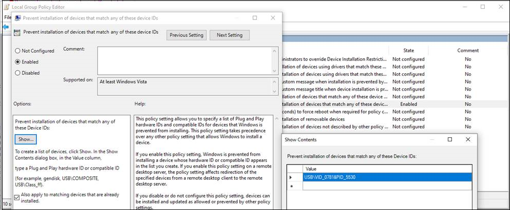

# <a name="how-to-control-usb-devices-and-other-removable-media-using-microsoft-defender-for-endpoint"></a>Como controlar dispositivos USB e outras mídias removíveis usando o Microsoft Defender para Ponto de Extremidade

**Aplica-se a:** [Microsoft Defender para Ponto de Extremidade](https://go.microsoft.com/fwlink/p/?linkid=2069559)

A Microsoft recomenda uma abordagem em camadas para proteger mídia removível, e o Microsoft Defender para Ponto de Extremidade fornece vários recursos de monitoramento e controle para ajudar [a](https://aka.ms/devicecontrolblog)evitar que ameaças em periféricos não autorizados abordem seus dispositivos:

1. [Descubra plug and play connected events for peripherals in Microsoft Defender for Endpoint advanced hunting](#discover-plug-and-play-connected-events). Identificar ou investigar atividades de uso suspeitas.

2. Configure para permitir ou bloquear apenas determinados dispositivos removíveis e evitar ameaças.
    1. [Permitir ou bloquear dispositivos removíveis](#allow-or-block-removable-devices) com base na configuração granular para negar o acesso de gravação a discos removíveis e aprovar ou negar dispositivos usando IDs de dispositivo USB. Atribuição de política flexível de configurações de instalação de dispositivo com base em um indivíduo ou grupo de Azure Active Directory (Azure AD) usuários e dispositivos.

    2. [Impedir ameaças de armazenamento removível introduzido](#prevent-threats-from-removable-storage) por dispositivos de armazenamento removíveis habilitando:  
        - Microsoft Defender Antivírus RTP (proteção em tempo real) para verificar o armazenamento removível para malware.  
        - A regra USB de Redução de Superfície de Ataque (ASR) para bloquear processos não assinados e não assinados que são executados a partir de USB.  
        - Configurações de proteção de Acesso direto à Memória (DMA) para atenuar ataques DMA, incluindo a Proteção DMA do Kernel para Thunderbolt e bloqueando o DMA até que um usuário entre.  

3. [Crie alertas personalizados](#create-customized-alerts-and-response-actions) e ações de resposta para monitorar o uso de dispositivos removíveis com base nesses eventos plug and play ou qualquer outro Microsoft Defender para eventos de ponto de extremidade com regras de detecção [personalizadas.](/microsoft-365/security/defender-endpoint/custom-detection-rules)

4. [Responder a ameaças](#respond-to-threats) de periféricos em tempo real com base nas propriedades relatadas por cada periférico.

>[!Note]
>Essas medidas de redução de ameaças ajudam a impedir que o malware entre em seu ambiente. Para proteger os dados corporativos de sair do seu ambiente, você também pode configurar medidas de prevenção contra perda de dados. Por exemplo, em dispositivos Windows 10 você pode configurar o [BitLocker](/windows/security/information-protection/bitlocker/bitlocker-overview.md) e Windows [Proteção](/windows/security/information-protection/create-wip-policy-using-intune-azure.md)de Informações , que criptografarão os dados da empresa mesmo que eles são armazenados em um dispositivo pessoal ou usem o [CSP Armazenamento/RemovableDiskDenyWriteAccess](/windows/client-management/mdm/policy-csp-storage#storage-removablediskdenywriteaccess) para negar o acesso de gravação a discos removíveis. Além disso, você pode classificar e proteger arquivos em Windows [dispositivos](/windows/security/threat-protection/windows-defender-atp/information-protection-in-windows-overview) (incluindo seus dispositivos USB montados) usando o Microsoft Defender para o Ponto de Extremidade e a Proteção de Informações do Azure.

## <a name="discover-plug-and-play-connected-events"></a>Descobrir plug and play connected events

Você pode exibir plug and play connected events in Microsoft Defender for Endpoint advanced hunting to identify suspicious usage activity or perform internal investigations.
Para exemplos de consultas de busca avançadas do Defender para Ponto de Extremidade, consulte as consultas de busca do Microsoft Defender para Ponto de Extremidade GitHub [repo](https://github.com/Microsoft/WindowsDefenderATP-Hunting-Queries).

Modelos Power BI de relatório de exemplo estão disponíveis para o Microsoft Defender para Ponto de Extremidade que você pode usar para consultas de busca avançadas. Com esses modelos de exemplo, incluindo um para controle de dispositivo, você pode integrar o poder da busca avançada ao Power BI. Consulte o [GitHub para modelos do PowerBI](https://github.com/microsoft/MDATP-PowerBI-Templates) para obter mais informações. Consulte [Criar relatórios personalizados usando Power BI](/microsoft-365/security/defender-endpoint/api-power-bi) para saber mais sobre Power BI integração.

## <a name="allow-or-block-removable-devices"></a>Permitir ou bloquear dispositivos removíveis
A tabela a seguir descreve as maneiras como o Microsoft Defender para Ponto de Extremidade pode permitir ou bloquear dispositivos removíveis com base na configuração granular.

| Controle  | Descrição |
|----------|-------------|
| [Restringir unidades USB e outros periféricos](#restrict-usb-drives-and-other-peripherals) | Você pode permitir/impedir que os usuários instalem apenas as unidades USB e outros periféricos incluídos em uma lista de dispositivos autorizados/não autorizados ou tipos de dispositivos. |
| [Bloquear a instalação e o uso do armazenamento removível](#block-installation-and-usage-of-removable-storage) | Não é possível instalar ou usar armazenamento removível. |
| [Permitir a instalação e o uso de periféricos especificamente aprovados](#allow-installation-and-usage-of-specifically-approved-peripherals)   | Você só pode instalar e usar periféricos aprovados que relatam propriedades específicas em seu firmware. |
| [Impedir a instalação de periféricos especificamente proibidos](#prevent-installation-of-specifically-prohibited-peripherals) | Não é possível instalar ou usar periféricos proibidos que relatam propriedades específicas em seu firmware. |
| [Permitir a instalação e o uso de periféricos especificamente aprovados com IDs de instância de dispositivo correspondentes](#allow-installation-and-usage-of-specifically-approved-peripherals-with-matching-device-instance-ids) | Você só pode instalar e usar periféricos aprovados que corresponderem a qualquer uma dessas IDs de instância de dispositivo. |
| [Impedir a instalação e o uso de periféricos especificamente proibidos com IDs de instância de dispositivo correspondentes](#prevent-installation-and-usage-of-specifically-prohibited-peripherals-with-matching-device-instance-ids) | Não é possível instalar ou usar periféricos proibidos que corresponderem a qualquer uma dessas IDs de instância do dispositivo. |
| [Limitar serviços que usam Bluetooth](#limit-services-that-use-bluetooth) | Você pode limitar os serviços que podem usar Bluetooth. |
| [Usar o Microsoft Defender para configurações de linha de base do Ponto de Extremidade](#use-microsoft-defender-for-endpoint-baseline-settings) | Você pode definir a configuração recomendada para ATP usando a linha de base de segurança defender para ponto de extremidade. |

### <a name="restrict-usb-drives-and-other-peripherals"></a>Restringir unidades USB e outros periféricos

Para evitar infecções por malware ou perda de dados, uma organização pode restringir unidades USB e outros periféricos. A tabela a seguir descreve as maneiras como o Microsoft Defender para Ponto de Extremidade pode ajudar a impedir a instalação e o uso de unidades USB e outros periféricos.

| Controle  | Descrição
|----------|-------------|
| [Permitir a instalação e o uso de unidades USB e outros periféricos](#allow-installation-and-usage-of-usb-drives-and-other-peripherals) | Permitir que os usuários instalem apenas as unidades USB e outros periféricos incluídos em uma lista de dispositivos ou tipos de dispositivo autorizados |
| [Impedir a instalação e o uso de unidades USB e outros periféricos](#prevent-installation-and-usage-of-usb-drives-and-other-peripherals) | Impedir que os usuários instalem unidades USB e outros periféricos incluídos em uma lista de dispositivos e tipos de dispositivo não autorizados |

Todos os controles acima podem ser definidos por meio dos Modelos [Administrativos do](/intune/administrative-templates-windows)Intune. As políticas relevantes estão localizadas aqui nos Modelos de Administrador do Intune:


>[!Note]
>Usando o Intune, você pode aplicar políticas de configuração de dispositivo aos grupos de usuários e/ou dispositivos do Azure AD.
As políticas acima também podem ser definidas por meio das configurações [de CSP](/windows/client-management/mdm/policy-csp-deviceinstallation) de Instalação de Dispositivo e [GPOs de Instalação de Dispositivo.](/previous-versions/dotnet/articles/bb530324(v=msdn.10))

> [!Note]
> Sempre teste e refine essas configurações com um grupo piloto de usuários e dispositivos primeiro antes de aplica-las na produção.
Para obter mais informações sobre como controlar dispositivos USB, consulte o [blog do Microsoft Defender for Endpoint](https://www.microsoft.com/security/blog/2018/12/19/windows-defender-atp-has-protections-for-usb-and-removable-devices/).

#### <a name="allow-installation-and-usage-of-usb-drives-and-other-peripherals"></a>Permitir a instalação e o uso de unidades USB e outros periféricos

Uma maneira de abordar permitindo a instalação e o uso de unidades USB e outros periféricos é começar permitindo tudo. Posteriormente, você pode começar a reduzir os drivers USB e outros periféricos.

>[!Note]
>Como um periférico USB não autorizado pode ter firmware que espou suas propriedades USB, recomendamos permitir apenas periféricos USB aprovados especificamente e limitar os usuários que podem acessá-los.

1. **Habilitar Impedir a instalação de dispositivos não descritos por outras configurações de política** para todos os usuários.
2. **Habilitar Permitir a instalação de dispositivos usando drivers que corresponderem a essas classes de** configuração de dispositivo para todas as classes de [configuração do dispositivo.](/windows-hardware/drivers/install/system-defined-device-setup-classes-available-to-vendors)

Para impor a política para dispositivos já instalados, aplique as políticas de prevenção que tenham essa configuração.

Ao configurar a política de instalação de dispositivo de permitir, você também deve permitir todos os atributos pai. Você pode exibir os pais de um dispositivo abrindo o Gerenciador de Dispositivos e exibindo por conexão.


Neste exemplo, as seguintes classes precisavam ser adicionadas: HID, Keyboard e {36fc9e60-c465-11cf-8056-444553540000}. Consulte [Drivers USB fornecidos pela Microsoft](/windows-hardware/drivers/usbcon/supported-usb-classes) para obter mais informações.


Se você quiser restringir a determinados dispositivos, remova a classe de configuração do dispositivo do periférico que você deseja limitar. Em seguida, adicione a ID do dispositivo que você deseja adicionar. A ID do dispositivo baseia-se na ID do fornecedor e nos valores de ID do produto para um dispositivo. Para obter informações sobre formatos de ID do dispositivo, consulte [Standard USB Identifiers](/windows-hardware/drivers/install/standard-usb-identifiers). 

Para encontrar as IDs do dispositivo, consulte [Procurar ID do dispositivo](#look-up-device-id). 

Por exemplo:

1. Remova a classe USBDevice da **instalação Permitir a instalação de dispositivos usando drivers que corresponderem a essas configurações de dispositivo.**
2. Adicione a ID do dispositivo para permitir na instalação permitir a instalação do dispositivo que corresponder **a qualquer uma dessas IDs de dispositivo.** 


#### <a name="prevent-installation-and-usage-of-usb-drives-and-other-peripherals"></a>Impedir a instalação e o uso de unidades USB e outros periféricos

Se você quiser impedir a instalação de uma classe de dispositivo ou determinados dispositivos, use as políticas de instalação de dispositivos de prevenção:

1. **Habilitar Impedir a instalação de dispositivos que corresponderem a qualquer uma dessas IDs** de dispositivo e adicionar esses dispositivos à lista.
2. **Habilitar Impedir a instalação de dispositivos usando drivers que corresponderem a essas classes de configuração de dispositivo.**

> [!Note]
> As políticas de instalação de dispositivos de prevenção têm precedência sobre as políticas de instalação de dispositivos de permitir.

A política Impedir a instalação de dispositivos que corresponderem a qualquer uma dessas **IDs** de dispositivo permite especificar uma lista de dispositivos que Windows é impedida de instalar. 

Para impedir a instalação de dispositivos que corresponderem a qualquer uma dessas IDs de dispositivo: 

1. [Procure a ID do](#look-up-device-id) dispositivo para dispositivos que você Windows impedir de instalar.

   

2. Enable **Prevent installation of devices that match any of these device IDs** and add the vendor or product IDs to the list.

    

#### <a name="look-up-device-id"></a>Procurar A ID do dispositivo

Você pode usar o Gerenciador de Dispositivos para procurar uma ID de dispositivo.

1. Abra o Gerenciador de Dispositivos.
2. Clique **em Exibir** e selecione **Dispositivos por conexão**.
3. Na árvore, clique com o botão direito do mouse no dispositivo e selecione **Propriedades**.
4. Na caixa de diálogo do dispositivo selecionado, clique na **guia Detalhes.**
5. Clique na **lista** listada Propriedade e selecione **Ids de hardware.**
6. Clique com o botão direito do mouse no valor de ID superior e selecione **Copiar**.

Para obter informações sobre formatos de ID de dispositivo, consulte [Standard USB Identifiers](/windows-hardware/drivers/install/standard-usb-identifiers).

Para obter informações sobre as IDs do fornecedor, consulte [Membros USB](https://www.usb.org/members).

Veja a seguir um exemplo para procurar uma ID de fornecedor de dispositivo ou ID do produto (que faz parte da ID do dispositivo) usando o PowerShell: 

```powershell
Get-WMIObject -Class Win32_DiskDrive |
Select-Object -Property * 
```

A **política Impedir** a instalação de dispositivos usando drivers que corresponderem a essas classes de configuração de dispositivo permite especificar classes de configuração de dispositivos que Windows é impedida de instalar. 

Para impedir a instalação de classes específicas de dispositivos: 

1. Encontre o GUID da classe de configuração de dispositivo nas Classes de Instalação de Dispositivo Definidas pelo Sistema [Disponíveis para Fornecedores.](/windows-hardware/drivers/install/system-defined-device-setup-classes-available-to-vendors)

2. **Habilitar Impedir a instalação de dispositivos usando drivers que corresponderem** a essas classes de configuração de dispositivo e adicionar o GUID de classe à lista.

    > [!div class="mx-imgBorder"]
    > 

### <a name="block-installation-and-usage-of-removable-storage"></a>Bloquear a instalação e o uso do armazenamento removível

1. Entre no centro de administração [Microsoft Endpoint Manager.](https://endpoint.microsoft.com/)

2. Clique **em**  >  **Perfis de Configuração de**  >  **Dispositivos Criar perfil**.

    > [!div class="mx-imgBorder"]
    > 

3. Use as seguintes configurações:

   - Nome: Digite um nome para o perfil
   - Descrição: digite uma descrição
   - Plataforma: Windows 10 e posterior
   - Tipo de perfil: Restrições de dispositivo

   > [!div class="mx-imgBorder"]
   > 

4. Clique **em Configurar**  >  **Geral**.  

5. Para **armazenamento removível** e **conexão USB (somente móvel),** escolha **Bloquear**. **O armazenamento removível** inclui unidades USB, enquanto a conexão **USB (somente móvel)** exclui o carregamento USB, mas inclui outras conexões USB somente em dispositivos móveis. 

   

6. Clique **em OK** para fechar **configurações** gerais e **restrições de dispositivo.**

7. Clique **em Criar** para salvar o perfil.

### <a name="allow-installation-and-usage-of-specifically-approved-peripherals"></a>Permitir a instalação e o uso de periféricos especificamente aprovados

Periféricos que podem ser instalados podem ser especificados por sua [identidade de hardware.](/windows-hardware/drivers/install/device-identification-strings) Para uma lista de estruturas de identificadores comuns, consulte [Device Identifier Formats](/windows-hardware/drivers/install/device-identifier-formats). Teste a configuração antes de rolling-lo para garantir que ela bloqueia e permite os dispositivos esperados. O ideal é testar várias instâncias do hardware. Por exemplo, teste várias chaves USB em vez de apenas uma.

Para um exemplo syncML que permite a instalação de IDs de dispositivo específicas, consulte [DeviceInstallation/AllowInstallationOfMatchingDeviceIDs CSP](/windows/client-management/mdm/policy-csp-deviceinstallation#deviceinstallation-allowinstallationofmatchingdeviceids). Para permitir classes de dispositivo específicas, consulte [DeviceInstallation/AllowInstallationOfMatchingDeviceSetupClasses CSP](/windows/client-management/mdm/policy-csp-deviceinstallation#deviceinstallation-allowinstallationofmatchingdevicesetupclasses).
Permitir a instalação de dispositivos específicos também requer habiltar [DeviceInstallation/PreventInstallationOfDevicesNotDescribedByOtherPolicySettings](/windows/client-management/mdm/policy-csp-deviceinstallation#deviceinstallation-preventinstallationofdevicesnotdescribedbyotherpolicysettings).

### <a name="prevent-installation-of-specifically-prohibited-peripherals"></a>Impedir a instalação de periféricos especificamente proibidos

O Microsoft Defender para Ponto de Extremidade bloqueia a instalação e o uso de periféricos proibidos usando uma destas opções:

- [Modelos Administrativos podem](/intune/administrative-templates-windows) bloquear qualquer dispositivo com uma ID de hardware correspondente ou classe de instalação.  
- [Configurações de CSP de](/windows/client-management/mdm/policy-csp-deviceinstallation) Instalação de Dispositivo com um perfil personalizado no Intune. Você pode [impedir a instalação de IDs de dispositivo específicas](/windows/client-management/mdm/policy-csp-deviceinstallation#deviceinstallation-preventinstallationofmatchingdeviceids) ou impedir classes de dispositivo [específicas.](/windows/client-management/mdm/policy-csp-deviceinstallation#deviceinstallation-preventinstallationofmatchingdevicesetupclasses)

### <a name="allow-installation-and-usage-of-specifically-approved-peripherals-with-matching-device-instance-ids"></a>Permitir a instalação e o uso de periféricos especificamente aprovados com IDs de instância de dispositivo correspondentes

Periféricos que podem ser instalados podem ser especificados por suas [IDs](/windows-hardware/drivers/install/device-instance-ids)de instância de dispositivo. Teste a configuração antes de rolling-lo para garantir que ela permita os dispositivos esperados. O ideal é testar várias instâncias do hardware. Por exemplo, teste várias chaves USB em vez de apenas uma.

Você pode permitir a instalação e o uso de periféricos aprovados com IDs de instância de dispositivo correspondentes configurando a configuração de política [DeviceInstallation/AllowInstallationOfMatchingDeviceInstanceIDs.](/windows/client-management/mdm/policy-csp-deviceinstallation#deviceinstallation-allowinstallationofmatchingdeviceinstanceids)

### <a name="prevent-installation-and-usage-of-specifically-prohibited-peripherals-with-matching-device-instance-ids"></a>Impedir a instalação e o uso de periféricos especificamente proibidos com IDs de instância de dispositivo correspondentes

Periféricos que são proibidos de serem instalados podem ser especificados por suas [IDs](/windows-hardware/drivers/install/device-instance-ids)de instância de dispositivo. Teste a configuração antes de rolling-lo para garantir que ela permita os dispositivos esperados. O ideal é testar várias instâncias do hardware. Por exemplo, teste várias chaves USB em vez de apenas uma.

Você pode impedir a instalação dos periféricos proibidos com IDs de instância de dispositivo correspondentes configurando a política [DeviceInstallation/PreventInstallationOfMatchingDeviceInstanceIDs.](/windows/client-management/mdm/policy-csp-deviceinstallation#deviceinstallation-preventinstallationofmatchingdeviceinstanceids)

### <a name="limit-services-that-use-bluetooth"></a>Limitar serviços que usam Bluetooth

Usando o Intune, você pode limitar os serviços que podem usar Bluetooth por meio do ["Bluetooth serviços permitidos"](/windows/client-management/mdm/policy-csp-bluetooth#servicesallowedlist-usage-guide). O estado padrão das configurações "Bluetooth de serviços permitidos" significa que tudo é permitido.  Assim que um serviço é adicionado, isso se torna a lista permitida. Se o cliente adicionar os valores Keyboards e Mouse e não adicionar as GUIDs de transferência de arquivo, a transferência de arquivo deverá ser bloqueada.

> [!div class="mx-imgBorder"]
> 

### <a name="use-microsoft-defender-for-endpoint-baseline-settings"></a>Usar o Microsoft Defender para configurações de linha de base do Ponto de Extremidade

As configurações de linha de base do Microsoft Defender para Ponto de Extremidade representam a configuração recomendada para proteção contra ameaças. As configurações da linha de base estão localizadas na página de perfil de edição das configurações.

> [!div class="mx-imgBorder"]
> 

## <a name="prevent-threats-from-removable-storage"></a>Impedir ameaças de armazenamento removível
  
Dispositivos de armazenamento removíveis podem introduzir riscos de segurança adicionais à sua organização. O Microsoft Defender para Ponto de Extremidade pode ajudar a identificar e bloquear arquivos mal-intencionados em dispositivos de armazenamento removíveis.

O Microsoft Defender para Ponto de Extremidade também pode impedir que periféricos USB possam ser usados em dispositivos para ajudar a evitar ameaças externas. Ele faz isso usando as propriedades relatadas por periféricos USB para determinar se eles podem ou não ser instalados e usados no dispositivo.

Observe que, se você bloquear dispositivos USB ou qualquer outra classe de dispositivo usando as políticas de instalação do dispositivo, dispositivos conectados, como telefones, ainda poderão carregar.

>[!NOTE]
>Sempre teste e refine essas configurações com um grupo piloto de usuários e dispositivos primeiro antes de distribuir amplamente para sua organização. 

A tabela a seguir descreve as maneiras como o Microsoft Defender para Ponto de Extremidade pode ajudar a evitar ameaças de armazenamento removível.

Para obter mais informações sobre como controlar dispositivos USB, consulte o [blog do Microsoft Defender for Endpoint](https://aka.ms/devicecontrolblog).

| Controle  | Descrição |
|----------|-------------|
| [Habilitar Microsoft Defender Antivírus verificação](#enable-microsoft-defender-antivirus-scanning) | Habilita Microsoft Defender Antivírus verificação de proteção em tempo real ou verificações agendadas.|
| [Bloquear processos não assinados e não assinados em periféricos USB](#block-untrusted-and-unsigned-processes-on-usb-peripherals) | Bloquear arquivos USB que não são assinados ou não são confidenciais. |
| [Proteger contra ataques DMA (Acesso direto à Memória)](#protect-against-direct-memory-access-dma-attacks) | Configure as configurações para proteger contra ataques DMA. |

>[!NOTE]
>Como um periférico USB não autorizado pode ter firmware que espou suas propriedades USB, recomendamos permitir apenas periféricos USB aprovados especificamente e limitar os usuários que podem acessá-los.

### <a name="enable-microsoft-defender-antivirus-scanning"></a>Habilitar Microsoft Defender Antivírus verificação

Proteger o armazenamento removível autorizado com Microsoft Defender Antivírus requer a habilitação de verificações de proteção ou agendamento em tempo [real](/microsoft-365/security/defender-endpoint/configure-real-time-protection-microsoft-defender-antivirus) e a configuração de unidades removíveis para verificações.

- Se a proteção em tempo real estiver habilitada, os arquivos serão verificados antes que sejam acessados e executados. O escopo de verificação inclui todos os arquivos, incluindo aqueles em dispositivos removíveis montados, como unidades USB. Opcionalmente, você pode executar um script do [PowerShell](/samples/browse/?redirectedfrom=TechNet-Gallery) para executar uma verificação personalizada de uma unidade USB após a montagem, para que o Microsoft Defender Antivírus comece a verificar todos os arquivos em um dispositivo removível depois que o dispositivo removível for anexado. No entanto, recomendamos habilenciar a proteção em tempo real para melhorar o desempenho da verificação, especialmente para dispositivos de armazenamento grandes.

- Se as verificações agendadas são usadas, você precisará desabilitar a configuração DisableRemovableDriveScanning (habilitada por padrão) para examinar o dispositivo removível durante uma verificação completa. Os dispositivos removíveis são verificados durante uma verificação rápida ou personalizada, independentemente da configuração DisableRemovableDriveScanning.

>[!NOTE]
>Recomendamos habilenciar o monitoramento em tempo real para verificação. No Intune, você pode habilitar o monitoramento em tempo real para Windows 10 em **Restrições** de Dispositivo Configurar Microsoft Defender Antivírus  >    >    >  **monitoramento em tempo real.**

<!-- Need to build out point in the preceding note. 
-->

### <a name="block-untrusted-and-unsigned-processes-on-usb-peripherals"></a>Bloquear processos não assinados e não assinados em periféricos USB

Os usuários finais podem conectar dispositivos removíveis infectados por malware.
Para evitar infecções, uma empresa pode bloquear arquivos USB que não são assinados ou não são confidenciais.
Como alternativa, as empresas podem [](/microsoft-365/security/defender-endpoint/attack-surface-reduction) aproveitar o recurso de auditoria das regras de redução de superfície de ataque para monitorar a atividade de processos não assinados e não assinados que são executados em um periférico USB.
Isso pode ser feito definindo processos não **assinados** e não assinados que são executados de USB para **Bloquear** ou **Auditar apenas**, respectivamente.
Com essa regra, os administradores podem impedir ou auditar arquivos executáveis não assinados ou não-não-assinados de execução de unidades removíveis USB, incluindo cartões SD.
Os tipos de arquivo afetados incluem arquivos executáveis (como .exe, .dll ou .scr) e arquivos de script, como um PowerShell (.ps), VisualBasic (.vbs) ou JavaScript (.js).

Essas configurações [exigem a habilitação da proteção em tempo real.](/microsoft-365/security/defender-endpoint/configure-real-time-protection-microsoft-defender-antivirus)

1. Entre no [Microsoft Endpoint Manager](https://endpoint.microsoft.com/).

2. Clique **em**  >  **Dispositivos Windows** Políticas de  >    >  **Configuração Criar perfil**. 

    

3. Use as seguintes configurações:
   - Plataforma: Windows 10 e posterior 
   - Tipo de perfil: Restrições de dispositivo

   > [!div class="mx-imgBorder"]
   > 

4. Clique em **Criar**.  

5. Para **processos não assinados e não assinados que são executados a partir do USB,** escolha **Bloquear**.

   

6. Clique **em OK** para fechar configurações e **restrições de dispositivo.**

### <a name="protect-against-direct-memory-access-dma-attacks"></a>Proteger contra ataques DMA (Acesso direto à Memória)

Os ataques de DMA podem levar à divulgação de informações confidenciais que residem em um computador ou até mesmo à injeção de malware que permite que os invasores ignorem a tela de bloqueio ou controlem computadores remotamente. As configurações a seguir ajudam a evitar ataques DMA:

1. A partir Windows 10 versão 1803, a Microsoft introduziu o [Kernel DMA Protection for Thunderbolt](/windows/security/information-protection/kernel-dma-protection-for-thunderbolt.md) para fornecer proteção nativa contra ataques DMA por meio de portas Thunderbolt. A Proteção de DMA do Kernel para Thunderbolt é habilitada pelos fabricantes do sistema e não pode ser ativada ou desligada pelos usuários.

   A partir Windows 10 versão 1809, você pode ajustar o nível de Proteção DMA do Kernel configurando o CSP do [DMA Guard.](/windows/client-management/mdm/policy-csp-dmaguard#dmaguard-deviceenumerationpolicy) Esse é um controle adicional para periféricos que não suportam isolamento de memória do dispositivo (também conhecido como remapping DMA). O isolamento de memória permite que o sistema operacional utilize a Unidade de Gerenciamento de Memória de E/S (IOMMU) de um dispositivo para bloquear a E/S não aloqueada ou o acesso à memória, pelo periférico (área de segurança de memória). Em outras palavras, o sistema operacional atribui um determinado intervalo de memória ao periférico. Se o periférico tentar ler/gravar na memória fora do intervalo atribuído, o sistema operacional o bloqueará.

   Periféricos que suportam isolamento de memória do dispositivo sempre podem se conectar. Periféricos que não podem ser bloqueados, permitidos ou permitidos somente após o usuário entrar (padrão).

2. Em Windows 10 sistemas que não suportam a Proteção DMA do Kernel, você pode:

   - [Bloquear o DMA até que um usuário entre](/windows/client-management/mdm/policy-csp-dataprotection#dataprotection-allowdirectmemoryaccess)
   - [Bloquear todas as conexões por meio das portas Thunderbolt (incluindo dispositivos USB)](https://support.microsoft.com/help/2516445/blocking-the-sbp-2-driver-and-thunderbolt-controllers-to-reduce-1394-d)

## <a name="create-customized-alerts-and-response-actions"></a>Criar alertas personalizados e ações de resposta

Você pode criar alertas personalizados e ações de resposta com o Conector WDATP e as regras de detecção personalizadas:

**Ações de resposta do Conector Wdatp:**

**Investigar:** Inicie investigações, colete o pacote de investigação e isole um computador.

**Verificação de ameaças** em dispositivos USB.

**Restringir** a execução de todos os aplicativos no computador, exceto um conector de conjunto predefinido MDATP é um dos mais de 200 conectores pré-definidos, incluindo Outlook, Teams, Slack, etc. Conectores personalizados podem ser construídos.
- [Mais informações sobre ações de resposta do conector WDATP](/connectors/wdatp/)

**Ação de resposta de regras de detecção personalizadas:** Tanto as ações de nível de máquina quanto de arquivo podem ser aplicadas.
- [Mais informações sobre ações de resposta de regras de detecção personalizadas](/microsoft-365/security/defender-endpoint/custom-detection-rules)

Para obter informações sobre eventos de busca antecipados relacionados ao controle de dispositivo e exemplos sobre como criar alertas [personalizados, consulte Atualizações avançadas](https://techcommunity.microsoft.com/t5/Microsoft-Defender-ATP/Advanced-hunting-updates-USB-events-machine-level-actions-and/ba-p/824152)de busca: eventos USB, ações no nível de máquina e alterações de esquema.

## <a name="respond-to-threats"></a>Responder a ameaças

Você pode criar alertas personalizados e ações de resposta automática com o [Microsoft Defender for Endpoint Custom Detection Rules](/microsoft-365/security/defender-endpoint/custom-detection-rules). As ações de resposta dentro da detecção personalizada abrangem ações de nível de arquivo e computador. Você também pode criar alertas e ações de resposta automática usando [PowerApps](https://powerapps.microsoft.com/) [e](https://flow.microsoft.com/) Flow com o conector do [Microsoft Defender para Ponto de Extremidade.](/connectors/wdatp/) O conector oferece suporte a ações para investigação, verificação de ameaças e restrição de aplicativos em execução. É um dos mais de 200 conectores pré-definidos, incluindo Outlook, Teams, Slack e muito mais. Conectores personalizados também podem ser construídos. Consulte [Conectores](/connectors/) para saber mais sobre conectores.
 
Por exemplo, usando qualquer abordagem, você pode executar automaticamente o Microsoft Defender Antivírus quando um dispositivo USB é montado em um computador.

## <a name="related-topics"></a>Tópicos relacionados

- [Configurar proteção em tempo real para Microsoft Defender Antivírus](/microsoft-365/security/defender-endpoint/configure-real-time-protection-microsoft-defender-antivirus)
- [Defender/AllowFullScanRemovableDriveScanning](/windows/client-management/mdm/policy-csp-defender#defender-allowfullscanremovabledrivescanning)
- [Policy/DeviceInstallation CSP](/windows/client-management/mdm/policy-csp-deviceinstallation)
- [Executar uma verificação personalizada de um dispositivo removível](/samples/browse/?redirectedfrom=TechNet-Gallery)
- [Modelo powerbi de controle de dispositivo para relatórios personalizados](https://github.com/microsoft/MDATP-PowerBI-Templates)
- [BitLocker](/windows/security/information-protection/bitlocker/bitlocker-overview.md) 
- [Proteção de Informações do Windows](/windows/security/information-protection/windows-information-protection/create-wip-policy-using-intune-azure.md)
