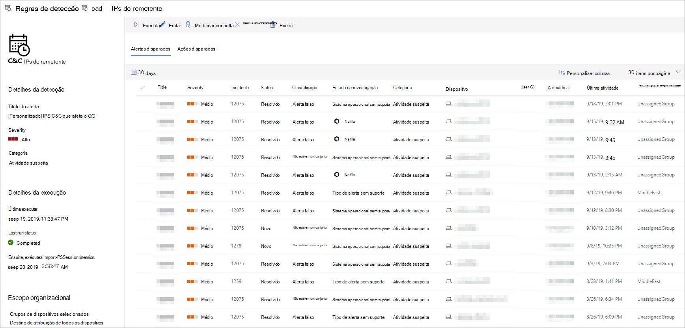

# Exibir e gerenciar regras de detecção personalizadas

[!INCLUDE [Microsoft 365 Defender rebranding](../../includes/microsoft-defender.md)]

**Aplica-se a:**
- [Microsoft Defender para Ponto de Extremidade](https://go.microsoft.com/fwlink/p/?linkid=2154037)
- [Microsoft 365 Defender](https://go.microsoft.com/fwlink/?linkid=2118804)

>Deseja experimentar o Defender para Ponto de Extremidade? [Inscreva-se para uma avaliação gratuita.](https://www.microsoft.com/microsoft-365/windows/microsoft-defender-atp?ocid=docs-wdatp-assignaccess-abovefoldlink)

Gerencie suas regras [de detecção personalizadas existentes](custom-detection-rules.md) para garantir que elas estão efetivamente encontrando ameaças e fazendo ações. Explore como exibir a lista de regras, verifique suas versões anteriores e revise os alertas disparados. Você também pode executar uma regra sob demanda e modificá-la.

## Permissões obrigatórias

Para criar ou gerenciar detecções personalizadas, [sua função](user-roles.md#create-roles-and-assign-the-role-to-an-azure-active-directory-group) precisa ter a permissão **gerenciar configurações de** segurança.

## Exibir regras existentes

Para exibir todas as regras de detecção personalizadas existentes, navegue até **Configurações**  >  **Detecções personalizadas.** A página lista todas as regras com as seguintes informações de executar:

- **Última executar**— quando uma regra foi executado pela última vez para verificar se há verificações de consultas e gerar alertas
- **Status da última executar**— se uma regra foi realizada com êxito
- **Próxima executar**— a próxima sequência agendada
- **Status**— se uma regra foi 1ada ou desligada

## Exibir detalhes da regra, modificar regra e executar regra

Para exibir informações abrangentes sobre uma regra de detecção personalizada, selecione o nome da regra na lista de regras em **Configurações**  >  **Detecções personalizadas.** Uma página sobre a regra selecionada exibe as seguintes informações:

- Informações gerais sobre a regra, incluindo os detalhes do alerta, status de executar e escopo
- Lista de alertas disparados
- Lista de ações disparadas

 
*Página de regra de detecção personalizada*

Você também pode tomar as seguintes ações na regra nesta página:

- **Executar**— execute a regra imediatamente. Essa ação também redefine o intervalo para a próxima executar.
- **Editar**— modificar a regra sem alterar a consulta
- **Modificar consulta —** editar a consulta na busca avançada
- **Ativar**  /  **Desativar —** habilitar a regra ou impedi-la de executar
- **Excluir**— desativar a regra e removê-la

>[!TIP]
>Para exibir rapidamente informações e tomar medidas em um item em uma tabela, use a coluna de seleção [&#10003;] à esquerda da tabela.

## Tópicos relacionados
- [Visão geral de detecções personalizadas](overview-custom-detections.md)
- [Criar regras de detecção](custom-detection-rules.md)
- [Visão geral da busca avançada](advanced-hunting-overview.md)
- [Exibir e organizar alertas](alerts-queue.md)
