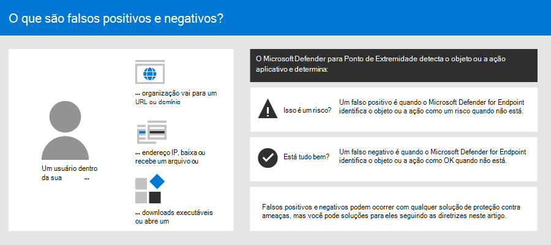
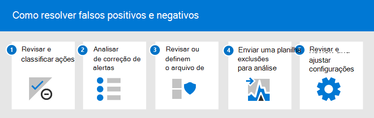
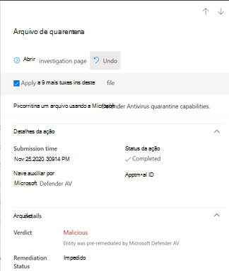
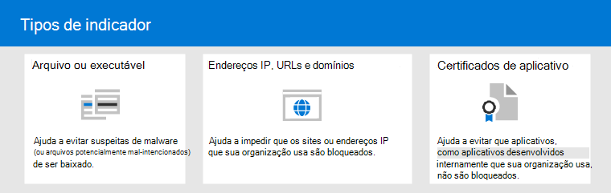

# Resolver falsos positivos/negativos no Microsoft Defender para Ponto de Extremidade

[!INCLUDE [Microsoft 365 Defender rebranding](../../includes/microsoft-defender.md)]

**Aplica-se a**

- [Microsoft Defender para Ponto de Extremidade](https://go.microsoft.com/fwlink/p/?linkid=2146806)

Em soluções de proteção de ponto de extremidade, um falso positivo é uma entidade, como um arquivo ou um processo, que foi detectado e identificado como mal-intencionado, mesmo que a entidade não seja realmente uma ameaça. Um falso negativo é uma entidade que não foi detectada como uma ameaça, mesmo que ele realmente seja mal-intencionado. Falsos positivos/negativos podem ocorrer com qualquer solução de proteção contra ameaças, incluindo [o Microsoft Defender para Ponto de Extremidade](https://docs.microsoft.com/microsoft-365/security/defender-endpoint/microsoft-defender-advanced-threat-protection).

Felizmente, etapas podem ser tomadas para resolver e reduzir esses tipos de problemas. Se você estiver vendo falsos positivos/negativos no Centro de Segurança do [Microsoft Defender,](https://docs.microsoft.com/microsoft-365/security/defender-endpoint/use)suas operações de segurança podem tomar medidas para soluá-los usando o seguinte processo:

1.  [Revisar e classificar alertas](#part-1-review-and-classify-alerts) 
2.  [Revisar ações de correção que foram tomadas](#part-2-review-remediation-actions)
3.  [Revisar e definir exclusões](#part-3-review-or-define-exclusions)
4.  [Enviar uma entidade para análise](#part-4-submit-a-file-for-analysis)
5.  [Revisar e ajustar suas configurações de proteção contra ameaças](#part-5-review-and-adjust-your-threat-protection-settings)

E, você pode obter ajuda se ainda tiver problemas com [falsos positivos/negativos](#still-need-help) após executar as tarefas descritas neste artigo.

> [!NOTE]
> Este artigo destina-se a orientações para operadores de segurança e administradores de segurança que estão usando [o Microsoft Defender para o Ponto de Extremidade.](microsoft-defender-advanced-threat-protection.md)

## Parte 1: Revisar e classificar alertas

Se você vir um [alerta](alerts.md) que foi disparado porque algo foi detectado como mal-intencionado ou suspeito que não deveria ter sido, você pode suprimir o alerta para essa entidade. Você também pode suprimir alertas que não são necessariamente falsos positivos, mas não são importantes. Recomendamos classificar alertas também. 

Gerenciar seus alertas e classificar verdadeiros/falsos positivos ajuda a treinar sua solução de proteção contra ameaças e pode reduzir o número de falsos positivos ou falsos negativos ao longo do tempo. Tomar essas etapas também ajuda a reduzir o ruído no painel de operações de segurança para que sua equipe de segurança possa se concentrar em itens de trabalho de prioridade mais alta.

### Determinar se um alerta é preciso

Antes de classificar ou suprimir um alerta, determine se o alerta é preciso, falso positivo ou benigno.

1. Vá para o Centro de Segurança do Microsoft Defender ( [https://securitycenter.windows.com](https://securitycenter.windows.com) ) e entre.
2. No painel de navegação, escolha **Fila de alertas**.
3. Selecione um alerta para obter mais detalhes sobre o alerta. (Consulte [Review alerts](https://docs.microsoft.com/microsoft-365/security/defender-endpoint/review-alerts).)
4. Dependendo do status do alerta, tome as etapas descritas na tabela a seguir: 

| Status do alerta | O que fazer |
|:---|:---|
| O alerta é preciso | Atribua o alerta e [investigue-o](investigate-alerts.md) ainda mais. |
| O alerta é um falso positivo | 1. [Classifique o alerta](#classify-an-alert) como um falso positivo.  2. [Suprimir o alerta](#suppress-an-alert).   3. [Crie um indicador](#indicators-for-microsoft-defender-for-endpoint) para o Microsoft Defender para Ponto de Extremidade.   4. [Envie um arquivo à Microsoft para análise](#part-4-submit-a-file-for-analysis). |
| O alerta é preciso, mas benigno (sem importância) | [Classifique o alerta](#classify-an-alert) como um verdadeiro positivo e, em seguida, [suprime o alerta](#suppress-an-alert). |

### Classificar um alerta

Os alertas podem ser classificados como falsos positivos ou verdadeiros positivos no Centro de Segurança do Microsoft Defender. Classificar alertas ajuda a treinar o Microsoft Defender para o Ponto de Extremidade para que, ao longo do tempo, você veja mais alertas verdadeiros e menos alertas falsos.

1. Vá para o Centro de Segurança do Microsoft Defender ( [https://securitycenter.windows.com](https://securitycenter.windows.com) ) e entre.
2. Selecione **Fila de alertas** e selecione um alerta.
3. Para o alerta selecionado, selecione **Ações**  >  **Gerenciar alerta**. Um painel de sobrevoo é aberto.
4. Na seção **Gerenciar alerta,** selecione **Alerta true ou** alerta **False.** (Use **o alerta False** para classificar um falso positivo.)

> [!TIP]
> Para obter mais informações sobre a supressão de alertas, consulte [Manage Microsoft Defender for Endpoint alerts](https://docs.microsoft.com/microsoft-365/security/defender-endpoint/manage-alerts). E, se sua organização estiver usando um servidor siem (gerenciamento de informações de segurança) e de eventos, defina também uma regra de supressão. 

### Suprimir um alerta

Se você tiver alertas que sejam falsos positivos ou que sejam verdadeiros positivos, mas para eventos sem importância, você poderá suprimir esses alertas no Centro de Segurança do Microsoft Defender. A supressão de alertas ajuda a reduzir o ruído no painel de operações de segurança. 

1. Vá para o Centro de Segurança do Microsoft Defender ( [https://securitycenter.windows.com](https://securitycenter.windows.com) ) e entre.
2. No painel de navegação, selecione **Fila de alertas**.
3. Selecione um alerta que você deseja suprimir para abrir o painel **Detalhes.**
4. No painel **Detalhes,** escolha as releições (**...**) e crie **uma regra de supressão.**
5. Especifique todas as configurações da regra de supressão e escolha **Salvar**.

> [!TIP]
> Precisa de ajuda com regras de supressão? Consulte [Suprimir um alerta e criar uma nova regra de supressão.](https://docs.microsoft.com/microsoft-365/security/defender-endpoint/manage-alerts#suppress-an-alert-and-create-a-new-suppression-rule)

## Parte 2: Revisar ações de correção

[Ações de correção](manage-auto-investigation.md#remediation-actions), como enviar um arquivo para a quarentena ou interromper um processo, são tomadas em entidades (como arquivos) que são detectadas como ameaças. Vários tipos de ações de correção ocorrem automaticamente por meio da investigação automatizada e do Microsoft Defender Antivírus:   
- Colocar em quarentena um arquivo
- Remover uma chave do Registro
- Kill a process
- Parar um serviço
- Desabilitar um driver
- Remover uma tarefa agendada

Outras ações, como iniciar uma verificação antivírus ou coletar um pacote de investigação, ocorrem manualmente ou por meio [do Live Response.](live-response.md) As ações realizadas por meio do Live Response não podem ser desfeitas.

Depois de revisar seus alertas, a próxima etapa é revisar as ações [de correção.](manage-auto-investigation.md) Se quaisquer ações foram tomadas como resultado de falsos positivos, você pode desfazer a maioria dos tipos de ações de correção. Especificamente, você pode:
- [Desfazer uma ação de cada vez;](#undo-an-action)
- [Desfazer várias ações ao mesmo tempo;](#undo-multiple-actions-at-one-time) e 
- [Remover um arquivo da quarentena em vários dispositivos](#remove-a-file-from-quarantine-across-multiple-devices). 

Quando terminar de revisar e desfazer as ações que foram tomadas como resultado de falsos positivos, prossiga para revisar ou [definir exclusões.](#part-3-review-or-define-exclusions)

### Revisar ações concluídas

1. Vá para a Central de Ações ( [https://securitycenter.windows.com/action-center](https://securitycenter.windows.com/action-center) ) e entre. 
2. Selecione a **guia Histórico** para exibir uma lista de ações que foram realizadas.  
3. Selecione um item para exibir mais detalhes sobre a ação de correção que foi tomada.

### Desfazer uma ação

1. Vá para a Central de Ações ( [https://securitycenter.windows.com/action-center](https://securitycenter.windows.com/action-center) ) e entre.
2. Na guia **Histórico,** selecione uma ação que você deseja desfazer.
3. No painel de sobrevoos, selecione **Desfazer**. Se a ação não puder ser desfeita com esse método, você não verá um **botão Desfazer.** (Para saber mais, confira [Desfazer ações concluídas](manage-auto-investigation.md#undo-completed-actions).)

### Desfazer várias ações ao mesmo tempo

1. Vá para a Central de Ações ( [https://securitycenter.windows.com/action-center](https://securitycenter.windows.com/action-center) ) e entre.
2. Na guia **Histórico,** selecione as ações que você deseja desfazer.
3. No painel no lado direito da tela, selecione **Desfazer**.

### Remover um arquivo da quarentena em vários dispositivos 

> [!div class="mx-imgBorder"]
> 

1. Vá para a Central de Ações ( [https://securitycenter.windows.com/action-center](https://securitycenter.windows.com/action-center) ) e entre.
2. Na guia **Histórico,** selecione um arquivo que tenha o arquivo De quarentena tipo **ação.**
3. No painel no lado direito da tela, selecione Aplicar a X mais **instâncias** deste arquivo e selecione **Desfazer**. 

## Parte 3: Revisar ou definir exclusões

Uma exclusão é uma entidade, como um arquivo ou URL, que você especifica como uma exceção para ações de correção. A entidade excluída ainda pode ser detectada, mas nenhuma ação de correção é tomada nessa entidade. Ou seja, o arquivo ou processo detectado não será interrompido, enviado para quarentena, removido ou alterado pelo Microsoft Defender para Ponto de Extremidade. 

Para definir exclusões no Microsoft Defender para Ponto de Extremidade, execute as seguintes tarefas:
- [Definir exclusões para o Microsoft Defender Antivírus](#exclusions-for-microsoft-defender-antivirus)
- [Criar indicadores de "permitir" para o Microsoft Defender para Ponto de Extremidade](#indicators-for-microsoft-defender-for-endpoint)

> [!NOTE]
> As exclusões do Microsoft Defender Antivírus se aplicam apenas à proteção antivírus, não em outros recursos do Microsoft Defender para o Ponto de Extremidade. Para excluir arquivos amplamente, use exclusões para o Microsoft Defender Antivírus e [indicadores personalizados](https://docs.microsoft.com/microsoft-365/security/defender-endpoint/manage-indicators) para o Microsoft Defender para Ponto de Extremidade.

Os procedimentos nesta seção descrevem como definir exclusões e indicadores.

### Exclusões do Microsoft Defender Antivírus

Em geral, você não deve precisar definir exclusões para o Microsoft Defender Antivírus. Certifique-se de definir exclusões com moderação e que inclua apenas os arquivos, pastas, processos e arquivos abertos por processo que estão resultando em falsos positivos. Além disso, certifique-se de revisar suas exclusões definidas regularmente. Recomendamos usar [o Microsoft Endpoint Manager](https://docs.microsoft.com/mem/endpoint-manager-overview) para definir ou editar suas exclusões de antivírus; no entanto, você pode usar outros métodos, como a Política de [Grupo](https://docs.microsoft.com/azure/active-directory-domain-services/manage-group-policy) (consulte [Manage Microsoft Defender for Endpoint](manage-atp-post-migration.md)).

> [!TIP]
> Precisa de ajuda com exclusões de antivírus? Consulte [Configurar e validar exclusões para verificações do Microsoft Defender Antivírus.](https://docs.microsoft.com/windows/security/threat-protection/microsoft-defender-antivirus/configure-exclusions-microsoft-defender-antivirus)

#### Use o Microsoft Endpoint Manager para gerenciar exclusões de antivírus (para políticas existentes)

1. Vá para o Centro de administração do Microsoft Endpoint Manager ( [https://endpoint.microsoft.com](https://endpoint.microsoft.com) ) e entre.
2. Escolha **Antivírus de segurança do** ponto de extremidade e selecione uma política  >  existente. (Se você não tiver uma política existente ou quiser criar uma nova política, pule para [o próximo procedimento](#use-microsoft-endpoint-manager-to-create-a-new-antivirus-policy-with-exclusions)).
3. Escolha **Propriedades** e, ao lado das **configurações,** escolha **Editar**.
4. Expanda **as Exclusões do Microsoft Defender Antivírus** e especifique suas exclusões.
5. Escolha **Revisar + salvar** e, em seguida, escolha **Salvar**.

#### Usar o Microsoft Endpoint Manager para criar uma nova política antivírus com exclusões

1. Vá para o Centro de administração do Microsoft Endpoint Manager ( [https://endpoint.microsoft.com](https://endpoint.microsoft.com) ) e entre.
2. Escolha **Segurança do ponto de extremidade**  >    >  **Antivírus + Criar Política**. 
3. Selecione uma plataforma (como **Windows 10 e posterior**, **macOS** ou **Windows 10 e Windows Server**).
4. Para **Perfil,** selecione **Exclusões do Microsoft Defender Antivírus** e, em seguida, **escolha Criar**.
5. Especifique um nome e uma descrição para o perfil e escolha **Next**.
6. Na guia **Configuração,** especifique suas exclusões de antivírus e escolha **Next**.
7. Na guia **Marcas de escopo,** se você estiver usando marcas de escopo em sua organização, especifique marcas de escopo para a política que você está criando. (Consulte [Marcas de escopo](https://docs.microsoft.com/mem/intune/fundamentals/scope-tags).)
8. Na guia **Atribuições,** especifique os usuários e grupos aos quais sua política deve ser aplicada e escolha **Próximo**. (Se você precisar de ajuda com atribuições, consulte Atribuir perfis de usuário e [dispositivo no Microsoft Intune](https://docs.microsoft.com/mem/intune/configuration/device-profile-assign).)
9. Na guia **Revisar + criar,** revise as configurações e escolha **Criar**.

### Indicadores do Microsoft Defender para Ponto de Extremidade

[Indicadores](https://docs.microsoft.com/microsoft-365/security/defender-endpoint/manage-indicators) (especificamente, indicadores de comprometimento ou IoCs) permitem que sua equipe de operações de segurança defina a detecção, prevenção e exclusão de entidades. Por exemplo, você pode especificar determinados arquivos a serem omitidos de verificações e ações de correção no Microsoft Defender para Ponto de Extremidade. Ou, indicadores podem ser usados para gerar alertas para determinados arquivos, endereços IP ou URLs.

Para especificar entidades como exclusões do Microsoft Defender para Ponto de Extremidade, crie indicadores de "permitir" para essas entidades. Esses indicadores de "permitir" no Microsoft Defender para Ponto de Extremidade [aplicam-se](https://docs.microsoft.com/windows/security/threat-protection/microsoft-defender-antivirus/microsoft-defender-antivirus-in-windows-10)à proteção de próxima [geração,](https://docs.microsoft.com/microsoft-365/security/defender-endpoint/overview-endpoint-detection-response)à detecção e à resposta do ponto de extremidade e à investigação [automatizada & correção.](https://docs.microsoft.com/microsoft-365/security/defender-endpoint/automated-investigations)

Os indicadores "Permitir" podem ser criados para:

- [Files](#indicators-for-files)
- [Endereços IP, URLs e domínios](#indicators-for-ip-addresses-urls-or-domains)
- [Certificados de aplicativo](#indicators-for-application-certificates)

#### Indicadores para arquivos

Quando você [cria um indicador de "permitir"](https://docs.microsoft.com/microsoft-365/security/defender-endpoint/indicator-file)para um arquivo, como um executável, ele ajuda a impedir que os arquivos que sua organização está usando são bloqueados. Os arquivos podem incluir arquivos pe (executáveis portáteis), como `.exe` e `.dll` arquivos. 

Antes de criar indicadores para arquivos, certifique-se de que os seguintes requisitos sejam atendidos:
- O Microsoft Defender Antivírus é configurado com a proteção baseada em nuvem habilitada (consulte Gerenciar proteção [baseada em nuvem](https://docs.microsoft.com/windows/security/threat-protection/microsoft-defender-antivirus/deploy-manage-report-microsoft-defender-antivirus))
- A versão do cliente antimalware é 4.18.1901.x ou posterior 
- Os dispositivos estão executando o Windows 10, versão 1703 ou posterior; Windows Server 2016; ou Windows Server 2019 
- O [recurso Bloquear ou permitir está ligado](https://docs.microsoft.com/microsoft-365/security/defender-endpoint/advanced-features) 

#### Indicadores para endereços IP, URLs ou domínios

Quando você [cria um indicador de "permitir"](https://docs.microsoft.com/microsoft-365/security/defender-endpoint/indicator-ip-domain)para um endereço IP, URL ou domínio , ele ajuda a impedir que os sites ou endereços IP que sua organização usa são bloqueados.

Antes de criar indicadores para endereços IP, URLs ou domínios, certifique-se de que os seguintes requisitos sejam atendidos:
- A proteção de rede no Defender para Ponto de Extremidade está habilitada no modo de bloqueio (consulte [Habilitar a proteção de rede](https://docs.microsoft.com/microsoft-365/security/defender-endpoint/enable-network-protection))
- A versão do cliente antimalware é 4.18.1906.x ou posterior 
- Os dispositivos estão executando o Windows 10, versão 1709 ou posterior 

Indicadores de rede personalizados são ativos no Centro de Segurança do Microsoft Defender (consulte [Recursos avançados](https://docs.microsoft.com/microsoft-365/security/defender-endpoint/advanced-features))   

#### Indicadores para certificados de aplicativo 

Quando você [cria um indicador de "permitir"](https://docs.microsoft.com/microsoft-365/security/defender-endpoint/indicator-certificates)para um certificado de aplicativo, ele ajuda a impedir que aplicativos, como aplicativos desenvolvidos internamente, que sua organização usa para serem bloqueados. `.CER` ou `.PEM` extensões de arquivo são suportadas.   

Antes de criar indicadores para certificados de aplicativo, certifique-se de que os seguintes requisitos sejam atendidos:
- O Microsoft Defender Antivírus é configurado com a proteção baseada em nuvem habilitada (consulte Gerenciar proteção [baseada em nuvem](https://docs.microsoft.com/windows/security/threat-protection/microsoft-defender-antivirus/deploy-manage-report-microsoft-defender-antivirus))
- A versão do cliente antimalware é 4.18.1901.x ou posterior 
- Os dispositivos estão executando o Windows 10, versão 1703 ou posterior; Windows Server 2016; ou Windows Server 2019 
- As definições de proteção contra vírus e ameaças estão atualizadas  

> [!TIP]
> Ao criar indicadores, você pode defini-los um por um ou importar vários itens ao mesmo tempo. Lembre-se de que há um limite de 15.000 indicadores para um único locatário. E, talvez seja necessário reunir determinados detalhes primeiro, como informações de hash de arquivo. Certifique-se de revisar os pré-requisitos antes de [criar indicadores](manage-indicators.md). 

## Parte 4: Enviar um arquivo para análise

Você pode enviar entidades, como arquivos e detecções sem arquivo, à Microsoft para análise. Os pesquisadores de segurança da Microsoft analisam todos os envios e seus resultados ajudam a informar o Microsoft Defender sobre os recursos de proteção contra ameaças do Ponto de Extremidade. Ao entrar no site de envio, você pode acompanhar seus envios.

### Enviar um arquivo para análise

Se você tiver um arquivo que tenha sido detectado incorretamente como mal-intencionado ou que tenha sido perdido, siga estas etapas para enviar o arquivo para análise.

1. Revise as diretrizes aqui: [Enviar arquivos para análise](https://docs.microsoft.com/windows/security/threat-protection/intelligence/submission-guide).
2. Visite o site de envio do Microsoft Security Intelligence ( [https://www.microsoft.com/wdsi/filesubmission](https://www.microsoft.com/wdsi/filesubmission) ), e envie seus arquivos.

### Enviar uma detecção sem arquivo para análise

Se algo foi detectado como malware com base no comportamento e você não tem um arquivo, você pode enviar seu `Mpsupport.cab` arquivo para análise. Você pode obter o *arquivo .cab* usando a ferramenta Microsoft Malware Protection Command-Line Utility (MPCmdRun.exe) no Windows 10.

1.  Vá para ` C:\ProgramData\Microsoft\Windows Defender\Platform\<version>` e, em seguida, execute `MpCmdRun.exe` como administrador.
2.  Digite `mpcmdrun.exe -GetFiles` e pressione **Enter**.
   Um arquivo .cab é gerado que contém vários logs de diagnóstico. O local do arquivo é especificado na saída do prompt de comando. Por padrão, o local é `C:\ProgramData\Microsoft\Microsoft Defender\Support\MpSupportFiles.cab` .
3.  Revise as diretrizes aqui: [Enviar arquivos para análise](https://docs.microsoft.com/windows/security/threat-protection/intelligence/submission-guide).
4.  Visite o site de envio do Microsoft Security Intelligence ( [https://www.microsoft.com/wdsi/filesubmission](https://www.microsoft.com/wdsi/filesubmission) ), e envie seus arquivos .cab.

### O que acontece depois que um arquivo é enviado?

Seu envio é verificado imediatamente pelos nossos sistemas para dar a você a mais recente determinação mesmo antes de um analista começar a lidar com seu caso. É possível que um arquivo já tenha sido enviado e processado por um analista. Nesses casos, uma determinação é feita rapidamente.

Para envios que ainda não foram processados, eles são priorizados para análise da seguinte forma:

- Arquivos predominantes com potencial para afetar um grande número de computadores têm uma prioridade maior.
- Clientes autenticados, especialmente clientes corporativos com [IDs de Garantia de Software (SAIDs) válidas,](https://www.microsoft.com/licensing/licensing-programs/software-assurance-default.aspx)têm prioridade mais alta.
- Os envios sinalizados como de alta prioridade por titulares SAID receberão atenção imediata.

Para verificar se há atualizações relacionadas ao envio, entre no site de envio do [Microsoft Security Intelligence](https://www.microsoft.com/wdsi/filesubmission). 

> [!TIP]
> Para saber mais, confira [Enviar arquivos para análise](https://docs.microsoft.com/windows/security/threat-protection/intelligence/submission-guide#how-does-microsoft-prioritize-submissions).

## Parte 5: Revisar e ajustar as configurações de proteção contra ameaças

O Microsoft Defender para Ponto de Extremidade oferece uma ampla variedade de opções, incluindo a capacidade de ajustar as configurações para vários recursos e recursos. Se você estiver recebendo vários falsos positivos, revise as configurações de proteção contra ameaças da sua organização. Talvez seja necessário fazer alguns ajustes para:

- [Proteção entregue na nuvem](#cloud-delivered-protection)
- [Correção de aplicativos potencialmente indesejados](#remediation-for-potentially-unwanted-applications)
- [Investigação e correção automatizadas](#automated-investigation-and-remediation)

### Proteção entregue na nuvem

Verifique seu nível de proteção entregue na nuvem para o Microsoft Defender Antivírus. Por padrão, a proteção entregue na nuvem é definida como **Não** configurada , o que corresponde a um nível normal de proteção para a maioria das organizações. Se sua proteção entregue na nuvem estiver definida como **alta,** **alta +** ou **tolerância zero,** você poderá experimentar um número maior de falsos positivos.

> [!TIP]
> Para saber mais sobre como configurar sua proteção entregue na nuvem, consulte Especificar o nível de proteção entregue [na nuvem](https://docs.microsoft.com/windows/security/threat-protection/microsoft-defender-antivirus/specify-cloud-protection-level-microsoft-defender-antivirus).

Recomendamos usar [o Microsoft Endpoint Manager](https://docs.microsoft.com/mem/endpoint-manager-overview) para editar ou definir as configurações de proteção entregues na nuvem; no entanto, você pode usar outros métodos, como a Política de [Grupo](https://docs.microsoft.com/azure/active-directory-domain-services/manage-group-policy) (consulte [Manage Microsoft Defender for Endpoint](manage-atp-post-migration.md)).

#### Use o Microsoft Endpoint Manager para revisar e editar configurações de proteção entregues na nuvem (para políticas existentes)

1. Vá para o Centro de administração do Microsoft Endpoint Manager ( [https://endpoint.microsoft.com](https://endpoint.microsoft.com) ) e entre.
2. Escolha **Segurança do ponto de extremidade**  >  **Antivírus** e selecione uma política existente. (Se você não tiver uma política existente ou quiser criar uma nova política, pule para [o próximo procedimento](#use-microsoft-endpoint-manager-to-set-cloud-delivered-protection-settings-for-a-new-policy)).
3. Em **Gerenciar,** selecione **Propriedades**. Em seguida, ao lado **das configurações,** escolha **Editar**.
4. Expanda **a proteção de** nuvem e revise sua configuração atual na linha de nível de proteção entregue **na** nuvem. Recomendamos definir a proteção entregue na nuvem como **Não configurado,** o que fornece uma proteção forte ao mesmo tempo em que reduz as chances de obter falsos positivos.
5. Escolha **Revisar + salvar** **e,** em seguida, Salvar .

#### Use o Microsoft Endpoint Manager para definir configurações de proteção entregues na nuvem (para uma nova política)

1. Vá para o Centro de administração do Microsoft Endpoint Manager ( [https://endpoint.microsoft.com](https://endpoint.microsoft.com) ) e entre.
2. Escolha **Segurança do ponto de extremidade**  >    >  **Antivírus + Criar política**.
3. Para **Plataforma,** selecione uma opção e, em **seguida,** para Perfil , selecione **Antivírus** ou **Microsoft Defender Antivírus** (a opção específica depende do que você selecionou para **Platform**.) Em seguida, **escolha Criar**.
4. Na guia **Noções Básicas,** especifique um nome e uma descrição para a política. Depois clique em **Próximo**.
5. Na guia **Configuração,** expanda **a Proteção de nuvem** e especifique as seguintes configurações:
   - Definir **Ativar a proteção entregue na nuvem** como **Sim**.
   - Definir **o nível de proteção entregue na nuvem** como Não **configurado**. (Esse nível fornece um nível forte de proteção por padrão, reduzindo as chances de obter falsos positivos.)
6. Na guia **Marcas de escopo,** se você estiver usando marcas de escopo em sua organização, especifique marcas de escopo para a política. (Consulte [Marcas de escopo](https://docs.microsoft.com/mem/intune/fundamentals/scope-tags).)
8. Na guia **Atribuições,** especifique os usuários e grupos aos quais sua política deve ser aplicada e escolha **Próximo**. (Se você precisar de ajuda com atribuições, consulte Atribuir perfis de usuário e [dispositivo no Microsoft Intune](https://docs.microsoft.com/mem/intune/configuration/device-profile-assign).)
9. Na guia **Revisar + criar,** revise as configurações e escolha **Criar**.  

### Correção de aplicativos potencialmente indesejados

Aplicativos potencialmente indesejados (PUA) são uma categoria de software que pode fazer com que os dispositivos sejam executados lentamente, exibir anúncios inesperados ou instalar outros softwares que podem ser inesperados ou indesejados. Exemplos de PUA incluem software de publicidade, software de adição e software de evasão que se comporta de forma diferente com produtos de segurança. Embora o PUA não seja considerado malware, alguns tipos de software são PUA com base em seu comportamento e reputação.

> [!TIP]
> Para saber mais sobre PUA, consulte [Detect and block potentially unwanted applications](https://docs.microsoft.com/windows/security/threat-protection/microsoft-defender-antivirus/detect-block-potentially-unwanted-apps-microsoft-defender-antivirus).
 
Dependendo dos aplicativos que sua organização está usando, você pode estar recebendo falsos positivos como resultado de suas configurações de proteção pua. Se necessário, considere executar a proteção PUA no modo de auditoria por um tempo ou aplicar a proteção PUA a um subconjunto de dispositivos em sua organização. A proteção pua pode ser configurada para o navegador do Microsoft Edge e para o Microsoft Defender Antivírus.

Recomendamos usar [o Microsoft Endpoint Manager](https://docs.microsoft.com/mem/endpoint-manager-overview) para editar ou definir configurações de proteção pua; no entanto, você pode usar outros métodos, como a Política de [Grupo](https://docs.microsoft.com/azure/active-directory-domain-services/manage-group-policy) (consulte [Manage Microsoft Defender for Endpoint](manage-atp-post-migration.md)).

#### Use o Microsoft Endpoint Manager para editar a proteção pua (para perfis de configuração existentes)

1. Vá para o Centro de administração do Microsoft Endpoint Manager ( [https://endpoint.microsoft.com](https://endpoint.microsoft.com) ) e entre.
2. Escolha   >  **Perfis de Configuração de** Dispositivos e selecione uma política existente. (Se você não tiver uma política existente ou quiser criar uma nova política, pule para [o próximo procedimento](#use-microsoft-endpoint-manager-to-set-pua-protection-for-a-new-configuration-profile).)
3. Em **Gerenciar**, escolha **Propriedades** e, ao lado **das** configurações, escolha **Editar**.
4. Na guia **Configuração,** role para baixo e **expanda o Microsoft Defender Antivírus**.
5. Definir **Detectar aplicativos potencialmente indesejados** como **Audit**. (Você pode desativar, mas usando o modo de auditoria, poderá ver detecções.)
6. Escolha **Revisar + salvar** e, em seguida, escolha **Salvar**.

#### Use o Microsoft Endpoint Manager para definir a proteção pua (para um novo perfil de configuração)

1. Vá para o Centro de administração do Microsoft Endpoint Manager ( [https://endpoint.microsoft.com](https://endpoint.microsoft.com) ) e entre.
2. Escolha   >  **Perfis de Configuração de**  >  **Dispositivos + Criar perfil**.
3. Para a **plataforma**, escolha **Windows 10 e posterior** e para **Perfil,** selecione **Restrições de dispositivo**.
4. Na guia **Noções Básicas,** especifique um nome e uma descrição para sua política. Depois clique em **Próximo**.
5. Na guia **Configuração,** role para baixo e **expanda o Microsoft Defender Antivírus**.
6. De **definir Detectar aplicativos potencialmente indesejados** **como Audit** e, em seguida, escolha **Next**. (Você pode desativar a proteção PUA, mas usando o modo de auditoria, você poderá ver detecções.)
7. Na guia **Atribuições,** especifique os usuários e grupos aos quais sua política deve ser aplicada e escolha **Próximo**. (Se você precisar de ajuda com atribuições, consulte Atribuir perfis de usuário e [dispositivo no Microsoft Intune](https://docs.microsoft.com/mem/intune/configuration/device-profile-assign).)
8. Na guia **Regras de Aplicabilidade,** especifique as edições ou versões do sistema operacional para incluir ou excluir da política. Por exemplo, você pode definir a política a ser aplicada a todos os dispositivos em determinadas edições do Windows 10. Depois clique em **Próximo**.
9. Na guia **Revisar + criar,** revise suas configurações e, em seguida, escolha **Criar**.

### Investigação e correção automatizadas

[Os recursos automatizados de investigação](automated-investigations.md) e correção (AIR) foram projetados para examinar alertas e tomar medidas imediatas para resolver violações. À medida que os alertas são disparados e uma investigação automatizada é executado, um veredito é gerado para cada parte das evidências investigadas. Os vereditos podem ser *Mal-intencionados,* *Suspeitos* ou *Nenhuma ameaça encontrada.* 

Dependendo do  nível de automação definido para sua organização e outras configurações de segurança, as ações de correção são tomadas em artefatos considerados mal-intencionados *ou* *suspeitos.* Em alguns casos, as ações de correção ocorrem automaticamente; em outros casos, as ações de correção são realizadas manualmente ou somente após aprovação pela sua equipe de operações de segurança. 

- [Saiba mais sobre níveis de automação;](https://docs.microsoft.com/microsoft-365/security/defender-endpoint/automation-levels) e, em seguida, 
- [Configurar recursos AIR no Defender para Ponto de Extremidade.](https://docs.microsoft.com/microsoft-365/security/defender-endpoint/configure-automated-investigations-remediation)

> [!IMPORTANT]
> Recomendamos o uso *da automação completa* para investigação e correção automatizadas. Não desativar esses recursos devido a um falso positivo. Em vez disso, use [indicadores "permitir"](#indicators-for-microsoft-defender-for-endpoint)para definir exceções e manter a investigação e a correção automatizadas definidas para tomar as ações apropriadas automaticamente. Seguir [essas diretrizes ajuda](automation-levels.md#levels-of-automation) a reduzir o número de alertas que sua equipe de operações de segurança deve manipular. 

## Ainda precisa de ajuda?

Se você tiver trabalhado em todas as etapas deste artigo e ainda precisar de ajuda, entre em contato com o suporte técnico.

1. Vá para o Centro de Segurança do Microsoft Defender ( [https://securitycenter.windows.com](https://securitycenter.windows.com) ) e entre.
2. No canto superior direito, selecione o ponto de interrogação (**?**) e selecione **Suporte da Microsoft**.
3. Na janela Assistente de Suporte, descreva seu problema e envie sua mensagem. A partir daí, você pode abrir uma solicitação de serviço.  

## Confira também

[Gerenciar o Microsoft Defender para Ponto de Extremidade](manage-atp-post-migration.md)

[Visão geral do Centro de Segurança do Microsoft Defender](https://docs.microsoft.com/microsoft-365/security/defender-endpoint/use) 
