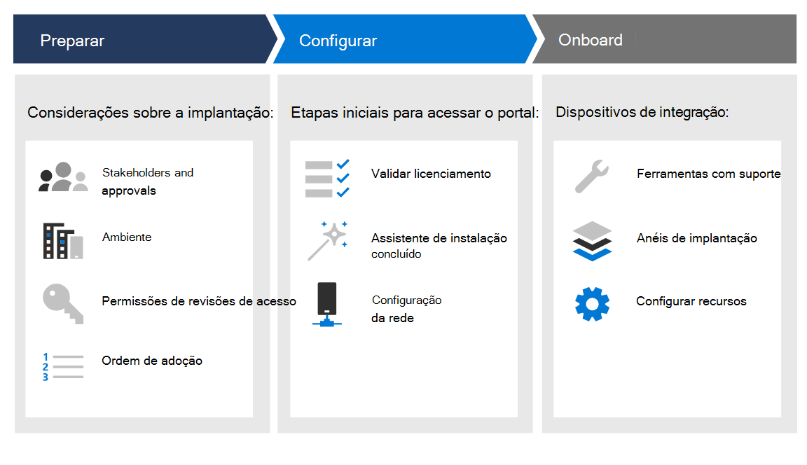

# Fases da implementação

[!INCLUDE [Microsoft 365 Defender rebranding](../../includes/microsoft-defender.md)]

**Aplica-se a:**
- [Microsoft Defender para Ponto de Extremidade](https://go.microsoft.com/fwlink/p/?linkid=2154037)
- [Microsoft 365 Defender](https://go.microsoft.com/fwlink/?linkid=2118804)

>Deseja experimentar o Defender para Ponto de Extremidade? [Inscreva-se para uma avaliação gratuita.](https://www.microsoft.com/microsoft-365/windows/microsoft-defender-atp?ocid=docs-wdatp-assignaccess-abovefoldlink)

Saiba como implantar o Microsoft Defender para o Ponto de Extremidade para que sua empresa possa aproveitar a proteção preventiva, a detecção pós-violação, a investigação automatizada e a resposta. 

Este guia ajuda você a trabalhar entre as partes interessadas para preparar seu ambiente e, em seguida, integrar dispositivos de forma metodista, mudando da avaliação para um piloto significativo, para a implantação completa.

Cada seção corresponde a um artigo separado nesta solução.

|Fase | Descrição | 
|:-------|:-----|
| [Fase 1: Preparar](prepare-deployment.md)| Saiba mais sobre o que você precisa considerar ao implantar o Defender para o Ponto de Extremidade, como aprovações de participantes, considerações de ambiente, permissões de acesso e ordem de adoção de recursos. 
| [Fase 2: Configurar](production-deployment.md)|  Receba orientações sobre as etapas iniciais necessárias para que você possa acessar o portal, como validar o licenciamento, concluir o assistente de instalação e a configuração de rede. 
| [Fase 3: Integrar](onboarding.md) | Saiba como usar anéis de implantação, ferramentas de integração com suporte com base no tipo de ponto de extremidade e configurando os recursos disponíveis. 

Depois de concluir este guia, você será configurado com as permissões de acesso corretas, seus pontos de extremidade serão integrados e os dados do sensor de relatório para o serviço, e recursos como proteção de próxima geração e redução de superfície de ataque estarão no local.

Independentemente da arquitetura do ambiente e do  método de implantação que você escolher descrito nas diretrizes de implantação do Plano, este guia irá dar suporte a você nos pontos de extremidade de integração. 

## Principais recursos

Embora o Microsoft Defender para Ponto de Extremidade fornece muitos recursos, o principal objetivo deste guia de implantação é começar a trabalhar com dispositivos de integração. Além da integração, essas diretrizes são iniciadas com os seguintes recursos.

Funcionalidade | Descrição 
:---|:---
Detecção de ponto de extremidade e resposta | Os recursos de detecção e resposta do ponto de extremidade são colocados para detectar, investigar e responder a tentativas de invasão e violações ativas.
Proteção de próxima geração | Para reforçar ainda mais o perímetro de segurança da sua rede, o Microsoft Defender for Endpoint usa proteção de última geração projetada para capturar todos os tipos de ameaças emergentes.
Redução de superfície de ataque |  Forneça a primeira linha de defesa na pilha. Ao garantir que as configurações sejam definidas corretamente e que as técnicas de mitigação de exploração sejam aplicadas, esse conjunto de recursos resistem a ataques e exploração.

Todos esses recursos estão disponíveis para o Microsoft Defender para titulares de licença do Ponto de Extremidade. Para obter mais informações, consulte [Requisitos de licenciamento](minimum-requirements.md#licensing-requirements).

## Escopo

### No escopo

-   Uso de Microsoft Endpoint Manager e Microsoft Endpoint Manager para pontos de extremidade de integração no serviço e configurar recursos

-   Habilitando o Defender para detecção e resposta de ponto de extremidade (EDR)

-   Habilitando os recursos da Plataforma de Proteção de Ponto de Extremidade (EPP) do Defender para Pontos de Extremidade

    -   Proteção de próxima geração

    -   Redução de superfície de ataque

### Fora do escopo

Os seguintes estão fora do escopo deste guia de implantação:

-   Configuração de soluções de terceiros que podem se integrar ao Defender para Ponto de Extremidade

-   Testes de penetração no ambiente de produção

## Confira também
- [Fase 1: Preparar](prepare-deployment.md)
- [Fase 2: Configurar](production-deployment.md)
- [Fase 3: Integrar](onboarding.md)
- [Planejar a implantação](deployment-strategy.md)