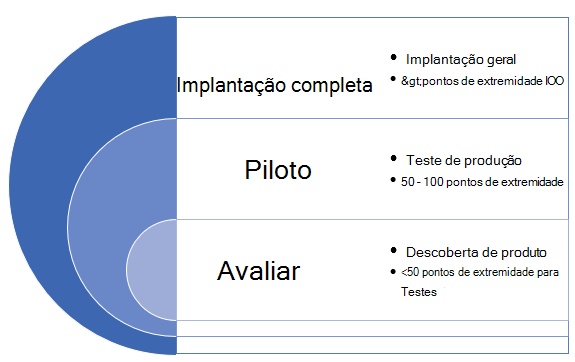
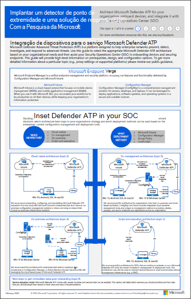
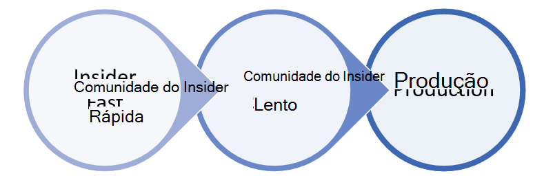

# Implantar o Microsoft Defender para Ponto de Extremidade em anéis

[!INCLUDE [Microsoft 365 Defender rebranding](../../includes/microsoft-defender.md)]

**Aplica-se a:**
- [Microsoft Defender para Ponto de Extremidade](https://go.microsoft.com/fwlink/p/?linkid=2154037)
- [Microsoft 365 Defender](https://go.microsoft.com/fwlink/?linkid=2118804)

>Deseja experimentar o Defender para Ponto de Extremidade? [Inscreva-se para uma avaliação gratuita.](https://www.microsoft.com/microsoft-365/windows/microsoft-defender-atp?ocid=docs-wdatp-assignaccess-abovefoldlink)

A implantação do Microsoft Defender para Ponto de Extremidade pode ser feita usando uma abordagem de implantação baseada em anel. 

Os anéis de implantação podem ser aplicados nos seguintes cenários:
- [Novas implantações](#new-deployments)
- [Implantações existentes](#existing-deployments)

## Novas implantações

Uma abordagem baseada em anel é um método de identificar um conjunto de pontos de extremidade para a integração e verificar se determinados critérios são atendidos antes de continuar a implantar o serviço em um conjunto maior de dispositivos. Você pode definir os critérios de saída para cada anel e garantir que eles sejam satisfeitos antes de passar para o próximo anel.

A adoção de uma implantação baseada em anel ajuda a reduzir possíveis problemas que podem surgir durante a implantação do serviço. Pilotando um determinado número de dispositivos primeiro, você pode identificar possíveis problemas e reduzir possíveis riscos que possam surgir. 

A Tabela 1 fornece um exemplo dos anéis de implantação que você pode usar. 

**Tabela 1**

|**Anel de implantação**|**Descrição**|
|:-----|:-----|
Avaliar | Anel 1: identificar 50 sistemas para testes piloto 
Piloto | Anel 2: identificar os próximos 50 a 100 pontos de extremidade no ambiente de produção    
Implantação completa | Anel 3: lançar serviço para o restante do ambiente em incrementos maiores

### Critérios de saída
Um conjunto de exemplos de critérios de saída para esses anéis pode incluir:
- Dispositivos aparecem na lista de inventário de dispositivos
- Alertas aparecem no painel
- [Executar um teste de detecção](run-detection-test.md)
- [Executar um ataque simulado em um dispositivo](attack-simulations.md)

### Avaliar
Identifique um pequeno número de máquinas de teste em seu ambiente para integração ao serviço. O ideal é que esses máquinas sejam menos de 50 pontos de extremidade. 

### Piloto
O Microsoft Defender para Ponto de Extremidade oferece suporte a uma variedade de pontos de extremidade que você pode integrar ao serviço. Nesse anel, identifique vários dispositivos para integração e com base nos critérios de saída que você definir, decida prosseguir para o próximo anel de implantação.

A tabela a seguir mostra os pontos de extremidade com suporte e a ferramenta correspondente que você pode usar para a integração de dispositivos ao serviço. 

| Ponto de extremidade     | Ferramenta de implantação                       |
|--------------|------------------------------------------|
| **Windows**  |  [Script local (até 10 dispositivos)](configure-endpoints-script.md)   OBSERVAÇÃO: se você quiser implantar mais de 10 dispositivos em um ambiente de produção, use o método de Política de Grupo ou as outras ferramentas com suporte listadas abaixo.   [Política de grupo](configure-endpoints-gp.md)    [Microsoft Endpoint Manager/ Gerenciador de Dispositivos Móveis](configure-endpoints-mdm.md)     [Gerenciador de Configuração do Microsoft Endpoint](configure-endpoints-sccm.md)   [Scripts VDI](configure-endpoints-vdi.md)   |
| **macOS**    | [Script local](mac-install-manually.md)   [Microsoft Endpoint Manager](mac-install-with-intune.md)   [JAMF Pro](mac-install-with-jamf.md)   [Gerenciamento de dispositivo móvel](mac-install-with-other-mdm.md) |
| **Servidor Linux** | [Script local](linux-install-manually.md)   [Puppet](linux-install-with-puppet.md)   [Ansible](linux-install-with-ansible.md)|
| **iOS**      | [Baseado em aplicativos](ios-install.md)                                |
| **Android**  | [Microsoft Endpoint Manager](android-intune.md)               | 

### Implantação completa
Neste estágio, você pode usar o material [planejar a](deployment-strategy.md) implantação para ajudá-lo a planejar sua implantação. 

Use o material a seguir para selecionar a arquitetura apropriada do Microsoft Defender para Ponto de Extremidade que melhor acompanha sua organização.

|**Item**|**Descrição**|
|:-----|:-----|
|  [PDF](https://github.com/MicrosoftDocs/microsoft-365-docs/raw/public/microsoft-365/security/defender-endpoint/downloads/mdatp-deployment-strategy.pdf)  \| [Visio](https://github.com/MicrosoftDocs/microsoft-365-docs/raw/public/microsoft-365/security/defender-endpoint/downloads/mdatp-deployment-strategy.vsdx) | O material arquitetônico ajuda a planejar a implantação para as seguintes arquiteturas: <ul><li> Nuvem nativa </li><li> Cogerenciamento </li><li> No local</li><li>Avaliação e integração local</li>

## Implantações existentes

### Windows pontos de extremidade
Para Windows e/ou servidores Windows, selecione vários máquinas para testar com antecedência (antes do patch terça-feira) usando o programa **DEP (Validação** de Atualização de Segurança) .

Para saber mais, veja:
- [O que é o Programa de Validação de Atualizações de Segurança](https://techcommunity.microsoft.com/t5/windows-it-pro-blog/what-is-the-security-update-validation-program/ba-p/275767)
- [Programa de Validação de Atualização de Software e Centro de Proteção contra Malware da Microsoft Estabelecimento - TwC Interactive Timeline Part 4](https://www.microsoft.com/security/blog/2012/03/28/software-update-validation-program-and-microsoft-malware-protection-center-establishment-twc-interactive-timeline-part-4/)

### Pontos de extremidade Windows não-Windows
Com macOS e Linux, você pode usar alguns sistemas e executar no canal Beta.

>[!NOTE]
>Idealmente, pelo menos um administrador de segurança e um desenvolvedor para que você possa encontrar problemas de compatibilidade, desempenho e confiabilidade antes que a com build o faça no canal Atual.

A escolha do canal determina o tipo e a frequência de atualizações oferecidas ao seu dispositivo. Os dispositivos em Beta são os primeiros a receber atualizações e novos recursos, seguidos posteriormente por Preview e por último por Current.

Para visualizar novos recursos e fornecer comentários antecipados, é recomendável configurar alguns dispositivos em sua empresa para usar Beta ou Preview.

>[!WARNING]
>Alternar o canal após a instalação inicial exige que o produto seja reinstalado. Para alternar o canal do produto: desinstale o pacote existente, configure novamente seu dispositivo para usar o novo canal e siga as etapas deste documento para instalar o pacote no novo local.
