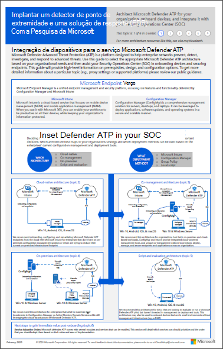

# Planejar sua implantação do Microsoft Defender para Ponto de Extremidade 

[!INCLUDE [Microsoft 365 Defender rebranding](../../includes/microsoft-defender.md)]

**Aplica-se a:**
- [Microsoft Defender para Ponto de Extremidade](https://go.microsoft.com/fwlink/p/?linkid=2154037)
- [Microsoft 365 Defender](https://go.microsoft.com/fwlink/?linkid=2118804)

>Deseja experimentar o Defender para Ponto de Extremidade? [Inscreva-se para uma avaliação gratuita.](https://www.microsoft.com/microsoft-365/windows/microsoft-defender-atp?ocid=docs-wdatp-secopsdashboard-abovefoldlink) 

Planeje a implantação do Microsoft Defender para o Ponto de Extremidade para que você possa maximizar os recursos de segurança dentro do pacote e proteger melhor sua empresa contra ameaças cibernéticas.

Essa solução fornece orientações sobre como identificar sua arquitetura de ambiente, selecionar o tipo de ferramenta de implantação que melhor atende às suas necessidades e orientações sobre como configurar recursos.

## Etapa 1: Identificar arquitetura
Entendemos que todos os ambientes corporativos são exclusivos, portanto, fornecemos várias opções para dar a você a flexibilidade de escolher como implantar o serviço.

Dependendo do ambiente, algumas ferramentas são mais adequadas para determinadas arquiteturas. 

Use o material a seguir para selecionar o Defender para a arquitetura do Ponto de Extremidade apropriado que melhor acompanha sua organização.

| Item | Descrição |
|:-----|:-----|
|  [PDF](https://github.com/MicrosoftDocs/microsoft-365-docs/raw/public/microsoft-365/security/defender-endpoint/downloads/mdatp-deployment-strategy.pdf)  \| [Visio](https://github.com/MicrosoftDocs/microsoft-365-docs/raw/public/microsoft-365/security/defender-endpoint/downloads/mdatp-deployment-strategy.vsdx) | O material arquitetônico ajuda a planejar a implantação para as seguintes arquiteturas: <ul><li> Nuvem nativa </li><li> Cogerenciamento </li><li> No local</li><li>Avaliação e integração local</li>

## Etapa 2: selecionar o método de implantação
O Defender para Ponto de Extremidade oferece suporte a uma variedade de pontos de extremidade que você pode integrar ao serviço. 

A tabela a seguir lista os pontos de extremidade com suporte e a ferramenta de implantação correspondente que você pode usar para que você possa planejar a implantação adequadamente.

| Ponto de extremidade     | Ferramenta de implantação                       |
|--------------|------------------------------------------|
| **Windows**  |  [Script local (até 10 dispositivos)](configure-endpoints-script.md)    [Política de grupo](configure-endpoints-gp.md)    [Microsoft Endpoint Manager/ Gerenciador de Dispositivos Móveis](configure-endpoints-mdm.md)     [Microsoft Endpoint Configuration Manager](configure-endpoints-sccm.md)   [Scripts VDI](configure-endpoints-vdi.md)   |
| **macOS**    | [Script local](mac-install-manually.md)   [Microsoft Endpoint Manager](mac-install-with-intune.md)   [JAMF Pro](mac-install-with-jamf.md)   [Gerenciamento de dispositivo móvel](mac-install-with-other-mdm.md) |
| **Servidor Linux** | [Script local](linux-install-manually.md)   [Puppet](linux-install-with-puppet.md)   [Ansible](linux-install-with-ansible.md)|
| **iOS**      | [Baseado em aplicativos](ios-install.md)                                |
| **Android**  | [Microsoft Endpoint Manager](android-intune.md)               | 

## Etapa 3: Configurar recursos
Após a integração dos pontos de extremidade, configure os recursos de segurança no Defender para Ponto de Extremidade para que você possa maximizar a proteção de segurança robusta disponível no pacote. Os recursos incluem:

- Detecção de ponto de extremidade e resposta
- Proteção de próxima geração
- Redução de superfície de ataque

  
## Tópicos relacionados
- [Fases da implementação](deployment-phases.md)
