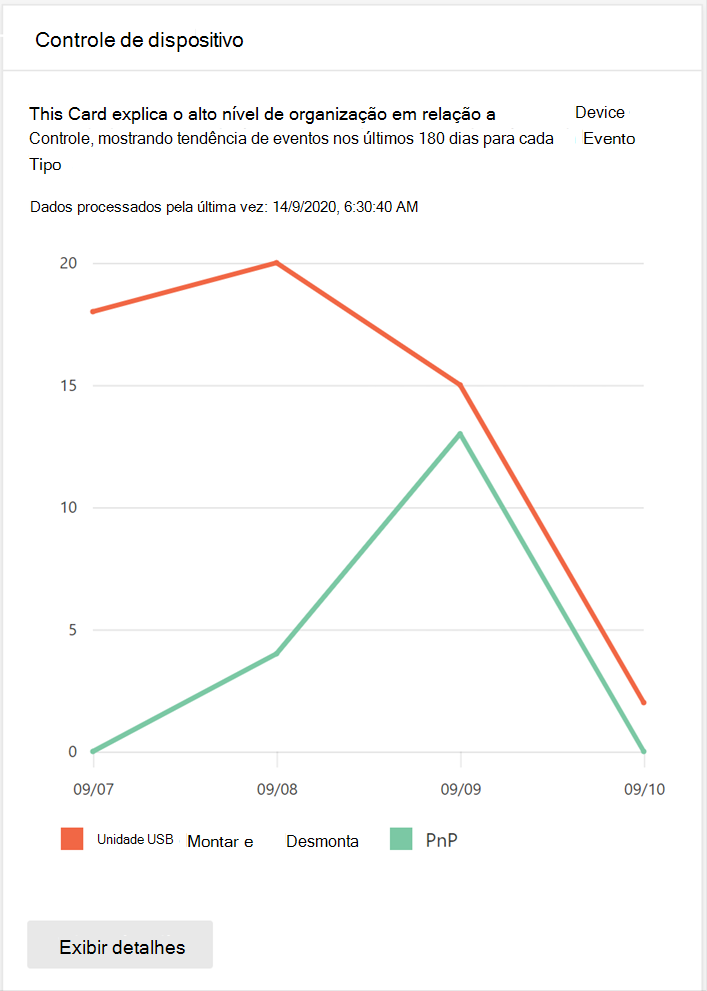
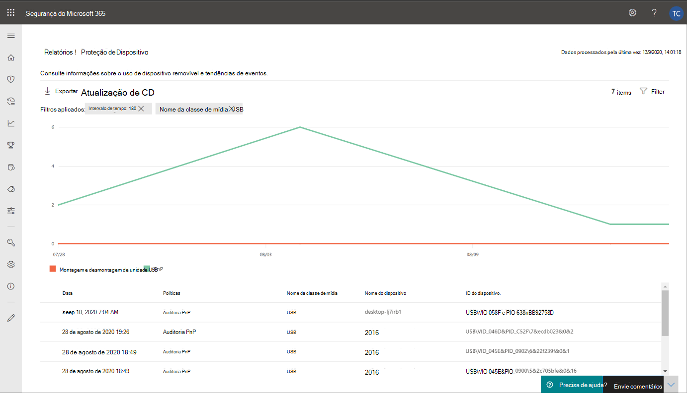
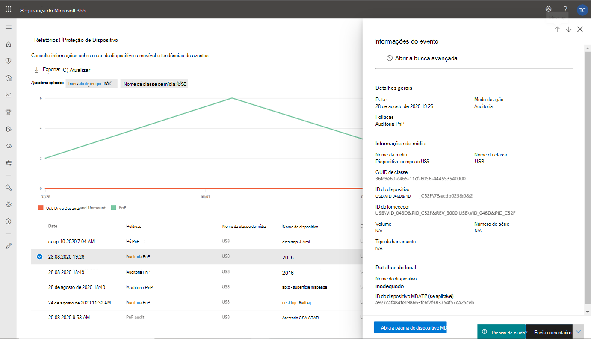
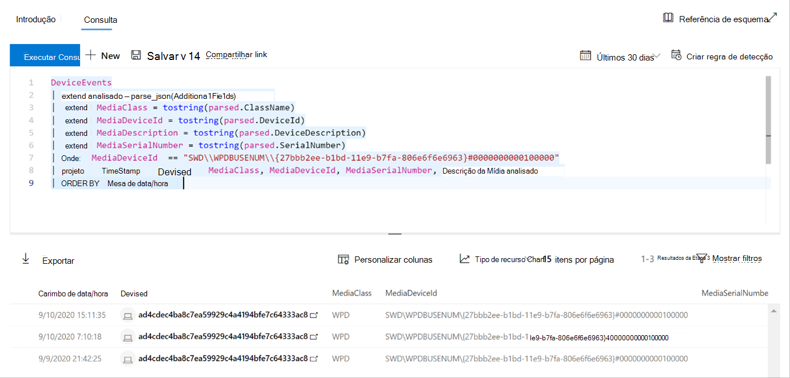
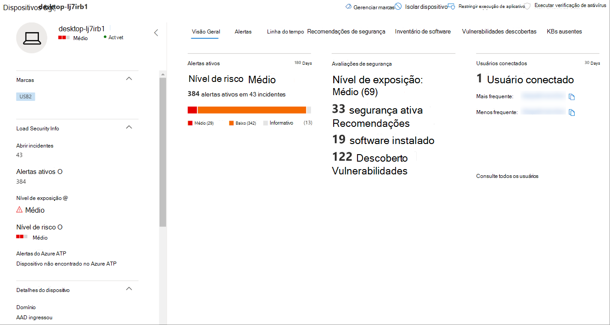

# Proteger dados da sua organização com controle de dispositivoProtect your organization’s data with device control

**Aplica-se a:** [Microsoft Defender para Ponto de Extremidade](https://go.microsoft.com/fwlink/p/?linkid=2069559)**Applies to:** [Microsoft Defender for Endpoint](https://go.microsoft.com/fwlink/p/?linkid=2069559)

O controle de dispositivo do Microsoft Defender for Endpoint protege contra perda de dados, monitorando e controlando o uso de mídia por dispositivos em sua organização, como o uso de dispositivos de armazenamento removíveis e unidades USB.Microsoft Defender for Endpoint device control protects against data loss, by monitoring and controlling media use by devices in your organization, such as the use of removable storage devices and USB drives.

Com o relatório de controle de dispositivo, você pode exibir eventos relacionados ao uso de mídia, como:With the device control report, you can view events that relate to media usage, such as:

- **Eventos de auditoria:** Mostra o número de eventos de auditoria que ocorrem quando a mídia externa está conectada.**Audit events:** Shows the number of audit events that occur when external media is connected.
- **Eventos de política:** Mostra o número de eventos de política que ocorrem quando uma política de controle de dispositivo é disparada.**Policy events:** Shows the number of policy events that occur when a device control policy is triggered.

> [!NOTE]
> O evento de auditoria para controlar o uso de mídia é habilitado por padrão para dispositivos conectados ao Microsoft Defender para Ponto de Extremidade.The audit event to track media usage is enabled by default for devices onboarded to Microsoft Defender for Endpoint.

## Noções básicas sobre os eventos de auditoriaUnderstanding the audit events

Os eventos de auditoria incluem:The audit events include:

- **Montagem e desmontagem da** unidade USB: Eventos de auditoria gerados quando uma unidade USB é montada ou desmontada.**USB drive mount and unmount:** Audit events that are generated when a USB drive is mounted or unmounted.
- **PnP:** Os eventos de auditoria Plug and Play são gerados quando o armazenamento removível, uma impressora ou Bluetooth mídia está conectada.**PnP:** Plug and Play audit events are generated when removable storage, a printer, or Bluetooth media is connected.

## Monitorar a segurança do controle de dispositivoMonitor device control security

O controle de dispositivo no Microsoft Defender para Ponto de Extremidade capacita os administradores de segurança com ferramentas que permitem controlar a segurança de controle de dispositivos da organização por meio de relatórios.Device control in Microsoft Defender for Endpoint empowers security administrators with tools that enable them to track their organization’s device control security through reports. Você pode encontrar o relatório de controle de dispositivo no centro Microsoft 365 segurança indo para **Relatórios > Proteção de dispositivos.**You can find the device control report in the Microsoft 365 security center by going to **Reports > Device protection**.

O cartão de proteção de dispositivo no painel **Relatórios** mostra o número de eventos de auditoria gerados pelo tipo de mídia, nos últimos 180 dias.The Device protection card on the **Reports** dashboard shows the number of audit events generated by media type, over the last 180 days.

> [!div class="mx-imgBorder"]
> 

O **botão Exibir detalhes** mostra mais dados de uso de mídia na página relatório de controle **do** dispositivo.The **View details** button shows more media usage data in the **device control report** page.

A página fornece um painel com o número agregado de eventos por tipo e uma lista de eventos.The page provides a dashboard with aggregated number of events per type and a list of events. Os administradores podem filtrar o intervalo de tempo, o nome da classe de mídia e a ID do dispositivo.Administrators can filter on time range, media class name, and device ID.

> [!div class="mx-imgBorder"]
> 

Quando você seleciona um evento, um flyout é exibido que mostra mais informações:When you select an event, a flyout appears that shows you more information:

- **Detalhes gerais:** Data, modo ação e a política deste evento.**General details:** Date, Action mode, and the policy of this event.
- **Informações de mídia:** As informações de mídia incluem nome de mídia, nome da classe, GUID de classe, ID do dispositivo, ID do fornecedor, volume, número de série e tipo de Barramento.**Media information:** Media information includes Media name, Class name, Class GUID, Device ID, Vendor ID, Volume, Serial number, and Bus type.
- **Detalhes do local:** Nome do dispositivo e MDATP ID do dispositivo.**Location details:** Device name and MDATP device ID.

> [!div class="mx-imgBorder"]
> 

Para ver a atividade em tempo real para essa mídia em toda a organização, selecione o **botão Abrir Busca Avançada.**To see real-time activity for this media across the organization, select the **Open Advanced hunting** button. Isso inclui uma consulta incorporada e pré-definida.This includes an embedded, pre-defined query.

> [!div class="mx-imgBorder"]
> 

Para ver a segurança do dispositivo, selecione o botão Abrir página **do** dispositivo no sobrevoo.To see the security of the device, select the **Open device page** button on the flyout. Este botão abre a página entidade do dispositivo.This button opens the device entity page.

> [!div class="mx-imgBorder"]
> 

## Atrasos de relatóriosReporting delays

O relatório de controle de dispositivo pode ter um atraso de 12 horas a partir do momento em que uma conexão de mídia ocorre até o momento em que o evento é refletido no cartão ou na lista de domínios.The device control report can have a 12-hour delay from the time a media connection occurs to the time the event is reflected in the card or in the domain list.
