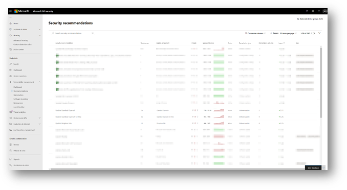

# <a name="device-discovery-overview"></a>Visão geral sobre descoberta de dispositivo

[!INCLUDE [Microsoft 365 Defender rebranding](../../includes/microsoft-defender.md)]

**Aplica-se a:**
- [Microsoft Defender para Ponto de Extremidade](https://go.microsoft.com/fwlink/p/?linkid=2146631)
- [Microsoft 365 Defender](https://go.microsoft.com/fwlink/?linkid=2118804)


Proteger seu ambiente requer o inventário dos dispositivos que estão em sua rede. No entanto, o mapeamento de dispositivos em uma rede geralmente pode ser caro, desafiador e demorado. 

O Microsoft Defender for Endpoint fornece um recurso de descoberta de dispositivo que ajuda você a encontrar dispositivos não administrativos conectados à sua rede corporativa sem a necessidade de dispositivos extras ou alterações de processo complicadas.


O recurso de descoberta de dispositivo permite que você:

- **Descobrir pontos de extremidade corporativos conectados à sua rede corporativa** <br>
Usando opções de descoberta básicas ou padrão, você pode descobrir estações de trabalho, servidores e pontos de extremidade móveis que ainda não estão integradas ao Microsoft Defender para Ponto de Extremidade.  

- **Pontos de extremidade descobertos por integração**<br>
Os pontos de extremidade nãomanageados em sua rede apresentam vulnerabilidades e riscos à sua rede. A integração deles ao serviço pode aumentar a visibilidade de segurança neles. 

Em conjunto com esse recurso, uma nova recomendação de segurança para dispositivos de integração para o Microsoft Defender para Ponto de Extremidade estará disponível como parte da experiência existente de Gerenciamento de Ameaças e Vulnerabilidades.


## <a name="discovery-methods"></a>Métodos de descoberta
Há dois modos de descoberta: 

-   Descoberta básica 
-   Descoberta padrão (recomendada) 


> [!IMPORTANT]
> A descoberta é definida como modo básico. Você pode optar por manter essa configuração por meio da página de configurações. A descoberta padrão será o modo padrão para todos os clientes a partir de 19 de julho de 2021 , a menos que seja modificada pela página de configurações antes dessa data.

### <a name="basic-discovery"></a>Descoberta básica 

Nesse modo, os pontos de extremidade coletarão passivamente eventos em sua rede e extrairão informações do dispositivo deles. A descoberta básica usa o SenseNDR.exe binário para coleta passiva de dados de rede e nenhum tráfego de rede será iniciado. Os pontos de extremidade simplesmente extrairão dados de cada tráfego de rede que é visto por um dispositivo conectado. 

### <a name="standard-discovery"></a>Descoberta padrão 

Esse modo permite que os pontos de extremidade testem ativamente dispositivos observados na rede para enriquecer dados coletados , ajudando você a criar um inventário de dispositivo confiável e coerente. O modo padrão usa sondagem inteligente e ativa para descobrir ainda mais informações sobre dispositivos observados para enriquecer informações de dispositivos existentes.  

Quando o modo Standard estiver habilitado, a atividade de rede mínima e insignificante gerada pelo sensor de descoberta poderá ser observada pelas ferramentas de monitoramento de rede em sua organização.  

 Se você optar por não habilitar esse modo, você só terá visibilidade limitada dos pontos de extremidade nãomanageados em sua rede.

A descoberta padrão usa vários scripts do PowerShell para sondar ativamente dispositivos na rede. Esses scripts do PowerShell são assinados pela Microsoft e são executados a partir do seguinte local: `C:\ProgramData\Microsoft\Windows Defender Advanced Threat Protection\Downloads\*.ps` . Por exemplo, `C:\ProgramData\Microsoft\Windows Defender Advanced Threat Protection\Downloads\UnicastScannerV1.1.0.ps1`.

Você pode alterar e personalizar suas configurações de descoberta, para obter mais informações, consulte [Configure device discovery](configure-device-discovery.md).

> [!NOTE]
> O mecanismo de descoberta diferencia os eventos de rede recebidos na rede corporativa e fora da rede corporativa. Os dispositivos que não estão conectados a redes corporativas não serão descobertos ou listados no inventário do dispositivo. 


## <a name="device-inventory"></a>Inventário de Dispositivos 
Os dispositivos que foram descobertos, mas ainda não foram integrados e protegidos pelo Microsoft Defender para Ponto de Extremidade, serão listados no Inventário de Dispositivos na guia Pontos de Extremidade. Agora você pode usar um novo filtro na lista de inventário de dispositivos chamada Status de integração, que pode ter qualquer um dos seguintes valores:

- Onboarded – O ponto de extremidade está integrado ao Microsoft Defender para Ponto de Extremidade.
- Pode ser integrada – o ponto de extremidade foi descoberto na rede e o Sistema Operacional foi identificado como um com suporte do Microsoft Defender para Ponto de Extremidade, mas não está atualmente a bordo. É altamente recomendável a integração desses dispositivos.
- Sem suporte – o ponto de extremidade foi descoberto na rede, mas não tem suporte do Microsoft Defender para Ponto de Extremidade.
- Informações insuficientes – o sistema não pôde determinar a capacidade de suporte do dispositivo. Habilenciar a descoberta padrão em mais dispositivos na rede pode enriquecer os atributos descobertos. 
 


> [!TIP]
> Você sempre pode aplicar filtros para excluir dispositivos não gerenciamento da lista de inventário de dispositivos. Você também pode usar a coluna de status de integração em consultas de API para filtrar dispositivos não-gerenciamento. 

## <a name="vulnerability-assessment-on-discovered-devices"></a>Avaliação de vulnerabilidade em dispositivos descobertos
Vulnerabilidades e riscos em seus dispositivos, bem como outros dispositivos não-manageados descobertos na rede fazem parte dos fluxos de TVM atuais em "Segurança Recomendações" e representados em páginas de entidade no portal. Procure por recomendações de segurança relacionadas a "SSH" para encontrar vulnerabilidades SSH relacionadas a dispositivos gerenciados e não gerenciados. 

  

## <a name="use-advanced-hunting-on-discovered-devices"></a>Usar a Busca Avançada em dispositivos descobertos
Você pode usar consultas de Busca Avançada para obter visibilidade em dispositivos descobertos.
Encontre detalhes sobre pontos de extremidade descobertos na tabela DeviceInfo ou informações relacionadas à rede sobre esses dispositivos na tabela DeviceNetworkInfo.
  


A descoberta de dispositivo aproveita o Microsoft Defender para dispositivos conectados ao Ponto de Extremidade como uma fonte de dados de rede para atribuir atividades a dispositivos não-integrados. Isso significa que, se um dispositivo conectado do Microsoft Defender for Endpoint for comunicado com um dispositivo não-integrado, as atividades no dispositivo não-integrado poderão ser vistas na linha do tempo e por meio da tabela DeviceNetworkEvents de busca avançada. 


Os novos eventos são baseados em conexões TCP (Transmission Control Protocol) e se ajustarão ao esquema deviceNetworkEvents atual. O TCP ingressa no dispositivo habilitado do Microsoft Defender para Ponto de Extremidade de um microsoft defender para ponto de extremidade não habilitado.  

Os seguintes tipos de ação também foram adicionados:  

- ConnectionAttempt - Uma tentativa de estabelecer uma conexão TCP (syn)  
- ConnectionAcknowledged - Um reconhecimento de que uma conexão TCP foi aceita (syn\ack)  

Você pode tentar esta consulta de exemplo:  

```
DeviceNetworkEvents  
| where ActionType == "ConnectionAcknowledged" or ActionType == "ConnectionAttempt"  
| take 10  
```


## <a name="changed-behavior"></a>Comportamento alterado
A seção a seguir lista as alterações que você observará no Microsoft Defender para Ponto de Extremidade e/ou Microsoft 365 Centro de Segurança quando esse recurso estiver habilitado. 
 
1.  Os dispositivos que não estão internados no Microsoft Defender para o Ponto de Extremidade devem aparecer no inventário de dispositivos, busca avançada e consultas de API. Isso pode aumentar significativamente o tamanho dos resultados da consulta. 
    1. As tabelas "DeviceInfo" e "DeviceNetworkInfo" na Busca Avançada agora manterão o dispositivo descoberto. Você pode filtrar esses dispositivos usando o atributo "OnboardingStatus".

    2. Os dispositivos descobertos devem aparecer nos resultados da consulta da API de streaming. Você pode filtrar esses dispositivos usando o `OnboardingStatus` filtro em sua consulta. 

2.  Os dispositivos sem gestão serão atribuídos a grupos de dispositivos existentes com base nos critérios definidos. 
3.  Em casos raros, a descoberta padrão pode disparar alertas em monitores de rede ou ferramentas de segurança. Forneça comentários, se você experimentar esses eventos, para ajudar a evitar que esses problemas se repitam. Você pode excluir explicitamente destinos específicos ou sub-redes inteiras de serem sondadas ativamente pela descoberta padrão. 


## <a name="next-steps"></a>Próximas etapas
- [Configurar a descoberta de dispositivo](configure-device-discovery.md)
- [Perguntas frequentes sobre descoberta de dispositivos](device-discovery-faq.md)
