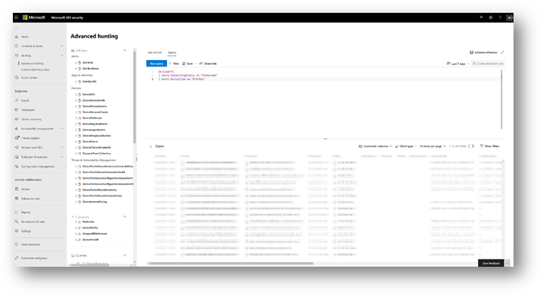

# <a name="device-discovery-overview"></a><span data-ttu-id="2db05-104">Visão geral sobre descoberta de dispositivo</span><span class="sxs-lookup"><span data-stu-id="2db05-104">Device discovery overview</span></span>

[!INCLUDE [Microsoft 365 Defender rebranding](../../includes/microsoft-defender.md)]

<span data-ttu-id="2db05-105">**Aplica-se a:**</span><span class="sxs-lookup"><span data-stu-id="2db05-105">**Applies to:**</span></span>
- [<span data-ttu-id="2db05-106">Microsoft Defender para Ponto de Extremidade</span><span class="sxs-lookup"><span data-stu-id="2db05-106">Microsoft Defender for Endpoint</span></span>](https://go.microsoft.com/fwlink/p/?linkid=2146631)
- [<span data-ttu-id="2db05-107">Microsoft 365 Defender</span><span class="sxs-lookup"><span data-stu-id="2db05-107">Microsoft 365 Defender</span></span>](https://go.microsoft.com/fwlink/?linkid=2118804)

[!include[Prerelease information](../../includes/prerelease.md)]

<span data-ttu-id="2db05-108">Proteger seu ambiente requer o inventário dos dispositivos que estão em sua rede.</span><span class="sxs-lookup"><span data-stu-id="2db05-108">Protecting your environment requires taking inventory of the devices that are in your network.</span></span> <span data-ttu-id="2db05-109">No entanto, o mapeamento de dispositivos em uma rede geralmente pode ser caro, desafiador e demorado.</span><span class="sxs-lookup"><span data-stu-id="2db05-109">However, mapping devices in a network can often be expensive, challenging, and time-consuming.</span></span> 

<span data-ttu-id="2db05-110">O Microsoft Defender for Endpoint fornece um recurso de descoberta de dispositivo que ajuda você a encontrar dispositivos não administrativos conectados à sua rede corporativa sem a necessidade de dispositivos extras ou alterações de processo complicadas.</span><span class="sxs-lookup"><span data-stu-id="2db05-110">Microsoft Defender for Endpoint provides a device discovery capability that helps you find unmanaged devices connected to your corporate network without the need for extra appliances or cumbersome process changes.</span></span>


<span data-ttu-id="2db05-111">O recurso de descoberta de dispositivo permite que você:</span><span class="sxs-lookup"><span data-stu-id="2db05-111">The device discovery capability allows you to:</span></span>

- <span data-ttu-id="2db05-112">**Descobrir pontos de extremidade corporativos conectados à sua rede corporativa**</span><span class="sxs-lookup"><span data-stu-id="2db05-112">**Discover enterprise endpoints connected to your corporate network**</span></span> <br>
<span data-ttu-id="2db05-113">Usando opções de descoberta básicas ou padrão, você pode descobrir estações de trabalho, servidores e pontos de extremidade móveis que ainda não estão integradas ao Microsoft Defender para Ponto de Extremidade.</span><span class="sxs-lookup"><span data-stu-id="2db05-113">Using either basic or standard discovery options, you can discover workstations, servers, and mobile endpoints that are not yet onboarded to Microsoft Defender for Endpoint.</span></span>  

- <span data-ttu-id="2db05-114">**Pontos de extremidade descobertos por integração**</span><span class="sxs-lookup"><span data-stu-id="2db05-114">**Onboard discovered endpoints**</span></span><br>
<span data-ttu-id="2db05-115">Os pontos de extremidade nãomanageados em sua rede apresentam vulnerabilidades e riscos à sua rede.</span><span class="sxs-lookup"><span data-stu-id="2db05-115">Unmanaged endpoints in your network introduce vulnerabilities and risks to your network.</span></span> <span data-ttu-id="2db05-116">A integração deles ao serviço pode aumentar a visibilidade de segurança neles.</span><span class="sxs-lookup"><span data-stu-id="2db05-116">Onboarding them to the service can increase the security visibility on them.</span></span> 

<span data-ttu-id="2db05-117">Em conjunto com esse recurso, uma nova recomendação de segurança para dispositivos de integração para o Microsoft Defender para Ponto de Extremidade estará disponível como parte da experiência existente de Gerenciamento de Ameaças e Vulnerabilidades.</span><span class="sxs-lookup"><span data-stu-id="2db05-117">In conjunction with this capability, a new security recommendation to onboard devices to Microsoft Defender for Endpoint will be available as part of the existing Threat and Vulnerability Management experience.</span></span>


## <a name="discovery-methods"></a><span data-ttu-id="2db05-118">Métodos de descoberta</span><span class="sxs-lookup"><span data-stu-id="2db05-118">Discovery methods</span></span>
<span data-ttu-id="2db05-119">Há dois modos de descoberta:</span><span class="sxs-lookup"><span data-stu-id="2db05-119">There are two modes of discovery:</span></span> 

-   <span data-ttu-id="2db05-120">Descoberta básica</span><span class="sxs-lookup"><span data-stu-id="2db05-120">Basic discovery</span></span> 
-   <span data-ttu-id="2db05-121">Descoberta padrão (recomendada)</span><span class="sxs-lookup"><span data-stu-id="2db05-121">Standard discovery (recommended)</span></span> 


> [!IMPORTANT]
> <span data-ttu-id="2db05-122">A descoberta é definida como modo básico.</span><span class="sxs-lookup"><span data-stu-id="2db05-122">Discovery is set to basic mode.</span></span> <span data-ttu-id="2db05-123">Você pode optar por manter essa configuração por meio da página de configurações.</span><span class="sxs-lookup"><span data-stu-id="2db05-123">You can choose to retain this configuration through the settings page.</span></span> <span data-ttu-id="2db05-124">A descoberta padrão será o modo padrão para todos os clientes de visualização a partir de 10 de maio de 2021 , a menos que seja modificada pela página de configurações antes dessa data.</span><span class="sxs-lookup"><span data-stu-id="2db05-124">Standard discovery will be the default mode for all preview customers starting May 10, 2021 - unless modified through the settings page before this date.</span></span>

### <a name="basic-discovery"></a><span data-ttu-id="2db05-125">Descoberta básica</span><span class="sxs-lookup"><span data-stu-id="2db05-125">Basic discovery</span></span> 

<span data-ttu-id="2db05-126">Nesse modo, os pontos de extremidade coletarão passivamente eventos em sua rede e extrairão informações do dispositivo deles.</span><span class="sxs-lookup"><span data-stu-id="2db05-126">In this mode, endpoints will passively collect events in your network and extract device information from them.</span></span> <span data-ttu-id="2db05-127">A descoberta básica usa o SenseNDR.exe binário para coleta passiva de dados de rede e nenhum tráfego de rede será iniciado.</span><span class="sxs-lookup"><span data-stu-id="2db05-127">Basic discovery uses the SenseNDR.exe binary for passive network data collection and no network traffic will be initiated.</span></span> <span data-ttu-id="2db05-128">Os pontos de extremidade simplesmente extrairão dados de cada tráfego de rede que é visto por um dispositivo conectado.</span><span class="sxs-lookup"><span data-stu-id="2db05-128">Endpoints will simply extract data from every network traffic that is seen by an onboarded device.</span></span> 

### <a name="standard-discovery"></a><span data-ttu-id="2db05-129">Descoberta padrão</span><span class="sxs-lookup"><span data-stu-id="2db05-129">Standard discovery</span></span> 

<span data-ttu-id="2db05-130">Esse modo permite que os pontos de extremidade testem ativamente dispositivos observados na rede para enriquecer dados coletados , ajudando você a criar um inventário de dispositivo confiável e coerente.</span><span class="sxs-lookup"><span data-stu-id="2db05-130">This mode allows endpoints to actively probe observed devices in the network to enrich collected data - helping you build a reliable and coherent device inventory.</span></span> <span data-ttu-id="2db05-131">O modo padrão usa sondagem inteligente e ativa para descobrir ainda mais informações sobre dispositivos observados para enriquecer informações de dispositivos existentes.</span><span class="sxs-lookup"><span data-stu-id="2db05-131">Standard mode uses smart, active probing to discover even more information about observed devices to enrich existing device information.</span></span>  

<span data-ttu-id="2db05-132">Quando o modo Standard estiver habilitado, a atividade de rede mínima e insignificante gerada pelo sensor de descoberta poderá ser observada pelas ferramentas de monitoramento de rede em sua organização.</span><span class="sxs-lookup"><span data-stu-id="2db05-132">When Standard mode is enabled, minimal and negligible network activity generated by the discovery sensor might be observed by network monitoring tools in your organization.</span></span>  

 <span data-ttu-id="2db05-133">Se você optar por não habilitar esse modo, você só terá visibilidade limitada dos pontos de extremidade nãomanageados em sua rede.</span><span class="sxs-lookup"><span data-stu-id="2db05-133">If you choose not to enable this mode, you will only gain limited visibility of unmanaged endpoints in your network.</span></span>

<span data-ttu-id="2db05-134">A descoberta padrão usa vários scripts do PowerShell para sondar ativamente dispositivos na rede.</span><span class="sxs-lookup"><span data-stu-id="2db05-134">Standard discovery uses various PowerShell scripts to actively probe devices in the network.</span></span> <span data-ttu-id="2db05-135">Esses scripts do PowerShell são assinados pela Microsoft e são executados a partir do seguinte local: `C:\ProgramData\Microsoft\Windows Defender Advanced Threat Protection\Downloads\*.ps` .</span><span class="sxs-lookup"><span data-stu-id="2db05-135">Those PowerShell scripts are Microsoft signed and are executed from the following location: `C:\ProgramData\Microsoft\Windows Defender Advanced Threat Protection\Downloads\*.ps`.</span></span> <span data-ttu-id="2db05-136">Por exemplo, `C:\ProgramData\Microsoft\Windows Defender Advanced Threat Protection\Downloads\UnicastScannerV1.1.0.ps1`.</span><span class="sxs-lookup"><span data-stu-id="2db05-136">For example, `C:\ProgramData\Microsoft\Windows Defender Advanced Threat Protection\Downloads\UnicastScannerV1.1.0.ps1`.</span></span>

<span data-ttu-id="2db05-137">Você pode alterar e personalizar suas configurações de descoberta, para obter mais informações, consulte [Configure device discovery](configure-device-discovery.md).</span><span class="sxs-lookup"><span data-stu-id="2db05-137">You can change and customize your discovery settings, for more information see [Configure device discovery](configure-device-discovery.md).</span></span>

> [!NOTE]
> <span data-ttu-id="2db05-138">O mecanismo de descoberta diferencia os eventos de rede recebidos na rede corporativa e fora da rede corporativa.</span><span class="sxs-lookup"><span data-stu-id="2db05-138">The discovery engine distinguishes between network events that are received in the corporate network versus outside of the corporate network.</span></span> <span data-ttu-id="2db05-139">Os dispositivos que não estão conectados a redes corporativas não serão descobertos ou listados no inventário do dispositivo.</span><span class="sxs-lookup"><span data-stu-id="2db05-139">Devices that are not connected to corporate networks will not be discovered or listed in the device inventory.</span></span> 


## <a name="device-inventory"></a><span data-ttu-id="2db05-140">Inventário de Dispositivos</span><span class="sxs-lookup"><span data-stu-id="2db05-140">Device Inventory</span></span> 
<span data-ttu-id="2db05-141">Os dispositivos que foram descobertos, mas ainda não foram integrados e protegidos pelo Microsoft Defender para Ponto de Extremidade, serão listados no Inventário de Dispositivos na guia Pontos de Extremidade. Agora você pode usar um novo filtro na lista de inventário de dispositivos chamada Status de integração, que pode ter qualquer um dos seguintes valores:</span><span class="sxs-lookup"><span data-stu-id="2db05-141">Devices that have been discovered but have not yet been onboarded and secured by Microsoft Defender for Endpoint will be listed in Device Inventory within the Endpoints tab. You can now use a new filter in the device inventory list called Onboarding status which can have any of the following values:</span></span>

- <span data-ttu-id="2db05-142">Onboarded – O ponto de extremidade está integrado ao Microsoft Defender para Ponto de Extremidade.</span><span class="sxs-lookup"><span data-stu-id="2db05-142">Onboarded – The endpoint is onboarded to Microsoft Defender for Endpoint.</span></span>
- <span data-ttu-id="2db05-143">Pode ser integrada – o ponto de extremidade foi descoberto na rede e o Sistema Operacional foi identificado como um com suporte do Microsoft Defender para Ponto de Extremidade, mas não está atualmente a bordo.</span><span class="sxs-lookup"><span data-stu-id="2db05-143">Can be onboarded – The endpoint was discovered in the network and the Operating System was identified as one that is supported by Microsoft Defender for Endpoint, but it is not currently onboarded.</span></span> <span data-ttu-id="2db05-144">É altamente recomendável a integração desses dispositivos.</span><span class="sxs-lookup"><span data-stu-id="2db05-144">We highly recommend onboarding these devices.</span></span>
- <span data-ttu-id="2db05-145">Sem suporte – o ponto de extremidade foi descoberto na rede, mas não tem suporte do Microsoft Defender para Ponto de Extremidade.</span><span class="sxs-lookup"><span data-stu-id="2db05-145">Unsupported – The endpoint was discovered in the network but is not supported by Microsoft Defender for Endpoint.</span></span>
- <span data-ttu-id="2db05-146">Informações insuficientes – o sistema não pôde determinar a capacidade de suporte do dispositivo.</span><span class="sxs-lookup"><span data-stu-id="2db05-146">Insufficient info – The system could not determine the supportability of the device.</span></span> <span data-ttu-id="2db05-147">Habilenciar a descoberta padrão em mais dispositivos na rede pode enriquecer os atributos descobertos.</span><span class="sxs-lookup"><span data-stu-id="2db05-147">Enabling standard discovery on more devices in the network can enrich the discovered attributes.</span></span> 
 


## <a name="vulnerability-assessment-on-discovered-devices"></a><span data-ttu-id="2db05-149">Avaliação de vulnerabilidade em dispositivos descobertos</span><span class="sxs-lookup"><span data-stu-id="2db05-149">Vulnerability assessment on discovered devices</span></span>
<span data-ttu-id="2db05-150">As vulnerabilidades e os riscos em seus dispositivos, bem como em outros dispositivos nãomanageados descobertos na rede, fazem parte dos fluxos de TVM atuais em "Recomendações de segurança" e representados em páginas de entidade no portal.</span><span class="sxs-lookup"><span data-stu-id="2db05-150">Vulnerabilities and risks on your devices as well as other discovered unmanaged devices in the network are part of the current TVM flows under "Security Recommendations" and represented in entity pages across the portal.</span></span> <span data-ttu-id="2db05-151">Procure por recomendações de segurança relacionadas a "SSH" para encontrar vulnerabilidades SSH relacionadas a dispositivos gerenciados e não gerenciados.</span><span class="sxs-lookup"><span data-stu-id="2db05-151">Search for "SSH" related security recommendations to find SSH vulnerabilities that are related for unmanaged and managed devices.</span></span> 

  

## <a name="use-advanced-hunting-on-discovered-devices"></a><span data-ttu-id="2db05-153">Usar a Busca Avançada em dispositivos descobertos</span><span class="sxs-lookup"><span data-stu-id="2db05-153">Use Advanced Hunting on discovered devices</span></span>
<span data-ttu-id="2db05-154">Você pode usar consultas de Busca Avançada para obter visibilidade em dispositivos descobertos.</span><span class="sxs-lookup"><span data-stu-id="2db05-154">You can use Advanced Hunting queries to gain visibility on discovered devices.</span></span>
<span data-ttu-id="2db05-155">Encontre detalhes sobre pontos de extremidade descobertos na tabela DeviceInfo ou informações relacionadas à rede sobre esses dispositivos na tabela DeviceNetworkInfo.</span><span class="sxs-lookup"><span data-stu-id="2db05-155">Find details about discovered Endpoints in the DeviceInfo table, or network-related information about those devices in the DeviceNetworkInfo table.</span></span>
  




<span data-ttu-id="2db05-157">A descoberta de dispositivo aproveita o Microsoft Defender para dispositivos conectados ao Ponto de Extremidade como uma fonte de dados de rede para atribuir atividades a dispositivos não-integrados.</span><span class="sxs-lookup"><span data-stu-id="2db05-157">Device discovery leverages Microsoft Defender for Endpoint onboarded devices as a network data source to attribute activities to non-onboarded devices.</span></span> <span data-ttu-id="2db05-158">Isso significa que, se um dispositivo conectado do Microsoft Defender for Endpoint for comunicado com um dispositivo não-integrado, as atividades no dispositivo não-integrado poderão ser vistas na linha do tempo e por meio da tabela DeviceNetworkEvents de busca avançada.</span><span class="sxs-lookup"><span data-stu-id="2db05-158">This means that if a Microsoft Defender for Endpoint onboarded device communicated with a non-onboarded device, activities on the non-onboarded device can be seen on the timeline and through the Advanced hunting DeviceNetworkEvents table.</span></span> 


<span data-ttu-id="2db05-159">Os novos eventos são baseados em conexões TCP (Transmission Control Protocol) e se ajustarão ao esquema deviceNetworkEvents atual.</span><span class="sxs-lookup"><span data-stu-id="2db05-159">New events are Transmission Control Protocol (TCP) connections-based and will fit to the current DeviceNetworkEvents scheme.</span></span> <span data-ttu-id="2db05-160">O TCP ingressa no dispositivo habilitado do Microsoft Defender para Ponto de Extremidade de um microsoft defender para ponto de extremidade não habilitado.</span><span class="sxs-lookup"><span data-stu-id="2db05-160">TCP ingress to the Microsoft Defender for Endpoint enabled device from a non-Microsoft Defender for Endpoint enabled.</span></span>  

<span data-ttu-id="2db05-161">Os seguintes tipos de ação também foram adicionados:</span><span class="sxs-lookup"><span data-stu-id="2db05-161">The following action types have also been added:</span></span>  

- <span data-ttu-id="2db05-162">ConnectionAttempt - Uma tentativa de estabelecer uma conexão TCP (syn)</span><span class="sxs-lookup"><span data-stu-id="2db05-162">ConnectionAttempt - An attempt to establish a TCP connection (syn)</span></span>  
- <span data-ttu-id="2db05-163">ConnectionAcknowledged - Um reconhecimento de que uma conexão TCP foi aceita (syn\ack)</span><span class="sxs-lookup"><span data-stu-id="2db05-163">ConnectionAcknowledged - An acknowledgment that a TCP connection was accepted (syn\ack)</span></span>  

<span data-ttu-id="2db05-164">Você pode tentar esta consulta de exemplo:</span><span class="sxs-lookup"><span data-stu-id="2db05-164">You can try this example query:</span></span>  

```
DeviceNetworkEvents  
| where ActionType == "ConnectionAcknowledged" or ActionType == "ConnectionAttempt"  
| take 10  
```


## <a name="changed-behaviour"></a><span data-ttu-id="2db05-165">Comportamento alterado</span><span class="sxs-lookup"><span data-stu-id="2db05-165">Changed behaviour</span></span>
<span data-ttu-id="2db05-166">A seção a seguir lista as alterações que você observará no Microsoft Defender para Ponto de Extremidade e/ou Centro de Segurança do Microsoft 365 quando esse recurso estiver habilitado.</span><span class="sxs-lookup"><span data-stu-id="2db05-166">The following section lists the changes you'll observe in Microsoft Defender for Endpoint and/or Microsoft 365 Security Center when this capability is enabled.</span></span> 
 
1.  <span data-ttu-id="2db05-167">Os dispositivos que não estão internados no Microsoft Defender para o Ponto de Extremidade devem aparecer no inventário de dispositivos, busca avançada e consultas de API.</span><span class="sxs-lookup"><span data-stu-id="2db05-167">Devices that are not onboarded to Microsoft Defender to Endpoint are expected to appear in the device inventory, advanced hunting, and API queries.</span></span> <span data-ttu-id="2db05-168">Isso pode aumentar significativamente o tamanho dos resultados da consulta.</span><span class="sxs-lookup"><span data-stu-id="2db05-168">This may significantly increase the size of query results.</span></span> 
    1. <span data-ttu-id="2db05-169">As tabelas "DeviceInfo" e "DeviceNetworkInfo" na Busca Avançada agora manterão o dispositivo descoberto.</span><span class="sxs-lookup"><span data-stu-id="2db05-169">"DeviceInfo" and "DeviceNetworkInfo" tables in Advanced Hunting will now hold discovered device.</span></span> <span data-ttu-id="2db05-170">Você pode filtrar esses dispositivos usando o atributo "OnboardingStatus".</span><span class="sxs-lookup"><span data-stu-id="2db05-170">You can filter out those devices by using “OnboardingStatus” attribute.</span></span>

    2. <span data-ttu-id="2db05-171">Os dispositivos descobertos devem aparecer nos resultados da consulta da API de streaming.</span><span class="sxs-lookup"><span data-stu-id="2db05-171">Discovered devices are expected to appear in Streaming API query results.</span></span> <span data-ttu-id="2db05-172">Você pode filtrar esses dispositivos usando o `OnboardingStatus` filtro em sua consulta.</span><span class="sxs-lookup"><span data-stu-id="2db05-172">You can filter out those devices by using the `OnboardingStatus` filter in your query.</span></span> 

2.  <span data-ttu-id="2db05-173">Os dispositivos sem gestão serão atribuídos a grupos de dispositivos existentes com base nos critérios definidos.</span><span class="sxs-lookup"><span data-stu-id="2db05-173">Unmanaged devices will be assigned to existing device groups based on the defined criteria.</span></span> 
3.  <span data-ttu-id="2db05-174">Em casos raros, a descoberta padrão pode disparar alertas em monitores de rede ou ferramentas de segurança.</span><span class="sxs-lookup"><span data-stu-id="2db05-174">In rare cases, Standard discovery might trigger alerts on network monitors or security tools.</span></span> <span data-ttu-id="2db05-175">Forneça comentários, se você experimentar esses eventos, para ajudar a evitar que esses problemas se repitam.</span><span class="sxs-lookup"><span data-stu-id="2db05-175">Please provide feedback, if you experience such events, to help prevent these issues from recurring.</span></span> <span data-ttu-id="2db05-176">Você pode excluir explicitamente destinos específicos ou sub-redes inteiras de serem sondadas ativamente pela descoberta padrão.</span><span class="sxs-lookup"><span data-stu-id="2db05-176">You can explicitly exclude specific targets or entire subnets from being actively probed by Standard discovery.</span></span> 


## <a name="next-steps"></a><span data-ttu-id="2db05-177">Próximas etapas</span><span class="sxs-lookup"><span data-stu-id="2db05-177">Next steps</span></span>
- [<span data-ttu-id="2db05-178">Configurar a descoberta de dispositivo</span><span class="sxs-lookup"><span data-stu-id="2db05-178">Configure device discovery</span></span>](configure-device-discovery.md)
- [<span data-ttu-id="2db05-179">Perguntas frequentes sobre descoberta de dispositivos</span><span class="sxs-lookup"><span data-stu-id="2db05-179">Device discovery FAQs</span></span>](device-discovery-faq.md)
