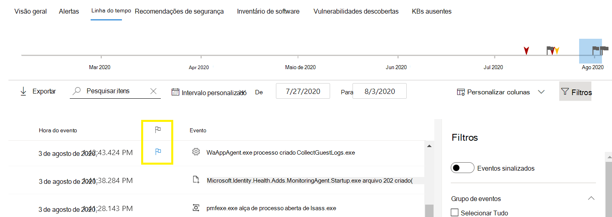
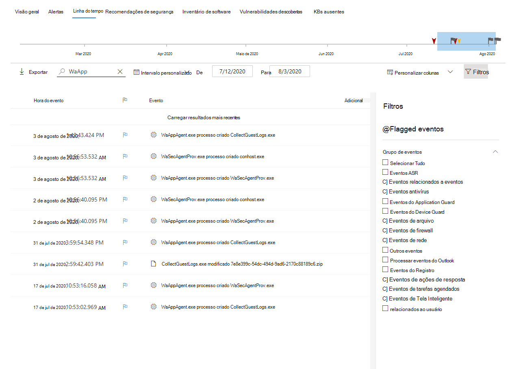

# Sinalizadores de eventos de linha do tempo do dispositivo do Microsoft Defender for EndpointMicrosoft Defender for Endpoint device timeline event flags

[!INCLUDE [Microsoft 365 Defender rebranding](../../includes/microsoft-defender.md)]

**Aplica-se a:****Applies to:**
- [Microsoft Defender para Ponto de ExtremidadeMicrosoft Defender for Endpoint](https://go.microsoft.com/fwlink/p/?linkid=2154037)
- [Microsoft 365 DefenderMicrosoft 365 Defender](https://go.microsoft.com/fwlink/?linkid=2118804)

>Deseja experimentar o Defender para Ponto de Extremidade?Want to experience Defender for Endpoint? [Inscreva-se para uma avaliação gratuita.Sign up for a free trial.](https://www.microsoft.com/microsoft-365/windows/microsoft-defender-atp?ocid=docs-wdatp-assignaccess-abovefoldlink)

Sinalizadores de evento na linha do tempo do dispositivo Defender para Ponto de Extremidade ajudam você a filtrar e organizar eventos específicos quando você está investigando possíveis ataques.Event flags in the Defender for Endpoint device timeline help you filter and organize specific events when you're  investigate potential attacks.

A linha do tempo do dispositivo Defender para Ponto de Extremidade fornece uma exibição cronológica dos eventos e alertas associados observados em um dispositivo.The Defender for Endpoint device timeline provides a chronological view of the events and associated alerts observed on a device. Esta lista de eventos fornece visibilidade total sobre quaisquer eventos, arquivos e endereços IP observados no dispositivo.This list of events provides full visibility into any events, files, and IP addresses observed on the device. Às vezes, a lista pode ser longa.The list can sometimes be lengthy. Os sinalizadores de eventos da linha do tempo do dispositivo ajudam você a rastrear eventos que podem estar relacionados.Device timeline event flags help you track events that could be related. 

Depois de passar por uma linha do tempo do dispositivo, você pode classificar, filtrar e exportar os eventos específicos sinalizados.After you've gone through a device timeline, you can sort, filter, and export the specific events that you flagged.

Ao navegar pela linha do tempo do dispositivo, você pode pesquisar e filtrar eventos específicos.While navigating the device timeline, you can search and filter for specific events. Você pode definir sinalizadores de evento por:You can set event flags by: 

- Realçando os eventos mais importantesHighlighting the most important events 
- Marcando eventos que exigem imersão profundaMarking events that requires deep dive 
- Criando uma linha do tempo de violação limpaBuilding a clean breach timeline

## Sinalizar um eventoFlag an event
1. Encontre o evento que você deseja sinalizarFind the event that you want to flag
2. Clique no ícone de sinalizador na coluna Sinalizador.Click the flag icon in the Flag column. 

## Exibir eventos sinalizadosView flagged events  
1. Na seção **Filtros da Linha do Tempo,** habilita **eventos sinalizados**.In the timeline **Filters** section, enable **Flagged events**.
2. Clique em **Aplicar**.Click **Apply**. Somente eventos sinalizados são exibidos.Only flagged events are displayed.
Você pode aplicar filtros adicionais clicando na barra de tempo.You can apply additional filters by clicking on the time bar. Isso só mostrará eventos antes do evento sinalizado.This will only show events prior to the flagged event.  

