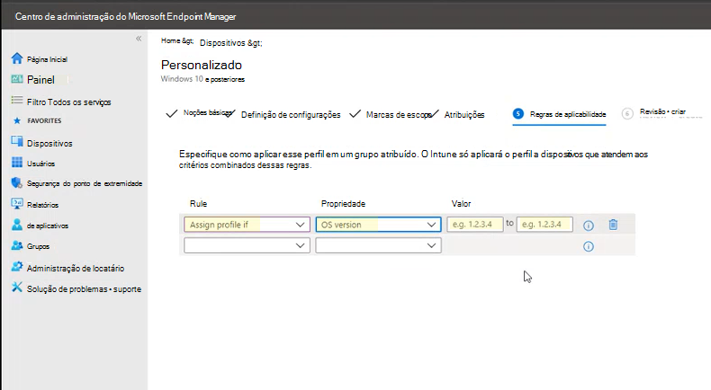

# <a name="enable-attack-surface-reduction-rules"></a>Habilitar regras da redução da superfície de ataque

**Aplica-se a:**

- [Microsoft Defender para Ponto de Extremidade](https://go.microsoft.com/fwlink/p/?linkid=2154037)
- [Microsoft 365 Defender](https://go.microsoft.com/fwlink/?linkid=2118804)

> [!TIP]
> Deseja experimentar o Defender para Ponto de Extremidade? [Inscreva-se para uma avaliação gratuita](https://www.microsoft.com/microsoft-365/windows/microsoft-defender-atp?ocid=docs-wdatp-assignaccess-abovefoldlink).

[As regras de redução de](attack-surface-reduction.md) superfície de ataque (regras ASR) ajudam a evitar ações que o malware geralmente abusa para comprometer dispositivos e redes.

## <a name="requirements"></a>Requisitos

Recursos de redução de superfície de ataque em Windows versões

Você pode definir regras de redução de superfície de ataque para dispositivos que estão executando qualquer uma das seguintes edições e versões de Windows:

- Windows 10 Pro, versão [1709](/windows/whats-new/whats-new-windows-10-version-1709) ou posterior
- Windows 10 Enterprise, versão [1709](/windows/whats-new/whats-new-windows-10-version-1709) ou posterior
- Windows Servidor, [versão 1803 (Canal Semesanuais)](/windows-server/get-started/whats-new-in-windows-server-1803) ou posterior
- [Windows Server 2019](/windows-server/get-started-19/whats-new-19)

Para usar todo o conjunto de recursos de regras de redução de superfície de ataque, você precisa:

- Windows Defender Antivírus como AV principal (proteção em tempo real on)
- [Proteção de Entrega na Nuvem](/windows/security/threat-protection/microsoft-defender-antivirus/enable-cloud-protection-microsoft-defender-antivirus) (algumas regras exigem isso)
- Windows 10 Enterprise Licença E5 ou E3 ou Microsoft 365 Business License

Embora as regras de redução de superfície de ataque não exigem uma licença do [Windows E5](/windows/deployment/deploy-enterprise-licenses), com uma licença do Windows E5, você recebe recursos avançados de gerenciamento, incluindo monitoramento, análise e fluxos de trabalho disponíveis no Defender para Ponto de Extremidade, bem como recursos de relatório e configuração no centro de segurança Microsoft 365. Esses recursos avançados não estão disponíveis com uma licença E3, mas você ainda pode usar o Visualizador de Eventos para revisar eventos de regra de redução de superfície de ataque.

Cada regra ASR contém uma das quatro configurações:

- **Não configurado**: Desabilitar a regra ASR
- **Bloquear**: Habilitar a regra ASR
- **Auditoria**: Avalie como a regra ASR afetaria sua organização se habilitada
- **Avisar**: Habilitar a regra ASR, mas permitir que o usuário final ignore o bloco

> [!IMPORTANT]
> Atualmente, o modo de aviso não é suportado para três regras ASR quando você configura regras ASR em Microsoft Endpoint Manager (MEM). Para saber mais, consulte [Cases where warn mode is not supported](attack-surface-reduction.md#cases-where-warn-mode-is-not-supported).

É altamente recomendável usar regras ASR com uma licença Windows E5 (ou SKU de licenciamento semelhante) para aproveitar os recursos avançados de monitoramento e relatório disponíveis no [Microsoft Defender para Ponto](microsoft-defender-endpoint.md) de Extremidade (Defender para Ponto de Extremidade). No entanto, se você tiver outra licença, como o Windows Professional ou o Windows E3 que não incluem recursos avançados de monitoramento e relatório, você poderá desenvolver suas próprias ferramentas de monitoramento e relatório, além dos eventos gerados em cada ponto de extremidade quando as regras ASR são acionadas (por exemplo, Encaminhamento de Eventos).

> [!TIP]
> Para saber mais sobre Windows licenciamento, consulte [Windows 10 Licenciamento](https://www.microsoft.com/licensing/product-licensing/windows10?activetab=windows10-pivot:primaryr5) e obter o [guia licenciamento por volume para Windows 10](https://download.microsoft.com/download/2/D/1/2D14FE17-66C2-4D4C-AF73-E122930B60F6/Windows-10-Volume-Licensing-Guide.pdf).

Você pode habilitar regras de redução de superfície de ataque usando qualquer um desses métodos:

- [Microsoft Intune](#intune)
- [Gerenciamento de Dispositivo Móvel (MDM)](#mdm)
- [Gerenciador de Configuração do Microsoft Endpoint](#microsoft-endpoint-configuration-manager)
- [Política de grupo](#group-policy)
- [PowerShell](#powershell)

Enterprise gerenciamento de nível, como o Intune ou Microsoft Endpoint Manager é recomendado. Enterprise de nível superior substituirá qualquer política de grupo conflitante ou configurações do PowerShell na inicialização.

## <a name="exclude-files-and-folders-from-asr-rules"></a>Excluir arquivos e pastas de regras ASR

Você pode excluir arquivos e pastas de serem avaliados pela maioria das regras de redução de superfície de ataque. Isso significa que, mesmo que uma regra ASR determine que o arquivo ou pasta contém comportamento mal-intencionado, ele não impedirá a execução do arquivo. Isso pode permitir que arquivos não seguros executem e infectem seus dispositivos.

Você também pode excluir as regras ASR de disparar com base em hashes de certificado e arquivo, permitindo indicadores de certificado e de arquivo do Defender para Ponto de Extremidade especificados. (Consulte [Gerenciar indicadores](manage-indicators.md).)

> [!IMPORTANT]
> A exclusão de arquivos ou pastas pode reduzir gravemente a proteção fornecida pelas regras ASR. Arquivos excluídos terão permissão para serem executados e nenhum relatório ou evento será gravado.
> Se as regras ASR estão detectando arquivos que você acredita que não devem ser detectados, você deve usar o modo de auditoria [primeiro para testar a regra](evaluate-attack-surface-reduction.md).

Você pode especificar arquivos ou pastas individuais (usando caminhos de pasta ou nomes de recursos totalmente qualificados), mas não pode especificar a quais regras as exclusões se aplicam. Uma exclusão é aplicada somente quando o aplicativo ou serviço excluído é iniciado. Por exemplo, se você adicionar uma exclusão para um serviço de atualização que já está em execução, o serviço de atualização continuará disparando eventos até que o serviço seja interrompido e reiniciado.

As regras ASR suportam variáveis de ambiente e caracteres curinga. Para obter informações sobre como usar caracteres curinga, consulte Use curingas no nome do arquivo e no caminho da pasta ou listas de [exclusão de extensão.](configure-extension-file-exclusions-microsoft-defender-antivirus.md#use-wildcards-in-the-file-name-and-folder-path-or-extension-exclusion-lists)

Os procedimentos a seguir para habilenciar regras ASR incluem instruções sobre como excluir arquivos e pastas.

## <a name="intune"></a>Intune

1. Selecione **Perfis de**  >  **configuração do dispositivo**. Escolha um perfil de proteção de ponto de extremidade existente ou crie um novo. Para criar um novo, selecione **Criar perfil e** insira informações para esse perfil. Para **o tipo de** perfil, selecione Proteção de ponto de **extremidade**. Se você tiver escolhido um perfil existente, selecione **Propriedades** e **selecione** Configurações .

2. No painel **proteção de ponto de** extremidade, selecione Windows Defender Exploit **Guard**, em seguida, **selecione Redução de Superfície de Ataque**. Selecione a configuração desejada para cada regra ASR.

3. Em **Exceções de Redução de Superfície de Ataque,** insira arquivos e pastas individuais. Você também pode selecionar **Importar para** importar um arquivo CSV que contém arquivos e pastas a ser excluído das regras ASR. Cada linha no arquivo CSV deve ser formatada da seguinte forma:

   `C:\folder`, `%ProgramFiles%\folder\file`, `C:\path`

4. Selecione **OK** nos três painéis de configuração. Em **seguida, selecione** Criar se você estiver criando um novo arquivo de proteção de ponto de extremidade ou **Salvar** se estiver editando um existente.

## <a name="mem"></a>MEM

Você pode usar Microsoft Endpoint Manager (MEM) OMA-URI para configurar regras ASR personalizadas. O procedimento a seguir usa a regra [Bloquear o abuso de drivers assinados vulneráveis explorados](attack-surface-reduction.md#block-abuse-of-exploited-vulnerable-signed-drivers) para o exemplo.

1. Abra o Microsoft Endpoint Manager de administração (MEM). No menu **Página** Inicial, clique em  **Dispositivos,** selecione **Perfil de configuração** e clique em **Criar perfil**.

   > [!div class="mx-imgBorder"]
   > 

2. Em **Criar um perfil**, nas duas listas listadas a seguir, selecione o seguinte:

   - Em **Plataforma,** selecione **Windows 10 e posterior**
   - Em **Tipo de perfil,** selecione **Modelos**

   Selecione **Personalizado** e clique em **Criar**.

   > [!div class="mx-imgBorder"]
   > 

3. A ferramenta modelo personalizado é aberta para a **etapa 1 Noções Básicas.** Em **1 Noções Básicas**, em **Nome**, digite um nome para seu modelo e, em **Descrição,** você pode digitar uma descrição (opcional).

   > [!div class="mx-imgBorder"]
   > 

4. Clique em **Próximo**. Etapa **2 As configurações são abertas.** Para OMA-URI Configurações, clique em **Adicionar**. Duas opções agora aparecem: **Adicionar** e **Exportar**.

   > [!div class="mx-imgBorder"]
   > 

5. Clique **em Adicionar** novamente. A **linha Adicionar OMA-URI Configurações** aberta. Em **Adicionar Linha,** faça o seguinte:

   - Em **Nome**, digite um nome para a regra.
   - Em **Descrição**, digite uma breve descrição.
   - Em **OMA-URI**, digite ou colar o link OMA-URI específico para a regra que você está adicionando.
   - Em **Tipo de dados,** selecione **Cadeia de caracteres**.
   - Em **Valor**, digite ou colar o valor GUID, o sinal e o valor estado sem espaços \= (_GUID=StateValue_). Where: {0 : Disable (Disable the ASR rule)}, {1 : Block (Enable the ASR rule)}, {2 : Audit (Evaluate how the ASR rule would impact your organization if enabled)}, {6 : Warn (Enable the ASR rule but allow the end-user to bypass the block)}

   > [!div class="mx-imgBorder"]
   > 

6. Clique em **Salvar**. **Add Row** closes. Em **Personalizado,** clique em **Próximo.** Na etapa **3 Marcas de escopo**, as marcas de escopo são opcionais. Siga um destes procedimentos:

   - Clique **em Selecionar Marcas de Escopo,** selecione a marca de escopo (opcional) e clique em **Próximo**.
   - Ou clique em **Next**

7. Na etapa **4 Atribuições**, em **Grupos Incluídos** - para os grupos que você deseja que essa regra se aplique - selecione entre as seguintes opções:

   - **Adicionar grupos**
   - **Adicionar todos os usuários**
   - **Adicionar todos os dispositivos**

   > [!div class="mx-imgBorder"]
   > 

8. Em **Grupos excluídos,** selecione todos os grupos que você deseja excluir dessa regra e clique em **Próximo**.

9. Na etapa **5 Regras de Aplicabilidade** para as seguintes configurações, faça o seguinte:

   - Em **Regra**, selecione **Atribuir perfil se** ou Não atribuir perfil **se**
   - Em **Propriedade**, selecione a propriedade à qual você deseja que essa regra seja aplicada
   - Em **Valor**, insira o valor aplicável ou intervalo de valores

   > [!div class="mx-imgBorder"]
   > 

10. Clique em **Próximo**. Na etapa **6 Revisar + criar**, revisar as configurações e informações que você selecionou e ins inserido e clique em **Criar**.

    > [!div class="mx-imgBorder"]
    > 

    > [!NOTE]
    > As regras estão ativas e ao vivo em minutos.

>[!NOTE]
> Tratamento de conflitos:
>
> Se você atribuir a um dispositivo duas políticas ASR diferentes, a maneira como o conflito é tratado são regras que são atribuídas a estados diferentes, não há gerenciamento de conflitos no local e o resultado é um erro.
>
> Regras não conflitantes não resultarão em um erro, e a regra será aplicada corretamente. O resultado é que a primeira regra é aplicada e as regras subsequentes não conflitantes são mescladas à política.

## <a name="mdm"></a>MDM

Use o provedor de serviços de configuração [./Vendor/MSFT/Policy/Config/Defender/AttackSurfaceReductionRules](/windows/client-management/mdm/policy-csp-defender#defender-attacksurfacereductionrules) para habilitar e definir individualmente o modo para cada regra.

A seguir, um exemplo de referência, usando [valores GUID para regras ASR](attack-surface-reduction.md#attack-surface-reduction-rules).

`OMA-URI path: ./Vendor/MSFT/Policy/Config/Defender/AttackSurfaceReductionRules`

`Value: 75668C1F-73B5-4CF0-BB93-3ECF5CB7CC84=2|3B576869-A4EC-4529-8536-B80A7769E899=1|D4F940AB-401B-4EfC-AADC-AD5F3C50688A=2|D3E037E1-3EB8-44C8-A917-57927947596D=1|5BEB7EFE-FD9A-4556-801D-275E5FFC04CC=0|BE9BA2D9-53EA-4CDC-84E5-9B1EEEE46550=1`

Os valores para habilitar (Bloquear), desabilitar, avisar ou habilitar no modo de auditoria são:

- 0 : Desabilitar (Desabilitar a regra ASR)
- 1 : Bloquear (Habilitar a regra ASR)
- 2 : Auditoria (Avalie como a regra ASR afetaria sua organização se habilitada)
- 6 : Avisar (Habilitar a regra ASR, mas permitir que o usuário final ignore o bloco). O modo de aviso agora está disponível para a maioria das regras ASR.

Use o provedor de serviços de configuração [./Vendor/MSFT/Policy/Config/Defender/AttackSurfaceReductionOnlyExclusions](/windows/client-management/mdm/policy-csp-defender#defender-attacksurfacereductiononlyexclusions) (CSP) para adicionar exclusões.

Exemplo:

`OMA-URI path: ./Vendor/MSFT/Policy/Config/Defender/AttackSurfaceReductionOnlyExclusions`

`Value: c:\path|e:\path|c:\Exclusions.exe`

> [!NOTE]
> Insira valores OMA-URI sem espaços.

## <a name="microsoft-endpoint-configuration-manager"></a>Gerenciador de Configuração do Microsoft Endpoint

1. Em Microsoft Endpoint Configuration Manager, acesse **Assets and Compliance**  >  **Endpoint Protection**  >  **Windows Defender Exploit Guard.**

2. Selecione **Home**  >  **Create Exploit Guard Policy**.

3. Insira um nome e uma descrição, selecione **Redução de Superfície de Ataque** e selecione **Próximo**.

4. Escolha quais regras bloquearão ou auditarão ações e selecione **Next**.

5. Revise as configurações e selecione **Próximo** para criar a política.

6. Depois que a política for criada, **Feche**.

## <a name="group-policy"></a>Política de Grupo

> [!WARNING]
> Se você gerenciar seus computadores e dispositivos com o Intune, o Configuration Manager ou outra plataforma de gerenciamento de nível empresarial, o software de gerenciamento substituirá quaisquer configurações conflitantes da Política de Grupo na inicialização.

1. No computador de gerenciamento de Política de Grupo, abra o [ Console de Gerenciamento de Política de Grupo](https://technet.microsoft.com/library/cc731212.aspx), clique com o botão direito do mouse no Objeto de Política de Grupo que deseja configurar e selecione **Editar**.

2. No **Editor de Gerenciamento de Política de Grupo**, acesse **Configuração do Computador** e selecione **Modelos Administrativos**.

3. Expanda a árvore para **Windows componentes**  >  **Microsoft Defender Antivírus**  >  **Microsoft Defender Exploit Guard**  >  **redução de superfície de ataque.**

4. Selecione **Configurar regras de redução de superfície de ataque** e selecione **Habilitado**. Em seguida, você pode definir o estado individual para cada regra na seção opções.

   Selecione **Mostrar...** e insira a ID da regra na coluna **Nome do** valor e seu estado escolhido na coluna **Valor** da seguinte forma:

   - 0 : Desabilitar (Desabilitar a regra ASR)
   - 1 : Bloquear (Habilitar a regra ASR)
   - 2 : Auditoria (Avalie como a regra ASR afetaria sua organização se habilitada)
   - 6 : Avisar (Habilitar a regra ASR, mas permitir que o usuário final ignore o bloco)

   :::image type="content" source="images/asr-rules-gp.png" alt-text="Regras ASR na Política de Grupo":::

5. Para excluir arquivos e pastas de regras  ASR, selecione a configuração Excluir arquivos e caminhos de regras de redução de superfície de ataque e de definir a opção **como Habilitado**. Selecione **Mostrar** e insira cada arquivo ou pasta na coluna **Nome do** valor. Insira **0** na coluna **Valor** para cada item.

   > [!WARNING]
   > Não use aspas, pois elas não são suportadas para a coluna **Nome do** valor ou para a **coluna Valor.**

## <a name="powershell"></a>PowerShell

> [!WARNING]
> Se você gerenciar seus computadores e dispositivos com o Intune, o Configuration Manager ou outra plataforma de gerenciamento de nível empresarial, o software de gerenciamento substituirá as configurações conflitantes do PowerShell na inicialização. Para permitir que os usuários definam o valor usando o PowerShell, use a opção "Definido pelo Usuário" para a regra na plataforma de gerenciamento.

1. Digite **o powershell** no menu Iniciar, clique com o botão direito **do mouse Windows PowerShell** e selecione Executar como **administrador**.

2. Digite o seguinte cmdlet:

    ```PowerShell
    Set-MpPreference -AttackSurfaceReductionRules_Ids <rule ID> -AttackSurfaceReductionRules_Actions Enabled
    ```

    Para habilitar regras ASR no modo de auditoria, use o seguinte cmdlet:

    ```PowerShell
    Add-MpPreference -AttackSurfaceReductionRules_Ids <rule ID> -AttackSurfaceReductionRules_Actions AuditMode
    ```

    Para habilitar regras ASR no modo de aviso, use o seguinte cmdlet:

    ```PowerShell
    Add-MpPreference -AttackSurfaceReductionRules_Ids <rule ID> -AttackSurfaceReductionRules_Actions Warn
    ```

    Para habilitar o ASR Block abuse of exploited vulnerable signed drivers, use o seguinte cmdlet:

   ```PowerShell
   Add-MpPreference -AttackSurfaceReductionRules_Ids 56a863a9-875e-4185-98a7-b882c64b5ce5 -AttackSurfaceReductionRules_Actions Enabled
   ```

    Para desativar as regras ASR, use o seguinte cmdlet:

    ```PowerShell
    Add-MpPreference -AttackSurfaceReductionRules_Ids <rule ID> -AttackSurfaceReductionRules_Actions Disabled
    ```

    > [!IMPORTANT]
    > Você deve especificar o estado individualmente para cada regra, mas pode combinar regras e estados em uma lista separada por vírgulas.
    >
    > No exemplo a seguir, as duas primeiras regras serão habilitadas, a terceira regra será desabilitada e a quarta regra será habilitada no modo de auditoria:
    >
    > ```PowerShell
    > Set-MpPreference -AttackSurfaceReductionRules_Ids <rule ID 1>,<rule ID 2>,<rule ID 3>,<rule ID 4> -AttackSurfaceReductionRules_Actions Enabled, Enabled, Disabled, AuditMode
    > ```

    Você também pode usar o `Add-MpPreference` verbo PowerShell para adicionar novas regras à lista existente.

    > [!WARNING]
    > `Set-MpPreference` sempre substituirá o conjunto de regras existente. Se você quiser adicionar ao conjunto existente, use `Add-MpPreference` em vez disso.
    > Você pode obter uma lista de regras e seu estado atual usando `Get-MpPreference` .

3. Para excluir arquivos e pastas de regras ASR, use o seguinte cmdlet:

    ```PowerShell
    Add-MpPreference -AttackSurfaceReductionOnlyExclusions "<fully qualified path or resource>"
    ```

    Continue a usar `Add-MpPreference -AttackSurfaceReductionOnlyExclusions` para adicionar mais arquivos e pastas à lista.

    > [!IMPORTANT]
    > Use `Add-MpPreference` para acrescentar ou adicionar aplicativos à lista. O uso `Set-MpPreference` do cmdlet substituirá a lista existente.

## <a name="related-articles"></a>Artigos relacionados

- [Reduzir superfícies de ataque com regras de redução de superfície de ataque](attack-surface-reduction.md)

- [Avaliar a redução de superfície de ataque](evaluate-attack-surface-reduction.md)

- [Perguntas frequentes sobre a redução da superfície de ataque](attack-surface-reduction.md)
