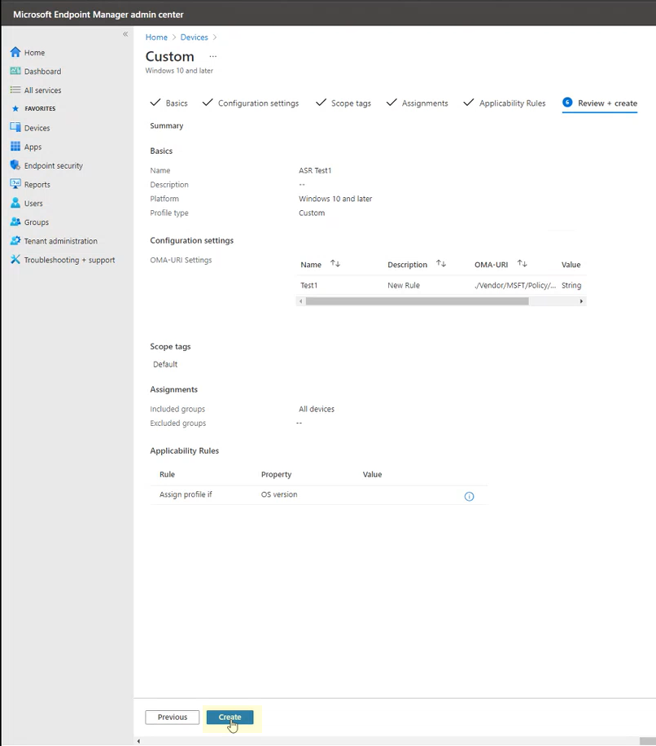

# <a name="enable-attack-surface-reduction-rules"></a><span data-ttu-id="d8975-104">Habilitar regras da redução da superfície de ataque</span><span class="sxs-lookup"><span data-stu-id="d8975-104">Enable attack surface reduction rules</span></span>

<span data-ttu-id="d8975-105">**Aplica-se a:**</span><span class="sxs-lookup"><span data-stu-id="d8975-105">**Applies to:**</span></span>

- [<span data-ttu-id="d8975-106">Microsoft Defender para Ponto de Extremidade</span><span class="sxs-lookup"><span data-stu-id="d8975-106">Microsoft Defender for Endpoint</span></span>](https://go.microsoft.com/fwlink/p/?linkid=2154037)
- [<span data-ttu-id="d8975-107">Microsoft 365 Defender</span><span class="sxs-lookup"><span data-stu-id="d8975-107">Microsoft 365 Defender</span></span>](https://go.microsoft.com/fwlink/?linkid=2118804)

> [!TIP]
> <span data-ttu-id="d8975-108">Deseja experimentar o Defender para Ponto de Extremidade?</span><span class="sxs-lookup"><span data-stu-id="d8975-108">Want to experience Defender for Endpoint?</span></span> <span data-ttu-id="d8975-109">[Inscreva-se para uma avaliação gratuita](https://www.microsoft.com/microsoft-365/windows/microsoft-defender-atp?ocid=docs-wdatp-assignaccess-abovefoldlink).</span><span class="sxs-lookup"><span data-stu-id="d8975-109">[Sign up for a free trial](https://www.microsoft.com/microsoft-365/windows/microsoft-defender-atp?ocid=docs-wdatp-assignaccess-abovefoldlink).</span></span>

<span data-ttu-id="d8975-110">[As regras de redução de](attack-surface-reduction.md) superfície de ataque (regras ASR) ajudam a evitar ações que o malware geralmente abusa para comprometer dispositivos e redes.</span><span class="sxs-lookup"><span data-stu-id="d8975-110">[Attack surface reduction rules](attack-surface-reduction.md) (ASR rules) help prevent actions that malware often abuses to compromise devices and networks.</span></span>

## <a name="requirements"></a><span data-ttu-id="d8975-111">Requisitos</span><span class="sxs-lookup"><span data-stu-id="d8975-111">Requirements</span></span>

<span data-ttu-id="d8975-112">Você pode definir regras de redução de superfície de ataque para dispositivos que estão executando qualquer uma das seguintes edições e versões de Windows:</span><span class="sxs-lookup"><span data-stu-id="d8975-112">You can set attack surface reduction rules for devices that are running any of the following editions and versions of Windows:</span></span>

- <span data-ttu-id="d8975-113">Windows 10 Pro, versão [1709](/windows/whats-new/whats-new-windows-10-version-1709) ou posterior</span><span class="sxs-lookup"><span data-stu-id="d8975-113">Windows 10 Pro, [version 1709](/windows/whats-new/whats-new-windows-10-version-1709) or later</span></span>
- <span data-ttu-id="d8975-114">Windows 10 Enterprise, versão [1709](/windows/whats-new/whats-new-windows-10-version-1709) ou posterior</span><span class="sxs-lookup"><span data-stu-id="d8975-114">Windows 10 Enterprise, [version 1709](/windows/whats-new/whats-new-windows-10-version-1709) or later</span></span>
- <span data-ttu-id="d8975-115">Windows Servidor, [versão 1803 (Canal Semesanuais)](/windows-server/get-started/whats-new-in-windows-server-1803) ou posterior</span><span class="sxs-lookup"><span data-stu-id="d8975-115">Windows Server, [version 1803 (Semi-Annual Channel)](/windows-server/get-started/whats-new-in-windows-server-1803) or later</span></span>
- [<span data-ttu-id="d8975-116">Windows Server 2019</span><span class="sxs-lookup"><span data-stu-id="d8975-116">Windows Server 2019</span></span>](/windows-server/get-started-19/whats-new-19)

<span data-ttu-id="d8975-117">Embora as regras de redução de superfície de ataque não exigem uma licença [Windows E5](/windows/deployment/deploy-enterprise-licenses), se você tiver Windows E5, você obterá recursos avançados de gerenciamento.</span><span class="sxs-lookup"><span data-stu-id="d8975-117">Although attack surface reduction rules don't require a [Windows E5 license](/windows/deployment/deploy-enterprise-licenses), if you have Windows E5, you get advanced management capabilities.</span></span> <span data-ttu-id="d8975-118">Esses recursos disponíveis apenas no Windows E5 incluem monitoramento, análise e fluxos de trabalho disponíveis no [Defender para](/microsoft-365/security/defender-endpoint/microsoft-defender-endpoint?view=o365-worldwide&preserve-view=true)Ponto de Extremidade, bem como recursos de relatório e configuração no centro de segurança [do Microsoft 365](/microsoft-365/security/defender/overview-security-center?view=o365-worldwide&preserve-view=true).</span><span class="sxs-lookup"><span data-stu-id="d8975-118">These capabilities available only in Windows E5 include monitoring, analytics, and workflows available in [Defender for Endpoint](/microsoft-365/security/defender-endpoint/microsoft-defender-endpoint?view=o365-worldwide&preserve-view=true), as well as reporting and configuration capabilities in the [Microsoft 365 security center](/microsoft-365/security/defender/overview-security-center?view=o365-worldwide&preserve-view=true).</span></span> <span data-ttu-id="d8975-119">Esses recursos avançados não estão disponíveis com uma licença Windows Professional ou Windows E3; no entanto, se você tiver essas licenças, poderá usar o Visualizador de Eventos e Microsoft Defender Antivírus logs para revisar seus eventos de regra de redução de superfície de ataque.</span><span class="sxs-lookup"><span data-stu-id="d8975-119">These advanced capabilities aren't available with a Windows Professional or Windows E3 license; however, if you do have those licenses, you can use Event Viewer and Microsoft Defender Antivirus logs to review your attack surface reduction rule events.</span></span>

<span data-ttu-id="d8975-120">Cada regra ASR contém uma das quatro configurações:</span><span class="sxs-lookup"><span data-stu-id="d8975-120">Each ASR rule contains one of four settings:</span></span>

- <span data-ttu-id="d8975-121">**Não configurado**: Desabilitar a regra ASR</span><span class="sxs-lookup"><span data-stu-id="d8975-121">**Not configured**: Disable the ASR rule</span></span>
- <span data-ttu-id="d8975-122">**Bloquear**: Habilitar a regra ASR</span><span class="sxs-lookup"><span data-stu-id="d8975-122">**Block**: Enable the ASR rule</span></span>
- <span data-ttu-id="d8975-123">**Auditoria**: Avalie como a regra ASR afetaria sua organização se habilitada</span><span class="sxs-lookup"><span data-stu-id="d8975-123">**Audit**: Evaluate how the ASR rule would impact your organization if enabled</span></span>
- <span data-ttu-id="d8975-124">**Avisar**: Habilitar a regra ASR, mas permitir que o usuário final ignore o bloco</span><span class="sxs-lookup"><span data-stu-id="d8975-124">**Warn**: Enable the ASR rule but allow the end user to bypass the block</span></span>

> [!IMPORTANT]
> <span data-ttu-id="d8975-125">Atualmente, o modo de aviso não é suportado para três regras ASR quando você configura regras ASR em Microsoft Endpoint Manager (MEM).</span><span class="sxs-lookup"><span data-stu-id="d8975-125">Currently, warn mode is not supported for three ASR rules when you configure ASR rules in Microsoft Endpoint Manager (MEM).</span></span> <span data-ttu-id="d8975-126">Para saber mais, consulte [Cases where warn mode is not supported](attack-surface-reduction.md#cases-where-warn-mode-is-not-supported).</span><span class="sxs-lookup"><span data-stu-id="d8975-126">To learn more, see [Cases where warn mode is not supported](attack-surface-reduction.md#cases-where-warn-mode-is-not-supported).</span></span>

<span data-ttu-id="d8975-127">É altamente recomendável usar regras ASR com uma licença Windows E5 (ou SKU de licenciamento semelhante) para aproveitar os recursos avançados de monitoramento e relatório disponíveis no [Microsoft Defender para Ponto](microsoft-defender-endpoint.md) de Extremidade (Defender para Ponto de Extremidade).</span><span class="sxs-lookup"><span data-stu-id="d8975-127">It's highly recommended to use ASR rules with a Windows E5 license (or similar licensing SKU) to take advantage of the advanced monitoring and reporting capabilities available in [Microsoft Defender for Endpoint](microsoft-defender-endpoint.md) (Defender for Endpoint).</span></span> <span data-ttu-id="d8975-128">No entanto, se você tiver outra licença, como o Windows Professional ou o Windows E3 que não incluem recursos avançados de monitoramento e relatório, você poderá desenvolver suas próprias ferramentas de monitoramento e relatório, além dos eventos gerados em cada ponto de extremidade quando as regras ASR são acionadas (por exemplo, Encaminhamento de Eventos).</span><span class="sxs-lookup"><span data-stu-id="d8975-128">However, if you have another license, such as Windows Professional or Windows E3 that don't include advanced monitoring and reporting capabilities, you can develop your own monitoring and reporting tools on top of the events that are generated at each endpoint when ASR rules are triggered (for example, Event Forwarding).</span></span>

> [!TIP]
> <span data-ttu-id="d8975-129">Para saber mais sobre Windows licenciamento, consulte [Windows 10 Licenciamento](https://www.microsoft.com/licensing/product-licensing/windows10?activetab=windows10-pivot:primaryr5) e obter o [guia licenciamento por volume para Windows 10](https://download.microsoft.com/download/2/D/1/2D14FE17-66C2-4D4C-AF73-E122930B60F6/Windows-10-Volume-Licensing-Guide.pdf).</span><span class="sxs-lookup"><span data-stu-id="d8975-129">To learn more about Windows licensing, see [Windows 10 Licensing](https://www.microsoft.com/licensing/product-licensing/windows10?activetab=windows10-pivot:primaryr5) and get the [Volume Licensing guide for Windows 10](https://download.microsoft.com/download/2/D/1/2D14FE17-66C2-4D4C-AF73-E122930B60F6/Windows-10-Volume-Licensing-Guide.pdf).</span></span>

<span data-ttu-id="d8975-130">Você pode habilitar regras de redução de superfície de ataque usando qualquer um desses métodos:</span><span class="sxs-lookup"><span data-stu-id="d8975-130">You can enable attack surface reduction rules by using any of these methods:</span></span>

- [<span data-ttu-id="d8975-131">Microsoft Intune</span><span class="sxs-lookup"><span data-stu-id="d8975-131">Microsoft Intune</span></span>](#intune)
- [<span data-ttu-id="d8975-132">Gerenciamento de Dispositivo Móvel (MDM)</span><span class="sxs-lookup"><span data-stu-id="d8975-132">Mobile Device Management (MDM)</span></span>](#mdm)
- [<span data-ttu-id="d8975-133">Gerenciador de Configuração do Microsoft Endpoint</span><span class="sxs-lookup"><span data-stu-id="d8975-133">Microsoft Endpoint Configuration Manager</span></span>](#microsoft-endpoint-configuration-manager)
- [<span data-ttu-id="d8975-134">Política de grupo</span><span class="sxs-lookup"><span data-stu-id="d8975-134">Group Policy</span></span>](#group-policy)
- [<span data-ttu-id="d8975-135">PowerShell</span><span class="sxs-lookup"><span data-stu-id="d8975-135">PowerShell</span></span>](#powershell)

<span data-ttu-id="d8975-136">Enterprise gerenciamento de nível, como o Intune ou Microsoft Endpoint Manager é recomendado.</span><span class="sxs-lookup"><span data-stu-id="d8975-136">Enterprise-level management such as Intune or Microsoft Endpoint Manager is recommended.</span></span> <span data-ttu-id="d8975-137">Enterprise de nível superior substituirá qualquer política de grupo conflitante ou configurações do PowerShell na inicialização.</span><span class="sxs-lookup"><span data-stu-id="d8975-137">Enterprise-level management will overwrite any conflicting Group Policy or PowerShell settings on startup.</span></span>

## <a name="exclude-files-and-folders-from-asr-rules"></a><span data-ttu-id="d8975-138">Excluir arquivos e pastas de regras ASR</span><span class="sxs-lookup"><span data-stu-id="d8975-138">Exclude files and folders from ASR rules</span></span>

<span data-ttu-id="d8975-139">Você pode excluir arquivos e pastas de serem avaliados pela maioria das regras de redução de superfície de ataque.</span><span class="sxs-lookup"><span data-stu-id="d8975-139">You can exclude files and folders from being evaluated by most attack surface reduction rules.</span></span> <span data-ttu-id="d8975-140">Isso significa que, mesmo que uma regra ASR determine que o arquivo ou pasta contém comportamento mal-intencionado, ele não impedirá a execução do arquivo.</span><span class="sxs-lookup"><span data-stu-id="d8975-140">This means that even if an ASR rule determines the file or folder contains malicious behavior, it will not block the file from running.</span></span> <span data-ttu-id="d8975-141">Isso pode permitir que arquivos não seguros executem e infectem seus dispositivos.</span><span class="sxs-lookup"><span data-stu-id="d8975-141">This could potentially allow unsafe files to run and infect your devices.</span></span>

<span data-ttu-id="d8975-142">Você também pode excluir as regras ASR de disparar com base em hashes de certificado e arquivo, permitindo indicadores de certificado e de arquivo do Defender para Ponto de Extremidade especificados.</span><span class="sxs-lookup"><span data-stu-id="d8975-142">You can also exclude ASR rules from triggering based on certificate and file hashes by allowing specified Defender for Endpoint file and certificate indicators.</span></span> <span data-ttu-id="d8975-143">(Consulte [Gerenciar indicadores](manage-indicators.md).)</span><span class="sxs-lookup"><span data-stu-id="d8975-143">(See [Manage indicators](manage-indicators.md).)</span></span>

> [!IMPORTANT]
> <span data-ttu-id="d8975-144">A exclusão de arquivos ou pastas pode reduzir gravemente a proteção fornecida pelas regras ASR.</span><span class="sxs-lookup"><span data-stu-id="d8975-144">Excluding files or folders can severely reduce the protection provided by ASR rules.</span></span> <span data-ttu-id="d8975-145">Arquivos excluídos terão permissão para serem executados e nenhum relatório ou evento será gravado.</span><span class="sxs-lookup"><span data-stu-id="d8975-145">Excluded files will be allowed to run, and no report or event will be recorded.</span></span>
> <span data-ttu-id="d8975-146">Se as regras ASR estão detectando arquivos que você acredita que não devem ser detectados, você deve usar o modo de auditoria [primeiro para testar a regra](evaluate-attack-surface-reduction.md).</span><span class="sxs-lookup"><span data-stu-id="d8975-146">If ASR rules are detecting files that you believe shouldn't be detected, you should [use audit mode first to test the rule](evaluate-attack-surface-reduction.md).</span></span>

<span data-ttu-id="d8975-147">Você pode especificar arquivos ou pastas individuais (usando caminhos de pasta ou nomes de recursos totalmente qualificados), mas não pode especificar a quais regras as exclusões se aplicam.</span><span class="sxs-lookup"><span data-stu-id="d8975-147">You can specify individual files or folders (using folder paths or fully qualified resource names), but you can't specify which rules the exclusions apply to.</span></span> <span data-ttu-id="d8975-148">Uma exclusão é aplicada somente quando o aplicativo ou serviço excluído é iniciado.</span><span class="sxs-lookup"><span data-stu-id="d8975-148">An exclusion is applied only when the excluded application or service starts.</span></span> <span data-ttu-id="d8975-149">Por exemplo, se você adicionar uma exclusão para um serviço de atualização que já está em execução, o serviço de atualização continuará disparando eventos até que o serviço seja interrompido e reiniciado.</span><span class="sxs-lookup"><span data-stu-id="d8975-149">For example, if you add an exclusion for an update service that is already running, the update service will continue to trigger events until the service is stopped and restarted.</span></span>

<span data-ttu-id="d8975-150">As regras ASR suportam variáveis de ambiente e caracteres curinga.</span><span class="sxs-lookup"><span data-stu-id="d8975-150">ASR rules support environment variables and wildcards.</span></span> <span data-ttu-id="d8975-151">Para obter informações sobre como usar caracteres curinga, consulte Use curingas no nome do arquivo e no caminho da pasta ou listas de [exclusão de extensão.](configure-extension-file-exclusions-microsoft-defender-antivirus.md#use-wildcards-in-the-file-name-and-folder-path-or-extension-exclusion-lists)</span><span class="sxs-lookup"><span data-stu-id="d8975-151">For information about using wildcards, see [Use wildcards in the file name and folder path or extension exclusion lists](configure-extension-file-exclusions-microsoft-defender-antivirus.md#use-wildcards-in-the-file-name-and-folder-path-or-extension-exclusion-lists).</span></span>

<span data-ttu-id="d8975-152">Os procedimentos a seguir para habilenciar regras ASR incluem instruções sobre como excluir arquivos e pastas.</span><span class="sxs-lookup"><span data-stu-id="d8975-152">The following procedures for enabling ASR rules include instructions for how to exclude files and folders.</span></span>

## <a name="intune"></a><span data-ttu-id="d8975-153">Intune</span><span class="sxs-lookup"><span data-stu-id="d8975-153">Intune</span></span>

1. <span data-ttu-id="d8975-154">Selecione **Perfis de**  >  **configuração do dispositivo**.</span><span class="sxs-lookup"><span data-stu-id="d8975-154">Select **Device configuration** > **Profiles**.</span></span> <span data-ttu-id="d8975-155">Escolha um perfil de proteção de ponto de extremidade existente ou crie um novo.</span><span class="sxs-lookup"><span data-stu-id="d8975-155">Choose an existing endpoint protection profile or create a new one.</span></span> <span data-ttu-id="d8975-156">Para criar um novo, selecione **Criar perfil e** insira informações para esse perfil.</span><span class="sxs-lookup"><span data-stu-id="d8975-156">To create a new one, select **Create profile** and enter information for this profile.</span></span> <span data-ttu-id="d8975-157">Para **o tipo de** perfil, selecione Proteção de ponto de **extremidade**.</span><span class="sxs-lookup"><span data-stu-id="d8975-157">For **Profile type**, select **Endpoint protection**.</span></span> <span data-ttu-id="d8975-158">Se você tiver escolhido um perfil existente, selecione **Propriedades** e **selecione** Configurações .</span><span class="sxs-lookup"><span data-stu-id="d8975-158">If you've chosen an existing profile, select **Properties** and then select **Settings**.</span></span>

2. <span data-ttu-id="d8975-159">No painel **proteção de ponto de** extremidade, selecione Windows Defender Exploit **Guard**, em seguida, **selecione Redução de Superfície de Ataque**.</span><span class="sxs-lookup"><span data-stu-id="d8975-159">In the **Endpoint protection** pane, select **Windows Defender Exploit Guard**, then select **Attack Surface Reduction**.</span></span> <span data-ttu-id="d8975-160">Selecione a configuração desejada para cada regra ASR.</span><span class="sxs-lookup"><span data-stu-id="d8975-160">Select the desired setting for each ASR rule.</span></span>

3. <span data-ttu-id="d8975-161">Em **Exceções de Redução de Superfície de Ataque,** insira arquivos e pastas individuais.</span><span class="sxs-lookup"><span data-stu-id="d8975-161">Under **Attack Surface Reduction exceptions**, enter individual files and folders.</span></span> <span data-ttu-id="d8975-162">Você também pode selecionar **Importar para** importar um arquivo CSV que contém arquivos e pastas a ser excluído das regras ASR.</span><span class="sxs-lookup"><span data-stu-id="d8975-162">You can also select **Import** to import a CSV file that contains files and folders to exclude from ASR rules.</span></span> <span data-ttu-id="d8975-163">Cada linha no arquivo CSV deve ser formatada da seguinte forma:</span><span class="sxs-lookup"><span data-stu-id="d8975-163">Each line in the CSV file should be formatted as follows:</span></span>

   <span data-ttu-id="d8975-164">`C:\folder`, `%ProgramFiles%\folder\file`, `C:\path`</span><span class="sxs-lookup"><span data-stu-id="d8975-164">`C:\folder`, `%ProgramFiles%\folder\file`, `C:\path`</span></span>

4. <span data-ttu-id="d8975-165">Selecione **OK** nos três painéis de configuração.</span><span class="sxs-lookup"><span data-stu-id="d8975-165">Select **OK** on the three configuration panes.</span></span> <span data-ttu-id="d8975-166">Em **seguida, selecione** Criar se você estiver criando um novo arquivo de proteção de ponto de extremidade ou **Salvar** se estiver editando um existente.</span><span class="sxs-lookup"><span data-stu-id="d8975-166">Then select **Create** if you're creating a new endpoint protection file or **Save** if you're editing an existing one.</span></span>

## <a name="mem"></a><span data-ttu-id="d8975-167">MEM</span><span class="sxs-lookup"><span data-stu-id="d8975-167">MEM</span></span>

<span data-ttu-id="d8975-168">Você pode usar Microsoft Endpoint Manager (MEM) OMA-URI para configurar regras ASR personalizadas.</span><span class="sxs-lookup"><span data-stu-id="d8975-168">You can use Microsoft Endpoint Manager (MEM) OMA-URI to configure custom ASR rules.</span></span> <span data-ttu-id="d8975-169">O procedimento a seguir usa a regra [Bloquear o abuso de drivers assinados vulneráveis explorados](attack-surface-reduction.md#block-abuse-of-exploited-vulnerable-signed-drivers) para o exemplo.</span><span class="sxs-lookup"><span data-stu-id="d8975-169">The following procedure uses the rule [Block abuse of exploited vulnerable signed drivers](attack-surface-reduction.md#block-abuse-of-exploited-vulnerable-signed-drivers) for the example.</span></span>

1. <span data-ttu-id="d8975-170">Abra o Microsoft Endpoint Manager de administração (MEM).</span><span class="sxs-lookup"><span data-stu-id="d8975-170">Open the Microsoft Endpoint Manager (MEM) admin center.</span></span> <span data-ttu-id="d8975-171">No menu **Página** Inicial, clique em  **Dispositivos,** selecione **Perfil de configuração** e clique em **Criar perfil**.</span><span class="sxs-lookup"><span data-stu-id="d8975-171">In the **Home** menu, click  **Devices**, select **Configuration profile**, and then click **Create profile**.</span></span>

   > [!div class="mx-imgBorder"]
   > <span data-ttu-id="d8975-172"></span><span class="sxs-lookup"><span data-stu-id="d8975-172"></span></span>

2. <span data-ttu-id="d8975-173">Em **Criar um perfil**, nas duas listas listadas a seguir, selecione o seguinte:</span><span class="sxs-lookup"><span data-stu-id="d8975-173">In **Create a profile**, in the following two drop-down lists, select the following:</span></span>

   - <span data-ttu-id="d8975-174">Em **Plataforma,** selecione **Windows 10 e posterior**</span><span class="sxs-lookup"><span data-stu-id="d8975-174">In **Platform**, select **Windows 10 and later**</span></span>
   - <span data-ttu-id="d8975-175">Em **Tipo de perfil,** selecione **Modelos**</span><span class="sxs-lookup"><span data-stu-id="d8975-175">In **Profile type**, select **Templates**</span></span>

   <span data-ttu-id="d8975-176">Selecione **Personalizado** e clique em **Criar**.</span><span class="sxs-lookup"><span data-stu-id="d8975-176">Select **Custom**, and then click **Create**.</span></span>

   > [!div class="mx-imgBorder"]
   > <span data-ttu-id="d8975-177"></span><span class="sxs-lookup"><span data-stu-id="d8975-177"></span></span>

3. <span data-ttu-id="d8975-178">A ferramenta modelo personalizado é aberta para a **etapa 1 Noções Básicas.**</span><span class="sxs-lookup"><span data-stu-id="d8975-178">The Custom template tool opens to step **1 Basics**.</span></span> <span data-ttu-id="d8975-179">Em **1 Noções Básicas**, em **Nome**, digite um nome para seu modelo e, em **Descrição,** você pode digitar uma descrição (opcional).</span><span class="sxs-lookup"><span data-stu-id="d8975-179">In **1 Basics**, in **Name**, type a name for your template, and in **Description** you can type a description (optional).</span></span>

   > [!div class="mx-imgBorder"]
   > <span data-ttu-id="d8975-180"></span><span class="sxs-lookup"><span data-stu-id="d8975-180"></span></span>

4. <span data-ttu-id="d8975-181">Clique em **Próximo**.</span><span class="sxs-lookup"><span data-stu-id="d8975-181">Click **Next**.</span></span> <span data-ttu-id="d8975-182">Etapa **2 As configurações são abertas.**</span><span class="sxs-lookup"><span data-stu-id="d8975-182">Step **2 Configuration settings** opens.</span></span> <span data-ttu-id="d8975-183">Para OMA-URI Configurações, clique em **Adicionar**.</span><span class="sxs-lookup"><span data-stu-id="d8975-183">For OMA-URI Settings, click **Add**.</span></span> <span data-ttu-id="d8975-184">Duas opções agora aparecem: **Adicionar** e **Exportar**.</span><span class="sxs-lookup"><span data-stu-id="d8975-184">Two options now appear: **Add** and **Export**.</span></span>

   > [!div class="mx-imgBorder"]
   > <span data-ttu-id="d8975-185"></span><span class="sxs-lookup"><span data-stu-id="d8975-185"></span></span>

5. <span data-ttu-id="d8975-186">Clique **em Adicionar** novamente.</span><span class="sxs-lookup"><span data-stu-id="d8975-186">Click **Add** again.</span></span> <span data-ttu-id="d8975-187">A **linha Adicionar OMA-URI Configurações** aberta.</span><span class="sxs-lookup"><span data-stu-id="d8975-187">The **Add Row OMA-URI Settings** opens.</span></span> <span data-ttu-id="d8975-188">Em **Adicionar Linha,** faça o seguinte:</span><span class="sxs-lookup"><span data-stu-id="d8975-188">In **Add Row**, do the following:</span></span>

   - <span data-ttu-id="d8975-189">Em **Nome**, digite um nome para a regra.</span><span class="sxs-lookup"><span data-stu-id="d8975-189">In **Name**, type a name for the rule.</span></span>
   - <span data-ttu-id="d8975-190">Em **Descrição**, digite uma breve descrição.</span><span class="sxs-lookup"><span data-stu-id="d8975-190">In **Description**, type a brief description.</span></span>
   - <span data-ttu-id="d8975-191">Em **OMA-URI**, digite ou colar o link OMA-URI específico para a regra que você está adicionando.</span><span class="sxs-lookup"><span data-stu-id="d8975-191">In **OMA-URI**, type or paste the specific OMA-URI link for the rule that you are adding.</span></span>
   - <span data-ttu-id="d8975-192">Em **Tipo de dados,** selecione **Cadeia de caracteres**.</span><span class="sxs-lookup"><span data-stu-id="d8975-192">In **Data type**, select **String**.</span></span>
   - <span data-ttu-id="d8975-193">Em **Valor**, digite ou colar o valor GUID, o sinal e o valor estado sem espaços \= (_GUID=StateValue_).</span><span class="sxs-lookup"><span data-stu-id="d8975-193">In **Value**, type or paste the GUID value, the \= sign and the State value with no spaces (_GUID=StateValue_).</span></span> <span data-ttu-id="d8975-194">Where: {0 : Disable (Disable the ASR rule)}, {1 : Block (Enable the ASR rule)}, {2 : Audit (Evaluate how the ASR rule would impact your organization if enabled)}, {6 : Warn (Enable the ASR rule but allow the end-user to bypass the block)}</span><span class="sxs-lookup"><span data-stu-id="d8975-194">Where: {0 : Disable (Disable the ASR rule)}, {1 : Block (Enable the ASR rule)}, {2 : Audit (Evaluate how the ASR rule would impact your organization if enabled)}, {6 : Warn (Enable the ASR rule but allow the end-user to bypass the block)}</span></span>

   > [!div class="mx-imgBorder"]
   > <span data-ttu-id="d8975-195"></span><span class="sxs-lookup"><span data-stu-id="d8975-195"></span></span>

6. <span data-ttu-id="d8975-196">Clique em **Salvar**.</span><span class="sxs-lookup"><span data-stu-id="d8975-196">Click **Save**.</span></span> <span data-ttu-id="d8975-197">**Add Row** closes.</span><span class="sxs-lookup"><span data-stu-id="d8975-197">**Add Row** closes.</span></span> <span data-ttu-id="d8975-198">Em **Personalizado,** clique em **Próximo.**</span><span class="sxs-lookup"><span data-stu-id="d8975-198">In **Custom**, click **Next**.</span></span> <span data-ttu-id="d8975-199">Na etapa **3 Marcas de escopo**, as marcas de escopo são opcionais.</span><span class="sxs-lookup"><span data-stu-id="d8975-199">In step **3 Scope tags**, scope tags are optional.</span></span> <span data-ttu-id="d8975-200">Siga um destes procedimentos:</span><span class="sxs-lookup"><span data-stu-id="d8975-200">Do one of the following:</span></span>

   - <span data-ttu-id="d8975-201">Clique **em Selecionar Marcas de Escopo,** selecione a marca de escopo (opcional) e clique em **Próximo**.</span><span class="sxs-lookup"><span data-stu-id="d8975-201">Click **Select Scope tags**, select the scope tag (optional) and then click **Next**.</span></span>
   - <span data-ttu-id="d8975-202">Ou clique em **Next**</span><span class="sxs-lookup"><span data-stu-id="d8975-202">Or click **Next**</span></span>

7. <span data-ttu-id="d8975-203">Na etapa **4 Atribuições**, em **Grupos Incluídos** - para os grupos que você deseja que essa regra se aplique - selecione entre as seguintes opções:</span><span class="sxs-lookup"><span data-stu-id="d8975-203">In step **4 Assignments**, in **Included Groups** - for the groups that you want this rule to apply - select from the following options:</span></span>

   - <span data-ttu-id="d8975-204">**Adicionar grupos**</span><span class="sxs-lookup"><span data-stu-id="d8975-204">**Add groups**</span></span>
   - <span data-ttu-id="d8975-205">**Adicionar todos os usuários**</span><span class="sxs-lookup"><span data-stu-id="d8975-205">**Add all users**</span></span>
   - <span data-ttu-id="d8975-206">**Adicionar todos os dispositivos**</span><span class="sxs-lookup"><span data-stu-id="d8975-206">**Add all devices**</span></span>

   > [!div class="mx-imgBorder"]
   > <span data-ttu-id="d8975-207"></span><span class="sxs-lookup"><span data-stu-id="d8975-207"></span></span>

8. <span data-ttu-id="d8975-208">Em **Grupos excluídos,** selecione todos os grupos que você deseja excluir dessa regra e clique em **Próximo**.</span><span class="sxs-lookup"><span data-stu-id="d8975-208">In **Excluded groups**, select any groups that you want to exclude from this rule, and then click **Next**.</span></span>

9. <span data-ttu-id="d8975-209">Na etapa **5 Regras de Aplicabilidade** para as seguintes configurações, faça o seguinte:</span><span class="sxs-lookup"><span data-stu-id="d8975-209">In step **5 Applicability Rules** for the following settings, do the following:</span></span>

   - <span data-ttu-id="d8975-210">Em **Regra**, selecione **Atribuir perfil se** ou Não atribuir perfil **se**</span><span class="sxs-lookup"><span data-stu-id="d8975-210">In **Rule**, select either **Assign profile if**, or **Don’t assign profile if**</span></span>
   - <span data-ttu-id="d8975-211">Em **Propriedade**, selecione a propriedade à qual você deseja que essa regra seja aplicada</span><span class="sxs-lookup"><span data-stu-id="d8975-211">In **Property**, select the property to which you want this rule to apply</span></span>
   - <span data-ttu-id="d8975-212">Em **Valor**, insira o valor aplicável ou intervalo de valores</span><span class="sxs-lookup"><span data-stu-id="d8975-212">In **Value**, enter the applicable value or value range</span></span>

   > [!div class="mx-imgBorder"]
   > <span data-ttu-id="d8975-213"></span><span class="sxs-lookup"><span data-stu-id="d8975-213"></span></span>

10. <span data-ttu-id="d8975-214">Clique em **Próximo**.</span><span class="sxs-lookup"><span data-stu-id="d8975-214">Click **Next**.</span></span> <span data-ttu-id="d8975-215">Na etapa **6 Revisar + criar**, revisar as configurações e informações que você selecionou e ins inserido e clique em **Criar**.</span><span class="sxs-lookup"><span data-stu-id="d8975-215">In step **6 Review + create**, review the settings and information you have selected and entered, and then click **Create**.</span></span>

    > [!div class="mx-imgBorder"]
    > <span data-ttu-id="d8975-216"></span><span class="sxs-lookup"><span data-stu-id="d8975-216"></span></span>

    > [!NOTE]
    > <span data-ttu-id="d8975-217">As regras estão ativas e ao vivo em minutos.</span><span class="sxs-lookup"><span data-stu-id="d8975-217">Rules are active and live within minutes.</span></span>

>[!NOTE]
> <span data-ttu-id="d8975-218">Tratamento de conflitos:</span><span class="sxs-lookup"><span data-stu-id="d8975-218">Conflict handling:</span></span>
>
> <span data-ttu-id="d8975-219">Se você atribuir a um dispositivo duas políticas ASR diferentes, a maneira como o conflito é tratado são regras que são atribuídas a estados diferentes, não há gerenciamento de conflitos no local e o resultado é um erro.</span><span class="sxs-lookup"><span data-stu-id="d8975-219">If you assign a device two different ASR policies, the way conflict is handled is rules that are assigned different states, there is no conflict management in place, and the result is an error.</span></span>
>
> <span data-ttu-id="d8975-220">Regras não conflitantes não resultarão em um erro, e a regra será aplicada corretamente.</span><span class="sxs-lookup"><span data-stu-id="d8975-220">Non-conflicting rules will not result in an error, and the rule will be applied correctly.</span></span> <span data-ttu-id="d8975-221">O resultado é que a primeira regra é aplicada e as regras subsequentes não conflitantes são mescladas à política.</span><span class="sxs-lookup"><span data-stu-id="d8975-221">The result is that the first rule is applied, and subsequent non-conflicting rules are merged into the policy.</span></span>

## <a name="mdm"></a><span data-ttu-id="d8975-222">MDM</span><span class="sxs-lookup"><span data-stu-id="d8975-222">MDM</span></span>

<span data-ttu-id="d8975-223">Use o provedor de serviços de configuração [./Vendor/MSFT/Policy/Config/Defender/AttackSurfaceReductionRules](/windows/client-management/mdm/policy-csp-defender#defender-attacksurfacereductionrules) para habilitar e definir individualmente o modo para cada regra.</span><span class="sxs-lookup"><span data-stu-id="d8975-223">Use the [./Vendor/MSFT/Policy/Config/Defender/AttackSurfaceReductionRules](/windows/client-management/mdm/policy-csp-defender#defender-attacksurfacereductionrules) configuration service provider (CSP) to individually enable and set the mode for each rule.</span></span>

<span data-ttu-id="d8975-224">A seguir, um exemplo de referência, usando [valores GUID para regras ASR](attack-surface-reduction.md#attack-surface-reduction-rules).</span><span class="sxs-lookup"><span data-stu-id="d8975-224">The following is a sample for reference, using [GUID values for ASR rules](attack-surface-reduction.md#attack-surface-reduction-rules).</span></span>

`OMA-URI path: ./Vendor/MSFT/Policy/Config/Defender/AttackSurfaceReductionRules`

`Value: 75668C1F-73B5-4CF0-BB93-3ECF5CB7CC84=2|3B576869-A4EC-4529-8536-B80A7769E899=1|D4F940AB-401B-4EfC-AADC-AD5F3C50688A=2|D3E037E1-3EB8-44C8-A917-57927947596D=1|5BEB7EFE-FD9A-4556-801D-275E5FFC04CC=0|BE9BA2D9-53EA-4CDC-84E5-9B1EEEE46550=1`

<span data-ttu-id="d8975-225">Os valores para habilitar (Bloquear), desabilitar, avisar ou habilitar no modo de auditoria são:</span><span class="sxs-lookup"><span data-stu-id="d8975-225">The values to enable (Block), disable, warn, or enable in audit mode are:</span></span>

- <span data-ttu-id="d8975-226">0 : Desabilitar (Desabilitar a regra ASR)</span><span class="sxs-lookup"><span data-stu-id="d8975-226">0 : Disable (Disable the ASR rule)</span></span>
- <span data-ttu-id="d8975-227">1 : Bloquear (Habilitar a regra ASR)</span><span class="sxs-lookup"><span data-stu-id="d8975-227">1 : Block (Enable the ASR rule)</span></span>
- <span data-ttu-id="d8975-228">2 : Auditoria (Avalie como a regra ASR afetaria sua organização se habilitada)</span><span class="sxs-lookup"><span data-stu-id="d8975-228">2 : Audit (Evaluate how the ASR rule would impact your organization if enabled)</span></span>
- <span data-ttu-id="d8975-229">6 : Avisar (Habilitar a regra ASR, mas permitir que o usuário final ignore o bloco).</span><span class="sxs-lookup"><span data-stu-id="d8975-229">6 : Warn  (Enable the ASR rule but allow the end-user to bypass the block).</span></span> <span data-ttu-id="d8975-230">O modo de aviso agora está disponível para a maioria das regras ASR.</span><span class="sxs-lookup"><span data-stu-id="d8975-230">Warn mode is now available for most of the ASR rules.</span></span>

<span data-ttu-id="d8975-231">Use o provedor de serviços de configuração [./Vendor/MSFT/Policy/Config/Defender/AttackSurfaceReductionOnlyExclusions](/windows/client-management/mdm/policy-csp-defender#defender-attacksurfacereductiononlyexclusions) (CSP) para adicionar exclusões.</span><span class="sxs-lookup"><span data-stu-id="d8975-231">Use the [./Vendor/MSFT/Policy/Config/Defender/AttackSurfaceReductionOnlyExclusions](/windows/client-management/mdm/policy-csp-defender#defender-attacksurfacereductiononlyexclusions) configuration service provider (CSP) to add exclusions.</span></span>

<span data-ttu-id="d8975-232">Exemplo:</span><span class="sxs-lookup"><span data-stu-id="d8975-232">Example:</span></span>

`OMA-URI path: ./Vendor/MSFT/Policy/Config/Defender/AttackSurfaceReductionOnlyExclusions`

`Value: c:\path|e:\path|c:\Exclusions.exe`

> [!NOTE]
> <span data-ttu-id="d8975-233">Insira valores OMA-URI sem espaços.</span><span class="sxs-lookup"><span data-stu-id="d8975-233">Be sure to enter OMA-URI values without spaces.</span></span>

## <a name="microsoft-endpoint-configuration-manager"></a><span data-ttu-id="d8975-234">Gerenciador de Configuração do Microsoft Endpoint</span><span class="sxs-lookup"><span data-stu-id="d8975-234">Microsoft Endpoint Configuration Manager</span></span>

1. <span data-ttu-id="d8975-235">Em Microsoft Endpoint Configuration Manager, acesse **Assets and Compliance**  >  **Endpoint Protection**  >  **Windows Defender Exploit Guard.**</span><span class="sxs-lookup"><span data-stu-id="d8975-235">In Microsoft Endpoint Configuration Manager, go to **Assets and Compliance** > **Endpoint Protection** > **Windows Defender Exploit Guard**.</span></span>

2. <span data-ttu-id="d8975-236">Selecione **Home**  >  **Create Exploit Guard Policy**.</span><span class="sxs-lookup"><span data-stu-id="d8975-236">Select **Home** > **Create Exploit Guard Policy**.</span></span>

3. <span data-ttu-id="d8975-237">Insira um nome e uma descrição, selecione **Redução de Superfície de Ataque** e selecione **Próximo**.</span><span class="sxs-lookup"><span data-stu-id="d8975-237">Enter a name and a description, select **Attack Surface Reduction**, and select **Next**.</span></span>

4. <span data-ttu-id="d8975-238">Escolha quais regras bloquearão ou auditarão ações e selecione **Next**.</span><span class="sxs-lookup"><span data-stu-id="d8975-238">Choose which rules will block or audit actions and select **Next**.</span></span>

5. <span data-ttu-id="d8975-239">Revise as configurações e selecione **Próximo** para criar a política.</span><span class="sxs-lookup"><span data-stu-id="d8975-239">Review the settings and select **Next** to create the policy.</span></span>

6. <span data-ttu-id="d8975-240">Depois que a política for criada, **Feche**.</span><span class="sxs-lookup"><span data-stu-id="d8975-240">After the policy is created, **Close**.</span></span>

## <a name="group-policy"></a><span data-ttu-id="d8975-241">Política de Grupo</span><span class="sxs-lookup"><span data-stu-id="d8975-241">Group Policy</span></span>

> [!WARNING]
> <span data-ttu-id="d8975-242">Se você gerenciar seus computadores e dispositivos com o Intune, o Configuration Manager ou outra plataforma de gerenciamento de nível empresarial, o software de gerenciamento substituirá quaisquer configurações conflitantes da Política de Grupo na inicialização.</span><span class="sxs-lookup"><span data-stu-id="d8975-242">If you manage your computers and devices with Intune, Configuration Manager, or other enterprise-level management platform, the management software will overwrite any conflicting Group Policy settings on startup.</span></span>

1. <span data-ttu-id="d8975-243">No computador de gerenciamento de Política de Grupo, abra o [ Console de Gerenciamento de Política de Grupo](https://technet.microsoft.com/library/cc731212.aspx), clique com o botão direito do mouse no Objeto de Política de Grupo que deseja configurar e selecione **Editar**.</span><span class="sxs-lookup"><span data-stu-id="d8975-243">On your Group Policy management computer, open the [Group Policy Management Console](https://technet.microsoft.com/library/cc731212.aspx), right-click the Group Policy Object you want to configure and select **Edit**.</span></span>

2. <span data-ttu-id="d8975-244">No **Editor de Gerenciamento de Política de Grupo**, acesse **Configuração do Computador** e selecione **Modelos Administrativos**.</span><span class="sxs-lookup"><span data-stu-id="d8975-244">In the **Group Policy Management Editor**, go to **Computer configuration** and select **Administrative templates**.</span></span>

3. <span data-ttu-id="d8975-245">Expanda a árvore para **Windows componentes**  >  **Microsoft Defender Antivírus**  >  **Microsoft Defender Exploit Guard**  >  **redução de superfície de ataque.**</span><span class="sxs-lookup"><span data-stu-id="d8975-245">Expand the tree to **Windows components** > **Microsoft Defender Antivirus** > **Microsoft Defender Exploit Guard** > **Attack surface reduction**.</span></span>

4. <span data-ttu-id="d8975-246">Selecione **Configurar regras de redução de superfície de ataque** e selecione **Habilitado**.</span><span class="sxs-lookup"><span data-stu-id="d8975-246">Select **Configure Attack surface reduction rules** and select **Enabled**.</span></span> <span data-ttu-id="d8975-247">Em seguida, você pode definir o estado individual para cada regra na seção opções.</span><span class="sxs-lookup"><span data-stu-id="d8975-247">You can then set the individual state for each rule in the options section.</span></span>

   <span data-ttu-id="d8975-248">Selecione **Mostrar...** e insira a ID da regra na coluna **Nome do** valor e seu estado escolhido na coluna **Valor** da seguinte forma:</span><span class="sxs-lookup"><span data-stu-id="d8975-248">Select **Show...** and enter the rule ID in the **Value name** column and your chosen state in the **Value** column as follows:</span></span>

   - <span data-ttu-id="d8975-249">0 : Desabilitar (Desabilitar a regra ASR)</span><span class="sxs-lookup"><span data-stu-id="d8975-249">0 : Disable (Disable the ASR rule)</span></span>
   - <span data-ttu-id="d8975-250">1 : Bloquear (Habilitar a regra ASR)</span><span class="sxs-lookup"><span data-stu-id="d8975-250">1 : Block (Enable the ASR rule)</span></span>
   - <span data-ttu-id="d8975-251">2 : Auditoria (Avalie como a regra ASR afetaria sua organização se habilitada)</span><span class="sxs-lookup"><span data-stu-id="d8975-251">2 : Audit (Evaluate how the ASR rule would impact your organization if enabled)</span></span>
   - <span data-ttu-id="d8975-252">6 : Avisar (Habilitar a regra ASR, mas permitir que o usuário final ignore o bloco)</span><span class="sxs-lookup"><span data-stu-id="d8975-252">6 : Warn  (Enable the ASR rule but allow the end-user to bypass the block)</span></span>

   :::image type="content" source="images/asr-rules-gp.png" alt-text="Regras ASR na Política de Grupo":::

5. <span data-ttu-id="d8975-254">Para excluir arquivos e pastas de regras  ASR, selecione a configuração Excluir arquivos e caminhos de regras de redução de superfície de ataque e de definir a opção **como Habilitado**.</span><span class="sxs-lookup"><span data-stu-id="d8975-254">To exclude files and folders from ASR rules, select the **Exclude files and paths from Attack surface reduction rules** setting and set the option to **Enabled**.</span></span> <span data-ttu-id="d8975-255">Selecione **Mostrar** e insira cada arquivo ou pasta na coluna **Nome do** valor.</span><span class="sxs-lookup"><span data-stu-id="d8975-255">Select **Show** and enter each file or folder in the **Value name** column.</span></span> <span data-ttu-id="d8975-256">Insira **0** na coluna **Valor** para cada item.</span><span class="sxs-lookup"><span data-stu-id="d8975-256">Enter **0** in the **Value** column for each item.</span></span>

   > [!WARNING]
   > <span data-ttu-id="d8975-257">Não use aspas, pois elas não são suportadas para a coluna **Nome do** valor ou para a **coluna Valor.**</span><span class="sxs-lookup"><span data-stu-id="d8975-257">Do not use quotes as they are not supported for either the **Value name** column or the **Value** column.</span></span>

## <a name="powershell"></a><span data-ttu-id="d8975-258">PowerShell</span><span class="sxs-lookup"><span data-stu-id="d8975-258">PowerShell</span></span>

> [!WARNING]
> <span data-ttu-id="d8975-259">Se você gerenciar seus computadores e dispositivos com o Intune, o Configuration Manager ou outra plataforma de gerenciamento de nível empresarial, o software de gerenciamento substituirá as configurações conflitantes do PowerShell na inicialização.</span><span class="sxs-lookup"><span data-stu-id="d8975-259">If you manage your computers and devices with Intune, Configuration Manager, or another enterprise-level management platform, the management software will overwrite any conflicting PowerShell settings on startup.</span></span> <span data-ttu-id="d8975-260">Para permitir que os usuários definam o valor usando o PowerShell, use a opção "Definido pelo Usuário" para a regra na plataforma de gerenciamento.</span><span class="sxs-lookup"><span data-stu-id="d8975-260">To allow users to define the value using PowerShell, use the "User Defined" option for the rule in the management platform.</span></span>

1. <span data-ttu-id="d8975-261">Digite **o powershell** no menu Iniciar, clique com o botão direito **do mouse Windows PowerShell** e selecione Executar como **administrador**.</span><span class="sxs-lookup"><span data-stu-id="d8975-261">Type **powershell** in the Start menu, right-click **Windows PowerShell** and select **Run as administrator**.</span></span>

2. <span data-ttu-id="d8975-262">Digite o seguinte cmdlet:</span><span class="sxs-lookup"><span data-stu-id="d8975-262">Type the following cmdlet:</span></span>

    ```PowerShell
    Set-MpPreference -AttackSurfaceReductionRules_Ids <rule ID> -AttackSurfaceReductionRules_Actions Enabled
    ```

    <span data-ttu-id="d8975-263">Para habilitar regras ASR no modo de auditoria, use o seguinte cmdlet:</span><span class="sxs-lookup"><span data-stu-id="d8975-263">To enable ASR rules in audit mode, use the following cmdlet:</span></span>

    ```PowerShell
    Add-MpPreference -AttackSurfaceReductionRules_Ids <rule ID> -AttackSurfaceReductionRules_Actions AuditMode
    ```

    <span data-ttu-id="d8975-264">Para habilitar regras ASR no modo de aviso, use o seguinte cmdlet:</span><span class="sxs-lookup"><span data-stu-id="d8975-264">To enable ASR rules in warn mode, use the following cmdlet:</span></span>

    ```PowerShell
    Add-MpPreference -AttackSurfaceReductionRules_Ids <rule ID> -AttackSurfaceReductionRules_Actions Warn
    ```

    <span data-ttu-id="d8975-265">Para habilitar o ASR Block abuse of exploited vulnerable signed drivers, use o seguinte cmdlet:</span><span class="sxs-lookup"><span data-stu-id="d8975-265">To enable ASR Block abuse of exploited vulnerable signed drivers, use the following cmdlet:</span></span>

   ```PowerShell
   Add-MpPreference -AttackSurfaceReductionRules_Ids 56a863a9-875e-4185-98a7-b882c64b5ce5 -AttackSurfaceReductionRules_Actions Enabled
   ```

    <span data-ttu-id="d8975-266">Para desativar as regras ASR, use o seguinte cmdlet:</span><span class="sxs-lookup"><span data-stu-id="d8975-266">To turn off ASR rules, use the following cmdlet:</span></span>

    ```PowerShell
    Add-MpPreference -AttackSurfaceReductionRules_Ids <rule ID> -AttackSurfaceReductionRules_Actions Disabled
    ```

    > [!IMPORTANT]
    > <span data-ttu-id="d8975-267">Você deve especificar o estado individualmente para cada regra, mas pode combinar regras e estados em uma lista separada por vírgulas.</span><span class="sxs-lookup"><span data-stu-id="d8975-267">You must specify the state individually for each rule, but you can combine rules and states in a comma-separated list.</span></span>
    >
    > <span data-ttu-id="d8975-268">No exemplo a seguir, as duas primeiras regras serão habilitadas, a terceira regra será desabilitada e a quarta regra será habilitada no modo de auditoria:</span><span class="sxs-lookup"><span data-stu-id="d8975-268">In the following example, the first two rules will be enabled, the third rule will be disabled, and the fourth rule will be enabled in audit mode:</span></span>
    >
    > ```PowerShell
    > Set-MpPreference -AttackSurfaceReductionRules_Ids <rule ID 1>,<rule ID 2>,<rule ID 3>,<rule ID 4> -AttackSurfaceReductionRules_Actions Enabled, Enabled, Disabled, AuditMode
    > ```

    <span data-ttu-id="d8975-269">Você também pode usar o `Add-MpPreference` verbo PowerShell para adicionar novas regras à lista existente.</span><span class="sxs-lookup"><span data-stu-id="d8975-269">You can also use the `Add-MpPreference` PowerShell verb to add new rules to the existing list.</span></span>

    > [!WARNING]
    > <span data-ttu-id="d8975-270">`Set-MpPreference` sempre substituirá o conjunto de regras existente.</span><span class="sxs-lookup"><span data-stu-id="d8975-270">`Set-MpPreference` will always overwrite the existing set of rules.</span></span> <span data-ttu-id="d8975-271">Se você quiser adicionar ao conjunto existente, use `Add-MpPreference` em vez disso.</span><span class="sxs-lookup"><span data-stu-id="d8975-271">If you want to add to the existing set, use `Add-MpPreference` instead.</span></span>
    > <span data-ttu-id="d8975-272">Você pode obter uma lista de regras e seu estado atual usando `Get-MpPreference` .</span><span class="sxs-lookup"><span data-stu-id="d8975-272">You can obtain a list of rules and their current state by using `Get-MpPreference`.</span></span>

3. <span data-ttu-id="d8975-273">Para excluir arquivos e pastas de regras ASR, use o seguinte cmdlet:</span><span class="sxs-lookup"><span data-stu-id="d8975-273">To exclude files and folders from ASR rules, use the following cmdlet:</span></span>

    ```PowerShell
    Add-MpPreference -AttackSurfaceReductionOnlyExclusions "<fully qualified path or resource>"
    ```

    <span data-ttu-id="d8975-274">Continue a usar `Add-MpPreference -AttackSurfaceReductionOnlyExclusions` para adicionar mais arquivos e pastas à lista.</span><span class="sxs-lookup"><span data-stu-id="d8975-274">Continue to use `Add-MpPreference -AttackSurfaceReductionOnlyExclusions` to add more files and folders to the list.</span></span>

    > [!IMPORTANT]
    > <span data-ttu-id="d8975-275">Use `Add-MpPreference` para acrescentar ou adicionar aplicativos à lista.</span><span class="sxs-lookup"><span data-stu-id="d8975-275">Use `Add-MpPreference` to append or add apps to the list.</span></span> <span data-ttu-id="d8975-276">O uso `Set-MpPreference` do cmdlet substituirá a lista existente.</span><span class="sxs-lookup"><span data-stu-id="d8975-276">Using the `Set-MpPreference` cmdlet will overwrite the existing list.</span></span>

## <a name="related-articles"></a><span data-ttu-id="d8975-277">Artigos relacionados</span><span class="sxs-lookup"><span data-stu-id="d8975-277">Related articles</span></span>

- [<span data-ttu-id="d8975-278">Reduzir superfícies de ataque com regras de redução de superfície de ataque</span><span class="sxs-lookup"><span data-stu-id="d8975-278">Reduce attack surfaces with attack surface reduction rules</span></span>](attack-surface-reduction.md)

- [<span data-ttu-id="d8975-279">Avaliar a redução de superfície de ataque</span><span class="sxs-lookup"><span data-stu-id="d8975-279">Evaluate attack surface reduction</span></span>](evaluate-attack-surface-reduction.md)

- [<span data-ttu-id="d8975-280">Perguntas frequentes sobre a redução da superfície de ataque</span><span class="sxs-lookup"><span data-stu-id="d8975-280">Attack surface reduction FAQ</span></span>](attack-surface-reduction.md)
