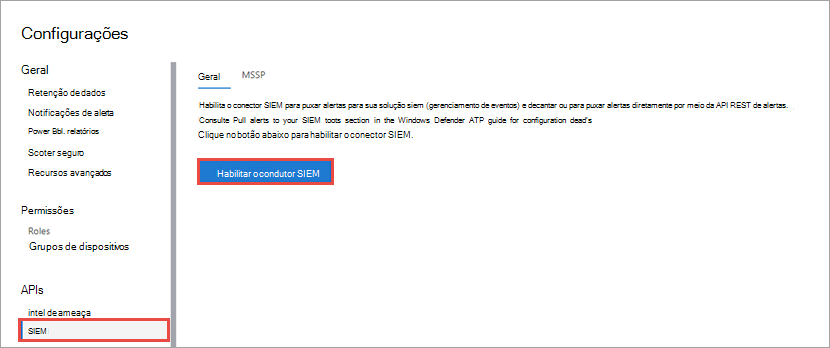
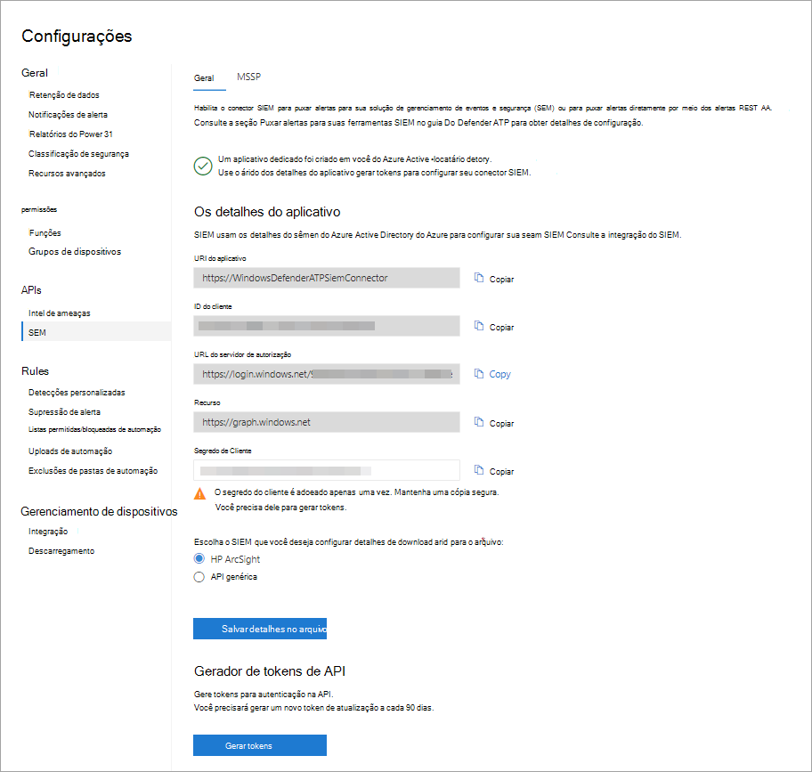

# Habilitar a integração do SIEM no Microsoft Defender para Endpoint

[!INCLUDE [Microsoft 365 Defender rebranding](../../includes/microsoft-defender.md)]

**Aplica-se a:**
- [Microsoft Defender para Ponto de Extremidade](https://go.microsoft.com/fwlink/?linkid=2154037)

>Deseja experimentar o Microsoft Defender para Ponto de Extremidade? [Inscreva-se para uma avaliação gratuita.](https://www.microsoft.com/microsoft-365/windows/microsoft-defender-atp?ocid=docs-wdatp-enablesiem-abovefoldlink) 

Habilita a integração do SIEM (gerenciamento de eventos e informações de segurança) para que você possa obter detecções de Central de Segurança do Microsoft Defender. Puxe detecções usando sua solução SIEM ou conectando-se diretamente à API REST de detecções.

>[!NOTE]
>- [O Alerta do Microsoft Defender para Ponto](alerts.md) de Extremidade é composto por uma ou mais detecções.
>- [O Microsoft Defender para Detecção de Ponto](api-portal-mapping.md) de Extremidade é composto do evento suspeito ocorrido no Dispositivo e seus detalhes de Alerta relacionados.
>- A API de Alerta do Microsoft Defender para Ponto de Extremidade é a API mais recente para consumo de alerta e contém uma lista detalhada de evidências relacionadas para cada alerta. Para obter mais informações, consulte [Métodos de alerta e propriedades](alerts.md) e [Alertas de lista.](get-alerts.md)

## Pré-requisitos

- O usuário que ativa a configuração deve ter permissões para criar um aplicativo no Azure Active Directory (AAD). Esta é alguém com as seguintes funções: 

  - Administrador de Segurança e Administrador Global
  - Administrador de Aplicativos de Nuvem
  - Administrador de Aplicativos
  - Proprietário da entidade de serviço

- Durante a ativação inicial, uma tela pop-up é exibida para que as credenciais sejam inseridas. Certifique-se de permitir pop-ups para este site.

## Habilitando a integração siem 
1. No painel de navegação, selecione **Configurações**  >  **SIEM**.

    

    >[!TIP]
    >Se você encontrar um erro ao tentar habilitar o aplicativo de conector SIEM, verifique as configurações do bloqueador pop-up do navegador. Ele pode estar bloqueando a nova janela que está sendo aberta quando você habilita o recurso. 

2. Selecione **Habilitar integração siem**. Isso ativa a seção detalhes de acesso do conector **SIEM** com valores pré-preenchidos e um aplicativo é criado sob seu locatário Azure Active Directory (Azure AD).

    > [!WARNING]
    >O segredo do cliente é exibido apenas uma vez. Certifique-se de manter uma cópia dela em um local seguro. 
     

    

3. Escolha o tipo SIEM que você usa em sua organização.

   > [!NOTE]
   > Se você selecionar o HP ArcSight, precisará salvar esses dois arquivos de configuração: 
   > - WDATP-connector.jsonparser.properties
   > - WDATP-connector.properties  

   Se você quiser se conectar diretamente à API REST de detecções por meio de acesso programático, escolha **API Genérica**.

4. Copie os valores individuais ou selecione **Salvar detalhes no arquivo** para baixar um arquivo que contém todos os valores.

5. Selecione **Gerar tokens** para obter um token de acesso e atualização.
  
   > [!NOTE]
   > Você precisará gerar um novo token refresh a cada 90 dias. 

6. Siga as instruções para criar um registro de aplicativo [do Azure AD](/microsoft-365/security/defender-endpoint/exposed-apis-create-app-webapp) para o Microsoft Defender para Ponto de Extremidade e atribua as permissões corretas a ele para ler alertas.

Agora você pode prosseguir com a configuração da solução SIEM ou a conexão com a API REST de detecções por meio do acesso programático. Você precisará usar os tokens ao configurar sua solução SIEM para permitir que ele receba detecções de Central de Segurança do Microsoft Defender.

## Integrar o Microsoft Defender para Ponto de Extremidade com IBM QRadar 
Você pode configurar o IBM QRadar para coletar detecções do Microsoft Defender para o Ponto de Extremidade. Para obter mais informações, consulte [IBM Knowledge Center](https://www.ibm.com/support/knowledgecenter/SS42VS_DSM/c_dsm_guide_MS_Win_Defender_ATP_overview.html?cp=SS42VS_7.3.1).

## Confira também
- [Configurar o HP ArcSight para puxar o Microsoft Defender para detecções de ponto de extremidade](configure-arcsight.md)
- [Campos de Detecção de Ponto de Extremidade do Microsoft Defender](api-portal-mapping.md)
- [Puxar o Microsoft Defender para detecções de ponto de extremidade usando a API REST](pull-alerts-using-rest-api.md)
- [Solucionar problemas de integração da ferramenta SIEM](troubleshoot-siem.md)
