# Laboratório de avaliação do Microsoft Defender para Ponto de Extremidade

[!INCLUDE [Microsoft 365 Defender rebranding](../../includes/microsoft-defender.md)]

**Aplica-se a:**
- [Microsoft Defender para Ponto de Extremidade](https://go.microsoft.com/fwlink/?linkid=2154037)
- [Microsoft 365 Defender](https://go.microsoft.com/fwlink/?linkid=2118804)

>Deseja experimentar o Microsoft Defender para Ponto de Extremidade? [Inscreva-se para uma avaliação gratuita.](https://www.microsoft.com/microsoft-365/windows/microsoft-defender-atp?ocid=docs-wdatp-enablesiem-abovefoldlink)

A realização de uma avaliação abrangente do produto de segurança pode ser um processo complexo que exige ambiente e configuração de dispositivos complicados antes que uma simulação de ataque de ponta a ponta possa realmente ser feita. Adicionar à complexidade é o desafio de controlar onde as atividades de simulação, alertas e resultados são refletidas durante a avaliação.

O laboratório de avaliação do Microsoft Defender for Endpoint foi projetado para eliminar as complexidades da configuração de dispositivo e ambiente para que você possa se concentrar na avaliação dos recursos da plataforma, na execução de simulações e na visão dos recursos de prevenção, detecção e correção em ação.

> [!VIDEO https://www.microsoft.com/en-us/videoplayer/embed/RE4qLUM]

Com a experiência de configuração simplificada, você pode se concentrar na execução de seus próprios cenários de teste e nas simulações pré-feitas para ver como o Defender for Endpoint é executado. 

Você terá acesso total aos recursos avançados da plataforma, como investigações automatizadas, busca avançada e análise de ameaças, permitindo que você teste a pilha de proteção abrangente que o Defender para Ponto de Extremidade oferece. 

Você pode adicionar dispositivos Windows 10 ou Windows Server 2019 que vêm pré-configurados para ter as versões mais recentes do sistema operacional e os componentes de segurança corretos instalados, bem como o Office 2019 Standard instalado.

Você também pode instalar simuladores de ameaças. O Defender for Endpoint fez parceria com plataformas de simulação de ameaças líderes do setor para ajudá-lo a testar os recursos do Defender para o Ponto de Extremidade sem precisar sair do portal.

 Instale seu simulador preferencial, execute cenários no laboratório de avaliação e veja instantaneamente como a plataforma é realizada - tudo convenientemente disponível sem custo adicional para você. Você também terá acesso conveniente a uma ampla matriz de simulações que você pode acessar e executar a partir do catálogo de simulações.
    

## Antes de começar
Você precisará atender aos requisitos de [licenciamento](minimum-requirements.md#licensing-requirements) ou ter acesso de avaliação ao Microsoft Defender para Endpoint para acessar o laboratório de avaliação.

Você deve ter **permissões Gerenciar configurações de** segurança para:
- Criar o laboratório
- Criar dispositivos
- Redefinir senha
- Criar simulações 
 
Se você habilitar o controle de acesso baseado em função (RBAC) e tiver criado pelo menos um grupo de máquinas, os usuários devem ter acesso a Todos os grupos de máquinas.

Para obter mais informações, consulte [Create and manage roles](user-roles.md).

Deseja experimentar o Microsoft Defender para Ponto de Extremidade? [Inscreva-se para uma avaliação gratuita.](https://www.microsoft.com/microsoft-365/windows/microsoft-defender-atp?ocid=docs-wdatp-main-abovefoldlink)

## Começar com o laboratório
Você pode acessar o laboratório no menu. No menu de navegação, selecione **Avaliação e tutoriais > Laboratório de Avaliação.**

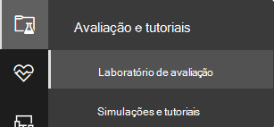

>[!NOTE]
>- Cada ambiente é provisionado com um conjunto limitado de dispositivos de teste.
>- Dependendo do tipo de estrutura de ambiente selecionada, os dispositivos estarão disponíveis para o número especificado de horas a partir do dia da ativação.
>- Quando você usou os dispositivos provisionados, nenhum novo dispositivo é fornecido. Um dispositivo excluído não atualize a contagem de dispositivos de teste disponível.
>- Considerando os recursos limitados, é recomendável usar os dispositivos cuidadosamente.

Já tem um laboratório? Certifique-se de habilitar os novos simuladores de ameaças e ter dispositivos ativos.

## Configurar o laboratório de avaliação

1. No painel de navegação, selecione **Avaliação e tutoriais** Laboratório de  >  Avaliação, em seguida, selecione **Laboratório de Instalação**.

    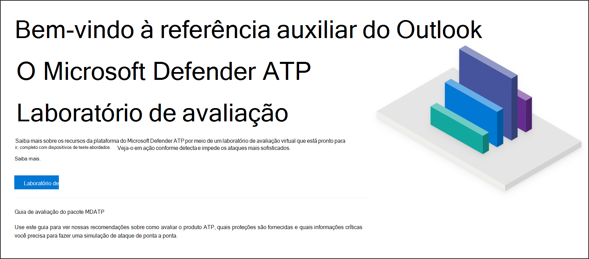

2. Dependendo das suas necessidades de avaliação, você pode optar por configurar um ambiente com menos dispositivos por um período maior ou mais dispositivos por um período mais curto. Selecione sua configuração de laboratório preferencial e selecione **Next**.

    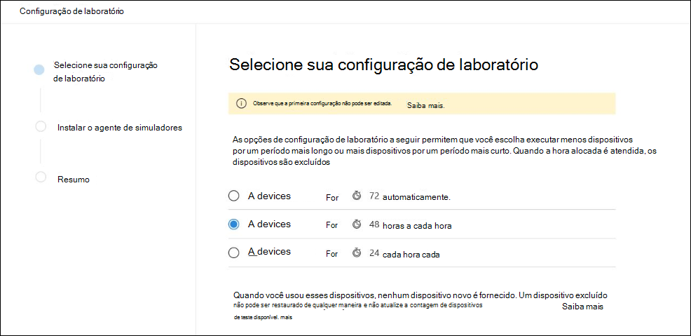 

3. (Opcional) Você pode optar por instalar simuladores de ameaças no laboratório. 

    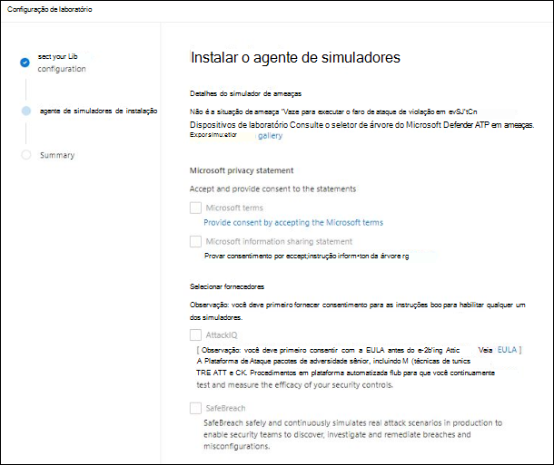

    >[!IMPORTANT]
    >Primeiro, você precisará aceitar e fornecer consentimento para os termos e instruções de compartilhamento de informações. 

4. Selecione o agente de simulação de ameaça que você gostaria de usar e insira seus detalhes. Você também pode optar por instalar simuladores de ameaças posteriormente. Se você optar por instalar agentes de simulação de ameaças durante a instalação do laboratório, aproveitará o benefício de instalá-los convenientemente nos dispositivos que você adicionar.  
    
    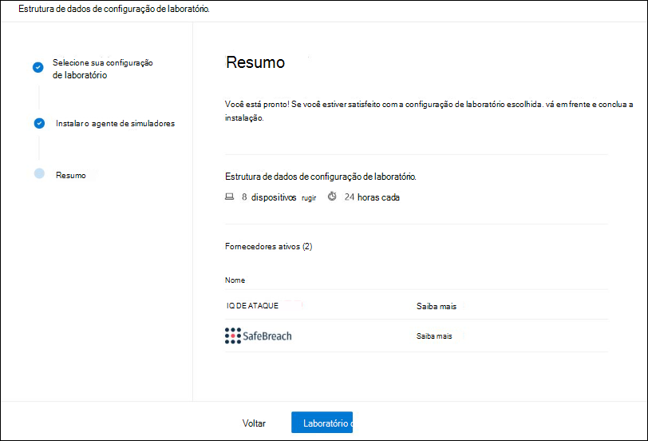

5.  Revise o resumo e selecione **Laboratório de Instalação.**  

Depois que o processo de instalação do laboratório for concluído, você poderá adicionar dispositivos e executar simulações. 

## Adicionar dispositivos
Quando você adiciona um dispositivo ao seu ambiente, o Defender for Endpoint configura um dispositivo bem configurado com detalhes de conexão. Você pode adicionar dispositivos Windows 10 ou Windows Server 2019.

O dispositivo será configurado com a versão mais atualizada do sistema operacional e do Office 2019 Standard, bem como outros aplicativos, como Java, Python e SysIntenals. 

   >[!TIP]
   > Precisa de mais dispositivos em seu laboratório? Envie um tíquete de suporte para que sua solicitação seja revisada pela equipe do Defender for Endpoint. 

Se você optar por adicionar um simulador de ameaças durante a configuração do laboratório, todos os dispositivos terão o agente simulador de ameaças instalado nos dispositivos que você adicionar.

O dispositivo será automaticamente integrado ao seu locatário com os componentes de segurança do Windows recomendados ativados e no modo de auditoria - sem esforço do seu lado. 

Os seguintes componentes de segurança são pré-configurados nos dispositivos de teste:

- [Redução da superfície do ataque.](https://docs.microsoft.com/windows/security/threat-protection/windows-defender-exploit-guard/attack-surface-reduction-exploit-guard)
- [Bloquear à primeira vista](https://docs.microsoft.com/windows/security/threat-protection/microsoft-defender-antivirus/configure-block-at-first-sight-microsoft-defender-antivirus)
- [Acesso controlado a pastas](https://docs.microsoft.com/windows/security/threat-protection/windows-defender-exploit-guard/controlled-folders-exploit-guard)
- [Proteção de exploração](https://docs.microsoft.com/windows/security/threat-protection/windows-defender-exploit-guard/enable-exploit-protection)
- [Proteção de rede](https://docs.microsoft.com/windows/security/threat-protection/windows-defender-exploit-guard/network-protection-exploit-guard)
- [Detecção de aplicativo potencialmente indesejado](https://docs.microsoft.com/windows/security/threat-protection/microsoft-defender-antivirus/detect-block-potentially-unwanted-apps-microsoft-defender-antivirus)
- [Proteção entregue na nuvem](https://docs.microsoft.com/windows/security/threat-protection/microsoft-defender-antivirus/utilize-microsoft-cloud-protection-microsoft-defender-antivirus)
- [Microsoft Defender SmartScreen](https://docs.microsoft.com/windows/security/threat-protection/windows-defender-smartscreen/windows-defender-smartscreen-overview)

>[!NOTE]
> O Microsoft Defender Antivírus estará em (não no modo de auditoria). Se o Microsoft Defender Antivírus o impede de executar sua simulação, você pode desativar a proteção em tempo real no dispositivo por meio do Windows Security. Para obter mais informações, consulte [Configure always-on protection](https://docs.microsoft.com/windows/security/threat-protection/microsoft-defender-antivirus/configure-real-time-protection-microsoft-defender-antivirus).

As configurações de investigação automatizadas dependerão das configurações do locatário. Ele será configurado para ser semi-automatizado por padrão. Para obter mais informações, consulte [Overview of Automated investigations](automated-investigations.md).

>[!NOTE]
>A conexão com os dispositivos de teste é feita usando RDP. Certifique-se de que suas configurações de firewall permitem conexões RDP.

1. No painel, selecione **Adicionar dispositivo**. 

2. Escolha o tipo de dispositivo a ser acrescentado. Você pode optar por adicionar o Windows 10 ou o Windows Server 2019.

    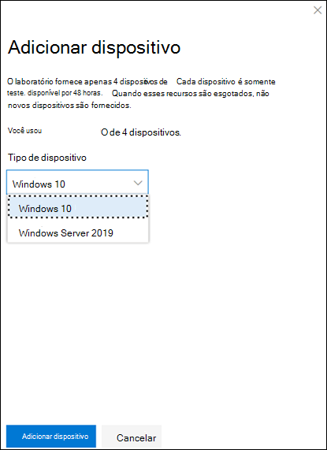

    >[!NOTE]
    >Se algo der errado com o processo de criação do dispositivo, você será notificado e precisará enviar uma nova solicitação. Se a criação do dispositivo falhar, ela não será contada em relação à cota permitida geral. 

3. Os detalhes da conexão são exibidos. Selecione **Copiar** para salvar a senha do dispositivo.

    >[!NOTE]
    >A senha só é exibida uma vez. Certifique-se de salvá-lo para uso posterior.

    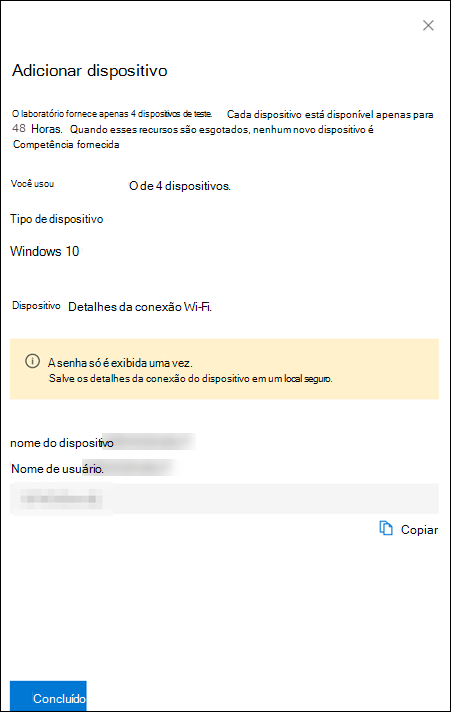

4. A configuração do dispositivo começa. Isso pode levar até aproximadamente 30 minutos. 

5. Consulte o status dos dispositivos de teste, os níveis de risco e exposição e o status das instalações do simulador selecionando a guia **Dispositivos.** 

    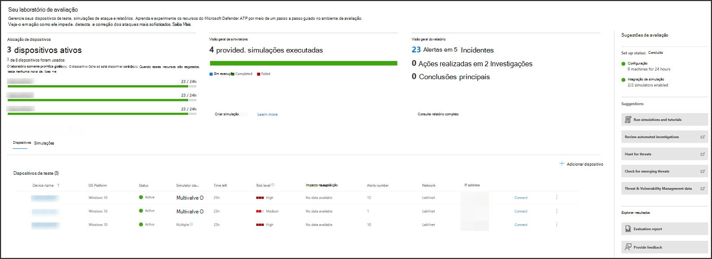
    

    >[!TIP]
    >Na coluna **status do Simulador,** você pode passar o mouse sobre o ícone de informações para saber o status de instalação de um agente.

## Simular cenários de ataque
Use os dispositivos de teste para executar suas próprias simulações de ataque conectando-se a eles. 

Você pode simular cenários de ataque usando:
- Os cenários de ataque ["Faça você mesmo"](https://securitycenter.windows.com/tutorials)
- Simuladores de ameaças

Você também pode usar [a busca avançada](advanced-hunting-query-language.md) para consultar dados e análise de [ameaças](threat-analytics.md) para exibir relatórios sobre ameaças emergentes.

### Cenários de ataque do faça você mesmo
Se você estiver procurando uma simulação pré-feita, poderá usar nossos cenários de ataque ["Faça você mesmo".](https://securitycenter.windows.com/tutorials) Esses scripts são seguros, documentados e fáceis de usar. Esses cenários refletirão os recursos do Defender para o Ponto de Extremidade e o passarão pela experiência de investigação.

>[!NOTE]
>A conexão com os dispositivos de teste é feita usando RDP. Certifique-se de que suas configurações de firewall permitem conexões RDP.

1. Conecte-se ao dispositivo e execute uma simulação de ataque selecionando **Conectar**. 

    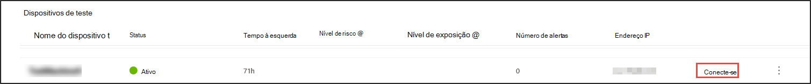

2. Salve o arquivo RDP e o iniciar selecionando **Conectar**.

    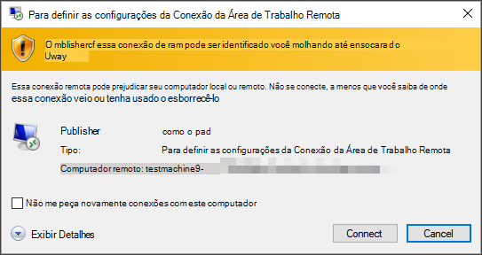

    >[!NOTE]
    >Se você não tiver uma cópia da senha salva durante a configuração inicial, poderá redefinir a senha selecionando **Redefinir** senha no menu: Imagem da redefinição de  
    > O dispositivo alterará seu estado para "Executando redefinição de senha", em seguida, você será apresentado com sua nova senha em alguns minutos.

3. Insira a senha exibida durante a etapa de criação do dispositivo. 

   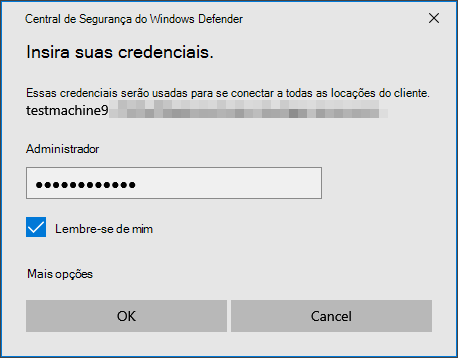

4. Execute simulações de ataque Do-it-yourself no dispositivo. 

### Cenários de simulador de ameaças
Se você optar por instalar qualquer um dos simuladores de ameaça com suporte durante a configuração do laboratório, poderá executar as simulações internas nos dispositivos de laboratório de avaliação. 

Executar simulações de ameaças usando plataformas de terceiros é uma boa maneira de avaliar os recursos do Microsoft Defender para o Ponto de Extremidade dentro dos limites de um ambiente de laboratório.

>[!NOTE]
>Antes de executar simulações, certifique-se de que os seguintes requisitos sejam atendidos:
>- Os dispositivos devem ser adicionados ao laboratório de avaliação
>- Simuladores de ameaças devem ser instalados no laboratório de avaliação

1. No portal, selecione **Criar simulação**.

2. Selecione um simulador de ameaças.

    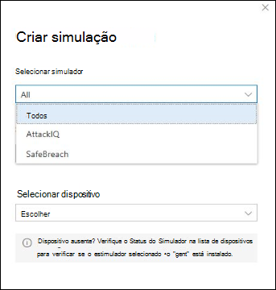

3. Escolha uma simulação ou procure na galeria de simulação para navegar pelas simulações disponíveis. 

    Você pode chegar à galeria de simulação de:
    - O painel de avaliação principal no painel **de visão geral de** Simulações ou
    - Navegando no painel de navegação Avaliação e **tutoriais** De  >  **simulação & tutoriais,** selecione **Catálogo de Simulações**.

4. Selecione os dispositivos em que você gostaria de executar a simulação.

5. Selecione **Criar simulação**.

6. Exibir o progresso de uma simulação selecionando a guia **Simulações.** Exibir o estado de simulação, alertas ativos e outros detalhes. 

    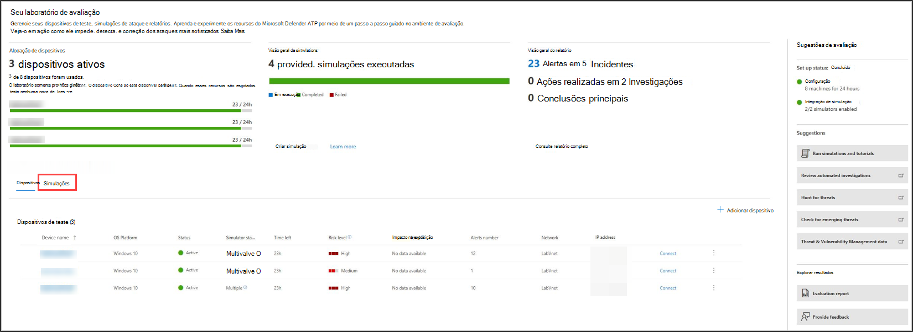
    
Depois de executar suas simulações, recomendamos que você ande pela barra de progresso do laboratório e explore o Microsoft Defender para Ponto de Extremidade acionou uma investigação **e correção automatizadas.** Confira as evidências coletadas e analisadas pelo recurso.

Procure evidências de ataque por meio da busca avançada usando a linguagem de consulta avançada e a telemetria bruta e confira algumas ameaças em todo o mundo documentadas na análise de ameaças.

## Galeria de simulação
O Microsoft Defender for Endpoint fez parceria com várias plataformas de simulação de ameaças para lhe dar acesso conveniente para testar os recursos da plataforma desde o portal. 

Exibir todas as simulações disponíveis indo para **Simulações** e tutoriais Catálogo de Simulações  >   no menu. 

Uma lista de agentes de simulação de ameaças de terceiros com suporte está listada, e tipos específicos de simulações, juntamente com descrições detalhadas, são fornecidos no catálogo. 

Você pode executar convenientemente qualquer simulação disponível a partir do catálogo.  

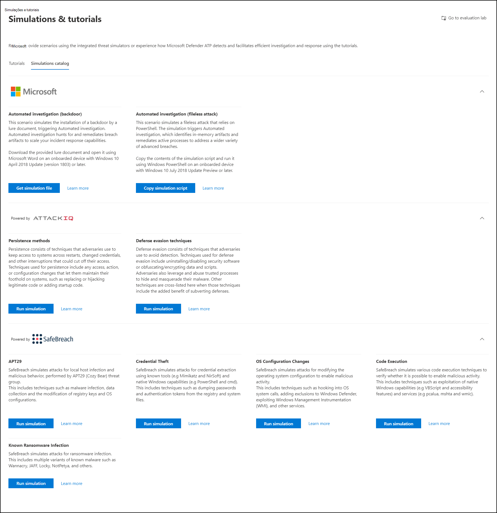

Cada simulação vem com uma descrição detalhada do cenário de ataque e referências, como as técnicas de ataque MITRE usadas e exemplo de consultas de busca avançadas que você executar.

**Exemplos:** 
 

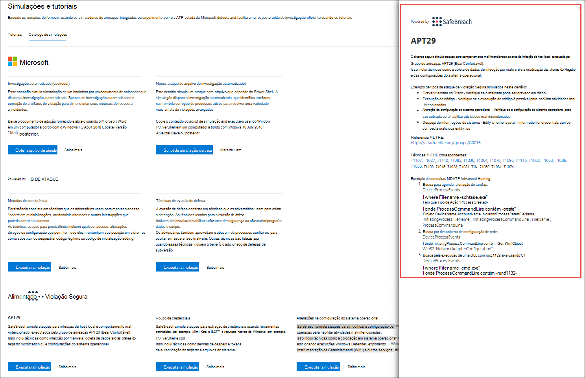

## Relatório de avaliação
Os relatórios de laboratório resumem os resultados das simulações realizadas nos dispositivos.

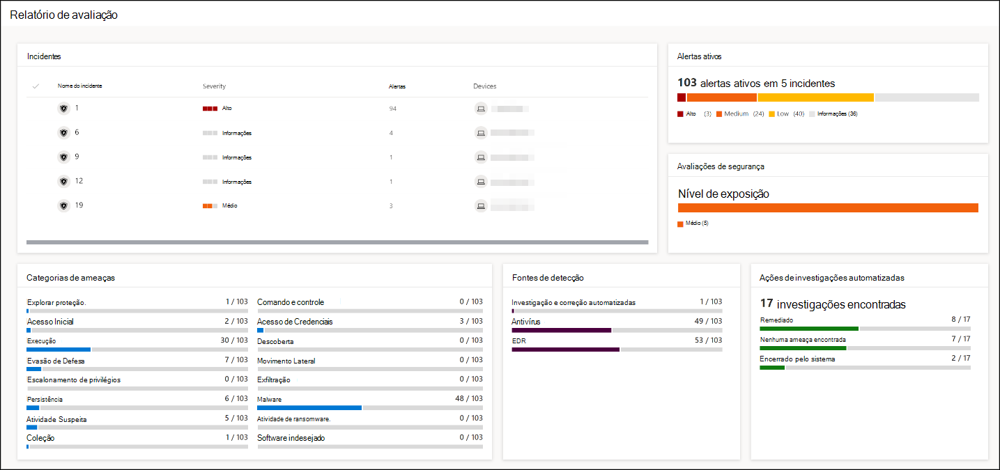

Rapidamente, você poderá ver:
- Incidentes que foram disparados
- Alertas gerados
- Avaliações no nível de exposição 
- Categorias de ameaças observadas
- Fontes de detecção
- Investigações automatizadas

## Faça comentários
Seus comentários nos ajudam a melhorar a proteção do ambiente contra ataques avançados. Compartilhe sua experiência e impressões de recursos do produto e resultados de avaliação.

Deixe-nos saber o que você acha, selecionando **Fornecer comentários**.

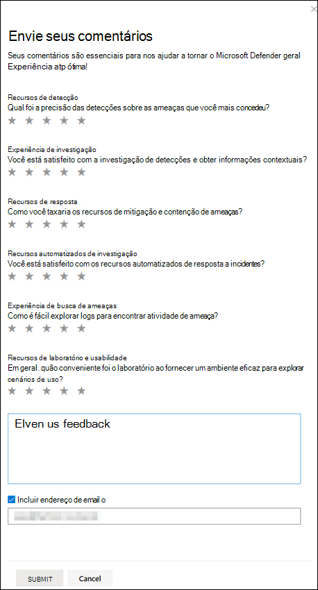
