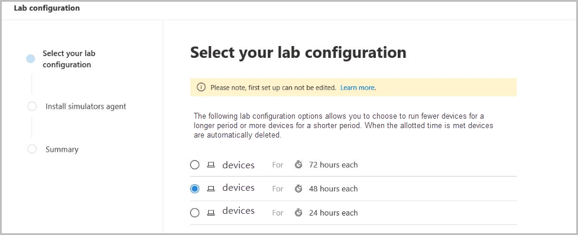

# Laboratório de avaliação do Microsoft Defender para Ponto de ExtremidadeMicrosoft Defender for Endpoint evaluation lab

[!INCLUDE [Microsoft 365 Defender rebranding](../../includes/microsoft-defender.md)]

**Aplica-se a:****Applies to:**
- [Microsoft Defender para Ponto de ExtremidadeMicrosoft Defender for Endpoint](https://go.microsoft.com/fwlink/?linkid=2154037)
- [Microsoft 365 DefenderMicrosoft 365 Defender](https://go.microsoft.com/fwlink/?linkid=2118804)

>Deseja experimentar o Microsoft Defender para Ponto de Extremidade?Want to experience Microsoft Defender for Endpoint? [Inscreva-se para uma avaliação gratuita.Sign up for a free trial.](https://www.microsoft.com/microsoft-365/windows/microsoft-defender-atp?ocid=docs-wdatp-enablesiem-abovefoldlink)

A realização de uma avaliação abrangente do produto de segurança pode ser um processo complexo que exige ambiente e configuração de dispositivos complicados antes que uma simulação de ataque de ponta a ponta possa realmente ser feita.Conducting a comprehensive security product evaluation can be a complex process requiring cumbersome environment and device configuration before an end-to-end attack simulation can actually be done. Adicionar à complexidade é o desafio de controlar onde as atividades de simulação, alertas e resultados são refletidas durante a avaliação.Adding to the complexity is the challenge of tracking where the simulation activities, alerts, and results are reflected during the evaluation.

O laboratório de avaliação do Microsoft Defender for Endpoint foi projetado para eliminar as complexidades da configuração de dispositivo e ambiente para que você possa se concentrar na avaliação dos recursos da plataforma, na execução de simulações e na visão dos recursos de prevenção, detecção e correção em ação.The Microsoft Defender for Endpoint evaluation lab is designed to eliminate the complexities of device and environment configuration so that you can  focus on evaluating the capabilities of the platform, running simulations, and seeing the prevention, detection, and remediation features in action.

> [!VIDEO https://www.microsoft.com/en-us/videoplayer/embed/RE4qLUM]

Com a experiência de configuração simplificada, você pode se concentrar na execução de seus próprios cenários de teste e nas simulações pré-feitas para ver como o Defender for Endpoint é executado.With the simplified set-up experience, you can focus on running your own test scenarios and the pre-made simulations to see how Defender for Endpoint performs. 

Você terá acesso total aos recursos avançados da plataforma, como investigações automatizadas, busca avançada e análise de ameaças, permitindo que você teste a pilha de proteção abrangente que o Defender para Ponto de Extremidade oferece.You'll have full access to the powerful capabilities of the platform such as automated investigations, advanced hunting, and threat analytics, allowing you to test the comprehensive protection stack that Defender for Endpoint offers. 

Você pode adicionar dispositivos Windows 10 ou Windows Server 2019 que vêm pré-configurados para ter as versões mais recentes do sistema operacional e os componentes de segurança corretos instalados, bem como o Office 2019 Standard instalado.You can add Windows 10 or Windows Server 2019 devices that come pre-configured to have the latest OS versions and the right security components in place as well as Office 2019 Standard installed.

Você também pode instalar simuladores de ameaças.You can also install threat simulators. O Defender for Endpoint fez parceria com plataformas de simulação de ameaças líderes do setor para ajudá-lo a testar os recursos do Defender para o Ponto de Extremidade sem precisar sair do portal.Defender for Endpoint has partnered with industry leading threat simulation platforms to help you test out the Defender for Endpoint capabilities without having to leave the portal.

 Instale seu simulador preferencial, execute cenários no laboratório de avaliação e veja instantaneamente como a plataforma é realizada - tudo convenientemente disponível sem custo adicional para você.Install your preferred simulator, run scenarios within the evaluation lab, and instantly see how the platform performs - all conveniently available at no extra cost to you. Você também terá acesso conveniente a uma ampla matriz de simulações que você pode acessar e executar a partir do catálogo de simulações.You'll also have convenient access to wide array of simulations which you can access and run from the simulations catalog.
    

## Antes de começarBefore you begin
Você precisará atender aos requisitos de [licenciamento](minimum-requirements.md#licensing-requirements) ou ter acesso de avaliação ao Microsoft Defender para Endpoint para acessar o laboratório de avaliação.You'll need to fulfill the [licensing requirements](minimum-requirements.md#licensing-requirements) or have trial access to Microsoft Defender for Endpoint to access the evaluation lab.

Você deve ter **permissões Gerenciar configurações de** segurança para:You must have **Manage security settings** permissions to:
- Criar o laboratórioCreate the lab
- Criar dispositivosCreate devices
- Redefinir senhaReset password
- Criar simulaçõesCreate simulations 
 
Se você habilitar o controle de acesso baseado em função (RBAC) e tiver criado pelo menos um grupo de máquinas, os usuários devem ter acesso a Todos os grupos de máquinas.If you enabled role-based access control (RBAC) and created at least a one machine group, users must have access to All machine groups.

Para obter mais informações, consulte [Create and manage roles](user-roles.md).For more information, see [Create and manage roles](user-roles.md).

Deseja experimentar o Microsoft Defender para Ponto de Extremidade?Want to experience Microsoft Defender for Endpoint? [Inscreva-se para uma avaliação gratuita.Sign up for a free trial.](https://www.microsoft.com/microsoft-365/windows/microsoft-defender-atp?ocid=docs-wdatp-main-abovefoldlink)

## Começar com o laboratórioGet started with the lab
Você pode acessar o laboratório no menu.You can access the lab from the menu. No menu de navegação, selecione **Avaliação e tutoriais > Laboratório de Avaliação.**In the navigation menu, select **Evaluation and tutorials > Evaluation lab**.

>[!NOTE]
>- Cada ambiente é provisionado com um conjunto limitado de dispositivos de teste.Each environment is provisioned with a limited set of test devices.
>- Dependendo do tipo de estrutura de ambiente selecionada, os dispositivos estarão disponíveis para o número especificado de horas a partir do dia da ativação.Depending the type of environment structure you select, devices will be available for the specified number of hours from the day of activation.
>- Quando você usou os dispositivos provisionados, nenhum novo dispositivo é fornecido.When you've used up the provisioned devices, no new devices are provided. Um dispositivo excluído não atualize a contagem de dispositivos de teste disponível.A deleted device does not refresh the available test device count.
>- Considerando os recursos limitados, é recomendável usar os dispositivos cuidadosamente.Given the limited resources, it’s advisable to use the devices carefully.

Já tem um laboratório?Already have a lab? Certifique-se de habilitar os novos simuladores de ameaças e ter dispositivos ativos.Make sure to enable the new threat simulators and have active devices.

## Configurar o laboratório de avaliaçãoSetup the evaluation lab

1. No painel de navegação, selecione **Avaliação e tutoriais** Laboratório de  >  Avaliação, em seguida, selecione **Laboratório de Instalação**.In the navigation pane, select **Evaluation and tutorials** > **Evaluation lab**, then select **Setup lab**.

    

2. Dependendo das suas necessidades de avaliação, você pode optar por configurar um ambiente com menos dispositivos por um período maior ou mais dispositivos por um período mais curto.Depending on your evaluation needs, you can choose to setup an environment with fewer devices for a longer period or more devices for a shorter period. Selecione sua configuração de laboratório preferencial e selecione **Next**.Select your preferred lab configuration then select **Next**.

     

3. (Opcional) Você pode optar por instalar simuladores de ameaças no laboratório.(Optional) You can choose to install threat simulators in the lab. 

    

    >[!IMPORTANT]
    >Primeiro, você precisará aceitar e fornecer consentimento para os termos e instruções de compartilhamento de informações.You'll first need to accept and provide consent to the terms and information sharing statements. 

4. Selecione o agente de simulação de ameaça que você gostaria de usar e insira seus detalhes.Select the threat simulation agent you'd like to use and enter your details. Você também pode optar por instalar simuladores de ameaças posteriormente.You can also choose to install threat simulators at a later time. Se você optar por instalar agentes de simulação de ameaças durante a instalação do laboratório, aproveitará o benefício de instalá-los convenientemente nos dispositivos que você adicionar.If you choose to install threat simulation agents during the lab setup, you'll enjoy the benefit of having them conveniently installed on the devices you add.  
    
    

5.  Revise o resumo e selecione **Laboratório de Instalação.**Review the summary and select **Setup lab**.  

Depois que o processo de instalação do laboratório for concluído, você poderá adicionar dispositivos e executar simulações.After the lab setup process is complete, you can add devices and run simulations. 

## Adicionar dispositivosAdd devices
Quando você adiciona um dispositivo ao seu ambiente, o Defender for Endpoint configura um dispositivo bem configurado com detalhes de conexão.When you add a device to your environment, Defender for Endpoint sets up a well-configured device with connection details. Você pode adicionar dispositivos Windows 10 ou Windows Server 2019.You can add Windows 10 or Windows Server 2019 devices.

O dispositivo será configurado com a versão mais atualizada do sistema operacional e do Office 2019 Standard, bem como outros aplicativos, como Java, Python e SysIntenals.The device will be configured with the most up-to-date version of the OS and Office 2019 Standard as well as other apps such as Java, Python, and SysIntenals. 

   >[!TIP]
   > Precisa de mais dispositivos em seu laboratório?Need more devices in your lab? Envie um tíquete de suporte para que sua solicitação seja revisada pela equipe do Defender for Endpoint.Submit a support ticket to have your request reviewed by the Defender for Endpoint team. 

Se você optar por adicionar um simulador de ameaças durante a configuração do laboratório, todos os dispositivos terão o agente simulador de ameaças instalado nos dispositivos que você adicionar.If you chose to add a threat simulator during the lab setup, all devices will have the threat simulator agent installed in the devices that you add.

O dispositivo será automaticamente integrado ao seu locatário com os componentes de segurança do Windows recomendados ativados e no modo de auditoria - sem esforço do seu lado.The device will automatically be onboarded to your tenant with the recommended Windows security components turned on and in audit mode - with no effort on your side. 

Os seguintes componentes de segurança são pré-configurados nos dispositivos de teste:The following security components are pre-configured in the test devices:

- [Redução da superfície do ataque.Attack surface reduction](https://docs.microsoft.com/windows/security/threat-protection/windows-defender-exploit-guard/attack-surface-reduction-exploit-guard)
- [Bloquear à primeira vistaBlock at first sight](https://docs.microsoft.com/windows/security/threat-protection/microsoft-defender-antivirus/configure-block-at-first-sight-microsoft-defender-antivirus)
- [Acesso controlado a pastasControlled folder access](https://docs.microsoft.com/windows/security/threat-protection/windows-defender-exploit-guard/controlled-folders-exploit-guard)
- [Proteção de exploraçãoExploit protection](https://docs.microsoft.com/windows/security/threat-protection/windows-defender-exploit-guard/enable-exploit-protection)
- [Proteção de redeNetwork protection](https://docs.microsoft.com/windows/security/threat-protection/windows-defender-exploit-guard/network-protection-exploit-guard)
- [Detecção de aplicativo potencialmente indesejadoPotentially unwanted application detection](https://docs.microsoft.com/windows/security/threat-protection/microsoft-defender-antivirus/detect-block-potentially-unwanted-apps-microsoft-defender-antivirus)
- [Proteção entregue na nuvemCloud-delivered protection](https://docs.microsoft.com/windows/security/threat-protection/microsoft-defender-antivirus/utilize-microsoft-cloud-protection-microsoft-defender-antivirus)
- [Microsoft Defender SmartScreenMicrosoft Defender SmartScreen](https://docs.microsoft.com/windows/security/threat-protection/windows-defender-smartscreen/windows-defender-smartscreen-overview)

>[!NOTE]
> O Microsoft Defender Antivírus estará em (não no modo de auditoria).Microsoft Defender Antivirus will be on (not in audit mode). Se o Microsoft Defender Antivírus o impede de executar sua simulação, você pode desativar a proteção em tempo real no dispositivo por meio do Windows Security.If Microsoft Defender Antivirus blocks you from running your simulation, you can turn off real-time protection on the device through Windows Security. Para obter mais informações, consulte [Configure always-on protection](https://docs.microsoft.com/windows/security/threat-protection/microsoft-defender-antivirus/configure-real-time-protection-microsoft-defender-antivirus).For more information, see [Configure always-on protection](https://docs.microsoft.com/windows/security/threat-protection/microsoft-defender-antivirus/configure-real-time-protection-microsoft-defender-antivirus).

As configurações de investigação automatizadas dependerão das configurações do locatário.Automated investigation settings will be dependent on tenant settings. Ele será configurado para ser semi-automatizado por padrão.It will be configured to be semi-automated by default. Para obter mais informações, consulte [Overview of Automated investigations](automated-investigations.md).For more information, see [Overview of Automated investigations](automated-investigations.md).

>[!NOTE]
>A conexão com os dispositivos de teste é feita usando RDP.The connection to the test devices is done using RDP. Certifique-se de que suas configurações de firewall permitem conexões RDP.Make sure that your firewall settings allow RDP connections.

1. No painel, selecione **Adicionar dispositivo**.From the dashboard, select **Add device**. 

2. Escolha o tipo de dispositivo a ser acrescentado.Choose the type of device to add. Você pode optar por adicionar o Windows 10 ou o Windows Server 2019.You can choose to add Windows 10 or Windows Server 2019.

    

    >[!NOTE]
    >Se algo der errado com o processo de criação do dispositivo, você será notificado e precisará enviar uma nova solicitação.If something goes wrong with the device creation process, you'll be notified and you'll need to submit a new request. Se a criação do dispositivo falhar, ela não será contada em relação à cota permitida geral.If the device creation fails, it will not be counted against the overall allowed quota. 

3. Os detalhes da conexão são exibidos.The connection details are displayed. Selecione **Copiar** para salvar a senha do dispositivo.Select **Copy** to save the password for the device.

    >[!NOTE]
    >A senha só é exibida uma vez.The password is only displayed once. Certifique-se de salvá-lo para uso posterior.Be sure to save it for later use.

    

4. A configuração do dispositivo começa.Device set up begins. Isso pode levar até aproximadamente 30 minutos.This can take up to approximately 30 minutes. 

5. Consulte o status dos dispositivos de teste, os níveis de risco e exposição e o status das instalações do simulador selecionando a guia **Dispositivos.**See the status of test devices, the risk and exposure levels, and the status of simulator installations by selecting the **Devices** tab. 

    
    

    >[!TIP]
    >Na coluna **status do Simulador,** você pode passar o mouse sobre o ícone de informações para saber o status de instalação de um agente.In the **Simulator status** column, you can hover over the information icon to know the installation status of an agent.

## Simular cenários de ataqueSimulate attack scenarios
Use os dispositivos de teste para executar suas próprias simulações de ataque conectando-se a eles.Use the test devices to run your own attack simulations by connecting to them. 

Você pode simular cenários de ataque usando:You can simulate attack scenarios using:
- Os cenários de ataque ["Faça você mesmo"](https://securitycenter.windows.com/tutorials)The ["Do It Yourself" attack scenarios](https://securitycenter.windows.com/tutorials)
- Simuladores de ameaçasThreat simulators

Você também pode usar [a busca avançada](advanced-hunting-query-language.md) para consultar dados e análise de [ameaças](threat-analytics.md) para exibir relatórios sobre ameaças emergentes.You can also use [Advanced hunting](advanced-hunting-query-language.md) to query data and [Threat analytics](threat-analytics.md) to view reports about emerging threats.

### Cenários de ataque do faça você mesmoDo-it-yourself attack scenarios
Se você estiver procurando uma simulação pré-feita, poderá usar nossos cenários de ataque ["Faça você mesmo".](https://securitycenter.windows.com/tutorials)If you are looking for a pre-made simulation, you can use our ["Do It Yourself" attack scenarios](https://securitycenter.windows.com/tutorials). Esses scripts são seguros, documentados e fáceis de usar.These scripts are safe, documented, and easy to use. Esses cenários refletirão os recursos do Defender para o Ponto de Extremidade e o passarão pela experiência de investigação.These scenarios will reflect Defender for Endpoint capabilities and walk you through investigation experience.

>[!NOTE]
>A conexão com os dispositivos de teste é feita usando RDP.The connection to the test devices is done using RDP. Certifique-se de que suas configurações de firewall permitem conexões RDP.Make sure that your firewall settings allow RDP connections.

1. Conecte-se ao dispositivo e execute uma simulação de ataque selecionando **Conectar**.Connect to your device and run an attack simulation by selecting **Connect**. 

    

2. Salve o arquivo RDP e o iniciar selecionando **Conectar**.Save the RDP file and launch it by selecting **Connect**.

    

    >[!NOTE]
    >Se você não tiver uma cópia da senha salva durante a configuração inicial, poderá redefinir a senha selecionando **Redefinir** senha no menu: Imagem da redefinição de If you don't have a copy of the password saved during the initial setup, you can reset the password by selecting **Reset password** from the menu:  
    > O dispositivo alterará seu estado para "Executando redefinição de senha", em seguida, você será apresentado com sua nova senha em alguns minutos.The device will change it’s state to “Executing password reset", then you’ll be presented with your new password in a few minutes.

3. Insira a senha exibida durante a etapa de criação do dispositivo.Enter the password that was displayed during the device creation step. 

   

4. Execute simulações de ataque Do-it-yourself no dispositivo.Run Do-it-yourself attack simulations on the device. 

### Cenários de simulador de ameaçasThreat simulator scenarios
Se você optar por instalar qualquer um dos simuladores de ameaça com suporte durante a configuração do laboratório, poderá executar as simulações internas nos dispositivos de laboratório de avaliação.If you chose to install any of the supported threat simulators during the lab setup, you can run the built-in simulations on the evaluation lab devices. 

Executar simulações de ameaças usando plataformas de terceiros é uma boa maneira de avaliar os recursos do Microsoft Defender para o Ponto de Extremidade dentro dos limites de um ambiente de laboratório.Running threat simulations using third-party platforms is a good way to evaluate Microsoft Defender for Endpoint capabilities within the confines of a lab environment.

>[!NOTE]
>Antes de executar simulações, certifique-se de que os seguintes requisitos sejam atendidos:Before you can run simulations, ensure the following requirements are met:
>- Os dispositivos devem ser adicionados ao laboratório de avaliaçãoDevices must be added to the evaluation lab
>- Simuladores de ameaças devem ser instalados no laboratório de avaliaçãoThreat simulators must be installed in the evaluation lab

1. No portal, selecione **Criar simulação**.From the portal select **Create simulation**.

2. Selecione um simulador de ameaças.Select a threat simulator.

    

3. Escolha uma simulação ou procure na galeria de simulação para navegar pelas simulações disponíveis.Choose a simulation or look through the simulation gallery to browse through the available simulations. 

    Você pode chegar à galeria de simulação de:You can get to the simulation gallery from:
    - O painel de avaliação principal no painel **de visão geral de** Simulações ouThe main evaluation dashboard in the **Simulations overview** tile or
    - Navegando no painel de navegação Avaliação e **tutoriais** De  >  **simulação & tutoriais,** selecione **Catálogo de Simulações**.By navigating from the navigation pane **Evaluation and tutorials** > **Simulation & tutorials**, then select **Simulations catalog**.

4. Selecione os dispositivos em que você gostaria de executar a simulação.Select the devices where you'd like to run the simulation on.

5. Selecione **Criar simulação**.Select **Create simulation**.

6. Exibir o progresso de uma simulação selecionando a guia **Simulações.** Exibir o estado de simulação, alertas ativos e outros detalhes.View the progress of a simulation by selecting the **Simulations** tab. View the simulation state, active alerts, and other details. 

    
    
Depois de executar suas simulações, recomendamos que você ande pela barra de progresso do laboratório e explore o Microsoft Defender para Ponto de Extremidade acionou uma investigação **e correção automatizadas.**After running your simulations, we encourage you to walk through the lab progress bar and explore **Microsoft Defender for Endpoint triggered an automated investigation and remediation**. Confira as evidências coletadas e analisadas pelo recurso.Check out the evidence collected and analyzed by the feature.

Procure evidências de ataque por meio da busca avançada usando a linguagem de consulta avançada e a telemetria bruta e confira algumas ameaças em todo o mundo documentadas na análise de ameaças.Hunt for attack evidence through advanced hunting by using the rich query language and raw telemetry and check out some world-wide threats documented in Threat analytics.

## Galeria de simulaçãoSimulation gallery
O Microsoft Defender for Endpoint fez parceria com várias plataformas de simulação de ameaças para lhe dar acesso conveniente para testar os recursos da plataforma desde o portal.Microsoft Defender for Endpoint has partnered with various threat simulation platforms to give you convenient access to test the capabilities of the platform right from the within the portal. 

Exibir todas as simulações disponíveis indo para **Simulações** e tutoriais Catálogo de Simulações  >   no menu.View all the available simulations by going to  **Simulations and tutorials** > **Simulations catalog**  from the menu. 

Uma lista de agentes de simulação de ameaças de terceiros com suporte está listada, e tipos específicos de simulações, juntamente com descrições detalhadas, são fornecidos no catálogo.A list of supported third-party threat simulation agents are listed, and specific types of simulations along with detailed descriptions are provided on the catalog. 

Você pode executar convenientemente qualquer simulação disponível a partir do catálogo.You can conveniently run any available simulation right from the catalog.  

Cada simulação vem com uma descrição detalhada do cenário de ataque e referências, como as técnicas de ataque MITRE usadas e exemplo de consultas de busca avançadas que você executar.Each simulation comes with an in-depth description of the attack scenario and references such as the MITRE attack techniques used and sample Advanced hunting queries you run.

**Exemplos:** 
 **Examples:**

## Relatório de avaliaçãoEvaluation report
Os relatórios de laboratório resumem os resultados das simulações realizadas nos dispositivos.The lab reports summarize the results of the simulations conducted on the devices.

Rapidamente, você poderá ver:At a glance, you'll quickly be able to see:
- Incidentes que foram disparadosIncidents that were triggered
- Alertas geradosGenerated alerts
- Avaliações no nível de exposiçãoAssessments on exposure level 
- Categorias de ameaças observadasThreat categories observed
- Fontes de detecçãoDetection sources
- Investigações automatizadasAutomated investigations

## Faça comentáriosProvide feedback
Seus comentários nos ajudam a melhorar a proteção do ambiente contra ataques avançados.Your feedback helps us get better in protecting your environment from advanced attacks. Compartilhe sua experiência e impressões de recursos do produto e resultados de avaliação.Share your experience and impressions from product capabilities and evaluation results.

Deixe-nos saber o que você acha, selecionando **Fornecer comentários**.Let us know what you think, by selecting **Provide feedback**.

