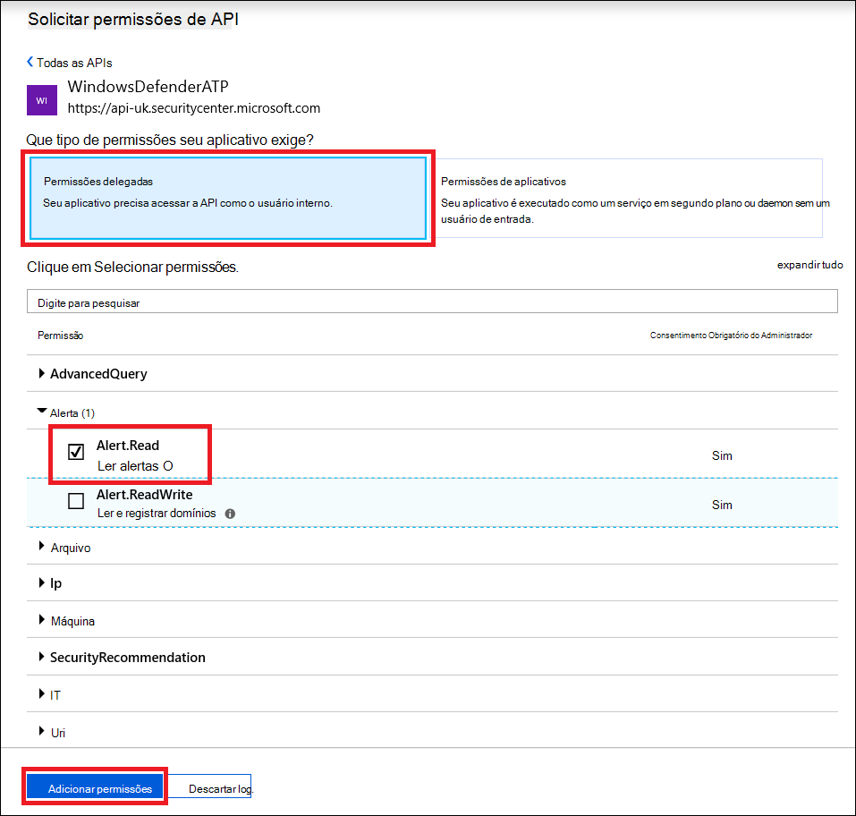
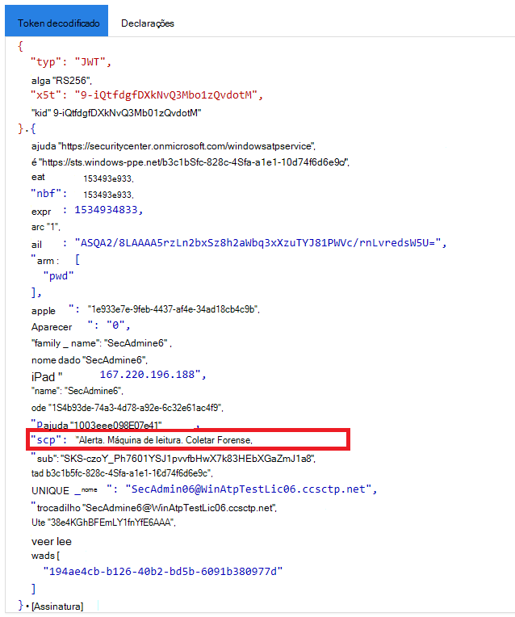

# <a name="use-microsoft-defender-for-endpoint-apis"></a>Usar o Microsoft Defender para APIs de Ponto de Extremidade

[!INCLUDE [Microsoft 365 Defender rebranding](../../includes/microsoft-defender.md)]


**Aplica-se a:**
- [Microsoft Defender para Ponto de Extremidade](https://go.microsoft.com/fwlink/?linkid=2154037)

> Deseja experimentar o Microsoft Defender para Ponto de Extremidade? [Inscreva-se para uma avaliação gratuita.](https://www.microsoft.com/microsoft-365/windows/microsoft-defender-atp?ocid=docs-wdatp-exposedapis-abovefoldlink)

[!include[Microsoft Defender for Endpoint API URIs for US Government](../../includes/microsoft-defender-api-usgov.md)]

[!include[Improve request performance](../../includes/improve-request-performance.md)]

Esta página descreve como criar um aplicativo para obter acesso programático ao Defender para Ponto de Extremidade em nome de um usuário.

Se você precisar de acesso programático do Microsoft Defender para Ponto de Extremidade sem um usuário, consulte [Access Microsoft Defender for Endpoint with application context](exposed-apis-create-app-webapp.md).

Se você não tiver certeza de qual acesso precisa, leia a página [Introdução.](apis-intro.md)

O Microsoft Defender para Ponto de Extremidade expõe grande parte de seus dados e ações por meio de um conjunto de APIs programáticas. Essas APIs permitirão automatizar fluxos de trabalho e inovar com base nos recursos do Microsoft Defender para o Ponto de Extremidade. O acesso à API requer autenticação OAuth2.0. Para obter mais informações, consulte [OAuth 2.0 Authorization Code Flow](https://docs.microsoft.com/azure/active-directory/develop/active-directory-v2-protocols-oauth-code).

Em geral, você precisará seguir as seguintes etapas para usar as APIs:
- Criar um aplicativo AAD
- Obter um token de acesso usando este aplicativo
- Usar o token para acessar a API do Defender para Ponto de Extremidade

Esta página explica como criar um aplicativo AAD, obter um token de acesso ao Microsoft Defender para Ponto de Extremidade e validar o token.

>[!NOTE]
> Ao acessar a API do Microsoft Defender para Ponto de Extremidade em nome de um usuário, você precisará da permissão correta do aplicativo e da permissão do usuário.
> Se você não estiver familiarizado com as permissões do usuário no Microsoft Defender para Ponto de Extremidade, consulte Gerenciar o [acesso ao portal usando](rbac.md)o controle de acesso baseado em função .

>[!TIP]
> Se você tiver permissão para executar uma ação no portal, terá permissão para executar a ação na API.

## <a name="create-an-app"></a>Criar um aplicativo

1. Faça logoff no [Azure](https://portal.azure.com) com uma conta de usuário que tenha a **função Administrador Global.**

2. Navegue **até registros do Aplicativo do Azure Active Directory** Novo  >    >  **registro**. 

   

3. Quando a página **Registrar um aplicativo** for exibida, insira as informações de registro do aplicativo:

   - **Nome**: insira um nome de aplicativo relevante que será exibido aos usuários do aplicativo.
   - **Tipos de conta com suporte**: selecione as contas às quais você gostaria que seu aplicativo desse suporte.

       | Tipos de conta com suporte | Descrição |
       |-------------------------|-------------|
       | **Contas apenas neste diretório organizacional** | Selecione esta opção se você está criando um aplicativo de linha de negócios (LOB). Essa opção não estará disponível se você não estiver registrando o aplicativo em um diretório.<br><br>Essa opção mapeia para o único locatário somente do Azure AD.<br><br>Essa é a opção padrão, a menos que você esteja registrando o aplicativo fora de um diretório. Quando o aplicativo é registrado fora de um diretório, o padrão é contas da Microsoft pessoais e de vários locatários do Azure AD. |
       | **Contas em qualquer diretório organizacional** | Selecione essa opção se você deseja direcionar para todos os clientes corporativos e educacionais.<br><br>Essa opção mapeia para vários locatários somente do Azure AD.<br><br>Se você registrou o aplicativo como único locatário somente do Azure AD, pode atualizá-lo para ser multilocatário e voltar a ser locatário único na folha **Autenticação**. |
       | **Contas em qualquer diretório organizacional e contas pessoais da Microsoft** | Selecione essa opção para direcionar ao conjunto mais amplo de clientes.<br><br>Essa opção mapeia para contas da Microsoft pessoais e multilocatário do Azure AD.<br><br>Se você registrou o aplicativo como contas da Microsoft pessoais e multilocatário do Azure AD, não poderá alterar isso na interface do usuário. Em vez disso, use o editor de manifesto do aplicativo para alterar os tipos de conta com suporte. |

   - **URI de redirecionamento (opcional)**: selecione o tipo de aplicativo que você está desenvolvendo, **Web** ou **Cliente público (dispositivos móvel e desktop)** e insira o URI de redirecionamento (ou a URL de resposta) para o aplicativo.
       - Para aplicativos Web, informe a URL base do aplicativo. Por exemplo, `http://localhost:31544` pode ser uma URL para um aplicativo Web em execução no seu computador local. Os usuários usariam essa URL para entrar em um aplicativo cliente Web.
       - Para aplicativos cliente públicos, informe o URI usado pelo Azure AD para retornar respostas de token. Insira um valor específico para o aplicativo, por exemplo, `myapp://auth`.

     Para ver exemplos específicos de aplicativos Web ou aplicativos nativos, confira os [inícios rápidos](/azure/active-directory/develop/#quickstarts).

     Ao terminar, selecione **Registrar**.

4. Permitir que seu aplicativo acesse o Microsoft Defender para Ponto de Extremidade e atribua a ele a permissão "Ler alertas":

    - Na página do aplicativo, selecione Permissões de API Adicionar **APIs** de permissão que minha organização usa > tipo  >    >   **WindowsDefenderATP** e selecione **no WindowsDefenderATP**.

    - **Observação**: *WindowsDefenderATP* não aparece na lista original. Comece a escrever seu nome na caixa de texto para vê-lo aparecer.

      

    - Escolha **Permissões delegadas**  >  **Alert.Read** > selecione **Adicionar permissões**

      

    - **Observação importante**: Selecione as permissões relevantes. Os alertas de leitura são apenas um exemplo.

      Por exemplo,

      - Para [executar consultas avançadas,](run-advanced-query-api.md)selecione 'Executar consultas avançadas' permissão
      - Para [isolar um dispositivo,](isolate-machine.md)selecione 'Isolar máquina' permissão
      - Para determinar de que permissão você precisa, consulte a seção **Permissões** na API que você está interessado em chamar.

    - Selecionar **Conceder consentimento**

      **Observação**: sempre que você adicionar permissão, você deve selecionar em **Conceder consentimento** para que a nova permissão entre em vigor.

      

6. Anote sua ID de aplicativo e sua ID de locatário:

   - Na página do aplicativo, acesse **Visão geral** e copie as seguintes informações:

   


## <a name="get-an-access-token"></a>Obter um token de acesso

Para obter mais informações sobre tokens AAD, consulte [tutorial do Azure AD](https://docs.microsoft.com/azure/active-directory/develop/active-directory-v2-protocols-oauth-client-creds)

### <a name="using-c"></a>Usando C #

- Copie/colar a classe abaixo em seu aplicativo.
- Use **o método AcquireUserTokenAsync** com sua ID de aplicativo, ID de locatário, nome de usuário e senha para adquirir um token.

    ```csharp
    namespace WindowsDefenderATP
    {
        using System.Net.Http;
        using System.Text;
        using System.Threading.Tasks;
        using Newtonsoft.Json.Linq;

        public static class WindowsDefenderATPUtils
        {
            private const string Authority = "https://login.microsoftonline.com";

            private const string WdatpResourceId = "https://api.securitycenter.microsoft.com";

            public static async Task<string> AcquireUserTokenAsync(string username, string password, string appId, string tenantId)
            {
                using (var httpClient = new HttpClient())
                {
                    var urlEncodedBody = $"resource={WdatpResourceId}&client_id={appId}&grant_type=password&username={username}&password={password}";

                    var stringContent = new StringContent(urlEncodedBody, Encoding.UTF8, "application/x-www-form-urlencoded");

                    using (var response = await httpClient.PostAsync($"{Authority}/{tenantId}/oauth2/token", stringContent).ConfigureAwait(false))
                    {
                        response.EnsureSuccessStatusCode();

                        var json = await response.Content.ReadAsStringAsync().ConfigureAwait(false);

                        var jObject = JObject.Parse(json);

                        return jObject["access_token"].Value<string>();
                    }
                }
            }
        }
    }
    ```

## <a name="validate-the-token"></a>Validar o token

Verifique se você tem um token correto:
- Copiar/colar em [JWT](https://jwt.ms) o token que você recebeu na etapa anterior para decodificá-lo
- Validar você recebe uma declaração 'scp' com as permissões de aplicativo desejadas
- Na captura de tela abaixo, você pode ver um token decodificado adquirido do aplicativo no tutorial:



## <a name="use-the-token-to-access-microsoft-defender-for-endpoint-api"></a>Usar o token para acessar a API do Microsoft Defender for Endpoint

- Escolha a API que você deseja usar - [Microsoft Defender para APIs](exposed-apis-list.md) de ponto de extremidade com suporte
- Definir o cabeçalho Autorização na solicitação HTTP que você enviar para "Portador {token}" (Portador é o esquema de Autorização)
- O tempo de expiração do token é de 1 hora (você pode enviar mais de uma solicitação com o mesmo token)

- Exemplo de envio de uma solicitação para obter uma lista de alertas **usando C#** 

    ```csharp
    var httpClient = new HttpClient();

    var request = new HttpRequestMessage(HttpMethod.Get, "https://api.securitycenter.microsoft.com/api/alerts");

    request.Headers.Authorization = new AuthenticationHeaderValue("Bearer", token);

    var response = httpClient.SendAsync(request).GetAwaiter().GetResult();

    // Do something useful with the response
    ```

## <a name="see-also"></a>Confira também
- [APIs do Microsoft Defender para Ponto de Extremidade](exposed-apis-list.md)
- [Acessar o Microsoft Defender para Ponto de Extremidade com contexto de aplicativo](exposed-apis-create-app-webapp.md)
