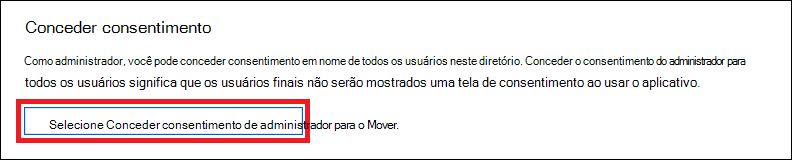

# <a name="use-microsoft-defender-for-endpoint-apis"></a><span data-ttu-id="61ef9-104">Usar o Microsoft Defender para APIs de Ponto de Extremidade</span><span class="sxs-lookup"><span data-stu-id="61ef9-104">Use Microsoft Defender for Endpoint APIs</span></span>

[!INCLUDE [Microsoft 365 Defender rebranding](../../includes/microsoft-defender.md)]


<span data-ttu-id="61ef9-105">**Aplica-se a:**</span><span class="sxs-lookup"><span data-stu-id="61ef9-105">**Applies to:**</span></span>
- [<span data-ttu-id="61ef9-106">Microsoft Defender para Ponto de Extremidade</span><span class="sxs-lookup"><span data-stu-id="61ef9-106">Microsoft Defender for Endpoint</span></span>](https://go.microsoft.com/fwlink/?linkid=2154037)

> <span data-ttu-id="61ef9-107">Deseja experimentar o Microsoft Defender para Ponto de Extremidade?</span><span class="sxs-lookup"><span data-stu-id="61ef9-107">Want to experience Microsoft Defender for Endpoint?</span></span> [<span data-ttu-id="61ef9-108">Inscreva-se para uma avaliação gratuita.</span><span class="sxs-lookup"><span data-stu-id="61ef9-108">Sign up for a free trial.</span></span>](https://www.microsoft.com/microsoft-365/windows/microsoft-defender-atp?ocid=docs-wdatp-exposedapis-abovefoldlink)

[!include[Microsoft Defender for Endpoint API URIs for US Government](../../includes/microsoft-defender-api-usgov.md)]

[!include[Improve request performance](../../includes/improve-request-performance.md)]

<span data-ttu-id="61ef9-109">Esta página descreve como criar um aplicativo para obter acesso programático ao Defender para Ponto de Extremidade em nome de um usuário.</span><span class="sxs-lookup"><span data-stu-id="61ef9-109">This page describes how to create an application to get programmatic access to Defender for Endpoint on behalf of a user.</span></span>

<span data-ttu-id="61ef9-110">Se você precisar de acesso programático do Microsoft Defender para Ponto de Extremidade sem um usuário, consulte [Access Microsoft Defender for Endpoint with application context](exposed-apis-create-app-webapp.md).</span><span class="sxs-lookup"><span data-stu-id="61ef9-110">If you need programmatic access Microsoft Defender for Endpoint without a user, refer to [Access Microsoft Defender for Endpoint with application context](exposed-apis-create-app-webapp.md).</span></span>

<span data-ttu-id="61ef9-111">Se você não tiver certeza de qual acesso precisa, leia a página [Introdução.](apis-intro.md)</span><span class="sxs-lookup"><span data-stu-id="61ef9-111">If you are not sure which access you need, read the [Introduction page](apis-intro.md).</span></span>

<span data-ttu-id="61ef9-112">O Microsoft Defender para Ponto de Extremidade expõe grande parte de seus dados e ações por meio de um conjunto de APIs programáticas.</span><span class="sxs-lookup"><span data-stu-id="61ef9-112">Microsoft Defender for Endpoint exposes much of its data and actions through a set of programmatic APIs.</span></span> <span data-ttu-id="61ef9-113">Essas APIs permitirão automatizar fluxos de trabalho e inovar com base nos recursos do Microsoft Defender para o Ponto de Extremidade.</span><span class="sxs-lookup"><span data-stu-id="61ef9-113">Those APIs will enable you to automate work flows and innovate based on Microsoft Defender for Endpoint capabilities.</span></span> <span data-ttu-id="61ef9-114">O acesso à API requer autenticação OAuth2.0.</span><span class="sxs-lookup"><span data-stu-id="61ef9-114">The API access requires OAuth2.0 authentication.</span></span> <span data-ttu-id="61ef9-115">Para obter mais informações, consulte [OAuth 2.0 Authorization Code Flow](https://docs.microsoft.com/azure/active-directory/develop/active-directory-v2-protocols-oauth-code).</span><span class="sxs-lookup"><span data-stu-id="61ef9-115">For more information, see [OAuth 2.0 Authorization Code Flow](https://docs.microsoft.com/azure/active-directory/develop/active-directory-v2-protocols-oauth-code).</span></span>

<span data-ttu-id="61ef9-116">Em geral, você precisará seguir as seguintes etapas para usar as APIs:</span><span class="sxs-lookup"><span data-stu-id="61ef9-116">In general, you’ll need to take the following steps to use the APIs:</span></span>
- <span data-ttu-id="61ef9-117">Criar um aplicativo AAD</span><span class="sxs-lookup"><span data-stu-id="61ef9-117">Create an AAD application</span></span>
- <span data-ttu-id="61ef9-118">Obter um token de acesso usando este aplicativo</span><span class="sxs-lookup"><span data-stu-id="61ef9-118">Get an access token using this application</span></span>
- <span data-ttu-id="61ef9-119">Usar o token para acessar a API do Defender para Ponto de Extremidade</span><span class="sxs-lookup"><span data-stu-id="61ef9-119">Use the token to access Defender for Endpoint API</span></span>

<span data-ttu-id="61ef9-120">Esta página explica como criar um aplicativo AAD, obter um token de acesso ao Microsoft Defender para Ponto de Extremidade e validar o token.</span><span class="sxs-lookup"><span data-stu-id="61ef9-120">This page explains how to create an AAD application, get an access token to Microsoft Defender for Endpoint and validate the token.</span></span>

>[!NOTE]
> <span data-ttu-id="61ef9-121">Ao acessar a API do Microsoft Defender para Ponto de Extremidade em nome de um usuário, você precisará da permissão correta do aplicativo e da permissão do usuário.</span><span class="sxs-lookup"><span data-stu-id="61ef9-121">When accessing Microsoft Defender for Endpoint API on behalf of a user, you will need the correct Application permission and user permission.</span></span>
> <span data-ttu-id="61ef9-122">Se você não estiver familiarizado com as permissões do usuário no Microsoft Defender para Ponto de Extremidade, consulte Gerenciar o [acesso ao portal usando](rbac.md)o controle de acesso baseado em função .</span><span class="sxs-lookup"><span data-stu-id="61ef9-122">If you are not familiar with user permissions on Microsoft Defender for Endpoint, see [Manage portal access using role-based access control](rbac.md).</span></span>

>[!TIP]
> <span data-ttu-id="61ef9-123">Se você tiver permissão para executar uma ação no portal, terá permissão para executar a ação na API.</span><span class="sxs-lookup"><span data-stu-id="61ef9-123">If you have the permission to perform an action in the portal, you have the permission to perform the action in the API.</span></span>

## <a name="create-an-app"></a><span data-ttu-id="61ef9-124">Criar um aplicativo</span><span class="sxs-lookup"><span data-stu-id="61ef9-124">Create an app</span></span>

1. <span data-ttu-id="61ef9-125">Faça logoff no [Azure](https://portal.azure.com) com uma conta de usuário que tenha a **função Administrador Global.**</span><span class="sxs-lookup"><span data-stu-id="61ef9-125">Log on to [Azure](https://portal.azure.com) with a user account that has the **Global Administrator** role.</span></span>

2. <span data-ttu-id="61ef9-126">Navegue **até registros do Aplicativo do Azure Active Directory** Novo  >    >  **registro**.</span><span class="sxs-lookup"><span data-stu-id="61ef9-126">Navigate to **Azure Active Directory** > **App registrations** > **New registration**.</span></span> 

   

3. <span data-ttu-id="61ef9-128">Quando a página **Registrar um aplicativo** for exibida, insira as informações de registro do aplicativo:</span><span class="sxs-lookup"><span data-stu-id="61ef9-128">When the **Register an application** page appears, enter your application's registration information:</span></span>

   - <span data-ttu-id="61ef9-129">**Nome**: insira um nome de aplicativo relevante que será exibido aos usuários do aplicativo.</span><span class="sxs-lookup"><span data-stu-id="61ef9-129">**Name** - Enter a meaningful application name that will be displayed to users of the app.</span></span>
   - <span data-ttu-id="61ef9-130">**Tipos de conta com suporte**: selecione as contas às quais você gostaria que seu aplicativo desse suporte.</span><span class="sxs-lookup"><span data-stu-id="61ef9-130">**Supported account types** - Select which accounts you would like your application to support.</span></span>

       | <span data-ttu-id="61ef9-131">Tipos de conta com suporte</span><span class="sxs-lookup"><span data-stu-id="61ef9-131">Supported account types</span></span> | <span data-ttu-id="61ef9-132">Descrição</span><span class="sxs-lookup"><span data-stu-id="61ef9-132">Description</span></span> |
       |-------------------------|-------------|
       | <span data-ttu-id="61ef9-133">**Contas apenas neste diretório organizacional**</span><span class="sxs-lookup"><span data-stu-id="61ef9-133">**Accounts in this organizational directory only**</span></span> | <span data-ttu-id="61ef9-134">Selecione esta opção se você está criando um aplicativo de linha de negócios (LOB).</span><span class="sxs-lookup"><span data-stu-id="61ef9-134">Select this option if you're building a line-of-business (LOB) application.</span></span> <span data-ttu-id="61ef9-135">Essa opção não estará disponível se você não estiver registrando o aplicativo em um diretório.</span><span class="sxs-lookup"><span data-stu-id="61ef9-135">This option is not available if you're not registering the application in a directory.</span></span><br><br><span data-ttu-id="61ef9-136">Essa opção mapeia para o único locatário somente do Azure AD.</span><span class="sxs-lookup"><span data-stu-id="61ef9-136">This option maps to Azure AD only single-tenant.</span></span><br><br><span data-ttu-id="61ef9-137">Essa é a opção padrão, a menos que você esteja registrando o aplicativo fora de um diretório.</span><span class="sxs-lookup"><span data-stu-id="61ef9-137">This is the default option unless you're registering the app outside of a directory.</span></span> <span data-ttu-id="61ef9-138">Quando o aplicativo é registrado fora de um diretório, o padrão é contas da Microsoft pessoais e de vários locatários do Azure AD.</span><span class="sxs-lookup"><span data-stu-id="61ef9-138">In cases where the app is registered outside of a directory, the default is Azure AD multi-tenant and personal Microsoft accounts.</span></span> |
       | <span data-ttu-id="61ef9-139">**Contas em qualquer diretório organizacional**</span><span class="sxs-lookup"><span data-stu-id="61ef9-139">**Accounts in any organizational directory**</span></span> | <span data-ttu-id="61ef9-140">Selecione essa opção se você deseja direcionar para todos os clientes corporativos e educacionais.</span><span class="sxs-lookup"><span data-stu-id="61ef9-140">Select this option if you would like to target all business and educational customers.</span></span><br><br><span data-ttu-id="61ef9-141">Essa opção mapeia para vários locatários somente do Azure AD.</span><span class="sxs-lookup"><span data-stu-id="61ef9-141">This option maps to an Azure AD only multi-tenant.</span></span><br><br><span data-ttu-id="61ef9-142">Se você registrou o aplicativo como único locatário somente do Azure AD, pode atualizá-lo para ser multilocatário e voltar a ser locatário único na folha **Autenticação**.</span><span class="sxs-lookup"><span data-stu-id="61ef9-142">If you registered the app as Azure AD only single-tenant, you can update it to be Azure AD multi-tenant and back to single-tenant through the **Authentication** blade.</span></span> |
       | <span data-ttu-id="61ef9-143">**Contas em qualquer diretório organizacional e contas pessoais da Microsoft**</span><span class="sxs-lookup"><span data-stu-id="61ef9-143">**Accounts in any organizational directory and personal Microsoft accounts**</span></span> | <span data-ttu-id="61ef9-144">Selecione essa opção para direcionar ao conjunto mais amplo de clientes.</span><span class="sxs-lookup"><span data-stu-id="61ef9-144">Select this option to target the widest set of customers.</span></span><br><br><span data-ttu-id="61ef9-145">Essa opção mapeia para contas da Microsoft pessoais e multilocatário do Azure AD.</span><span class="sxs-lookup"><span data-stu-id="61ef9-145">This option maps to Azure AD multi-tenant and personal Microsoft accounts.</span></span><br><br><span data-ttu-id="61ef9-146">Se você registrou o aplicativo como contas da Microsoft pessoais e multilocatário do Azure AD, não poderá alterar isso na interface do usuário.</span><span class="sxs-lookup"><span data-stu-id="61ef9-146">If you registered the app as Azure AD multi-tenant and personal Microsoft accounts, you cannot change this in the UI.</span></span> <span data-ttu-id="61ef9-147">Em vez disso, use o editor de manifesto do aplicativo para alterar os tipos de conta com suporte.</span><span class="sxs-lookup"><span data-stu-id="61ef9-147">Instead, you must use the application manifest editor to change the supported account types.</span></span> |

   - <span data-ttu-id="61ef9-148">**URI de redirecionamento (opcional)**: selecione o tipo de aplicativo que você está desenvolvendo, **Web** ou **Cliente público (dispositivos móvel e desktop)** e insira o URI de redirecionamento (ou a URL de resposta) para o aplicativo.</span><span class="sxs-lookup"><span data-stu-id="61ef9-148">**Redirect URI (optional)** - Select the type of app you're building, **Web** or **Public client (mobile & desktop)**, and then enter the redirect URI (or reply URL) for your application.</span></span>
       - <span data-ttu-id="61ef9-149">Para aplicativos Web, informe a URL base do aplicativo.</span><span class="sxs-lookup"><span data-stu-id="61ef9-149">For web applications, provide the base URL of your app.</span></span> <span data-ttu-id="61ef9-150">Por exemplo, `http://localhost:31544` pode ser uma URL para um aplicativo Web em execução no seu computador local.</span><span class="sxs-lookup"><span data-stu-id="61ef9-150">For example, `http://localhost:31544` might be the URL for a web app running on your local machine.</span></span> <span data-ttu-id="61ef9-151">Os usuários usariam essa URL para entrar em um aplicativo cliente Web.</span><span class="sxs-lookup"><span data-stu-id="61ef9-151">Users would use this URL to sign in to a web client application.</span></span>
       - <span data-ttu-id="61ef9-152">Para aplicativos cliente públicos, informe o URI usado pelo Azure AD para retornar respostas de token.</span><span class="sxs-lookup"><span data-stu-id="61ef9-152">For public client applications, provide the URI used by Azure AD to return token responses.</span></span> <span data-ttu-id="61ef9-153">Insira um valor específico para o aplicativo, por exemplo, `myapp://auth`.</span><span class="sxs-lookup"><span data-stu-id="61ef9-153">Enter a value specific to your application, such as `myapp://auth`.</span></span>

     <span data-ttu-id="61ef9-154">Para ver exemplos específicos de aplicativos Web ou aplicativos nativos, confira os [inícios rápidos](/azure/active-directory/develop/#quickstarts).</span><span class="sxs-lookup"><span data-stu-id="61ef9-154">To see specific examples for web applications or native applications, check out our [quickstarts](/azure/active-directory/develop/#quickstarts).</span></span>

     <span data-ttu-id="61ef9-155">Ao terminar, selecione **Registrar**.</span><span class="sxs-lookup"><span data-stu-id="61ef9-155">When finished, select **Register**.</span></span>

4. <span data-ttu-id="61ef9-156">Permitir que seu aplicativo acesse o Microsoft Defender para Ponto de Extremidade e atribua a ele a permissão "Ler alertas":</span><span class="sxs-lookup"><span data-stu-id="61ef9-156">Allow your Application to access Microsoft Defender for Endpoint and assign it 'Read alerts' permission:</span></span>

    - <span data-ttu-id="61ef9-157">Na página do aplicativo, selecione Permissões de API Adicionar **APIs** de permissão que minha organização usa > tipo  >    >   **WindowsDefenderATP** e selecione **no WindowsDefenderATP**.</span><span class="sxs-lookup"><span data-stu-id="61ef9-157">On your application page, select **API Permissions** > **Add permission** > **APIs my organization uses** > type **WindowsDefenderATP** and select on **WindowsDefenderATP**.</span></span>

    - <span data-ttu-id="61ef9-158">**Observação**: *WindowsDefenderATP* não aparece na lista original.</span><span class="sxs-lookup"><span data-stu-id="61ef9-158">**Note**: *WindowsDefenderATP* does not appear in the original list.</span></span> <span data-ttu-id="61ef9-159">Comece a escrever seu nome na caixa de texto para vê-lo aparecer.</span><span class="sxs-lookup"><span data-stu-id="61ef9-159">Start writing its name in the text box to see it appear.</span></span>

      

    - <span data-ttu-id="61ef9-161">Escolha **Permissões delegadas**  >  **Alert.Read** > selecione **Adicionar permissões**</span><span class="sxs-lookup"><span data-stu-id="61ef9-161">Choose **Delegated permissions** > **Alert.Read** > select **Add permissions**</span></span>

      

    - <span data-ttu-id="61ef9-163">**Observação importante**: Selecione as permissões relevantes.</span><span class="sxs-lookup"><span data-stu-id="61ef9-163">**Important note**: Select the relevant permissions.</span></span> <span data-ttu-id="61ef9-164">Os alertas de leitura são apenas um exemplo.</span><span class="sxs-lookup"><span data-stu-id="61ef9-164">Read alerts is only an example.</span></span>

      <span data-ttu-id="61ef9-165">Por exemplo,</span><span class="sxs-lookup"><span data-stu-id="61ef9-165">For instance,</span></span>

      - <span data-ttu-id="61ef9-166">Para [executar consultas avançadas,](run-advanced-query-api.md)selecione 'Executar consultas avançadas' permissão</span><span class="sxs-lookup"><span data-stu-id="61ef9-166">To [run advanced queries](run-advanced-query-api.md), select 'Run advanced queries' permission</span></span>
      - <span data-ttu-id="61ef9-167">Para [isolar um dispositivo,](isolate-machine.md)selecione 'Isolar máquina' permissão</span><span class="sxs-lookup"><span data-stu-id="61ef9-167">To [isolate a device](isolate-machine.md), select 'Isolate machine' permission</span></span>
      - <span data-ttu-id="61ef9-168">Para determinar de que permissão você precisa, consulte a seção **Permissões** na API que você está interessado em chamar.</span><span class="sxs-lookup"><span data-stu-id="61ef9-168">To determine which permission you need, view the **Permissions** section in the API you are interested to call.</span></span>

    - <span data-ttu-id="61ef9-169">Selecionar **Conceder consentimento**</span><span class="sxs-lookup"><span data-stu-id="61ef9-169">Select **Grant consent**</span></span>

      <span data-ttu-id="61ef9-170">**Observação**: sempre que você adicionar permissão, você deve selecionar em **Conceder consentimento** para que a nova permissão entre em vigor.</span><span class="sxs-lookup"><span data-stu-id="61ef9-170">**Note**: Every time you add permission you must select on **Grant consent** for the new permission to take effect.</span></span>

      

6. <span data-ttu-id="61ef9-172">Anote sua ID de aplicativo e sua ID de locatário:</span><span class="sxs-lookup"><span data-stu-id="61ef9-172">Write down your application ID and your tenant ID:</span></span>

   - <span data-ttu-id="61ef9-173">Na página do aplicativo, acesse **Visão geral** e copie as seguintes informações:</span><span class="sxs-lookup"><span data-stu-id="61ef9-173">On your application page, go to **Overview** and copy the following information:</span></span>

   


## <a name="get-an-access-token"></a><span data-ttu-id="61ef9-175">Obter um token de acesso</span><span class="sxs-lookup"><span data-stu-id="61ef9-175">Get an access token</span></span>

<span data-ttu-id="61ef9-176">Para obter mais informações sobre tokens AAD, consulte [tutorial do Azure AD](https://docs.microsoft.com/azure/active-directory/develop/active-directory-v2-protocols-oauth-client-creds)</span><span class="sxs-lookup"><span data-stu-id="61ef9-176">For more information on AAD tokens, see [Azure AD tutorial](https://docs.microsoft.com/azure/active-directory/develop/active-directory-v2-protocols-oauth-client-creds)</span></span>

### <a name="using-c"></a><span data-ttu-id="61ef9-177">Usando C #</span><span class="sxs-lookup"><span data-stu-id="61ef9-177">Using C#</span></span>

- <span data-ttu-id="61ef9-178">Copie/colar a classe abaixo em seu aplicativo.</span><span class="sxs-lookup"><span data-stu-id="61ef9-178">Copy/Paste the below class in your application.</span></span>
- <span data-ttu-id="61ef9-179">Use **o método AcquireUserTokenAsync** com sua ID de aplicativo, ID de locatário, nome de usuário e senha para adquirir um token.</span><span class="sxs-lookup"><span data-stu-id="61ef9-179">Use **AcquireUserTokenAsync** method with your application ID, tenant ID, user name, and password to acquire a token.</span></span>

    ```csharp
    namespace WindowsDefenderATP
    {
        using System.Net.Http;
        using System.Text;
        using System.Threading.Tasks;
        using Newtonsoft.Json.Linq;

        public static class WindowsDefenderATPUtils
        {
            private const string Authority = "https://login.microsoftonline.com";

            private const string WdatpResourceId = "https://api.securitycenter.microsoft.com";

            public static async Task<string> AcquireUserTokenAsync(string username, string password, string appId, string tenantId)
            {
                using (var httpClient = new HttpClient())
                {
                    var urlEncodedBody = $"resource={WdatpResourceId}&client_id={appId}&grant_type=password&username={username}&password={password}";

                    var stringContent = new StringContent(urlEncodedBody, Encoding.UTF8, "application/x-www-form-urlencoded");

                    using (var response = await httpClient.PostAsync($"{Authority}/{tenantId}/oauth2/token", stringContent).ConfigureAwait(false))
                    {
                        response.EnsureSuccessStatusCode();

                        var json = await response.Content.ReadAsStringAsync().ConfigureAwait(false);

                        var jObject = JObject.Parse(json);

                        return jObject["access_token"].Value<string>();
                    }
                }
            }
        }
    }
    ```

## <a name="validate-the-token"></a><span data-ttu-id="61ef9-180">Validar o token</span><span class="sxs-lookup"><span data-stu-id="61ef9-180">Validate the token</span></span>

<span data-ttu-id="61ef9-181">Verifique se você tem um token correto:</span><span class="sxs-lookup"><span data-stu-id="61ef9-181">Verify to make sure you got a correct token:</span></span>
- <span data-ttu-id="61ef9-182">Copiar/colar em [JWT](https://jwt.ms) o token que você recebeu na etapa anterior para decodificá-lo</span><span class="sxs-lookup"><span data-stu-id="61ef9-182">Copy/paste into [JWT](https://jwt.ms) the token you got in the previous step in order to decode it</span></span>
- <span data-ttu-id="61ef9-183">Validar você recebe uma declaração 'scp' com as permissões de aplicativo desejadas</span><span class="sxs-lookup"><span data-stu-id="61ef9-183">Validate you get a 'scp' claim with the desired app permissions</span></span>
- <span data-ttu-id="61ef9-184">Na captura de tela abaixo, você pode ver um token decodificado adquirido do aplicativo no tutorial:</span><span class="sxs-lookup"><span data-stu-id="61ef9-184">In the screenshot below you can see a decoded token acquired from the app in the tutorial:</span></span>


## <a name="use-the-token-to-access-microsoft-defender-for-endpoint-api"></a><span data-ttu-id="61ef9-186">Usar o token para acessar a API do Microsoft Defender for Endpoint</span><span class="sxs-lookup"><span data-stu-id="61ef9-186">Use the token to access Microsoft Defender for Endpoint API</span></span>

- <span data-ttu-id="61ef9-187">Escolha a API que você deseja usar - [Microsoft Defender para APIs](exposed-apis-list.md) de ponto de extremidade com suporte</span><span class="sxs-lookup"><span data-stu-id="61ef9-187">Choose the API you want to use - [Supported Microsoft Defender for Endpoint APIs](exposed-apis-list.md)</span></span>
- <span data-ttu-id="61ef9-188">Definir o cabeçalho Autorização na solicitação HTTP que você enviar para "Portador {token}" (Portador é o esquema de Autorização)</span><span class="sxs-lookup"><span data-stu-id="61ef9-188">Set the Authorization header in the HTTP request you send to "Bearer {token}" (Bearer is the Authorization scheme)</span></span>
- <span data-ttu-id="61ef9-189">O tempo de expiração do token é de 1 hora (você pode enviar mais de uma solicitação com o mesmo token)</span><span class="sxs-lookup"><span data-stu-id="61ef9-189">The Expiration time of the token is 1 hour (you can send more than one request with the same token)</span></span>

- <span data-ttu-id="61ef9-190">Exemplo de envio de uma solicitação para obter uma lista de alertas **usando C#**</span><span class="sxs-lookup"><span data-stu-id="61ef9-190">Example of sending a request to get a list of alerts **using C#**</span></span> 

    ```csharp
    var httpClient = new HttpClient();

    var request = new HttpRequestMessage(HttpMethod.Get, "https://api.securitycenter.microsoft.com/api/alerts");

    request.Headers.Authorization = new AuthenticationHeaderValue("Bearer", token);

    var response = httpClient.SendAsync(request).GetAwaiter().GetResult();

    // Do something useful with the response
    ```

## <a name="see-also"></a><span data-ttu-id="61ef9-191">Confira também</span><span class="sxs-lookup"><span data-stu-id="61ef9-191">See also</span></span>
- [<span data-ttu-id="61ef9-192">APIs do Microsoft Defender para Ponto de Extremidade</span><span class="sxs-lookup"><span data-stu-id="61ef9-192">Microsoft Defender for Endpoint APIs</span></span>](exposed-apis-list.md)
- [<span data-ttu-id="61ef9-193">Acessar o Microsoft Defender para Ponto de Extremidade com contexto de aplicativo</span><span class="sxs-lookup"><span data-stu-id="61ef9-193">Access Microsoft Defender for Endpoint with application context</span></span>](exposed-apis-create-app-webapp.md)
