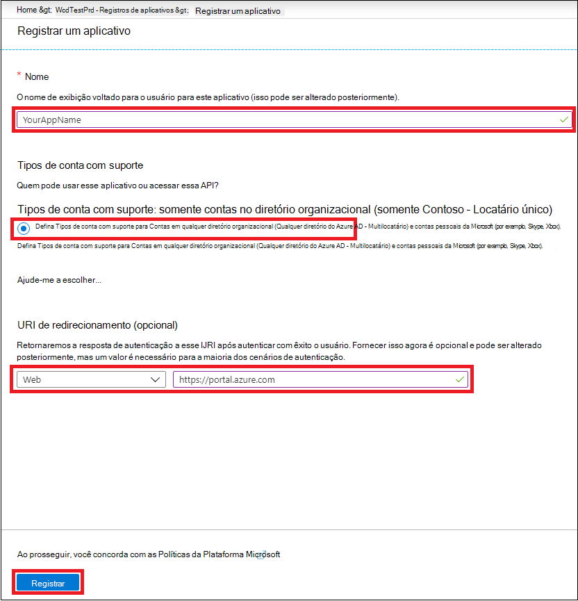
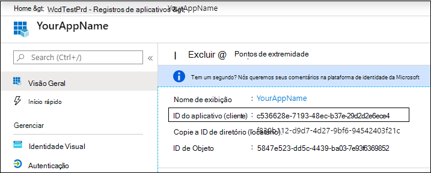
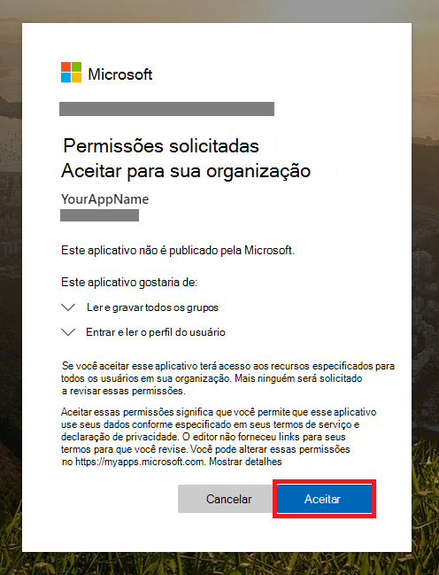

# <a name="partner-access-through-microsoft-defender-for-endpoint-apis"></a><span data-ttu-id="245fa-104">Acesso de parceiros por meio do Microsoft Defender para APIs de ponto de extremidade</span><span class="sxs-lookup"><span data-stu-id="245fa-104">Partner access through Microsoft Defender for Endpoint APIs</span></span>

[!INCLUDE [Microsoft 365 Defender rebranding](../../includes/microsoft-defender.md)]


<span data-ttu-id="245fa-105">**Aplica-se a:** [Microsoft Defender para Ponto de Extremidade](https://go.microsoft.com/fwlink/?linkid=2154037)</span><span class="sxs-lookup"><span data-stu-id="245fa-105">**Applies to:** [Microsoft Defender for Endpoint](https://go.microsoft.com/fwlink/?linkid=2154037)</span></span>

> <span data-ttu-id="245fa-106">Deseja experimentar o Microsoft Defender para Ponto de Extremidade?</span><span class="sxs-lookup"><span data-stu-id="245fa-106">Want to experience Microsoft Defender for Endpoint?</span></span> [<span data-ttu-id="245fa-107">Inscreva-se para uma avaliação gratuita.</span><span class="sxs-lookup"><span data-stu-id="245fa-107">Sign up for a free trial.</span></span>](https://www.microsoft.com/microsoft-365/windows/microsoft-defender-atp?ocid=docs-wdatp-exposedapis-abovefoldlink)

[!include[Microsoft Defender for Endpoint API URIs for US Government](../../includes/microsoft-defender-api-usgov.md)]

[!include[Improve request performance](../../includes/improve-request-performance.md)]

<span data-ttu-id="245fa-108">Esta página descreve como criar um aplicativo Azure Active Directory (Azure AD) para obter acesso programático ao Microsoft Defender para Ponto de Extremidade em nome de seus clientes.</span><span class="sxs-lookup"><span data-stu-id="245fa-108">This page describes how to create an Azure Active Directory (Azure AD) application to get programmatic access to Microsoft Defender for Endpoint on behalf of your customers.</span></span>


<span data-ttu-id="245fa-109">O Microsoft Defender para Ponto de Extremidade expõe grande parte de seus dados e ações por meio de um conjunto de APIs programáticas.</span><span class="sxs-lookup"><span data-stu-id="245fa-109">Microsoft Defender for Endpoint exposes much of its data and actions through a set of programmatic APIs.</span></span> <span data-ttu-id="245fa-110">Essas APIs ajudarão você a automatizar fluxos de trabalho e inovar com base nos recursos do Microsoft Defender para Ponto de Extremidade.</span><span class="sxs-lookup"><span data-stu-id="245fa-110">Those APIs will help you automate work flows and innovate based on Microsoft Defender for Endpoint capabilities.</span></span> <span data-ttu-id="245fa-111">O acesso à API requer autenticação OAuth2.0.</span><span class="sxs-lookup"><span data-stu-id="245fa-111">The API access requires OAuth2.0 authentication.</span></span> <span data-ttu-id="245fa-112">Para obter mais informações, consulte [OAuth 2.0 Authorization Code Flow](/azure/active-directory/develop/active-directory-v2-protocols-oauth-code).</span><span class="sxs-lookup"><span data-stu-id="245fa-112">For more information, see [OAuth 2.0 Authorization Code Flow](/azure/active-directory/develop/active-directory-v2-protocols-oauth-code).</span></span>

<span data-ttu-id="245fa-113">Em geral, você precisará seguir as seguintes etapas para usar as APIs:</span><span class="sxs-lookup"><span data-stu-id="245fa-113">In general, you’ll need to take the following steps to use the APIs:</span></span>
- <span data-ttu-id="245fa-114">Crie um **aplicativo do** Azure AD com vários locatários.</span><span class="sxs-lookup"><span data-stu-id="245fa-114">Create a **multi-tenant** Azure AD application.</span></span>
- <span data-ttu-id="245fa-115">Get authorized(consent) by your customer administrator for your application to access Defender for Endpoint resources it needs.</span><span class="sxs-lookup"><span data-stu-id="245fa-115">Get authorized(consent) by your customer administrator for your application to access Defender for Endpoint resources it needs.</span></span>
- <span data-ttu-id="245fa-116">Obter um token de acesso usando este aplicativo.</span><span class="sxs-lookup"><span data-stu-id="245fa-116">Get an access token using this application.</span></span>
- <span data-ttu-id="245fa-117">Use o token para acessar a API do Microsoft Defender para Ponto de Extremidade.</span><span class="sxs-lookup"><span data-stu-id="245fa-117">Use the token to access Microsoft Defender for Endpoint API.</span></span>

<span data-ttu-id="245fa-118">As etapas a seguir orientarão você a criar um aplicativo do Azure AD, obter um token de acesso ao Microsoft Defender para Ponto de Extremidade e validar o token.</span><span class="sxs-lookup"><span data-stu-id="245fa-118">The following steps will guide you how to create an Azure AD application, get an access token to Microsoft Defender for Endpoint and validate the token.</span></span>

## <a name="create-the-multi-tenant-app"></a><span data-ttu-id="245fa-119">Criar o aplicativo de vários locatários</span><span class="sxs-lookup"><span data-stu-id="245fa-119">Create the multi-tenant app</span></span>

1. <span data-ttu-id="245fa-120">Entre no locatário [do Azure](https://portal.azure.com) com o usuário que tenha a **função de Administrador Global.**</span><span class="sxs-lookup"><span data-stu-id="245fa-120">Sign in to your [Azure tenant](https://portal.azure.com) with user that has **Global Administrator** role.</span></span>

2. <span data-ttu-id="245fa-121">Navegue **até Azure Active Directory** registros do  >  **aplicativo** Novo  >  **registro**.</span><span class="sxs-lookup"><span data-stu-id="245fa-121">Navigate to **Azure Active Directory** > **App registrations** > **New registration**.</span></span> 

   

3. <span data-ttu-id="245fa-123">No formulário de registro:</span><span class="sxs-lookup"><span data-stu-id="245fa-123">In the registration form:</span></span>

    - <span data-ttu-id="245fa-124">Escolha um nome para seu aplicativo.</span><span class="sxs-lookup"><span data-stu-id="245fa-124">Choose a name for your application.</span></span>

    - <span data-ttu-id="245fa-125">Tipos de conta com suporte - contas em qualquer diretório organizacional.</span><span class="sxs-lookup"><span data-stu-id="245fa-125">Supported account types - accounts in any organizational directory.</span></span>

    - <span data-ttu-id="245fa-126">URI de redirecionamento - tipo: Web, URI: https://portal.azure.com</span><span class="sxs-lookup"><span data-stu-id="245fa-126">Redirect URI - type: Web, URI: https://portal.azure.com</span></span>

    


4. <span data-ttu-id="245fa-128">Permita que seu aplicativo acesse o Microsoft Defender para Ponto de Extremidade e atribua-o com o conjunto mínimo de permissões necessário para concluir a integração.</span><span class="sxs-lookup"><span data-stu-id="245fa-128">Allow your Application to access Microsoft Defender for Endpoint and assign it with the minimal set of permissions required to complete the integration.</span></span>

   - <span data-ttu-id="245fa-129">Na página do aplicativo, selecione Permissões de API Adicionar **APIs** de permissão que minha organização usa > tipo  >    >   **WindowsDefenderATP** e selecione **no WindowsDefenderATP**.</span><span class="sxs-lookup"><span data-stu-id="245fa-129">On your application page, select **API Permissions** > **Add permission** > **APIs my organization uses** > type **WindowsDefenderATP** and select on **WindowsDefenderATP**.</span></span>

   - <span data-ttu-id="245fa-130">**Observação**: *WindowsDefenderATP* não aparece na lista original.</span><span class="sxs-lookup"><span data-stu-id="245fa-130">**Note**: *WindowsDefenderATP* does not appear in the original list.</span></span> <span data-ttu-id="245fa-131">Comece a escrever seu nome na caixa de texto para vê-lo aparecer.</span><span class="sxs-lookup"><span data-stu-id="245fa-131">Start writing its name in the text box to see it appear.</span></span>

   
   
   ### <a name="request-api-permissions"></a><span data-ttu-id="245fa-133">Solicitar permissões de API</span><span class="sxs-lookup"><span data-stu-id="245fa-133">Request API permissions</span></span>

   <span data-ttu-id="245fa-134">Para determinar de que permissão você precisa, revise a seção **Permissões** na API que você está interessado em chamar.</span><span class="sxs-lookup"><span data-stu-id="245fa-134">To determine which permission you need, review the **Permissions** section in the API you are interested to call.</span></span> <span data-ttu-id="245fa-135">Por exemplo:</span><span class="sxs-lookup"><span data-stu-id="245fa-135">For instance:</span></span>

   - <span data-ttu-id="245fa-136">Para [executar consultas avançadas,](run-advanced-query-api.md)selecione 'Executar consultas avançadas' permissão</span><span class="sxs-lookup"><span data-stu-id="245fa-136">To [run advanced queries](run-advanced-query-api.md), select 'Run advanced queries' permission</span></span>
   
   - <span data-ttu-id="245fa-137">Para [isolar um dispositivo,](isolate-machine.md)selecione 'Isolar máquina' permissão</span><span class="sxs-lookup"><span data-stu-id="245fa-137">To [isolate a device](isolate-machine.md), select 'Isolate machine' permission</span></span>

   <span data-ttu-id="245fa-138">No exemplo a seguir, vamos usar a **permissão "Ler todos os alertas":**</span><span class="sxs-lookup"><span data-stu-id="245fa-138">In the following example we will use **'Read all alerts'** permission:</span></span>

   <span data-ttu-id="245fa-139">Escolha **Permissões de aplicativo**  >  **Alert.Read.All >** selecione em Adicionar **permissões**</span><span class="sxs-lookup"><span data-stu-id="245fa-139">Choose **Application permissions** > **Alert.Read.All** > select on **Add permissions**</span></span>

   


5. <span data-ttu-id="245fa-141">Selecionar **Conceder consentimento**</span><span class="sxs-lookup"><span data-stu-id="245fa-141">Select **Grant consent**</span></span>

    - <span data-ttu-id="245fa-142">**Observação**: sempre que você adicionar permissão, você deve selecionar em **Conceder consentimento** para que a nova permissão entre em vigor.</span><span class="sxs-lookup"><span data-stu-id="245fa-142">**Note**: Every time you add permission you must select on **Grant consent** for the new permission to take effect.</span></span>

    

6. <span data-ttu-id="245fa-144">Adicione um segredo ao aplicativo.</span><span class="sxs-lookup"><span data-stu-id="245fa-144">Add a secret to the application.</span></span>

    - <span data-ttu-id="245fa-145">Selecione **Certificados & segredos,** adicione a descrição ao segredo e selecione **Adicionar**.</span><span class="sxs-lookup"><span data-stu-id="245fa-145">Select **Certificates & secrets**, add description to the secret and select **Add**.</span></span>

    <span data-ttu-id="245fa-146">**Importante**: depois de clicar em Adicionar, **copie o valor secreto gerado.**</span><span class="sxs-lookup"><span data-stu-id="245fa-146">**Important**: After click Add, **copy the generated secret value**.</span></span> <span data-ttu-id="245fa-147">Você não poderá recuperar depois de sair!</span><span class="sxs-lookup"><span data-stu-id="245fa-147">You won't be able to retrieve after you leave!</span></span>

    

7. <span data-ttu-id="245fa-149">Anote a ID do aplicativo:</span><span class="sxs-lookup"><span data-stu-id="245fa-149">Write down your application ID:</span></span>

   - <span data-ttu-id="245fa-150">Na página do aplicativo, acesse **Visão geral** e copie as seguintes informações:</span><span class="sxs-lookup"><span data-stu-id="245fa-150">On your application page, go to **Overview** and copy the following information:</span></span>

   

8. <span data-ttu-id="245fa-152">Adicione o aplicativo ao locatário do cliente.</span><span class="sxs-lookup"><span data-stu-id="245fa-152">Add the application to your customer's tenant.</span></span>

    <span data-ttu-id="245fa-153">Você precisa que seu aplicativo seja aprovado em cada locatário do cliente onde você pretende usá-lo.</span><span class="sxs-lookup"><span data-stu-id="245fa-153">You need your application to be approved in each customer tenant where you intend to use it.</span></span> <span data-ttu-id="245fa-154">Isso porque seu aplicativo interage com o aplicativo Microsoft Defender para Ponto de Extremidade em nome do seu cliente.</span><span class="sxs-lookup"><span data-stu-id="245fa-154">This is because your application interacts with Microsoft Defender for Endpoint application on behalf of your customer.</span></span>

    <span data-ttu-id="245fa-155">Um usuário com **o Administrador Global** do locatário do cliente precisa selecionar o link de consentimento e aprovar seu aplicativo.</span><span class="sxs-lookup"><span data-stu-id="245fa-155">A user with **Global Administrator** from your customer's tenant need to select the consent link and approve your application.</span></span>

    <span data-ttu-id="245fa-156">O link de consentimento é do formulário:</span><span class="sxs-lookup"><span data-stu-id="245fa-156">Consent link is of the form:</span></span>

    ```
    https://login.microsoftonline.com/common/oauth2/authorize?prompt=consent&client_id=00000000-0000-0000-0000-000000000000&response_type=code&sso_reload=true
    ```

    <span data-ttu-id="245fa-157">Onde 000000000-0000-0000-0000-000000000000000 devem ser substituídos pela ID do aplicativo</span><span class="sxs-lookup"><span data-stu-id="245fa-157">Where 00000000-0000-0000-0000-000000000000 should be replaced with your Application ID</span></span>

    <span data-ttu-id="245fa-158">Depois de clicar no link de consentimento, entre com o Administrador Global do locatário do cliente e consenta no aplicativo.</span><span class="sxs-lookup"><span data-stu-id="245fa-158">After clicking on the consent link, sign in with the Global Administrator of the customer's tenant and consent the application.</span></span>

    

    <span data-ttu-id="245fa-160">Além disso, você precisará solicitar a ID do locatário ao cliente e salvá-lo para uso futuro ao adquirir o token.</span><span class="sxs-lookup"><span data-stu-id="245fa-160">In addition, you will need to ask your customer for their tenant ID and save it for future use when acquiring the token.</span></span>

- <span data-ttu-id="245fa-161">**Pronto!**</span><span class="sxs-lookup"><span data-stu-id="245fa-161">**Done!**</span></span> <span data-ttu-id="245fa-162">Você registrou com êxito um aplicativo!</span><span class="sxs-lookup"><span data-stu-id="245fa-162">You have successfully registered an application!</span></span> 
- <span data-ttu-id="245fa-163">Consulte exemplos abaixo para aquisição e validação de token.</span><span class="sxs-lookup"><span data-stu-id="245fa-163">See examples below for token acquisition and validation.</span></span>

## <a name="get-an-access-token-example"></a><span data-ttu-id="245fa-164">Obter um exemplo de token de acesso:</span><span class="sxs-lookup"><span data-stu-id="245fa-164">Get an access token example:</span></span>

<span data-ttu-id="245fa-165">**Observação:** Para obter um token de acesso em nome do cliente, use a ID de locatário do cliente nas seguintes aquisições de token.</span><span class="sxs-lookup"><span data-stu-id="245fa-165">**Note:** To get access token on behalf of your customer, use the customer's tenant ID on the following token acquisitions.</span></span>

<br><span data-ttu-id="245fa-166">Para obter mais informações sobre o token AAD, consulte [tutorial do AAD](/azure/active-directory/develop/active-directory-v2-protocols-oauth-client-creds)</span><span class="sxs-lookup"><span data-stu-id="245fa-166">For more information on AAD token, see [AAD tutorial](/azure/active-directory/develop/active-directory-v2-protocols-oauth-client-creds)</span></span>

### <a name="using-powershell"></a><span data-ttu-id="245fa-167">Usando o Windows PowerShell</span><span class="sxs-lookup"><span data-stu-id="245fa-167">Using PowerShell</span></span>

```
# That code gets the App Context Token and save it to a file named "Latest-token.txt" under the current directory
# Paste below your Tenant ID, App ID and App Secret (App key).

$tenantId = '' ### Paste your tenant ID here
$appId = '' ### Paste your Application ID here
$appSecret = '' ### Paste your Application key here

$resourceAppIdUri = 'https://api.securitycenter.microsoft.com'
$oAuthUri = "https://login.microsoftonline.com/$TenantId/oauth2/token"
$authBody = [Ordered] @{
    resource = "$resourceAppIdUri"
    client_id = "$appId"
    client_secret = "$appSecret"
    grant_type = 'client_credentials'
}
$authResponse = Invoke-RestMethod -Method Post -Uri $oAuthUri -Body $authBody -ErrorAction Stop
$token = $authResponse.access_token
Out-File -FilePath "./Latest-token.txt" -InputObject $token
return $token
```

### <a name="using-c"></a><span data-ttu-id="245fa-168">Usando C#:</span><span class="sxs-lookup"><span data-stu-id="245fa-168">Using C#:</span></span>

><span data-ttu-id="245fa-169">O código a seguir foi testado com Nuget Microsoft.IdentityModel.Clients.ActiveDirectory</span><span class="sxs-lookup"><span data-stu-id="245fa-169">The below code was tested with Nuget Microsoft.IdentityModel.Clients.ActiveDirectory</span></span>

- <span data-ttu-id="245fa-170">Criar um novo Aplicativo de Console</span><span class="sxs-lookup"><span data-stu-id="245fa-170">Create a new Console Application</span></span>
- <span data-ttu-id="245fa-171">Instalar NuGet [Microsoft.IdentityModel.Clients.ActiveDirectory](https://www.nuget.org/packages/Microsoft.IdentityModel.Clients.ActiveDirectory/)</span><span class="sxs-lookup"><span data-stu-id="245fa-171">Install NuGet [Microsoft.IdentityModel.Clients.ActiveDirectory](https://www.nuget.org/packages/Microsoft.IdentityModel.Clients.ActiveDirectory/)</span></span>
- <span data-ttu-id="245fa-172">Adicionar o abaixo usando</span><span class="sxs-lookup"><span data-stu-id="245fa-172">Add the below using</span></span>

    ```
    using Microsoft.IdentityModel.Clients.ActiveDirectory;
    ```

- <span data-ttu-id="245fa-173">Copie/colar o código abaixo em seu aplicativo (não se esqueça de atualizar as três variáveis: ```tenantId, appId, appSecret``` )</span><span class="sxs-lookup"><span data-stu-id="245fa-173">Copy/Paste the below code in your application (do not forget to update the three variables: ```tenantId, appId, appSecret```)</span></span>

    ```
    string tenantId = "00000000-0000-0000-0000-000000000000"; // Paste your own tenant ID here
    string appId = "11111111-1111-1111-1111-111111111111"; // Paste your own app ID here
    string appSecret = "22222222-2222-2222-2222-222222222222"; // Paste your own app secret here for a test, and then store it in a safe place! 

    const string authority = "https://login.microsoftonline.com";
    const string wdatpResourceId = "https://api.securitycenter.microsoft.com";

    AuthenticationContext auth = new AuthenticationContext($"{authority}/{tenantId}/");
    ClientCredential clientCredential = new ClientCredential(appId, appSecret);
    AuthenticationResult authenticationResult = auth.AcquireTokenAsync(wdatpResourceId, clientCredential).GetAwaiter().GetResult();
    string token = authenticationResult.AccessToken;
    ```


### <a name="using-python"></a><span data-ttu-id="245fa-174">Usando Python</span><span class="sxs-lookup"><span data-stu-id="245fa-174">Using Python</span></span>

<span data-ttu-id="245fa-175">Consulte [Obter token usando Python](run-advanced-query-sample-python.md#get-token)</span><span class="sxs-lookup"><span data-stu-id="245fa-175">Refer to [Get token using Python](run-advanced-query-sample-python.md#get-token)</span></span>

### <a name="using-curl"></a><span data-ttu-id="245fa-176">Usando o cache</span><span class="sxs-lookup"><span data-stu-id="245fa-176">Using Curl</span></span>

> [!NOTE]
> <span data-ttu-id="245fa-177">O procedimento abaixo, suposto Cache para Windows já está instalado em seu computador</span><span class="sxs-lookup"><span data-stu-id="245fa-177">The below procedure supposed Curl for Windows is already installed on your computer</span></span>

- <span data-ttu-id="245fa-178">Abrir uma janela de comando</span><span class="sxs-lookup"><span data-stu-id="245fa-178">Open a command window</span></span>
- <span data-ttu-id="245fa-179">Definir CLIENT_ID para a ID do aplicativo do Azure</span><span class="sxs-lookup"><span data-stu-id="245fa-179">Set CLIENT_ID to your Azure application ID</span></span>
- <span data-ttu-id="245fa-180">Definir CLIENT_SECRET seu segredo de aplicativo do Azure</span><span class="sxs-lookup"><span data-stu-id="245fa-180">Set CLIENT_SECRET to your Azure application secret</span></span>
- <span data-ttu-id="245fa-181">De TENANT_ID para a ID de locatário do Azure do cliente que deseja usar seu aplicativo para acessar o aplicativo Microsoft Defender para Ponto de Extremidade</span><span class="sxs-lookup"><span data-stu-id="245fa-181">Set TENANT_ID to the Azure tenant ID of the customer that wants to use your application to access Microsoft Defender for Endpoint application</span></span>
- <span data-ttu-id="245fa-182">Execute o comando abaixo:</span><span class="sxs-lookup"><span data-stu-id="245fa-182">Run the below command:</span></span>

```
curl -i -X POST -H "Content-Type:application/x-www-form-urlencoded" -d "grant_type=client_credentials" -d "client_id=%CLIENT_ID%" -d "scope=https://securitycenter.onmicrosoft.com/windowsatpservice/.default" -d "client_secret=%CLIENT_SECRET%" "https://login.microsoftonline.com/%TENANT_ID%/oauth2/v2.0/token" -k
```

<span data-ttu-id="245fa-183">Você receberá uma resposta do formulário:</span><span class="sxs-lookup"><span data-stu-id="245fa-183">You will get an answer of the form:</span></span>

```
{"token_type":"Bearer","expires_in":3599,"ext_expires_in":0,"access_token":"eyJ0eXAiOiJKV1QiLCJhbGciOiJSUzI1NiIsIn <truncated> aWReH7P0s0tjTBX8wGWqJUdDA"}
```

## <a name="validate-the-token"></a><span data-ttu-id="245fa-184">Validar o token</span><span class="sxs-lookup"><span data-stu-id="245fa-184">Validate the token</span></span>

<span data-ttu-id="245fa-185">Verificação de sanidade para garantir que você tenha um token correto:</span><span class="sxs-lookup"><span data-stu-id="245fa-185">Sanity check to make sure you got a correct token:</span></span>
- <span data-ttu-id="245fa-186">Copiar/colar em [JWT](https://jwt.ms) o token que você obter na etapa anterior para decodificá-lo</span><span class="sxs-lookup"><span data-stu-id="245fa-186">Copy/paste into [JWT](https://jwt.ms) the token you get in the previous step in order to decode it</span></span>
- <span data-ttu-id="245fa-187">Validar você recebe uma declaração de "funções" com as permissões desejadas</span><span class="sxs-lookup"><span data-stu-id="245fa-187">Validate you get a 'roles' claim with the desired permissions</span></span>
- <span data-ttu-id="245fa-188">Na captura de tela abaixo, você pode ver um token decodificado adquirido de um Aplicativo com várias permissões para o Microsoft Defender para Ponto de Extremidade:</span><span class="sxs-lookup"><span data-stu-id="245fa-188">In the screenshot below, you can see a decoded token acquired from an Application with multiple permissions to  Microsoft Defender for Endpoint:</span></span>
- <span data-ttu-id="245fa-189">A declaração "tid" é a ID de locatário à que o token pertence.</span><span class="sxs-lookup"><span data-stu-id="245fa-189">The "tid" claim is the tenant ID the token belongs to.</span></span>


## <a name="use-the-token-to-access-microsoft-defender-for-endpoint-api"></a><span data-ttu-id="245fa-191">Usar o token para acessar a API do Microsoft Defender for Endpoint</span><span class="sxs-lookup"><span data-stu-id="245fa-191">Use the token to access Microsoft Defender for Endpoint API</span></span>

- <span data-ttu-id="245fa-192">Escolha a API que você deseja usar, para obter mais informações, consulte [Supported Microsoft Defender for Endpoint APIs](exposed-apis-list.md)</span><span class="sxs-lookup"><span data-stu-id="245fa-192">Choose the API you want to use, for more information, see [Supported Microsoft Defender for Endpoint APIs](exposed-apis-list.md)</span></span>
- <span data-ttu-id="245fa-193">Definir o cabeçalho Autorização na solicitação Http que você envia para "Portador {token}" (Portador é o esquema de Autorização)</span><span class="sxs-lookup"><span data-stu-id="245fa-193">Set the Authorization header in the Http request you send to "Bearer {token}" (Bearer is the Authorization scheme)</span></span>
- <span data-ttu-id="245fa-194">O tempo de expiração do token é de 1 hora (você pode enviar mais de uma solicitação com o mesmo token)</span><span class="sxs-lookup"><span data-stu-id="245fa-194">The Expiration time of the token is 1 hour (you can send more than one request with the same token)</span></span>

- <span data-ttu-id="245fa-195">Exemplo de envio de uma solicitação para obter uma lista de alertas **usando C#**</span><span class="sxs-lookup"><span data-stu-id="245fa-195">Example of sending a request to get a list of alerts **using C#**</span></span> 
    ```
    var httpClient = new HttpClient();

    var request = new HttpRequestMessage(HttpMethod.Get, "https://api.securitycenter.microsoft.com/api/alerts");

    request.Headers.Authorization = new AuthenticationHeaderValue("Bearer", token);

    var response = httpClient.SendAsync(request).GetAwaiter().GetResult();

    // Do something useful with the response
    ```

## <a name="see-also"></a><span data-ttu-id="245fa-196">Confira também</span><span class="sxs-lookup"><span data-stu-id="245fa-196">See also</span></span>
- [<span data-ttu-id="245fa-197">Suporte de APIs do Microsoft Defender para Ponto de Extremidade</span><span class="sxs-lookup"><span data-stu-id="245fa-197">Supported Microsoft Defender for Endpoint APIs</span></span>](exposed-apis-list.md)
- [<span data-ttu-id="245fa-198">Acessar o Microsoft Defender para Ponto de Extremidade em nome de um usuário</span><span class="sxs-lookup"><span data-stu-id="245fa-198">Access Microsoft Defender for Endpoint on behalf of a user</span></span>](exposed-apis-create-app-nativeapp.md)
