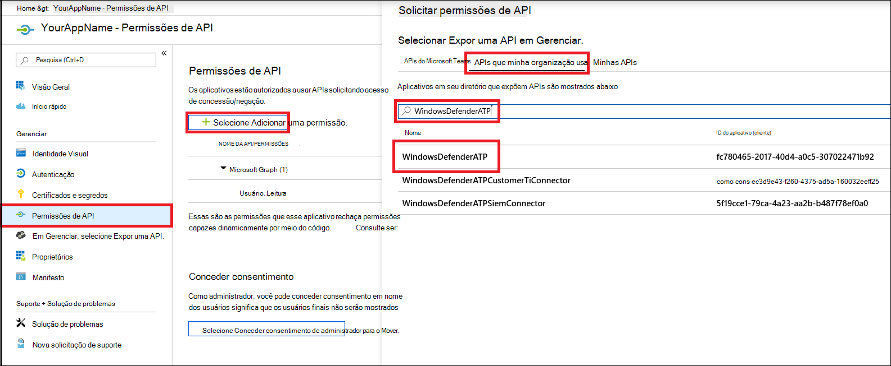
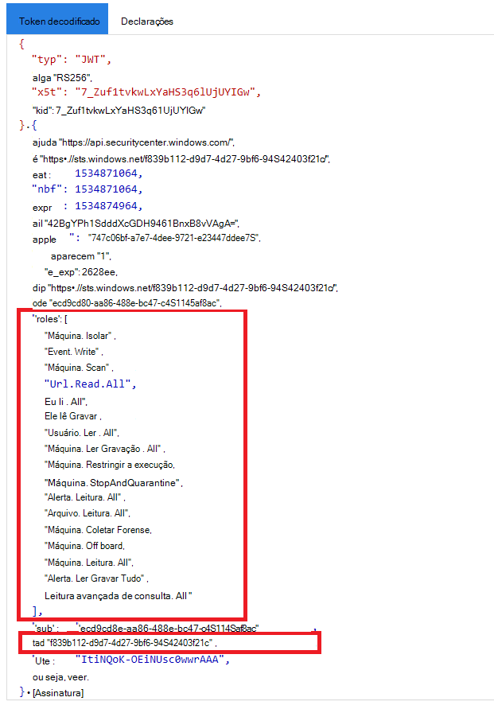

# <a name="partner-access-through-microsoft-defender-for-endpoint-apis"></a>Acesso de parceiros por meio do Microsoft Defender para APIs de ponto de extremidade

[!INCLUDE [Microsoft 365 Defender rebranding](../../includes/microsoft-defender.md)]


**Aplica-se a:** [Microsoft Defender para Ponto de Extremidade](https://go.microsoft.com/fwlink/?linkid=2154037)

> Deseja experimentar o Microsoft Defender para Ponto de Extremidade? [Inscreva-se para uma avaliação gratuita.](https://www.microsoft.com/microsoft-365/windows/microsoft-defender-atp?ocid=docs-wdatp-exposedapis-abovefoldlink)

[!include[Microsoft Defender for Endpoint API URIs for US Government](../../includes/microsoft-defender-api-usgov.md)]

[!include[Improve request performance](../../includes/improve-request-performance.md)]

Esta página descreve como criar um aplicativo Azure Active Directory (Azure AD) para obter acesso programático ao Microsoft Defender para Ponto de Extremidade em nome de seus clientes.


O Microsoft Defender para Ponto de Extremidade expõe grande parte de seus dados e ações por meio de um conjunto de APIs programáticas. Essas APIs ajudarão você a automatizar fluxos de trabalho e inovar com base nos recursos do Microsoft Defender para Ponto de Extremidade. O acesso à API requer autenticação OAuth2.0. Para obter mais informações, consulte [OAuth 2.0 Authorization Code Flow](https://docs.microsoft.com/azure/active-directory/develop/active-directory-v2-protocols-oauth-code).

Em geral, você precisará seguir as seguintes etapas para usar as APIs:
- Crie um **aplicativo do** Azure AD com vários locatários.
- Get authorized(consent) by your customer administrator for your application to access Defender for Endpoint resources it needs.
- Obter um token de acesso usando este aplicativo.
- Use o token para acessar a API do Microsoft Defender para Ponto de Extremidade.

As etapas a seguir orientarão você a criar um aplicativo do Azure AD, obter um token de acesso ao Microsoft Defender para Ponto de Extremidade e validar o token.

## <a name="create-the-multi-tenant-app"></a>Criar o aplicativo de vários locatários

1. Entre no locatário [do Azure](https://portal.azure.com) com o usuário que tenha a **função de Administrador Global.**

2. Navegue **até Azure Active Directory** registros do  >  **aplicativo** Novo  >  **registro**. 

   

3. No formulário de registro:

    - Escolha um nome para seu aplicativo.

    - Tipos de conta com suporte - contas em qualquer diretório organizacional.

    - URI de redirecionamento - tipo: Web, URI: https://portal.azure.com

    


4. Permita que seu aplicativo acesse o Microsoft Defender para Ponto de Extremidade e atribua-o com o conjunto mínimo de permissões necessário para concluir a integração.

   - Na página do aplicativo, selecione Permissões de API Adicionar **APIs** de permissão que minha organização usa > tipo  >    >   **WindowsDefenderATP** e selecione **no WindowsDefenderATP**.

   - **Observação**: *WindowsDefenderATP* não aparece na lista original. Comece a escrever seu nome na caixa de texto para vê-lo aparecer.

   
   
   ### <a name="request-api-permissions"></a>Solicitar permissões de API

   Para determinar de que permissão você precisa, revise a seção **Permissões** na API que você está interessado em chamar. Por exemplo:

   - Para [executar consultas avançadas,](run-advanced-query-api.md)selecione 'Executar consultas avançadas' permissão
   
   - Para [isolar um dispositivo,](isolate-machine.md)selecione 'Isolar máquina' permissão

   No exemplo a seguir, vamos usar a **permissão "Ler todos os alertas":**

   Escolha **Permissões de aplicativo**  >  **Alert.Read.All >** selecione em Adicionar **permissões**

   


5. Selecionar **Conceder consentimento**

    - **Observação**: sempre que você adicionar permissão, você deve selecionar em **Conceder consentimento** para que a nova permissão entre em vigor.

    

6. Adicione um segredo ao aplicativo.

    - Selecione **Certificados & segredos,** adicione a descrição ao segredo e selecione **Adicionar**.

    **Importante**: depois de clicar em Adicionar, **copie o valor secreto gerado.** Você não poderá recuperar depois de sair!

    

7. Anote a ID do aplicativo:

   - Na página do aplicativo, acesse **Visão geral** e copie as seguintes informações:

   

8. Adicione o aplicativo ao locatário do cliente.

    Você precisa que seu aplicativo seja aprovado em cada locatário do cliente onde você pretende usá-lo. Isso porque seu aplicativo interage com o aplicativo Microsoft Defender para Ponto de Extremidade em nome do seu cliente.

    Um usuário com **o Administrador Global** do locatário do cliente precisa selecionar o link de consentimento e aprovar seu aplicativo.

    O link de consentimento é do formulário:

    ```
    https://login.microsoftonline.com/common/oauth2/authorize?prompt=consent&client_id=00000000-0000-0000-0000-000000000000&response_type=code&sso_reload=true
    ```

    Onde 000000000-0000-0000-0000-000000000000000 devem ser substituídos pela ID do aplicativo

    Depois de clicar no link de consentimento, entre com o Administrador Global do locatário do cliente e consenta no aplicativo.

    

    Além disso, você precisará solicitar a ID do locatário ao cliente e salvá-lo para uso futuro ao adquirir o token.

- **Pronto!** Você registrou com êxito um aplicativo! 
- Consulte exemplos abaixo para aquisição e validação de token.

## <a name="get-an-access-token-example"></a>Obter um exemplo de token de acesso:

**Observação:** Para obter um token de acesso em nome do cliente, use a ID de locatário do cliente nas seguintes aquisições de token.

<br>Para obter mais informações sobre o token AAD, consulte [tutorial do AAD](https://docs.microsoft.com/azure/active-directory/develop/active-directory-v2-protocols-oauth-client-creds)

### <a name="using-powershell"></a>Usando o Windows PowerShell

```
# That code gets the App Context Token and save it to a file named "Latest-token.txt" under the current directory
# Paste below your Tenant ID, App ID and App Secret (App key).

$tenantId = '' ### Paste your tenant ID here
$appId = '' ### Paste your Application ID here
$appSecret = '' ### Paste your Application key here

$resourceAppIdUri = 'https://api.securitycenter.microsoft.com'
$oAuthUri = "https://login.microsoftonline.com/$TenantId/oauth2/token"
$authBody = [Ordered] @{
    resource = "$resourceAppIdUri"
    client_id = "$appId"
    client_secret = "$appSecret"
    grant_type = 'client_credentials'
}
$authResponse = Invoke-RestMethod -Method Post -Uri $oAuthUri -Body $authBody -ErrorAction Stop
$token = $authResponse.access_token
Out-File -FilePath "./Latest-token.txt" -InputObject $token
return $token
```

### <a name="using-c"></a>Usando C#:

>O código a seguir foi testado com Nuget Microsoft.IdentityModel.Clients.ActiveDirectory

- Criar um novo Aplicativo de Console
- Instalar NuGet [Microsoft.IdentityModel.Clients.ActiveDirectory](https://www.nuget.org/packages/Microsoft.IdentityModel.Clients.ActiveDirectory/)
- Adicionar o abaixo usando

    ```
    using Microsoft.IdentityModel.Clients.ActiveDirectory;
    ```

- Copie/colar o código abaixo em seu aplicativo (não se esqueça de atualizar as três variáveis: ```tenantId, appId, appSecret``` )

    ```
    string tenantId = "00000000-0000-0000-0000-000000000000"; // Paste your own tenant ID here
    string appId = "11111111-1111-1111-1111-111111111111"; // Paste your own app ID here
    string appSecret = "22222222-2222-2222-2222-222222222222"; // Paste your own app secret here for a test, and then store it in a safe place! 

    const string authority = "https://login.microsoftonline.com";
    const string wdatpResourceId = "https://api.securitycenter.microsoft.com";

    AuthenticationContext auth = new AuthenticationContext($"{authority}/{tenantId}/");
    ClientCredential clientCredential = new ClientCredential(appId, appSecret);
    AuthenticationResult authenticationResult = auth.AcquireTokenAsync(wdatpResourceId, clientCredential).GetAwaiter().GetResult();
    string token = authenticationResult.AccessToken;
    ```


### <a name="using-python"></a>Usando Python

Consulte [Obter token usando Python](run-advanced-query-sample-python.md#get-token)

### <a name="using-curl"></a>Usando o cache

> [!NOTE]
> O procedimento abaixo, suposto Cache para Windows já está instalado em seu computador

- Abrir uma janela de comando
- Definir CLIENT_ID para a ID do aplicativo do Azure
- Definir CLIENT_SECRET seu segredo de aplicativo do Azure
- De TENANT_ID para a ID de locatário do Azure do cliente que deseja usar seu aplicativo para acessar o aplicativo Microsoft Defender para Ponto de Extremidade
- Execute o comando abaixo:

```
curl -i -X POST -H "Content-Type:application/x-www-form-urlencoded" -d "grant_type=client_credentials" -d "client_id=%CLIENT_ID%" -d "scope=https://securitycenter.onmicrosoft.com/windowsatpservice/.default" -d "client_secret=%CLIENT_SECRET%" "https://login.microsoftonline.com/%TENANT_ID%/oauth2/v2.0/token" -k
```

Você receberá uma resposta do formulário:

```
{"token_type":"Bearer","expires_in":3599,"ext_expires_in":0,"access_token":"eyJ0eXAiOiJKV1QiLCJhbGciOiJSUzI1NiIsIn <truncated> aWReH7P0s0tjTBX8wGWqJUdDA"}
```

## <a name="validate-the-token"></a>Validar o token

Verificação de sanidade para garantir que você tenha um token correto:
- Copiar/colar em [JWT](https://jwt.ms) o token que você obter na etapa anterior para decodificá-lo
- Validar você recebe uma declaração de "funções" com as permissões desejadas
- Na captura de tela abaixo, você pode ver um token decodificado adquirido de um Aplicativo com várias permissões para o Microsoft Defender para Ponto de Extremidade:
- A declaração "tid" é a ID de locatário à que o token pertence.



## <a name="use-the-token-to-access-microsoft-defender-for-endpoint-api"></a>Usar o token para acessar a API do Microsoft Defender for Endpoint

- Escolha a API que você deseja usar, para obter mais informações, consulte [Supported Microsoft Defender for Endpoint APIs](exposed-apis-list.md)
- Definir o cabeçalho Autorização na solicitação Http que você envia para "Portador {token}" (Portador é o esquema de Autorização)
- O tempo de expiração do token é de 1 hora (você pode enviar mais de uma solicitação com o mesmo token)

- Exemplo de envio de uma solicitação para obter uma lista de alertas **usando C#** 
    ```
    var httpClient = new HttpClient();

    var request = new HttpRequestMessage(HttpMethod.Get, "https://api.securitycenter.microsoft.com/api/alerts");

    request.Headers.Authorization = new AuthenticationHeaderValue("Bearer", token);

    var response = httpClient.SendAsync(request).GetAwaiter().GetResult();

    // Do something useful with the response
    ```

## <a name="see-also"></a>Confira também
- [Suporte de APIs do Microsoft Defender para Ponto de Extremidade](exposed-apis-list.md)
- [Acessar o Microsoft Defender para Ponto de Extremidade em nome de um usuário](exposed-apis-create-app-nativeapp.md)
