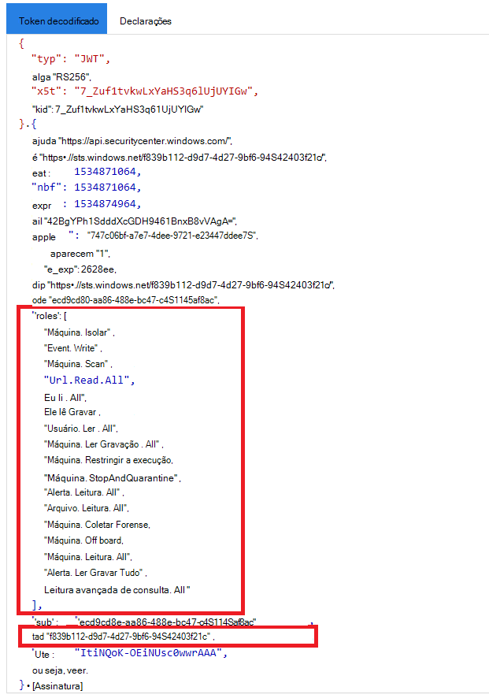

# <a name="create-an-app-to-access-microsoft-defender-for-endpoint-without-a-user"></a>Criar um aplicativo para acessar o Microsoft Defender para Ponto de Extremidade sem um usuário

[!INCLUDE [Microsoft 365 Defender rebranding](../../includes/microsoft-defender.md)]


**Aplica-se a:** [Microsoft Defender para Ponto de Extremidade](https://go.microsoft.com/fwlink/?linkid=2154037)

- Deseja experimentar o Microsoft Defender para Ponto de Extremidade? [Inscreva-se para uma avaliação gratuita.](https://www.microsoft.com/microsoft-365/windows/microsoft-defender-atp?ocid=docs-wdatp-exposedapis-abovefoldlink)

[!include[Microsoft Defender for Endpoint API URIs for US Government](../../includes/microsoft-defender-api-usgov.md)]

[!include[Improve request performance](../../includes/improve-request-performance.md)]

Esta página descreve como criar um aplicativo para obter acesso programático ao Defender para Ponto de Extremidade sem um usuário. Se você precisar de acesso programático ao Defender para Ponto de Extremidade em nome de um usuário, consulte [Obter acesso com o contexto do usuário](exposed-apis-create-app-nativeapp.md). Se você não tem certeza de qual acesso precisa, consulte [Get started](apis-intro.md).

O Microsoft Defender para Ponto de Extremidade expõe grande parte de seus dados e ações por meio de um conjunto de APIs programáticas. Essas APIs ajudarão você a automatizar fluxos de trabalho e inovar com base nos recursos do Defender para Ponto de Extremidade. O acesso à API requer autenticação OAuth2.0. Para obter mais informações, consulte [OAuth 2.0 Authorization Code Flow](/azure/active-directory/develop/active-directory-v2-protocols-oauth-code).

Em geral, você precisará seguir as seguintes etapas para usar as APIs:
- Crie um Azure Active Directory (Azure AD).
- Obter um token de acesso usando este aplicativo.
- Use o token para acessar a API do Defender para Ponto de Extremidade.

Este artigo explica como criar um aplicativo do Azure AD, obter um token de acesso ao Microsoft Defender para Ponto de Extremidade e validar o token.

## <a name="create-an-app"></a>Criar um aplicativo

1. Faça logoff no [Azure](https://portal.azure.com) com um usuário que tenha a **função Administrador Global.**

2. Navegue **até Azure Active Directory** registros do  >  **aplicativo** Novo  >  **registro**. 

   

3. No formulário de registro, escolha um nome para seu aplicativo e selecione **Registrar**.

4. Para permitir que seu aplicativo acesse o Defender para Ponto de Extremidade e atribua a permissão "Ler todos os **alertas",** em sua página de aplicativo, selecione **Permissões** de API Adicionar APIs de permissão que minha organização usa >, digite  >    >   **WindowsDefenderATP** e selecione **WindowsDefenderATP**.

   > [!NOTE]
   > *WindowsDefenderATP* não aparece na lista original. Comece a escrever seu nome na caixa de texto para vê-lo aparecer.

   

   - Selecione **Permissões de aplicativo**  >  **Alert.Read.All** e selecione Adicionar **permissões**.

   

     Você precisa selecionar as permissões relevantes. 'Ler Todos os Alertas' é apenas um exemplo. Por exemplo:

     - Para [executar consultas avançadas,](run-advanced-query-api.md)selecione a permissão "Executar consultas avançadas".
     - Para [isolar um dispositivo,](isolate-machine.md)selecione a permissão 'Isolar máquina'.
     - Para determinar de que permissão você precisa, procure a seção **Permissões** na API que você está interessado em chamar.

5. Selecione **Conceder consentimento**.

     > [!NOTE]
     > Sempre que você adicionar uma permissão, você deve selecionar **Conceder consentimento** para que a nova permissão entre em vigor.

    

6. Para adicionar um segredo ao aplicativo, selecione **Certificados & segredos,** adicione uma descrição ao segredo e selecione **Adicionar**.

    > [!NOTE]
    > Depois de selecionar **Adicionar**, selecione **copiar o valor secreto gerado.** Você não poderá recuperar esse valor depois de sair.

    

7. Anote a ID do aplicativo e a ID do locatário. Na página do aplicativo, vá para **Visão geral** e copie o seguinte.

   

8. **Somente para Parceiros do Microsoft Defender para Pontos de Extremidade**. De definir seu aplicativo como multi locatário (disponível em todos os locatários após o consentimento). Isso é **necessário para** aplicativos de terceiros (por exemplo, se você criar um aplicativo destinado a ser executado no locatário de vários clientes). Isso não **será** necessário se você criar um serviço que você deseja executar apenas em seu locatário (por exemplo, se você criar um aplicativo para seu próprio uso que interagirá apenas com seus próprios dados). Para definir seu aplicativo como multi locatário:

    - Vá para **Autenticação** e adicione `https://portal.azure.com` como o **URI de redirecionamento.**

    - Na parte inferior da página, em Tipos  **de** conta com suporte, selecione Contas em qualquer consentimento de aplicativo de diretório organizacional para seu aplicativo multi-locatário.

    Você precisa que seu aplicativo seja aprovado em cada locatário onde pretende usá-lo. Isso porque seu aplicativo interage com o Defender para o Ponto de Extremidade em nome do cliente.

    Você (ou seu cliente se estiver escrevendo um aplicativo de terceiros) precisa selecionar o link de consentimento e aprovar seu aplicativo. O consentimento deve ser feito com um usuário que tenha privilégios administrativos no Active Directory.

    O link de consentimento é formado da seguinte maneira: 

    ```
    https://login.microsoftonline.com/common/oauth2/authorize?prompt=consent&client_id=00000000-0000-0000-0000-000000000000&response_type=code&sso_reload=true
    ```

    Onde 000000000-0000-0000-0000-000000000000000 é substituído pela ID do aplicativo.


**Pronto!** Você registrou com êxito um aplicativo! Consulte exemplos abaixo para aquisição e validação de token.

## <a name="get-an-access-token"></a>Obter um token de acesso

Para obter mais informações sobre tokens do Azure AD, consulte o tutorial do [Azure AD](/azure/active-directory/develop/active-directory-v2-protocols-oauth-client-creds).

### <a name="use-powershell"></a>Usar o Windows PowerShell!

```powershell
# This script acquires the App Context Token and stores it in the variable $token for later use in the script.
# Paste your Tenant ID, App ID, and App Secret (App key) into the indicated quotes below.

$tenantId = '' ### Paste your tenant ID here
$appId = '' ### Paste your Application ID here
$appSecret = '' ### Paste your Application key here

$resourceAppIdUri = 'https://api.securitycenter.microsoft.com'
$oAuthUri = "https://login.microsoftonline.com/$TenantId/oauth2/token"
$authBody = [Ordered] @{
    resource = "$resourceAppIdUri"
    client_id = "$appId"
    client_secret = "$appSecret"
    grant_type = 'client_credentials'
}
$authResponse = Invoke-RestMethod -Method Post -Uri $oAuthUri -Body $authBody -ErrorAction Stop
$token = $authResponse.access_token
```

### <a name="use-c"></a>Use C#:

O código a seguir foi testado com NuGet Microsoft.IdentityModel.Clients.ActiveDirectory 3.19.8.

1. Crie um novo aplicativo de console.
1. Instale NuGet [Microsoft.IdentityModel.Clients.ActiveDirectory](https://www.nuget.org/packages/Microsoft.IdentityModel.Clients.ActiveDirectory/).
1. Adicione o seguinte:

    ```
    using Microsoft.IdentityModel.Clients.ActiveDirectory;
    ```

1. Copie e colar o seguinte código em seu aplicativo (não se esqueça de atualizar as três variáveis: ```tenantId, appId, appSecret``` ):

    ```
    string tenantId = "00000000-0000-0000-0000-000000000000"; // Paste your own tenant ID here
    string appId = "11111111-1111-1111-1111-111111111111"; // Paste your own app ID here
    string appSecret = "22222222-2222-2222-2222-222222222222"; // Paste your own app secret here for a test, and then store it in a safe place! 

    const string authority = "https://login.microsoftonline.com";
    const string wdatpResourceId = "https://api.securitycenter.microsoft.com";

    AuthenticationContext auth = new AuthenticationContext($"{authority}/{tenantId}/");
    ClientCredential clientCredential = new ClientCredential(appId, appSecret);
    AuthenticationResult authenticationResult = auth.AcquireTokenAsync(wdatpResourceId, clientCredential).GetAwaiter().GetResult();
    string token = authenticationResult.AccessToken;
    ```


### <a name="use-python"></a>Usar Python

Consulte [Obter token usando Python](run-advanced-query-sample-python.md#get-token).

### <a name="use-curl"></a>Usar o cache

> [!NOTE]
> O procedimento a seguir supõe que o Cache para Windows já está instalado em seu computador.

1. Abra um prompt de comando e de CLIENT_ID para sua ID de aplicativo do Azure.
1. De CLIENT_SECRET seu segredo de aplicativo do Azure.
1. De TENANT_ID a ID do locatário do Azure do cliente que deseja usar seu aplicativo para acessar o Defender para Ponto de Extremidade.
1. Execute o seguinte comando:

```
curl -i -X POST -H "Content-Type:application/x-www-form-urlencoded" -d "grant_type=client_credentials" -d "client_id=%CLIENT_ID%" -d "scope=https://securitycenter.onmicrosoft.com/windowsatpservice/.default" -d "client_secret=%CLIENT_SECRET%" "https://login.microsoftonline.com/%TENANT_ID%/oauth2/v2.0/token" -k
```

Você receberá uma resposta no seguinte formulário:

```
{"token_type":"Bearer","expires_in":3599,"ext_expires_in":0,"access_token":"eyJ0eXAiOiJKV1QiLCJhbGciOiJSUzI1NiIsIn <truncated> aWReH7P0s0tjTBX8wGWqJUdDA"}
```

## <a name="validate-the-token"></a>Validar o token

Verifique se você tem o token correto:

1. Copie e colar o token que você recebeu na etapa anterior em [JWT](https://jwt.ms) para decodificá-lo.
1. Validar se você recebe uma declaração de "funções" com as permissões desejadas
1. Na imagem a seguir, você pode ver um token decodificado adquirido de um aplicativo com permissões para todas as funções do Microsoft Defender para o Ponto de Extremidade:



## <a name="use-the-token-to-access-microsoft-defender-for-endpoint-api"></a>Usar o token para acessar a API do Microsoft Defender for Endpoint

1. Escolha a API que você deseja usar. Para obter mais informações, consulte [Supported Defender for Endpoint APIs](exposed-apis-list.md).
1. De definir o cabeçalho de autorização na solicitação http que você envia para "Portador {token}" (Portador é o esquema de autorização).
1. O tempo de expiração do token é de uma hora. Você pode enviar mais de uma solicitação com o mesmo token.

Veja a seguir um exemplo de envio de uma solicitação para obter uma lista de alertas **usando C#**: 
```
    var httpClient = new HttpClient();

    var request = new HttpRequestMessage(HttpMethod.Get, "https://api.securitycenter.microsoft.com/api/alerts");

    request.Headers.Authorization = new AuthenticationHeaderValue("Bearer", token);

    var response = httpClient.SendAsync(request).GetAwaiter().GetResult();

    // Do something useful with the response
```

## <a name="see-also"></a>Confira também
- [Suporte de APIs do Microsoft Defender para Ponto de Extremidade](exposed-apis-list.md)
- [Acessar o Microsoft Defender para Ponto de Extremidade em nome de um usuário](exposed-apis-create-app-nativeapp.md)
