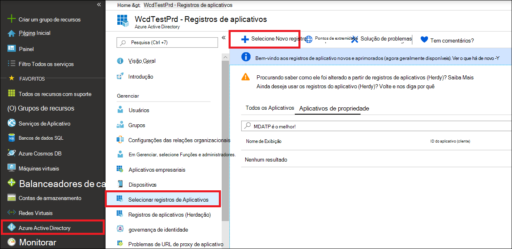

# <a name="create-an-app-to-access-microsoft-defender-for-endpoint-without-a-user"></a><span data-ttu-id="a9a58-104">Criar um aplicativo para acessar o Microsoft Defender para Ponto de Extremidade sem um usuário</span><span class="sxs-lookup"><span data-stu-id="a9a58-104">Create an app to access Microsoft Defender for Endpoint without a user</span></span>

[!INCLUDE [Microsoft 365 Defender rebranding](../../includes/microsoft-defender.md)]


<span data-ttu-id="a9a58-105">**Aplica-se a:** [Microsoft Defender para Ponto de Extremidade](https://go.microsoft.com/fwlink/?linkid=2154037)</span><span class="sxs-lookup"><span data-stu-id="a9a58-105">**Applies to:** [Microsoft Defender for Endpoint](https://go.microsoft.com/fwlink/?linkid=2154037)</span></span>

- <span data-ttu-id="a9a58-106">Deseja experimentar o Microsoft Defender para Ponto de Extremidade?</span><span class="sxs-lookup"><span data-stu-id="a9a58-106">Want to experience Microsoft Defender for Endpoint?</span></span> [<span data-ttu-id="a9a58-107">Inscreva-se para uma avaliação gratuita.</span><span class="sxs-lookup"><span data-stu-id="a9a58-107">Sign up for a free trial.</span></span>](https://www.microsoft.com/microsoft-365/windows/microsoft-defender-atp?ocid=docs-wdatp-exposedapis-abovefoldlink)

[!include[Microsoft Defender for Endpoint API URIs for US Government](../../includes/microsoft-defender-api-usgov.md)]

[!include[Improve request performance](../../includes/improve-request-performance.md)]

<span data-ttu-id="a9a58-108">Esta página descreve como criar um aplicativo para obter acesso programático ao Defender para Ponto de Extremidade sem um usuário.</span><span class="sxs-lookup"><span data-stu-id="a9a58-108">This page describes how to create an application to get programmatic access to Defender for Endpoint without a user.</span></span> <span data-ttu-id="a9a58-109">Se você precisar de acesso programático ao Defender para Ponto de Extremidade em nome de um usuário, consulte [Obter acesso com o contexto do usuário](exposed-apis-create-app-nativeapp.md).</span><span class="sxs-lookup"><span data-stu-id="a9a58-109">If you need programmatic access to Defender for Endpoint on behalf of a user, see [Get access with user context](exposed-apis-create-app-nativeapp.md).</span></span> <span data-ttu-id="a9a58-110">Se você não tem certeza de qual acesso precisa, consulte [Get started](apis-intro.md).</span><span class="sxs-lookup"><span data-stu-id="a9a58-110">If you are not sure which access you need, see [Get started](apis-intro.md).</span></span>

<span data-ttu-id="a9a58-111">O Microsoft Defender para Ponto de Extremidade expõe grande parte de seus dados e ações por meio de um conjunto de APIs programáticas.</span><span class="sxs-lookup"><span data-stu-id="a9a58-111">Microsoft Defender for Endpoint exposes much of its data and actions through a set of programmatic APIs.</span></span> <span data-ttu-id="a9a58-112">Essas APIs ajudarão você a automatizar fluxos de trabalho e inovar com base nos recursos do Defender para Ponto de Extremidade.</span><span class="sxs-lookup"><span data-stu-id="a9a58-112">Those APIs will help you automate work flows and innovate based on Defender for Endpoint capabilities.</span></span> <span data-ttu-id="a9a58-113">O acesso à API requer autenticação OAuth2.0.</span><span class="sxs-lookup"><span data-stu-id="a9a58-113">The API access requires OAuth2.0 authentication.</span></span> <span data-ttu-id="a9a58-114">Para obter mais informações, consulte [OAuth 2.0 Authorization Code Flow](https://docs.microsoft.com/azure/active-directory/develop/active-directory-v2-protocols-oauth-code).</span><span class="sxs-lookup"><span data-stu-id="a9a58-114">For more information, see [OAuth 2.0 Authorization Code Flow](https://docs.microsoft.com/azure/active-directory/develop/active-directory-v2-protocols-oauth-code).</span></span>

<span data-ttu-id="a9a58-115">Em geral, você precisará seguir as seguintes etapas para usar as APIs:</span><span class="sxs-lookup"><span data-stu-id="a9a58-115">In general, you’ll need to take the following steps to use the APIs:</span></span>
- <span data-ttu-id="a9a58-116">Crie um Azure Active Directory (Azure AD).</span><span class="sxs-lookup"><span data-stu-id="a9a58-116">Create an Azure Active Directory (Azure AD) application.</span></span>
- <span data-ttu-id="a9a58-117">Obter um token de acesso usando este aplicativo.</span><span class="sxs-lookup"><span data-stu-id="a9a58-117">Get an access token using this application.</span></span>
- <span data-ttu-id="a9a58-118">Use o token para acessar a API do Defender para Ponto de Extremidade.</span><span class="sxs-lookup"><span data-stu-id="a9a58-118">Use the token to access Defender for Endpoint API.</span></span>

<span data-ttu-id="a9a58-119">Este artigo explica como criar um aplicativo do Azure AD, obter um token de acesso ao Microsoft Defender para Ponto de Extremidade e validar o token.</span><span class="sxs-lookup"><span data-stu-id="a9a58-119">This article explains how to create an Azure AD application, get an access token to Microsoft Defender for Endpoint, and validate the token.</span></span>

## <a name="create-an-app"></a><span data-ttu-id="a9a58-120">Criar um aplicativo</span><span class="sxs-lookup"><span data-stu-id="a9a58-120">Create an app</span></span>

1. <span data-ttu-id="a9a58-121">Faça logoff no [Azure](https://portal.azure.com) com um usuário que tenha a **função Administrador Global.**</span><span class="sxs-lookup"><span data-stu-id="a9a58-121">Log on to [Azure](https://portal.azure.com) with a user that has the **Global Administrator** role.</span></span>

2. <span data-ttu-id="a9a58-122">Navegue **até Azure Active Directory** registros do  >  **aplicativo** Novo  >  **registro**.</span><span class="sxs-lookup"><span data-stu-id="a9a58-122">Navigate to **Azure Active Directory** > **App registrations** > **New registration**.</span></span> 

   

3. <span data-ttu-id="a9a58-124">No formulário de registro, escolha um nome para seu aplicativo e selecione **Registrar**.</span><span class="sxs-lookup"><span data-stu-id="a9a58-124">In the registration form, choose a name for your application, and then select **Register**.</span></span>

4. <span data-ttu-id="a9a58-125">Para permitir que seu aplicativo acesse o Defender para Ponto de Extremidade e atribua a permissão "Ler todos os **alertas",** em sua página de aplicativo, selecione **Permissões** de API Adicionar APIs de permissão que minha organização usa >, digite  >    >   **WindowsDefenderATP** e selecione **WindowsDefenderATP**.</span><span class="sxs-lookup"><span data-stu-id="a9a58-125">To enable your app to access Defender for Endpoint and assign it **'Read all alerts'** permission, on your application page, select **API Permissions** > **Add permission** > **APIs my organization uses** >, type **WindowsDefenderATP**, and then select **WindowsDefenderATP**.</span></span>

   > [!NOTE]
   > <span data-ttu-id="a9a58-126">*WindowsDefenderATP* não aparece na lista original.</span><span class="sxs-lookup"><span data-stu-id="a9a58-126">*WindowsDefenderATP* does not appear in the original list.</span></span> <span data-ttu-id="a9a58-127">Comece a escrever seu nome na caixa de texto para vê-lo aparecer.</span><span class="sxs-lookup"><span data-stu-id="a9a58-127">Start writing its name in the text box to see it appear.</span></span>

   

   - <span data-ttu-id="a9a58-129">Selecione **Permissões de aplicativo**  >  **Alert.Read.All** e selecione Adicionar **permissões**.</span><span class="sxs-lookup"><span data-stu-id="a9a58-129">Select **Application permissions** > **Alert.Read.All**, and then select **Add permissions**.</span></span>

   

     <span data-ttu-id="a9a58-131">Você precisa selecionar as permissões relevantes.</span><span class="sxs-lookup"><span data-stu-id="a9a58-131">You need to select the relevant permissions.</span></span> <span data-ttu-id="a9a58-132">'Ler Todos os Alertas' é apenas um exemplo.</span><span class="sxs-lookup"><span data-stu-id="a9a58-132">'Read All Alerts' is only an example.</span></span> <span data-ttu-id="a9a58-133">Por exemplo:</span><span class="sxs-lookup"><span data-stu-id="a9a58-133">For instance:</span></span>

     - <span data-ttu-id="a9a58-134">Para [executar consultas avançadas,](run-advanced-query-api.md)selecione a permissão "Executar consultas avançadas".</span><span class="sxs-lookup"><span data-stu-id="a9a58-134">To [run advanced queries](run-advanced-query-api.md), select the 'Run advanced queries' permission.</span></span>
     - <span data-ttu-id="a9a58-135">Para [isolar um dispositivo,](isolate-machine.md)selecione a permissão 'Isolar máquina'.</span><span class="sxs-lookup"><span data-stu-id="a9a58-135">To [isolate a device](isolate-machine.md), select the 'Isolate machine' permission.</span></span>
     - <span data-ttu-id="a9a58-136">Para determinar de que permissão você precisa, procure a seção **Permissões** na API que você está interessado em chamar.</span><span class="sxs-lookup"><span data-stu-id="a9a58-136">To determine which permission you need, look at the **Permissions** section in the API you are interested to call.</span></span>

5. <span data-ttu-id="a9a58-137">Selecione **Conceder consentimento**.</span><span class="sxs-lookup"><span data-stu-id="a9a58-137">Select **Grant consent**.</span></span>

     > [!NOTE]
     > <span data-ttu-id="a9a58-138">Sempre que você adicionar uma permissão, você deve selecionar **Conceder consentimento** para que a nova permissão entre em vigor.</span><span class="sxs-lookup"><span data-stu-id="a9a58-138">Every time you add a permission, you must select **Grant consent** for the new permission to take effect.</span></span>

    

6. <span data-ttu-id="a9a58-140">Para adicionar um segredo ao aplicativo, selecione **Certificados & segredos,** adicione uma descrição ao segredo e selecione **Adicionar**.</span><span class="sxs-lookup"><span data-stu-id="a9a58-140">To add a secret to the application, select **Certificates & secrets**, add a description to the secret, and then select **Add**.</span></span>

    > [!NOTE]
    > <span data-ttu-id="a9a58-141">Depois de selecionar **Adicionar**, selecione **copiar o valor secreto gerado.**</span><span class="sxs-lookup"><span data-stu-id="a9a58-141">After you select **Add**, select **copy the generated secret value**.</span></span> <span data-ttu-id="a9a58-142">Você não poderá recuperar esse valor depois de sair.</span><span class="sxs-lookup"><span data-stu-id="a9a58-142">You won't be able to retrieve this value after you leave.</span></span>

    

7. <span data-ttu-id="a9a58-144">Anote a ID do aplicativo e a ID do locatário.</span><span class="sxs-lookup"><span data-stu-id="a9a58-144">Write down your application ID and your tenant ID.</span></span> <span data-ttu-id="a9a58-145">Na página do aplicativo, vá para **Visão geral** e copie o seguinte.</span><span class="sxs-lookup"><span data-stu-id="a9a58-145">On your application page, go to **Overview** and copy the following.</span></span>

   

8. <span data-ttu-id="a9a58-147">**Somente para Parceiros do Microsoft Defender para Pontos de Extremidade**.</span><span class="sxs-lookup"><span data-stu-id="a9a58-147">**For Microsoft Defender for Endpoint Partners only**.</span></span> <span data-ttu-id="a9a58-148">De definir seu aplicativo como multi locatário (disponível em todos os locatários após o consentimento).</span><span class="sxs-lookup"><span data-stu-id="a9a58-148">Set your app to be multi-tenanted (available in all tenants after consent).</span></span> <span data-ttu-id="a9a58-149">Isso é **necessário para** aplicativos de terceiros (por exemplo, se você criar um aplicativo destinado a ser executado no locatário de vários clientes).</span><span class="sxs-lookup"><span data-stu-id="a9a58-149">This is **required** for third-party apps (for example, if you create an app that is intended to run in multiple customers' tenant).</span></span> <span data-ttu-id="a9a58-150">Isso não **será** necessário se você criar um serviço que você deseja executar apenas em seu locatário (por exemplo, se você criar um aplicativo para seu próprio uso que interagirá apenas com seus próprios dados).</span><span class="sxs-lookup"><span data-stu-id="a9a58-150">This is **not required** if you create a service that you want to run in your tenant only (for example, if you create an application for your own usage that will only interact with your own data).</span></span> <span data-ttu-id="a9a58-151">Para definir seu aplicativo como multi locatário:</span><span class="sxs-lookup"><span data-stu-id="a9a58-151">To set your app to be multi-tenanted:</span></span>

    - <span data-ttu-id="a9a58-152">Vá para **Autenticação** e adicione `https://portal.azure.com` como o **URI de redirecionamento.**</span><span class="sxs-lookup"><span data-stu-id="a9a58-152">Go to **Authentication**, and add `https://portal.azure.com` as the **Redirect URI**.</span></span>

    - <span data-ttu-id="a9a58-153">Na parte inferior da página, em Tipos  **de** conta com suporte, selecione Contas em qualquer consentimento de aplicativo de diretório organizacional para seu aplicativo multi-locatário.</span><span class="sxs-lookup"><span data-stu-id="a9a58-153">On the bottom of the page, under **Supported account types**, select the **Accounts in any organizational directory** application consent for your multi-tenant app.</span></span>

    <span data-ttu-id="a9a58-154">Você precisa que seu aplicativo seja aprovado em cada locatário onde pretende usá-lo.</span><span class="sxs-lookup"><span data-stu-id="a9a58-154">You need your application to be approved in each tenant where you intend to use it.</span></span> <span data-ttu-id="a9a58-155">Isso porque seu aplicativo interage com o Defender para o Ponto de Extremidade em nome do cliente.</span><span class="sxs-lookup"><span data-stu-id="a9a58-155">This is because your application interacts Defender for Endpoint on behalf of your customer.</span></span>

    <span data-ttu-id="a9a58-156">Você (ou seu cliente se estiver escrevendo um aplicativo de terceiros) precisa selecionar o link de consentimento e aprovar seu aplicativo.</span><span class="sxs-lookup"><span data-stu-id="a9a58-156">You (or your customer if you are writing a third-party app) need to select the consent link and approve your app.</span></span> <span data-ttu-id="a9a58-157">O consentimento deve ser feito com um usuário que tenha privilégios administrativos no Active Directory.</span><span class="sxs-lookup"><span data-stu-id="a9a58-157">The consent should be done with a user who has administrative privileges in Active Directory.</span></span>

    <span data-ttu-id="a9a58-158">O link de consentimento é formado da seguinte maneira:</span><span class="sxs-lookup"><span data-stu-id="a9a58-158">The consent link is formed as follows:</span></span> 

    ```
    https://login.microsoftonline.com/common/oauth2/authorize?prompt=consent&client_id=00000000-0000-0000-0000-000000000000&response_type=code&sso_reload=true
    ```

    <span data-ttu-id="a9a58-159">Onde 000000000-0000-0000-0000-000000000000000 é substituído pela ID do aplicativo.</span><span class="sxs-lookup"><span data-stu-id="a9a58-159">Where 00000000-0000-0000-0000-000000000000 is replaced with your application ID.</span></span>


<span data-ttu-id="a9a58-160">**Pronto!**</span><span class="sxs-lookup"><span data-stu-id="a9a58-160">**Done!**</span></span> <span data-ttu-id="a9a58-161">Você registrou com êxito um aplicativo!</span><span class="sxs-lookup"><span data-stu-id="a9a58-161">You have successfully registered an application!</span></span> <span data-ttu-id="a9a58-162">Consulte exemplos abaixo para aquisição e validação de token.</span><span class="sxs-lookup"><span data-stu-id="a9a58-162">See examples below for token acquisition and validation.</span></span>

## <a name="get-an-access-token"></a><span data-ttu-id="a9a58-163">Obter um token de acesso</span><span class="sxs-lookup"><span data-stu-id="a9a58-163">Get an access token</span></span>

<span data-ttu-id="a9a58-164">Para obter mais informações sobre tokens do Azure AD, consulte o tutorial do [Azure AD](https://docs.microsoft.com/azure/active-directory/develop/active-directory-v2-protocols-oauth-client-creds).</span><span class="sxs-lookup"><span data-stu-id="a9a58-164">For more information on Azure AD tokens, see the [Azure AD tutorial](https://docs.microsoft.com/azure/active-directory/develop/active-directory-v2-protocols-oauth-client-creds).</span></span>

### <a name="use-powershell"></a><span data-ttu-id="a9a58-165">Usar o Windows PowerShell!</span><span class="sxs-lookup"><span data-stu-id="a9a58-165">Use PowerShell</span></span>

```powershell
# This script acquires the App Context Token and stores it in the variable $token for later use in the script.
# Paste your Tenant ID, App ID, and App Secret (App key) into the indicated quotes below.

$tenantId = '' ### Paste your tenant ID here
$appId = '' ### Paste your Application ID here
$appSecret = '' ### Paste your Application key here

$resourceAppIdUri = 'https://api.securitycenter.microsoft.com'
$oAuthUri = "https://login.microsoftonline.com/$TenantId/oauth2/token"
$authBody = [Ordered] @{
    resource = "$resourceAppIdUri"
    client_id = "$appId"
    client_secret = "$appSecret"
    grant_type = 'client_credentials'
}
$authResponse = Invoke-RestMethod -Method Post -Uri $oAuthUri -Body $authBody -ErrorAction Stop
$token = $authResponse.access_token
```

### <a name="use-c"></a><span data-ttu-id="a9a58-166">Use C#:</span><span class="sxs-lookup"><span data-stu-id="a9a58-166">Use C#:</span></span>

<span data-ttu-id="a9a58-167">O código a seguir foi testado com NuGet Microsoft.IdentityModel.Clients.ActiveDirectory 3.19.8.</span><span class="sxs-lookup"><span data-stu-id="a9a58-167">The following code was tested with NuGet Microsoft.IdentityModel.Clients.ActiveDirectory 3.19.8.</span></span>

1. <span data-ttu-id="a9a58-168">Crie um novo aplicativo de console.</span><span class="sxs-lookup"><span data-stu-id="a9a58-168">Create a new console application.</span></span>
1. <span data-ttu-id="a9a58-169">Instale NuGet [Microsoft.IdentityModel.Clients.ActiveDirectory](https://www.nuget.org/packages/Microsoft.IdentityModel.Clients.ActiveDirectory/).</span><span class="sxs-lookup"><span data-stu-id="a9a58-169">Install NuGet [Microsoft.IdentityModel.Clients.ActiveDirectory](https://www.nuget.org/packages/Microsoft.IdentityModel.Clients.ActiveDirectory/).</span></span>
1. <span data-ttu-id="a9a58-170">Adicione o seguinte:</span><span class="sxs-lookup"><span data-stu-id="a9a58-170">Add the following:</span></span>

    ```
    using Microsoft.IdentityModel.Clients.ActiveDirectory;
    ```

1. <span data-ttu-id="a9a58-171">Copie e colar o seguinte código em seu aplicativo (não se esqueça de atualizar as três variáveis: ```tenantId, appId, appSecret``` ):</span><span class="sxs-lookup"><span data-stu-id="a9a58-171">Copy and paste the following code in your app (don't forget to update the three variables: ```tenantId, appId, appSecret```):</span></span>

    ```
    string tenantId = "00000000-0000-0000-0000-000000000000"; // Paste your own tenant ID here
    string appId = "11111111-1111-1111-1111-111111111111"; // Paste your own app ID here
    string appSecret = "22222222-2222-2222-2222-222222222222"; // Paste your own app secret here for a test, and then store it in a safe place! 

    const string authority = "https://login.microsoftonline.com";
    const string wdatpResourceId = "https://api.securitycenter.microsoft.com";

    AuthenticationContext auth = new AuthenticationContext($"{authority}/{tenantId}/");
    ClientCredential clientCredential = new ClientCredential(appId, appSecret);
    AuthenticationResult authenticationResult = auth.AcquireTokenAsync(wdatpResourceId, clientCredential).GetAwaiter().GetResult();
    string token = authenticationResult.AccessToken;
    ```


### <a name="use-python"></a><span data-ttu-id="a9a58-172">Usar Python</span><span class="sxs-lookup"><span data-stu-id="a9a58-172">Use Python</span></span>

<span data-ttu-id="a9a58-173">Consulte [Obter token usando Python](run-advanced-query-sample-python.md#get-token).</span><span class="sxs-lookup"><span data-stu-id="a9a58-173">See [Get token using Python](run-advanced-query-sample-python.md#get-token).</span></span>

### <a name="use-curl"></a><span data-ttu-id="a9a58-174">Usar o cache</span><span class="sxs-lookup"><span data-stu-id="a9a58-174">Use Curl</span></span>

> [!NOTE]
> <span data-ttu-id="a9a58-175">O procedimento a seguir supõe que o Cache para Windows já está instalado em seu computador.</span><span class="sxs-lookup"><span data-stu-id="a9a58-175">The following procedure assumes that Curl for Windows is already installed on your computer.</span></span>

1. <span data-ttu-id="a9a58-176">Abra um prompt de comando e de CLIENT_ID para sua ID de aplicativo do Azure.</span><span class="sxs-lookup"><span data-stu-id="a9a58-176">Open a command prompt, and set CLIENT_ID to your Azure application ID.</span></span>
1. <span data-ttu-id="a9a58-177">De CLIENT_SECRET seu segredo de aplicativo do Azure.</span><span class="sxs-lookup"><span data-stu-id="a9a58-177">Set CLIENT_SECRET to your Azure application secret.</span></span>
1. <span data-ttu-id="a9a58-178">De TENANT_ID a ID do locatário do Azure do cliente que deseja usar seu aplicativo para acessar o Defender para Ponto de Extremidade.</span><span class="sxs-lookup"><span data-stu-id="a9a58-178">Set TENANT_ID to the Azure tenant ID of the customer that wants to use your app to access Defender for Endpoint.</span></span>
1. <span data-ttu-id="a9a58-179">Execute o seguinte comando:</span><span class="sxs-lookup"><span data-stu-id="a9a58-179">Run the following command:</span></span>

```
curl -i -X POST -H "Content-Type:application/x-www-form-urlencoded" -d "grant_type=client_credentials" -d "client_id=%CLIENT_ID%" -d "scope=https://securitycenter.onmicrosoft.com/windowsatpservice/.default" -d "client_secret=%CLIENT_SECRET%" "https://login.microsoftonline.com/%TENANT_ID%/oauth2/v2.0/token" -k
```

<span data-ttu-id="a9a58-180">Você receberá uma resposta no seguinte formulário:</span><span class="sxs-lookup"><span data-stu-id="a9a58-180">You will get an answer in the following form:</span></span>

```
{"token_type":"Bearer","expires_in":3599,"ext_expires_in":0,"access_token":"eyJ0eXAiOiJKV1QiLCJhbGciOiJSUzI1NiIsIn <truncated> aWReH7P0s0tjTBX8wGWqJUdDA"}
```

## <a name="validate-the-token"></a><span data-ttu-id="a9a58-181">Validar o token</span><span class="sxs-lookup"><span data-stu-id="a9a58-181">Validate the token</span></span>

<span data-ttu-id="a9a58-182">Verifique se você tem o token correto:</span><span class="sxs-lookup"><span data-stu-id="a9a58-182">Ensure that you got the correct token:</span></span>

1. <span data-ttu-id="a9a58-183">Copie e colar o token que você recebeu na etapa anterior em [JWT](https://jwt.ms) para decodificá-lo.</span><span class="sxs-lookup"><span data-stu-id="a9a58-183">Copy and paste the token you got in the previous step into [JWT](https://jwt.ms) in order to decode it.</span></span>
1. <span data-ttu-id="a9a58-184">Validar se você recebe uma declaração de "funções" com as permissões desejadas</span><span class="sxs-lookup"><span data-stu-id="a9a58-184">Validate that you get a 'roles' claim with the desired permissions</span></span>
1. <span data-ttu-id="a9a58-185">Na imagem a seguir, você pode ver um token decodificado adquirido de um aplicativo com permissões para todas as funções do Microsoft Defender para o Ponto de Extremidade:</span><span class="sxs-lookup"><span data-stu-id="a9a58-185">In the following image, you can see a decoded token acquired from an app with permissions to all of  Microsoft Defender for Endpoint's roles:</span></span>


## <a name="use-the-token-to-access-microsoft-defender-for-endpoint-api"></a><span data-ttu-id="a9a58-187">Usar o token para acessar a API do Microsoft Defender for Endpoint</span><span class="sxs-lookup"><span data-stu-id="a9a58-187">Use the token to access Microsoft Defender for Endpoint API</span></span>

1. <span data-ttu-id="a9a58-188">Escolha a API que você deseja usar.</span><span class="sxs-lookup"><span data-stu-id="a9a58-188">Choose the API you want to use.</span></span> <span data-ttu-id="a9a58-189">Para obter mais informações, consulte [Supported Defender for Endpoint APIs](exposed-apis-list.md).</span><span class="sxs-lookup"><span data-stu-id="a9a58-189">For more information, see [Supported Defender for Endpoint APIs](exposed-apis-list.md).</span></span>
1. <span data-ttu-id="a9a58-190">De definir o cabeçalho de autorização na solicitação http que você envia para "Portador {token}" (Portador é o esquema de autorização).</span><span class="sxs-lookup"><span data-stu-id="a9a58-190">Set the authorization header in the http request you send to "Bearer {token}" (Bearer is the authorization scheme).</span></span>
1. <span data-ttu-id="a9a58-191">O tempo de expiração do token é de uma hora.</span><span class="sxs-lookup"><span data-stu-id="a9a58-191">The expiration time of the token is one hour.</span></span> <span data-ttu-id="a9a58-192">Você pode enviar mais de uma solicitação com o mesmo token.</span><span class="sxs-lookup"><span data-stu-id="a9a58-192">You can send more than one request with the same token.</span></span>

<span data-ttu-id="a9a58-193">Veja a seguir um exemplo de envio de uma solicitação para obter uma lista de alertas **usando C#**:</span><span class="sxs-lookup"><span data-stu-id="a9a58-193">The following is an example of sending a request to get a list of alerts **using C#**:</span></span> 
```
    var httpClient = new HttpClient();

    var request = new HttpRequestMessage(HttpMethod.Get, "https://api.securitycenter.microsoft.com/api/alerts");

    request.Headers.Authorization = new AuthenticationHeaderValue("Bearer", token);

    var response = httpClient.SendAsync(request).GetAwaiter().GetResult();

    // Do something useful with the response
```

## <a name="see-also"></a><span data-ttu-id="a9a58-194">Confira também</span><span class="sxs-lookup"><span data-stu-id="a9a58-194">See also</span></span>
- [<span data-ttu-id="a9a58-195">Suporte de APIs do Microsoft Defender para Ponto de Extremidade</span><span class="sxs-lookup"><span data-stu-id="a9a58-195">Supported Microsoft Defender for Endpoint APIs</span></span>](exposed-apis-list.md)
- [<span data-ttu-id="a9a58-196">Acessar o Microsoft Defender para Ponto de Extremidade em nome de um usuário</span><span class="sxs-lookup"><span data-stu-id="a9a58-196">Access Microsoft Defender for Endpoint on behalf of a user</span></span>](exposed-apis-create-app-nativeapp.md)
