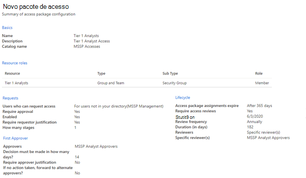

# Conceder acesso ao MSSP (provedor de serviços de segurança gerenciado) (visualização)Grant managed security service provider (MSSP) access (preview)

[!INCLUDE [Microsoft 365 Defender rebranding](../../includes/microsoft-defender.md)]

**Aplica-se a:****Applies to:**
- [Microsoft Defender para Ponto de ExtremidadeMicrosoft Defender for Endpoint](https://go.microsoft.com/fwlink/p/?linkid=2154037)
- [Microsoft 365 DefenderMicrosoft 365 Defender](https://go.microsoft.com/fwlink/?linkid=2118804)

>Deseja experimentar o Defender para Ponto de Extremidade?Want to experience Defender for Endpoint? [Inscreva-se para uma avaliação gratuita.Sign up for a free trial.](https://www.microsoft.com/microsoft-365/windows/microsoft-defender-atp?ocid=docs-mssp-support-abovefoldlink)

>[!IMPORTANT] 
>Algumas informações estão relacionadas a produtos pré-lançados que podem ser substancialmente modificados antes de seu lançamento comercial.Some information relates to prereleased product which may be substantially modified before it's commercially released. A Microsoft não faz garantias, expressas ou implícitas, quanto às informações fornecidas aqui.Microsoft makes no warranties, express or implied, with respect to the information provided here.

Para implementar uma solução de acesso delegado de vários locatários, tome as seguintes etapas:To implement a multi-tenant delegated access solution, take the following steps:

1. Habilita o controle de acesso baseado em função no Defender para Ponto de Extremidade e [conecte-se](rbac.md) com grupos do Active Directory (AD).Enable [role-based access control](rbac.md) in Defender for Endpoint and connect with Active Directory (AD) groups.

2. Configurar [Pacotes de Acesso à Governança](/azure/active-directory/governance/identity-governance-overview) para solicitação e provisionamento de acesso.Configure [Governance Access Packages](/azure/active-directory/governance/identity-governance-overview) for access request and provisioning.

3. Gerenciar solicitações e auditorias de acesso no [Microsoft Myaccess](/azure/active-directory/governance/entitlement-management-request-approve).Manage access requests and audits in [Microsoft Myaccess](/azure/active-directory/governance/entitlement-management-request-approve).

## Habilitar controles de acesso baseados em função no Microsoft Defender para Ponto de ExtremidadeEnable role-based access controls in Microsoft Defender for Endpoint

1. **Criar grupos de acesso para recursos MSSP no AAD do Cliente: Grupos****Create access groups for MSSP resources in Customer AAD: Groups**

    Esses grupos serão vinculados às Funções que você criar no Defender para Ponto de Extremidade.These groups will be linked to the Roles you create in Defender for Endpoint. Para fazer isso, no locatário do AD do cliente, crie três grupos.To do so, in the customer AD tenant, create three groups. Em nossa abordagem de exemplo, criamos os seguintes grupos:In our example approach, we create the following groups:

    - Analista de Camada 1Tier 1 Analyst 
    - Analista de Camada 2Tier 2 Analyst 
    - Aprovadores do analista MSSPMSSP Analyst Approvers  

2. Crie funções do Defender para Ponto de Extremidade para níveis de acesso apropriados no Customer Defender for Endpoint.Create Defender for Endpoint roles for appropriate access levels in Customer Defender for Endpoint.

    Para habilitar o RBAC no cliente Central de Segurança do Microsoft Defender, acesse Configurações > Permissões > **Funções** e "Ativar funções", de uma conta de usuário com direitos de Administrador Global ou Administrador de Segurança.To enable RBAC in the customer Microsoft Defender Security Center, access **Settings > Permissions > Roles** and "Turn on roles", from a user account with Global Administrator or Security Administrator rights.

    

    Em seguida, crie funções RBAC para atender às necessidades de Camada SOC do MSSP.Then, create RBAC roles to meet MSSP SOC Tier needs. Vincule essas funções aos grupos de usuários criados por meio de "Grupos de usuários atribuídos".Link these roles to the created user groups via "Assigned user groups".

    Duas funções possíveis:Two possible roles:

    - **Analistas de Camada 1****Tier 1 Analysts**  
      Execute todas as ações, exceto a resposta ao vivo e gerencie as configurações de segurança.Perform all actions except for live response and manage security settings.

    - **Analistas de Camada 2****Tier 2 Analysts**  
      Recursos de camada 1 com a adição à [resposta ao vivo](live-response.md)Tier 1 capabilities with the addition to [live response](live-response.md)

    Para obter mais informações, [consulte Use role-based access control](rbac.md).For more information, see [Use role-based access control](rbac.md).

## Configurar pacotes de Acesso à GovernançaConfigure Governance Access Packages

1.  **Adicionar MSSP como Organização Conectada no AAD do Cliente: Governança de Identidade****Add MSSP as Connected Organization in Customer AAD: Identity Governance**
    
    Adicionar o MSSP como uma organização conectada permitirá que o MSSP solicite e tenha acessos provisionados.Adding the MSSP as a connected organization will allow the MSSP to request and have accesses provisioned. 

    Para fazer isso, no locatário do AD do cliente, acesse Governança de Identidade: Organização conectada.To do so, in the customer AD tenant, access Identity Governance: Connected organization. Adicione uma nova organização e pesquise seu locatário do Analista MSSP por meio da ID do Locatário ou domínio.Add a new organization and search for your MSSP Analyst tenant via Tenant ID or Domain. Sugerimos a criação de um locatário AD separado para seus Analistas MSSP.We suggest creating a separate AD tenant for your MSSP Analysts.

2. **Criar um catálogo de recursos no AAD do Cliente: Governança de Identidade****Create a resource catalog in Customer AAD: Identity Governance**

    Catálogos de recursos são uma coleção lógica de pacotes de acesso, criada no locatário do AD do cliente.Resource catalogs are a logical collection of access packages, created in the customer AD tenant.

    Para fazer isso, no locatário do AD do cliente, acesse a Governança de Identidade: Catálogos e adicione **Novo Catálogo.**To do so, in the customer AD tenant,  access Identity Governance: Catalogs, and add **New Catalog**. No nosso exemplo, vamos chamá-lo **de Acessos MSSP.**In our example, we will call it **MSSP Accesses**. 

    

    Mais informações em [Criar um catálogo de recursos.](/azure/active-directory/governance/entitlement-management-catalog-create)Further more information, see [Create a catalog of resources](/azure/active-directory/governance/entitlement-management-catalog-create).

3. **Criar pacotes de acesso para recursos MSSP Customer AAD: Identity Governance****Create access packages for MSSP resources Customer AAD: Identity Governance**

    Pacotes de acesso são a coleção de direitos e acessos que um solicitante será concedido mediante aprovação.Access packages are the collection of rights and accesses that a requestor will be granted upon approval. 

    Para fazer isso, no locatário do AD do cliente, acesse Governança de Identidade: Pacotes de Acesso e **adicione Novo Pacote de Acesso.**To do so, in the customer AD tenant, access Identity Governance: Access Packages, and add **New Access Package**. Crie um pacote de acesso para os aprovadores do MSSP e cada camada de analista.Create an access package for the MSSP approvers and each analyst tier. Por exemplo, a seguinte configuração de Analista de Camada 1 cria um pacote de acesso que:For example, the following Tier 1 Analyst configuration creates an access package that:

    - Requer um membro do grupo AD Aprovadores de **Analista MSSP** para autorizar novas solicitaçõesRequires a member of the AD group **MSSP Analyst Approvers** to authorize new requests
    - Tem avaliações de acesso anual, onde os analistas do SOC podem solicitar uma extensão de acessoHas annual access reviews, where the SOC analysts can request an access extension
    - Só pode ser solicitado por usuários no Locatário SOC do MSSPCan only be requested by users in the MSSP SOC Tenant
    - O access auto expira após 365 diasAccess auto expires after 365 days

    > [!div class="mx-imgBorder"]
    > 

    Para obter mais informações, [consulte Create a new access package](/azure/active-directory/governance/entitlement-management-access-package-create).For more information, see [Create a new access package](/azure/active-directory/governance/entitlement-management-access-package-create).

4. **Fornecer link de solicitação de acesso aos recursos do MSSP do AAD do Cliente: Governança de Identidade****Provide access request link to MSSP resources from Customer AAD: Identity Governance**

    O link do portal Meu Acesso é usado pelos analistas soc do MSSP para solicitar acesso por meio dos pacotes de acesso criados.The My Access portal link is used by MSSP SOC analysts to request access via the access packages created. O link é durável, ou seja, o mesmo link pode ser usado ao longo do tempo para novos analistas.The link is durable, meaning the same link may be used over time for new analysts. A solicitação de analista entra em fila para aprovação pelos Aprovadores do **Analista MSSP.**The analyst request goes into a queue for approval by the **MSSP Analyst Approvers**.

    > [!div class="mx-imgBorder"]
    > 

    O link está localizado na página de visão geral de cada pacote de acesso.The link is located on the overview page of each access package.

## Gerenciar AcessoManage access 

1. Revisar e autorizar solicitações de acesso no myaccess cliente e/ou MSSP.Review and authorize access requests in Customer and/or MSSP myaccess.

    As solicitações de acesso são gerenciadas no cliente Meu Acesso, por membros do grupo aprovadores de analistas do MSSP.Access requests are managed in the customer My Access, by members of the MSSP Analyst Approvers group.

    Para fazer isso, acesse o myaccess do cliente usando:  `https://myaccess.microsoft.com/@<Customer Domain >` .To do so, access the customer's myaccess using:  `https://myaccess.microsoft.com/@<Customer Domain >`. 

    Exemplo:  `https://myaccess.microsoft.com/@M365x440XXX.onmicrosoft.com#/`Example:  `https://myaccess.microsoft.com/@M365x440XXX.onmicrosoft.com#/`   
2. Aprovar ou negar solicitações na seção **Aprovações** da interface do usuário.Approve or deny requests in the **Approvals** section of the UI.

    Neste ponto, o acesso de analistas foi provisionado, e cada analista deve ser capaz de acessar o cliente Central de Segurança do Microsoft Defender:`https://securitycenter.Microsoft.com/?tid=<CustomerTenantId>`At this point, analyst access has been provisioned, and each analyst should be able to access the customer's Microsoft Defender Security Center: `https://securitycenter.Microsoft.com/?tid=<CustomerTenantId>`

## Tópicos relacionadosRelated topics
- [Acessar o portal do cliente MSSPAccess the MSSP customer portal](access-mssp-portal.md)
- [Configurar notificações de alertaConfigure alert notifications](configure-mssp-notifications.md)
- [Buscar alertas do locatário do clienteFetch alerts from customer tenant](fetch-alerts-mssp.md)

 

