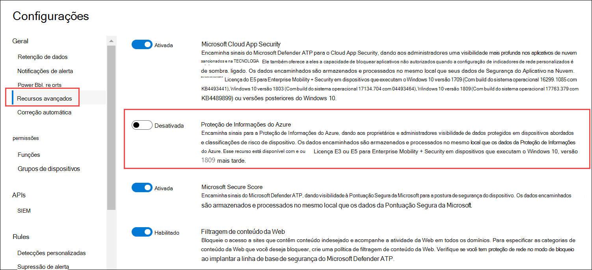
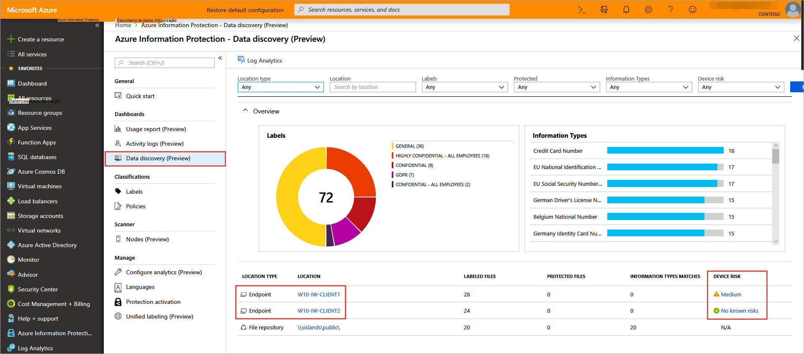

# <a name="information-protection-in-windows-overview"></a><span data-ttu-id="193fc-104">Proteção de informações na visão geral do Windows</span><span class="sxs-lookup"><span data-stu-id="193fc-104">Information protection in Windows overview</span></span>

[!INCLUDE [Microsoft 365 Defender rebranding](../../includes/microsoft-defender.md)]

<span data-ttu-id="193fc-105">**Aplica-se a:**</span><span class="sxs-lookup"><span data-stu-id="193fc-105">**Applies to:**</span></span>

- [<span data-ttu-id="193fc-106">Microsoft Defender para Ponto de Extremidade</span><span class="sxs-lookup"><span data-stu-id="193fc-106">Microsoft Defender for Endpoint</span></span>](https://go.microsoft.com/fwlink/p/?linkid=2146631)
- [<span data-ttu-id="193fc-107">Microsoft 365 Defender</span><span class="sxs-lookup"><span data-stu-id="193fc-107">Microsoft 365 Defender</span></span>](https://go.microsoft.com/fwlink/?linkid=2118804)

> <span data-ttu-id="193fc-108">Deseja experimentar o Defender para Ponto de Extremidade?</span><span class="sxs-lookup"><span data-stu-id="193fc-108">Want to experience Defender for Endpoint?</span></span> [<span data-ttu-id="193fc-109">Inscreva-se para uma avaliação gratuita.</span><span class="sxs-lookup"><span data-stu-id="193fc-109">Sign up for a free trial.</span></span>](https://www.microsoft.com/microsoft-365/windows/microsoft-defender-atp?ocid=docs-wdatp-exposedapis-abovefoldlink) 


[!include[Prerelease information](../../includes/prerelease.md)]

<span data-ttu-id="193fc-110">A proteção de informações é uma parte integrante do pacote do Microsoft 365 Enterprise, fornecendo proteção inteligente para manter dados confidenciais seguros enquanto habilita a produtividade no local de trabalho.</span><span class="sxs-lookup"><span data-stu-id="193fc-110">Information protection is an integral part of Microsoft 365 Enterprise suite, providing intelligent protection to keep sensitive data secure while enabling productivity in the workplace.</span></span>


>[!TIP]
> <span data-ttu-id="193fc-111">Leia nossa postagem no blog sobre como o Microsoft Defender ATP se integra à Proteção de Informações da Microsoft para descobrir, proteger e monitorar dados confidenciais [em dispositivos Windows.](https://cloudblogs.microsoft.com/microsoftsecure/2019/01/17/windows-defender-atp-integrates-with-microsoft-information-protection-to-discover-protect-and-monitor-sensitive-data-on-windows-devices/)</span><span class="sxs-lookup"><span data-stu-id="193fc-111">Read our blog post about how [Microsoft Defender ATP integrates with Microsoft Information Protection to discover, protect, and monitor sensitive data on Windows devices](https://cloudblogs.microsoft.com/microsoftsecure/2019/01/17/windows-defender-atp-integrates-with-microsoft-information-protection-to-discover-protect-and-monitor-sensitive-data-on-windows-devices/).</span></span>

<span data-ttu-id="193fc-112">O Defender for Endpoint aplica os seguintes métodos para descobrir, classificar e proteger dados:</span><span class="sxs-lookup"><span data-stu-id="193fc-112">Defender for Endpoint applies the following methods to discover, classify, and protect data:</span></span>

- <span data-ttu-id="193fc-113">**Descoberta de dados** - Identificar dados confidenciais em dispositivos Windows em risco</span><span class="sxs-lookup"><span data-stu-id="193fc-113">**Data discovery** - Identify sensitive data on Windows devices at risk</span></span>
- <span data-ttu-id="193fc-114">**Classificação de** dados - Classifique automaticamente os dados com base em políticas comuns de Proteção de Informações da Microsoft (MIP) gerenciadas no Centro de Conformidade & Segurança do Office 365.</span><span class="sxs-lookup"><span data-stu-id="193fc-114">**Data classification** - Automatically classify data based on common Microsoft Information Protection (MIP) policies managed in Office 365 Security & Compliance Center.</span></span> <span data-ttu-id="193fc-115">A classificação automática permite proteger dados confidenciais, mesmo que o usuário final não os tenha classificado manualmente.</span><span class="sxs-lookup"><span data-stu-id="193fc-115">Auto-classification allows you to protect sensitive data even if the end user hasn’t manually classified it.</span></span>


## <a name="data-discovery-and-data-classification"></a><span data-ttu-id="193fc-116">Descoberta de dados e classificação de dados</span><span class="sxs-lookup"><span data-stu-id="193fc-116">Data discovery and data classification</span></span>

<span data-ttu-id="193fc-117">O Defender for Endpoint descobre automaticamente arquivos com rótulos de sensibilidade e arquivos que contêm tipos de informações confidenciais.</span><span class="sxs-lookup"><span data-stu-id="193fc-117">Defender for Endpoint automatically discovers files with sensitivity labels and files that contain sensitive information types.</span></span>

<span data-ttu-id="193fc-118">Rótulos de sensibilidade classificam e ajudam a proteger conteúdos confidenciais.</span><span class="sxs-lookup"><span data-stu-id="193fc-118">Sensitivity labels classify and help protect sensitive content.</span></span>

<span data-ttu-id="193fc-119">Os tipos de informações confidenciais na implementação de prevenção contra perda de dados (DLP) do Office 365 estão em duas categorias:</span><span class="sxs-lookup"><span data-stu-id="193fc-119">Sensitive information types in the Office 365 data loss prevention (DLP) implementation fall under two categories:</span></span>

- <span data-ttu-id="193fc-120">Padrão</span><span class="sxs-lookup"><span data-stu-id="193fc-120">Default</span></span>
- <span data-ttu-id="193fc-121">Personalizado</span><span class="sxs-lookup"><span data-stu-id="193fc-121">Custom</span></span>

<span data-ttu-id="193fc-122">Os tipos de informações confidenciais padrão incluem informações como números de contas bancárias, números de previdência social ou IDs nacionais.</span><span class="sxs-lookup"><span data-stu-id="193fc-122">Default sensitive information types include information such as bank account numbers, social security numbers, or national IDs.</span></span> <span data-ttu-id="193fc-123">Para obter mais informações, consulte [What the sensitive information type look for](https://docs.microsoft.com/office365/securitycompliance/what-the-sensitive-information-types-look-for).</span><span class="sxs-lookup"><span data-stu-id="193fc-123">For more information, see [What the sensitive information type look for](https://docs.microsoft.com/office365/securitycompliance/what-the-sensitive-information-types-look-for).</span></span>

<span data-ttu-id="193fc-124">Tipos personalizados são aqueles que você define e é projetado para proteger um tipo diferente de informações confidenciais (por exemplo, IDs de funcionários ou números de projeto).</span><span class="sxs-lookup"><span data-stu-id="193fc-124">Custom types are ones that you define and is designed to protect a different type of sensitive information (for example, employee IDs or project numbers).</span></span> <span data-ttu-id="193fc-125">Para obter mais informações, [consulte Create a custom sensitive information type](https://docs.microsoft.com/office365/securitycompliance/create-a-custom-sensitive-information-type).</span><span class="sxs-lookup"><span data-stu-id="193fc-125">For more information see, [Create a custom sensitive information type](https://docs.microsoft.com/office365/securitycompliance/create-a-custom-sensitive-information-type).</span></span>

<span data-ttu-id="193fc-126">Quando um arquivo é criado ou editado em um dispositivo Windows, o Defender for Endpoint verifica o conteúdo para avaliar se ele contém informações confidenciais.</span><span class="sxs-lookup"><span data-stu-id="193fc-126">When a file is created or edited on a  Windows device, Defender for Endpoint scans the content to evaluate if it contains sensitive information.</span></span>

<span data-ttu-id="193fc-127">Ative a integração da Proteção de Informações do Azure para que, quando um arquivo que contenha informações confidenciais seja descoberto pelo Defender para o Ponto de Extremidade, embora rótulos ou tipos de informações, ele seja automaticamente encaminhado para a Proteção de Informações do Azure a partir do dispositivo.</span><span class="sxs-lookup"><span data-stu-id="193fc-127">Turn on the Azure Information Protection integration so that when a file that contains sensitive information is discovered by Defender for Endpoint though labels or information types, it is automatically forwarded to Azure Information Protection from the device.</span></span>



<span data-ttu-id="193fc-129">Os sinais relatados podem ser exibidos no painel Proteção de Informações do Azure – Descoberta de dados.</span><span class="sxs-lookup"><span data-stu-id="193fc-129">The reported signals can be viewed on the Azure Information Protection – Data discovery dashboard.</span></span>

## <a name="azure-information-protection---data-discovery-dashboard"></a><span data-ttu-id="193fc-130">Proteção de Informações do Azure - Painel de descoberta de dados</span><span class="sxs-lookup"><span data-stu-id="193fc-130">Azure Information Protection - Data discovery dashboard</span></span>

<span data-ttu-id="193fc-131">Este painel apresenta uma informação resumida de descoberta dos dados descobertos pelo Defender for Endpoint e pela Proteção de Informações do Azure.</span><span class="sxs-lookup"><span data-stu-id="193fc-131">This dashboard presents a summarized discovery information of data discovered by both Defender for Endpoint and Azure Information Protection.</span></span> <span data-ttu-id="193fc-132">Os dados do Defender para Ponto de Extremidade são marcados com Tipo de Local - Ponto de Extremidade.</span><span class="sxs-lookup"><span data-stu-id="193fc-132">Data from Defender for Endpoint is marked with Location Type - Endpoint.</span></span>



<span data-ttu-id="193fc-134">Observe que a coluna Risco de Dispositivo à direita, esse risco de dispositivo é derivado diretamente do Defender para Ponto de Extremidade, indicando o nível de risco do dispositivo de segurança onde o arquivo foi descoberto, com base nas ameaças de segurança ativas detectadas pelo Defender para Ponto de Extremidade.</span><span class="sxs-lookup"><span data-stu-id="193fc-134">Notice the Device Risk column on the right, this device risk is derived directly from Defender for Endpoint, indicating the risk level of the security device where the file was discovered, based on the active security threats detected by Defender for Endpoint.</span></span>

<span data-ttu-id="193fc-135">Clique em um dispositivo para exibir uma lista de arquivos observados neste dispositivo, com seus rótulos de sensibilidade e tipos de informações.</span><span class="sxs-lookup"><span data-stu-id="193fc-135">Click on a device to view a list of files observed on this device, with their sensitivity labels and information types.</span></span>

>[!NOTE]
><span data-ttu-id="193fc-136">Permita que aproximadamente 15 a 20 minutos para a Descoberta do Painel de Proteção de Informações do Azure reflitam arquivos descobertos.</span><span class="sxs-lookup"><span data-stu-id="193fc-136">Please allow approximately 15-20 minutes for the Azure Information Protection Dashboard Discovery to reflect discovered files.</span></span>

## <a name="log-analytics"></a><span data-ttu-id="193fc-137">Análise de Log</span><span class="sxs-lookup"><span data-stu-id="193fc-137">Log Analytics</span></span>

<span data-ttu-id="193fc-138">A descoberta de dados baseada no Defender for Endpoint também está disponível no [Azure Log Analytics](https://docs.microsoft.com/azure/log-analytics/log-analytics-overview), onde você pode realizar consultas complexas sobre os dados brutos.</span><span class="sxs-lookup"><span data-stu-id="193fc-138">Data discovery based on Defender for Endpoint is also available in [Azure Log Analytics](https://docs.microsoft.com/azure/log-analytics/log-analytics-overview), where you can perform complex queries over the raw data.</span></span>

<span data-ttu-id="193fc-139">Para obter mais informações sobre a análise da Proteção de Informações do Azure, consulte [Relatório Central para a Proteção de Informações do Azure.](https://docs.microsoft.com/azure/information-protection/reports-aip)</span><span class="sxs-lookup"><span data-stu-id="193fc-139">For more information on Azure Information Protection analytics, see [Central reporting for Azure Information Protection](https://docs.microsoft.com/azure/information-protection/reports-aip).</span></span>

<span data-ttu-id="193fc-140">Abra o Azure Log Analytics no portal do Azure e abra um construtor de consultas (padrão ou clássico).</span><span class="sxs-lookup"><span data-stu-id="193fc-140">Open Azure Log Analytics in Azure portal and open a query builder (standard or classic).</span></span>

<span data-ttu-id="193fc-141">Para exibir dados do Defender para o Ponto de Extremidade, execute uma consulta que contém:</span><span class="sxs-lookup"><span data-stu-id="193fc-141">To view Defender for Endpoint data, perform a query that contains:</span></span>

```
InformationProtectionLogs_CL
| where Workload_s == "Windows Defender"
```

<span data-ttu-id="193fc-142">**Pré-requisitos:**</span><span class="sxs-lookup"><span data-stu-id="193fc-142">**Prerequisites:**</span></span>

- <span data-ttu-id="193fc-143">Os clientes devem ter uma assinatura para a Proteção de Informações do Azure.</span><span class="sxs-lookup"><span data-stu-id="193fc-143">Customers must have a subscription for Azure Information Protection.</span></span>
- <span data-ttu-id="193fc-144">Habilitar a integração da Proteção de Informações do Azure no Centro de Segurança do Microsoft Defender:</span><span class="sxs-lookup"><span data-stu-id="193fc-144">Enable Azure Information Protection integration in Microsoft Defender Security Center:</span></span>
    - <span data-ttu-id="193fc-145">Vá para **Configurações no** Centro de Segurança do Microsoft Defender, clique em **Configurações Avançadas** em **Geral**.</span><span class="sxs-lookup"><span data-stu-id="193fc-145">Go to **Settings** in Microsoft Defender Security Center, click on **Advanced Settings** under **General**.</span></span>


