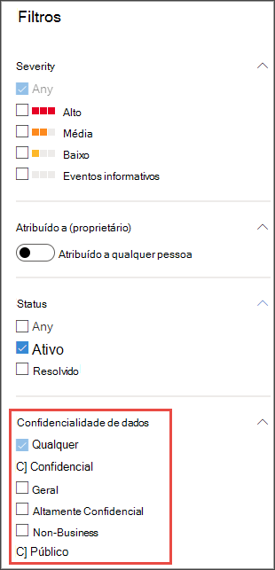

# Usar rótulos de sensibilidade para priorizar a resposta a incidentesUse sensitivity labels to prioritize incident response  

[!INCLUDE [Microsoft 365 Defender rebranding](../../includes/microsoft-defender.md)]

**Aplica-se a:****Applies to:**
- [Microsoft Defender para Ponto de ExtremidadeMicrosoft Defender for Endpoint](https://go.microsoft.com/fwlink/p/?linkid=2154037)
- [Microsoft 365 DefenderMicrosoft 365 Defender](https://go.microsoft.com/fwlink/?linkid=2118804)

> Deseja experimentar o Defender para Ponto de Extremidade?Want to experience Defender for Endpoint? [Inscreva-se para uma avaliação gratuita.Sign up for a free trial.](https://www.microsoft.com/microsoft-365/windows/microsoft-defender-atp?ocid=docs-wdatp-exposedapis-abovefoldlink) 

Um típico ciclo de vida de ameaças persistentes avançada envolve a exfiltração de dados.A typical advanced persistent threat lifecycle involves data exfiltration. Em um incidente de segurança, é importante ter a capacidade de priorizar investigações em que arquivos confidenciais podem ser comprometidos para que dados corporativos e informações sejam protegidos.In a security incident, it's important to have the ability to prioritize investigations where sensitive files may be jeopardy so that corporate data and information are protected.

O Defender for Endpoint ajuda a simplificar a priorização de incidentes de segurança com o uso de rótulos de sensibilidade.Defender for Endpoint helps to make the prioritization of security incidents much simpler with the use of sensitivity labels. Os rótulos de confidencialidade identificam rapidamente incidentes que podem envolver dispositivos com informações confidenciais, como informações confidenciais.Sensitivity labels quickly identify incidents that may involve devices with sensitive information such as confidential information. 

## Investigar incidentes que envolvem dados confidenciaisInvestigate incidents that involve sensitive data
Saiba como usar rótulos de sensibilidade de dados para priorizar a investigação de incidentes.Learn how to use data sensitivity labels to prioritize incident investigation.

>[!NOTE]
>Os rótulos são detectados para o Windows 10, versão 1809 ou posterior.Labels are detected for Windows 10, version 1809 or later.

1. No Centro de Segurança do Microsoft Defender, selecione **Incidentes**.In Microsoft Defender Security Center, select **Incidents**. 

2. Role para a direita para ver a **coluna De sensibilidade de** dados.Scroll to the right to see the **Data sensitivity** column. Esta coluna reflete rótulos de sensibilidade que foram observados em dispositivos relacionados aos incidentes, fornecendo uma indicação de se arquivos confidenciais podem ser afetados pelo incidente.This column reflects sensitivity labels that have been observed on devices related to the incidents providing an indication of whether sensitive files may be impacted by the incident.

    

    Você também pode filtrar com base na **sensibilidade de dados**You can also filter based on **Data sensitivity** 

    

3. Abra a página de incidentes para investigar mais.Open the incident page to further investigate.

    

4. Selecione a **guia Dispositivos** para identificar dispositivos que armazenaram arquivos com rótulos de sensibilidade.Select the **Devices** tab to identify devices storing files with sensitivity labels.

    
   

5. Selecione os dispositivos que armazenam dados confidenciais e pesquise pela linha do tempo para identificar quais arquivos podem ser afetados e, em seguida, tome as medidas apropriadas para garantir que os dados sejam protegidos.Select the devices that store sensitive data and search through the timeline to identify which files may be impacted then take appropriate action to ensure that data is protected. 

   Você pode restringir os eventos mostrados na linha do tempo do dispositivo pesquisando rótulos de sensibilidade de dados.You can narrow down the events shown on the device timeline by searching for data sensitivity labels. Isso mostrará apenas eventos associados a arquivos que tenham dito o nome do rótulo.Doing this will show only events associated with files that have said label name.

    

>[!TIP]
>Esses pontos de dados também são expostos por meio dos 'DeviceFileEvents' na busca avançada, permitindo que consultas avançadas e detecção de agendamento leve em consideração rótulos de confidencialidade e status de proteção de arquivo.These data points are also exposed through the ‘DeviceFileEvents’ in advanced hunting, allowing advanced queries and schedule detection to take into account sensitivity labels and file protection status. 
