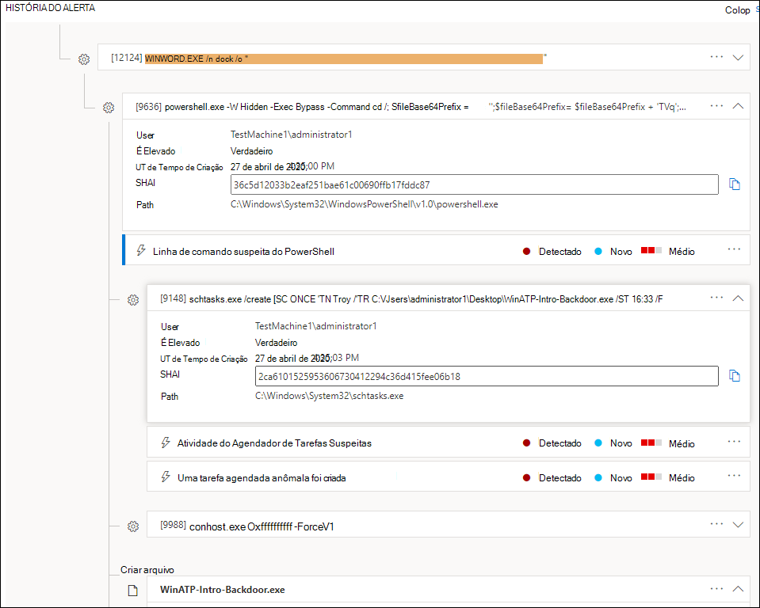
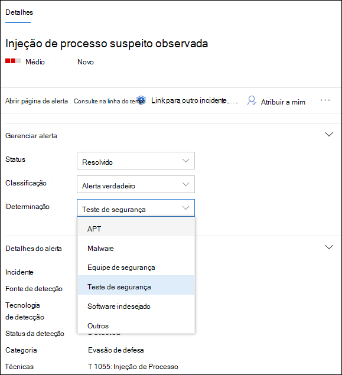
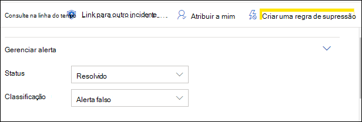

# Investigar alertas no Microsoft Defender para Ponto de Extremidade

[!INCLUDE [Microsoft 365 Defender rebranding](../../includes/microsoft-defender.md)]

**Aplica-se a:**
- [Microsoft Defender para Ponto de Extremidade](https://go.microsoft.com/fwlink/p/?linkid=2146631)
- [Microsoft 365 Defender](https://go.microsoft.com/fwlink/?linkid=2118804)

>Deseja experimentar o Defender para Ponto de Extremidade? [Inscreva-se para uma avaliação gratuita.](https://www.microsoft.com/microsoft-365/windows/microsoft-defender-atp?ocid=docs-wdatp-investigatealerts-abovefoldlink) 

Investigue alertas que estão afetando sua rede, entenda o que significam e como resolvê-los.

Selecione um alerta na fila de alertas para ir para a página de alerta. Essa exibição contém o título do alerta, os ativos afetados, o painel de detalhes e o texto do alerta.

Na página de alerta, comece sua investigação selecionando os ativos afetados ou qualquer uma das entidades sob a exibição da árvore de histórias de alerta. O painel de detalhes preenche automaticamente com mais informações sobre o que você selecionou. Para ver que tipo de informação você pode exibir aqui, leia [Review alerts in Microsoft Defender for Endpoint](https://docs.microsoft.com/microsoft-365/security/defender-endpoint/review-alerts).

## Investigar usando o artigo de alerta

O story de alerta detalha por que o alerta foi disparado, eventos relacionados que aconteceram antes e depois, bem como outras entidades relacionadas.

As entidades são clicáveis e todas as entidades que não são um alerta podem ser expandidas usando o ícone de expansão no lado direito do cartão dessa entidade. A entidade em foco será indicada por uma faixa azul no lado esquerdo do cartão dessa entidade, com o alerta no título em foco inicialmente.

Expanda entidades para exibir detalhes rapidamente. Selecionar uma entidade alterna o contexto do painel de detalhes para essa entidade e permitirá que você revise mais informações, bem como gerencie essa entidade. Selecionar *...* à direita do cartão de entidade revelará todas as ações disponíveis para essa entidade. Essas mesmas ações aparecem no painel de detalhes quando essa entidade está em foco.

> [!NOTE]
> A seção de texto do alerta pode conter mais de um alerta, com alertas adicionais relacionados à mesma árvore de execução que aparece antes ou depois do alerta selecionado.

## Tomar medidas do painel de detalhes

Depois de selecionar uma entidade de interesse, o painel de detalhes mudará para exibir informações sobre o tipo de  entidade selecionado, informações históricas quando estiver disponível e oferecer controles para tomar medidas nessa entidade diretamente na página de alerta.

Depois de terminar de investigar, volte para o alerta que você começou com, marque o status do alerta como **Resolvido** e classifique-o como alerta **False** ou **True.** Classificar alertas ajuda a ajustar esse recurso para fornecer alertas mais verdadeiros e menos alertas falsos.

Se você classificá-lo como um alerta verdadeiro, também poderá selecionar uma determinação, conforme mostrado na imagem abaixo.

Se você estiver enfrentando um alerta falso com um aplicativo de linha de negócios, crie uma regra de supressão para evitar esse tipo de alerta no futuro.

> [!TIP]
> Se você estiver enfrentando problemas não descritos acima, use o botão para fornecer 🙂 comentários ou abrir um tíquete de suporte.

## Tópicos relacionados
- [Exibir e organizar a fila de alertas do Microsoft Defender for Endpoint](alerts-queue.md)
- [Gerenciar alertas do Microsoft Defender para Pontos de Extremidade](manage-alerts.md)
- [Investigar um arquivo associado a um alerta do Defender para Ponto de Extremidade](investigate-files.md)
- [Investigar dispositivos na lista Defender para Dispositivos de Ponto de Extremidade](investigate-machines.md)
- [Investigar um endereço IP associado a um alerta do Defender para Ponto de Extremidade](investigate-ip.md)
- [Investigar um domínio associado a um alerta do Defender para Ponto de Extremidade](investigate-domain.md)
- [Investigar uma conta de usuário no Defender para Ponto de Extremidade](investigate-user.md)

