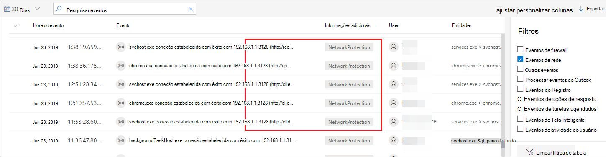
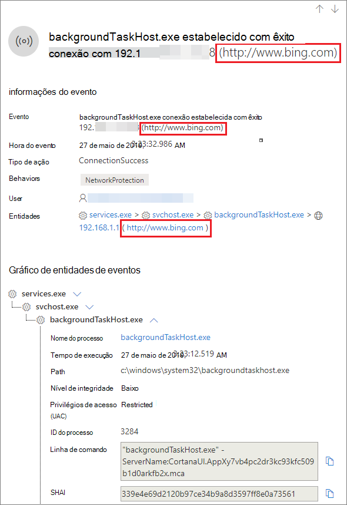
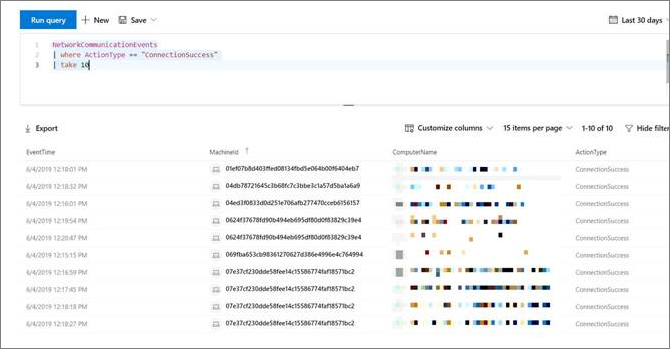

# <a name="investigate-connection-events-that-occur-behind-forward-proxies"></a><span data-ttu-id="7dcea-104">Investigar eventos de conexão que ocorrem por meio de proxies de encaminhamento</span><span class="sxs-lookup"><span data-stu-id="7dcea-104">Investigate connection events that occur behind forward proxies</span></span>

[!INCLUDE [Microsoft 365 Defender rebranding](../../includes/microsoft-defender.md)]

<span data-ttu-id="7dcea-105">**Aplica-se a:**</span><span class="sxs-lookup"><span data-stu-id="7dcea-105">**Applies to:**</span></span>
- [<span data-ttu-id="7dcea-106">Microsoft Defender para Ponto de Extremidade</span><span class="sxs-lookup"><span data-stu-id="7dcea-106">Microsoft Defender for Endpoint</span></span>](https://go.microsoft.com/fwlink/p/?linkid=2154037)
- [<span data-ttu-id="7dcea-107">Microsoft 365 Defender</span><span class="sxs-lookup"><span data-stu-id="7dcea-107">Microsoft 365 Defender</span></span>](https://go.microsoft.com/fwlink/?linkid=2118804)

> <span data-ttu-id="7dcea-108">Deseja experimentar o Defender para Ponto de Extremidade?</span><span class="sxs-lookup"><span data-stu-id="7dcea-108">Want to experience Defender for Endpoint?</span></span> [<span data-ttu-id="7dcea-109">Inscreva-se para uma avaliação gratuita.</span><span class="sxs-lookup"><span data-stu-id="7dcea-109">Sign up for a free trial.</span></span>](https://www.microsoft.com/microsoft-365/windows/microsoft-defender-atp?ocid=docs-wdatp-investigatemachines-abovefoldlink)

<span data-ttu-id="7dcea-110">O Defender para Ponto de Extremidade oferece suporte ao monitoramento de conexão de rede de diferentes níveis da pilha de rede.</span><span class="sxs-lookup"><span data-stu-id="7dcea-110">Defender for Endpoint supports network connection monitoring from different levels of the network stack.</span></span> <span data-ttu-id="7dcea-111">Um caso desafiador é quando a rede usa um proxy de encaminhamento como um gateway para a Internet.</span><span class="sxs-lookup"><span data-stu-id="7dcea-111">A challenging case is when the network uses a forward proxy as a gateway to the Internet.</span></span>

<span data-ttu-id="7dcea-112">O proxy age como se fosse o ponto de extremidade de destino.</span><span class="sxs-lookup"><span data-stu-id="7dcea-112">The proxy acts as if it was the target endpoint.</span></span>  <span data-ttu-id="7dcea-113">Nesses casos, os monitores de conexão de rede simples auditarão as conexões com o proxy que está correto, mas tem menor valor de investigação.</span><span class="sxs-lookup"><span data-stu-id="7dcea-113">In these cases, simple network connection monitors will audit the connections with the proxy which is correct but has lower investigation value.</span></span> 

<span data-ttu-id="7dcea-114">O Defender for Endpoint oferece suporte ao monitoramento avançado de nível HTTP por meio da proteção de rede.</span><span class="sxs-lookup"><span data-stu-id="7dcea-114">Defender for Endpoint supports advanced HTTP level monitoring through network protection.</span></span> <span data-ttu-id="7dcea-115">Quando ligado, um novo tipo de evento é a superfície que expõe os nomes de domínio de destino reais.</span><span class="sxs-lookup"><span data-stu-id="7dcea-115">When turned on, a new type of event is surfaced which exposes the real target domain names.</span></span>

## <a name="use-network-protection-to-monitor-network-connection-behind-a-firewall"></a><span data-ttu-id="7dcea-116">Usar a proteção de rede para monitorar a conexão de rede atrás de um firewall</span><span class="sxs-lookup"><span data-stu-id="7dcea-116">Use network protection to monitor network connection behind a firewall</span></span>
<span data-ttu-id="7dcea-117">O monitoramento da conexão de rede por trás de um proxy de encaminhamento é possível devido a eventos de rede adicionais que se originam da proteção de rede.</span><span class="sxs-lookup"><span data-stu-id="7dcea-117">Monitoring network connection behind a forward proxy is possible due to additional network events that originate from network protection.</span></span> <span data-ttu-id="7dcea-118">Para vê-los em uma linha do tempo do dispositivo, a ligue a proteção de rede (no mínimo no modo de auditoria).</span><span class="sxs-lookup"><span data-stu-id="7dcea-118">To see them on a device timeline, turn network protection on (at the minimum in audit mode).</span></span> 

<span data-ttu-id="7dcea-119">A proteção de rede pode ser controlada usando os seguintes modos:</span><span class="sxs-lookup"><span data-stu-id="7dcea-119">Network protection can be controlled using the following modes:</span></span>

- <span data-ttu-id="7dcea-120">**Bloquear**</span><span class="sxs-lookup"><span data-stu-id="7dcea-120">**Block**</span></span> <br> <span data-ttu-id="7dcea-121">Os usuários ou aplicativos serão impedidos de se conectar a domínios perigosos.</span><span class="sxs-lookup"><span data-stu-id="7dcea-121">Users or apps will be blocked from connecting to dangerous domains.</span></span> <span data-ttu-id="7dcea-122">Você poderá ver essa atividade no Centro de Segurança do Microsoft Defender.</span><span class="sxs-lookup"><span data-stu-id="7dcea-122">You will be able to see this activity in Microsoft Defender Security Center.</span></span>
- <span data-ttu-id="7dcea-123">**Auditoria**</span><span class="sxs-lookup"><span data-stu-id="7dcea-123">**Audit**</span></span> <br> <span data-ttu-id="7dcea-124">Os usuários ou aplicativos não serão impedidos de se conectar a domínios perigosos.</span><span class="sxs-lookup"><span data-stu-id="7dcea-124">Users or apps will not be blocked from connecting to dangerous domains.</span></span> <span data-ttu-id="7dcea-125">No entanto, você ainda verá essa atividade no Centro de Segurança do Microsoft Defender.</span><span class="sxs-lookup"><span data-stu-id="7dcea-125">However, you will still see this activity in Microsoft Defender Security Center.</span></span>


<span data-ttu-id="7dcea-126">Se você desativar a proteção de rede, os usuários ou aplicativos não serão impedidos de se conectar a domínios perigosos.</span><span class="sxs-lookup"><span data-stu-id="7dcea-126">If you turn network protection off, users or apps will not be blocked from connecting to dangerous domains.</span></span> <span data-ttu-id="7dcea-127">Você não verá nenhuma atividade de rede no Centro de Segurança do Microsoft Defender.</span><span class="sxs-lookup"><span data-stu-id="7dcea-127">You will not see any network activity in Microsoft Defender Security Center.</span></span>

<span data-ttu-id="7dcea-128">Se você não configurá-lo, o bloqueio de rede será desligado por padrão.</span><span class="sxs-lookup"><span data-stu-id="7dcea-128">If you do not configure it, network blocking will be turned off by default.</span></span>

<span data-ttu-id="7dcea-129">Para obter mais informações, consulte [Enable network protection](enable-network-protection.md).</span><span class="sxs-lookup"><span data-stu-id="7dcea-129">For more information, see [Enable network protection](enable-network-protection.md).</span></span>

## <a name="investigation-impact"></a><span data-ttu-id="7dcea-130">Impacto da investigação</span><span class="sxs-lookup"><span data-stu-id="7dcea-130">Investigation impact</span></span>
<span data-ttu-id="7dcea-131">Quando a proteção de rede estiver 100%, você verá que, na linha do tempo de um dispositivo, o endereço IP manterá representando o proxy, enquanto o endereço de destino real aparece.</span><span class="sxs-lookup"><span data-stu-id="7dcea-131">When network protection is turned on, you'll see that on a device's timeline the IP address will keep representing the proxy, while the real target address shows up.</span></span>



<span data-ttu-id="7dcea-133">Eventos adicionais disparados pela camada de proteção de rede agora estão disponíveis para aparecer os nomes de domínio reais mesmo atrás de um proxy.</span><span class="sxs-lookup"><span data-stu-id="7dcea-133">Additional events triggered by the network protection layer are now available to surface the real domain names even behind a proxy.</span></span>

<span data-ttu-id="7dcea-134">Informações do evento:</span><span class="sxs-lookup"><span data-stu-id="7dcea-134">Event's information:</span></span>




## <a name="hunt-for-connection-events-using-advanced-hunting"></a><span data-ttu-id="7dcea-136">Procurar eventos de conexão usando a busca avançada</span><span class="sxs-lookup"><span data-stu-id="7dcea-136">Hunt for connection events using advanced hunting</span></span> 
<span data-ttu-id="7dcea-137">Todos os novos eventos de conexão estão disponíveis para você também procurar por meio da busca avançada.</span><span class="sxs-lookup"><span data-stu-id="7dcea-137">All new connection events are available for you to hunt on through advanced hunting as well.</span></span> <span data-ttu-id="7dcea-138">Como esses eventos são eventos de conexão, você pode encontrá-los na tabela DeviceNetworkEvents sob o `ConnecionSuccess` tipo de ação.</span><span class="sxs-lookup"><span data-stu-id="7dcea-138">Since these events are connection events, you can find them under the DeviceNetworkEvents table under the `ConnecionSuccess` action type.</span></span>

<span data-ttu-id="7dcea-139">Usar essa consulta simples mostrará todos os eventos relevantes:</span><span class="sxs-lookup"><span data-stu-id="7dcea-139">Using this simple query will show you all the relevant events:</span></span>

```
DeviceNetworkEvents
| where ActionType == "ConnectionSuccess" 
| take 10
```



<span data-ttu-id="7dcea-141">Você também pode filtrar eventos relacionados à conexão com o próprio proxy.</span><span class="sxs-lookup"><span data-stu-id="7dcea-141">You can also filter out  events that are related to connection to the proxy itself.</span></span> 

<span data-ttu-id="7dcea-142">Use a seguinte consulta para filtrar as conexões com o proxy:</span><span class="sxs-lookup"><span data-stu-id="7dcea-142">Use the following query to filter out the connections to the proxy:</span></span>

```
DeviceNetworkEvents
| where ActionType == "ConnectionSuccess" and RemoteIP != "ProxyIP"  
| take 10
```


## <a name="related-topics"></a><span data-ttu-id="7dcea-143">Tópicos relacionados</span><span class="sxs-lookup"><span data-stu-id="7dcea-143">Related topics</span></span>
- [<span data-ttu-id="7dcea-144">Aplicando proteção de rede com GP - CSP de política</span><span class="sxs-lookup"><span data-stu-id="7dcea-144">Applying network protection with GP - policy CSP</span></span>](https://docs.microsoft.com/windows/client-management/mdm/policy-csp-defender#defender-enablenetworkprotection)
