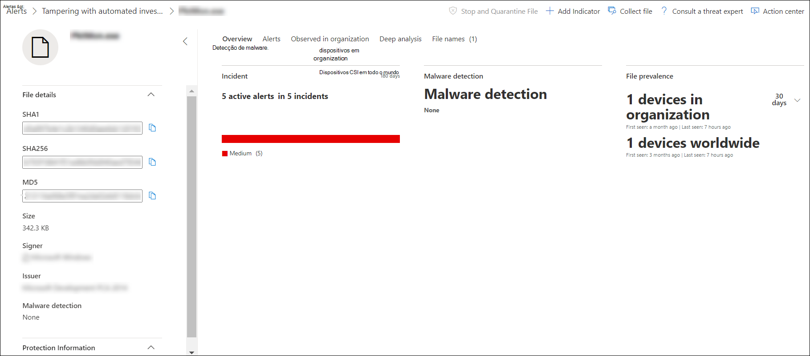
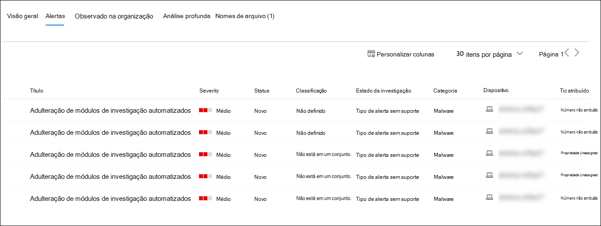
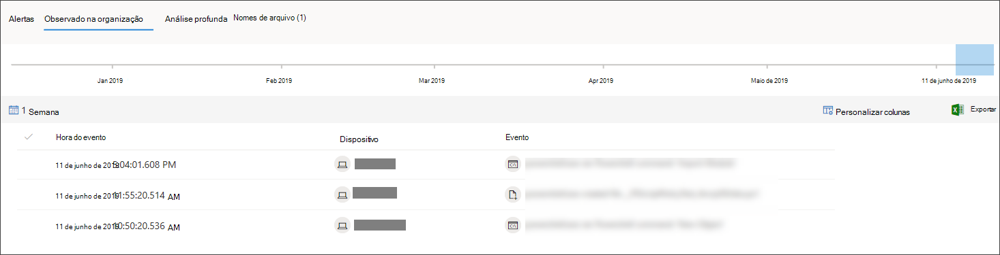

# Investigar um arquivo associado a um alerta do Microsoft Defender para Ponto de ExtremidadeInvestigate a file associated with a Microsoft Defender for Endpoint alert

[!INCLUDE [Microsoft 365 Defender rebranding](../../includes/microsoft-defender.md)]

**Aplica-se a:****Applies to:**
- [Microsoft Defender para Ponto de ExtremidadeMicrosoft Defender for Endpoint](https://go.microsoft.com/fwlink/p/?linkid=2146631)
- [Microsoft 365 DefenderMicrosoft 365 Defender](https://go.microsoft.com/fwlink/?linkid=2118804)

>Deseja experimentar o Defender para Ponto de Extremidade?Want to experience Defender for Endpoint? [Inscreva-se para uma avaliação gratuita.Sign up for a free trial.](https://www.microsoft.com/microsoft-365/windows/microsoft-defender-atp?ocid=docs-wdatp-investigatefiles-abovefoldlink)

Investigue os detalhes de um arquivo associado a um alerta, comportamento ou evento específico para ajudar a determinar se o arquivo exibe atividades mal-intencionadas, identificar a motivação de ataque e entender o escopo potencial da violação.Investigate the details of a file associated with a specific alert, behavior, or event to help determine if the file exhibits malicious activities, identify the attack motivation, and understand the potential scope of the breach.

Há muitas maneiras de acessar a página de perfil detalhada de um arquivo específico.There are many ways to access the detailed profile page of a specific file. Por exemplo, você pode usar o recurso de pesquisa, clicar em um link da árvore de processo **alerta,** gráfico de **incidentes,** linha do tempo de artefato **ou** selecionar um evento listado na linha do tempo **do dispositivo.**For example, you can  use the search feature, click on a link from the **Alert process tree**, **Incident graph**, **Artifact timeline**, or select an event listed in the **Device timeline**.

Uma vez na página de perfil detalhada, você pode alternar entre os layouts de página novo e antigo, alternando a **nova página Arquivo.**Once on the detailed profile page, you can switch between the new and old page layouts by toggling **new File page**. O restante deste artigo descreve o layout da página mais recente.The rest of this article describes the newer page layout.

Você pode obter informações das seções a seguir no exibição de arquivo:You can get information from the following sections in the file view:

- Detalhes do arquivo, detecção de malware, prevalência de arquivoFile details, Malware detection, File prevalence
- Análise profundaDeep analysis
- AlertasAlerts
- Observado na organizaçãoObserved in organization
- Análise profundaDeep analysis
- Nomes de arquivosFile names

Você também pode tomar medidas em um arquivo desta página.You can also take action on a file from this page.

## Ações de arquivoFile actions

Na parte superior da página de perfil, acima dos cartões de informações do arquivo.Along the top of the profile page, above the file information cards. As ações que você pode executar aqui incluem:Actions you can perform here include:

- Parar e colocar em quarentenaStop and quarantine
- Indicador de adicionar/editarAdd/edit indicator
- Baixar o arquivoDownload file
- Consultar um especialista em ameaçasConsult a threat expert
- Central de açõesAction center

Para obter mais informações sobre essas ações, consulte [Take response action on a file](respond-file-alerts.md).For more information on these actions, see [Take response action on a file](respond-file-alerts.md).

## Detalhes do arquivo, detecção de malware e prevalência de arquivoFile details, Malware detection, and File prevalence

Os detalhes do arquivo, incidente, detecção de malware e cartões de prevalência de arquivo exibem vários atributos sobre o arquivo.The file details, incident, malware detection, and file prevalence cards display various attributes about the file.

Você verá detalhes como o MD5 do arquivo, a taxa de detecção total de vírus e a detecção do Microsoft Defender AV, se disponível, e a prevalência do arquivo.You'll see details such as the file’s MD5, the Virus Total detection ratio, and Microsoft Defender AV detection if available, and the file’s prevalence.

O cartão de prevalência de arquivo mostra onde o arquivo foi visto em dispositivos na organização e em todo o mundo.The file prevalence card shows where the file was seen in devices in the organization and worldwide. 

> [!NOTE] 
> Diferentes usuários podem ver valores diferentes nos dispositivos na seção *organização* do cartão de prevalência do arquivo.Different users may see dissimilar values in the *devices in organization* section of the file prevalence card. Isso porque o cartão exibe informações com base no escopo RBAC que um usuário tem.This is because the card displays information based on the RBAC scope that a user has. Ou seja, se um usuário tiver sido concedido visibilidade em um conjunto específico de dispositivos, ele verá apenas a prevalência organizacional do arquivo nesses dispositivos.Meaning, if a user has been granted visibility on a specific set of devices, they will only see the file organizational prevalence on those devices.

## AlertasAlerts

A **guia Alertas** fornece uma lista de alertas associados ao arquivo.The **Alerts** tab provides a list of alerts that are associated with the file. Esta lista abrange grande parte das mesmas informações que a fila de Alertas, exceto para o grupo de dispositivos, se algum, o dispositivo afetado pertence.This list covers much of the same information as the Alerts queue, except for the device group, if any, the affected device belongs to. Você pode escolher que tipo de informação é mostrada selecionando **Personalizar colunas** na barra de ferramentas acima dos headers da coluna.You can choose what kind of information is shown by selecting **Customize columns** from the toolbar above the column headers.

## Observado na organizaçãoObserved in organization

A **guia Observado na organização** permite que você especifique um intervalo de datas para ver quais dispositivos foram observados com o arquivo.The **Observed in organization** tab allows you to specify a date range to see which devices have been observed with the file.

>[!NOTE]
>Esta guia mostrará um número máximo de 100 dispositivos.This tab will show a maximum number of 100 devices. Para ver _todos os_ dispositivos com o arquivo, exporte a guia para um arquivo CSV, selecionando **Exportar** no menu ação acima dos headers da coluna da guia.To see _all_ devices with the file, export the tab to a CSV file, by selecting **Export** from the action menu above the tab's column headers.

Use o controle deslizante ou o seletor de intervalo para especificar rapidamente um período de tempo que você deseja verificar se há eventos envolvendo o arquivo.Use the slider or the range selector to quickly specify a time period that you want to check for events involving the file. Você pode especificar uma janela de tempo tão pequena quanto um único dia.You can specify a time window as small as a single day. Isso permitirá que você veja apenas arquivos que se comunicaram com esse Endereço IP naquele momento, reduzindo drasticamente a rolagem e a pesquisa desnecessárias.This will allow you to see only files that communicated with that IP Address at that time, drastically reducing unnecessary scrolling and searching.

## Análise profundaDeep analysis

A **guia** Análise Profunda permite que você envie o arquivo para análise [profunda,](respond-file-alerts.md#deep-analysis)para descobrir mais detalhes sobre o comportamento do arquivo, bem como o efeito que ele está tendo em suas organizações.The **Deep analysis** tab allows you to [submit the file for deep analysis](respond-file-alerts.md#deep-analysis), to uncover more details about the file's behavior, as well as the effect it is having within your organizations. Depois de enviar o arquivo, o relatório de análise profunda aparecerá nesta guia quando os resultados estão disponíveis.After you submit the file, the deep analysis report will appear in this tab once results are available. Se a análise profunda não encontrar nada, o relatório ficará vazio e o espaço de resultados permanecerá em branco.If deep analysis did not find anything, the report will be empty and the results space will remain blank.

## Nomes de arquivosFile names

A **guia Nomes de** arquivo lista todos os nomes que o arquivo foi observado para usar em suas organizações.The **File names** tab lists all names the file has been observed to use, within your organizations.

## Tópicos relacionadosRelated topics

- [Exibir e organizar a fila do Microsoft Defender para Ponto de ExtremidadeView and organize the Microsoft Defender for Endpoint queue](alerts-queue.md)
- [Gerenciar alertas do Microsoft Defender para Pontos de ExtremidadeManage Microsoft Defender for Endpoint alerts](manage-alerts.md)
- [Investigar alertas do Microsoft Defender para Pontos de ExtremidadeInvestigate Microsoft Defender for Endpoint alerts](investigate-alerts.md)
- [Investigar dispositivos na lista do Microsoft Defender for Endpoint DevicesInvestigate devices in the Microsoft Defender for Endpoint Devices list](investigate-machines.md)
- [Investigar um endereço IP associado a um alerta do Microsoft Defender para Ponto de ExtremidadeInvestigate an IP address associated with a Microsoft Defender for Endpoint alert](investigate-ip.md)
- [Investigar um domínio associado a um alerta do Microsoft Defender para Ponto de ExtremidadeInvestigate a domain associated with a Microsoft Defender for Endpoint alert](investigate-domain.md)
- [Investigar uma conta de usuário no Microsoft Defender para Ponto de ExtremidadeInvestigate a user account in Microsoft Defender for Endpoint](investigate-user.md)
- [Tomar ações de resposta em um arquivoTake response actions on a file](respond-file-alerts.md)
