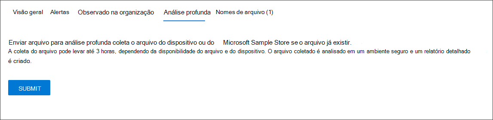

# Investigar um arquivo associado a um alerta do Microsoft Defender para Ponto de Extremidade

[!INCLUDE [Microsoft 365 Defender rebranding](../../includes/microsoft-defender.md)]

**Aplica-se a:**
- [Microsoft Defender para Ponto de Extremidade](https://go.microsoft.com/fwlink/p/?linkid=2154037)
- [Microsoft 365 Defender](https://go.microsoft.com/fwlink/?linkid=2118804)

>Deseja experimentar o Defender para Ponto de Extremidade? [Inscreva-se para uma avaliação gratuita.](https://www.microsoft.com/microsoft-365/windows/microsoft-defender-atp?ocid=docs-wdatp-investigatefiles-abovefoldlink)

Investigue os detalhes de um arquivo associado a um alerta, comportamento ou evento específico para ajudar a determinar se o arquivo exibe atividades mal-intencionadas, identificar a motivação de ataque e entender o escopo potencial da violação.

Há muitas maneiras de acessar a página de perfil detalhada de um arquivo específico. Por exemplo, você pode usar o recurso de pesquisa, clicar em um link da árvore de processo **alerta,** gráfico de **incidentes,** linha do tempo de artefato **ou** selecionar um evento listado na linha do tempo **do dispositivo.**

Uma vez na página de perfil detalhada, você pode alternar entre os layouts de página novo e antigo, alternando a **nova página Arquivo.** O restante deste artigo descreve o layout da página mais recente.

Você pode obter informações das seções a seguir no exibição de arquivo:

- Detalhes do arquivo, detecção de malware, prevalência de arquivo
- Análise profunda
- Alertas
- Observado na organização
- Análise profunda
- Nomes de arquivos

Você também pode tomar medidas em um arquivo desta página.

## Ações de arquivo

Na parte superior da página de perfil, acima dos cartões de informações do arquivo. As ações que você pode executar aqui incluem:

- Parar e colocar em quarentena
- Indicador de adicionar/editar
- Baixar o arquivo
- Consultar um especialista em ameaças
- Central de ações

Para obter mais informações sobre essas ações, consulte [Take response action on a file](respond-file-alerts.md).

## Detalhes do arquivo, detecção de malware e prevalência de arquivo

Os detalhes do arquivo, incidente, detecção de malware e cartões de prevalência de arquivo exibem vários atributos sobre o arquivo.

Você verá detalhes como o MD5 do arquivo, a taxa de detecção total de vírus e a detecção do Microsoft Defender AV, se disponível, e a prevalência do arquivo.

O cartão de prevalência de arquivo mostra onde o arquivo foi visto em dispositivos na organização e em todo o mundo. 

> [!NOTE] 
> Diferentes usuários podem ver valores diferentes nos dispositivos na seção *organização* do cartão de prevalência do arquivo. Isso porque o cartão exibe informações com base no escopo RBAC que um usuário tem. Ou seja, se um usuário tiver sido concedido visibilidade em um conjunto específico de dispositivos, ele verá apenas a prevalência organizacional do arquivo nesses dispositivos.

## Alertas

A **guia Alertas** fornece uma lista de alertas associados ao arquivo. Esta lista abrange grande parte das mesmas informações que a fila de Alertas, exceto para o grupo de dispositivos, se algum, o dispositivo afetado pertence. Você pode escolher que tipo de informação é mostrada selecionando **Personalizar colunas** na barra de ferramentas acima dos headers da coluna.

## Observado na organização

A **guia Observado na organização** permite que você especifique um intervalo de datas para ver quais dispositivos foram observados com o arquivo.

>[!NOTE]
>Esta guia mostrará um número máximo de 100 dispositivos. Para ver _todos os_ dispositivos com o arquivo, exporte a guia para um arquivo CSV, selecionando **Exportar** no menu ação acima dos headers da coluna da guia.

Use o controle deslizante ou o seletor de intervalo para especificar rapidamente um período de tempo que você deseja verificar se há eventos envolvendo o arquivo. Você pode especificar uma janela de tempo tão pequena quanto um único dia. Isso permitirá que você veja apenas arquivos que se comunicaram com esse Endereço IP naquele momento, reduzindo drasticamente a rolagem e a pesquisa desnecessárias.

## Análise profunda

A **guia** Análise Profunda permite que você envie o arquivo para análise [profunda,](respond-file-alerts.md#deep-analysis)para descobrir mais detalhes sobre o comportamento do arquivo, bem como o efeito que ele está tendo em suas organizações. Depois de enviar o arquivo, o relatório de análise profunda aparecerá nesta guia quando os resultados estão disponíveis. Se a análise profunda não encontrar nada, o relatório ficará vazio e o espaço de resultados permanecerá em branco.

## Nomes de arquivos

A **guia Nomes de** arquivo lista todos os nomes que o arquivo foi observado para usar em suas organizações.

## Tópicos relacionados

- [Exibir e organizar a fila do Microsoft Defender para Ponto de Extremidade](alerts-queue.md)
- [Gerenciar alertas do Microsoft Defender para Pontos de Extremidade](manage-alerts.md)
- [Investigar alertas do Microsoft Defender para Pontos de Extremidade](investigate-alerts.md)
- [Investigar dispositivos na lista do Microsoft Defender for Endpoint Devices](investigate-machines.md)
- [Investigar um endereço IP associado a um alerta do Microsoft Defender para Ponto de Extremidade](investigate-ip.md)
- [Investigar um domínio associado a um alerta do Microsoft Defender para Ponto de Extremidade](investigate-domain.md)
- [Investigar uma conta de usuário no Microsoft Defender para Ponto de Extremidade](investigate-user.md)
- [Tomar ações de resposta em um arquivo](respond-file-alerts.md)
