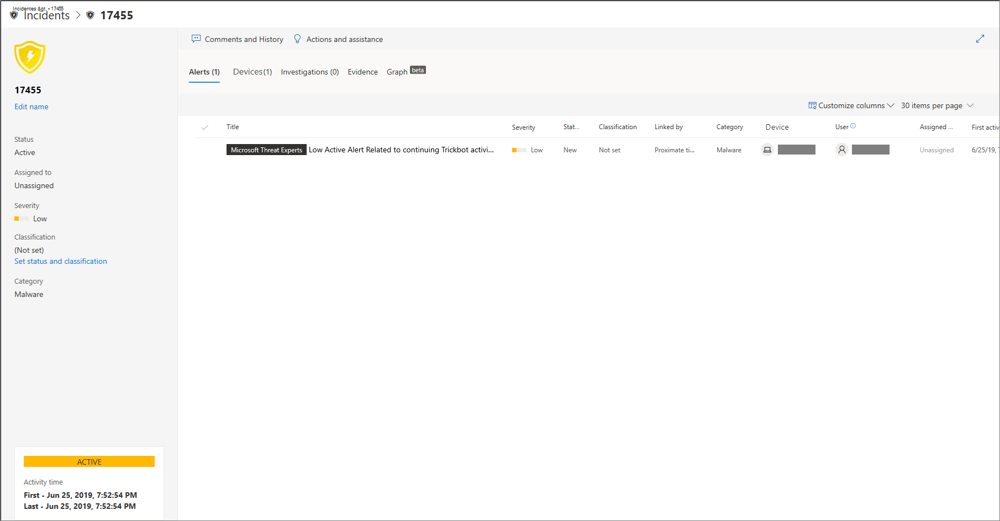
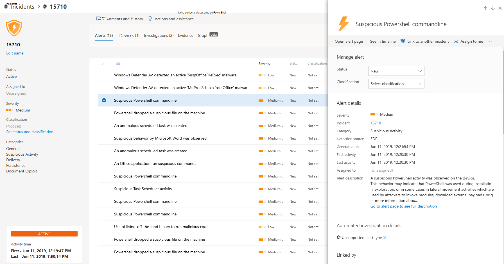
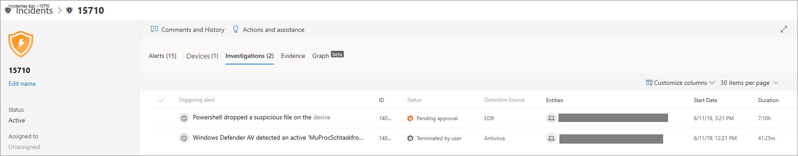
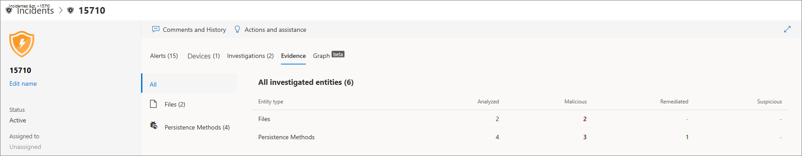
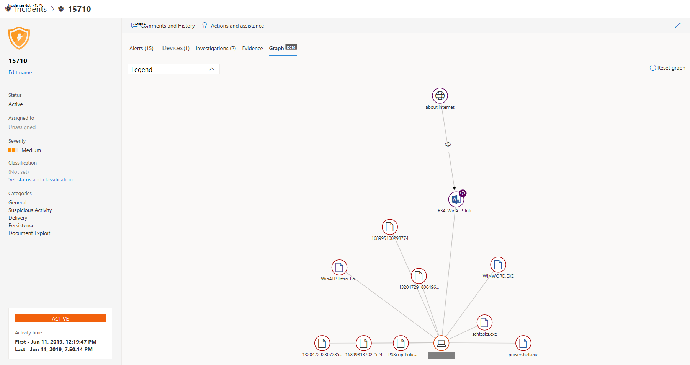
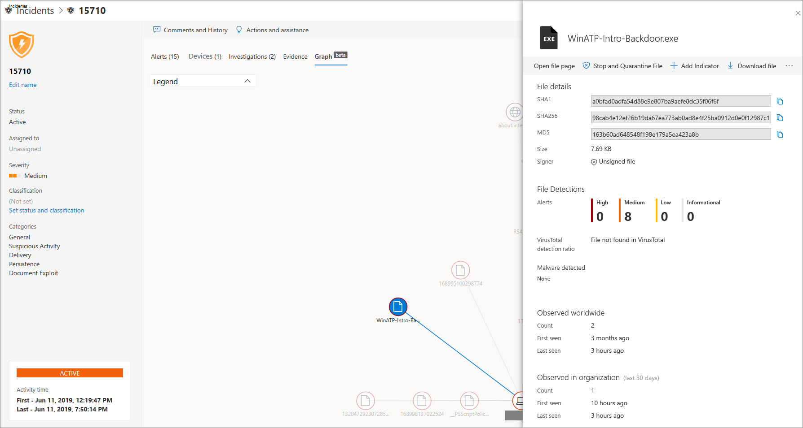

# Investigar incidentes no Microsoft Defender para Ponto de Extremidade

[!INCLUDE [Microsoft 365 Defender rebranding](../../includes/microsoft-defender.md)]

**Aplica-se a:**
- [Microsoft Defender para Ponto de Extremidade](https://go.microsoft.com/fwlink/p/?linkid=2154037)
- [Microsoft 365 Defender](https://go.microsoft.com/fwlink/?linkid=2118804)

Investigue incidentes que afetam sua rede, entenda o que significam e cole evidências para resolvê-los. 

Ao investigar um incidente, você verá:
- Detalhes do incidente
- Comentários e ações de incidentes
- Guias (alertas, dispositivos, investigações, evidências, gráfico)

> [!VIDEO https://www.microsoft.com/en-us/videoplayer/embed/RE4qLUV]

## Analisar detalhes de incidentes 
Clique em um incidente para ver o **painel Incidente.** Selecione **Abrir página de incidentes** para ver os detalhes do incidente e informações relacionadas (alertas, dispositivos, investigações, evidências, gráfico). 

### Alertas
Você pode investigar os alertas e ver como eles foram vinculados em um incidente. Os alertas são agrupados em incidentes com base nos seguintes motivos:
- Investigação automatizada - A investigação automatizada disparou o alerta vinculado ao investigar o alerta original 
- Características do arquivo - Os arquivos associados ao alerta têm características semelhantes
- Associação manual - Um usuário vinculado manualmente aos alertas
- Hora próxima - Os alertas foram disparados no mesmo dispositivo em um determinado período de tempo
- Mesmo arquivo - Os arquivos associados ao alerta são exatamente os mesmos
- Mesma URL - A URL que disparou o alerta é exatamente a mesma

Você também pode gerenciar um alerta e ver metadados de alerta junto com outras informações. Para obter mais informações, consulte [Investigar alertas](investigate-alerts.md). 

### Dispositivos
Você também pode investigar os dispositivos que fazem parte, ou relacionados a um determinado incidente. Para obter mais informações, consulte [Investigar dispositivos](investigate-machines.md).

### Investigações
Selecione **Investigações** para ver todas as investigações automáticas lançadas pelo sistema em resposta aos alertas de incidentes.

## Passando pelas evidências
O Microsoft Defender para Ponto de Extremidade investiga automaticamente todos os eventos com suporte dos incidentes e entidades suspeitas nos alertas, fornecendo a você autoresponse e informações sobre os arquivos importantes, processos, serviços e muito mais. 

Cada uma das entidades analisadas será marcada como infectado, remediado ou suspeito. 

## Visualizando ameaças de segurança cibernética associadas 
O Microsoft Defender for Endpoint agrega as informações de ameaça em um incidente para que você possa ver os padrões e as correlações provenientes de vários pontos de dados. Você pode exibir essa correlação por meio do gráfico de incidentes.

### Gráfico de incidentes
A **Graph** conta a história do ataque de segurança cibernética. Por exemplo, ele mostra qual foi o ponto de entrada, qual indicador de comprometimento ou atividade foi observado em qual dispositivo. etc.

Você pode clicar nos círculos no gráfico de incidentes para exibir os detalhes dos arquivos mal-intencionados, detecções de arquivo associados, quantas instâncias houveram em todo o mundo, se ela foi observada em sua organização, em caso afirmado, quantas instâncias.

## Tópicos relacionados
- [Fila de incidentes](/microsoft-365/security/defender-endpoint/view-incidents-queue)
- [Investigar incidentes no Microsoft Defender para Ponto de Extremidade](/microsoft-365/security/defender-endpoint/investigate-incidents)
- [Gerenciar o Microsoft Defender para incidentes de ponto de extremidade](/microsoft-365/security/defender-endpoint/manage-incidents)
