# Investigar dispositivos na lista do Microsoft Defender for Endpoint DevicesInvestigate devices in the Microsoft Defender for Endpoint Devices list

[!INCLUDE [Microsoft 365 Defender rebranding](../../includes/microsoft-defender.md)]

**Aplica-se a:****Applies to:**
- [Microsoft Defender para Ponto de ExtremidadeMicrosoft Defender for Endpoint](https://go.microsoft.com/fwlink/p/?linkid=2154037)
- [Microsoft 365 DefenderMicrosoft 365 Defender](https://go.microsoft.com/fwlink/?linkid=2118804)

>Deseja experimentar o Defender para Ponto de Extremidade?Want to experience Defender for Endpoint? [Inscreva-se para uma avaliação gratuita.Sign up for a free trial.](https://www.microsoft.com/microsoft-365/windows/microsoft-defender-atp?ocid=docs-wdatp-investigatemachines-abovefoldlink)

Investigue os detalhes de um alerta gerado em um dispositivo específico para identificar outros comportamentos ou eventos que possam estar relacionados ao alerta ou ao escopo potencial da violação.Investigate the details of an alert raised on a specific device to identify other behaviors or events that might be related to the alert or the potential scope of the breach.

> [!NOTE]
> Como parte do processo de investigação ou resposta, você pode coletar um pacote de investigação de um dispositivo.As part of the investigation or response process, you can collect an investigation package from a device. Veja como: Coletar o pacote [de investigação de dispositivos](https://docs.microsoft.com/microsoft-365/security/defender-endpoint/respond-machine-alerts#collect-investigation-package-from-devices).Here's how: [Collect investigation package from devices](https://docs.microsoft.com/microsoft-365/security/defender-endpoint/respond-machine-alerts#collect-investigation-package-from-devices).

Você pode clicar em dispositivos afetados sempre que os vir no portal para abrir um relatório detalhado sobre esse dispositivo.You can click on affected devices whenever you see them in the portal to open a detailed report about that device. Os dispositivos afetados são identificados nas seguintes áreas:Affected devices are identified in the following areas:

- [Lista de dispositivosDevices list](investigate-machines.md)
- [Fila de alertasAlerts queue](alerts-queue.md)
- [Painel de operações de segurançaSecurity operations dashboard](security-operations-dashboard.md)
- Qualquer alerta individualAny individual alert
- Qualquer exibição de detalhes de arquivo individualAny individual file details view
- Qualquer endereço IP ou exibição de detalhes de domínioAny IP address or domain details view

Ao investigar um dispositivo específico, você verá:When you investigate a specific device, you'll see:

- Detalhes do dispositivoDevice details
- Ações de respostaResponse actions
- Guias (visão geral, alertas, linha do tempo, recomendações de segurança, inventário de software, vulnerabilidades descobertas, KBs ausentes)Tabs (overview, alerts, timeline, security recommendations, software inventory, discovered vulnerabilities, missing KBs)
- Cartões (alertas ativos, usuários conectados, avaliação de segurança)Cards (active alerts, logged on users, security assessment)

## Detalhes do dispositivoDevice details

A seção detalhes do dispositivo fornece informações como o domínio, o sistema operacional e o estado de saúde do dispositivo.The device details section provides information such as the domain, OS, and health state of the device. Se houver um pacote de investigação disponível no dispositivo, você verá um link que permite baixar o pacote.If there's an investigation package available on the device, you'll see a link that allows you to download the package.

## Ações de respostaResponse actions

As ações de resposta são executados ao longo da parte superior de uma página de dispositivo específica e incluem:Response actions run along the top of a specific device page and include:

- Gerenciar marcasManage tags
- Isolar dispositivoIsolate device
- Restringir a execução do aplicativoRestrict app execution
- Executar verificação antivírusRun antivirus scan
- Coletar pacote de investigaçãoCollect investigation package
- Iniciar sessão de resposta ao vivoInitiate Live Response Session
- Iniciar investigação automatizadaInitiate automated investigation
- Consultar um especialista em ameaçasConsult a threat expert
- Central de açõesAction center

Você pode tomar ações de resposta no Centro de Ações, em uma página de dispositivo específica ou em uma página de arquivo específica.You can take response actions in the Action center, in a specific device page, or in a specific file page.

Para obter mais informações sobre como agir em um dispositivo, consulte [Take response action on a device](respond-machine-alerts.md).For more information on how to take action on a device, see [Take response action on a device](respond-machine-alerts.md).

Para obter mais informações, consulte [Investigar entidades do usuário](investigate-user.md).For more information, see [Investigate user entities](investigate-user.md).

## GuiasTabs

As guias fornecem informações relevantes de prevenção de ameaças e segurança relacionadas ao dispositivo.The tabs provide relevant security and threat prevention information related to the device. Em cada guia, você pode personalizar as colunas mostradas selecionando **Personalizar colunas** da barra acima dos headers da coluna.In each tab, you can customize the columns that are shown by selecting **Customize columns** from the bar above the column headers.

### Visão GeralOverview
A **guia Visão** geral exibe os cartões [para](#cards) alertas ativos, conectados aos usuários e avaliação de segurança.The **Overview** tab displays the [cards](#cards) for active alerts, logged on users, and security assessment.

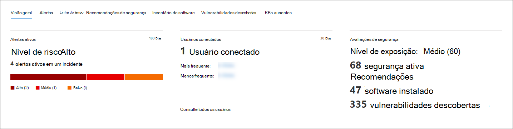

### AlertasAlerts

A **guia Alertas** fornece uma lista de alertas associados ao dispositivo.The **Alerts** tab provides a list of alerts that are associated with the device. Esta lista é uma versão filtrada da fila de [Alertas](alerts-queue.md)e mostra uma breve descrição do alerta, gravidade (alto, médio, baixo, informacional), status na fila (novo, em andamento, resolvido), classificação (não definido, alerta falso, alerta verdadeiro), estado de investigação, categoria de alerta, quem está abordando o alerta e a última atividade.This list is a filtered version of the [Alerts queue](alerts-queue.md), and shows a short description of the alert, severity (high, medium, low, informational), status in the queue (new, in progress, resolved), classification (not set, false alert, true alert), investigation state, category of alert, who is addressing the alert, and last activity. Você também pode filtrar os alertas.You can also filter the alerts.

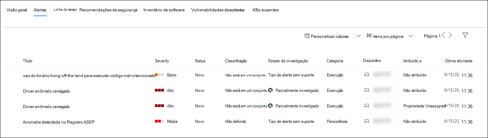

Quando o ícone de círculo à esquerda de um alerta é selecionado, um sub-menu é exibido.When the circle icon to the left of an alert is selected, a fly-out appears. Neste painel, você pode gerenciar o alerta e exibir mais detalhes, como número de incidentes e dispositivos relacionados.From this panel you can manage the alert and view more details such as incident number and related devices. Vários alertas podem ser selecionados por vez.Multiple alerts can be selected at a time.

Para ver uma exibição de página completa de um alerta, incluindo gráfico de incidentes e árvore de processo, selecione o título do alerta.To see a full page view of an alert including incident graph and process tree, select the title of the alert.

### Linha do tempoTimeline

A **guia Linha** do Tempo fornece uma exibição cronológica dos eventos e alertas associados que foram observados no dispositivo.The **Timeline** tab provides a chronological view of the events and associated alerts that have been observed on the device. Isso pode ajudá-lo a correlacionar quaisquer eventos, arquivos e endereços IP em relação ao dispositivo.This can help you correlate any events, files, and IP addresses in relation to the device.

A linha do tempo também permite que você faça uma análise seletiva de eventos que ocorreram dentro de um determinado período de tempo.The timeline also enables you to selectively drill down into events that occurred within a given time period. Você pode exibir a sequência temporal de eventos que ocorreram em um dispositivo durante um período de tempo selecionado.You can view the temporal sequence of events that occurred on a device over a selected time period. Para controlar ainda mais sua exibição, você pode filtrar por grupos de eventos ou personalizar as colunas.To further control your view, you can filter by event groups or customize the columns.

>[!NOTE]
> Para que os eventos de firewall sejam exibidos, você precisará habilitar a política de auditoria, consulte [Audit Filtering Platform connection](https://docs.microsoft.com/windows/security/threat-protection/auditing/audit-filtering-platform-connection).For firewall events to be displayed, you'll need to enable the audit policy, see [Audit Filtering Platform connection](https://docs.microsoft.com/windows/security/threat-protection/auditing/audit-filtering-platform-connection).
>O firewall abrange os seguintes eventosFirewall covers the following events
>
>- [5025](https://docs.microsoft.com/windows/security/threat-protection/auditing/event-5025) - serviço de firewall interrompido[5025](https://docs.microsoft.com/windows/security/threat-protection/auditing/event-5025) - firewall service stopped
>- [5031](https://docs.microsoft.com/windows/security/threat-protection/auditing/event-5031) - aplicativo impedido de aceitar conexões de entrada na rede[5031](https://docs.microsoft.com/windows/security/threat-protection/auditing/event-5031) - application blocked from accepting incoming connections on the network
>- [5157](https://docs.microsoft.com/windows/security/threat-protection/auditing/event-5157) - conexão bloqueada[5157](https://docs.microsoft.com/windows/security/threat-protection/auditing/event-5157) - blocked connection

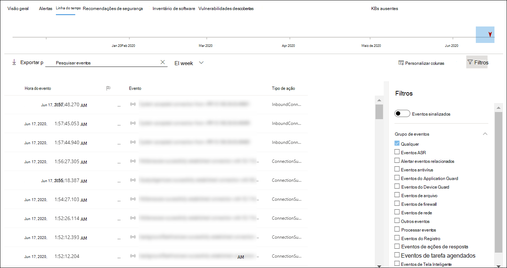

Algumas das funcionalidades incluem:Some of the functionality includes:

- Pesquisar eventos específicosSearch for specific events
  - Use a barra de pesquisa para procurar eventos de linha do tempo específicos.Use the search bar to look for specific timeline events.
- Filtrar eventos de uma data específicaFilter events from a specific date
  - Selecione o ícone de calendário no canto superior esquerdo da tabela para exibir eventos no último dia, semana, 30 dias ou intervalo personalizado.Select the calendar icon in the upper left of the table to display events in the past day, week, 30 days, or custom range. Por padrão, a linha do tempo do dispositivo é definida para exibir os eventos dos últimos 30 dias.By default, the device timeline is set to display the events from the past 30 days.
  - Use a linha do tempo para pular para um momento específico no tempo realçando a seção.Use the timeline to jump to a specific moment in time by highlighting the section. As setas na linha do tempo apontam investigações automatizadasThe arrows on the timeline pinpoint automated investigations
- Exportar eventos de linha do tempo detalhados do dispositivoExport detailed device timeline events
  - Exporte a linha do tempo do dispositivo para a data atual ou um intervalo de data especificado até sete dias.Export the device timeline for the current date or a specified date range up to seven days.

Mais detalhes sobre determinados eventos são fornecidos na **seção Informações** adicionais.More details about certain events are provided in the **Additional information** section. Esses detalhes variam dependendo do tipo de evento, por exemplo:These details vary depending on the type of event, for example: 

- Contido pelo Application Guard - o evento do navegador da Web foi restrito por um contêiner isoladoContained by Application Guard - the web browser event was restricted by an isolated container
- Ameaça ativa detectada - a detecção de ameaça ocorreu enquanto a ameaça estava em execuçãoActive threat detected - the threat detection occurred while the threat was running
- Correção malsucedida - uma tentativa de correção da ameaça detectada foi invocada, mas falhouRemediation unsuccessful - an attempt to remediate the detected threat was invoked but failed
- Correção bem-sucedida - a ameaça detectada foi interrompida e limpaRemediation successful - the detected threat was stopped and cleaned
- Aviso ignorado pelo usuário - o aviso Windows Defender SmartScreen foi ignorado e substituído por um usuárioWarning bypassed by user - the Windows Defender SmartScreen warning was dismissed and overridden by a user
- Script suspeito detectado - um script potencialmente mal-intencionado foi encontrado em execuçãoSuspicious script detected - a potentially malicious script was found running
- A categoria de alerta - se o evento levou à geração de um alerta, a categoria de alerta ("Movimento Lateral", por exemplo) é fornecidaThe alert category - if the event led to the generation of an alert, the alert category  ("Lateral Movement", for example) is provided

#### Detalhes do eventoEvent details
Selecione um evento para exibir detalhes relevantes sobre esse evento.Select an event to view relevant details about that event. Um painel é exibido para mostrar informações gerais do evento.A panel displays to show general event information. Quando aplicável e os dados estão disponíveis, um gráfico mostrando entidades relacionadas e suas relações também são mostrados.When applicable and data is available, a graph showing related entities and their relationships are also shown.

Para inspecionar ainda mais o evento e  os eventos relacionados, você pode executar rapidamente uma consulta de busca avançada selecionando **Hunt para eventos relacionados.**To further inspect the event and related events, you can quickly run an [advanced hunting](advanced-hunting-overview.md) query by selecting **Hunt for related events**. A consulta retornará o evento selecionado e a lista de outros eventos que ocorreram ao mesmo tempo no mesmo ponto de extremidade.The query will return the selected event and the list of other events that occurred around the same time on the same endpoint.

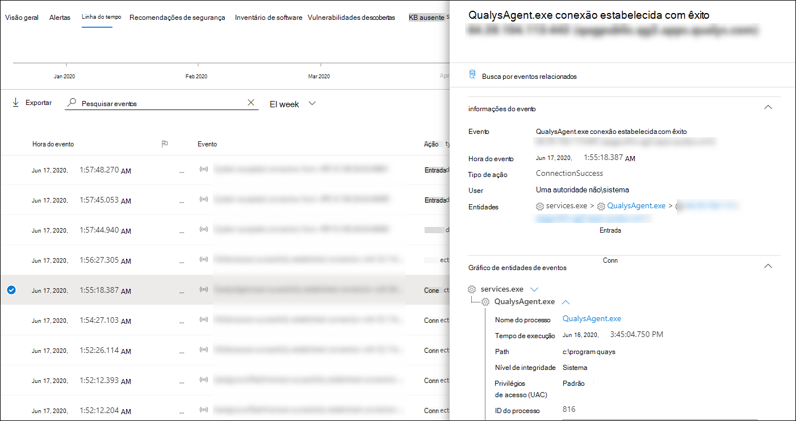

### Recomendações de segurançaSecurity recommendations

**As recomendações de segurança** são geradas do Microsoft Defender para o recurso de Gerenciamento de [Vulnerabilidades](tvm-dashboard-insights.md) & Ameaças do Ponto de Extremidade.**Security recommendations** are generated from Microsoft Defender for Endpoint's [Threat & Vulnerability Management](tvm-dashboard-insights.md) capability. Selecionar uma recomendação mostrará um painel onde você pode exibir detalhes relevantes, como a descrição da recomendação e os riscos potenciais associados à não decretação.Selecting a recommendation will show a panel where you can view relevant details such as description of the recommendation and the potential risks associated with not enacting it. Consulte [Recomendação de segurança](tvm-security-recommendation.md) para obter detalhes.See [Security recommendation](tvm-security-recommendation.md) for details.

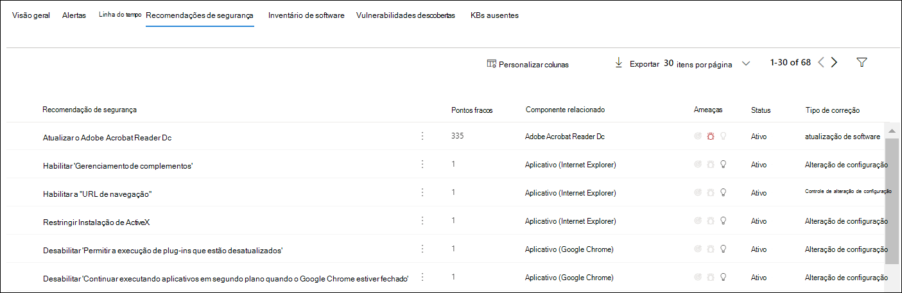

### Inventário de softwareSoftware inventory

A **guia Inventário de** software permite que você veja o software no dispositivo, juntamente com quaisquer pontos fracos ou ameaças.The **Software inventory** tab lets you view software on the device, along with any weaknesses or threats. Selecionar o nome do software levará você para a página de detalhes do software onde você pode exibir recomendações de segurança, vulnerabilidades descobertas, dispositivos instalados e distribuição de versão.Selecting the name of the software will take you to the software details page where you can view security recommendations, discovered vulnerabilities, installed devices, and version distribution. Consulte [Inventário de software](tvm-software-inventory.md) para obter detalhesSee [Software inventory](tvm-software-inventory.md) for details

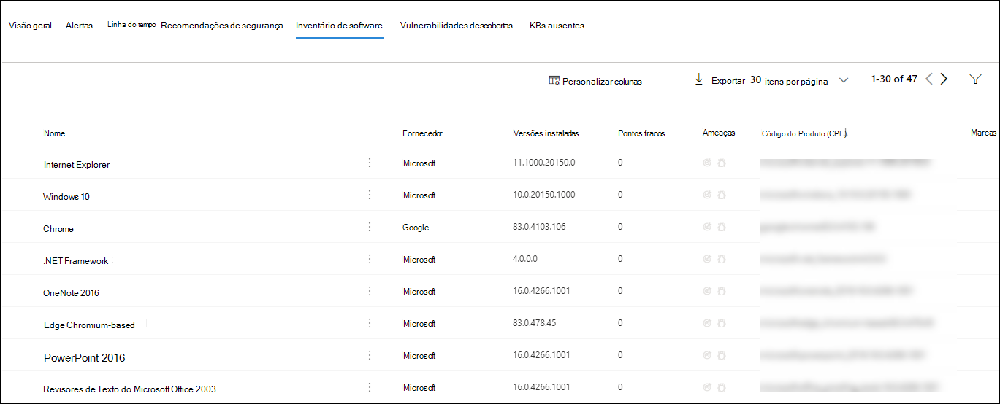

### Vulnerabilidades descobertasDiscovered vulnerabilities

A **guia Vulnerabilidades Descobertas** mostra o nome, a gravidade e as percepções de ameaça das vulnerabilidades descobertas no dispositivo.The **Discovered vulnerabilities** tab shows the name, severity, and threat insights of discovered vulnerabilities on the device. Selecionar vulnerabilidades específicas mostrará uma descrição e detalhes.Selecting specific vulnerabilities will show a description and details.

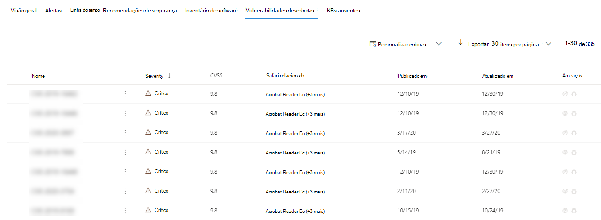

### KBs ausentesMissing KBs
A **guia KBs ausentes** lista as atualizações de segurança ausentes para o dispositivo.The **Missing KBs** tab lists the missing security updates for the device.

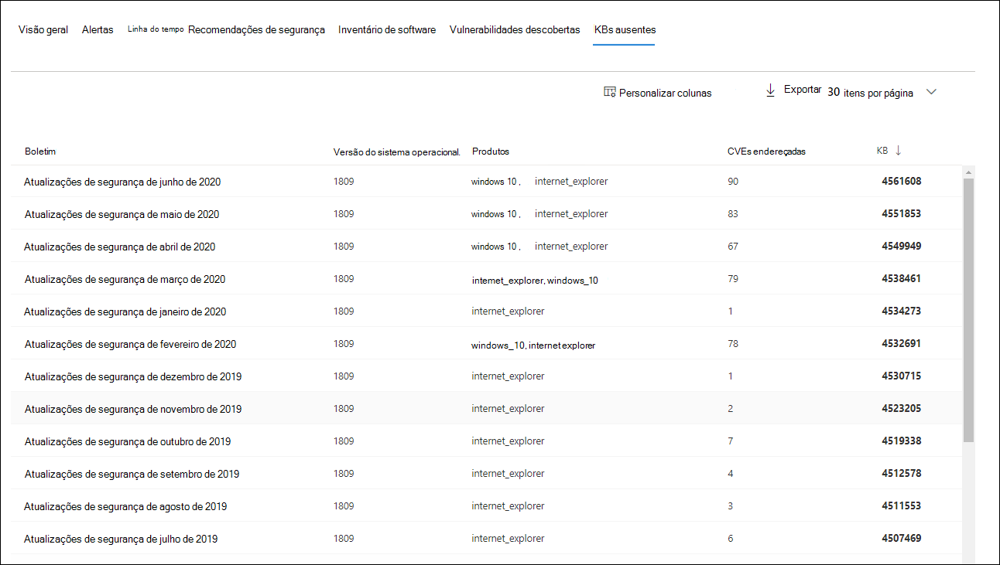

## CartõesCards

### Alertas ativosActive alerts

O cartão proteção avançada contra ameaças do **Azure** exibirá uma visão geral de alto nível dos alertas relacionados ao dispositivo e seu nível de risco, se você tiver habilitado o recurso ATP do Azure e houver alertas ativos.The **Azure Advanced Threat Protection** card will display a high-level overview of alerts related to the device and their risk level, if you have enabled the Azure ATP feature, and there are any active alerts. Mais informações estão disponíveis na sonda "Alertas".More information is available in the "Alerts" drill down.

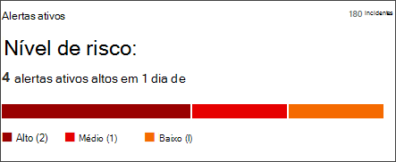

>[!NOTE]
>Você precisará habilitar a integração no Azure ATP e no Defender for Endpoint para usar esse recurso.You'll need to enable the integration on both Azure ATP and Defender for Endpoint to use this feature. No Defender para Ponto de Extremidade, você pode habilitar esse recurso em recursos avançados.In Defender for Endpoint, you can enable this feature in advanced features. Para obter mais informações sobre como habilitar recursos avançados, consulte [Ativar recursos avançados](advanced-features.md).For more information on how to enable advanced features, see [Turn on advanced features](advanced-features.md).

### Usuários conectadosLogged on users

O **cartão Usuários** Conectados mostra quantos usuários entraram nos últimos 30 dias, juntamente com os usuários mais e menos frequentes.The **Logged on users** card shows how many users have logged on in the past 30 days, along with the most and least frequent users. Selecionar o link "Ver todos os usuários" abre o painel de detalhes, que exibe informações como tipo de usuário, tipo de logoff e quando o usuário foi visto pela primeira e última vez.Selecting the "See all users" link opens the details pane, which displays information such as user type, log on type, and when the user was first and last seen. Para obter mais informações, consulte [Investigar entidades do usuário](investigate-user.md).For more information, see [Investigate user entities](investigate-user.md).

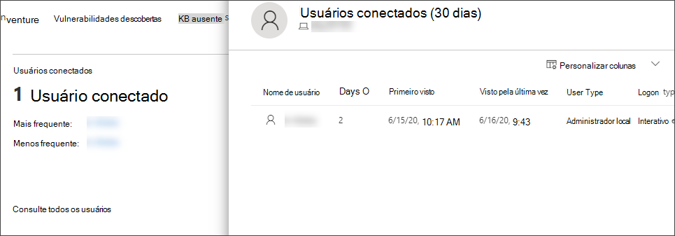

### Avaliações de segurançaSecurity assessments

O **cartão de avaliações de** segurança mostra o nível geral de exposição, recomendações de segurança, software instalado e vulnerabilidades descobertas.The **Security assessments** card shows the overall exposure level, security recommendations, installed software, and discovered vulnerabilities. O nível de exposição de um dispositivo é determinado pelo impacto acumulado de suas recomendações de segurança pendentes.A device's exposure level is determined by the cumulative impact of its pending security recommendations.

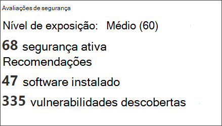

## Tópicos relacionadosRelated topics

- [Exibir e organizar a fila de alertas do Microsoft Defender for EndpointView and organize the Microsoft Defender for Endpoint Alerts queue](alerts-queue.md)
- [Gerenciar alertas do Microsoft Defender para Pontos de ExtremidadeManage Microsoft Defender for Endpoint alerts](manage-alerts.md)
- [Investigar alertas do Microsoft Defender para Pontos de ExtremidadeInvestigate Microsoft Defender for Endpoint alerts](investigate-alerts.md)
- [Investigar um arquivo associado a um alerta do Defender para Ponto de ExtremidadeInvestigate a file associated with a Defender for Endpoint alert](investigate-files.md)
- [Investigar um endereço IP associado a um alerta do Defender para Ponto de ExtremidadeInvestigate an IP address associated with a Defender for Endpoint alert](investigate-ip.md)
- [Investigar um domínio associado a um alerta do Defender para Ponto de ExtremidadeInvestigate a domain associated with a Defender for Endpoint alert](investigate-domain.md)
- [Investigar uma conta de usuário no Defender para Ponto de ExtremidadeInvestigate a user account in Defender for Endpoint](investigate-user.md)
- [Recomendação de segurançaSecurity recommendation](tvm-security-recommendation.md)
- [Inventário de softwareSoftware inventory](tvm-software-inventory.md)
