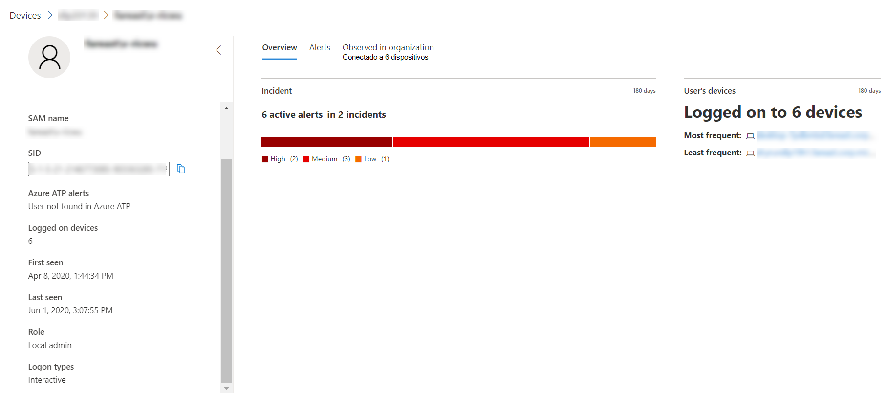

# Investigar uma conta de usuário no Microsoft Defender para Ponto de Extremidade

[!INCLUDE [Microsoft 365 Defender rebranding](../../includes/microsoft-defender.md)]

**Aplica-se a:**
- [Microsoft Defender para Ponto de Extremidade](https://go.microsoft.com/fwlink/p/?linkid=2154037)
- [Microsoft 365 Defender](https://go.microsoft.com/fwlink/?linkid=2118804)

>Deseja experimentar o Defender para Ponto de Extremidade? [Inscreva-se para uma avaliação gratuita.](https://www.microsoft.com/microsoft-365/windows/microsoft-defender-atp?ocid=docs-wdatp-investigatgeuser-abovefoldlink)

## Investigar entidades de conta de usuário

Identifique as contas de usuário com os alertas mais ativos (exibidos no painel como "Usuários em risco") e investigue casos de possíveis credenciais comprometidas ou pivô na conta de usuário associada ao investigar um alerta ou dispositivo para identificar possível movimento lateral entre dispositivos com essa conta de usuário.

Você pode encontrar informações de conta de usuário nos seguintes exibições:

- Painel
- Fila de alertas
- Página de detalhes do dispositivo

Um link de conta de usuário clicável está disponível nessas exibições, que o levará até a página de detalhes da conta de usuário, onde mais detalhes sobre a conta de usuário são mostrados.

Ao investigar uma entidade de conta de usuário, você verá:

- Detalhes da conta de usuário, alertas da Proteção Avançada contra Ameaças do Azure (Azure ATP) e logon em dispositivos, função, tipo de logon e outros detalhes
- Visão geral dos incidentes e dispositivos do usuário
- Alertas relacionados a esse usuário
- Observado na organização (dispositivos conectados)

### Detalhes do usuário

O  painel de detalhes do Usuário à esquerda fornece informações sobre o usuário, como incidentes abertos relacionados, alertas ativos, nome SAM, SID, alertas do Azure ATP, número de dispositivos aos quais o usuário está conectado, quando o usuário foi visto pela primeira e última vez, função e tipos de logon. Dependendo dos recursos de integração habilitados, você verá outros detalhes. Por exemplo, se você habilitar a integração do Skype for Business, poderá entrar em contato com o usuário a partir do portal. A **seção alertas atp do Azure** contém um link que o levará para a página atp do Azure, se você tiver habilitado o recurso atp do Azure e houver alertas relacionados ao usuário. A página do Azure ATP fornecerá mais informações sobre os alertas.

>[!NOTE]
>Você precisará habilitar a integração no Azure ATP e no Defender for Endpoint para usar esse recurso. No Defender para Ponto de Extremidade, você pode habilitar esse recurso em recursos avançados. Para obter mais informações sobre como habilitar recursos avançados, consulte [Ativar recursos avançados](advanced-features.md).

A Visão Geral, Alertas e Observados na organização são guias diferentes que exibem vários atributos sobre a conta do usuário.

### Visão Geral

A **guia Visão** geral mostra os detalhes dos incidentes e uma lista dos dispositivos aos que o usuário fez logor. Você pode expandi-los para ver detalhes dos eventos de logoff para cada dispositivo.

### Alertas

A **guia Alertas** fornece uma lista de alertas associados à conta de usuário. Esta lista é uma exibição filtrada da fila alerta [e](alerts-queue.md)mostra alertas onde o contexto do usuário é a conta de usuário selecionada, a data em que a última atividade foi detectada, uma breve descrição do alerta, o dispositivo associado ao alerta, a gravidade do alerta, o status do alerta na fila e quem recebe o alerta.

### Observado na organização

A guia **Observado** na organização permite que você especifique um intervalo de datas para ver uma lista de dispositivos em que esse usuário foi observado conectado, a conta de usuário mais frequente e menos frequente registrada em cada um desses dispositivos e o total de usuários observados em cada dispositivo.

Selecionar um item na tabela Observado na organização expandirá o item, revelando mais detalhes sobre o dispositivo. Selecionar diretamente um link dentro de um item o enviará para a página correspondente.

## Pesquisar contas de usuário específicas

1. Selecione **Usuário** no menu suspenso **barra** de pesquisa.
2. Insira a conta de usuário no **campo** Pesquisa.
3. Clique no ícone de pesquisa ou pressione **Enter**.

Uma lista de usuários que coincidem com o texto da consulta é exibida. Você verá o domínio e o nome da conta de usuário, quando a conta de usuário foi vista pela última vez, e o número total de dispositivos nos últimos 30 dias.

Você pode filtrar os resultados pelos seguintes períodos de tempo:

- 1 dia
- 3 dias
- 7 dias
- 30 dias
- 6 meses

## Tópicos relacionados

- [Exibir e organizar a fila de alertas do Microsoft Defender for Endpoint](alerts-queue.md)
- [Gerenciar alertas do Microsoft Defender para Pontos de Extremidade](manage-alerts.md)
- [Investigar alertas do Microsoft Defender para Pontos de Extremidade](investigate-alerts.md)
- [Investigar um arquivo associado a um alerta do Defender para Ponto de Extremidade](investigate-files.md)
- [Investigar dispositivos na lista Defender para Dispositivos de Ponto de Extremidade](investigate-machines.md)
- [Investigar um endereço IP associado a um alerta do Defender para Ponto de Extremidade](investigate-ip.md)
- [Investigar um domínio associado a um alerta do Defender para Ponto de Extremidade](investigate-domain.md)
