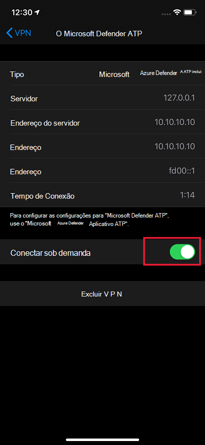
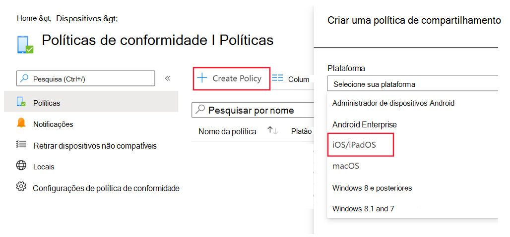
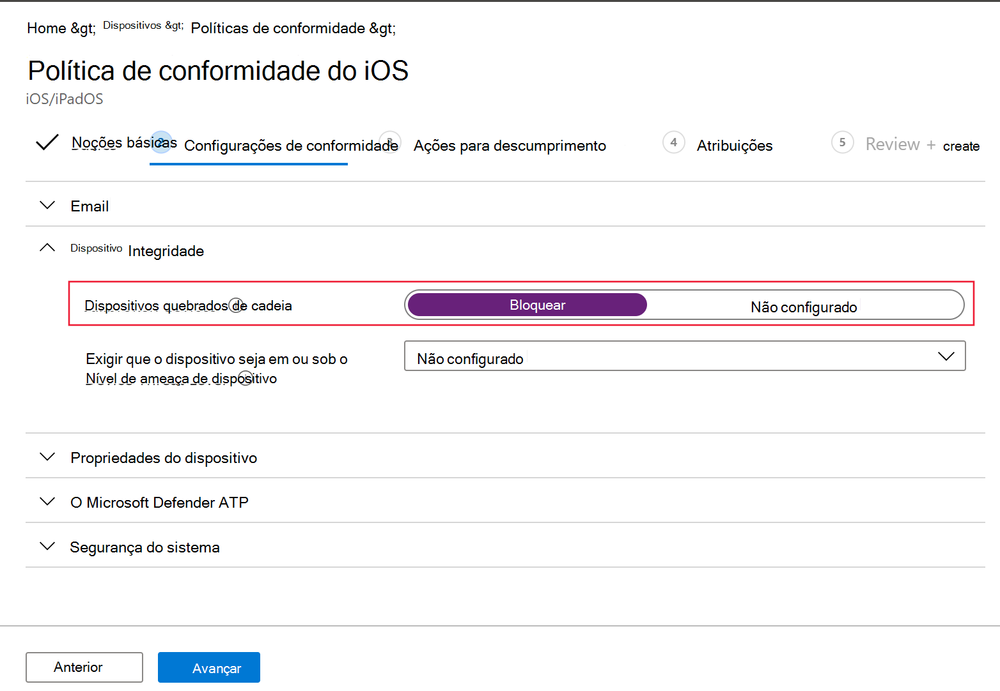
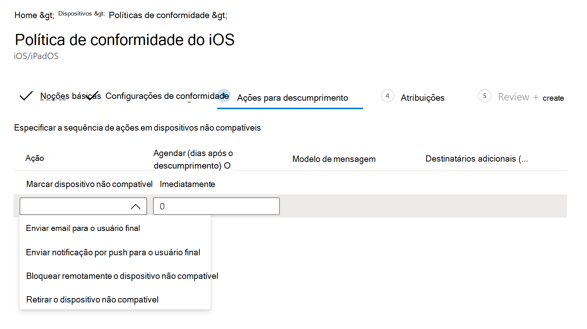

# Configurar o Microsoft Defender para Ponto de Extremidade em recursos do iOS

[!INCLUDE [Microsoft 365 Defender rebranding](../../includes/microsoft-defender.md)]

**Aplica-se a:**
- [Microsoft Defender para Ponto de Extremidade](https://go.microsoft.com/fwlink/p/?linkid=2154037)
- [Microsoft 365 Defender](https://go.microsoft.com/fwlink/?linkid=2118804)

> Deseja experimentar o Defender para Ponto de Extremidade? [Inscreva-se para uma avaliação gratuita.](https://www.microsoft.com/microsoft-365/windows/microsoft-defender-atp?ocid=docs-wdatp-exposedapis-abovefoldlink) 

> [!NOTE]
> O Defender for Endpoint no iOS usaria uma VPN para fornecer o recurso de Proteção da Web. Esta não é uma VPN regular e é uma VPN local/auto-loop que não faz o tráfego fora do dispositivo.

## Acesso condicional com o Defender para Ponto de Extremidade no iOS  
O Microsoft Defender for Endpoint no iOS juntamente com o Microsoft Intune e Azure Active Directory permite aplicar políticas de conformidade de dispositivo e Acesso Condicional com base na pontuação de risco do dispositivo. O Defender for Endpoint é uma solução MTD (Mobile Threat Defense) que você pode implantar para aproveitar esse recurso por meio do Intune.

Para obter mais informações sobre como configurar o Acesso Condicional com o Defender para Ponto de Extremidade no iOS, consulte [Defender for Endpoint e Intune](/mem/intune/protect/advanced-threat-protection).

### Detecção de jailbreak pelo Microsoft Defender para Ponto de Extremidade
O Microsoft Defender para Ponto de Extremidade tem a capacidade de detectar dispositivos gerenciados e não gerenciados que são jailbroken. Se um dispositivo for detectado como jailbroken, um alerta de alto risco será relatado ao Centro de Segurança e se o Acesso Condicional for configurado com base na pontuação de risco do dispositivo, o dispositivo será impedido de acessar dados corporativos.

## Proteção da Web e VPN

Por padrão, o Defender para Ponto de Extremidade no iOS inclui e habilita o recurso de proteção da Web. [A proteção da Web](web-protection-overview.md) ajuda a proteger dispositivos contra ameaças da Web e proteger os usuários contra ataques de phishing. O Defender for Endpoint no iOS usa uma VPN para fornecer essa proteção. Observe que esta é uma VPN local e, ao contrário da VPN tradicional, o tráfego de rede não é enviado fora do dispositivo.

Embora habilitada por padrão, pode haver alguns casos que exigem que você desabilite a VPN. Por exemplo, você deseja executar alguns aplicativos que não funcionam quando uma VPN está configurada. Nesses casos, você pode optar por desabilitar a VPN do aplicativo no dispositivo seguindo as etapas abaixo:

1. Em seu dispositivo iOS, abra o aplicativo **Configurações,** clique ou toque em **Geral** **e,** em seguida, VPN .
1. Clique ou toque no botão "i" do Microsoft Defender para Ponto de Extremidade.
1. Desative o **Conexão Sob Demanda para** desabilitar a VPN.

    > [!div class="mx-imgBorder"]
    > 

> [!NOTE]
> A Proteção da Web não estará disponível quando a VPN estiver desabilitada. Para habilitar a Proteção Web de novo, abra o aplicativo Microsoft Defender para Ponto de Extremidade no dispositivo e clique ou toque em **Iniciar VPN**.

## Co-existência de vários perfis VPN

O iOS da Apple não dá suporte a várias VPNs em todo o dispositivo para serem ativas simultaneamente. Embora vários perfis VPN possam existir no dispositivo, apenas uma VPN pode estar ativa por vez.

## Configurar o sinal de risco do Microsoft Defender para Ponto de Extremidade na política de proteção de aplicativos (MAM)

O Microsoft Defender for Endpoint pode ser configurado para enviar sinais de ameaça a serem usados em Políticas de Proteção de Aplicativos (APP, também conhecido como MAM) no iOS/iPadOS. Com esse recurso, você também pode usar o Microsoft Defender para o Ponto de Extremidade para proteger o acesso aos dados corporativos de dispositivos não reemrollados.

As etapas para configurar políticas de proteção de aplicativos com o Microsoft Defender para Ponto de Extremidade estão abaixo:

1. Configurar a conexão do seu locatário Microsoft Endpoint Manager o Microsoft Defender para Ponto de Extremidade. No Centro de administração do Gerenciador de Ponto de Extremidade da [Microsoft](https://go.microsoft.com/fwlink/?linkid=2109431), vá para Conectores de Administração de Locatários e tokens do Microsoft Defender para Ponto de Extremidade (em Plataforma Cruzada) ou Segurança de Ponto de Extremidade do Microsoft Defender para Ponto de Extremidade (em Instalação) e a ata as alternâncias em Política de Proteção de  >    >   Aplicativo Configurações   >   **para iOS**.
1. Selecione Salvar. Você deve ver **que o status da conexão** agora está definido como **Habilitado**.
1. Criar política de proteção de aplicativo: depois que a configuração do conector do Microsoft Defender for Endpoint for concluída, navegue até **Políticas** de proteção de aplicativos (em Política) para criar uma nova política ou atualizar  >   uma existente.
1. Selecione a plataforma, **aplicativos, proteção de dados, configurações** de requisitos do Access que sua organização exige para sua política.
1. Em **Condições de lançamento condicional** Do dispositivo, você encontrará a configuração Nível máximo de ameaça de dispositivo  >   **permitido.** Isso precisará ser configurado para Baixo, Médio, Alto ou Protegido. As ações disponíveis para você serão Bloquear o **acesso ou** **apagar dados**. Você pode ver uma caixa de diálogo informacional para garantir que seu conector seja definido antes que essa configuração entre em vigor. Se o conector já estiver definido, você poderá ignorar essa caixa de diálogo.
1. Termine com atribuições e salve sua política.

Para obter mais detalhes sobre a política de proteção de aplicativos ou MAM, consulte configurações da política de proteção de [aplicativos do iOS.](https://docs.microsoft.com/mem/intune/apps/app-protection-policy-settings-ios)

### Implantando o Microsoft Defender para Ponto de Extremidade para MAM ou em dispositivos não reemrollados

O Microsoft Defender para Ponto de Extremidade no iOS habilita o cenário de Política de Proteção de Aplicativos e está disponível na Loja de Aplicativos da Apple.

Os usuários finais devem instalar a versão mais recente do aplicativo diretamente na Loja de Aplicativos da Apple.

## Configurar a política de conformidade em dispositivos com cadeia de segurança

Para proteger os dados corporativos de serem acessados em dispositivos iOS de cadeia, recomendamos que você defina a seguinte política de conformidade no Intune.

> [!NOTE]
> A detecção de jailbreak é um recurso fornecido pelo Microsoft Defender para Endpoint no iOS. No entanto, recomendamos que você configure essa política como uma camada adicional de defesa contra cenários de jailbreak.

Siga as etapas a seguir para criar uma política de conformidade contra dispositivos com cadeia de segurança.

1. No [Microsoft Endpoint Manager de administração,](https://go.microsoft.com/fwlink/?linkid=2109431)vá para **Políticas** de Conformidade  ->  **de**  ->  **Dispositivos Criar Política**. Selecione "iOS/iPadOS" como plataforma e clique em **Criar**.

    > [!div class="mx-imgBorder"]
    > 

2. Especifique um nome da política, por exemplo "Política de Conformidade para Jailbreak".
3. Na página configurações de conformidade, clique para expandir a seção **Saúde do** Dispositivo e clique **em Bloquear** para **dispositivos jailbroken.**

    > [!div class="mx-imgBorder"]
    > 

4. Na seção **Ação para não conformidade,** selecione as ações de acordo com seus requisitos e selecione **Próximo**.

    > [!div class="mx-imgBorder"]
    > 

5. Na seção **Atribuições,** selecione os grupos de usuários que você deseja incluir para esta política e selecione **Próximo**.
6. Na seção **Review+Create,** verifique se todas as informações inseridas estão corretas e selecione **Criar**.

## Configurar indicadores personalizados

O Defender for Endpoint no iOS permite que os administradores configurem indicadores personalizados em dispositivos iOS também. Para obter mais informações sobre como configurar indicadores personalizados, consulte [Manage indicators](/microsoft-365/security/defender-endpoint/manage-indicators).

> [!NOTE]
> O Defender para Ponto de Extremidade no iOS dá suporte à criação de indicadores personalizados apenas para endereços IP e URLs/domínios.

## Relatar site não seguro

Sites de phishing personificam sites confiáveis com o objetivo de obter suas informações pessoais ou financeiras. Visite a [página Fornecer comentários sobre a](https://www.microsoft.com/wdsi/filesubmission/exploitguard/networkprotection) proteção de rede se quiser relatar um site que pode ser um site de phishing.

