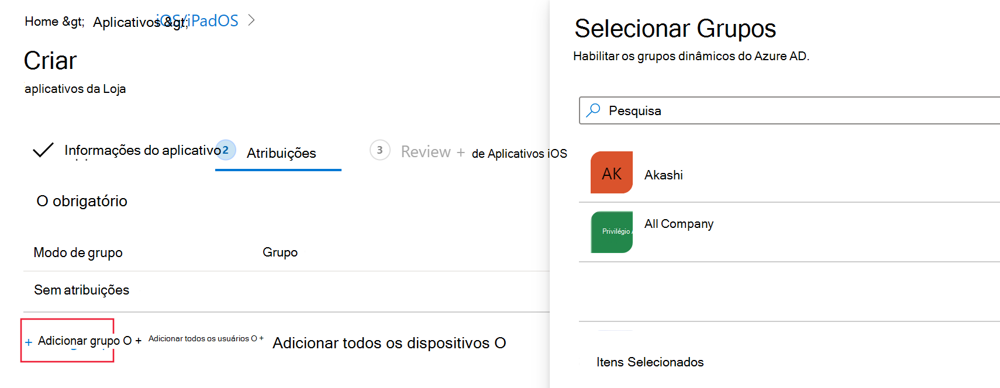
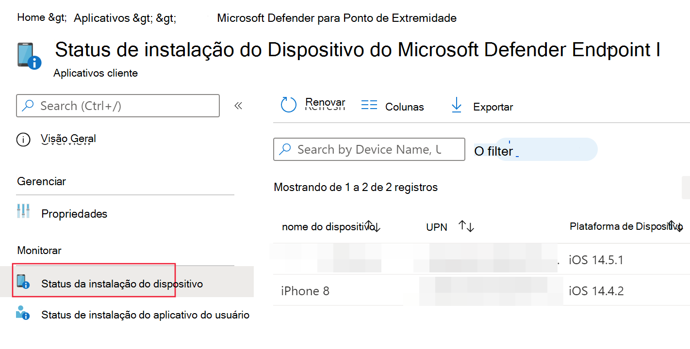
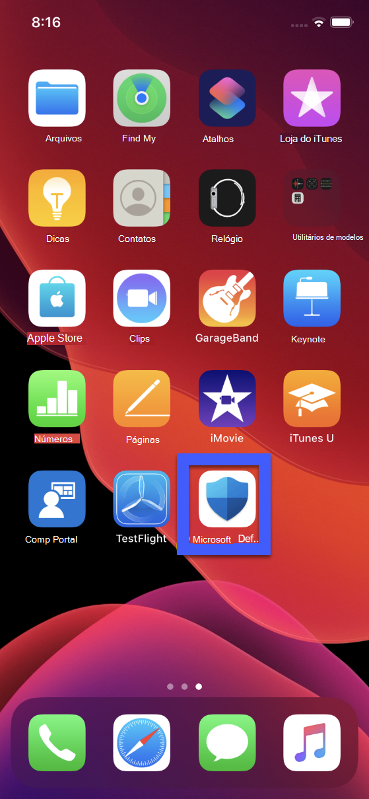
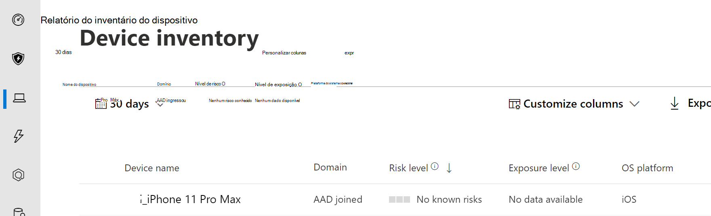
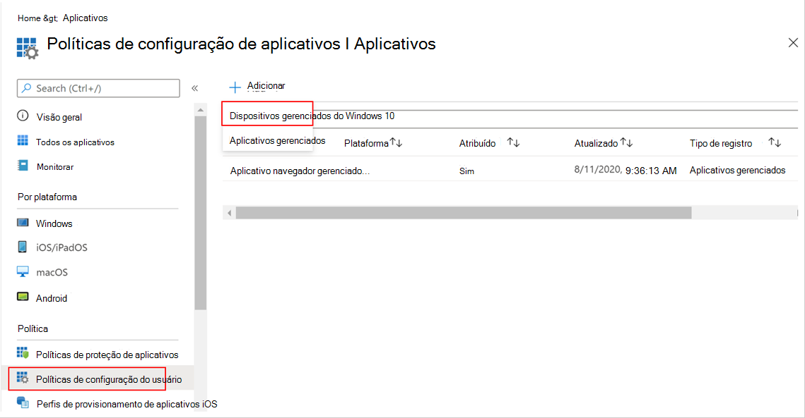
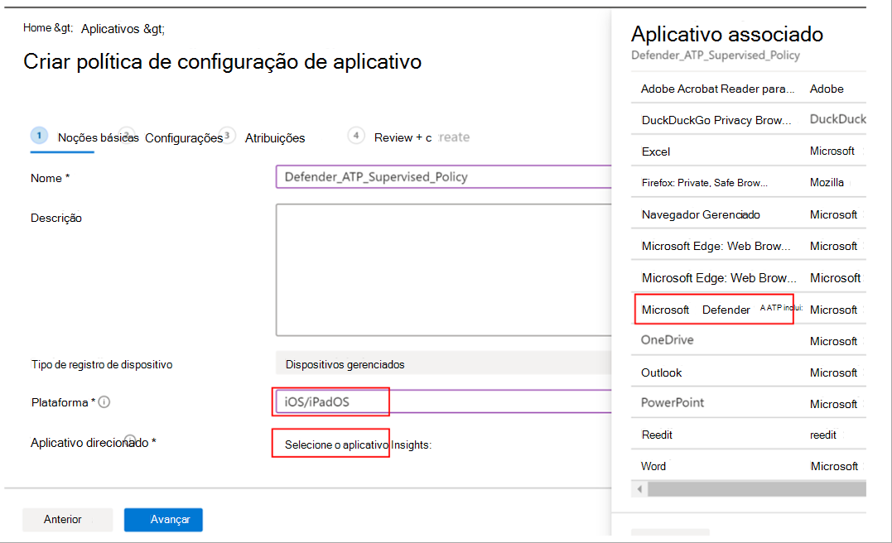
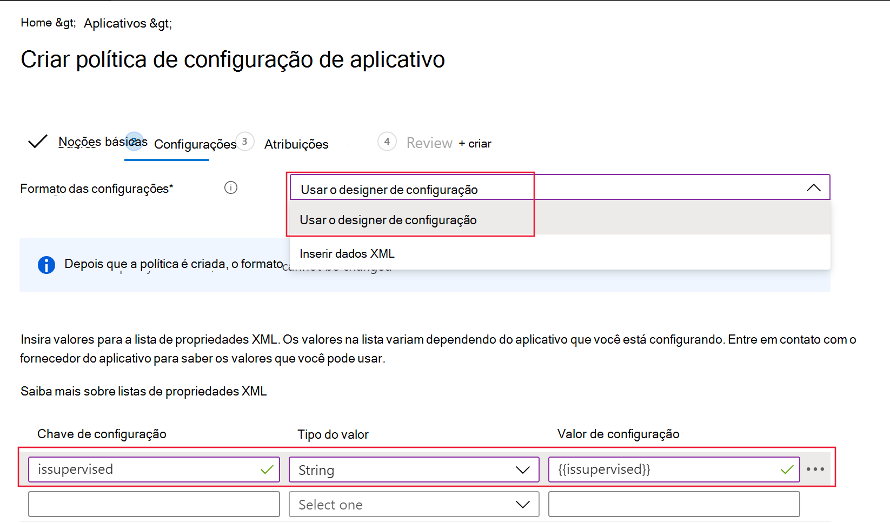
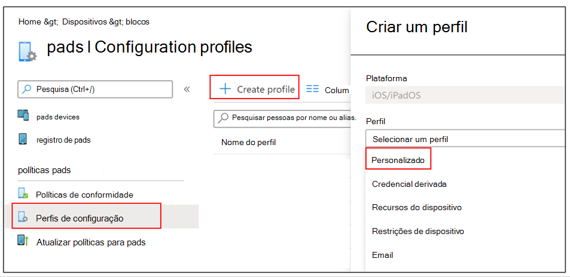

# Implantar o Microsoft Defender para Ponto de Extremidade para iOS

[!INCLUDE [Microsoft 365 Defender rebranding](../../includes/microsoft-defender.md)]

**Aplica-se a:**
- [Microsoft Defender para Ponto de Extremidade](https://go.microsoft.com/fwlink/p/?linkid=2154037)
- [Microsoft 365 Defender](https://go.microsoft.com/fwlink/?linkid=2118804)

> Deseja experimentar o Defender para Ponto de Extremidade? [Inscreva-se para uma avaliação gratuita.](https://www.microsoft.com/microsoft-365/windows/microsoft-defender-atp?ocid=docs-wdatp-investigateip-abovefoldlink)

Este tópico descreve a implantação do Defender para Ponto de Extremidade para iOS em dispositivos inscritos no Portal da Empresa do Intune. Para obter mais informações sobre o registro de dispositivo do Intune, consulte [Registrar dispositivos iOS/iPadOS no Intune](https://docs.microsoft.com/mem/intune/enrollment/ios-enroll).

## Antes de começar

- Verifique se você tem acesso ao Centro de [administração do Gerenciador de Pontos de Extremidade da Microsoft.](https://go.microsoft.com/fwlink/?linkid=2109431)

- Certifique-se de que o registro do iOS seja feito para seus usuários. Os usuários precisam ter uma licença do Defender para Ponto de Extremidade atribuída para usar o Defender para Endpoint para iOS. Consulte [Atribuir licenças aos usuários para](https://docs.microsoft.com/azure/active-directory/users-groups-roles/licensing-groups-assign) obter instruções sobre como atribuir licenças.

> [!NOTE]
> O Microsoft Defender ATP (Microsoft Defender para Ponto de Extremidade) para iOS agora está disponível na [Apple App Store](https://aka.ms/mdatpiosappstore).

## Etapas de implantação

Implante o Defender para Ponto de Extremidade para iOS por meio do Portal da Empresa do Intune.

### Adicionar aplicativo da loja do iOS

1. No Centro de administração do Gerenciador de Pontos de Extremidade [da Microsoft,](https://go.microsoft.com/fwlink/?linkid=2109431)vá para **Aplicativos**  ->  **iOS/iPadOS** Adicionar aplicativo da loja  ->    ->  **do iOS** e clique em **Selecionar**.

    > [!div class="mx-imgBorder"]
    > 

1. Na página Adicionar aplicativo, clique em **Pesquisar na Loja de Aplicativos** e digite o Ponto de Extremidade do Microsoft **Defender** na barra de pesquisa. Na seção resultados da pesquisa, clique em Ponto de *Extremidade do Microsoft Defender* e clique em **Selecionar**.

1. Selecione **iOS 11.0 como** o sistema operacional Mínimo. Revise o restante das informações sobre o aplicativo e clique em **Próximo**.

1. Na seção *Atribuições,* vá para a seção **Obrigatório** e selecione **Adicionar grupo**. Em seguida, você pode escolher os grupos de usuários que você gostaria de direcionar o Defender para Ponto de Extremidade para aplicativo iOS. Clique **em Selecionar** e, em **seguida, Em Seguida.**

    > [!NOTE]
    > O grupo de usuários selecionado deve consistir em usuários inscritos do Intune.

    > [!div class="mx-imgBorder"]
    > 

1. Na seção *Revisar + Criar,* verifique se todas as informações inseridas estão corretas e selecione **Criar**. Em alguns instantes, o aplicativo Defender para Ponto de Extremidade deve ser criado com êxito, e uma notificação deve aparecer no canto superior direito da página.

1. Na página informações do aplicativo exibida, na seção **Monitor,** selecione **Status** de instalação do dispositivo para verificar se a instalação do dispositivo foi concluída com êxito.

    > [!div class="mx-imgBorder"]
    > 

## Concluir a integração e verificar o status

1. Depois que o Defender for Endpoint para iOS tiver sido instalado no dispositivo, você verá o ícone do aplicativo.

    

2. Toque no ícone do aplicativo Defender para Ponto de Extremidade e siga as instruções na tela para concluir as etapas de integração. Os detalhes incluem a aceitação do usuário final das permissões do iOS exigidas pelo Defender para Ponto de Extremidade para iOS.

3. Após a integração bem-sucedida, o dispositivo começará a aparecer na lista Dispositivos no Centro de Segurança do Microsoft Defender.

    > [!div class="mx-imgBorder"]
    > 

## Configurar o Microsoft Defender para Ponto de Extremidade para Modo Supervisionado

O aplicativo Microsoft Defender for Endpoint para iOS tem capacidade especializada em dispositivos iOS/iPadOS supervisionados, dado o aumento dos recursos de gerenciamento fornecidos pela plataforma nesses tipos de dispositivos. Para aproveitar esses recursos, o aplicativo Defender for Endpoint precisa saber se um dispositivo está no modo Supervisionado.

### Configurar o modo Supervisionado por meio do Intune

O Intune permite configurar o aplicativo Defender para iOS por meio de uma política de Configuração de Aplicativo.

   > [!NOTE]
   > Esta política de configuração de aplicativo para dispositivos supervisionados é aplicável apenas a dispositivos gerenciados e deve ser direcionada para todos os dispositivos iOS gerenciados como uma prática prática prática.

1. Entre no Centro de administração do [Microsoft Endpoint Manager](https://go.microsoft.com/fwlink/?linkid=2109431) e acesse Políticas de configuração do Aplicativo de   >  **Aplicativos**  >  **Adicionar**. Clique em **Dispositivos gerenciados**.

    > [!div class="mx-imgBorder"]
    > 

1. Na página *Criar política de configuração de aplicativo,* forneça as seguintes informações:
    - Nome da política
    - Plataforma: Selecione iOS/iPadOS
    - Aplicativo direcionado: Selecione **o Microsoft Defender ATP** na lista

    > [!div class="mx-imgBorder"]
    > 

1. Na próxima tela, selecione **Usar designer de configuração** como o formato. Especifique a seguinte propriedade:
    - Chave de Configuração: supervisionada
    - Tipo de valor: Cadeia de caracteres
    - Valor da configuração: {{issupervised}}
    
    > [!div class="mx-imgBorder"]
    > 

1. Clique **em Próximo** para abrir a página Marcas de **escopo.** As marcas de escopo são opcionais. Clique em **Avançar** para continuar.

1. Na página **Atribuições,** selecione os grupos que receberão esse perfil. Para esse cenário, é prática ideal direcionar Todos os **Dispositivos.** Para obter mais informações sobre como atribuir perfis, consulte [Assign user and device profiles](https://docs.microsoft.com/mem/intune/configuration/device-profile-assign).

   Ao implantar em grupos de usuários, um usuário deve entrar em um dispositivo antes da aplicação da política.

   Clique em **Avançar**.

1. Na página **Revisar + criar,** quando terminar, escolha **Criar**. O novo perfil é exibido na lista de perfis de configuração.

1. Em seguida, para recursos avançados de anti-phishing, você pode implantar um perfil personalizado nos dispositivos iOS supervisionados. Siga as etapas abaixo:
    - Baixar o perfil de configuração de [https://aka.ms/mdatpiossupervisedprofile](https://aka.ms/mdatpiossupervisedprofile)
    - Navegar até **dispositivos**  ->  **iOS/iPadOS** Perfis de  ->  **configuração**  ->  **Criar Perfil**

    > [!div class="mx-imgBorder"]
    > 

    - Forneça um nome do perfil. Quando solicitado a importar um arquivo de perfil de configuração, selecione o que foi baixado acima.
    - Na seção **Atribuição,** selecione o grupo de dispositivos ao qual você deseja aplicar esse perfil. Como prática prática, isso deve ser aplicado a todos os dispositivos iOS gerenciados. Clique em **Avançar**.
    - Na página **Revisar + criar,** quando terminar, escolha **Criar**. O novo perfil é exibido na lista de perfis de configuração.

## Próximas Etapas

[Configurar o Defender para Ponto de Extremidade para recursos do iOS](ios-configure-features.md)
