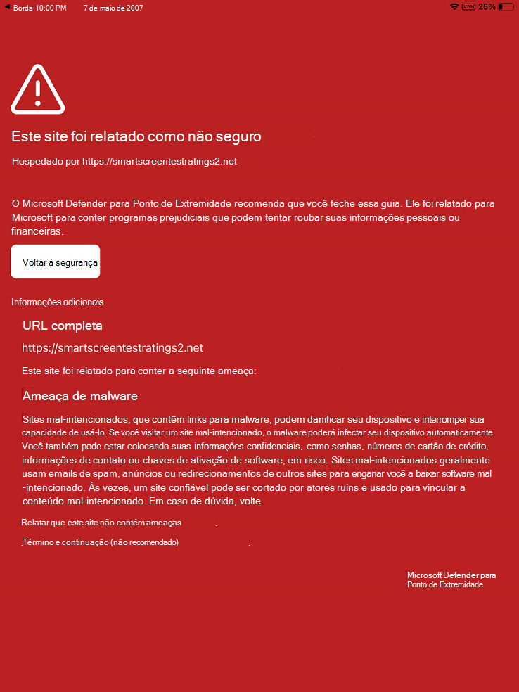

# Solucionar problemas e encontrar respostas para perguntas frequentes no Microsoft Defender para Endpoint no iOS

[!INCLUDE [Microsoft 365 Defender rebranding](../../includes/microsoft-defender.md)]

**Aplica-se a:**
- [Microsoft Defender para Ponto de Extremidade](https://go.microsoft.com/fwlink/p/?linkid=2154037)
- [Microsoft 365 Defender](https://go.microsoft.com/fwlink/?linkid=2118804)

> Deseja experimentar o Defender para Ponto de Extremidade? [Inscreva-se para uma avaliação gratuita.](https://www.microsoft.com/microsoft-365/windows/microsoft-defender-atp?ocid=docs-wdatp-exposedapis-abovefoldlink) 

Este tópico fornece informações de solução de problemas para ajudá-lo a resolver problemas que podem surgir à medida que você usa o Microsoft Defender para Ponto de Extremidade no iOS.

> [!NOTE]
> O Defender for Endpoint no iOS usaria uma VPN para fornecer o recurso de Proteção da Web. Esta não é uma VPN regular e é uma VPN local/auto-loop que não faz o tráfego fora do dispositivo.

## Os aplicativos não funcionam quando a VPN está conexões
Há alguns aplicativos que param de funcionar quando uma VPN ativa é detectada. Você pode desabilitar a VPN durante o tempo em que está usando esses aplicativos. 

Por padrão, o Defender para Ponto de Extremidade no iOS inclui e habilita o recurso de proteção da Web. [A proteção da Web](web-protection-overview.md) ajuda a proteger dispositivos contra ameaças da Web e proteger os usuários contra ataques de phishing. O Defender for Endpoint no iOS usa uma VPN para fornecer essa proteção. Observe que esta é uma VPN local e, ao contrário da VPN tradicional, o tráfego de rede não é enviado fora do dispositivo.

Embora habilitada por padrão, pode haver alguns casos que exigem que você desabilite a VPN. Por exemplo, você deseja executar alguns aplicativos que não funcionam quando uma VPN está configurada. Nesses casos, você pode optar por desabilitar a VPN do aplicativo no dispositivo seguindo as etapas abaixo:

1. Em seu dispositivo iOS, abra o aplicativo **Configurações,** clique ou toque em **Geral** **e,** em seguida, VPN .
1. Clique ou toque no botão "i" do Microsoft Defender para Ponto de Extremidade.
1. Desative o **Conexão Sob Demanda para** desabilitar a VPN.

    > [!div class="mx-imgBorder"]
    > 

> [!NOTE]
> A Proteção da Web não estará disponível quando a VPN estiver desabilitada. Para habilitar a Proteção Web de novo, abra o aplicativo Microsoft Defender para Ponto de Extremidade no dispositivo e clique ou toque em **Iniciar VPN**.

## Problemas com vários perfis VPN

O iOS da Apple não dá suporte a várias VPNs em todo o dispositivo para serem ativas simultaneamente. Embora vários perfis VPN possam existir no dispositivo, apenas uma VPN pode estar ativa por vez.

## Consumo de bateria

O uso da bateria por um aplicativo é calculado pela Apple com base em uma infinidade de fatores, incluindo o uso da CPU e da rede. O Microsoft Defender para Ponto de Extremidade usa uma VPN local/loop-back em segundo plano para verificar o tráfego da Web em busca de sites ou conexões mal-intencionadas. Os pacotes de rede de qualquer aplicativo passam por essa verificação e isso faz com que o uso da bateria do Microsoft Defender para o Ponto de Extremidade seja calculado de forma impreciso. Isso dá uma falsa impressão ao usuário. O consumo real de bateria do Microsoft Defender para Ponto de Extremidade é menor do que o mostrado na página Bateria Configurações no dispositivo. Isso se baseia em testes realizados no aplicativo Microsoft Defender para Ponto de Extremidade para entender o consumo de bateria.

Além disso, a VPN usada é uma VPN local e, ao contrário de uma VPN tradicional, o tráfego de rede não é enviado fora do dispositivo.

## Uso de dados

O Microsoft Defender para Ponto de Extremidade usa uma VPN local/loopback para verificar o tráfego da Web em busca de sites ou conexões mal-intencionadas. Devido a esse motivo, a Apple conta o uso de dados para o Microsoft Defender para o Ponto de Extremidade de forma impreciso. O uso real de dados pelo Microsoft Defender para Ponto de Extremidade não é significativo e muito menos do que o mostrado no data Usage Configurações no dispositivo.

## Relatar site não seguro

Sites de phishing personificam sites confiáveis com o objetivo de obter suas informações pessoais ou financeiras. Visite a [página Fornecer comentários sobre proteção de rede](https://www.microsoft.com/wdsi/filesubmission/exploitguard/networkprotection) para relatar um site que pode ser um site de phishing.

## Site mal-intencionado detectado

O Microsoft Defender para Ponto de Extremidade protege você contra phishing ou outros ataques baseados na Web. Se um site mal-intencionado for detectado, a conexão será bloqueada e um alerta será enviado para o portal da Central de Segurança da organização. O alerta inclui o nome de domínio da conexão, o endereço IP remoto e os detalhes do dispositivo.

Além disso, uma notificação é mostrada no dispositivo iOS. Tocar na notificação abre a tela a seguir para que o usuário revise os detalhes.

> [!div class="mx-imgBorder"]
> 

## Dados e Privacidade

Para obter detalhes sobre dados coletados e privacidade, consulte Informações de Privacidade [- Microsoft Defender para Ponto de Extremidade no iOS](ios-privacy.md).

