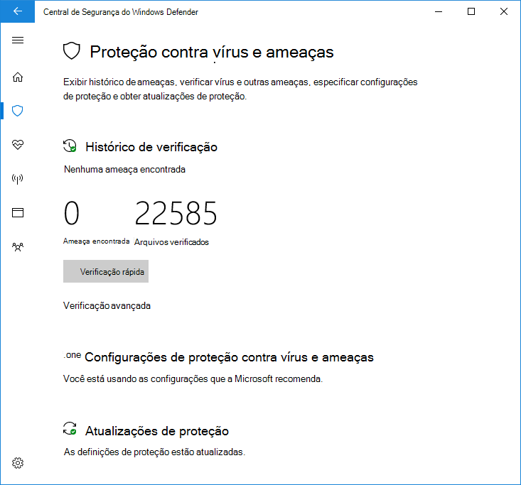

# Usar uma verificação periódica limitada no Microsoft Defender Antivírus

[!INCLUDE [Microsoft 365 Defender rebranding](../../includes/microsoft-defender.md)]

**Aplica-se a:**

- [Microsoft Defender para Ponto de Extremidade](/microsoft-365/security/defender-endpoint/)

A verificação periódica limitada é um tipo especial de detecção e correção de ameaças que pode ser habilitado quando você instalou outro produto antivírus em um Windows 10 dispositivo.

Ele só pode ser habilitado em determinadas situações. Para obter mais informações sobre a verificação periódica limitada e como Microsoft Defender Antivírus funciona com outros produtos antivírus, [consulte Microsoft Defender Antivírus compatibilidade](microsoft-defender-antivirus-compatibility.md).

**A Microsoft não recomenda usar esse recurso em ambientes corporativos. Esse é um recurso destinado principalmente aos consumidores.** Esse recurso usa apenas um subconjunto limitado dos recursos de Microsoft Defender Antivírus para detectar malware e não será capaz de detectar a maioria dos malwares e softwares potencialmente indesejados. Além disso, os recursos de gerenciamento e relatório serão limitados. A Microsoft recomenda que as empresas escolham sua solução antivírus principal e a usem exclusivamente.

## Como habilitar a verificação periódica limitada

Por padrão, o Microsoft Defender Antivírus se habilitará em um dispositivo Windows 10 se não houver outro produto antivírus instalado ou se o outro produto estiver desacumprido, expirado ou não funcionando corretamente.

Se Microsoft Defender Antivírus estiver habilitado, as opções usuais aparecerão para configurá-lo nesse dispositivo:

Se outro produto antivírus estiver instalado e funcionando corretamente, Microsoft Defender Antivírus se desabilitará. O Segurança do Windows aplicativo alterará a seção Proteção contra **&** vírus para mostrar o status sobre o produto AV e fornecerá um link para as opções de configuração do produto.

Sob qualquer produto AV de terceiros, um novo link aparecerá como Microsoft Defender Antivírus **opções**. Clicar neste link será expandido para mostrar a alternância que permite a verificação periódica limitada. Observe que a opção periódica limitada é uma alternância para habilitar ou desabilitar a verificação periódica. 

Deslizar a opção para **On** mostrará as opções padrão do Microsoft Defender AV abaixo do produto AV de terceiros. A opção de verificação periódica limitada aparecerá na parte inferior da página.

## Artigos relacionados

- [Configurar a proteção comportamental, heurística e em tempo real](configure-protection-features-microsoft-defender-antivirus.md)
- [Microsoft Defender Antivirus no Windows 10](microsoft-defender-antivirus-in-windows-10.md)