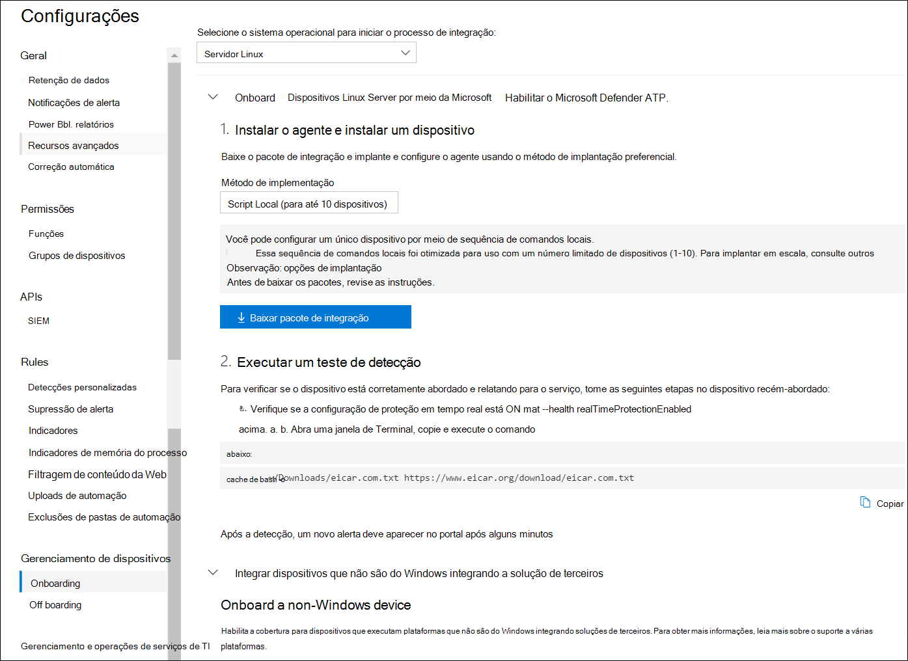

# <a name="deploy-microsoft-defender-for-endpoint-on-linux-manually"></a><span data-ttu-id="856c3-104">Implantar o Microsoft Defender para Ponto de Extremidade no Linux manualmente</span><span class="sxs-lookup"><span data-stu-id="856c3-104">Deploy Microsoft Defender for Endpoint on Linux manually</span></span>

[!INCLUDE [Microsoft 365 Defender rebranding](../../includes/microsoft-defender.md)]


<span data-ttu-id="856c3-105">**Aplica-se a:**</span><span class="sxs-lookup"><span data-stu-id="856c3-105">**Applies to:**</span></span>
- [<span data-ttu-id="856c3-106">Microsoft Defender para Ponto de Extremidade</span><span class="sxs-lookup"><span data-stu-id="856c3-106">Microsoft Defender for Endpoint</span></span>](https://go.microsoft.com/fwlink/p/?linkid=2154037)
- [<span data-ttu-id="856c3-107">Microsoft 365 Defender</span><span class="sxs-lookup"><span data-stu-id="856c3-107">Microsoft 365 Defender</span></span>](https://go.microsoft.com/fwlink/?linkid=2118804)

> <span data-ttu-id="856c3-108">Deseja experimentar o Defender para Ponto de Extremidade?</span><span class="sxs-lookup"><span data-stu-id="856c3-108">Want to experience Defender for Endpoint?</span></span> [<span data-ttu-id="856c3-109">Inscreva-se para uma avaliação gratuita.</span><span class="sxs-lookup"><span data-stu-id="856c3-109">Sign up for a free trial.</span></span>](https://www.microsoft.com/microsoft-365/windows/microsoft-defender-atp?ocid=docs-wdatp-investigateip-abovefoldlink)

<span data-ttu-id="856c3-110">Este artigo descreve como implantar o Microsoft Defender para Ponto de Extremidade no Linux manualmente.</span><span class="sxs-lookup"><span data-stu-id="856c3-110">This article describes how to deploy Microsoft Defender for Endpoint on Linux manually.</span></span> <span data-ttu-id="856c3-111">Uma implantação bem-sucedida requer a conclusão de todas as seguintes tarefas:</span><span class="sxs-lookup"><span data-stu-id="856c3-111">A successful deployment requires the completion of all of the following tasks:</span></span>

- [<span data-ttu-id="856c3-112">Implantar o Microsoft Defender para Ponto de Extremidade no Linux manualmente</span><span class="sxs-lookup"><span data-stu-id="856c3-112">Deploy Microsoft Defender for Endpoint on Linux manually</span></span>](#deploy-microsoft-defender-for-endpoint-on-linux-manually)
  - [<span data-ttu-id="856c3-113">Pré-requisitos e requisitos do sistema</span><span class="sxs-lookup"><span data-stu-id="856c3-113">Prerequisites and system requirements</span></span>](#prerequisites-and-system-requirements)
  - [<span data-ttu-id="856c3-114">Configurar o repositório de software Linux</span><span class="sxs-lookup"><span data-stu-id="856c3-114">Configure the Linux software repository</span></span>](#configure-the-linux-software-repository)
    - [<span data-ttu-id="856c3-115">RHEL e variantes (CentOS e Oracle Linux)</span><span class="sxs-lookup"><span data-stu-id="856c3-115">RHEL and variants (CentOS and Oracle Linux)</span></span>](#rhel-and-variants-centos-and-oracle-linux)
    - [<span data-ttu-id="856c3-116">SLES e variantes</span><span class="sxs-lookup"><span data-stu-id="856c3-116">SLES and variants</span></span>](#sles-and-variants)
    - [<span data-ttu-id="856c3-117">Sistemas Ubuntu e Debian</span><span class="sxs-lookup"><span data-stu-id="856c3-117">Ubuntu and Debian systems</span></span>](#ubuntu-and-debian-systems)
  - [<span data-ttu-id="856c3-118">Instalação do aplicativo</span><span class="sxs-lookup"><span data-stu-id="856c3-118">Application installation</span></span>](#application-installation)
  - [<span data-ttu-id="856c3-119">Baixar o pacote de integração</span><span class="sxs-lookup"><span data-stu-id="856c3-119">Download the onboarding package</span></span>](#download-the-onboarding-package)
  - [<span data-ttu-id="856c3-120">Configuração do cliente</span><span class="sxs-lookup"><span data-stu-id="856c3-120">Client configuration</span></span>](#client-configuration)
  - [<span data-ttu-id="856c3-121">Script do instalador</span><span class="sxs-lookup"><span data-stu-id="856c3-121">Installer script</span></span>](#installer-script)
  - [<span data-ttu-id="856c3-122">Problemas de instalação de log</span><span class="sxs-lookup"><span data-stu-id="856c3-122">Log installation issues</span></span>](#log-installation-issues)
  - [<span data-ttu-id="856c3-123">Atualizações do sistema operacional</span><span class="sxs-lookup"><span data-stu-id="856c3-123">Operating system upgrades</span></span>](#operating-system-upgrades)
  - [<span data-ttu-id="856c3-124">Desinstalação</span><span class="sxs-lookup"><span data-stu-id="856c3-124">Uninstallation</span></span>](#uninstallation)

## <a name="prerequisites-and-system-requirements"></a><span data-ttu-id="856c3-125">Pré-requisitos e requisitos do sistema</span><span class="sxs-lookup"><span data-stu-id="856c3-125">Prerequisites and system requirements</span></span>

<span data-ttu-id="856c3-126">Antes de começar, consulte [Microsoft Defender for Endpoint on Linux](microsoft-defender-endpoint-linux.md) para obter uma descrição dos pré-requisitos e requisitos do sistema para a versão de software atual.</span><span class="sxs-lookup"><span data-stu-id="856c3-126">Before you get started, see [Microsoft Defender for Endpoint on Linux](microsoft-defender-endpoint-linux.md) for a description of prerequisites and system requirements for the current software version.</span></span>

## <a name="configure-the-linux-software-repository"></a><span data-ttu-id="856c3-127">Configurar o repositório de software Linux</span><span class="sxs-lookup"><span data-stu-id="856c3-127">Configure the Linux software repository</span></span>

<span data-ttu-id="856c3-128">O Defender para Ponto de Extremidade no Linux pode ser implantado de um dos seguintes canais (denotado abaixo como *[canal]*): *insiders-fast,* *insiders-slow* ou *prod*. Cada um desses canais corresponde a um repositório de software Linux.</span><span class="sxs-lookup"><span data-stu-id="856c3-128">Defender for Endpoint on Linux can be deployed from one of the following channels (denoted below as *[channel]*): *insiders-fast*, *insiders-slow*, or *prod*. Each of these channels corresponds to a Linux software repository.</span></span> <span data-ttu-id="856c3-129">Instruções para configurar seu dispositivo para usar um desses repositórios são fornecidas abaixo.</span><span class="sxs-lookup"><span data-stu-id="856c3-129">Instructions for configuring your device to use one of these repositories are provided below.</span></span>

<span data-ttu-id="856c3-130">A escolha do canal determina o tipo e a frequência de atualizações oferecidas ao seu dispositivo.</span><span class="sxs-lookup"><span data-stu-id="856c3-130">The choice of the channel determines the type and frequency of updates that are offered to your device.</span></span> <span data-ttu-id="856c3-131">Os *dispositivos em insiders-fast* são os primeiros a receber atualizações e novos recursos, seguidos posteriormente por *insiders-slow* e por *último por prod*.</span><span class="sxs-lookup"><span data-stu-id="856c3-131">Devices in *insiders-fast* are the first ones to receive updates and new features, followed later by *insiders-slow* and lastly by *prod*.</span></span>

<span data-ttu-id="856c3-132">Para visualizar novos recursos e fornecer comentários antecipados, é recomendável configurar alguns dispositivos em sua empresa para usar *insiders-fast* ou *insiders-slow*.</span><span class="sxs-lookup"><span data-stu-id="856c3-132">In order to preview new features and provide early feedback, it is recommended that you configure some devices in your enterprise to use either *insiders-fast* or *insiders-slow*.</span></span>

> [!WARNING]
> <span data-ttu-id="856c3-133">Alternar o canal após a instalação inicial exige que o produto seja reinstalado.</span><span class="sxs-lookup"><span data-stu-id="856c3-133">Switching the channel after the initial installation requires the product to be reinstalled.</span></span> <span data-ttu-id="856c3-134">Para alternar o canal do produto: desinstale o pacote existente, configure novamente seu dispositivo para usar o novo canal e siga as etapas deste documento para instalar o pacote no novo local.</span><span class="sxs-lookup"><span data-stu-id="856c3-134">To switch the product channel: uninstall the existing package, re-configure your device to use the new channel, and follow the steps in this document to install the package from the new location.</span></span>

### <a name="rhel-and-variants-centos-and-oracle-linux"></a><span data-ttu-id="856c3-135">RHEL e variantes (CentOS e Oracle Linux)</span><span class="sxs-lookup"><span data-stu-id="856c3-135">RHEL and variants (CentOS and Oracle Linux)</span></span>

- <span data-ttu-id="856c3-136">Instale `yum-utils` se ainda não estiver instalado:</span><span class="sxs-lookup"><span data-stu-id="856c3-136">Install `yum-utils` if it isn't installed yet:</span></span>

    ```bash
    sudo yum install yum-utils
    ```

- <span data-ttu-id="856c3-137">Observe sua distribuição e versão e identifique a entrada mais próxima (por principal, então secundária) para ela em `https://packages.microsoft.com/config/` .</span><span class="sxs-lookup"><span data-stu-id="856c3-137">Note your distribution and version, and identify the closest entry (by major, then minor) for it under `https://packages.microsoft.com/config/`.</span></span> <span data-ttu-id="856c3-138">Por exemplo, o RHEL 7.9 está mais próximo de 7,4 do que 8.</span><span class="sxs-lookup"><span data-stu-id="856c3-138">For instance, RHEL 7.9 is closer to 7.4 than to 8.</span></span>

    <span data-ttu-id="856c3-139">Nos comandos a seguir, substitua *[distro]* e *[versão]* pela informação que você identificou:</span><span class="sxs-lookup"><span data-stu-id="856c3-139">In the below commands, replace *[distro]* and *[version]* with the information you've identified:</span></span>

    > [!NOTE]
    > <span data-ttu-id="856c3-140">No caso do Oracle Linux, substitua *[distro]* por "remos".</span><span class="sxs-lookup"><span data-stu-id="856c3-140">In case of Oracle Linux, replace *[distro]* with “rhel”.</span></span>

    ```bash
    sudo yum-config-manager --add-repo=https://packages.microsoft.com/config/[distro]/[version]/[channel].repo
    ```

    <span data-ttu-id="856c3-141">Por exemplo, se você estiver executando o CentOS 7 e quiser implantar o Defender para Ponto de Extremidade no Linux a partir *do canal prod:*</span><span class="sxs-lookup"><span data-stu-id="856c3-141">For example, if you are running CentOS 7 and want to deploy Defender for Endpoint on Linux from the *prod* channel:</span></span>

    ```bash
    sudo yum-config-manager --add-repo=https://packages.microsoft.com/config/centos/7/prod.repo
    ```

    <span data-ttu-id="856c3-142">Ou se você quiser explorar novos recursos em dispositivos selecionados, talvez queira implantar o MDE para Linux para *canal interno rápido:*</span><span class="sxs-lookup"><span data-stu-id="856c3-142">Or if you wish to explore new features on selected devices, you might want to deploy MDE for Linux to *insiders-fast* channel:</span></span>

    ```bash
    sudo yum-config-manager --add-repo=https://packages.microsoft.com/config/centos/7/insiders-fast.repo
    ```

- <span data-ttu-id="856c3-143">Instale a chave pública do Microsoft GPG:</span><span class="sxs-lookup"><span data-stu-id="856c3-143">Install the Microsoft GPG public key:</span></span>

    ```bash
    sudo rpm --import http://packages.microsoft.com/keys/microsoft.asc
    ```

- <span data-ttu-id="856c3-144">Baixe e faça uso de todos os metadados dos repositórios yum atualmente habilitados:</span><span class="sxs-lookup"><span data-stu-id="856c3-144">Download and make usable all the metadata for the currently enabled yum repositories:</span></span>

    ```bash
    yum makecache
    ```

### <a name="sles-and-variants"></a><span data-ttu-id="856c3-145">SLES e variantes</span><span class="sxs-lookup"><span data-stu-id="856c3-145">SLES and variants</span></span>

- <span data-ttu-id="856c3-146">Observe sua distribuição e versão e identifique a entrada mais próxima(por principal, então secundária) para ela em `https://packages.microsoft.com/config/` .</span><span class="sxs-lookup"><span data-stu-id="856c3-146">Note your distribution and version, and identify the closest entry(by major, then minor) for it under `https://packages.microsoft.com/config/`.</span></span>

    <span data-ttu-id="856c3-147">Nos comandos a seguir, substitua *[distro]* e *[version]* com as informações identificadas:</span><span class="sxs-lookup"><span data-stu-id="856c3-147">In the following commands, replace *[distro]* and *[version]* with the information you've identified:</span></span>

    ```bash
    sudo zypper addrepo -c -f -n microsoft-[channel] https://packages.microsoft.com/config/[distro]/[version]/[channel].repo
    ```

    <span data-ttu-id="856c3-148">Por exemplo, se você estiver executando o SLES 12 e quiser implantar o MDE para Linux a partir *do canal prod:*</span><span class="sxs-lookup"><span data-stu-id="856c3-148">For example, if you are running SLES 12 and wish to deploy MDE for Linux from the *prod* channel:</span></span>

    ```bash
    sudo zypper addrepo -c -f -n microsoft-prod https://packages.microsoft.com/config/sles/12/prod.repo
    ```

- <span data-ttu-id="856c3-149">Instale a chave pública do Microsoft GPG:</span><span class="sxs-lookup"><span data-stu-id="856c3-149">Install the Microsoft GPG public key:</span></span>

    ```bash
    sudo rpm --import http://packages.microsoft.com/keys/microsoft.asc
    ```

### <a name="ubuntu-and-debian-systems"></a><span data-ttu-id="856c3-150">Sistemas Ubuntu e Debian</span><span class="sxs-lookup"><span data-stu-id="856c3-150">Ubuntu and Debian systems</span></span>

- <span data-ttu-id="856c3-151">Instale `curl` se ainda não estiver instalado:</span><span class="sxs-lookup"><span data-stu-id="856c3-151">Install `curl` if it isn't installed yet:</span></span>

    ```bash
    sudo apt-get install curl
    ```

- <span data-ttu-id="856c3-152">Instale `libplist-utils` se ainda não estiver instalado:</span><span class="sxs-lookup"><span data-stu-id="856c3-152">Install `libplist-utils` if it isn't installed yet:</span></span>

    ```bash
    sudo apt-get install libplist-utils
    ```

- <span data-ttu-id="856c3-153">Observe sua distribuição e versão e identifique a entrada mais próxima (por principal, então secundária) para ela em `https://packages.microsoft.com/config` .</span><span class="sxs-lookup"><span data-stu-id="856c3-153">Note your distribution and version, and identify the closest entry (by major, then minor) for it under `https://packages.microsoft.com/config`.</span></span>

    <span data-ttu-id="856c3-154">No comando abaixo, substitua *[distro]* e *[version]* pela informação que você identificou:</span><span class="sxs-lookup"><span data-stu-id="856c3-154">In the below command, replace *[distro]* and *[version]* with the information you've identified:</span></span>

    ```bash
    curl -o microsoft.list https://packages.microsoft.com/config/[distro]/[version]/[channel].list
    ```

    <span data-ttu-id="856c3-155">Por exemplo, se você estiver executando o Ubuntu 18.04 e quiser implantar o MDE para Linux a partir *do canal prod:*</span><span class="sxs-lookup"><span data-stu-id="856c3-155">For example, if you are running Ubuntu 18.04 and wish to deploy MDE for Linux from the *prod* channel:</span></span>

    ```bash
    curl -o microsoft.list https://packages.microsoft.com/config/ubuntu/18.04/prod.list
    ```

- <span data-ttu-id="856c3-156">Instalar a configuração do repositório:</span><span class="sxs-lookup"><span data-stu-id="856c3-156">Install the repository configuration:</span></span>

    ```bash
    sudo mv ./microsoft.list /etc/apt/sources.list.d/microsoft-[channel].list
    ```
    <span data-ttu-id="856c3-157">Por exemplo, se você escolher *canal prod:*</span><span class="sxs-lookup"><span data-stu-id="856c3-157">For example, if you chose *prod* channel:</span></span>

    ```bash
    sudo mv ./microsoft.list /etc/apt/sources.list.d/microsoft-prod.list
    ```

- <span data-ttu-id="856c3-158">Instale o `gpg` pacote se ainda não estiver instalado:</span><span class="sxs-lookup"><span data-stu-id="856c3-158">Install the `gpg` package if not already installed:</span></span>

    ```bash
    sudo apt-get install gpg
    ```

  <span data-ttu-id="856c3-159">Se `gpg` não estiver disponível, instale `gnupg` .</span><span class="sxs-lookup"><span data-stu-id="856c3-159">If `gpg` is not available, then install `gnupg`.</span></span>

- <span data-ttu-id="856c3-160">Instale a chave pública do Microsoft GPG:</span><span class="sxs-lookup"><span data-stu-id="856c3-160">Install the Microsoft GPG public key:</span></span>

    ```bash
    curl https://packages.microsoft.com/keys/microsoft.asc | sudo apt-key add -
    ```

- <span data-ttu-id="856c3-161">Instale o driver https se ele ainda não estiver presente:</span><span class="sxs-lookup"><span data-stu-id="856c3-161">Install the https driver if it's not already present:</span></span>

    ```bash
    sudo apt-get install apt-transport-https
    ```

- <span data-ttu-id="856c3-162">Atualize os metadados do repositório:</span><span class="sxs-lookup"><span data-stu-id="856c3-162">Update the repository metadata:</span></span>

    ```bash
    sudo apt-get update
    ```

## <a name="application-installation"></a><span data-ttu-id="856c3-163">Instalação do aplicativo</span><span class="sxs-lookup"><span data-stu-id="856c3-163">Application installation</span></span>

- <span data-ttu-id="856c3-164">RHEL e variantes (CentOS e Oracle Linux):</span><span class="sxs-lookup"><span data-stu-id="856c3-164">RHEL and variants (CentOS and Oracle Linux):</span></span>

    ```bash
    sudo yum install mdatp
    ```

    <span data-ttu-id="856c3-165">Se você tiver vários repositórios da Microsoft configurados em seu dispositivo, poderá ser específico sobre de qual repositório instalar o pacote.</span><span class="sxs-lookup"><span data-stu-id="856c3-165">If you have multiple Microsoft repositories configured on your device, you can be specific about which repository to install the package from.</span></span> <span data-ttu-id="856c3-166">O exemplo a seguir mostra como instalar o pacote do canal se você também tiver o canal `production` de repositório configurado neste `insiders-fast` dispositivo.</span><span class="sxs-lookup"><span data-stu-id="856c3-166">The following example shows how to install the package from the `production` channel if you also have the `insiders-fast` repository channel configured on this device.</span></span> <span data-ttu-id="856c3-167">Essa situação pode acontecer se você estiver usando vários produtos Microsoft em seu dispositivo.</span><span class="sxs-lookup"><span data-stu-id="856c3-167">This situation can happen if you are using multiple Microsoft products on your device.</span></span> <span data-ttu-id="856c3-168">Dependendo da distribuição e da versão do seu servidor, o alias do repositório pode ser diferente do do exemplo a seguir.</span><span class="sxs-lookup"><span data-stu-id="856c3-168">Depending on the distribution and the version of your server, the repository alias might be different than the one in the following example.</span></span>

    ```bash
    # list all repositories
    yum repolist
    ```
    ```Output
    ...
    packages-microsoft-com-prod               packages-microsoft-com-prod        316
    packages-microsoft-com-prod-insiders-fast packages-microsoft-com-prod-ins      2
    ...
    ```
    ```bash
    # install the package from the production repository
    sudo yum --enablerepo=packages-microsoft-com-prod install mdatp
    ```

- <span data-ttu-id="856c3-169">SLES e variantes:</span><span class="sxs-lookup"><span data-stu-id="856c3-169">SLES and variants:</span></span>

    ```bash
    sudo zypper install mdatp
    ```

    <span data-ttu-id="856c3-170">Se você tiver vários repositórios da Microsoft configurados em seu dispositivo, poderá ser específico sobre de qual repositório instalar o pacote.</span><span class="sxs-lookup"><span data-stu-id="856c3-170">If you have multiple Microsoft repositories configured on your device, you can be specific about which repository to install the package from.</span></span> <span data-ttu-id="856c3-171">O exemplo a seguir mostra como instalar o pacote do canal se você também tiver o canal `production` de repositório configurado neste `insiders-fast` dispositivo.</span><span class="sxs-lookup"><span data-stu-id="856c3-171">The following example shows how to install the package from the `production` channel if you also have the `insiders-fast` repository channel configured on this device.</span></span> <span data-ttu-id="856c3-172">Essa situação pode acontecer se você estiver usando vários produtos Microsoft em seu dispositivo.</span><span class="sxs-lookup"><span data-stu-id="856c3-172">This situation can happen if you are using multiple Microsoft products on your device.</span></span>

    ```bash
    zypper repos
    ```

    ```Output
    ...
    #  | Alias | Name | ...
    XX | packages-microsoft-com-insiders-fast | microsoft-insiders-fast | ...
    XX | packages-microsoft-com-prod | microsoft-prod | ...
    ...
    ```
    ```bash
    sudo zypper install packages-microsoft-com-prod:mdatp
    ```

- <span data-ttu-id="856c3-173">Sistema Ubuntu e Debian:</span><span class="sxs-lookup"><span data-stu-id="856c3-173">Ubuntu and Debian system:</span></span>

    ```bash
    sudo apt-get install mdatp
    ```

    <span data-ttu-id="856c3-174">Se você tiver vários repositórios da Microsoft configurados em seu dispositivo, poderá ser específico sobre de qual repositório instalar o pacote.</span><span class="sxs-lookup"><span data-stu-id="856c3-174">If you have multiple Microsoft repositories configured on your device, you can be specific about which repository to install the package from.</span></span> <span data-ttu-id="856c3-175">O exemplo a seguir mostra como instalar o pacote do canal se você também tiver o canal `production` de repositório configurado neste `insiders-fast` dispositivo.</span><span class="sxs-lookup"><span data-stu-id="856c3-175">The following example shows how to install the package from the `production` channel if you also have the `insiders-fast` repository channel configured on this device.</span></span> <span data-ttu-id="856c3-176">Essa situação pode acontecer se você estiver usando vários produtos Microsoft em seu dispositivo.</span><span class="sxs-lookup"><span data-stu-id="856c3-176">This situation can happen if you are using multiple Microsoft products on your device.</span></span>

    ```bash
    cat /etc/apt/sources.list.d/*
    ```
    ```Output
    deb [arch=arm64,armhf,amd64] https://packages.microsoft.com/ubuntu/18.04/prod insiders-fast main
    deb [arch=amd64] https://packages.microsoft.com/ubuntu/18.04/prod bionic main
    ```
    ```bash
    sudo apt -t bionic install mdatp
    ```

## <a name="download-the-onboarding-package"></a><span data-ttu-id="856c3-177">Baixar o pacote de integração</span><span class="sxs-lookup"><span data-stu-id="856c3-177">Download the onboarding package</span></span>

<span data-ttu-id="856c3-178">Baixe o pacote de integração Central de Segurança do Microsoft Defender:</span><span class="sxs-lookup"><span data-stu-id="856c3-178">Download the onboarding package from Microsoft Defender Security Center:</span></span>

1. <span data-ttu-id="856c3-179">Em Central de Segurança do Microsoft Defender, vá para Configurações > Gerenciamento de **Dispositivos > Integração**.</span><span class="sxs-lookup"><span data-stu-id="856c3-179">In Microsoft Defender Security Center, go to **Settings > Device Management > Onboarding**.</span></span>
2. <span data-ttu-id="856c3-180">No primeiro menu suspenso, selecione **Servidor Linux como** o sistema operacional.</span><span class="sxs-lookup"><span data-stu-id="856c3-180">In the first drop-down menu, select **Linux Server** as the operating system.</span></span> <span data-ttu-id="856c3-181">No segundo menu suspenso, selecione Script Local (para até **10 dispositivos)** como o método de implantação.</span><span class="sxs-lookup"><span data-stu-id="856c3-181">In the second drop-down menu, select **Local Script (for up to 10 devices)** as the deployment method.</span></span>
3. <span data-ttu-id="856c3-182">Selecione **Baixar pacote de integração**.</span><span class="sxs-lookup"><span data-stu-id="856c3-182">Select **Download onboarding package**.</span></span> <span data-ttu-id="856c3-183">Salve o arquivo como WindowsDefenderATPOnboardingPackage.zip.</span><span class="sxs-lookup"><span data-stu-id="856c3-183">Save the file as WindowsDefenderATPOnboardingPackage.zip.</span></span>

    

4. <span data-ttu-id="856c3-185">Em um prompt de comando, verifique se você tem o arquivo.</span><span class="sxs-lookup"><span data-stu-id="856c3-185">From a command prompt, verify that you have the file.</span></span>
    <span data-ttu-id="856c3-186">Extraia o conteúdo do arquivo morto:</span><span class="sxs-lookup"><span data-stu-id="856c3-186">Extract the contents of the archive:</span></span>

    ```bash
    ls -l
    ```

    ```Output
    total 8
    -rw-r--r-- 1 test  staff  5752 Feb 18 11:22 WindowsDefenderATPOnboardingPackage.zip
    ```

    ```bash
    unzip WindowsDefenderATPOnboardingPackage.zip
    ```
    ```Output
    Archive:  WindowsDefenderATPOnboardingPackage.zip
    inflating: MicrosoftDefenderATPOnboardingLinuxServer.py
    ```


## <a name="client-configuration"></a><span data-ttu-id="856c3-187">Configuração do cliente</span><span class="sxs-lookup"><span data-stu-id="856c3-187">Client configuration</span></span>

1. <span data-ttu-id="856c3-188">Copie MicrosoftDefenderATPOnboardingLinuxServer.py para o dispositivo de destino.</span><span class="sxs-lookup"><span data-stu-id="856c3-188">Copy MicrosoftDefenderATPOnboardingLinuxServer.py to the target device.</span></span>

    <span data-ttu-id="856c3-189">Inicialmente, o dispositivo cliente não está associado a uma organização.</span><span class="sxs-lookup"><span data-stu-id="856c3-189">Initially the client device is not associated with an organization.</span></span> <span data-ttu-id="856c3-190">Observe que o *atributo orgId* está em branco:</span><span class="sxs-lookup"><span data-stu-id="856c3-190">Note that the *orgId* attribute is blank:</span></span>

    ```bash
    mdatp health --field org_id
    ```

2. <span data-ttu-id="856c3-191">Execute MicrosoftDefenderATPOnboardingLinuxServer.py e observe que, para executar este comando, você deve ter `python` instalado no dispositivo:</span><span class="sxs-lookup"><span data-stu-id="856c3-191">Run MicrosoftDefenderATPOnboardingLinuxServer.py, and note that, in order to run this command, you must have `python` installed on the device:</span></span>

    ```bash
    python MicrosoftDefenderATPOnboardingLinuxServer.py
    ```

3. <span data-ttu-id="856c3-192">Verifique se o dispositivo agora está associado à sua organização e relata um identificador de organização válido:</span><span class="sxs-lookup"><span data-stu-id="856c3-192">Verify that the device is now associated with your organization and reports a valid organization identifier:</span></span>

    ```bash
    mdatp health --field org_id
    ```

4. <span data-ttu-id="856c3-193">Alguns minutos depois de concluir a instalação, você pode ver o status executando o comando a seguir.</span><span class="sxs-lookup"><span data-stu-id="856c3-193">A few minutes after you complete the installation, you can see the status by running the following command.</span></span> <span data-ttu-id="856c3-194">Um valor de retorno `1` de notas de que o produto está funcionando conforme o esperado:</span><span class="sxs-lookup"><span data-stu-id="856c3-194">A return value of `1` denotes that the product is functioning as expected:</span></span>

    ```bash
    mdatp health --field healthy
    ```

    > [!IMPORTANT]
    > <span data-ttu-id="856c3-195">Quando o produto é iniciado pela primeira vez, ele baixa as definições antimalware mais recentes.</span><span class="sxs-lookup"><span data-stu-id="856c3-195">When the product starts for the first time, it downloads the latest antimalware definitions.</span></span> <span data-ttu-id="856c3-196">Dependendo da conexão com a Internet, isso pode levar até alguns minutos.</span><span class="sxs-lookup"><span data-stu-id="856c3-196">Depending on your Internet connection, this can take up to a few minutes.</span></span> <span data-ttu-id="856c3-197">Durante esse tempo, o comando acima retorna um valor de `false` .</span><span class="sxs-lookup"><span data-stu-id="856c3-197">During this time the above command returns a value of `false`.</span></span> <span data-ttu-id="856c3-198">Você pode verificar o status da atualização de definição usando o seguinte comando:</span><span class="sxs-lookup"><span data-stu-id="856c3-198">You can check the status of the definition update using the following command:</span></span>
    > ```bash
    > mdatp health --field definitions_status
    > ```
    > <span data-ttu-id="856c3-199">Observe que você também pode precisar configurar um proxy após concluir a instalação inicial.</span><span class="sxs-lookup"><span data-stu-id="856c3-199">Please note that you may also need to configure a proxy after completing the initial installation.</span></span> <span data-ttu-id="856c3-200">Consulte [Configure Defender for Endpoint on Linux for static proxy discovery: Post-installation configuration](https://docs.microsoft.com/microsoft-365/security/defender-endpoint/linux-static-proxy-configuration#post-installation-configuration).</span><span class="sxs-lookup"><span data-stu-id="856c3-200">See [Configure Defender for Endpoint on Linux for static proxy discovery: Post-installation configuration](https://docs.microsoft.com/microsoft-365/security/defender-endpoint/linux-static-proxy-configuration#post-installation-configuration).</span></span>

5. <span data-ttu-id="856c3-201">Execute um teste de detecção para verificar se o dispositivo está corretamente conectado e relatando ao serviço.</span><span class="sxs-lookup"><span data-stu-id="856c3-201">Run a detection test to verify that the device is properly onboarded and reporting to the service.</span></span> <span data-ttu-id="856c3-202">Execute as seguintes etapas no dispositivo recém-integrado:</span><span class="sxs-lookup"><span data-stu-id="856c3-202">Perform the following steps on the newly onboarded device:</span></span>

    - <span data-ttu-id="856c3-203">Verifique se a proteção em tempo real está habilitada (denotada por um resultado da execução `1` do seguinte comando):</span><span class="sxs-lookup"><span data-stu-id="856c3-203">Ensure that real-time protection is enabled (denoted by a result of `1` from running the following command):</span></span>

        ```bash
        mdatp health --field real_time_protection_enabled
        ```

    - <span data-ttu-id="856c3-204">Abra uma janela de Terminal.</span><span class="sxs-lookup"><span data-stu-id="856c3-204">Open a Terminal window.</span></span> <span data-ttu-id="856c3-205">Copie e execute o seguinte comando:</span><span class="sxs-lookup"><span data-stu-id="856c3-205">Copy and execute the following command:</span></span>

        ``` bash
        curl -o /tmp/eicar.com.txt https://www.eicar.org/download/eicar.com.txt
        ```

    - <span data-ttu-id="856c3-206">O arquivo deve ter sido colocado em quarentena pelo Defender para Ponto de Extremidade no Linux.</span><span class="sxs-lookup"><span data-stu-id="856c3-206">The file should have been quarantined by Defender for Endpoint on Linux.</span></span> <span data-ttu-id="856c3-207">Use o seguinte comando para listar todas as ameaças detectadas:</span><span class="sxs-lookup"><span data-stu-id="856c3-207">Use the following command to list all the detected threats:</span></span>

        ```bash
        mdatp threat list
        ```

## <a name="installer-script"></a><span data-ttu-id="856c3-208">Script do instalador</span><span class="sxs-lookup"><span data-stu-id="856c3-208">Installer script</span></span>

<span data-ttu-id="856c3-209">Como alternativa, você pode usar um script de bash do [instalador automatizado](https://github.com/microsoft/mdatp-xplat/blob/master/linux/installation/mde_installer.sh) fornecido em nosso [repositório GitHub público.](https://github.com/microsoft/mdatp-xplat/)</span><span class="sxs-lookup"><span data-stu-id="856c3-209">Alternatively, you can use an automated [installer bash script](https://github.com/microsoft/mdatp-xplat/blob/master/linux/installation/mde_installer.sh) provided in our [public GitHub repository](https://github.com/microsoft/mdatp-xplat/).</span></span>
<span data-ttu-id="856c3-210">O script identifica a distribuição e a versão e configura o dispositivo para puxar o pacote mais recente e instalá-lo.</span><span class="sxs-lookup"><span data-stu-id="856c3-210">The script identifies the distribution and version, and sets up the device to pull the latest package and install it.</span></span>
<span data-ttu-id="856c3-211">Você também pode fazer a integração com um script fornecido.</span><span class="sxs-lookup"><span data-stu-id="856c3-211">You can also onboard with a provided script.</span></span>

```bash
❯ ./mde_installer.sh --help
usage: basename ./mde_installer.sh [OPTIONS]
Options:
-c|--channel      specify the channel from which you want to install. Default: insiders-fast
-i|--install      install the product
-r|--remove       remove the product
-u|--upgrade      upgrade the existing product
-o|--onboard      onboard/offboard the product with <onboarding_script>
-p|--passive-mode set EPP to passive mode
-t|--tag          set a tag by declaring <name> and <value>. ex: -t GROUP Coders
-m|--min_req      enforce minimum requirements
-w|--clean        remove repo from package manager for a specific channel
-v|--version      print out script version
-h|--help         display help
```

<span data-ttu-id="856c3-212">Leia mais [aqui](https://github.com/microsoft/mdatp-xplat/tree/master/linux/installation).</span><span class="sxs-lookup"><span data-stu-id="856c3-212">Read more [here](https://github.com/microsoft/mdatp-xplat/tree/master/linux/installation).</span></span>

## <a name="log-installation-issues"></a><span data-ttu-id="856c3-213">Problemas de instalação de log</span><span class="sxs-lookup"><span data-stu-id="856c3-213">Log installation issues</span></span>

<span data-ttu-id="856c3-214">Consulte [Log installation issues](linux-resources.md#log-installation-issues) for more information on how to find the automatically generated log that is created by the installer when an error occurs.</span><span class="sxs-lookup"><span data-stu-id="856c3-214">See [Log installation issues](linux-resources.md#log-installation-issues) for more information on how to find the automatically generated log that is created by the installer when an error occurs.</span></span>

## <a name="operating-system-upgrades"></a><span data-ttu-id="856c3-215">Atualizações do sistema operacional</span><span class="sxs-lookup"><span data-stu-id="856c3-215">Operating system upgrades</span></span>

<span data-ttu-id="856c3-216">Ao atualizar o sistema operacional para uma nova versão principal, primeiro você deve desinstalar o Defender para o Ponto de Extremidade no Linux, instalar a atualização e, finalmente, reconfigurar o Defender para Ponto de Extremidade no Linux em seu dispositivo.</span><span class="sxs-lookup"><span data-stu-id="856c3-216">When upgrading your operating system to a new major version, you must first uninstall Defender for Endpoint on Linux, install the upgrade, and finally reconfigure Defender for Endpoint on Linux on your device.</span></span>

## <a name="how-to-migrate-from-insiders-fast-to-production-channel"></a><span data-ttu-id="856c3-217">Como migrar do Insiders-Fast para o canal de produção</span><span class="sxs-lookup"><span data-stu-id="856c3-217">How to migrate from Insiders-Fast to Production channel</span></span>

1. <span data-ttu-id="856c3-218">Desinstale a versão "Insiders-Fast channel" do MDE para Linux.</span><span class="sxs-lookup"><span data-stu-id="856c3-218">Uninstall the “Insiders-Fast channel” version of MDE for Linux.</span></span>

    ``
    sudo yum remove mdatp
    ``

1. <span data-ttu-id="856c3-219">Desabilitar o MDE para linux Insiders-Fast repo  ``
    sudo yum repolist
    ``</span><span class="sxs-lookup"><span data-stu-id="856c3-219">Disable the MDE for Linux Insiders-Fast repo  ``
    sudo yum repolist
 ``</span></span>

    > [!NOTE]
    > <span data-ttu-id="856c3-220">A saída deve mostrar "packages-microsoft-com-fast-prod".</span><span class="sxs-lookup"><span data-stu-id="856c3-220">The output should show “packages-microsoft-com-fast-prod”.</span></span>

    ``
    sudo yum-config-manager --disable packages-microsoft-com-fast-prod
    ``
1. <span data-ttu-id="856c3-221">Reimplantar o MDE para Linux usando o "canal de produção".</span><span class="sxs-lookup"><span data-stu-id="856c3-221">Redeploy MDE for Linux using the “Production channel”.</span></span>


## <a name="uninstallation"></a><span data-ttu-id="856c3-222">Desinstalação</span><span class="sxs-lookup"><span data-stu-id="856c3-222">Uninstallation</span></span>

<span data-ttu-id="856c3-223">Consulte [Desinstalar](linux-resources.md#uninstall) para obter detalhes sobre como remover o Defender for Endpoint no Linux de dispositivos cliente.</span><span class="sxs-lookup"><span data-stu-id="856c3-223">See [Uninstall](linux-resources.md#uninstall) for details on how to remove Defender for Endpoint on Linux from client devices.</span></span>

## <a name="see-also"></a><span data-ttu-id="856c3-224">Confira também</span><span class="sxs-lookup"><span data-stu-id="856c3-224">See also</span></span>
- [<span data-ttu-id="856c3-225">Investigar problemas de saúde do agente</span><span class="sxs-lookup"><span data-stu-id="856c3-225">Investigate agent health issues</span></span>](health-status.md)
